# 【2024年Python】8小时学会Excel数据分析、挖掘、清洗、可视化从入门到项目实战（完整版）学会可做项目 - P8：07 变量名在命名规范 - Python金角大王Alex1 - BV1gE421V7HF

OK同学们上节讲了定义规则啊，这节咱们来讲这个命名规范，这个定义规则和命名规范啊是什么一个区别，就跟法律和道德的区别一样，什么意思，就是这个定义规则。

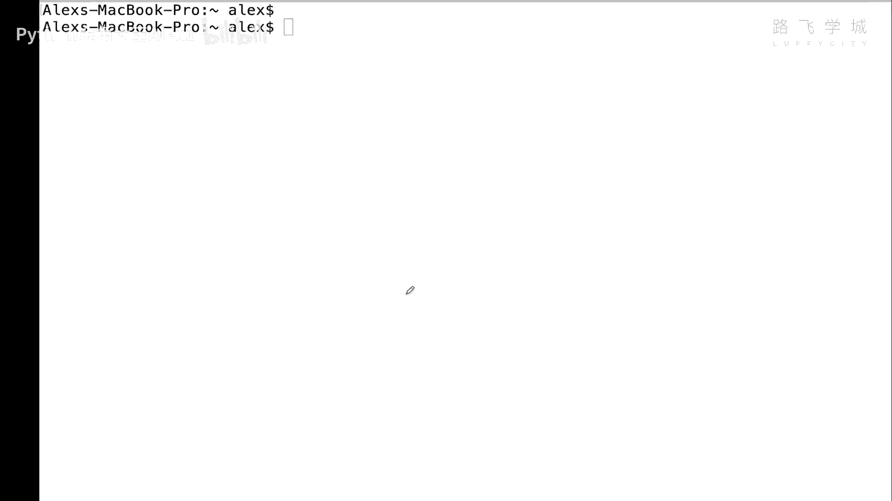

你要求你必须不能用这个什么呀，必须不能用这个这个这个这个数字开头，必须不能用关键字，这都是明确要求的啊，你不能这么干，但定义规范是什么呀，就是一般我们官方推荐怎么写对吧，是比较专业的那么一种方法。

OK吧，那这个呃怎么讲，定义变量名，它有两种方式啊，一种叫驼峰体的方式，一种叫下划线的方式，好吧，那驼峰体是什么意思呢，就是每个单词的首字母大写OK吗，每个单词的首字母大写。

比如说你看大家这个是age of old boy啊，old boy老男孩，老男孩的年龄56岁OK吧，老男孩年龄56岁对吧，你对不对，你你肯定不能这个中间没任何区分，它就是一个单词了。

你这样通过大首字母大写，然后这样能看出来好吧，或者是number of students ok吗，一般注意了，一般写这个什么呀，写这个C啊，CCC或者是c#的同学啊，c#的同学就是微微软程序员。

一般都喜欢这种命名方式，在Python里面这么写也是OK的好吧也是OK的，哎呀喝一口枸杞茶，那另外一种方式叫下划线的方式对吧，同样的单词叫age of old boy。

Number of students，通过下划线来区分OK吗，通过下划线来区分。

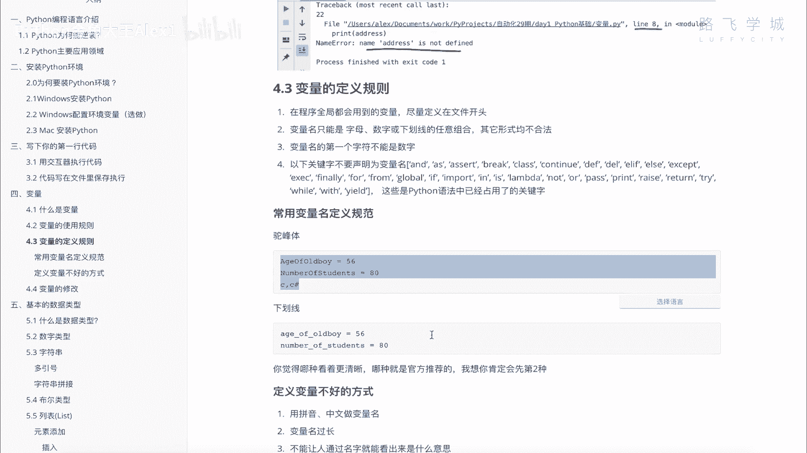

那同学们这两种方式是都可以的，除了这两种方式之外，其他的方式都是野路子出身OK吗，其他的你比如说一会大写。

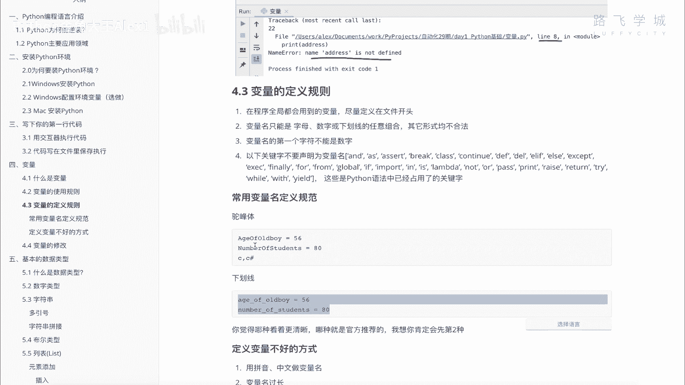

一会小写对吧啊，那都是不专业的，也录入设置OK吗，专业的也就是Python里也一样啊，你比如说你一会啊这个edge对吧，然后一会儿又下划线，然后of然后old boy，你这样我告诉你别人一看啊。

你到公司就把你开掉了吗，这个是非常不专业的写法，你要不然就统一都下划线，要不然就统一都驼峰体OK吗，所以你H5old boy这样是可以的，或者是up all the boy都是可以的，好了吗。

好用一种进行了。

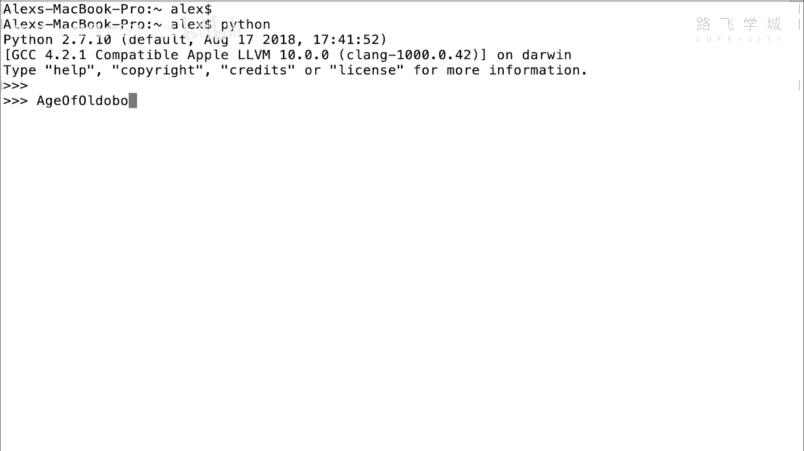

那官方推荐的Python官方推荐哪种呢，你自己看哪一种是清晰的啊，你看着哪个比较容易看清啊，是不是下面这一种啊，对不对，一看就知道哦，这是代表这个这个这个这个什么什么，老男孩的年龄对吧。

你这个你还得仔细瞅，不小心看成了ANGELABABY，ANGELABABY是不是ANGELABABY啊对吧，这个所以下划线，这种也是Python官方推荐的一种方式好吗。

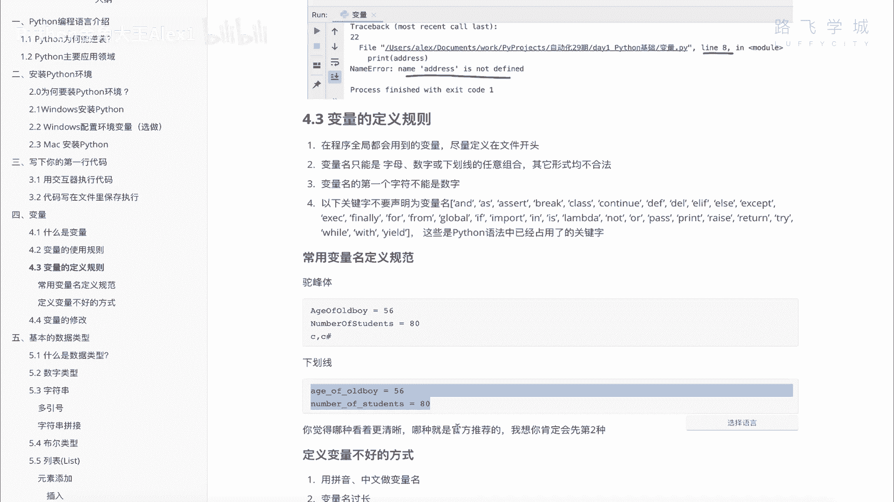

官方推荐的一种方式啊，那这个是呃这个呃命名就是写法，然后呢另外你定义变量有一些不好的方式，不好的方式啊，给大家看一下，第一个用拼音注意了，大家写变量名的时候一定不要用拼音，你看我虽然我这个英语很好啊。

不好好，就是这个即便你英语不好，你也要尽量的用英文，不要用拼音说啊，你直接是不是老男孩的年龄，我靠那他妈丢死人了啊，你这写的是吧，老对吧，老男老男孩啊的年龄啊，有人这么干啊，对不对啊。

暴露了你的学历啊对吧，这种是非常low逼的一种形式，千万不要这么写啊，不要用拼音，这跟崇洋媚外没有任何关系啊，没有任何关系对吧，只是大家都不这么写啊对吧，这个这个这个要用英文啊，这是一点，另外啊。

不要用中文做变量名，有我直接用中文做变量，发现了一个好小技巧啊，python3D你看啊我可以写中文，比如说名字对吧，等一个啊，这个阿历克斯亚历山大啊，阿历克斯诶，可可也，我靠竟然是可以的。

你看你这些print这个名字啊，也是可以打印的啊，很惊讶，注意了是可以，但是大家都不这么干，OK吧啊都不这么干，有一个编程软件编程语言叫E编程啊，易语言，对不对，这是中国人开发的，我告诉你。

那就是闹着玩的，那玩意儿根本就不能取。

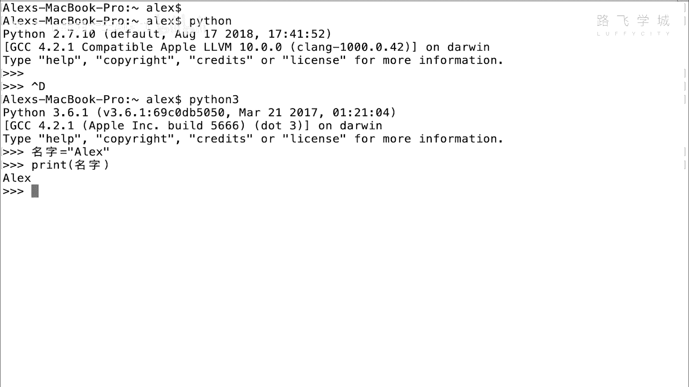

不能写代码啊，写项目注意了，不要用中文名字。

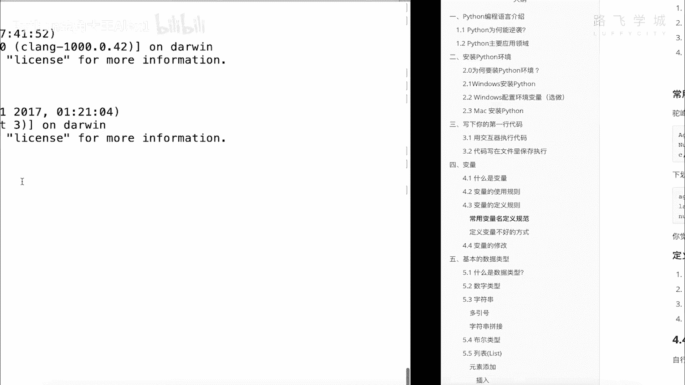

OK吗，我说另外一个变量名不要过长，不要过长，对不对啊。

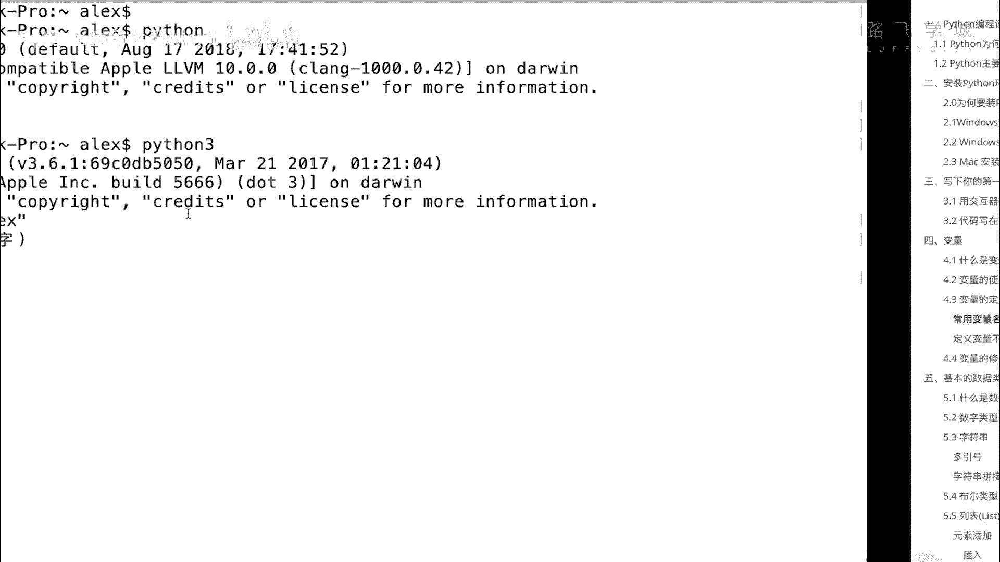

这个你比如说请一个啊ALEX一共有多少个女朋友，对不对，number啊of alex girlfriend对吧，Girlfriend，我告诉你这个其实就有点太长了，OK吗啊，那你要简化怎么写呢。

简化怎么写呢，啊比如说一共交了18个，对不对，那你简化其实就是可以这样写，不要写全number of啊，这个LGF看到没有，这个其实也能看出来啊，number就是你对吧，你或别人对吧，大家一看也知道啊。

就代表他的女朋友多少，这个对不对，就简化了啊。

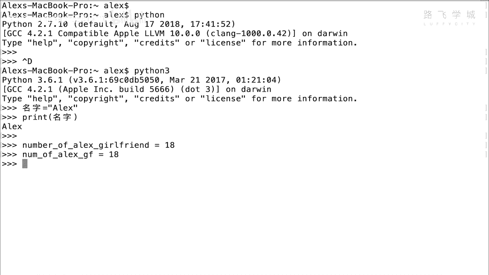

尽量不要写太长的名字，另外啊你注意了，不能让人通过名字看出来什么意思的。

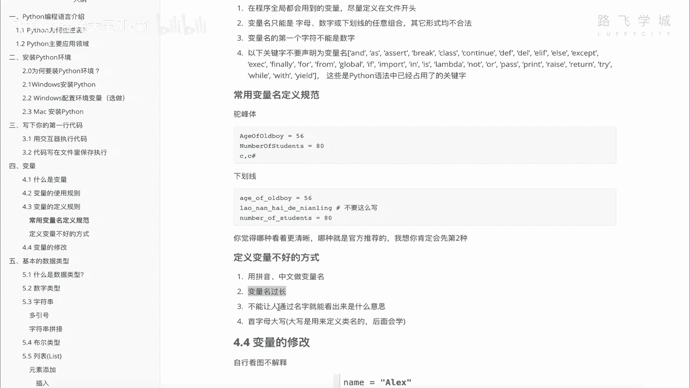

不要写，比如说有人写这么啊对吧，VARVR都喜欢这样写，Vr variable，VR就是variable，是英文的变量名的这个英文意思啊，所以有些人就直接缩写就是VR，VR1啊等于一个什么VR。

二等于一个什么VR，三等于一个什么，完全毫无意义，别人也不知道这个代表什么东西，能理解意思吗，尽量不要这么写，你要写清楚啊，我这是个age，我就写啊，age对吧，我是name，我就写啊，是name。

对不对，写name ok啊。

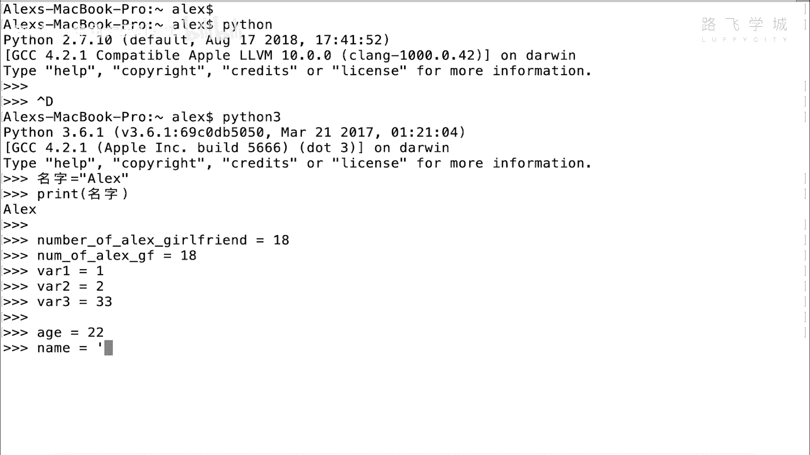

尽量要让它有意义，再一点就是首字母大写。

首字母不要大写啊，在Python里面啊，建议虽然可以写驼峰体。

但是官方不建议你用驼峰体，Python里面建议用下划线，所以你的首字母要大写。

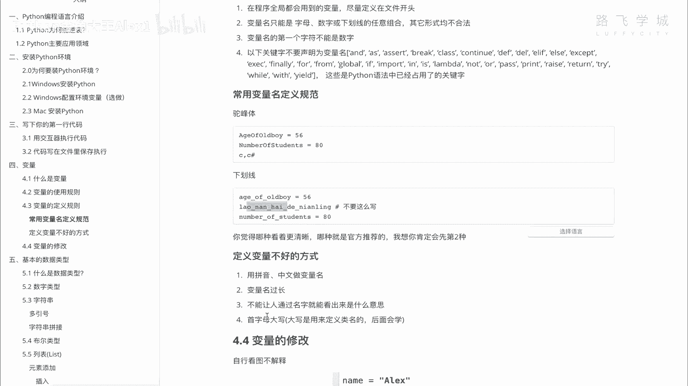

你说啊我这个name对吧啊，等于一个什么什么不要这么写，为什么，因为首字母大写，字母大写的这个变量名，或者是大写的这种啊定义的这些东西啊，这些变量是有特殊意义的。

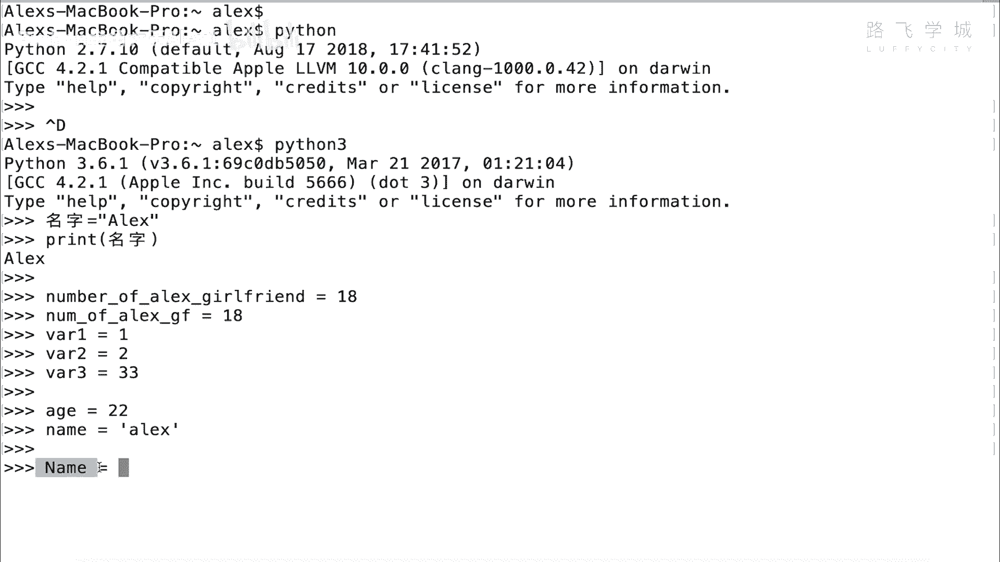

后面我们在学面向对象的时候会讲到，总之在这个时候你不要用大写就行了，好吧，这个就是定义变量不好的几种方式。

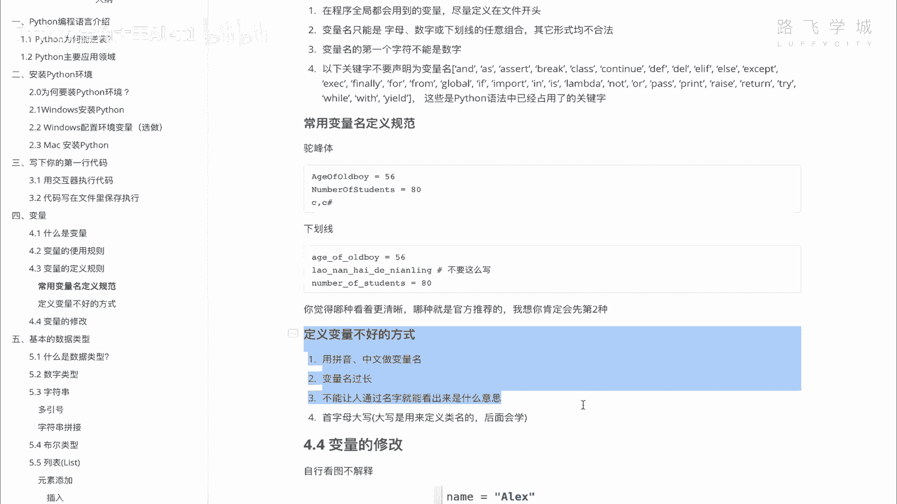

大家自己要注意一下，OK好的啊。

