# 【2024年Python】8小时学会Excel数据分析、挖掘、清洗、可视化从入门到项目实战（完整版）学会可做项目 - P81：13 实战-给员工批量自动邮件发工资条 - Python金角大王Alex1 - BV1gE421V7HF

Hello hello，同学们，大家好，我是过气网红讲师金角大王ALEX，那这节课呢，我们给大家来讲一个比较有趣的小工具，就是用Python给员工啊，B自动批量的发工资条，为什么要做。

这个是因为我们公司啊，这个路飞学城作为沙盒500强企业，那个有好几百号员工啊，这个每个月发工资的时候呢，在咱们财务人员就需要给这个每个啊同学对吧，就是一对一的这个微信私聊啊，给他或者是邮件呀。

给他发这个工资条，这几百个号，几百号员工，他就他就每一个粘贴复制粘贴，复制那个需要花好几个小时的时间，我说你这个很简单呀，直接写一个脚本，批量的把你这个公司的这个这个所有人，对不对，邮件地址拿到。

然后批量的给他们发工，每个人发自己的工资条，就2分钟就搞定了啊，他就很惊讶，他说不相信，我就给他要做了一个啊，做了一个我觉得挺有意思，就把它做成咱们的一个小课啊，那好发这个工资条发一个什么样的格式呢。

啊咱们这个工资条就是我我这边能拿到的东西，就是说咱们员工的工资表啊，员工工资表，那个财务给你提供员工工资表，一个excel，一个excel文件里面一条就是一个员工的工资信息。

然后你需要把这个excel里面的数据拿出来，每一个呢就找到每一个员工，拿到它对应的邮箱地址，然后给他邮箱发一个类似这样的一个工资条，看到没有啊，邮箱类似这样的工资条，这样就这么简单的一个需求对吧。

我们已经学过用Python怎么操作excel，用Python怎么去发邮件，把它俩一结合，这个事不就解决了吗，对不对，那好，现场，我就花20分钟时间把这个功能给大家试下。

好不好啊，咱们快速的构建这个代码好啊。

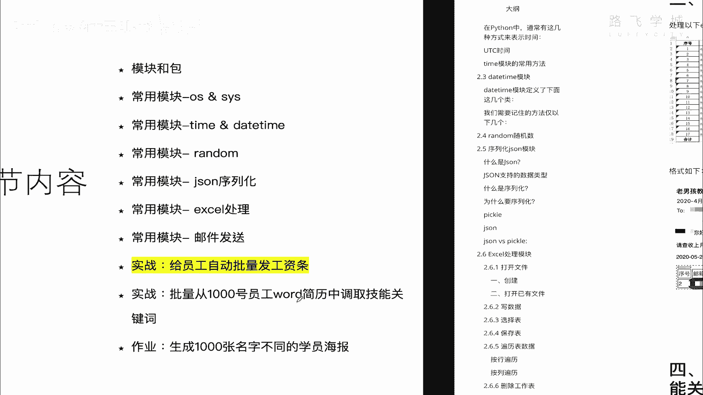

这个来直接sorry啊，直接在这里啊，day6里面我们创建一个啊，这是员工发工资的一个脚本好。

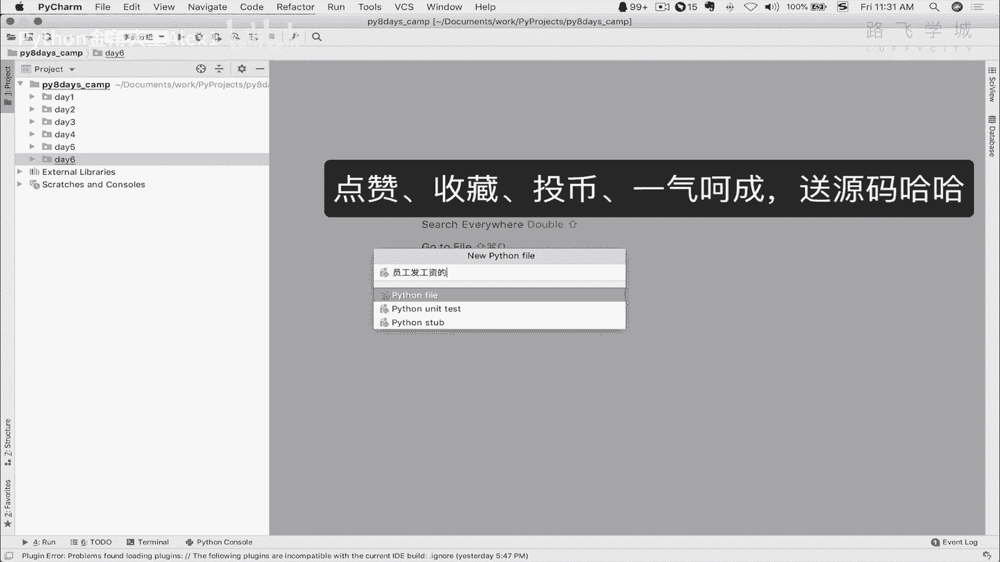

那我这里呢已经创建好了，这个已经拿到了这个工资表啊。

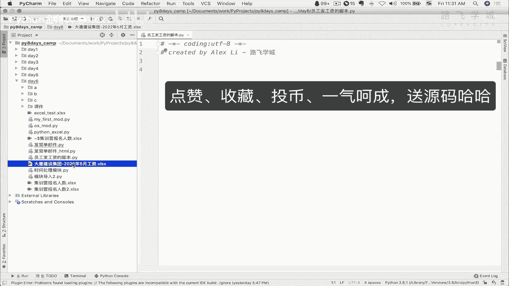

工资表啊，给大家来看一下这个工资表，这个我当然觉得啊就给他匿名化了啊。

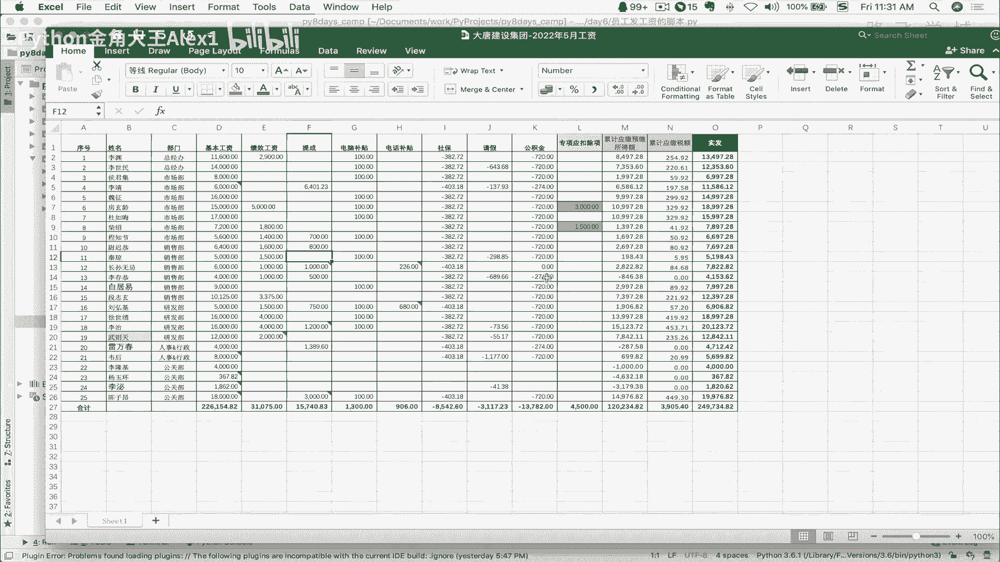

这个是大唐建设支集团的。

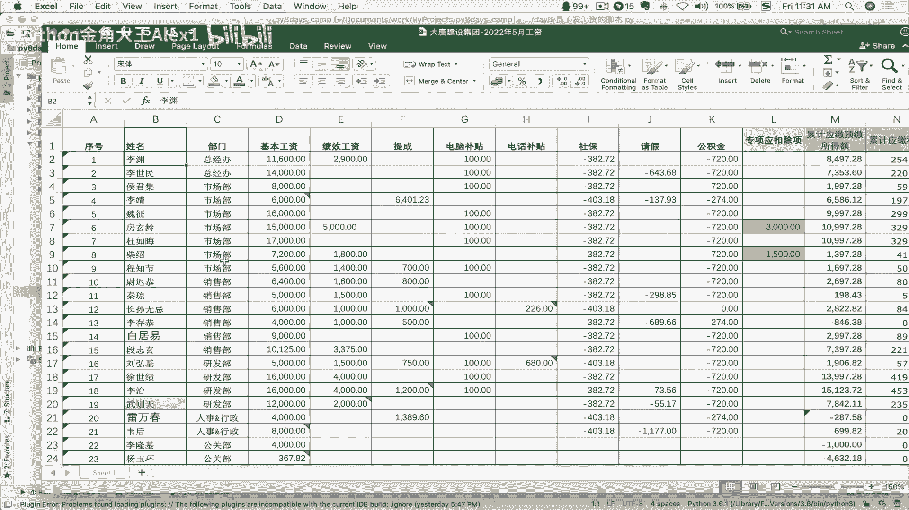

对不对啊，注意了，你拿到这个工资表之后呢，那你肯定要给这个每个员工对应的发，他的这个就是对应呃，他的这个邮箱给他发嘛对吧，对应邮箱给他发，我们其实我们肯定要先干一步，就是说把这个名字和这个邮箱对应起来。

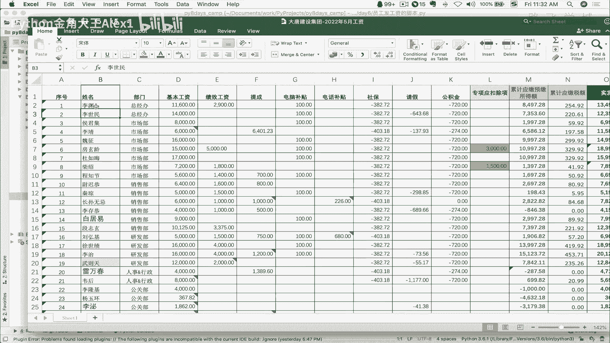

所以呢我在这里插入一列啊，这个系列就叫邮箱，好吧啊，把每个人的邮箱可以放进来啊，然后我为了调试，我就先全放我自己的邮箱了，别别别别别别发，调这个测试过程中给人发错了，那他妈的可就了啊。

remove这个ALEX的邮箱。

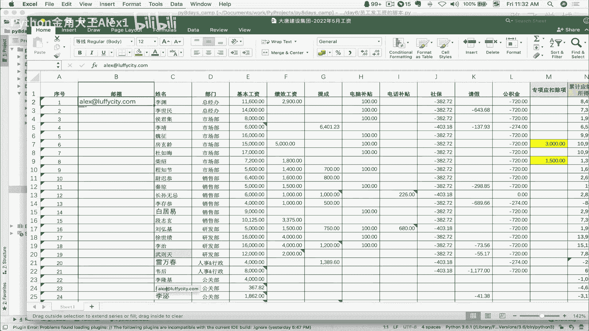

然后啊到这啊到这，然后呢我们需要用Python，说白了其实就是把这个内容给他读读，就是读到内存里，然后就调用那个邮箱发的，那个就就就发就完了呗，对不对，我先把它保存一下。

然后我就直接咱们去打去处理这个文件呗，你要用Python处理这个excel的话，咱们上节课讲过就是open excel，是不是，同时当然我们也要导入一个什么s m t b lb，这些啊，那一会儿用啊。

直接咱们先来去干嘛呢，加载这个第一步是先要加载加载这个excel文件，是不是excel文件，然后呃这是第一步，第二步才是去循环这个excel文件，相当于你你循环你这个excel表来，我给它最大化。

对你要循环你这个excel表，然后每一行去给他拿到这个邮箱地址，把这些数据给他发过去，是不是啊，嗯OK那我们就加载excel文件，然后还记得吗，是不是这个呃呃ort open excel。

然后哦sorry sorry，不是这个这个input是from open excel import，这个什么load，是不是啊，然后我们就直接load workbook，然后写上我这个地址是吧。

嗒嗒嗒嗒嗒嗒嗒嗒，我觉得技术是为人服务嘛，所以你发现你写的东西能提高人的效率，还是挺开心的啊，这个接下来我们就直接啊干嘛呀，先循环一下这个excel，然后哪哪就是就是把每条数据都拿到了。

我们先要拿到一个干嘛呢，当前的这个表是不是就是当前表怎么获得来着，sheet等一个WB点active，其实就获得了当前的这个活跃的这个表，对不对啊，我们可以print一下，看一下执行又单机哎。

是不是就是这个一啊，然后我们接下来是不是可以循环sheet，1for这个肉音这个sheet啊，然后啊print row，是不是其实你就拿到了每一是不是每一行啊，然后我想拿到每一个单元格的数据。

是不是就是for sale in这个肉是不是，然后print cell点value是不是啊，然后按一下等于一个什么啊，这个吧别让它就是全拼在一行了，然后print一下加一个换行。

大家看是不是数据已经拿到了，对不对，数据已经拿到了，很简单啊，哦这里有这个公式的吧，这个不关心啊，不不重要，那这个时候我是不是就拿到这个啊邮箱，然后把这些数据给他，把把这一条的数据给他发过去就可以了。

是不是好，那很简单，我们拿到，那接下来呢我们要做的事就是呃干嘛呢，直接在调用这个邮箱的服务，然后咱们上节课就讲的邮箱里面是不是嗯，嗯发展的邮件，然后导入这几个东西，是不是啊。

而这几个东西然后呢我们是不是要构建先登录，肯定你要登录那个什么登录那个邮箱嘛对吧，登录邮箱的话，然后我们就直接啊直接就可以先登录了，因为你你不用循环一次登录一次嘛对吧，就你可以一次性登录完啊。

一次性登录完，我们可以直接在这里啊就登录邮箱，登录这个邮箱服务器啊，这是我的域名端口，然后IP地址，而且域名地址密码，用户名密码登进去了之后呢，同志们，接下来呃这个叫什么循环excel啊。

接下来呢我们是不是要构建这个什么呀，构建这个邮件的正文，是不是就是你把邮件正文构建好，构建邮件正文呢，咱们可以干嘛呢，就先把这个邮件头给它构建好对吧，邮件头这个是啊，这个这个这个这个这个对from。

对不对，来自于哪，然后to哪对吧，咱们把它copy过来啊，这样我看一下啊啊对，先先去要写一个，这个是构建邮件正文的，对不对，咱们之前学的构建邮件正文，这个是构建邮件头，我们可以先把邮件的正文拿到啊。

这是message啊，body body等于一个叫mi text，是不是，然后里面就写你这里面的内容嘛对吧，就是这个NB啊，这个第一个参数是不是就是你的MBODY对吧。

第二个是不是你的HK咱们可以定义成HTML格式啊，第三个就是你的这个编码UTF8，是不是前面的你是ml body啊，我们可以写ml body context，context是内容的意思啊。

然后sorry，然后你在这里面其实就可以写东西了对吧，那你在这里面要拼凑的就是咱们啊。

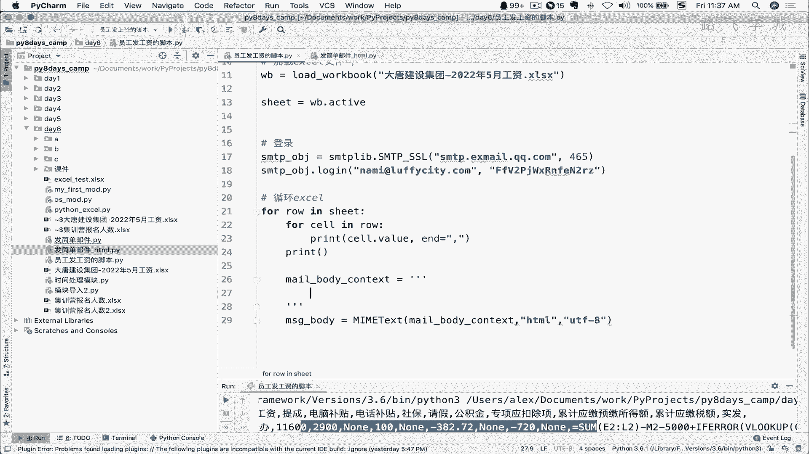

要要把这个拼凑拼凑成这种一个表格的格式，对不对，那我们先把先先先这样。

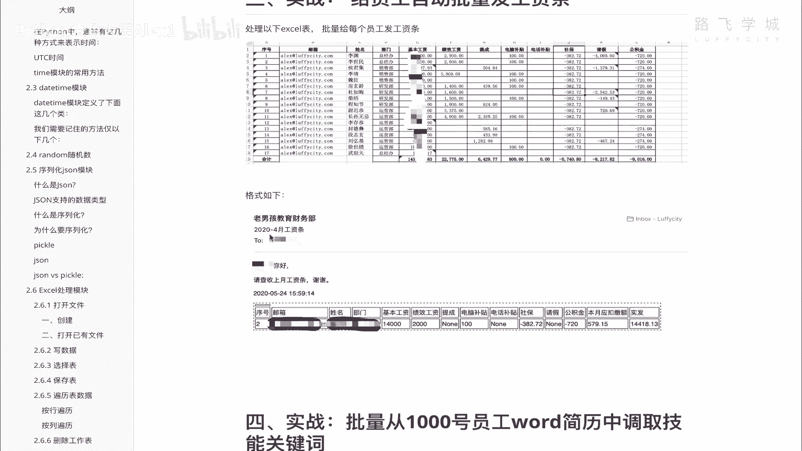

先把这个啊这个这个这个谁谁谁名字，你好，然后查出工资条写上了是吧，这里就是啊HTML格式的HH3吧对吧，然后这里写成一个F是吧，这个谁谁谁呢，就是好PRINCEL，其实你是要从这个excel里面。

你要拿到这个人的名字，是不是拿到人这个名字名字的话，我们来看一下啊，我们来看一下，就是他叫他叫啊for ro。

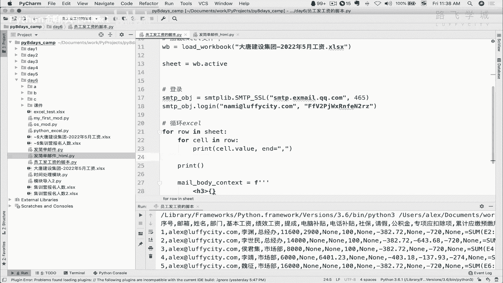

这是一行，然后拿到他的名字，名字他应该是单元格的第几个呀。

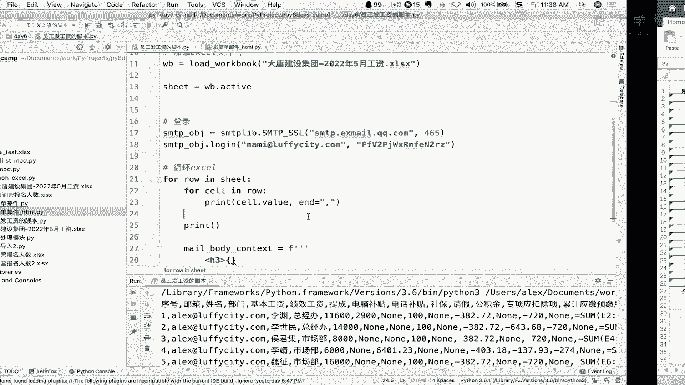

看下excel，这是从一开始123啊，就是应该是肉三，是不是name啊，等一个肉三对吧啊漏三，然后漏三的我们就直接漏三点啊，value对吧，就是拿到他的名字了，然后你好啊，这个对吧，上请请查收啊。

请查收啊，你这个哪年对吧，2022年5月的05月，这工资条现在是不是啊，这个钱少了，这叫来找我是吧，我不管我只管放对啊，这个是稍等啊，写一个写一个段落，OK这样接下来这里面其实就是他的工资内容了。

对不对，工资内容我们可以把这个什么呢，先把这个工资先随便嗯，我想一想啊，把工资放进去的话，怎么放进去呢，工资放心，他现在是每一个单元格，你现在是循环着呢对吧，循环着那呃循环着才能拿出来，我们可以这样。

我们先把它拼成一个文，拼成一个字符串，拼成就把每一行拼成一个字符串，然后把它放在这里，当做一个变量可以吗，然后我们就这个叫肉啊，text等于一个把它放到，把它放到放到放到这个地方。

在这个地方ROTT先等一个空的，是不是啊，然后在这里开始给他拼嘛，拼就是啊roll text加等于一个什么呀，加等于一个四点啊，cell点value行不行，然后稍等啊，f jump给他拼一个格式。

cell点value，然后加上一个逗号，可以吗，加上一个逗号，这样它就能拼成一个先能拼成一行，类似这样的格式，一会再给它改成表格好吧，拼完了之后，这个ROTT就把它放到这里，看到没有啊，把它放在这里。

这样的话啊，这样的话其实一个最简单的格式，就是它还不是一个类似这样的，他只是至少是一个文本格式的，一个工资就应该算出来了好吗，工资就算出来了，我们来呃这个什么呀，你们看看啊，就是邮件的正文啊。

已经构造好了，接下来我们要构造什么呀，邮件的表头啊，表头信息对不对，表头邮件到邮件的头信息，把这几个放过来啊，把这几个拿过来后，这里是message body啊，给它改成message。

给他A给他改成max body，然后from from就是大唐，哎在，大堂人事部对吧，然后呢发给什么呢，这个大堂，这个啊这个这个这个大堂员工是吧，然后标题是大唐建设集团啊，这个2022的05月啊。

工资这个都是可以改成动态的，以后自动检测，这是这是哪月就可以把这个填进去，好吧，这没问题，那这里都弄好了之后，是不是啊，这个相当于呃每一行的数据拿到了邮件的正文，也拿到了邮件，那个头也够了好了。

接下来我就直接发邮件，是不是就可以了，发邮件啊，就给这个人发邮件，注意了，你要发邮件的话，同志们嗯怎么讲，你这个是这个是你得拿到这个邮件地址，是不是啊，嗯这个这个人的姓名是拿到的啊，拿到了邮件地址是二。

是不是mail，邮件地址是二，这是呃receiver啊，staff mail吧，员工的意思啊，下email等于一个roll2点value啊，这个是62点value。

然后拿到了之后把这个发邮件直接是是什么呀，S m t p o v，这一点是因为咱们前面不是已经登录完了嘛，对不对，OV这点，然后send mail对吧，然后第一个是什么来着，第一个是从哪里发的。

就是是从谁发的，谁发的，就是我这个纳米这个嘛，UCCC点我的邮箱发送者的邮箱，然后收件人注意了，这里要改成一个列表的形式啊，可以发多个，也可以发一个，我在这里就发一个收件人，就是收件人就是叫什么呀。

Staff email email，然后接下来就是你的这个邮件了，是不是message body啊，message body点as string，是不是as string。

那这样同志们你这个邮箱就可以发出去了，看到没有邮箱就可以发出去了，然后我在这里打印一下，发完一次，然后如果成功了，就是成显示啊，F成功，成功发送啊，这个工资调到这个哪个邮箱呢。

就是呃staff email可以吗，然后然后然后可以加个名字，就是name点sell name value可以吗，发给他，这样的话，同志们啊，基本上一个最简单的就写完了。

相当于循环你这个文件拿到每一行的，拿到每一行的这个数据，是不是啊，然后呢接下来就开始去发邮件啊，开始就发邮件，我们可以打印，这个就不用了，不用打印这个东西了是吧，就直接可以开始去发是吧。

整个大循环每一行发一次，每一行发一次，明白吗，OK那我这个登录啊写到了外面，写到循环外面，是因为为了避免每发一条就就登录一次，我这我这已经登录完了之后可以发很多邮件，可以吧，好我写完了执行一下啊。

执行一下哎，大家看报错了，说什么UNICODE什么encode error，就是这个编码错误，说阿斯克码什么什么不能去编码，是怎么回事，第44行，第44行也就是这里啊，发送的时候编码错误，哎。

我们已经as string了呀，然后并且这里已经写了UTL8啊，写了写了写了写了UTL8了，怎么会报错呢，哎没问题，我们来去这个啊啊调试一下，调试一下啊，这样啊我看一下啊，首先这块没什么问题对吧。

咱们写的没什么，难道是不是我们这个发的这个邮件，邮件地址的这个地址呃，写的有问题的，我们来看一下我们这样，那打印一下这个staff mail好吧，打印staff mail和这个name吧好吧。

name按执行下，来，Oh，哎，我看一下打印姓名，Print stop，是个姓名啊，哦对诶不对，我这个一点，第一我看是什么谁的一点，第一我写的不是名字吗，啊一点第一第一卧槽，第一怎么是跑到这里来了。

怎么是部门的呀，哦我靠，我弄错了，那他我我我知道了我知道了我知道了，你看啊，我这个第一，我这个就是我明明打印的是邮件地址，邮箱地址和姓名，但是呢他这里却写着staff staff入二数。

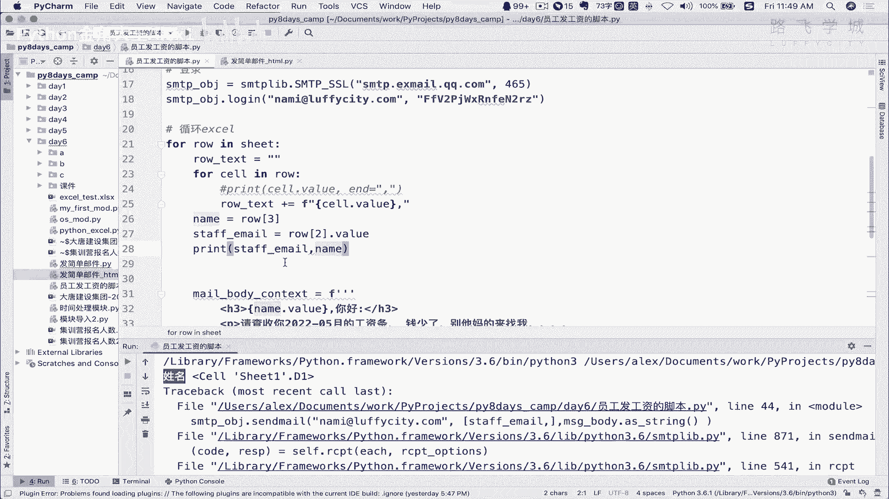

staff入二的话，它就显示的是姓名的话。

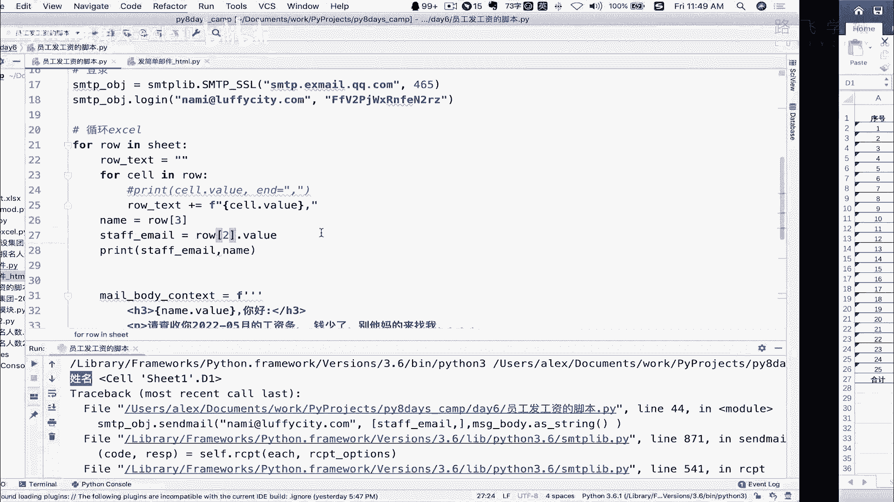

那意味着二就是姓名的话，那它是从零一开始零开始的，我记错了啊，这是123对吧，他应该是从零开始的话，那就是这个是一，这是零，对不对，应该是这样是吧，那我们在这里改成一个一一的话，是不是打印的是邮箱了呢。

先看一下对，这里是邮箱，然后姓名的话那就是二了，对不对，sorry啊，姓名的话他是不是就是二啊对吧，没问题，看一下哎，你看还是报错，同样的错，但是同样的错，然后六点直接点value就行了。

那为什么还报同样的错呢，同志们，同志们，那是因为注意了啊，你看你看他现在相当于循环第一行的时候，拿到的这个拿到的这个邮件的地址，应该是一个邮件地址，但实际上拿到的是一个什么邮箱的名。

这个邮箱名当做一个啊，这个这个邮件那肯定不对嘛，所以呢他就报错了啊，报错了应该是这个样子，那我们正常应该是让他从第二行开始去去呃，这个循环要去循环，然后发送数据，是不是啊，那怎么办呢。

那我就把第一第一次循环给它剃掉啊，第一次循环替掉，运循环替掉很简单啊，咱们是不是学了这个啊，这个叫short sheet点，it r it rts是不是还在这里面可以定义好。

mean rosorry mu是吧，是从第一行开始对吧，从第一行开始，也就是把第一行去掉，第一行替哎，就应该写从第二行开始啊，第一行咱们来试一下，没关系啊，把写成名录写成二，从第二行开始。

他这个行是从第一开始的，看大家看是不是是不是发送成功了，对不对，发送成功了，全都发到这个给李世民，李渊全都发到了ALEXLOC啊，路飞city，那这样的话我们就来去检检查一下，看看有没有呃。

这个这个发到我的邮箱里，大家来看一下这三条确实是不是发过来了，看到没有，每个人的名字是不是都不一样啊，都不一样很好，只不过这里这个格式还不太好看对吧，我们把这个格式改成，呃就是类似那种表格的。

像像长成这这这个样子的格式是不是就解决了，OK吗，哎那个就很简单了，OK那改成这种这种格式是怎么改呢，咱们注意了，其实它无非就是一个什么呀，无非就是一个HTML的表格。

是不是那HTML咱们如果咱们现在还没有讲，但是没关系啊，就很简单啊，很简单，我先在这里给大家随便写一个HTML，简单的HTML文件啊，写一个HTML，看到没有，咱们就在这里写一个表格。

这个test再点1ml，那啊注意了，前面这些东西你都可以忽略，就在这个body里面写东西，写东西，这里前面呢它就是一个标签式的，就是看到没有，就是这是开头，这是结尾啊，斜杠结尾。

然后呢你要想写一个表格就很简单，直接是table，看到没有table，然后在这里面写写什么呢，比如说先写一个，先写一行是吧，先写一行t r tr就是table room，看到没有。

在这行里面写这个什么呢，写一列列的数据，TDTD就是一列TD就是一个单元格的数据，看到没一个单元格的数据就是name，然后这里面就写内容了嘛，对吧name，然后TD啊，这个age。

然后呃这个这个这个这个这个sex是吧，性别，然后呢，同志们，这就一行就写完了，就超级的简单，接下来你写第二行是吧，再写第二行就开启，又写第二行，然后在这里面把这三个copy过来对吧。

你就写我的是ALEX，然后22，然后我是mo对吧，男同志们就写完了，你一个最简单的表就写完了，然后点击一下看看到没有，是不是就出现了这种格式啊对吧，哎你说这看不出来这个表格呀，你加这个看到没有。

这样看的是一个表格了吗，你可以给它加样式，让它变成一个表格，怎么加样式呢，直接在这个table这里加一个style style，就是给这个表格加一个样式，然后呃写上border等一个一啊。

这是1px solid black吧，其实就是给它加一个加一个加一个solid，就是一个实现啊，实现大家看是不是加上了这个表格呀，是不是加上表格呀，然后你你可以在里面，每一应该是每一列还可以加表格对吧。

每一列加一个，但是每一行加呀还是style哎，这是不是在这里就可以加，就直接写border啊，就直接在这写border等于就行对，直接这样写就可以，我们来试一下啊，你就不用在这里写excel，在这里加。

应该他会把每一个单元格都加上，看到没，每一个单元格都加上了是吧，哎虽然有点丑，但是最简单的表格它就已经实现了。

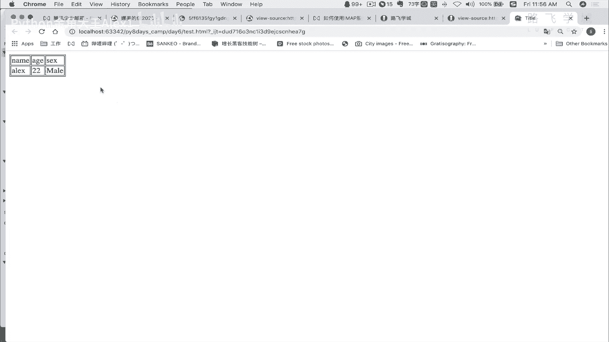

明白吗，已经实现了之后，我们其实就可以干嘛呀。

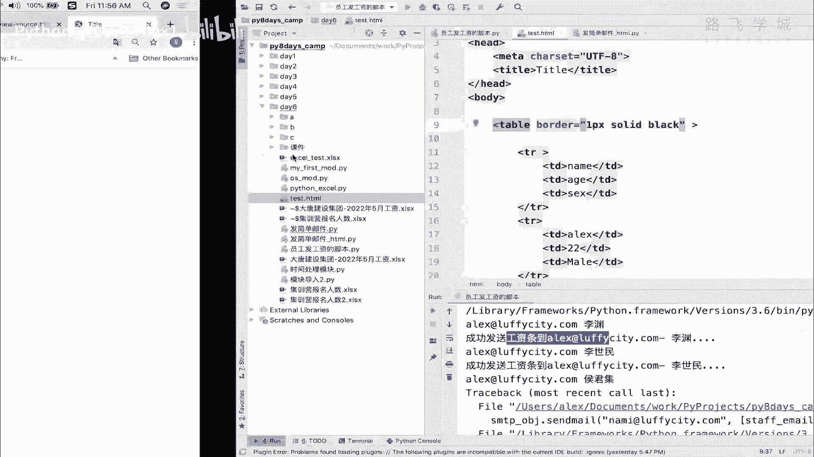

说白了在Python里面，在在咱们这个脚本里面，写出来一个这样的就行了。

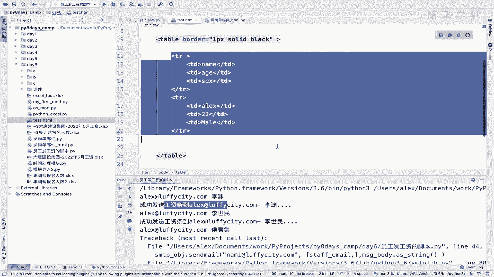

只不过我们在这里是手写了一行行的，但是在Python代码里面，我们是不是可以可以。

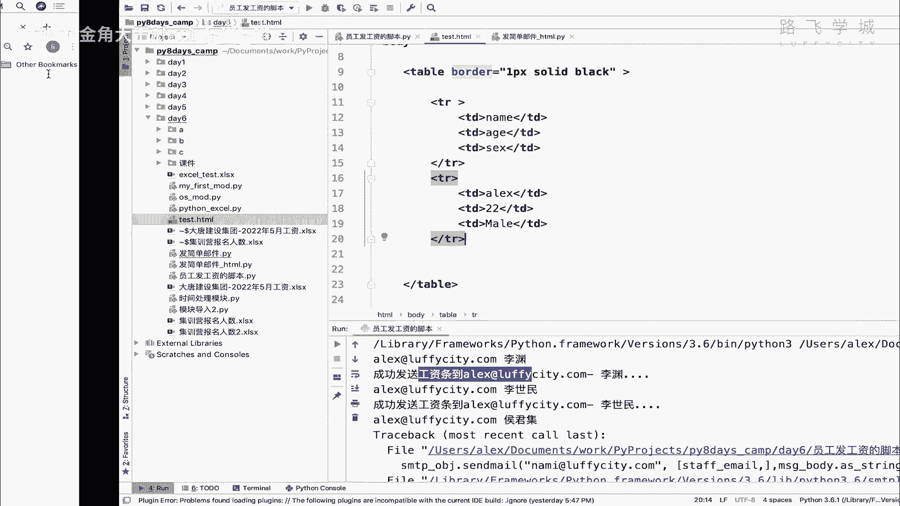

通过代码给它动态的生成这些数据啊，那好了，那咱们就来动态生成一下这个数据啊，啊直接是什么呢，在哪里呢，在这个ROTX这里看到没有，ROTX这里其实我们只需要负责啊，生成什么呢，只需要负责生成啊。

大家看这个table这个表头啊，就是这个table的这个表，这就是开启一张表的这句代码，我们可以先提前写死，其实我们只需要动态生成每一行就行了，能理解意思吗，我们就直接生成一个tr。

每一行就是一个TR嘛，里面就是TD嘛，给它拼凑就可以了嘛，对不对，呃，X sorry，乱了乱了乱了，大家看我们啊road text，然后我们就开始tr1行，开始一新的一行，然后呢在里面就是什么呀。

里面它每个就是什么TD，对不对，然后这个不用加这个斜杠TD是吧，TT开头，TT结尾，这就是一列，然后这一行生成完了之后啊，甚至这一行完事之后对吧，在ROTEXT加等于一个，把这一行要结束嘛，对不对。

那好从从这开始到这这一行，这一行是不是就结束了对吧，开始一行对吧，结束一行好，那这样咱们就把这个low text，是不是就加到了这个my body里面，对不对，MBODY里面，然后呢注意了。

我在这里面肯定要写一个什么呀，写一个呃，那我把P可以放到外面了，可以放到这，对方在这，然后我单独写一个table是吧，因为你这个毕竟你这个tr需要一个table，包起来嘛，对不对。

那我们在这里写一个table table写词，啊table，然后，这里面可以写上，把这个直接copy过来就可以，对不对啊，直接copy过来，那这样的话，其实就相当于在这里面拼了那么一行出来，明白吗。

那这个时候我们就再来执行一下，看一下效果好吧，哎发过去一条就可以了，我们来看一下我们的大唐建设集团，看着啊，哇哦出来了，同志们是不是先先别看这里面乱，但是是不是确实出现了一个这样的一个情况。

那非常好非常好啊，接下来还差最后一步，看你看这个它是把公式直接给他倒过来的，直接给把公式搞完，因为这是算公司的，算工资的一个公式嘛，你看啊，Sorry，你说这个你看他是用这个得用这个得出来的，对不对。

那用这个得出来的呃，那可怎么办呢，那可怎么办呢，我能不能就是它很显然是Python，把它发到我的这个邮箱里的时候呃，他没有把数据拿过来，而是把公式拿过来了，这可怎么办，我只想要数据算出来的结果。

不想要这个公式，他直接把它当文本拷过来了，怎么办，很简单，可以啊，这里教给大家一个小技巧，直接在打开excel的时候，打开excel的时候，在这里加一个叫data only，等一个to。

他这样的话就会直接把公式给你算出来来执行，看一下，发给他了之后再来看，同志们是不是拿到了这些数据，明白吗，拿到这些数据好，非常好完美，那接下来还差最后一小步，最后脚步就是什么呢。

你看啊你看在这里你发给这个工资条，人也不知道哪个是代表工资，哪个是代表什么什么什么，对不对，你你得把这个表头给人加上去，是不是你表头是什么呀，表头是就是类似这样的一些信息。

是不是你得把这些信息给人家加上，在每个邮件里，对不对，那可怎么加呢，同志们可怎么加呢，其实也很简单，我觉得应该也不难，直接咱们还是直接在里面偏一行，表头是不是偏那么一行表头，当然你可以写死了。

拼也可以动态去拼啊，动态去拼，动态拼怎么拼呢，其实也很简单啊，也很简单，我们呃直接拿到第一行第一行的这个，因为这个excel表sorry，这个excel表第一行，把这每一列的数据拿到啊。

给它放到一个列表里，最后再循环这个列表，给它拼成每列，是不是就可以了，注意了，把这一每一列的名字啊，这个这个列名放到一个列表里，最后循环这个列表拼成一个字符串。

拼成一一个table1行的字符串是不是就可以了，明白这意思吗，好那我们就来这么干啊，这么干啊，怎么怎么办呢，那我们就不用mean ro等于二了，还是从一开始，但是只不过我可以判断这个肉的啊。

呃判断这个肉的这个是属于哪一行的，哎，print row点index吧，应该是肉点index吧，六点index打印一下DR肉吧，好吧，看这个肉里面有什么功能，记得诶，诶。

我记得应该有一个能判断它是属于现在第几行，index吗，那不就是index吗，是的，count是干嘛的，可以试一下，roll点count啊，肉肉点index怎么不好使呢。

I都是个built in built in in the all，我知道了，他得加那个什么，可能得加那个加函数，是不是，不能加函数吗啊不能加括号吗，At least one argument。

There in the what the，那我得看看count是不是count不行，那我们自己想办法吧，这个反正拿到他的是第几行，很简单啊不行，那我们就这样很简单，就判断它是第几行就行了。

加一个count嘛，大不了对吧，等一个零嘛，对不对，然后这个每次count加一嘛，对不对啊，count加等一个一，是不是啊，然后我们就来判断if count加一，if count等于一个一。

这不是代表第一行了，是不是啊，first room first road的话，对吧，first road的话，那很简单呀，我们就直接干嘛呢，在这里面把里面的每一个每一个列给它拿出来。

是不是我们就直接啊在这里生成一个header啊，叫叫table header，header table columns列名对，吧给它空列表，然后for循环for这个for这个coo l等。

in这个什么呢，in这个肉是不是啊，然后呃col点就是table column names，点append col就是这个列名的value吗，是不是就可以加进去了，加上去了，对不对，加上去了之后。

最后啊，那如果是第一行可以这么干，其他的，那其他的就是else else是下面的这种，对不对，也就是加了一个，也就是加了一个判断了，明白吗，好那这样之后，这样之后咱们最后来打印一下这个什么呀。

打印一下这个等这个table循环结束，我print一下吧，唉FI对，print一下这个table cos name，对不对，我们先break一下，不让他往后走好吗，我来执行一下。

大家看是不是拿到这些信息了，拿到这些信息之后很简单，我们就直接干嘛呀，直接既然拿到这个信息了，我们就在什么啊，在这个地方拼凑就行了呗，是不是啊，在这个地方拼凑，我看看拿到之后，我直接嗯嗯这样吧。

我直接在这里拼凑好就行了，叫table啊，这个啊这个叫列名，是不是column，HTML这个是我就生成一个生成一个叫什么呀，生成一个HTML格式的一个列名啊，就是列列就是表明嘛表头嘛，是不是。

那我在这里依然是先生成一个空，我在这里直接拼嘛，拼的话哦，我想起来了，我好像都不需要给它加到这个里面去，加到这个列表里，我还要再循环这个列表，我直接在这里拼就完了呗，对不对啊，太聪明了，我直接在这里拼。

直接在这个地方就开始拼，怎么拼呢，就直接是我先在这里写一个TR，是不是TR，其实呢我告诉你在table里面真是，如果你是一个列名的话，其实应该是TPH对t head，这应该是t head t head。

咱们看一下它会自动加速，哎，怎么加错了，难道是T吗，TH看一下啊，咱们的前端也玩的不溜啊，不行啊啊TH看到没有，他前面是TH的，这里写TH它就可以自动的加粗了。

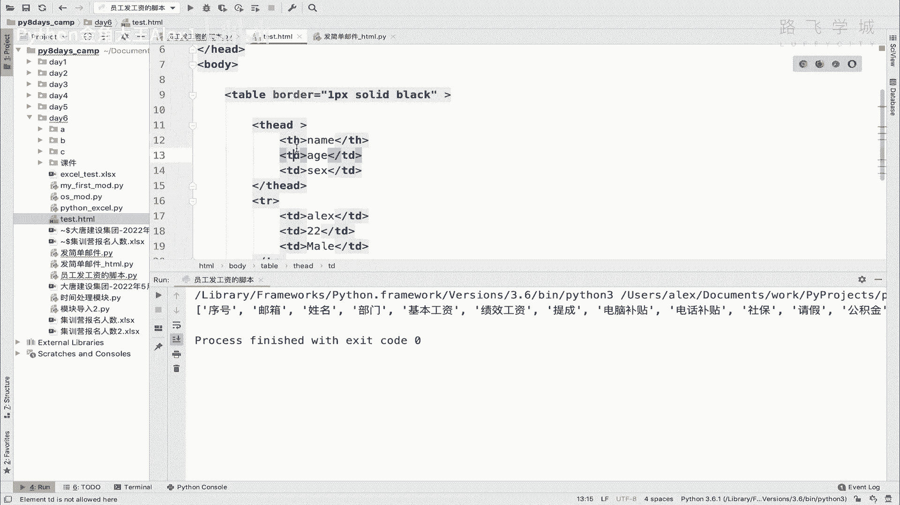

对不对，也自动加粗了，大家来看一下是不是加粗了，那这个时候那很好。

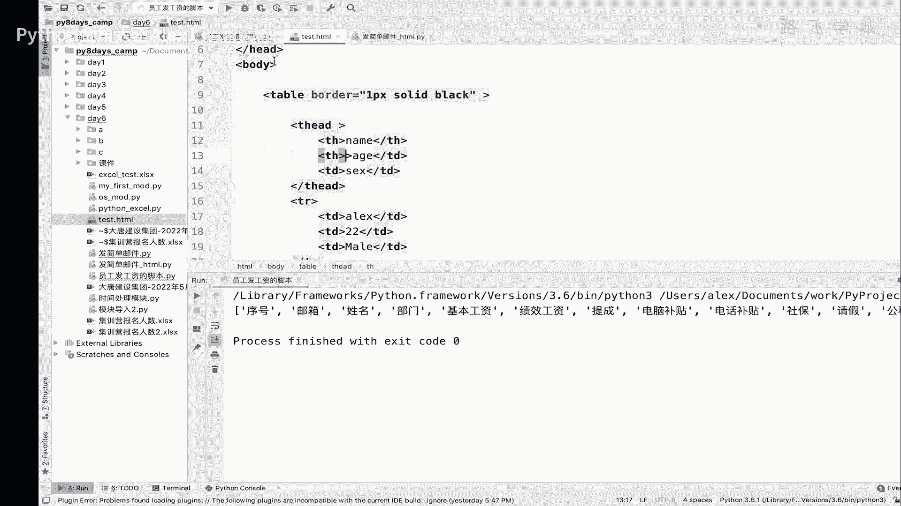

我们在这里就给它改成一个叫t head好吗，然后这个在这里面就是就是就是啥table column，Table columa tml，然后呢加加等于一个什么啊啊TH，然后里边写你的数据是吧。

这是COL的，是不是COL的value啊，对不对，然后TD啊，sorry t h对不对，这是一个列，然后最终整个循环全完成之后，再把这个table column HTML再加等于一个he had。

是不是就结束了对吧，这个相当于这一列，我这个也删掉了，这个列表可以删掉了，是不是就相当于这一列就已经生成了，这一列就生成了啊，表头对吧，老头这一列生成了之后，我只需要给每个用户发的时候。

是不是把它加到这个呃啊，这个这个邮件的正文里就可以了，加到邮件的正文里就可以了，没错吧，那我其实只需要在这里，这是一行，然后我在这里再加一行，加一行叫什么来着，table发了没，天猫看到没有。

所以这是一行，表头这是一行那个呃那个实际的数据对吧，我们来执行一下，看看，Oh oh oh name，is not defined啊，哪个电脑地方的。

啊哦哦sorry sorry sorry sorry，我知道了，我知道了，这个这个这个我刚才不是break完了吗，break完了之后，break完了之后，我在这里，我在这里看着啊，我看一下看一下。

嗯嗯哦我知道了，你在这里，你像我，我第在第一行的时候生成表头的时候，生成完表头之后呢。

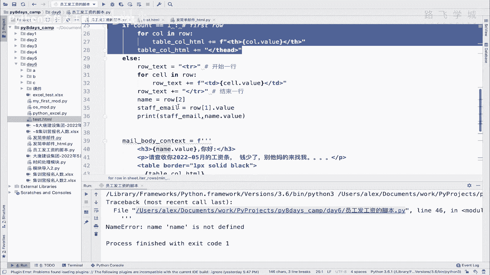

接下来他不走这个，但是他又走了，这个生成表头的话，生成表头的，这个时候你肯定不能走下面这段东西，你上面，所以你走下面这些东西，他发邮件发不出去啊，你你现在这段在干的事情，只是在生成表头，能理解吗。

讲的有点快啊，你理解一下，所以这个时候你第一在循环的，第就是在循环第一行的时候，你要干的事儿，只是说白了，生成表头下面的这些发邮件动作都不走，所以你要确保在这里呢，你就在这里做完这些事，你就直接干嘛呢。

直接嗯continue就行了对吧，continue它就不会往下走了，是不是就可以解决了啊，来执行一下够的发送成功了，对不对，然后我们来看一下我们的邮箱，大家看见证奇迹的时刻，哇哦哇哦好漂亮啊，好漂亮啊。

看到没有，是不是就已经解决完了，对不对，都发完了啊，这NN是，因为这里面本来提成就应该是没有数据，看到没有没有数据，这就是个NN啊，这个都不影响，总之你看你整个加起来才有多少行代码。

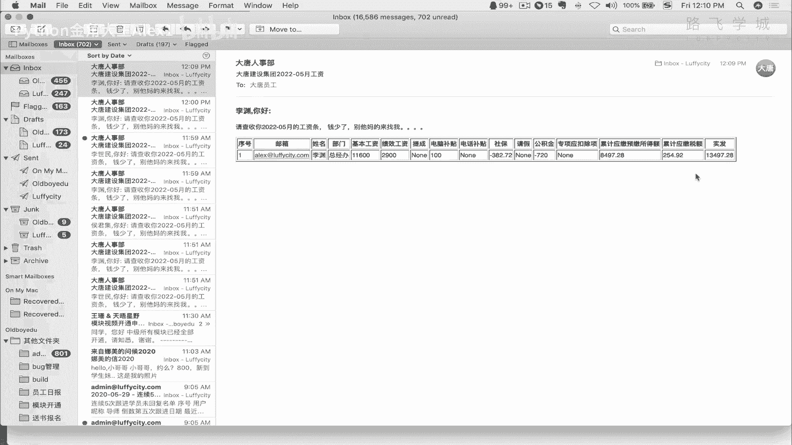

但是你可以加样式，加颜色就随便你了，总之你一共才有加起来，这是多少啊，啊我看一下啊，五十五十行左右的代码，你就把这个小事情给实现了啊，你想一想财务的话，他1000个员工他不得发一篇。

你这个就是2分钟就可以搞定的事，我这个直接循环不停的话，它就是每一个都发嘛，大家看对吧，他每个人都发了，就很简单啊，几千人一会儿就发完了，好我就停了啊。

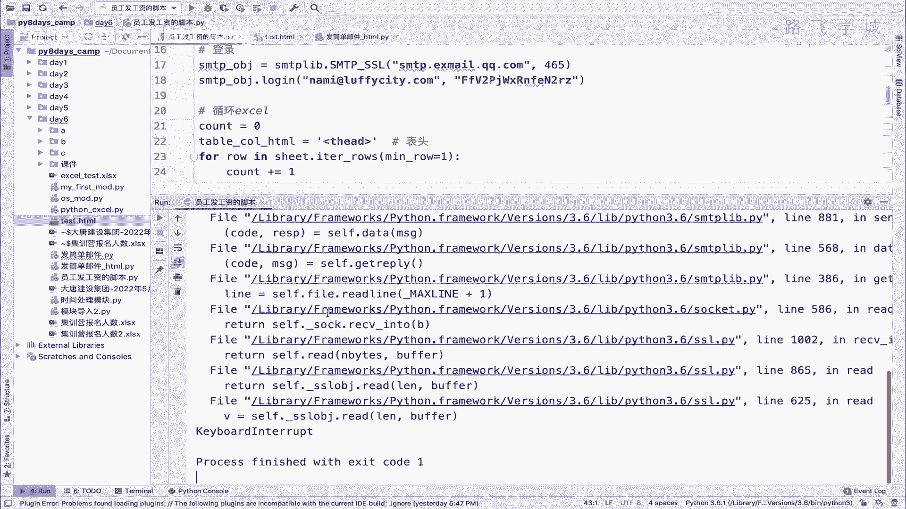

停了之后大家来看啊，一会儿他就都过来了，李世民李渊是不是每个人的工资他也都过来，他可能收的有点慢，OK总之到这里，咱们这个就是给员工自动批量发工资条的，那么一个小功能就做完了，大家你在这里做出来啊。

然后给到你们财务的同事，是不是就给他省了很多的这个啊，这个提高了工作效率对吧，那这个你老板就会觉得哎小伙不错啊，给我们部门IT部门灯光好吧，你们自己来玩一玩。

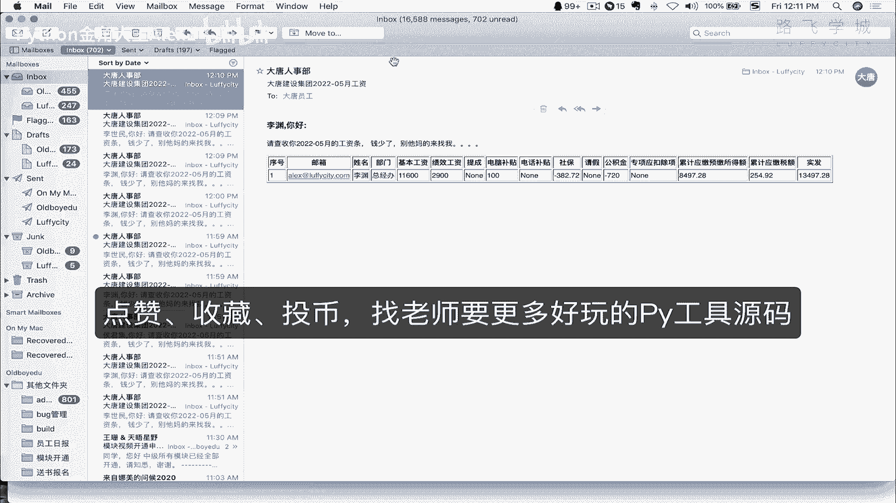