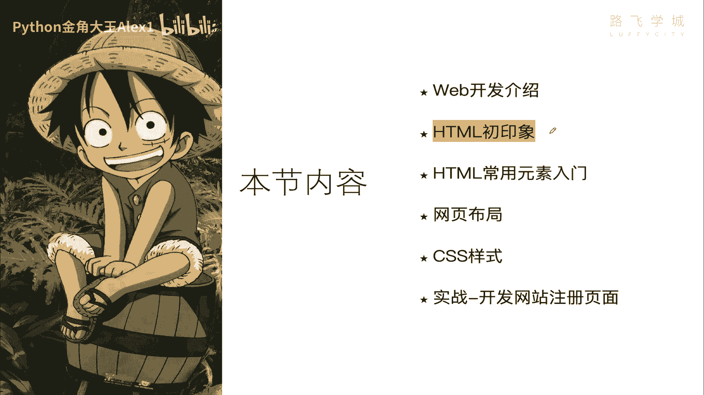
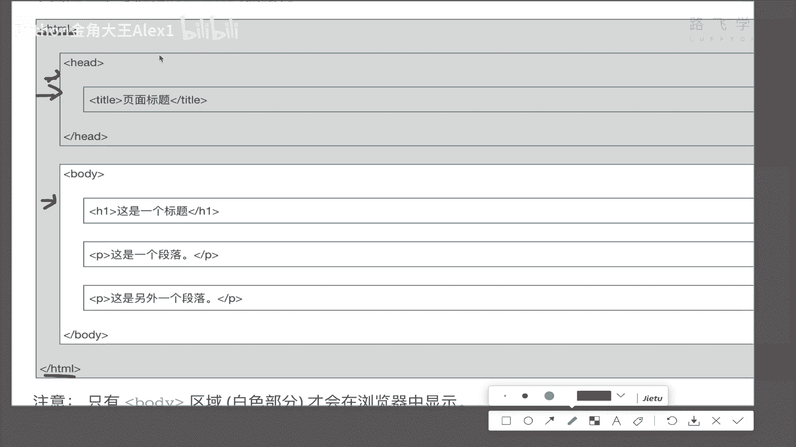
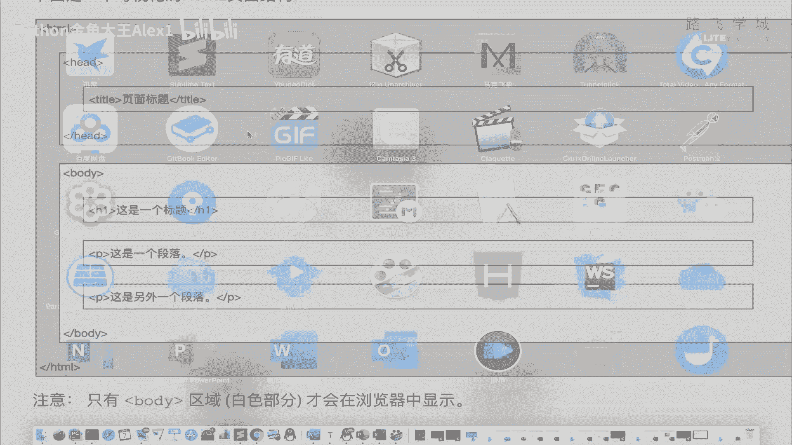
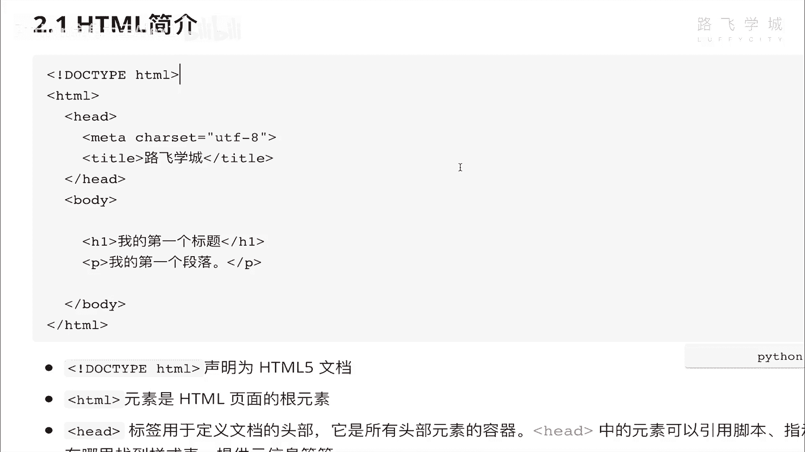
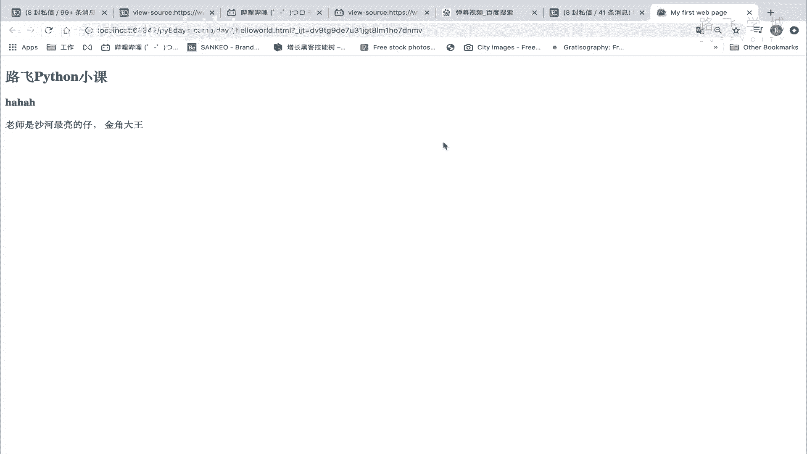
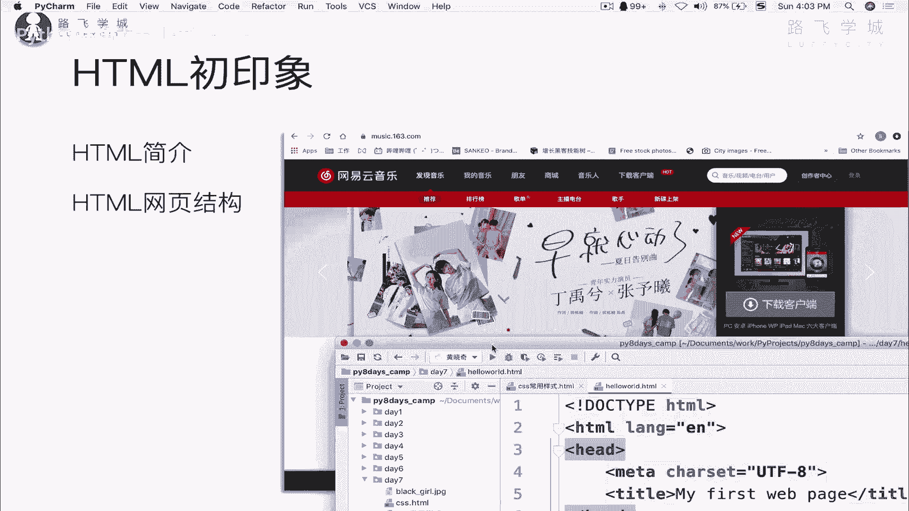
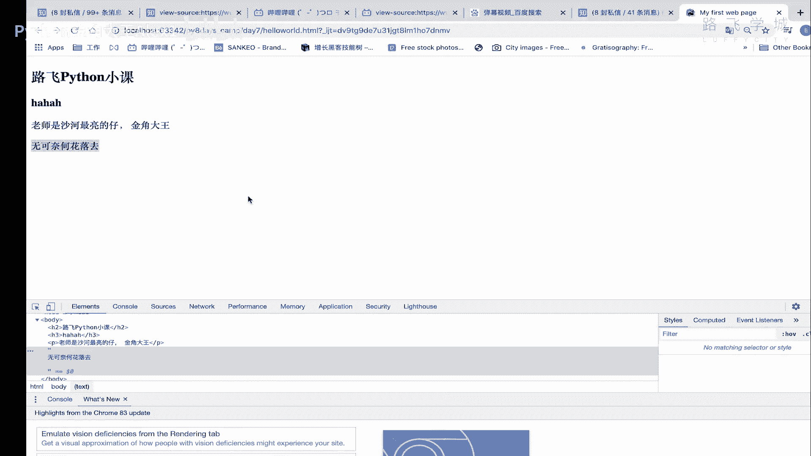

# 【2024年Python】8小时学会Excel数据分析、挖掘、清洗、可视化从入门到项目实战（完整版）学会可做项目 - P84：02 HTML网页结构初印象 - Python金角大王Alex1 - BV1gE421V7HF

OK同学们，这一小节我们来学这个网页，三剑客的第一节课叫什么呀。

HTML啊，我们看一下它的初印象，了解什么是TM这个它的一个简介，以及这个这样一个网站类似的，它的拆出来一个HTML格式的一个价，这个结构是什么样子的好吗。

我们来直接看这个什么，先说什么是HTML，那TML呢它是用来描述网页的，就是你网页长成什么样啊，它是用来描述网页的一种语言，但是呢他又不是他，它又不是一种编程语言，而是一种标记语言，什么意思啊。

不是编程语言，是标记，首先编程语言咱们学的Python啊，除了除了这个就是Python里面，你你你回想一下是不是有这种数据结构，比如说字典列表类型这样的类型的数据结构，还有什么啊，咱们写的流程控制。

for循环，while循环，it fills对吧，还有这什么函数啊，以及后面啊我们会学到的什么这个类啊，类似这样的一些各种各种编程结构，但是在他在这个叫叫HTML里面，他没有这些东西，它不能做。

它没有什么数据类型，他也没有这个什么流程控制，for循环八与分析，更别提什么函数了，它没有这些东西，所以它没有任何真正的逻辑性可言，说哎这个呃如果怎么怎么样就怎么怎么样，这种逻辑性可言没有。

它只是一种叫文本标记语言，什么叫文本标记语言，比如说你看啊，同志们看到我这个字体了吧，我我我我我我这个标题了吧，标题它这里显示了一个H4，代表它是H4的标标题，那我告诉你他这是H4，这是普通文本。

那也就是说HTML他干的一个事只是做了什么呢，哎它就是区分这段文本是一个，比如说这段文本它是一个啊这个这个普通文本，这段是加粗的，这段是一个标题，明白吧，这段比如说它是一个图片啊。

就类似于他只是对这些一些呃，一些这个文本中内容的一些描述对吧，给它给它给它大小啊，这个这个这个这个这个这个呃是加粗不加粗啊，类似这样的事情啊，他只是干了一些这样的事情。

所以他他并没有任何的啊这个像for循环啊，类似这种编程逻辑在里面，所以我们不能管它叫做一种语言，它只是一个一个标记文本的那么一个东西，标记文本一个东西好吧，一会看一下你就知道了，他怎么是标记。

比如说他怎么去代表，这是一个这个H3的H3的一个标题，H这个标题对吧啊，这怎么是一个普通文本啊，这怎么是一个段落，怎么就换行了，是不是它它它是怎么实现这种标记的，我们来看啊，一会儿。

然后他就是使用使用标记标签来描述网页，什么标记标签呢，大家其实啊你可以你可以大概来看这个唉，对看这个吧，H看到没看到这个尖括号了吗，哎他通过这个尖括号一对，看到没有一个开始，一个结束。

只不过结束的时候这里加了一个斜杠，代表结束，这个没有加这个开始，他们是成对出现的，看见成对里面包裹着这个东西，就是文本，所以这个就是标记的标签，这个就是文本，所以为什么称它为标记语言。

它只是标记文本的哎，代表它是H1代表的是一个段落，代表这是另外一个段落，OK吗哈代表这是一个body，就是这个整个文档的这个开始和结束啊，整个文档开始结束，所以它就是通过这种标签来标记文档的好吗。

然后这个就是HTML文档，也叫做web页面啊，我们就称为叫web页面就行了好吗，这个就是HTML，然后我们来看一下，先看一下它这个结构吧，一个HTML一个标准的HTML，它就是一个这样的一个结构的啊。

这样一个结构，首先呢你在这里先有一个开头啊，就是开头的声明，一个标签HTML，再有一个结束声明，这就是一个整个HTML文档的开始和结束，还没有开始和结束都是要必须要写的。

然后接下来里面分了head和body啊，分了head body就跟人一样，你分脑袋和这个身体部分对吧，头部脖子上面是脑袋对吧，脖子下面是身体，它是一样的，这个head的这一部分啊。

这里是body这一部分，大家看白色的，这一部分是在你页面上能看见内容的，也就是说你在页面上看到所有的内容，都是在body里面的，那我要had干嘛，用had是有单独的用途的，had是定义。

比如说你的这个浏览器的有一个标题啊。

你这个浏览器是有你一个页面和标题，大家看看到这个了吧。

看到这个看到这个了吗，这个标题这个标题就是在这个head里面定义的，除了定义标题之外，它还定义什么一些啊，这个比如说你这个页面的字符集字符编码，比如说你是UTI8格式的，还是GB。

咱们之前老的一些页面啊，老的一些网站，比如说你现在依然到看一些什么，这个四线城市的这个政府网站啊，你就可能看到它那个里面的字符编码，是依然是GB2312，Gb2312，你放到国外直接打开就是乱码。

那国外打开那个网站直接是乱码O，所以这个里面还可以定义，定义这个整个页面的字符编码，也就是说就跟Python解释器一样，你定义了什么编码，它就浏览器用什么编码来解释这个页面，知道吗。

那你要是GB2312，放在国外的网站打开直接就乱了，看它解释不了，对不对，那还可以定义什么关键，一些叫搜索引擎可以搜到的关键词，什么叫搜索引擎搜到的关键词，大家如果在座的同学有做过运营的话。

运营里面有一个叫SEO啊，SEU还有一个叫SEM，那SEM叫什么呀，搜索叫searching engine marketing啊，Searching searching sir，搜索引擎嘛对吧。

marketing他是干嘛的，坦白讲就是叫百度排名竞价，或者是这个谷歌排名竞价，什么意思啊，就是你给百度钱对吧，你就这个你就能排到前面去对吧，然后别人一点啊，那你就得花钱，就别人一点。

你这个页面你就得花钱，百度上不都有这个东西嘛，对不对，大家来看一下，随便打开你就打开百度，随便搜一个东西啊，特别是这个教育或者是医药，之前不那个莆田医院，是不是咱们搜这个教育。

比如说搜Python培训哪家强，是不是啊对吧，沙河找大王是吧，一看哎就是达内啊，或者类似这种结构，哈哈，你看看到没有，你看我果然出名了，这也是花的钱，你不要随随便点点，就这么扣我们公司钱的。

这就是竞价排名，这个叫SOSEM搜索引擎marketing，我告诉你，像达内一年给百度投两个亿啊，打那块投两个亿，千锋也投小一个亿，接下来反正排在上面的，你像传智播都赔老男孩排第四，我们花的钱少是吧啊。

那还有一些什么啊，乱七八糟的就不说了啊对吧，不是代表在前面的，就是好的，同志们啊，咱不能诋毁彼此，但是就是说这个就是，这里纯粹就是花钱就能上的去啊，花钱就能上的去，明白吗，哎很贵的。

点一次点一次好几十块钱他就没了啊对吧，点一次是钱就没了，哼这个这叫搜索引擎SSEM，然后还有一个东西叫什么呀，叫SEU，SEU叫search engine optimizzation，对吧。

opto uh my应该是这个啊，就是什么呀，搜索引擎优化，搜索引擎优化是干嘛的，就是说不花钱的方式啊，就是不花钱，这个是要给百度付钱的，这种是不花钱的，不花钱也能上首页，我告诉你啊，你看看到没有。

你看啊，你你你怎么讲，你看这里是不是Python培训机构，哪些值得推荐，看到这个知乎的吗，这个就是没有花钱的，包括人家这个传智播客，他也是没有花钱的，看到没有没有花钱能做到这做到首页。

你看你挨一搜这个你看到了哎，你不就容易点进去吗，易点进去你就可能成为他的客户，所以有专门一批人是做搜索引擎优化的，叫SEO，看到没有点进去，哪些机构可以看看啊，反正每个都说自己好是吧。

所以这个东西都那么很扯的东西啊，啊这就是搜索引擎优化给优化上去的，还挺牛逼的对吧，那你一看你肯定更相信知乎，而不是相信这个，回头我也写上我们这个哈，Anyway，那同志们啊，同志们这个啊怎么做到的。

这个SEU其中就利用这个什么呀，咱们这个里面的这个head的一部分啊，head1部分里面专门有一个叫字段，字段叫meta字段，咱们点一下这个看这个叫哔哩哔哩，右单击啊，审查他的这个啊网页源代码。

你看前面这些东西，看到他这个head里面前面这些东西啊，看到这个head开始了吗，然后这个地方看到有一个叫meta了吗，meta这里有定义字符集，还能定义什么呢，看看啊，看了看这里有一个MC标签。

看定义的是什么counter，看到看到这些了吗，这些东西都是关键字，看到没有关键字，那搜索引擎就会爬到你这个用它的爬虫，爬到你这个页面的时候，就会去提取这个里面的这些，这个里面meta里面的这些关键字。

看到keyword怎么样，keyword怎么提取这些关键字，我告诉你，这些关键字是描述你这个网站主要是干嘛的，描述你这个网站主要干嘛的，因为搜索引擎它没有办法去判断，说我操你这写的干嘛，你这是什么什么。

你这是你这是你这是打英雄联盟的游戏网站，还是说哔哩哔哩视频不知道他分析不出来的，所以你在这里相当于告诉搜索引擎，我这个网站主要用哪些东西，看到没有，这些诶，动漫是吧，这个AGACG什么神曲。

网络游戏电子竞技类似这些东西，还有弹幕，是不是哎那这个百度就收录了以后，别人去搜说这个什么呀，弹幕视频看看啊，搜弹弹弹幕视频，他做的优化好的话，就哔哩哔哩就容易上网啊，上上网，这是AC放。

然后看有有没有看哔哩哔哩，这就上去了，那你只要一搜到这看你不就看到这，你就容易点进去，那你点进去如果是一个什么培训机构或者什么，你就可能还在人家的报名，这就叫SEU，价值还是很大的，不花钱。

总之它其中有一部分SU当然也很涉及很多东西，但其中有一个就是说在head里面加这些关键词，明白吗，OK这是head啊要做的作用啊，had要做的作用，然后啊包括后面我们学这个cs的时候。

这个网页的一些样式，对吧啊，也是在这里面定义的，也可以在这里定的啊，OK这是网页的结构，然后呢在这个结构基础上，我们看这段代码你就能理解了啊，能理解了，大家来看看到没有啊，HTML开头啊。

然后呢head head里面定义的字符集，定义了我这个什么呀，浏览器的这个就是一个网页页面的这个标题，就是这个标题看到没有这个标题，然后body啊，头部里面写的是什么，哎这是第一个标题，这是一个段落。

好吧，这个我们没讲这个是什么呀，这个就是咱们叫啊叫H5的一个声明，就是注意了HTML这种标记语言也发发明，就是叫什么呀，经历了好几个迭代，好几个版本，现在大家一提H5。

H5其实就是说第五个版本的HTML啊，它能支持的这种标签更复杂一些，什么支持这种啊，这个这个就很多一些比较炫酷的标签是吧，炫酷的标签，比如说这个啊画布啊，比如说游戏，比如说那个可以做网络游戏的一些标签。

总之很复杂，反正反正现在这就是流行的，你开发什么小程序啊什么的，都是用的H5好，你在这里做了一个声明，就是告诉浏览器用H5第五个版本来去，第五个版本的语法结构来去解释，我这段文字明白吗啊。

一般建议写上啊，一般建议写上，你不写好多也按H5去解除，一般建议写上其他的就没有了，那我们直接创建一个自己写一个不就可以了吗，我们来这里啊，呃后挡后挡后挡。

我怎么移过去。

大家来看一下，我们在这里写一个我们第一个HTMLHTML，注意了，我在这咱们用PYTHM，也就可以写HTML的这种这种这种这种结构，这个代码注意的创建，看到没有选这个ETML。

然后hello world吧，大家看你看他已经其实这个叫什么编辑器的，好处，就是说他已经帮你把这些基本的东西写好了，是吧，那你这个EN的话，你可以写成UTL8也可以啊，这里不用动，这里不用动。

这个没关系啊，这个不用管，在这里已经写了UTM8就五集，然后title这个title就是my at first这个web page好吗，然后这里面你就写看到body里面写你的是吧，这是这是二吧。

比如说这个啊叫路飞Python小课好吗，然后写一个P啊，你看你还可以写HH3H四都可以啊，你可以写很多，然后再写一个pp就是段落啊，这个段落，然后写上这个老师是沙和最亮的仔是吧，那个量写错了。

今叫大王八八好，这个时候注意了啊，就写完这个页面了，然后我们在这里看着他这里，pyx我给你提供了非常方便的，你直接看到没，你可以选任何一个版本，咱们这里我这里有有这个谷歌浏览器啊。

或者点进去大家来看看到没有，是不是，你看是不是这个大这个小这个就是这样啊对吧，哎这个就是最基本的HTML啊的一个页面，以及它的这个网页结构，你也理解了，然后我们可以在这里注意了，干嘛呢，用单机嗯。

可以查看源代码也行，查看源代码也看看没有对吧，是不是就是这种结构就是我们写的这种结构啊，当然啊这个这个先不用看，这个先涉及不到，OK你们自己来试一下，你就写出来了，第一个啊。

网页结构，我们对HTML的一个初印象就理解了好吗。

哦在还是要强调一下啊，强调一下啊，好美，你写的所有的内容都是要在body里才会显示，明白吗，在body里才会显示，你如果说写在这个head里面，它是不会在这里展示的明白吗，只有body白色的。

这里面的这个body里面的内容，才会在页面上显示好吗，有同学说我不写P不写什么，我直接写一段文字可不可以呢，也可以说我啥也不，我啥也不弄，我就直接这么写它它行不行呢，它也会显示看到没。

它显示的效果就跟这个P是一样的，就跟P是一样的，但是它其实就这就是纯文本的，这就不是HTML格式，对我就单击审查元素也可以啊，在这里可以看到大家看，这就是纯文本了，它不是一个HTML格式。

虽然它依然是看着像P1样对吧，但是它是纯文本，不是HTML的，所以一定要加标签好吗。

一定要加标签好。