# 【2024年Python】8小时学会Excel数据分析、挖掘、清洗、可视化从入门到项目实战（完整版）学会可做项目 - P91：09 组合选择器 - Python金角大王Alex1 - BV1gE421V7HF

OK同学们，这一小节呢我们来学这个叫组合选择器啊。

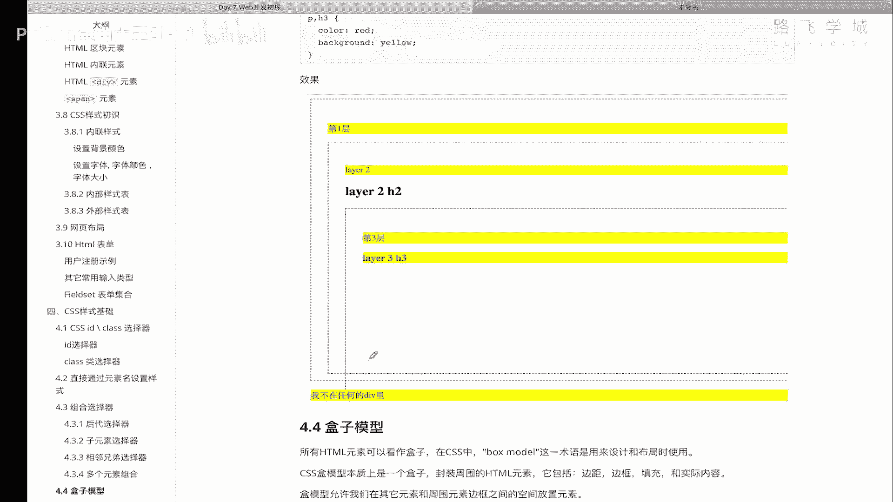

组合选择器是个什么东西呢，哎先说一下组合选择器里面有好几种方式啊，就是其实其实说白了就是各种组合，分为后代选择器，那后代就是子孙后代，儿子选择器叫子元素选择器，还有相邻的兄弟选择器。

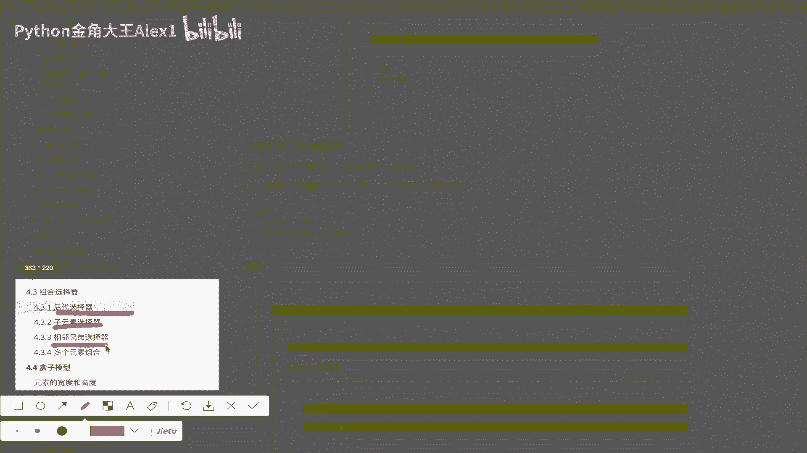

还有多个元素的组合，这么四种模式好吗，我们都来看一下，要想实现这个演示效果呢，我们先要重新做一个布局啊，这个布局就是一个类似这样的，看到没有，三层div，第一层，第二层，第三层啊，这样做出来。

那我在这里其实已经写好了，写好了，那我就直接copy过来了。

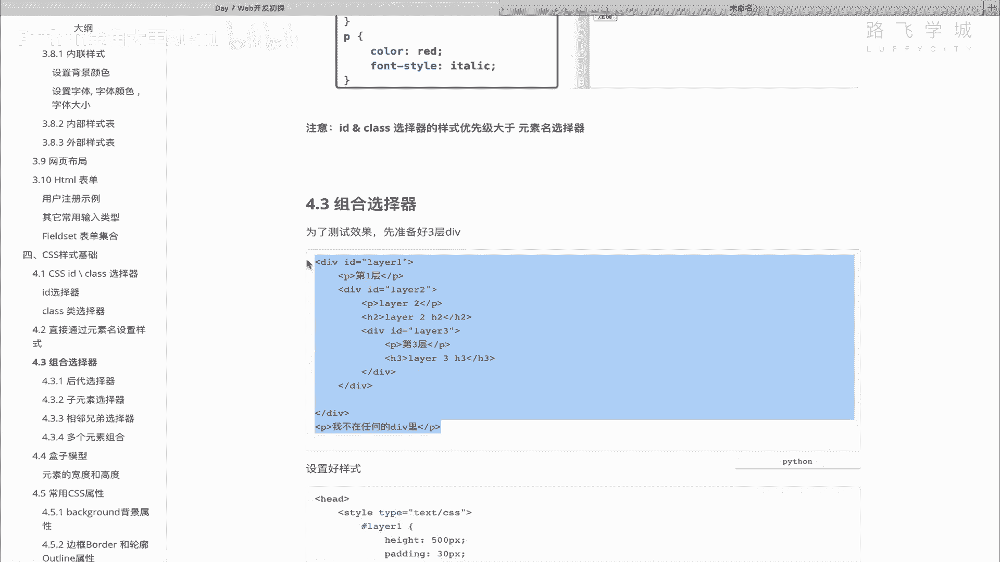

给大家看一下代码就就行了，好吧，我就不不重新写了，好了，稍等啊，组合选择器，组合选择器啊，这个课件吧。

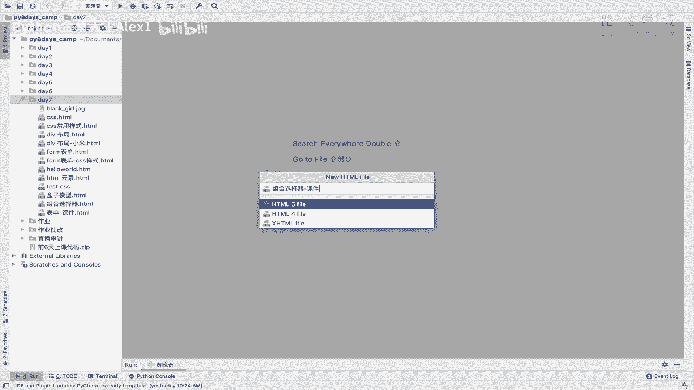

那好我们直接把它copy到这里来，给大家看一下，首先第一层的div没问题吧，第一层，然后第二层里面包在第一层里面看到没有啊，每一层写了一个P，看看这是第二层id叫layer to第二层。

然后第二层下面又包裹了一个，看到没有，是不是第三层啊。

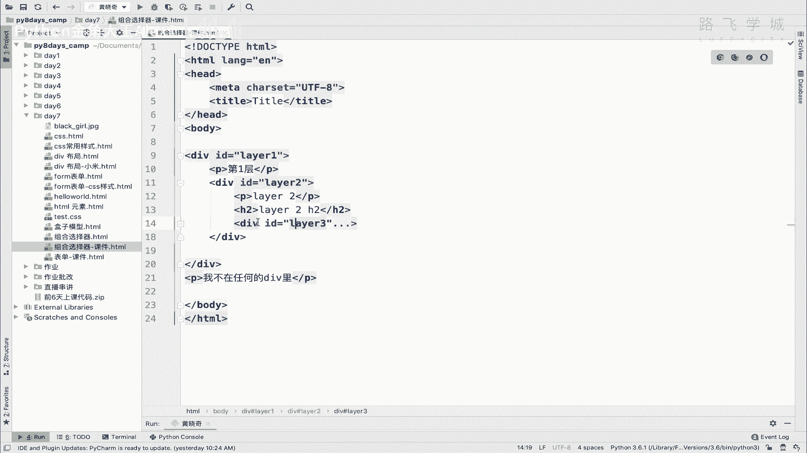

这个这个没什么问题吧，所以我们在这个地方一共有三层的，三层的这个div，这是第二层，这是第三层，看到没有，第三层里面有一个，第三就P1个H3，第二层里面有个P1个hr。

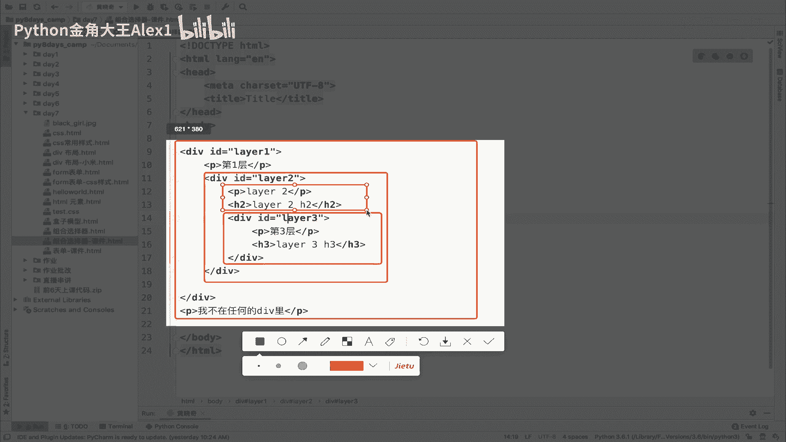

第一层里面只有一个POK了，按说应该加一个H1是吧，first layer好吗，然后最后外面有一个P可以吧，哎写完这个之后呢，我们给为了区分效果啊，我们给每一层都加上边框，加上样式好吧。

我在这里也直接给他copy过来，后面我来我们再来看啊，大家来看嗯一下啊一下看到没有，Layer to，我给他加了高度啊，500ping padding的话就是一个叫内边距，先跟大家说吧。

因为后面其实也会讲这个东西，这个叫内边距，什么叫内边距呢，一会儿看效果你就知道了啊，那编剧就是你啊，对一会说吧啊，然后你看啊，LAER就是边框，layer to的话也是它是小了1。400。

然后呢是30的这个内边距，layer3呢就是300，也是30的内边距啊，每一个这个边框的颜色不太一样，好吧，我们执行一下，大家来看是不是出现了一个这样的，看到没有，是不是就是这么弄小一点。

大家看出来是不是出现那么三个框啊。

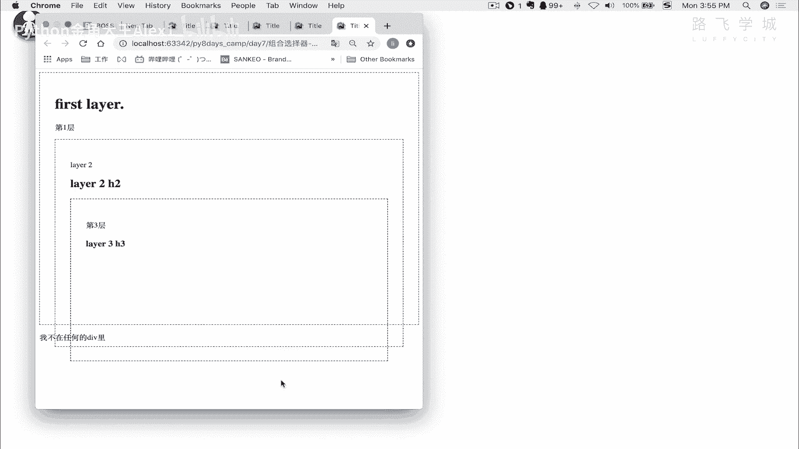

对不对，那好我在这里就给大家讲一下这个内边距，刚才那个ping啊，注意了，你如果没有，那什么叫内边距，大家看看到这个最外层这个框了吗，就第一层这个框了吗，这个第一层啊这个框同志们啊，第一层这个框。

那就这么讲，他这个框如果你在里面，就是就是就是嗯和这么讲吧，对你有那么一个框，然后呢，你这个如果再继续在里面再写一个div的话，它正常是贴着这个边的，正常贴着这个边的，但是呢我为了区分开。

所以我想就是区分开两个这个div嘛，所以我就想干嘛呢，我就想你看实现这种效果，他这中间就有一个间距了，这个间距就是一个内间距，叫通就是通过用Python来实现啊，拍ding。

你看啊这个内间距相当于就是相框，假如说你这是个相框，然后呢啊就是这个看到没有，出现了一个30的padding，看到没有，他在整个的一个div这个边框往里边缩30，往里边缩30像素，这就叫pd。

这叫内边距，明白意思吧，也就是说这是边框，但是你写的内容加了padding之后。

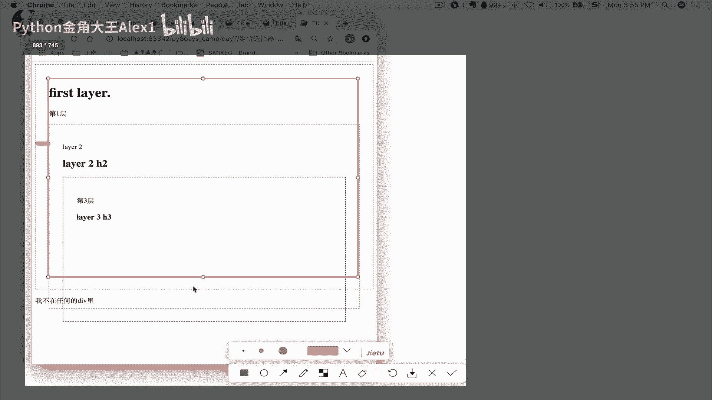

它就往里边缩30，也是从这个地方开始写，看到没有，那你要把这个去掉的话，它就啊什么的，你比如说你把这个去掉，你再看效果，你看是不是紧贴着了，看到没有，你就紧贴着了啊，所以呢哎这个是内边距。

大家指导一下就可以了啊，这样我为了区分一下它，因为超出了，我给它改成一个300，给他改成个200吧，好吧，这样他就看看是不是全都在里面了，明白吧，全都在里面了啊，我这样我再把这个宽度给它改一下吧。

宽度要不然它就铺满了啊，也是一个500吧好吧，改第一层的宽度，其他的也就跟着改了，好同学们哎这个就比较好了，看到没有，看的比较清楚啊，第一层，第二层，第三层，那这个时候我们就可以用它来做，我们的实验了。

就是啊先一个个来先看那个什么呀，先看咱们的叫诶诶。

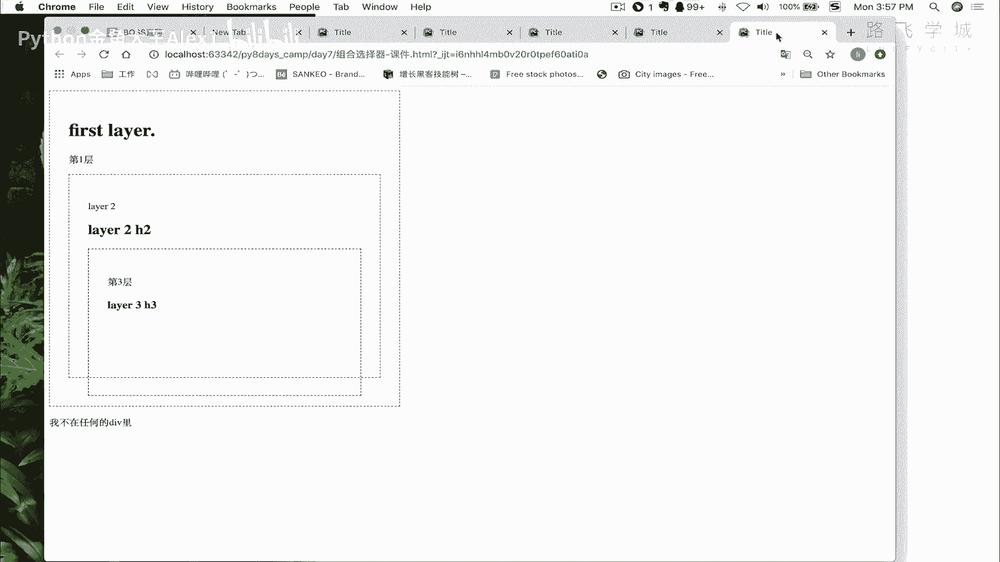

好那我们先看我们的。

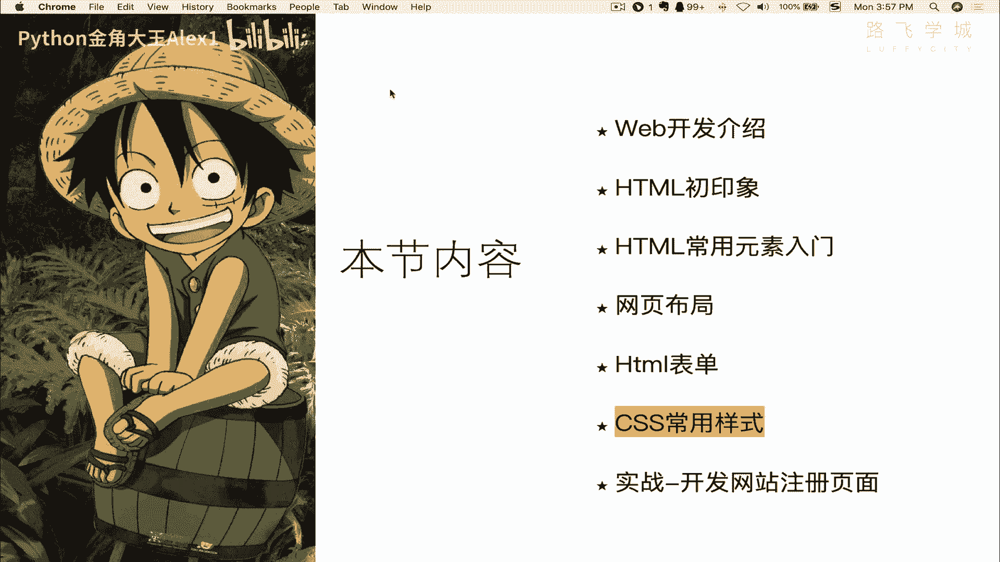

哦不不应该在这测试测试测，那我们先看我们的后代选择器，看到没有，后代选择器，后代选择器是什么意思呢，你看我这个有一个需求，它就是干嘛给指定元素的，所有后代指定元素的啊，所有后代设置样式什么意思。

也就是说你看我比如说给想给第一层下面，所有的P标签加样式，就是像这样的效果对吧，所有的P标签相当于我在div这个div下面，所有PP标签都加样式的话，怎么办呢，就可以用后代选择器，我们的效果就是这样。

大家看啊，你直接先找到第一层的div，是不是咱们的叫layer one对吧，直接写layer one是吧，Layer one，然后呢注意了，你注意你要干嘛。

你要是给这个layer one下面所有的P标签对吧，现在是每一层都有一个P，你就直接在这里写个P就可以了，注意了，这个就叫后代选择器，你直接在这个呃加加一个background color啊。

给一个P段落加一个文字，加一个背景，你就加一个，比如说叫yellow，看到没有，这个时候同志们啊，所有的P它会都会加上，我们来看效果，是不是你看直接就所有的都加上了，能理解意思吗，对这个就叫后代显示器。

也就是说我所有的子子孙孙所有的后代是吧，都会加上你在这里再有20层，它也会加上20层，诶这个就很强大，是不是啊，你就啊还是挺挺牛逼的啊，挺牛逼的，哎那接下来有个同学说了，我现在呢啊不想不想给这个所有层。

我只想给我这个第一层的什么呀，我给想我第一层的儿子，只想给这个家啊，不想给所有的就是儿子的孙子重孙子我不管了，我只想管我儿子对吧，就像给第一层加，那怎么办呢，哎那个就是另外一个选择器叫子元素选择器。

也就叫儿子选择器，明白吗，儿子选择器呢这个这个这个在哪呢，儿子选择器呢就很简单，看到没有，就不是说直接在后面写这个跟上P了啊，这个是代表后面所有的子子孙孙，这个是代表大于号。

看到了大于号跟上就是只写我儿子，有同学说两个大于号是不是代表孙子。

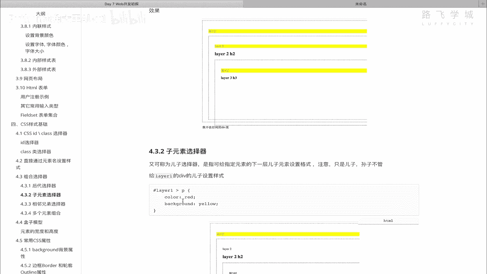

不是哈，就是儿子啊只能一个大于号，那这个时候咱们来看一下啊。

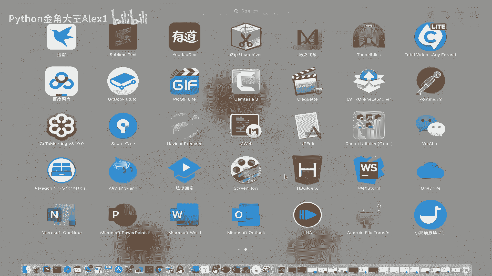

咱们来看一下，我呢现在啊给我的儿子加上直接加一个大于号，看到没有，这个时候我再来看同志们是不是第一层啊，有的同学说我想给第二层，第二层你就找到layer to给他的儿子，对不对。

你找layer to给他儿子，那不一样嘛，是吧啊，是不是啊，还有有的同学说我就想通过来这个第一层去找，第二层，就第一层的div导电那个就比较麻烦了啊，也不是完全不行，但是比较麻烦，你就我觉得不值当的啊。

就咱咱再搞额外半个小时去找那种，其实有更简单的方式嘛对吧，你就找到第二层的div，再找layer to对吧，第三层也是一样的道理，直接找到第三层的，然后再搞明白这意思吗，好那这个就是子元素选择器好了。

子元素选择器完了之后啊，我们一定要知道啊，后代和二次元，后代选择器和子元素的选择器的一个区别啊，千万不要弄混好吗，这个只给他自己的儿子，孙子什么的，重孙子都不管啊，你接下来叫相邻兄弟选择器。

哎这个需求来了，也就是说怎么讲啊，就就就就就拿我这个吧对吧，我现在呢想我找到了，我找到了我这个第二层的儿子，不sorry，我找到这个layer to这个P，然后我还想给他的兄弟。

比如说这个hr这个标签也给他加样式，就是我找到他给他加样式，就是我我只能找到他，然后呢我想给它加样式，那怎么办怎么办，你就可以叫相邻兄弟选择器，看到没有，相邻兄弟选择器怎么写呢，哎呀很简单。

不是大于号的，是加号在哪呢，来大家看看到没有，你先找到第二层的儿子P，然后给他加个hr，就是干嘛呢，给他的兄弟就相邻呢，紧紧接着相邻的下一个兄弟不是上一个，是下一个给他加上这个样式，那注意了。

它两者要有同样的父亲元素，也就是说他俩其实是在同一层的，他俩的父亲都是这个第二层的，对不对，是不是都是第二层的这个红色的这个div啊，能理解意思吗，那好我们就来看一下，直接在这个地方啊。

给它加一个h two可以吗，加一个H2，这个时候同志们啊，他就把这一层的所有的这个h two啊，都给他加上样式了对吧，大家看是不是给这个所有的，都给这个H2加上样式了，对不对。

还有同学说是不是我这里有多个H图都会加呢，我们可以试一下好吗，我们试一下是不是多个视图都可以加，比如说第二层我在这个地方啊，反正第二层是被我包裹了嘛，我在第三层下面再加一个h two啊。

就是at这个这个这个bottom也是H2好吧，我看看这个是不是也加，是加的话，就是说相当于把这一层所有的H2都加上，对不对，哎大家来看一下，并没有，他看到没有，是不是这个并没有加。

他只是把他的相邻兄弟注意了，相邻的兄弟是相邻的，下一个还是相邻的，上一个呢，我们依然可以是，我们可以在这个上面再设置一个叫h two at top，看到没有啊，这俩都算相邻的兄弟啊，他给哪个加呢。

大家看很显然是给下一个加，对不对，很显然是给下一个加，还有同学说你这个加号是咱们就在这瞎试了，你这个加号是给下一个加减号，是不是给上一个加，不是减号就减号，还我还真没试过对吧，不生效不生效，明白吗。

所以只有一个加号的一个功能诶，Sorry，只有一个加号的功能能理解吗，好这个就是相邻兄弟选择器啊，知道自己试一下就可以了，可以了，用的不是特别多，偶尔也会用啊，那接下来再给大家看一个叫什么呀。

多个元素组合选择器，什么叫多个元素，我现在就是同时给PH啊，标签都加同样的样式的话，怎么办呢，你可以直接这样写，看着啊，看到没有，直接逗号写多个样式，写写多个元素名就可以了，我能理解吗啊，写这个元素名。

那这个时候我们来看一下，我现在全去掉对吧，那他呢现在是没有任何样式的，我现在要给hr和hr注意好几个，hr和P都加上样式，就直接在这里写H2P看到没有，但是你写H3也加也行，那就全都加上了啊。

大家来看是不是你看里面所就是里面的，外面的全都加上了，OK这个就是组合选择器，好同志们一共啊最常用的选择器就是这么四种，对就是这么四种啊，就这样，所以大家你把这几种都自己来来回回的试一下，哎你就明白了。

反正一个是没有任何符号对吧，直接后面跟一个是跟大于号，一个是跟加号，另外一个就是逗号。

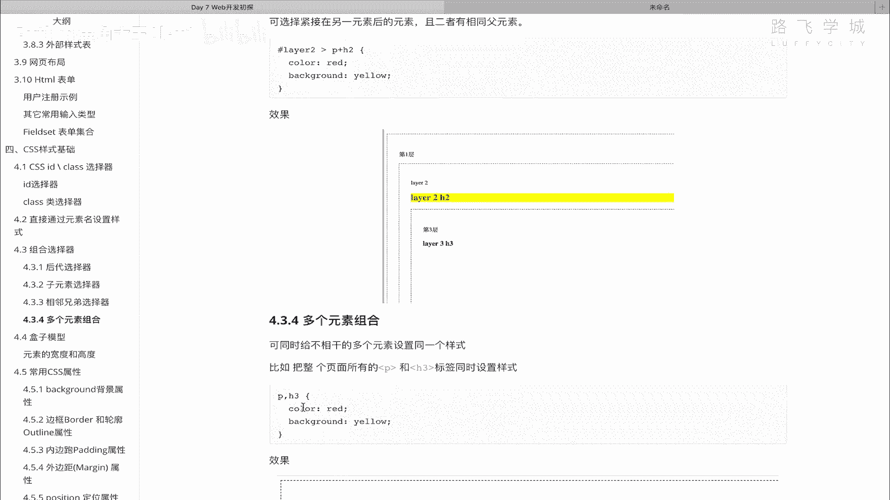