# 【2024年Python】8小时学会Excel数据分析、挖掘、清洗、可视化从入门到项目实战（完整版）学会可做项目 - P97：03 数据分析S03D02（上） - Python金角大王Alex1 - BV1gE421V7HF

啊咱们同学，现在在座的各位，你们平时那个excel用的多吗，你们平时有excel干嘛呀，做报表啊，还是做一些基本的这个统计工作呀，有没有那种就是对这种数据统计的，这种要求比较高的同学呀，有没有啊。

基本办公啊，基本办公做个统学几个函数就够用了，有做报表的吗，就是做像做什么财务报表啊，或者说其他的你们业务比较复杂的那种，做业务报表的有吗，我其实我我我们家楼下就有一个特别有意思。

我们家楼下就是那个理发店，一个小理发店，然后他们家就是还用特别原始的那种，拿一个本啊，拿一个本，然后他因为他也要办会员嘛，这两个小伙子年龄也不大，比我还小一点，拿那个本啊还在原始的那种去记啊，充多少钱。

然后手写记下来，然后呢那个本上贴几个标签，然后你你说你的会员号呢，他会他去查，我说你为啥不用一台，我说你电脑也有，你为啥不用excel统计，他说不行，那个太难了哈，不会统计对吧。

其实其实这种东西他来上个公开课，完全就可以搞定了对吧，哎有时候这个真是知识是有壁垒的啊，就是我和我很不理解，但他每次效率那么低，然后他非要拿那个笔记啊，而且你excel它它每次你的消费这么一算。

他直接把那个结果都拉出来，所以这就典型就是不会用excel是吧，你们平时咱们都是做什么工作的呀，我看你们为啥对这种书分感兴趣，昨天昨天有一个哥们儿是做什么，做那个开吊车的，是不是还有别的吗，别的工作吗。

我也调查一下啊，我看看你们会不会对什么感兴趣，下次我就讲点你们感兴趣的，信息专业大二，你昨天已经报过了啊，又是你们几个财务，财务的话，如果是做报表的话，应该用的多是吧，你像如果是做普通的出纳什么的。

报税的话应该少吧，人事啊，你们人你们公司多大规模呀，几百人，一般规模大一点的，可能会用到一些高级的工具啊，跟项目，800人啊，那看你们字段呗是吧，其实其实像你们这种活儿啊，我觉得一肯定痛点。

痛点不在于这个工具上，肯定是你们数据很乱，然后呢你们又没有那种中台对吧，这种规模公司肯定不会上中台的数据很乱，很多数据没法统计，所以说你肯定是每天在焦头烂额的，在搞对核对数据。

这错了或者那不不标准啊之类的，可能这种问题还有有些业务问题需要去各种猜，各种拆，各种核对对吧，比如说这个是哪哪条业务线上的，他应该怎么去算，还得分对吧，应该是这些这类问题会多一些。

其实大多数都是大多数都是这种需求会比较多，嗯嗯真正说到了那种，说我可以很就可以很很放肆的那种，很很嗨皮的做统计，然后我写代码去搞的话，其实这时候他已经完成了，就是基本上这种数据建设它已经基本完成了啊。

但是这种事一般都是其实像像互联网企业，一般都是数据分析师去驱动的，那像咱们其实如果是做普通工作的话，其实你你们应该也也可以，就是从你的工作角度去出发，然后去规范啊，把这种这种就是这种这个工作嘛。

给它规范化出来啊，给它标准化出来，这样的话你后边工作才会干的更顺手啊，但但是这话说说起来轻松啊，因为每家的业务不一样，然后复杂度也不一样对吧，所以说嗯这个还是个大活，所以说为啥就是现在数据分析师。

就是他很多企业为什么这么需要，因为他们都都是期待有这样的人，能帮他们去做些事情，不然的话就永远是疲于奔命，这就是在那样一个很耗人力资源对吧，然后比如小公司，比如像咱们干财务，那哥们儿吧。

不知道是姐妹还是哥们儿吧，你像你们你们统计工这个工资，我不知道什么效率啊，估计统计工资的话，如果没有这种很规范的这种数据的系统的话，肯定是很麻烦对吧，一般都都得干个几天，就光发工资，这事得干几天对吧。

好了啊，时间差不多了，咱们就开始上课啊，咱们这个啊就给大家也提个醒，就是咱们那个录播视频，就是不是每次给大家发上课链接吗，那个链那个发那个链接，你咱们下课以后啊，那个链接你可以直接观看。

咱们那个录播视频的啊，可以观看，所以你着急的话就直接看那个就行好吧，因为我这边我们如果是导视频的话，我还得给它下载下来，然后再去整理，然后再发，所以那个一般会有一个之后的一个时间啊，大概得一天一晚上。

到第二天上午差不多才能出来，OK啊好啊，那我们今天干嘛呢，咱们昨天讲的是可视化，可视化，其实我们说说白了，它只是你你前端的那个就是展示那个东西，就就是打个比方吧，就比如说我我们说你看一姑娘好不好看。

然后呢其实我们看的只是表面，你真说能跟他这个长久规则的话，还是得看什么，还得看这个内在对吧，当然了，始于颜值，忠于内涵，首先你要有颜值啊，所以呢我们昨天其实解决的本质，是一个颜值的问题啊。

但是我我们昨天想给大家带来一个什么呢，就是这个power bi啊，就是为什么要说这个，因为我我们其实很多人，就是咱们咱们现状就是这样的，我们我们现在很多的这种供我们office是office。

这个使用能力，其实国内的这种白领啊，这种职业已经要求了20年甚至30年了，说你要熟练office的应用，但是其实大家在真正在使用office的时候，说这个真能用到很熟练啊。

甚至说精通这种程度的人还是比较少的啊，为啥啊，这个不怪大家，因为说不爱学习，是因为我们日常的工作，他确实是没有那么大的一个量级啊，但是呢对于现在的互联网公司而言的话啊。

其实基本上尤其是做这种啊这种大大大厂啊，大厂，或者说我们这种这个有线上业务的，这种互联网公司，那么他们其实对于这种基本的什么excel啊，还有这种高级的一些bi工具呢，他们的其实诉求就比较强烈了。

跟我们传统企业就会有很大的一个差异啊，所以说它是真的要求你要懂这种bi工具，那这种bi工具呢，显然为什么要有那种高级的工具，就是因为excel它是有很大局限的啊，比如说我我们最早的零六版，零六版。

它其实XCEL的量级就是多少，就是一个二的八次方和二的16次方，就是列可以2256列，然后呢，那这个行呢就一共是16655356536，这么多行啊，这就是计算机的一种运算方式啊，就是二的多少次方啊。

但是到了10年呢会有一些扩展啊，就一零版会有扩展，一六版会有也会有扩展，但是其实不论怎么扩，它还是处于一个这种万级的，就是它还是一个万级的一种统计工具，然后呢你要说较真，说我100万的数据我也能打开啊。

打开是能打开，但是你这个时候excel其实他已经已经很卡了，就你用起来根本就不好用了对吧，就效率已经谈不上了，因为你已经在这个软件的使用上，你已经崩溃了，所以说它必然是有一些新的bi工具是要出现。

来弥补这个或缺的啊，但是呢其实对于纯粹的这种互联网企业，他们一定用的是数据库那种技术啊，甚至说用大数据技术，然后用或者说他们直接开发一套中台啊，就是什么中考呢，就类似于咱们比如做财务。

应该知道什么ERP呀，管家婆呀，这种东西明白吧啊管家，或者说你你如果是比如说我们是大学生诶，那我们应该知道你，你应该有什么教学管理平台对吧，然后比如说我们做各行各业吧，比如说我们我们报销什么的。

肯定都你都会用一个什么平台，这种东西呢其实统一统一来讲的话，就属于中台啊，只不过他是来帮你去解决数据的，那么我们常规企业用的中台呢，它会简单一点，比如ERP也是几十年的东西了对吧。

然后呢其实现在的互联网企业，因为它要对标到所有我我的前端的线上产品，包括我移动端的web端呢，然后包括我后端的数据分析，然后以及数据呈现，甚至说我要去做一些这个建模的啊，就是我我们昨天讲的那个预测啊。

就是有一些这样的一些诉求，比如说像啊，这个我们我们想知道用户的流失模型，我们想构造用户的付费漏斗模型，我们想知道用户的价值模型，价值体系模型我们怎么去衡量它对吧，甚至说我们到了淘宝的千人千面。

抖音的推荐算法，甚至说到了这个京东的啊智能物流体系是吧，到他那个阿里的这种无人兵，无人这种什么旅店宾馆是吧，啊其实种种种这些东西啊，它中间都要有一有那么一个中台，来帮你去做数据的一个什么。

一个一个这个中间层的一个过渡啊，那么这个过渡其实往往就包含了一些，比如说我们前端的数据规范，我们数据字段的设计表设计，数据库设计，然后到我们上端的数据呈现，数据业务逻辑上的设计，所以其实整个这个环节呢。

肯定还是有一个岗位是需要去，就是主导的去推进它的这个岗，其实就是数据分析岗啊，就是我们现在大家学的东西，其实就是数据分析师啊，就是现在的户数据分析师，他的一个基本的一个能力啊，就这么个东西。

所以那数据分析师呢，他们一定他们肯定是会用excel的啊，这个毋庸置疑一定会用的，而他们用的一定都很溜，但是因为互联网公司的数据量很急很大，所以呢他们需要一个更高级的工具，因为你中台这块直接太高了。

如果光excel那就太低了，那么中间这个层这个过渡的是什么呢，就是我们现在市面上比较流行的一些啊，这种高级的这种工具啊，我们叫bi工具啊，叫business business，就是商业的意思。

然后I呢就是intelligence，就是智能的意思啊，就是商业智能化啊，商业智能化其实讲的很高端啊，讲的很高端，其实本质上还是做数据处理，因为它因为我我们谈的智能，往往是跟这个AI相关的。

就是就是人工智能算法相关了啊，但他是这么讲，因为名字起的好嘛，产品卖的也好，对不对啊，所以大概这个意思，所以中间过渡层呢，那它其实不论是对我高端一点的，什么数据分析师啊，数据挖掘工程师啊。

不论是对这种岗位来讲，还是说我们就是普通的一个我，我只是说临时诶日常工作需要有一些报表诉求，然后呢我我其实也可以用这种工具，并不一定说我一定是因为量级受限了，我才会用这种工具。

因为它还是有很多强势的一些体现的啊，然后呢还有就是我们我们中级的啊，就是初级的中级的这种数据分析师，他们也一定是经常要用这种工具的啊，那我们就来看一看这种工具它到底有什么好。

其实市面上这种工具很多啊很多，然后呢那我们今天要给大家说一个什么，就是我们微软出的，因为大家知道office套件，其实就是微软给大家发了一个大礼包对吧，office基本上我办公离不开它。

但是呢微软其实早就发现了，office已经无法满足现代的这种数字化时代的发展，的这样的一个啊需求了啊，已经满足不了这种需求了，所以呢他搞了一个东西啊，叫什么叫power i power bi。

power bi啊，然后我们一般用的是叫desk top版本，它有很多版本啊，有很多版本，因为它它主要靠什么赚钱呢，他给你提供这种软件，给你给你卖的是那种那个云服务啊，云服务就像我们用WPS会员。

他会给你一个什么那个云的一个存储空间，我们可以把很多文档给它保存到线上对吧，然后呢你可以随时随地可以多个终端，我们去使用它啊，它可以卖这个，当然了，WPS会员卖云服务只是一方面，它还卖什么。

卖我的那些功能啊功能，但power bi不是power bi呢，其实多数功能都是给你公开的，就你都可以免费用，不需要不需要花钱，但是呢如果你你需要，因为你你真正说用这种东西的一定是什么，一定是大企业。

然后呢而且呢大企业他要干嘛，他要做这种数据共享，比如说我我我这个销售部，然后我运营部，然后我各种其他部门，我们的数据呢它是需要去对齐的，哎我需要去给我各各个部门的leader啊，这个老大给他们去公开。

他们随时随地可以查看，所以如果你想要用这种功能的话，哎那微软就开始收费了啊，这个费用还不低，一年大概得大几百块钱啊，甚至说更高的上几上千块钱啊，就是他是按按月按年收费的啊。

所以呢这个东西到底是个什么东西呢，我们其实普通人如果用的话没有问题啊，没有问题，你包括我，比如说我现在想做一个可可交互的报表，然后我把它呈现给我的就是我，我只是给他呈现给我的某几个人。

我不需要说需要那种很大团队规模，比如十十几人甚至上百人的这种规模共享啊，那么其实我们个人用这个免费版完全没问题，但是有有一个尴尬的点，就是如果你要用这个免费版啊，啊这一点大家注意啊，记住你。

你我相信大家一定会对这个东西感兴趣啊，所以你要记住我这句话，如果你要用它那种什么发布功能啊，发布web功能，甚至说发布那种那个移动端的功能，那么你一定要去注册一个账号。

但是呢power bi现在不开放了，在国内不给你开放这种个人账号了，他只能去什么用企业账号来注册啊，所以如果你你没有企业账号的话，它是个邮箱啊，就是企业邮箱，如果没有这个玩意儿的话啊，那么你怎么办啊。

你可以花五块钱去淘宝买一个，听清楚了吗啊，就去淘宝买一个什么power bi的那种个人账号，就OK啊，就基本上我们多数的这个个人的一些需求啊，用它都可以搞定啊，因为我们并不需要买那种什么多人的共享。

那个功能啊，所以基本的功能我们都是可以搞定的啊，但这个我不好说啊，可能是五块，也可能是15块，反正就这个区间就是就十来块钱的区间啊，如果大家要用的话，你可以自己去淘宝买，OK好啊。

那这个power bi啊，你看这名字啊，power什么叫power，有力的超级的，它翻译成超级啊，你像我们那个power point对吧，power point什么，它叫超级演示哎，超级演示。

那我们power bi呢它也是一种叫超级的bi工具，它这里边呢其实核心给我们提供了几大功能，一个叫power curry啊，query这个什么叫超级查询，超级查询，其实我们可以把它理解为是一种什么呢。

是一种超级强大的一种数据处理工具，这个功能啊，这个功能不是power bi专有的，但是它是随着power bi出现而出现的，这个功能现在已经被集成到我们的excel当中了。

所以说如果你想用它的power query功能，就是我用它去解决我数据的这种这些，清洗的这种能力的话，那么我们这个power query是可以帮你搞定的，就是excel2016版之后集成这个功能了啊。

那另外一个呢就叫power叫pivot，pivot叫什么呢，叫超级透视透视表啊，这个透视表啊大家有没有用过的，就咱们现在在座的各位，我看看啊，你看看你们用没用过，大家如果用过透视表的，给我扣个一。

我看看没没用过的过，扣个二，啊一看如果扣一的话，肯定是日常统计工作是挺多的啊，那其他同学呢，就这么几个吗，同学们动起来啊，动起来啊，我说了啊，其实你就是我们我们这个集训营上面，讲的东西啊。

我们都可以给你，就是这里面的基础啊，我我我后面都会更新啊，都会变成那种免费视频，你都可以看，甚至说你其实在那个，我们就是你如果你想要这种这种资料，你你跟我们任何一个咨询老师，要他都给能给你更多明白吗。

我们为什么要搞这种公开课啊，就是希望能跟大家去交流，你知道吧，就是学习的本质还是交流啊，所以说大家一定要在课堂上啊，你怎么着放飞自我啊，放飞自我，现在啊就是这样的一个啊，在互联网工作这么多年的一个人啊。

给你讲课啊，那么你如果不用这段时间好好沟通的话，你说只是听几个什么函数啊，几个小技能点啊，其实对你来讲帮助不是很大，好吧啊，OK啊，所以大家可以放飞自我啊，随便聊什么都可以好不好。

OK啊啊咱们人虽然不多啊，但是呢咱们就是VIP小班授课，对不对，所以说我们可以，我可以照顾到同学们每一个人的这种诉求啊，包括可能你你很多问题，我你在日常工作当中解决的时候，你会有自己的方式。

但是也可能我会给你一个新的思路，可能你就会变得很很快速的方式去解决啊，因为我是专门去搞这块的人，明白吧啊所以你们日常工作那点诉求啊，我应该是都没有问题，都可以帮你搞得定，OK啊好啊，Power bi。

那power pivot呢它其实是一种超级透视表啊，就是我们日常使用的那个excel透视表，其实功能功能看起来也已经很强大了啊，但它卡点还是在什么呢，它还是有很多限制啊，那我们如果有更多的一些啊。

其他的这种我们想到的或想不到的，或我们历史在使用这种这个透视表的时候，我们发现有些功能我们不好用的时候呢，其实啊你不妨试试这个power bi，给你提供的这种超级透视啊，它要比那个强大的多得多啊。

OK然后另外一个就是什么，就是最主要的就是它的一个可视化的能力，它的可视化呢绝不只是一个可视化，因为实际上我们其实更多的对可视化的诉求，无外乎这么几点，一个就是什么好看，对不对，一个就是好看啊。

那好看这个事我昨天已经说过了，其实这个好看的事是最好解决的，套模板往上套嘛对吧，你千万不要把你大多数精力放到好看这件事上，因为这个是最没有什么没有ROI的，就没有产出回报的，投入产出回报的，明白吧。

它只能是锦上添花，那么另外一个诉求是什么呢，就是我的我的词要达意，对不对，唉就是我表达的含义要清晰，这个是一个隐性的诉求，这是本质上我们做可视化的一个问题，那另外一个是什么啊。

另外一个问题就是我们是不是可交互的，对不对，然后还有一些隐性的需求，比如说它是不是便捷的，有没有便捷性的对吧，我们是不是可以随时随地查看呢，对不对，你像我们一般，我们指导学员写简历是吧。

你为什么要发PDF版本的简历，因为你永远不知道哪终端啊，拿着那个什么样的终端的人在看你的东西啊，可能你的格式就错乱了，所以说，那我们其实在展示我们的一些数据报表啊，或者说我们这些数据的结论的时候呢。

唉你一定是这个便捷性也是我们要考量的，比如说excel那种表格，你直接丢到手机上，那我比如说我我对你拿着一个IPHONE或者拿一个windows，那啊不是很多S啊，那个安卓是吧，你你两种手机。

你知不知道，那对方有没有安装可以读你这个X2的软件呢，对吧，你知道他装的是numbers，还装的是WPS还是装的是office呢对吧，你你完全不可控，所以这个便捷性呢，它其实也是一个隐性的诉求啊。

因为往往你做的很好，你发过去以后，对面拿的拿着IPAD正正看电影呢，发过来，然后临时看了一眼，什么玩意儿，啥也没看清对吧，这其实也是一个一个问题啊，但是其实整整个来讲这些个问题。

这些个问题如果你用到了这种高级bi工具，你基本就不用操心了，就全都给你搞定了啊，所以哈我们来看看power bi啊。

Power bi，至于这玩意儿怎么用啊，如果大家啊看了我这个功能演示之后，你对他很感兴趣，OK那么你可以课下找你的咨询老师去，要要什么，要这种安装文档啊，还有这个安装的过程的一些细节，包括怎么去搞账号。

然后包括你的基本使用，都可以去跟你那个咨询老师聊好吧，我还是那句话啊，咱们在集训营的这几天内啊，啊或者说困难这一周吧，因为我们一一周也就是这一期这一周，你所有关于这方面的诉求啊，你都可以直接去。

因为你群聊的时候，有时候可能我看不到啊，因为我有其他工作，你可以直接找你的那个咨询师，你告诉他，然后让他直接去来现场找我，我就可以快速的帮你解决好吧啊，所以说这些问题大家都可以去找你的咨询师。

去求帮忙啊，OK啊不废话了，我们先来说power b它是个什么东西啊，其实就是这么个玩意儿，就是这个我们一般会把它简称为叫，什么叫PBD，就是别人给你讲PPTAPPT是啥。

就是power bi desk top，就是桌面版，桌面版啊，就做个图标，你装上以后就可以直接用啊，我们给它拿出来power bi，但是它它是它就是一个应用程序啊，就是就是你可以在桌面上能找到它。

我这是把那个快捷方式隐藏了，所以我在这打开好啊，然后我们我们趁打开的时候，我们可以看一眼官网啊，因为这个工具它虽然强大，但它有一个比较让人，不就是稍微有点不太舒适的地方，就是他每次打开呀。

还有我们做数据加载的时候，会稍微有那么一丢丢慢啊，因为他要做什么，他要做数据建模啊，做数据建模就是我要做数据关联啊，所以它是要先解析数据的啊，所以它是有这样一个过程，但是一旦解析完成以后啊，打开以后。

然后呢我其实在做各种事情的时候呢，就会非常方便啊，好我们先看一眼这个power bi的官网啊。

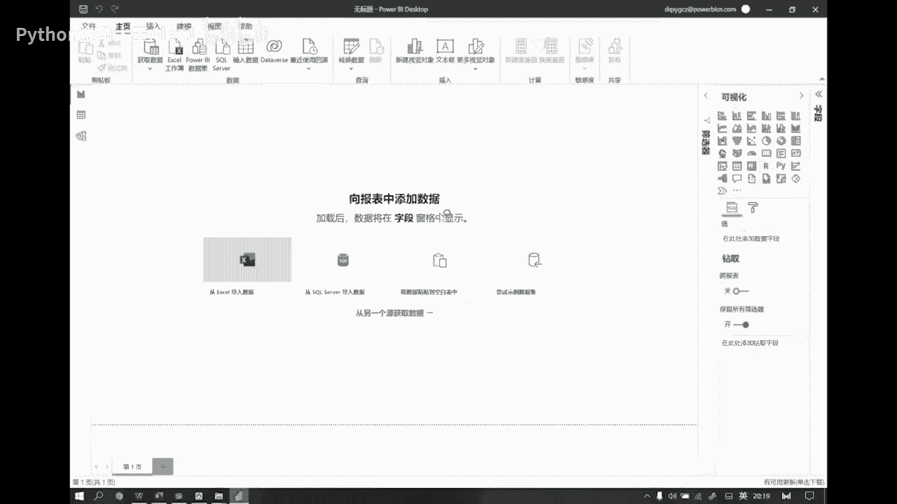

你看看，其实我我基本上不用渲染，就是因为微软他去主推这个玩意儿，它其实已经把这个东西啊给你搞的，就是介绍上已经给你做的很怎么讲。

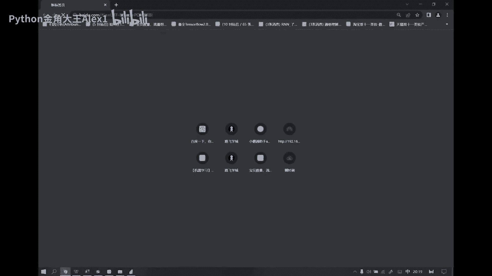

就是已经让你很很难以拒绝了哈，power bi啊，power bi官网，看看啊什么是符号bi对吧，自助服务和企业商业智能的统一可扩展平台，什么叫可扩展平台，就是你你公司如果有数据库，你上数据库了啊。

你已经是一个数据数据化在转型的公司了啊，这玩意可以直接给你对接，因为我可以直接连接数据库啊，甚至说我我我可以在里面去编程，我可以用R或者我可以用Python，唉我可以编程，这都可以对吧。

所以它是一个这样的一个可扩展的一个平台啊，然后呢，那肯定就是我们日常工作那些基本的小诉求。

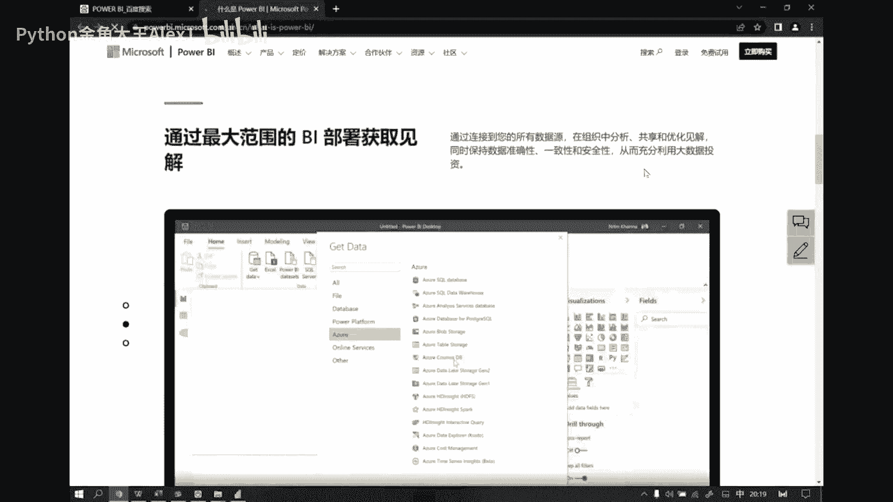

在他面前，那就是基本上是不值一提了，不值一提了啊，而且呢他给你提供了很多这种逻辑，什么逻辑呢，就是你在表达数据的时候，你是有一个讲故事的过程，就是相当于是你在你直接可以在它上面，它虽然不叫PPT。

但是你一样可以在它上面去做出一个，类似于PPT的那种演示的一个过程，效果就是它这就是它它是有这样的功能的啊。

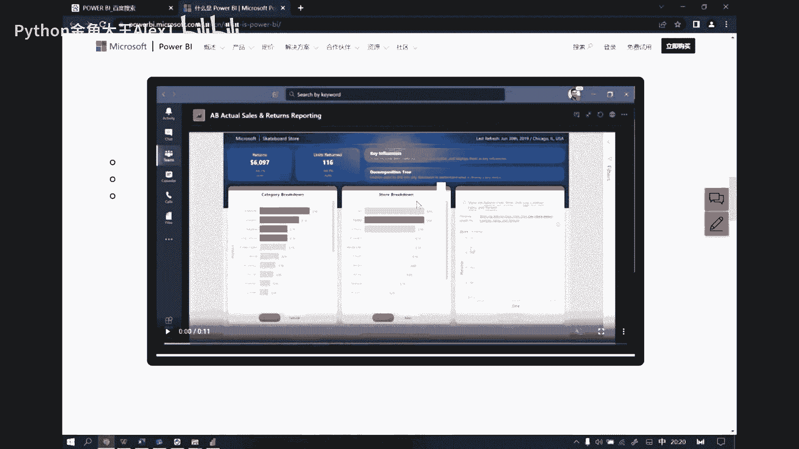

就一页一页一页的可以帮你演示这个东西啊，然后那个啊还有他的超级什么查询呢。

超级透视，还有包括我们这种数据表啊，这种数据表之间他们也是可以做什么，做这种透视的，比如说我完全可以做那种什么下钻啊，下钻的这种演示，然后甚至说呢，我我这个比如说我多张业务表之间有关联的。

那像比如说我们有一个订单表啊，一个order啊，然后我们还有一个这个啊用户表，用户表，还有一张，还有一张这个产品表对吧，诶大家能想清楚这三张表吧，比如说那我我如果想去做汇总的话，因为你order。

你订单表里面可能没有用户的具体信息，比如说我可能会有一个订单，有一个订单id会有和我这个用户id，但是我想知道这个用户的地址是谁，我想知道这个用户地址是谁，那我们其实在设计这种表的时候，我们往往不会说。

把它新加一个叫用户地址的一个字段啊，用户地址一个字段，我们可能会给它映射出一个用户的一个，单独的一张表，因为这样的话，我可以可以尽可能的去，节省我数据的一个复杂度啊。

或者说你也可以理解为我我用户的什么姓名啊，电话呀，然后几个地址啊对吧，然后等等等等信息，我们都可以把它独立开来，因为这是这是相对于独立的一些业务，就是业务的数据啊，我们只需要做一些整合。

比如说我们做一些合并或者做一些节点，就可以把这些数据关联起来，这样的话我们可以节省很多行，如果你都放到一起的话，你这个数据行会变得很多很臃肿，这样的话会浪费你的存储空间啊。

当然了也会也会浪费你的统计时间，也会增加你的统计复杂度，所以就会容易出错啊，所以一般来讲你像这个互联网公司，我们做表的话，都是要要经过严格的这种表的设计的啊，这种业务表的设计的，它其实是有一点非常啊。

非常就是要要重点考虑的，就是一定是我的呃，我这种数据的一个查找啊，甚至说增删改查所有的一些效率和一些，以及一些我的可扩展性的问题啊，但是这个东西你不要觉得说我，我跟你讲没有关系啊，所以你觉得没关系。

其实跟你跟你关系很大，因为我们难免就是你你现在也好，未来也好，或者说你啊你你某时某刻也好，你一定会涉及到你要去做表的这种需求的，明白吧，不论你干什么工作，你你都离不开做表的这种需求啊。

所以说那我们再去做表的时候，你你其实也应该去有有这样的一种思考的，一种维度啊，就是至少我的视角是可以站到这个高度的，而不是站在最下边那个角度，我只是局限在一张表，我怎么把数据统计完整啊。

而你你你要考虑的是我我身为一个统计工作者，那么好，我我的表应该我是应该有一些设计思想在里面，这样的话才能方便未来我的表结果如果变化了，或者说我的数据量大了，或者说我的数据有一些字段上的一些处理。

一些一些这个浮动变化了，我都是可以很快速的给它处理掉，而且在我日常的统计工作当中呢，他不会给我带来太多的这种啊，111核对的这种浪费时间的，这种这种工作量啊，所以这个这个东西其实对你来讲。

都是有一些帮助的，好好那么缩回来就说我我其实power bi呢，它本身是可以干嘛呢，它可以帮我们快速的把这些表之间的，这种关联性啊，就是傻瓜式的帮你定位好，你都不需要去进行刻意的去处理啊。

所以说它本质上就可以具备这种数据汇总的，不论是纵向汇总还是横向汇总，他都可以干这种事儿，你比如说我们很多同学会会会问说，我怎么去把一堆报表给它进行整合啊，其实这个问题power bi完全可以帮你搞定。

而且你不需要花太多的思考时间，傻瓜式的啊，功能性的点点点就可以搞得定了啊，那当然了，有些更高级的啊，更高级的，比如说我们的数据表的合并也好，几点也好，这种汇总操作，可能是集成在某个更大的功能之内，诶。

那这种情况我们可能才会上什么，上这种什么Python的啊，这种东西才去帮他搞定的事啊，所以他们这些工具之间都是一些互补的啊，OK啊然后呢你有了这种功能之后呢，我们就可以讲故事了，哎我就可以讲故事了。

我就可以去任意的，比如说我，我，我根本就不需要把我的重心，关注到我的数据的处理上，因为我已经完全完全可以，很快速的把这事儿都搞定了，我现在只需要干嘛呢，我只需要考虑。

我要用什么样的方式把我的数据呈现给对方，而且我我能怎么样，让对方尽可能的想去了解他更关注的信息，这些东西power bi都可以帮你啊，通过点点几次就可以帮你直接搞定，而且你会发现它的这种界面。

你看都挺好看的对吧，你根本不用花什么心思，而且他还给你做了很多的这种扩展，就是很多三方的公司，他们会给你做这种好看的这种组件，然后让你直接免费下载去使用它啊，然后他们也会有这样的一些各种各样的图示的。

使用说明，甚至还有一些原始数据供你使用啊，这就是power bi啊，它能给我们带来的好啊。

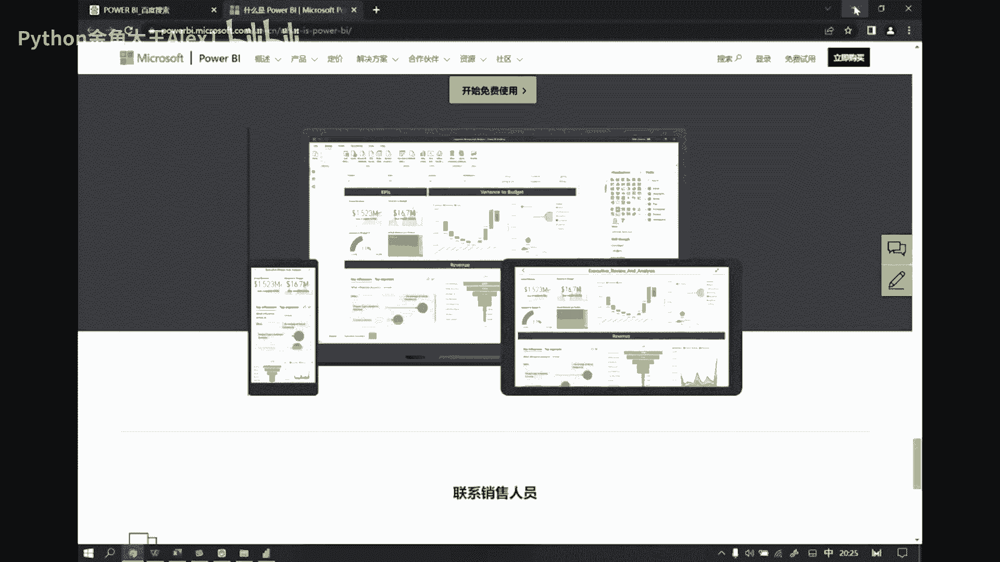

所以说这个这个啊大家可以自己去搜，可以自己去好好研究，研究这个网站里面的他们的一些介绍啊，当然这里面其实也会有一些简单的教程啊，它主要是集中在一些啊，这种初级功能上的一些讲解啊，啊也比较这个干脆好啊。

那我们来看啊，Power bi，他其实这里边我们重点关注的就是，如果你只是一个做数据看板，我想去做可交互，我想做数据的一些啊基本的展示啊，然后并且我想把它通过网页的形式，给我的同事们看啊。

OK那你其实只主要关注这个，就是默认的这个界面就可以了啊，这个界面因为这个界面里边呢，它其实所有的可视化组件啊都在右侧，就是你能看到的，我们power bi目前官方支持的这些什么条形图啊，线性图。

面积图啊，饼图环图啊，甚至还有一些这个其他的我没用过的图，他都都在这儿呢，如果这个东西不够用的话，还有什么呢，还可以在这个地方看到了吗，这有一个这个什么，有一个三个点省略号，你可以在这边啊。

点击添加获取更多视觉对象，然后我们去获取一下，比如说我们随便找一个，你看这里边就都是三方给你开发的，你看比如说像这种这种这个圆环图对吧，他就给你开发出一个新的啊，然后你要想用的话，你把这个东西直接点击。

然后干嘛呢，然后我们做一个下载，看到没有添加添加，就是你直接把这个组件就加进来，我就可以直接用啊，如果你不会用，那怎么办，还有下载示例，他会告诉你你怎么去用，OK啊，把这个下载之后。

然后用power bi打开，你就知道了，这玩意都说的很清楚，OK啊，所以说他是做了足够多的拓展的，只有你想不到没有他做不到，基本上是这样，这个图非常复杂的，什么样的图都有啊，这个简单简单拖拽一下。

大家看一眼，看到各种各样的图我们都没见过，都不知道干嘛的对吧，它都会有各自的一些特殊的，一些比较奇葩的应用场景啊，所以说基本上你都能找得到啊，但是常规的报表来讲的话，默认这些都够了啊。

然后我们现在来演示一下，你怎么去用用它来做可视化呢。

比如说我们现在有这样一组数据吧，啊给大家看一眼，昨天其实已经给大家发了这组数据啊，就是这个order reagan跟user这么三张表啊，三个CSV文件啊，其实我们用excel也能打开它啊。

咱们这边直接用excel打开。

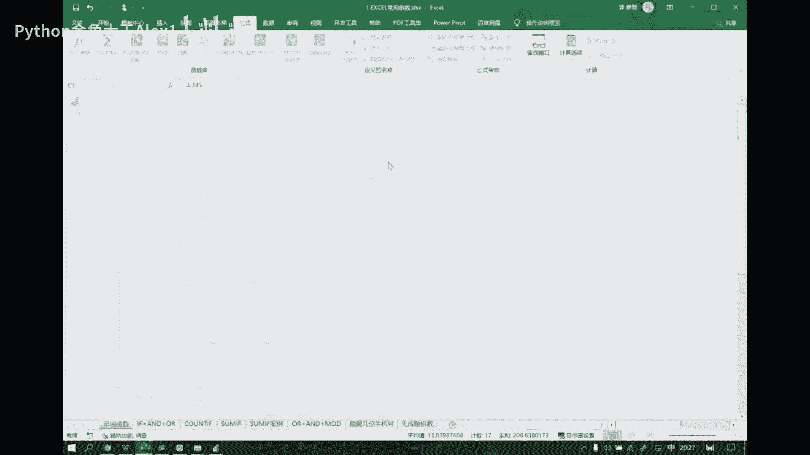

因为因为CSV文件呢它是固定的那种间隔方式，所以说excel它对这种就是规范化的数据呢，是可以直接帮你进行这个解析的啊，然后我们来看啊，第一张表叫order info。

order info就是什么订单表吗，订单表里面有什么，有年份月份数量，产品id啊，单价编编号等等等，还有用户id对吧，然后这是一张表，然后另外呢我们还有这个reagan infer，这是什么。

就是地址啊，就是地区的意思，把这个点开。

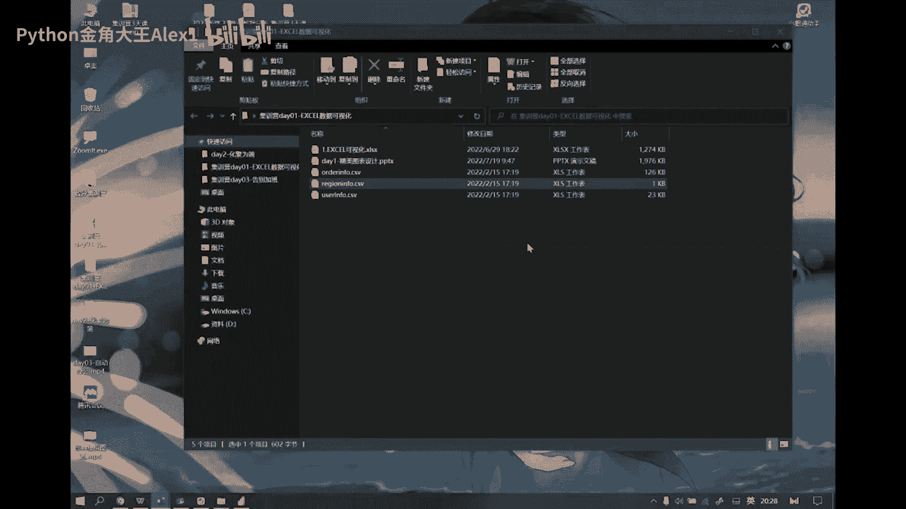

这个点看看吧，有城市编号，有国家，还有地区啊，然后呢，我其实这两张表之间它们是可以有关联的。

咱们来看一眼啊，诶这order info啊。

你看我的order info里边他是不是有个城市编号啊，对吧，这个城市编号和B相比，和我们这个reg info里面看看啊，是一个城市编号啊，就这个数据就这一列数据对，和这一列数据他们之间是关联的。

比如说C001，这个C001，那我就知道了这个订单是哪的，是中国的黑龙江省的对吧，所以你看我我这样，一般来讲，我们的我们的业务报表都是这么去设计的，因为这样我省字段嘛。

因为它我我全我全国就那么多城市对吧，就那么多城市，然后我很好维护他哦。

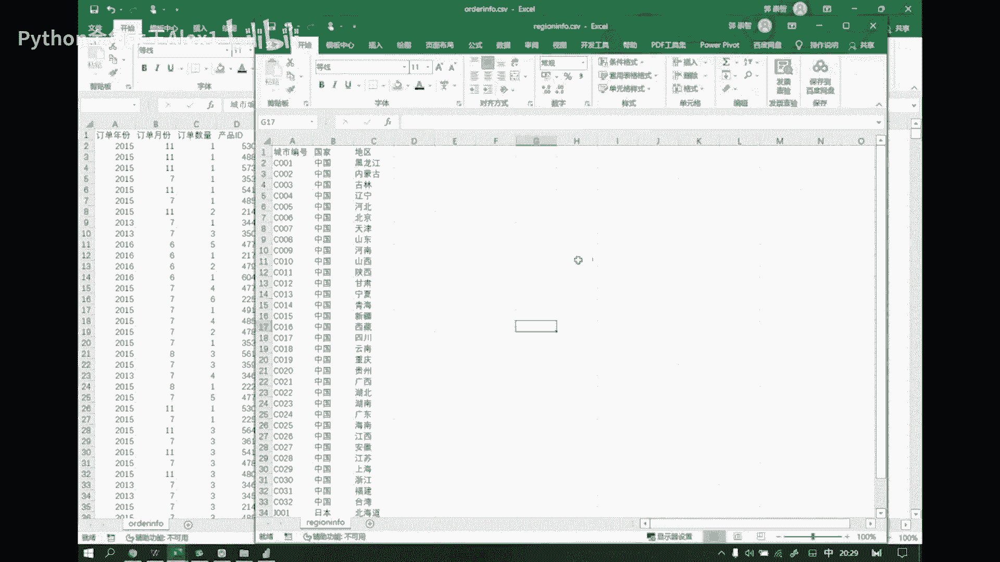

OK然后呢，你说现在的问题就是，你如果想把这两张表做汇总的话，你怎么搞对吧，那有些同学知道了，那我用we look up搞呗，对吧也可以，但你不是多做一步吗。

power bi这种事根本就不用你用we look up，他直接就把你关联上好，我们来看一眼啊，当然还有一张表啊，我们再再瞅一眼，还有个用户表，这个我们也打开一下啊，Excel。

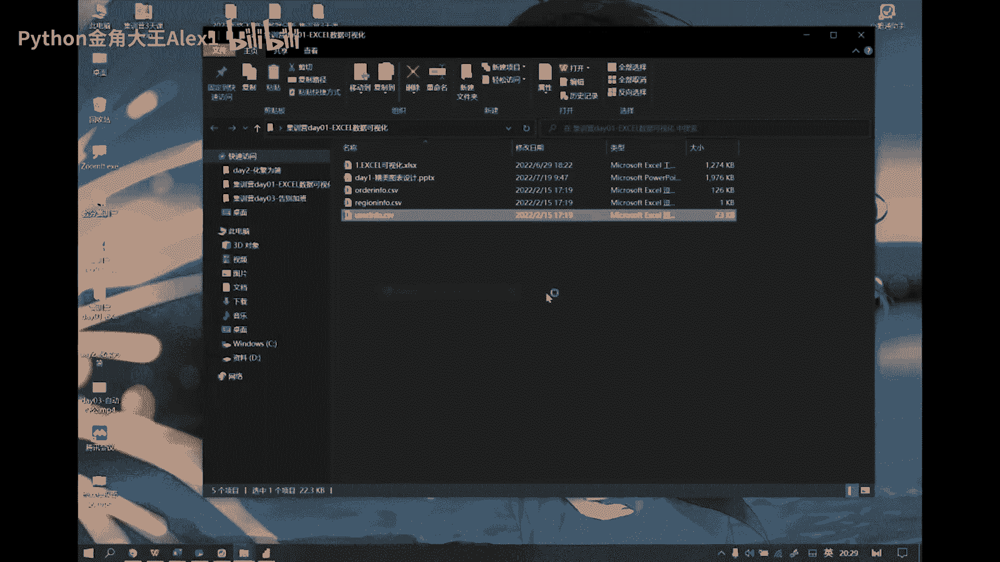

用户表，你看用户表里有个用户id性别和注册日期，那你说我我这张表和我们的那个订单表，如果去做一些汇总的话，我们就可以根据什么，根据我们这个用户id，你看他是不是有个用户id啊，这是订单表啊。

然后这边呢是这个用户表也有个用户id，那么这里边一定都是什么能对应上的，比如这个231625231625，那我就知道了，这一笔订单是谁下的，就这哥们儿下的啊，他是17年6月1号注册的对吧。

这种我们都可以关联起来啊，这个东西啊在power bi里面它叫什么呢，它就把它叫做数据建模。

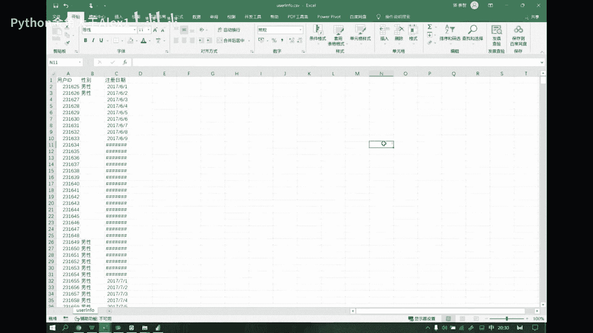

就是我们把这种数据做汇总的这种情况，如果CEL可以用we look up来搞定，然后我们用这个Python，我们可以我们我们叫几点，我们叫合并啊。

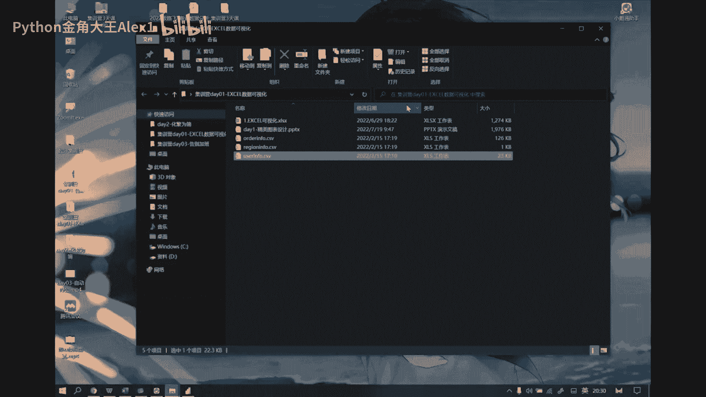

然后那用数据库也要合并，然后呢你用power bi的话，那它就高大上了，叫数据建模，好看看啊，那现在呢我们我们就可以先把这些数据啊，给它先导进来，因为导进来的话，我们才能去做可视化啊，OK怎么导呢。

你看啊这个界面里边啊，就整中间这是绘图区，这是绘图区，然后左边呢会有三个小图标，这个是你你绘图区默认的，然后这是你的表格区，这就是你的建模区，建模区就是干嘛的，就是搞我们刚才那个关联的啊。

就是表与表之间，它们是一种以何种形式去进行关联的啊，OK然后那么在这个上边，这部分呢有一个叫什么获取数据，像有一些经常用到的获取数据的功能，那它直接给你已经放到这了，如果不常用的，那我可以在这边找啊。

把这个点开，这里边有什么有这个你看有excel有power bi数据集的，有这个data server，有circle的啊，就是数据库的，还有这个CSV文件的这种文件啊，它是穷文本。

所以它表达数据的这个就是同样的一组数据，他表达起来啊，就是我占用的内存更少，那如果在传输的时候呢，我显然我怎么样，我的流量用的也少，对不对啊，所以一般互联网这种数据用的比较多，还有什么，还有网页数据。

还有其他的等等，然后其实你要觉得他只能做这些事，就那就太太那个什么太简单了啊，它基本上能够去对接你，你市面上主流的所有的啊这种数据库啊，还有各种各样的文件啊，他基本都能搞定诶，稍等啊，我这边在读。

看到了吧，在这啊看看全部啊，我这边拖拽这个啊，这个滑块看到了吗，这么多种的数据它都能对对接到，也就是说基本上咱们在座的各位啊，不是针对谁啊，我是说在座的所有人哈，你你们公司不论用什么样的数据。

我可以这么讲，power bi都能帮你对接的上，OK啊，这是它的强大是吧，光搞这些事就得多少开发人员去干好，我们现在呢要去加载三个CSV文件，显然呢我们选的是这个啊，就不是excel了，选CSV。

然后点击连接，这个时候呢它会给我们弹出本地的一个位置，你在这可以随便去定位任何一个位置啊，我们这直接定位到这了，然后好，我先把order info给它定位进来，连接一次好，这个时候再连接。

其实这个时候就在干嘛呢，它在启动一个功能，这个功能叫什么呢，就叫power query pokery啊，他是干嘛的，他就是来帮你去做数据的一个转换的，你在这个环境当中，完全可以把你的数据。

按照你你希望的一些形式做转换，你看所以说它这里边有什么功能啊，有一个什么转换数据功能啊，这叫超级查询，好我们点击转换，你当然你也可以不转换，你可以直接加载，那就什么都不动，就把原数据直接放进来了啊。

那我们现在可以做一些转换，比如说哎我们现在不想要某个数据，可以把它删掉，看到了吗，比如说我们先把名字改一下，可以双击它，把字段名称就改了，哎比如说我们现在想把字段类型改一下，我们点击前面这个什么小图标。

我们就可以修改它们的一个类型，比如说我们这个是年份，年份的话，他这个明显年月年月是按用整数来存的是吧，那我也可以把它用用日期的方式表示，也可以用整数的方式表示，而这个123就是每一种图标。

你你这玩意儿用熟了你就知道了，每一种图标你一看就知道它是什么类型，123就是数值类型，然后这种这个ABC呢就是文本类型，然后再往后呢好像也没别的了，那这边就两种类型啊，文本类型和那个数值类型，OK啊好。

然后你会发现什么呢，我所有的就是对这个数据的一些修改形态啊，比如说我们这块我们把类型改成时间，你看我们直接干嘛呢，替换当前转换转了以后，然后我在这边是可以看到什么，所有的一个历史的啊。

当然我们这块改的不好是吧，把这个给他删掉啊，把这一步给删掉，OK然后这个我们再变成一个整数，整数再改回来，就是你所有这边就是你在左侧的所有操作，在这右边都干嘛呢，都可以看到你的操作历史哎。

这个就很互联网了，因为你知道就是就是程序员，他们开发一般都会用一些什么一些，这个就是那个就是就是协作工具，比如什么这个这个get get啊啊，还有什么那个就是还有一些很多吧，有些内部的，有一些外部的。

有些自己开发的，像大厂一般都自己开发内部协作工具，为什么要写作工具呢，比如说我我三个人一组，我去干一个项目好，那这哥们儿，两个哥们可能同时在修改某一个文件啊，那这些文件我怎么最终去汇总到一起对吧。

然后那如果出了问题，我版本可以什么回溯啊，回溯到早期版本，所以这种就是你的操作历史，它对你来讲的一个作用，你在某一刻操作错了，那我完全可以，什么可以回溯到历史的某一个状态。

就像你你电脑我们说做一个什么系统备份对吧，如果用着用着我们电脑坏了啊，软件出问题了，修复不了了怎么办，我们可以还原啊，就还原到我们当年啊，就是那个做的那个定位的那个版本上去。

这样的话你电脑就恢复到之前的状态了，只不过可能会造成一些数据丢失啊，所以这也是它的一个好处啊，OK那假设你现在已经对整个表呢，已经编辑完了啊，已经编辑完了，我们比如说我们该删的删，然后该改的也改了啊。

OK这个时候呢干嘛你要去点击关闭并应用，这就是你power query在帮你做的事啊，就这是它的功能，你所有的操作历史在这都是可以随时随地啊，任意的一个时间点都回来。

可以重新修改或者重新查看了我这些记录的好，现在我点击关闭并应用以后，这个时候呢他会做一个什么加载loading，对不对，loading干嘛，你看他在干嘛，他在模型当中创建连接模型啊，同学们啊。

这个词一出来就显得很高大上，对不对，什么是模型啊，啊好看的啊，它加载完了以后呢，你就会在这就是下边这个位置，你可以看到你那个数据啊，得稍微读读一下啊，稍微读一下出来了对吧。

看到了我的表格数据呢就加载到这儿了，但是其实你到这儿的时候，它是给你一个演示的，他已经帮你把这个表格数据啊，给你做了一个好好完整的一个解析了，看到了吗，你所有的字段是什么，然后字段与字段之间有什么关联。

包括你的年份，我我会帮你自动去进行什么年月日的一个拆解，他都帮你搞定了，就是说你他并不是简简单单的说，把我一个表格就加载进来了，它其实经历了一个什么一个curry啊，一个处理的，而且还有什么呢。

它为什么叫加载到模型当中呢，在这在这儿啊，在这儿，你可以看到你这个数据表的这么一种展示形式，就是对我数据的一个结构的一个描述啊，什么叫结构，就你这个表格的字段啊，就你这个表格它每一列是什么意思对吧。

这叫结构啊，结构的一个描述描述好了，你你如果只是倒了一张表呢，你是其实看不出来它它这个模型有什么意义的，那我们再继续往里加啊，我们再把另外两张表给加进来，再点获取，获取之后。

然后我们还是点这个CSV点连接，然后连接之后我们再把刚才我们导的是order对吧，我们先把这个REAGON给它导进来好，导电量，还是我们先去检查我们的数据有没有问题，那显然这边有问题的。

因为我现在是column123，这成了我的列标签了，而我们下面这一行才是真正的类标签，对不对，所以呢我们肯定是要去做一些转换的啊，在这里面转换怎么转的啊，我们在这里边就是他这边有一个什么，你看这个是吧。

将第一行作为作为标题，当然这只是它的一个很简单的功能啊，就是你你就知道我这个query他到底干嘛，就是我所有数据不规范的问题，我在我都是应该在我包括我数据的处理问题。

我都应该在query这个过程当中去完成的好，那我现在干嘛呢，你注意这边啊，注意这边现在是一个圆一个更改类型，然后现在我们点击将第一行作用标题看看，说多了什么，说多了一个操作过程对吧。

这就是你的操作历史好了，我们改完以后，其他的都不动啊，类型什么都不动好，我们现在干嘛关闭并应用这个过程在干嘛，这个过程其实就是在你看检测关系看到了吗，然后加载到模型当中。

这时候你会发现我们的模型在这里边，它一个表两个表，这两个表之间出现了一条线，这叫什么，这叫建模啊，这叫建模，什么叫建模，其实就是找关系找关系，这是它自动帮你完成的，如果这个就是一般来讲十有八九啊。

十有八九，我们数据之间的这种关联呢，他们都是可以自动帮你识别出来的，比如他们俩之间为什么会有一个关系呢，为什么同学们为什么，因为你这个城市编号和这里边的城市编号，明显是什么。

是有这种这个多V1的这样一个关系的，所以它之间是有这种映射的，我们用excel就是什么做v look up而已，就是找这种关系哎，就是干这个事儿，所以他把这个事儿叫建模啊。

但这个其实我们如果你是搞搞这个，你你了解算法，或者你是一个就用中高级的数分，数据分析师的话，你肯定不会把这东西叫建模，因为什么叫建模，我们昨天讲的那个根据历史数据的分布规律，找到一条回归曲线。

这个过程才叫建模啊，这家才叫建模啊，而他他也是这么这么这么称呼自己的高大上嘛，对吧好OK那我们再接着导导啊，我们再去导什么，导这个CSV文件往里面倒，把user音符再导进来好了。

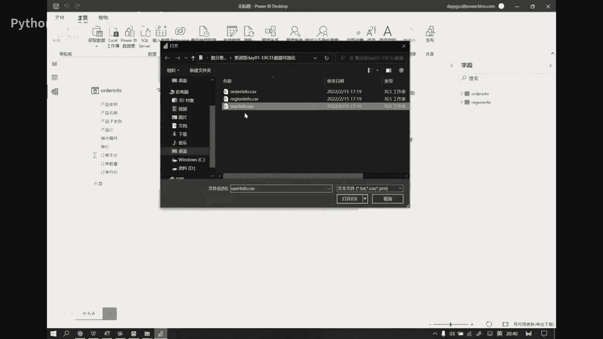

user音符，同学们回忆一下u info跟哪张表有关系，哪张表有关系，说跟第一张表有关系啊，因为第一张表里面也有用户的信息，然后user info里面存的一定是用户的全信息对吧，所以好。

我把它再接着进行导入，再倒啊，看有用户id性别注册日期，然后好点击，因为我们不需要转换，我们直接加载就行了，好加载进来以后，我们还是注意这个建模的界面，它就会怎么样，又会找关联了，啊我们这个没关联吗。

看看啊，做技术用户id啊，看他啊可以跟他之间呢，我们也可以做一个什么，也可以去做一个关联，我们可以通过什么管理关系的方式好吧，可以从这个表到那个表，这个表呢你可以做一些编辑，然后做一些修改啊。

比如这个是order info，然后这里边我们可以做一个user info是吧，这个用户id和这里边的用户id看到了吧，两者之间可以干嘛呢，也可以做一个这样的一个关联，OK啊，然后关闭啊，这样的话是吧。

这个表和C表之间就也出现了一个关联了，OK啊，然后同样的这两个之间也是啊，我们先把它改回来啊，给他改回来，撤销一下，OK啊算了，先这么着吧啊怎么着吧，就是你不论你有多少张表，你的关系有多复杂。

我们都可以，而且这个关系之间的又不只是什么一对多，还有什么双向的啊，单向的一对一，一对多，多对多之间的关系就是你的表不论多么复杂，我们都可以把它这样做这样一种关联啊，OK然后我们再看啊。

这是我们建模的功能，然后那你到演示这边啊，这个时候就是大家一定会感到惊艳的，一个东西了啊，你在那你可能还看不出来，因为实际上你不论是power query，Power pivot，我们做的事是什么。

是你你在你在什么在做内涵的那些事情，就是我们在做内容，因为你你数据可视化是什么，数据可视化表面上看的是画图，但本质上是什么，是做数据处理，你没有前端的所有的数据规范，数据处理的过程的话。

那么你的图肯定是画不出来，画出来也是很奇怪的对吧，所以你的图如果能画好的话，一定是在前端的数据处理上，你是花费了很多心思，真正说到绘图这个阶段，它就很快了，就根本你不需要费太多精力去搞。

比如说我们现在来看啊，我们我们这不是有这样一张表吗，一个订单表，它有产品类别，产品名称好，我先问大家，我现在现在就想知道不同的产产品类别，他们的一个订单数量的大小关系，那这个事儿肯定什么。

就用这个这个条形图可以做个比较啊，对吧，OK你看啊用power bi怎么干，找到一个条形图在右侧啊，右侧啊我们可以找竖的啊，有什么有这种堆积条形图，也有这种什么簇状条形图。

那好我们先给他换一个簇状条形图啊，用这个你一点中它呢在左侧这个绘图区啊，就出现了这么一个小组件，这个组件是什么呢，啊这个组件就是你要绘图的好，那么你现在只只要就是思考把谁作为横轴，把谁作为纵轴就完了。

把谁作为红轴，我们现在要看的是我订单表当中产品类别，产品类别放横轴好，这时候轴啊对吧，这个是什么轴，这个叫轴，什么叫直，这个是直啊，列方向是直，其实就是横轴和和纵轴嘛啊一般因为你柱状图。

纵向柱状图的话肯定是X是横轴，然后Y是纵轴啊，所以Y就是直好，那我现在怎么做这件事儿，你看我把产品类别往轴上一拖好了，我在这个轴上我要显示什么呢，显示每一个类别它们的一个销量。

所以我把订单量放到值上看不出来了对吧，哎这样就出来了啊，然后同样的道理，我想做子类别怎么办呢，那好我把这个子类别拖过来，把这个类别删掉，好吧，现在这个图就变成子类别了，好同样的道理，我想看每一个类别。

它们的它们这个占比组成用什么呀，用我再加一个饼图是吧，也是一样道理，我把类别拖过来，然后把什么呢，把这个订单数量放到纸上，看我这个布局，看到吧，你完全可以通过自己这种拖拽的方式去修改它，呃这个量对吧啊。

然后然后那比如我们可以按照月份，我们再加一个什么线形图，来一个这个啊这个普通的线性图，我们呢把这个月份啊放到轴上，然后呢我们把订单量放到这个值上，那这是什么呀，就是你每一个月份的什么。

每个月份它的一个销售数量的一个变化啊，销售数量的一个变化，OK然后啊还有神奇的啊，那你你看啊，比如说我我现在啊，就比如这是我的一个统一，就是一个统计啊，比如说这个这个是你看这是我的总类别。

这是我的一个什么子类别的销售数量，然后这是我我按月份的一个销售趋势，这是从宏观上看，我现在想干嘛呢，我现在想干另一个事儿，我想看看类别和子类别之间的关系啊，那好比如说我我现在呢我我还是做一个饼图啊。

饼图过来，然后我先把这个类别放到这儿，然后把这个呃订单数量放到这里，现在呢我会这么想，比如说我是一个我是一个观察这样的，就是观察这个这个图表的人呢，我可能会希望说你能不能给我做一些标注，OK可以啊。

比如说我现在可以完全做一个文本框，在这好，比如说我可以做一些说明啊，这里是啊，比如这里是，是销售数量的啊，这个类别占比占比说明啊，说明OK，然后那这边的字体呢我可以做一些调整啊。

比如说我们可以把它放大一点啊，加粗，然后在24号，32号OK啊，然后你看这种就是你可以加任意的，你的一些你想表达的一些观点，我可以通过文本框的方式往里面放啊，然后它还有什么功能呢。

比如说我可以去做一个这种我们叫卡片图，卡片图就干嘛呢，一般就是来帮我们去对你这个这个数据啊，它的一个总体说明啊，比如说我我们现在想用它干嘛呢，想用它来去对我们的销售数量来做一个说明啊。

然后哎这个不太好啊，这个产品，第一个订单数量啊，这个不好换一个吧，换个单价吧对吧啊，换一个单价啊，然后这里边我们也可以做一些啊，这个外观上的一些设置啊，就是它它是一个。

还有一些你可以多放多个标签的一些说明啊，都都是，然后还有什么呢啊最重要是这个啊，比如说我现在想干嘛呢，我我先不要这个了，这个就是占板面，我现在可能用户会希望我我会跟他做一些交互。

然后比如说我当我点击服装，这一个品类的时候呢，那我想看到服装这一类，所有的子类目的一个一个说明，那这种情况怎么办呢，这个其实是我们说的那种下钻视图啊，下钻视图像这种功能啊。

你要是用那个excel去搞的话，能不能搞，其实也能搞，但是会很麻烦啊，但你看啊，如果用power bi去干的话，这件事怎么干啊，我们可以因为我知道类别和子类别，它俩之间什么是一个层次关系。

就是类别会覆盖会包含子类别对吧，所以呢我这边可以干嘛呢，我可以去创建层次结构，创建层次结构诶，稍等一下好了，多了一个这个玩意儿，看到了吗，在这个位置啊，这个层次结构呢它是用产品类别来创建的。

然后它展开的话里边只有一个类别，现在干嘛呢，我要给它添加一个产品子类别进去，所以我我在此类别上呢，我我去给它添加到产品类别的，层次结构当中去好了，那么现在你会看到这个产品类别什么的，包含了类别和子类别。

OK好，现在我们把这个图啊给它做一个变化，把这个给它关掉了，然后呢我把这个层次放到图里边去，然后呢我还是观察我订单数量O，这个时候你发现它有个什么有这样一个变化。

就上边呢会有一个什么下端的这些个小组件啊，小按钮好，我们现在啊把这个选中，然后现在呢我一点它看到了吗，我一点它变成什么了，说变成这个服装，这是哪个类别，下边的那个子类别嘛对吧，然后我可以点它再回去。

哎我再点这个类别看到了吗，我再点这个类别看到吧，就是这种联动，你你看似好像以前你在没见过这种工具之前，你看似这种联动很复杂的联动，其实在这种高级bi工具面前就是拖拉拽的形式，你只是不知道而已啊。

那我再说一个，比如说我们大家应该都知道那种筛选功能，应该都见过那种筛选功能对吧，或者说联动功能，这个每个图表与图表之间的联动功能好，那我来给大家放一个啊，我先放个什么呢，我现在给你放一个条形图。

这个刚才我们用过了啊，放这个位置，我放一个啊，放一个横向的吧，好放在这儿啊，好我现在干嘛呢，我希望我这个条件图啊，它是可以做什么，它可以做产品子类别的一个展示的，那好我把它放到轴上，然后呢数量放到纸上。

OK好，那么现在我们来观察啊，我现在当我点击我先上去啊，先上去看到了吧，当我点击到这个总体的这个时候，总体的时候我右边的子类别墅就是总体啊，当我点击成某一项的时候，我点击服装这一类这一项的时候。

它右侧书也跟着联动了，对不对，那我回去他又回来了对吧，我再点击这个看他是不是也跟他联动了，看到了吗，你看你你看我做什么了，我什么都没做，我什么都没做，他怎么关联呢，他就是默认关联的啊。

就是你你在一个这种看板上，所有的这种组件，它们都是关联的，那我们再回到刚才那一页，比如说我们在这里边，我们去点我光点这一个看到了吗，点这一个我是点某一个节点，点某一个节点看到吗，他都会告诉你。

这个月份我们每一个每一个类类别的销量，以及我们在饼图当中的一个占比，看了吧，都完全是联动的啊，还有一些你没没用过的图表也是一个道理啊，比如说我们现在想去放一个这个其他的，我们没用过的一个一个对象吧。

啊嗯比如说词云吧是吧，咱们也做过练习是吧，那其实你看词语这种东西，其实它它就其实就是，他也会给你提供很多不同啊，各种各样的这种词，用工具也会给你啊，比如这边也是一个怎么用啊，我我主要是演示。

就是我怎么去用这种这个外部的对象，直接添加就行了，当你一添加的时候呢，你就会在你的这个可视化的这个这个地方啊，看看这是多了一个什么W的图标啊，就是word嘛，就是词语，对不对好，那我现在来做个词语啊。

我在这个地方，我把刚才加了个word给它放进来好了，词语是干嘛的呀，就是展示你数据的什么，就是你你数据的大小，用大小来呈现你数据大数据的一个量级的，就类似于气泡。

我们气泡表达第三维数就可以表达一个size对吧，那现在我们可以什么可以用一个文本，比如一条文本，它绑定一个数值，比如一个三啊，比如说一个dancer，他把那个值是一个一那好。

这两个文字我们呈现到词语里边的话，那么它就会变得大，它会变得小，为什么，因为后面这个数值它不一样大，哎，所以它是通过文字的大小和文字的内容，来呈现二维数据的这么一种东西啊，那比如说我们现在想去表达。

我们这个产品子类别，因为它本身就是一个文字嘛对吧，那好了，每一个类别我们卖的数量，是不是可以用这个值来表示啊对吧，也可以用什么，比如我们用单价也可以处理，只要你是数字就行，看了吧，这个词语是加载出来了。

那肯定什么肯定是我这个字越大的，怎么样，字越大的，我这个是单价越高吗，是不是哎这就是你次元要要去做的事情，OK好，然后啊，那么这个东西你你做完了以后，现在你是有三页啊，你有三页，对不对。

好你做完以后OK了，现在我们我们可以交互了对吧，就是前提一定是什么，你的数据一定是在这个power query里边，已经做好了，所有处理就是你只要你在excel里边能想到的，想不到的，能做的，不能做的。

再超级的query里边他都能做到，OK啊，不论级联合并这种都是啊，都是基操勿六的东西啊，就是没什么可说的啊，当然这个东西困惑了很多人很久哈，OK你在这样一个前提下，现在哥们，你要给你的同事们去啊。

去使用了怎么办啊，点发布，但是你发布要怎么样呢，它你必须要有这个账号，你看我这时候有个账号啊，我是一个登录状态，如果你没你没有发布的需求，你都不用登录账号，知道吗，你不用登录账号，一样可以脱机使用。

如果你想发布，那么你必须要去搞一个账号，怎么搞，去淘宝五块钱，十块钱买一个，他会帮你注册完，你给他个名字，他把你注册完。

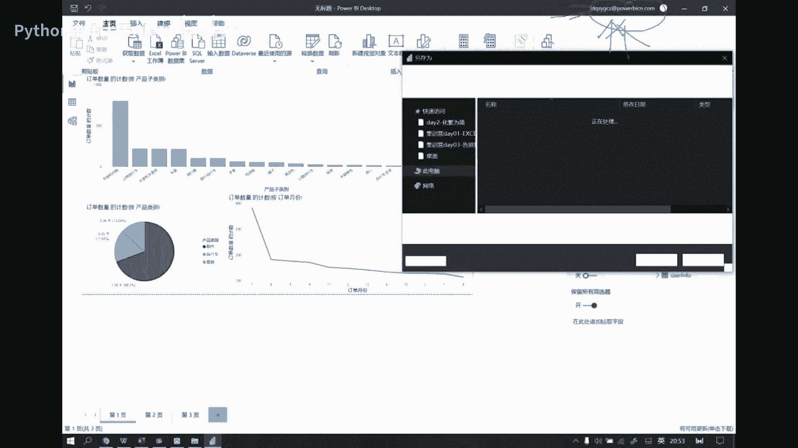

然后发给你，然后你登录就行了，OK好我们现在做一个保存啊，就点发布的时候，它会默认提示你做个保存，比如我们变成2222，OK保存保存以后呢，它会因为你这个属于叫什么，你这个属于叫工具端。

然后它会它会给你上传到云端，就是一个网页端啊，云端就是你的服务器，你你个人服务器是不花钱的，但是如果你是企业用的服务器可以共享的，那我就得花钱了啊，OK好，然后现在呢我们去这个，把这个网页打开看到吧。

我们现在是在操作网页对吧，把网页打开了好了，在网页里面你能看到，就是刚才我们是保存到这个工作区里了，我的工作区里面对不对，你看这个数是什么，我们刚才做的那个报表啊，123呢对吧，这个网页你还发不了。

你怎么搞得这么搞，在文件里面去怎么做一个嵌入嵌入报表，网站或门户这边给了什么，给了你一个HTTPS的一个URL，就是这个玩意儿，你丢出去，你丢到微信里面，对方就可以直接点击这个链接。

打开我们这个报表了啊，这个我可以给大家发一下，我直接放到咱们那个聊天区里面，大家可以试一下，看能不能打开，然后另外一个就是什么，你可以干嘛，哦不对，我发错了，应该是哎呀，我没发错，没发错，是这个啊。

另外就是这个什么，这个是你就是你可以用它去开发，就对接你的开发部门，就他们如果想去做一个啊这个前端界面的话，你直接把这个代码丢给他，他直接往他的代码里面一嵌套就完了啊，比如说这个东西吧，啊。

这个东西我我可以用这个py charm，给他做一个打开，我可以用它去编加，就是做一个这个HTML界面啊，你看我把它放进去啊，大家可以看一下，他就会帮你直接生成一个网页。

哎哎我的PX没破解啊。

算了我就我就不演示那个功能，就是你你如果是咱们如果是有从事诶开了啊，就是咱们如果有有从事这个啊，就是这个这个it行业的啊，it岗位的，那么你可以就是尝试以后，用这种功能去发布你的那个网页啊。

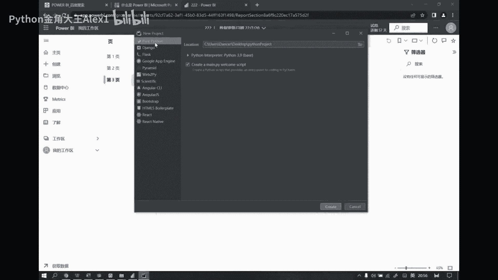

OK我这创建一个啊，这就是一个编译器了啊，我把这个编译器打开，然后我去构造一个HTML5界面，啊我在这儿呢去，就是因为默认他给我的就是一个Python文件，Python一般是脚本文件。

然后我我要写网页的话，那我需要在这边去构造一个这个HTML这种界面，is tml5好，然后这个界面你现在如果用浏览器打开的话，其实啥都看不到，是不是纯粹的一个空网页啊，就是一个空网页。

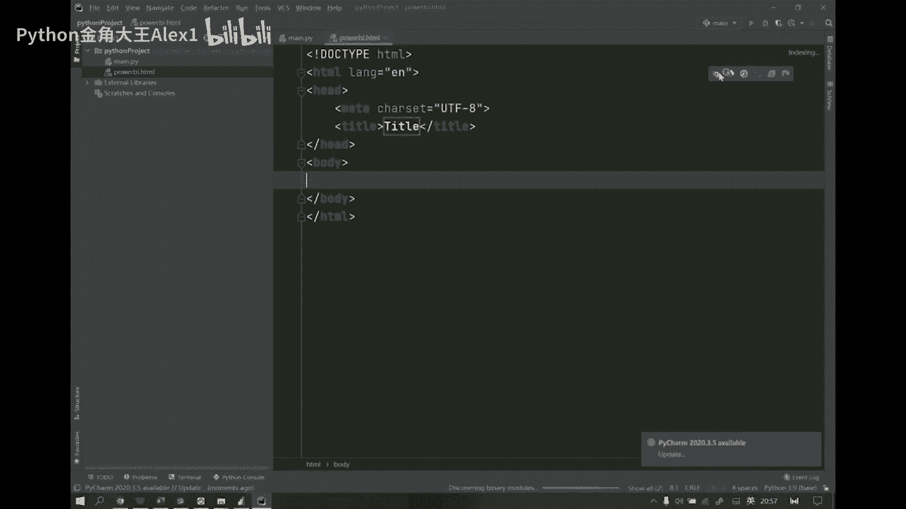

我这边先用浏览器打开下，看到了吧，就是框网页啊，然后哪能看出来，就是你这个网页上面不有个标题吗，就说title啊对吧，这个title。

然后我们可以他设置这个就是我们这个title，比如说我们现在把它改成叫集训营，数据分析集训营，然后我把它做一个修改之后，然后你再去点点它的话。

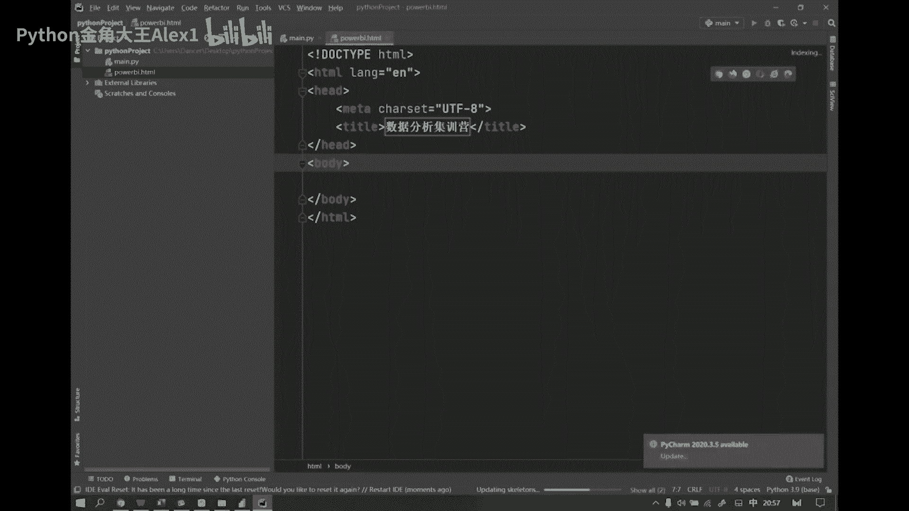

我们就能看到这个名字，会显示到你那个网页标签上了，是不是，但是网页还是空白的，因为网页里面什么都没写啊，然后现在我们就可以把刚才生成那个网页代码。

给它丢到这里面来，好给它粘贴进去好，这个时候我们再给它用浏览器打开，稍等啊。

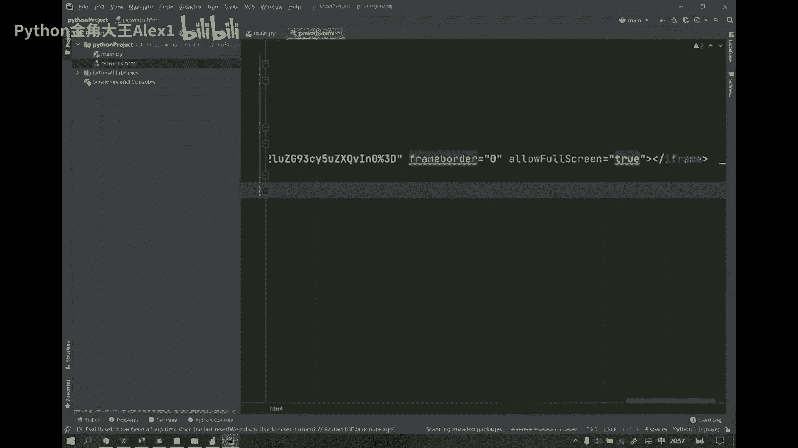

好用浏览器打开一下，看这个标题是我们刚才改的那个对吧，然后你看现在是在加载power bi，你看是不是出来了对吧，这是什么，这个可不是网页了啊，这可不是网络的，它是local house。

是本地的一个文件啊，这是个本地的HTML文件啊，你看刚才我们做的所有这种事，他都已经直接帮你生成了，这样的一个网页的一个形态了，OK啊所以那我们我们如果是一个普通的工作者，你想去共享这种东西的话。

你就直接发布什么，你就直接像我刚才那样啊，嵌入报表，你直接去分享第一个链接给你的同事就可以了，如果你要去做这种开发的东西，你可以直接拿第二个链接，去做一个HTML界面就可以了，OK啊好。

那这个然后他也可以做什么呢，它其实也可以去做，就是我们移动端的配置啊，比如说我想去发布到手机端，你看他在这个对象的配置配置的时候呢，它其实是有一个在视图里边，在这儿有个什么，有一个你看默认有个页面布局。

还有什么移动布局，就是他这边你你不论放了多少个组件，比如说这是一个条形图的组件，这是一个线性图的，这是一个饼图的，好，我如果去做一个移动布局的话，我就可以怎么样呢。

商店在一个移动端的界面上去进行重新排版，比如我把它拖过来，对吧，然后把这个拖过来，唉然后再把这个拖过来，那这样的话，那我就成了一个什么，成了一个移动端的一个界面了，看了吧啊，就它也是可以发布的啊。

所以说你看我，我们其实这个时候你你用这种工具，你用power bi能搞定吗，对吧，肯定是搞定不了了对吧，这就是你用为什么要用高级工具去解决问题，因为高级工具它是可以帮你把这种效率的问题，最大化的提升。

不论是我的处理，能处理效率上，可视化，效率上能联动啊，你点就可以了，点就可以联动，然后还有等等吧，方方面面对吧，多平台发布什么都一样，当然这只是还是在BI工具这个层级上，那如果你是要。

你要是去做这种数分的这种岗位的话，那么其实你还有什么呢，你还有一个更高级的工具，就是它只是工具级别的，这还是工具，你可以自己去搞搞，因为工具它并不一定，因为你作为一个上游设计者。

我工具我我我会最大限度地去对我的用户，我的to c用户，我会让他们去满足他们所有的需求，我最大限度的，但是也还是会有局限，因为他想到的功能我们能用，他想不到的功能，我们呢就用不了。

比如说我现在就想干个什么事儿，比如说我现在就想让我这个里边去嵌入一个，动态可变的一个logo对吧，那我这个事儿我就干不了啊，所以呢这种情况下呢，我们其实就会有更高的你，你可以作为一个什么呢。

做一个工具的开发者对吧啊，当然这个说的邪乎了一点啊，但是呢至少说你在这种高，即便是在高效工具上，你仍然达不到的诉求，我可以怎么样，我可以自己去DIY啊DIY，所以说呢像现在在数据分析这条线上。

当然我们普通工作者到BI，这个程度已经足够了啊，但如果你说我我再往上一层，甚至说我想直接去跨入到数据分析师，这个门槛儿，到这个时候啊，那么你其实有了一个工具啊，有了一个工具，这个时候你就从一个什么。

你成了一个5000的，一个普通的一个业务业务人员啊，甚至说可直接就进入到一个什么，一个大概是10K的啊，在二三线城市，一个10K的一个数据分析人员，其实差在哪呢，啊其实你可能你们处理的业务逻辑是复杂。

都是差不多的啊，但是插就插在什么，插在这个技术门槛，它能跨过来，跨过来以后对吧，你就可以到这个位置啊，就是就是现在所谓的这种数据分析师的，这种岗位啊，所以现在其实啊为什么有那么多的大家，大家会关注到。

为什么有那么多的搞数分赢的这样的公司，为什么对吧，因为本质上就是现在中国的互联网企业，还有包括一些传统的互联网驱动企业，他们都在去对这样的一些人才，就是我能够去高效地推动我整个数据建设的。

然后能够去做数据的这种啊这种高级处理的，甚至说能做一些高级的这种建模的，这种能力的人啊，所以他们是有有这样一个强烈的诉求，在这里面啊，所以说呢啊，那么基本上这些这些做这种中中层的。

这种这种这个属于人才的这种扶植的培养的，这种公司呢，就就是开始搞这种事情啊，所以大家才能看到那么多的数据分析师的，那种小赢啊，就是这个道理，OK啊好，这个是咱们的power bi。

其实这种工具市面上还有很多，比如大家还会听到一个东西叫什么叫timber taber，它也是一个做这种高级的bi工具啊，还有一些什么呢，比如说我们可能会听到SPSS，他其实就会做到建模了啊，就到建模了。

但是这个工具其实并不好用，还有那个MATLAB，因为这些玩意儿啊，他都已经是很很就已经比较老的东西了啊，比较老的东西了，就他们那个界面你一打开，你就感觉就有那种感受，就是那种啊那种那种电子垃圾的那种。

就是那种年代感满满的那种年代感，你就能感受到那个啊，所以就是就是谈不上好看啊，就是你不像你说用TLER这种也好，用power bi这种也好，就是你就会觉得很简洁很美观。

也很符合我们现代的这种主流的UI设计的，那种那种审美啊，所以你你画出来的东西它也好看啊，所以这这是那它们的功能，主要是潜在在那种建模的那种那种逻辑上啊，所以说很多我们。

比如说有有一些可能在大学读统计学的同学，他们会就是会用到这种工具啊，啊，因为因为大学课程更新一般都会比较慢嘛对吧，所以说他们用的还是这种工具，然后像这种一般就像这种反应比较慢的企业。

像这种国企业事业单位，他们可能还会有有用这种工具的诉求，但其实像像现在的互联网的数据分析师的话，他们建模的话基本都都不会说太依赖这种工具，因为这种工具给你的报告，也也都是固定固定式的。

而且很多参数没法调啊，所以一般都是要用这种高级的，这种就是机器学习呀，还有这个深度学习的这种东西，来来帮他解决问题啊，所以这种工具其实本质上都是一类东西啊，都是一类东西啊，老师讲课有自己的节奏，OK啊。

你不要说什么事要去，你牵着老师走，那这个课堂你来讲就可以了，是不是我现在是在给你讲正儿八经的东西，你要觉得我这个东西没有用，你现在可以出去好吗，不要干扰老师讲课的节奏，咱们时间可以拖得久。

我可以把东西都讲完，但是你不要说你想听什么就讲什么，对不对，好了不说了，这个啊，我们休息一会儿吧。

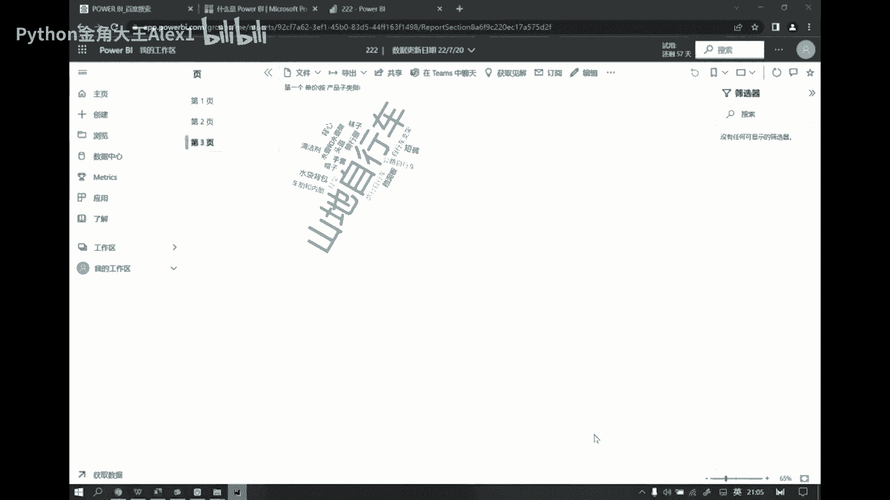