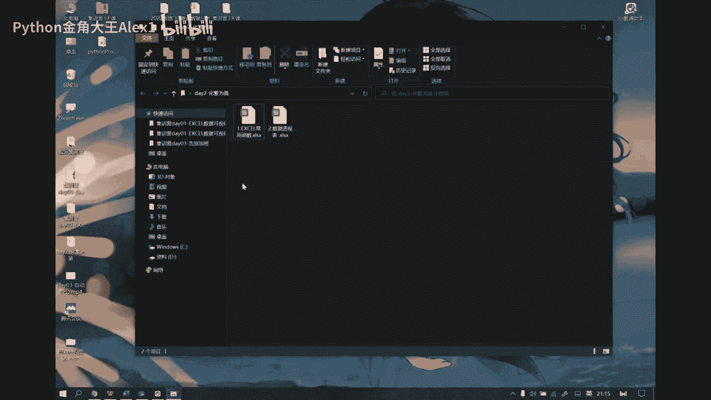
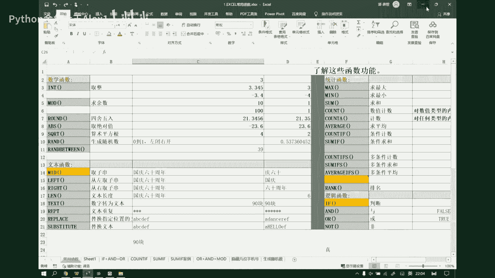
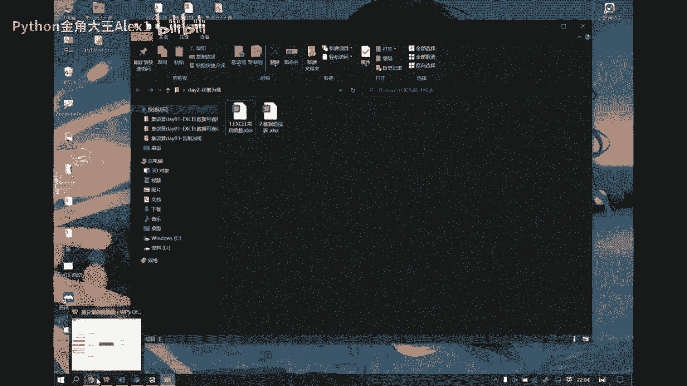
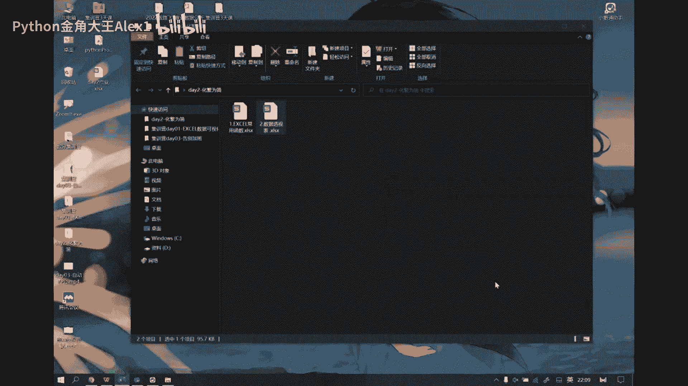
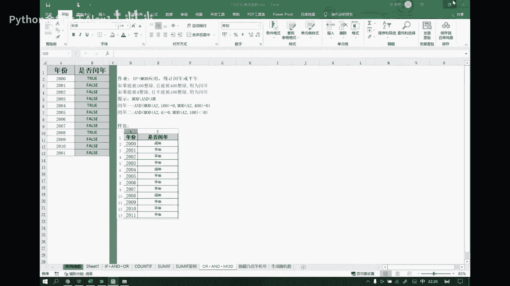
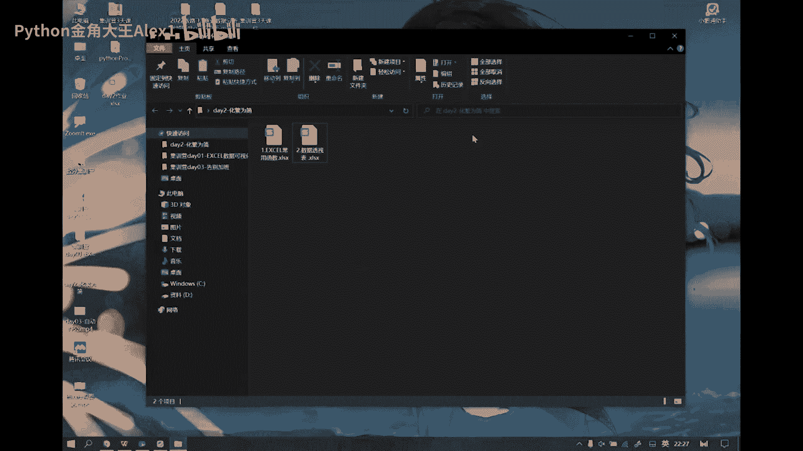

# 【2024年Python】8小时学会Excel数据分析、挖掘、清洗、可视化从入门到项目实战（完整版）学会可做项目 - P98：04 数据分析S03D02（下） - Python金角大王Alex1 - BV1gE421V7HF

哎呀哎呀，我刚才说的差不多，刚才说了好多话，然后我发现我闭麦了，sorry啊啊，我回来了我回来了，我都说了一会话了，然后咱们同学们还在吗，帮我扣个一，来听课的扣一啊，OK好啊，把我刚才那段话再重复一遍。

就是说我们这个power bi呢我们就先说到这里了啊，就因为因为我们说你你数据可视化呀，它只是我们结果呈现啊，那你要想做好，结果呈现的，一定是前期怎么样数据处理的这一关你得过啊。

然后呢这个power bi这种工具来讲呢，它可可以说就是，如果说大家只是做一些普通的工作，或者一些基本的统计工作，可能你还还用不到啊，还上不了这么高级的东西，所以说power bi啊对于大家来讲。

算是一个可视化的一个扩展，算是一个进阶，OK啊大家如果感兴趣啊，你可以再深入去研究一下那个power bi，当然有问题也可以私聊你的那个咨询老师，然后让然后我们可以做一些深入交流，呃。

然后呢对于我们大多数的学员呢，还是在统计这一块，我们的效率呢要去做一些提升，所以说接下来讲的这个内容啊，就是我们这个excel的这个统计的问题啊，这个才是我们今天的一个啊重要的一环啊。

然后我们现在主要是以这两张表的方式，来给大家做讲解，所以这两个数据啊你应该手里都有了啊，如果没有的话，抓紧去找你的那个咨询老师跟他要啊，他会他那都有，然后我们要讲一个是函数，一个是透视表啊。

这两个功能函数的话呢，这个我们先把基础功能先过一下，然后我们通过一些案例让大家来感受，就是你要真正把你这个使用函数去解决诉求的，这种这种这个功能，就是这种思维啊，给它提升起来，其实我常说。

其实你用excel去解决问题，尤其是用excel的函数功能去解决问题呢，本质上就是在做一个编程的一个过程，因为它的逻辑跟编程逻辑是完全一样的，只不过你用的工具是什么，是excel工具而已。

而编程内部内部人员呢用的是什么，是计算机语言而已，其实道理是一样的，所以如果你有了这个思维啊，哪怕说你你像咱们在座的各位，应该或多或少都留点那个了解点Python对吧，那么你有了这个思维。

其实你再去搞Python的话，也会对你有很大的一个助力啊，当然最本质的还是帮你去解决，实际的工作当中啊，我们用excel去做这种统计的这样的一些诉求啊，好我们把这两张表就给直接打开了啊。

打开了第一章这个excel的函数功能呢，我们大概会给大家介绍这么多函数啊，所以我要快速的先把功能过一下，过完之后我们通过这些案例啊，来看一看我们如何用函数解决实际问题，OK啊废话不多说了。

第一个int函数就其实就是取整啊，我们对3。141，比如3。1415926，取整的话，我们直接来一个等于一个int，然后这里边我我们我我先说一下函数，这玩意儿一般怎么去调用啊，其实那如果你熟了的话。

那你就直接在单元格里面写等号就行了，等号呢就开启了函数调用的这个，什么这个功能了，然后你如果记得函数名的话，直接敲就行了，它也会有这种提示，看到了吧，有这种提示，有些函数你用的多了，自然就记住了。

也就不用找了啊，如果你不记得，还有一个方式这么来的，你你想在这个地方用一个函数公式，我可以在这啊选择上边的这个公式选项卡，它里面有个什么，有一个插入函数，这个东西呢。

东西呢你一点开里面能看到所有类别的函数，你可以看到excel有好多的函数，知道吧，把这个一展开还给你做了好多分类，财务类的，日期类的，数学类的，统计类的各种类的。

就基本上我们日常工作你能涉及到的都有了啊，还有涉及不到的，所以函数这个东西你怎么学，你不能像你只能把它当成一个字典去用，明白吧，就像学说话一样，你想表达逻辑，你想用函数去解表达。

你想用语言去表达你的思想，跟你用函数去解决一个实际诉求，其实道理是一样的，你不用说我，我捧着一本书，我天天去背，我跟你讲，那么那么讲一点效率没有，因为函数这个玩意你三天不用就有可能会忘，OK啊。

所以说那你应该怎么办呢，你应该是根据你的需求出发去尝试着去找，有没有这类的函数，但但这个核心点在于哪呢，你的需求你的需求，我们很多同学是这样的说，我现在想做一个事儿。

我现在想把这一个一个网站上的一个文本，把它复制下来，然后我想去提取里面的有效信息好了，你要这么去搜的话，你什么都搜不到，你也不可能解决这个问题，所以本质上你你是程序员跟不是程序员。

在解决这类格式化的结构化问题，的一个本质区别是什么呢，是你不太善于去拆解功能，为什么你不善于拆解，不是你笨，是因为你不了解，或者你没有这方面的经验，你没有这样去思考过问题，你也不知道计算机。

他们工作室是一种什么样的逻辑，所以其实如果你想你一个需求，我想去解决掉你最最大的问题是什么，你要学会拆解，你要知道怎么把它转换成一些更轻量级的，更具体的步骤，然后我再每一个步骤上有什么卡点。

我去找什么样的函数去帮你解决掉，OK啊，所以说其实一个复杂的需求呢，往往是有很多的过程去共同组成完成的，那么每一个过程呢，可能是有一个函数可以帮你解决掉，如果这个过程函数解决不掉。

那么它一定是猜的不够细，你再猜得更细，一定能找到对应的函数，最终帮你把这个事情解决，那当你当你这个这个需求你解决的多了，你拆解的次数多了，你自然就有一种去这个解决问题的这种，一种思维了。

这个思维呢其实就类似于编程思维，其实本质上是一样的啊，因为函数这个东西，它不只是在excel当中使用这个概念在拍啊，在这个编程语言当中其实也是存在的，而且大多数的编程语言都是用这种函数的。

这种逻辑去解决问题的，好吧OK啊，然后那我们现在的第一个函数，它就是一个取整运算啊，所以说我们如果想去插入一个函数，在你不太了解的情况下，那么我们就可以在这点诶，我怎么选不中了，稍等啊，我电脑卡了一下。

啊好了啊，点击在公式里边啊，公式里边选择什么插入函数，然后我们去找，在这你可以直接搜到它，int转到看到了吧，这就来了啊，当然你也可以去写一些名名词，比如说取整，取整也可以转，你看到吧也能定位到它。

但问题是你这个东西得描述的清晰，而且而且这个excel它的它是能理解的，而我我我可以告诉大家一个悲比较悲观的事实，就是可能大多数你在这时候，在这里边是表达诉求的话。

你可能很难说到那个具体的对应的那个函数啊，所以你还有个更好的办法就是什么呢，去百度啊，你把你这个需求描述简洁一点，清晰一点，然后百度也能找到类似功能，比如说我可以百度说。

我如何在excel当中去做一个取整运算啊，或者去，或者说我如何去获取一个小数的整数位等等，你可以这样去定位搜索对吧，OK啊好，然后我们从这里面搜的时候，你会看到这个函数的一些基本描述。

比如说我我先收取整，然后呢他给我推荐了一个int函数好了，这个int函数它下边是不是有个描述啊，里边一个number，将什么数值向下取整为最接近的整数，向下取取整为最接近的整数，OK啊。

所以说他不会是那种四舍五入的，对不对啊，我只能取什么，就是我只取三，哪怕你这个写的是3。5几，他也取的是三啊，取整数位好，你点这点插入，然后确定这个时候怎么样，它会让你选择一个数，你要对哪个数取整好。

我们选择这个回车，确定好了，是取到三了，所以这东西如果你用熟了以后，其实本质上你你敲也是一样的，Int，然后只不过呢我们这个啊它这个自动补全啊，它得用那个tab键来补全啊，而不是回车键。

用tab键来补全，我们选择它tab键，OK取消了三好啊，那么这是我们函数的一个调用机制，以及你如何查找它的一个方式啊，那么接下来的话呢其实就道理都一样了啊，道理都一样了，比如说我们现在想去取余数。

那好我告诉你这个函数叫mod，那怎么调用它呀，等于一个MOD对吧，然后那么取取什么对这个三啊，我们取一个对，就是对三求余是不是一啊对吧，就是你第一个数是什么，是你要取余的数。

然后第二个数什么是你要对谁取余的这个数，这两个东西都可以通过单元格的方式来选择的，比如说我我们可以在这个位置写个三好，那我这个公式可以这么写，等于一个mod，然后tab键十对谁呢。

对这个单元格的内容去取余，tab键补全对吧，也是一个一啊，就是它excel的操作逻辑，就是我所有的数据是可以通过单元格的方式，来进行表示的啊，好然后呢round呢就是什么。

就是取我的这个做这个四舍五入啊，Round，然后再说你要取的数，然后后边是你保留的小数位，比如说我们保留两位诶，然后下边这个取绝对值啊，那这就好理解了，ABS啊。

其实函数那个计算机语言里边他去做的这种呃，这些函数基本名字都都是类似的，都差不多啊，就这个单词，然后所以这个函数大家能记的话，就尽可能记啊，然后四块的就是求这个算术平方根啊，就是也是一样的sq RT。

然后我们对这个数，比如说我们取算术平方根，那就是二对吧，然后round呢是生成0~1之间的一个随机数，所以说我们比如说我们经常会演示一下，案例的时候，我们会这样啊，比如说我们我们随机取一个小数。

等于一个round啊，等于run，然后哎这样生成一个数对吧，然后我们随便拖拽，那么这些数都是什么，都是随机生成的，0~1之间的这些小数啊，跟他跟他这个类似的，还有个整数。

就是我们可以给定一个区间叫run between，我们从0~100，我们取一个整数，看到吧，也可以，然后往下拖拖拉拽，直接也帮你生成这么一堆整数啊，OK这是两个这两个一个round。

一个run between啊，这两个函数好，这是我们的常用数学函数，然后再往往右看统计函数，我们做统计的话，肯定统计数用的最多了，也我们也叫聚合操作，统计函数一般是对一组数据来操作的啊。

不像我们这种数学函数，它是对一个或两个几个数来求的，他们一般是求一组数据好，有没有max main some count，count a等等等等啊，来举个例子，比如说你现在有这么一组数据。

我们来一个run北退，然后从10~30之间好，我们生成一组好这么一组数据啊，我们把它直接做一个复制，然后做一个选择性粘贴，就是把这个公式给它清理掉啊，好那么我们随机生成阶数啊，就保留下来了。

我们现在想取它的最小值等于一个mn min，选中这一组，求的是这一组数据当中的最小值，同样的求最大值，选中这一组，然后括号回来取的是他们里面的最大值，想求平均平均值average好，选中这一组数。

括号回来求平均数，还有什么求和啊，我们最常见的对吧，哎一个some，然后选中它回来对吧，当然像这种函数统计函数一般什么，一般你在开始这里边，我们都是比较容易这个诶，不是在开始在哪个里面。

哎绘图不是这页面数据公式在这儿呢，哎不是这儿啊，哎哪去了，好想，诶怎么找不到呢，哦这呢这呢看了吧，就这这种函数，就是你这种统计函数，在这是有个什么快捷的一个功能啊对吧。

你像我们如果没有就是刻意去做这个事的时候，一般我们都是什么呢，比如说在这块我们插入一个求和对吧，他直接把这个SAM数给你弹出来了对吧，本质是一样的对吧，当你用熟了以后，你就不会再去屑于使用这种东西了。

你看求和均值计数最大最小值其他函数对吧，它调出来是谁呀，调出来不就是我们刚才在那个差那个那个，公式界面的这个函数，这个界面嘛，对不对啊，本质都一样的啊啊这个删掉啊，然后还有什么呢。

这是我们常规的几个统计啊，最大最小，然后count计数等一个count，然后我们也是把它选中，减重啊，tab键回来哎，16个数对吧，其实我我们还有一个就是excel，有个小的小的一个福利吧。

算是你把它选中以后，你说可以在下边能看到什么均值计数，还有什么，还有求和对吧，所以如果你想快速的去看一组数据，有多有多少个，然后有这个和是多少这种基本统计指标，我可以直接拖拽它就能在下面看到了啊。

好然后呢，另外就是我们这个这个这个count count if，以及这个SAIF这两个东西啊，它涉及到了一个逻辑判断的一个东西啊，逻辑判断的一个问题，所以呢这里边呢我们先来先来了解一下什么的。

那个if啊，if函数，我看诶这边没放if函数，给它加一个啊，加一个if函数，好A函数，什么是A函数啊，A反数呢它其实是相当于一个判断函数，就是我我们可以给一个条件，什么叫条件，比如说A大于B是否成立。

这叫条件，比如三等不等于五，这是一个，这也是一个条件，它要么是真，要么是假，我们呢用真呢我们用true来表示TRUE，然后假呢我们用false来表示这两个英文单词，真和假，OK啊，这是逻辑。

所以说那我我们其实无外乎你想表达的逻辑，就是这种用逻辑关系可以表达的这种等式啊，OK就可以表示了，比如说我们可以来一个等于一个括号，比如三大于五，括号回来，那你这里边三大于五就是一个条件对吧。

这个条件它要么怎么样，要么是真，要么是假，好这个条件如果是真，往后看啊，你看这个函数第一个是你的什么，你那个条件就是我们现在写的，如果他他成立了，我们呢就会返回这个值，如果它不成立呢。

我们就会返回第二个值，所以往后写啊，那么这个值我写一个，比如说我写个文本啊，我写一个，真啊，然后后边呢我再写一个假，姐姐给甲好看，就是甲为什么是甲，因为啊三大于五是不成立的，所以我们给的是后边这个值。

那好我们变过来啊，比如说三小于五成立吗，三小于五显然是成立的对吧，那我们就会给谁啊，这个东西它成立了，我们就给第一个，它不成立就给第二个，所以说现在我们一定是显示的是什么，说真的对吧，这是if函数啊。

if函数也就是说if是一个条件啊，它是一个一种条件，那么如果我们在求求求和，或者说我们求个数的时候，哎，那我就也就是说它就变成了一个有限制条件的，求和或者是求个数，OK那比如说我们现在啊什么是条件。

通常来讲我们俩可能是有多列数据之间啊，比如两列数据，假如这里边我们写一个这个ab aa bba a a b，好吧，就这一段吧，下面不要了啊，下面不要了，删掉啊，OK以这一段数据为例，开始。

然后我们加上一个，OK好，假设你你现在啊，我现在想求什么呢，我现在想求A的和哎A对应的这个数据的和，比如这个我们叫类别，然后这个呢我们叫我们叫直，我们想求类别等于A的值的和，这种情况是什么，就是求和。

并且是有条件的求和，所以叫some if好，some if怎么求，我们在这个地方写啊，等于一个some if，然后只要你这边能看到这个函数的什么，这这里边的就是参数，但是你这看不到说明。

那如果你你不熟的时候，你可以怎么样呢，你可以这样，你可以啊，通过我们说这个啊数公式这块点击插入，然后选择some if，还找到这个函数，然后点确定它会给你提示的，把当你把鼠标放到这个位置的时候。

它会告诉你这个参数是什么意思，看到了吧，然后当我把鼠标放到下边的时候，看到了吗，他会告诉你这个CRON是什么意思啊，给你这样的提示啊，当然了，现在有我了，你不用看它了，我告诉你什么意思啊。

这边等于一个su some if，然后tab range是什么，Range，就是你要去进行条件条件，那个那个那个处理的那个什么那个区间，那这个区间是谁呢，就是类别，然后第二个是什么，是那个条件。

这个条件等于什么呢，就是我想判断这个类别，它得等于A对不对，这是我的条件，但你要注意它所有的条件的表达，必须是用什么是用文本的，就是外边套一层双引号的方式来表示的，所以我想判断类别。

就是这个数组里边类别等于A的啊，那我怎么表达这个逻辑呢，用双引号括起来，然后干嘛呢，写A啊，等于大写字母的A，然后后边什么叫some range，一看就知道了，是什么，是你的求和区域哎，注意这个地方啊。

逗号可别写成那种汉语的啊，它是英文的那种半截拼音啊，OK哪个是我的求和区域啊，那显然我们的值这个区域是我的求和区域好，然后括号回来对吧，或者你直接按tab键补齐就行了，得到结果是多少啊。

103看看对不对啊，这个A然后这是A，这是A，我给他先给他标记标记起来啊，标记成一个橙色，看到这个值啊，选中这个，选中这个，选中这个再选中这个啊，用CTRL键来多选，得到的结果多少啊，是不是103呢。

哎跟他就对上了，那同样道理，我现在想干嘛呢，比如说我我现在再来一个，我现在这是一个，比如这是Python啊，然后我再加一列，我再加一个这个，比如java它也有一组值啊，等于一个run北between。

然后从0~100，我把这个呢也做一个复制，然后选择性粘贴数值好，我现在干嘛呢，我现在想求啊这个Python成绩啊，Python成绩大于这个20的啊，大于20的同学的java成绩的和啊，这怎么搞呢。

也有个条件了对吧，条件是什么，条件是Python他能怎么样呢，它要大于20，然后求和写C呢，求的是java的和对吧，所以我们的some if怎么写，这个是if条件，这个是你的求和区域好。

大家可以想一想啊，怎么写呢，那我还是等于一个some if好，第一个range是什么，是我的条件的那个什么条件的处理的区域，那显然就是Python，我要干嘛呢。

我要去判断我们这个Python这个区域怎么样，它是不是大于20，所以我加一个双引号里边儿，我写上一个大于20的这样的一个表达式，然后第三个sam range求和区域谁啊。

求和区域就是我java这一列括号回来好下来，120分对吧，大于20的有哪些呀，这个是大于20的，好把这个先给它清理掉啊，先变成透明的，这个大于20，这个这个这个好了，然后他们这是几个呀，四个对吧。

然后他们的和是多少啊，263十二八得到的和111，不对啊，不对，一个两个三个四个求和哎，不对啊，看这啊，这个区域这个区域大于20，然后求这个区域的和，我知道，加个等于啊大于等于30的和。

是啊啊没错啊没错，我算错了对吧，不是算这一列，应该算左边这一列，对不对啊，刚才我看错了啊，Sorry sorry，没有问题，对不对啊，因为因为我我要求和，是是这个这个这个和这个的和这多少。

这是128呀对吧，这没错啊，刚才就是128啊，我看错了，sorry啊，把它改回来对吧，128，OK好，这是some哦，if在这呢这个不用加了，然后另外还有什么呢。

这个count和count a是有区别的啊，count跟count a呢，首先这两个函数不论哪一个，他们就是做奇数的，比如说我现在直接把它选中，那我现在基数是八个，但如果说我把这个地方给它清理掉。

少了一个数，我现在对这个区域计数是多少个了，是七个，看到了吧，七个这叫什么，这个叫空值，就是没有值是空啊，也就是说我不论是count count计数还是count a技术呢，我都不记空值。

空值都不算一个数，但是count a有什么用，count a是对任何类型的内容都基础，任何类型它要比count更广，count只记什么，它只记数值类型好了，那我先做一个改变，我先把这个位置变成一个AA。

就不是一个数值了，对不对，它是一个文本，什么叫文本，什么叫数值，数值简单理解就是能运算的，能做数学运算的，而文本不能做数学运算，OK好那好，我们现在再来选它啊，你看这一段数据，我计数是几个，是七个啊。

它是七个数据，那我如果想我用这个count，用count来记的话呢，把它选中几个六个，为什么，因为它不把A当成是一个计数来算，因为它只统计什么，只统计数值，然后你要想把A算出来。

就是他我们正常选中我们这个count算是什么呢，它这个求和是count a函数来帮我算的啊，这count a看看啊，等于一个count a诶，然后这边我们选中它还是这这一组数据，现在几个七个。

因为这个文本它也被记一个数啊，OK然后还有下边就是这个count if跟some if，这个本质是一样的啊，count if跟some of一样的，我不说了，那么还有一个是多条件，多条件得说一下啊。

为什么，因为它的这个函数的传传法就有变化了，诶，什么叫多条件呢，比如说啊我现在想去算一个，我们这把以那个count为例啊，以count为例啊，在标记上，假设我现在想干这个事啊。

我现在想求的是这个Python，Python大于20，然后这个java大于是java大于20的数据的个数，好吧，这是个多条件对吧，有两个两个if，这是一个if，然后这又是一个if。

所以呢它就变成了一个叫if丝啊，我们想求个数的话，那就是count if，对不对好，那你怎么去传这个条件啊，来看等于一个count if s tab键，看它第一个放的是什么。

叫criteran rain啊，就是我直接放什么，我因为我这边不涉及到求和了，我就是计数，所以他没有那个统计过程，我那我只需要干嘛呢，我只需要告诉你，我要对哪个数先去做处理了。

我先对Python这个啊它是怎么样呢，它的条件是他要大于20，然后再加第二个条件是java，然后这个数组，然后它应该怎么样呢，它也要大于20好，这是什么，这是两组哎，对这个区间做这个条件判断。

对这个区间呢做这个条件的判断好，我我做这个统计，tab键只有两个啊，这两个把这个改一下，别人改改成23，然后把这个改成33，现在三个了对吧，因为多了一个什么，多了一个这个啊，OK好，那我现在问大家。

如果我们现在想求一个count，if什么conscience呢，我想求类别等于A并且Python大于二的类别等于A，Python大于20的java的总成绩，这个事你怎么做呢，说两个条件啊，这是一个if。

这是一个if，然后求的是SAM，所以变成了一个SAIF丝啊，怎么去做一件事啊，Some if s，然后你看它就要比你那个count多了一个什么，多了一个求和区域，因为count不需要去做统计了。

我就是直接就知道了，我就是干嘛的，我就是去统计个数的，而SAM不行，你必须告诉我你要对哪一个哪一组数据，哪一个区间内的数据做求和，所以你必须要先告诉我目标区域诶，那我求的谁呀。

我说要求的是这个java的成绩啊，对吧，我要对这个java的数据啊做求和，然后我的条件是什么呢，条件首先类别这个区域它要等于A，当然等于的这个条件你可以把省等于号省略啊，也行啊。

然后Python这个区域怎么样呢，它的条件是要大于20补全啊，OK这样把这个值就求出来了啊，这就是一个some if好，那然后后边这个还有average if本质是一样的啊，还有一个什么做排名的函数。

哎这个比较有用啊，我们叫自排序，就比如说我们现在想去对这个java，我先想想对他做一个排名，我想算出来他们的排名怎么办呢，用rank等于一个rank a rank，但只不过现在rank呢。

老板的这个rank呢已经被替换了，被替换成一个AVG跟EQ啊，我们先说rank啊，rank首先你要干嘛呢，你要去对这个数啊，然后呢这个区域来进行一个求求排名的运算，一排在第几位。

12345678排在倒数第二位，数七位啊对吧，同样道理，我现在想求任意的一个其他数怎么办呢，往下直接转就行了，但是呢你这么拽会有问题啊，问题在哪，你看啊，我们把这个公式给它点开，点开以后你会看到什么呢。

你会看到我们求的是这个数据，然后在什么呢，在这个区域内的一个排名，OK问题就来了啊，问题就在这，把这个给他拖的广一点，不然看不清啊，看看这个第二是谁呀，蓝色的数据这个数字啊，然后这个第第二期到第三四。

什么是不是这个区间呢，比如说我们要求这个数在这个区间内的排名，所以呢那就会导致你当你下拉这个公式的时候，你会发现这个数值也会跟着下拉一格，然后我的区域怎么样说也跟着下拉一格啊。

所以说我这个区域怎么样说不能变呢，对不对，不能变怎么办，不能变，你就应该应该在这个地方就把这个区域啊，给它锁死，F4F4给他锁死，然后这个时候你往下拖拽的时候呢，你看不论你到哪一行。

比如这一行他是第二期，这是27~34，然后再往下D28，它跟着下拉一格，但是我的区域还是2724，这个区域是不变的啊，所以说有有些是有些函数你要注意，当你的查找区间是不能变的时候，你要怎么办。

你要F4给它单元格锁定啊，不然的话你的公式会出问题，好这是rank，它是比较有代表性的一个函数啊，好好，然后呢就是我们这个日期函数啊，year monday啊，这个就比较比较简单了。

比如说我们啊现在这个对于这个，在这写一个吧，2022年的7月18号好了，我们现在求这个日期的年，那我就直接来一个等于year，然后选中它，把年就求出来，这边也是一样的，等于一个month，然后选择它。

我们就把月份求出来了，这边的等于一个什么，等于一个day，然后选择它，我们就怎么样呢，就把这个天就求出来了，是吧啊，然后today呢直接能拿到我们当前的，因为它是它是日嘛对吧，now什么now。

要是有时间的，就除了你的年月日，还有时分秒信息，所以这两个两个参数，这两个函数啊是没有参数的，就你想获取当前时间啊，就直接这个today，然后这个直接获取获取一个N就可以了啊。

啊如果我需要在类别旁边加一列，能够显示该类别第几次出现，这个没有直接的函数，这个就是你得得稍微设计一下啊，这个我可以明天你记得提醒我，你可以到那个群里面艾特我，然后我帮你想一下，OK啊。

没有直接的函数中用啊，好课堂上就不讲了啊，课堂因为时间也挺晚了，我得抓紧讲啊，好然后文本函数啊，文本函数也是比较常用的，尤其是在我们处理文本的时候啊，经常会用到这些东西，这里边这几个都是比较常常见的。

一个是may啊，取子串，什么叫子串，比如说对于四舍五入这个字符串，五入是它的子串，15是五，是它子串四舍五也是子串，明白吧啊，就这边都属于纸串好了，你现在想取纸串，比如说它怎么用啊，直接看公式了。

我就不写了，这什么意思，直接mate函数，然后我求的谁C14就是这个东西吧，我要对这里边的也不是这个啊这个啊这个，对这里边的文本取什么，取第二个位置开始的连续三个字符，第二个位置开始，这是一。

这是二对吧，然后34×60就是我取到的结果对吧，同样道理，我left呢就是从左取啊，从左取看他什么意思啊，C15取的是这个数据，从从从左取取哪儿啊，一二对吧，从左取从二开始取，取什么取啊，取两个啊。

取两个，一二取到国庆对吧，这边也是一样的道理，这边从右取取几个，取四个，取它的后边右边的四位，然后这个呢求文文本的长度，整个这个字符串里边有几个字啊，求它的长度，用line。

它我们往往做运算的时候会用到这些东西啊，然后转文本啊，这个数字转文本我们直接用text，这里边就会稍微复杂一点啊，稍微复杂一点，比如说我我们昨天提到了，我们说那个通用格式对吧，比如你在这儿看到是90块。

但实际上呢单元格里面存的是90，而没有那个快，这个快哪来的，这个快是在自定义单元格格式里边，其他数字格式里面出来的，看他说有这么一个通用格式啊，通用格式后边加了一个快，那么这个相当于是你。

你你做了各种各样的一个自定义类型啊，这样的话有什么好处，不影响我们运算对吧，但是呢也不影响我们展示，所以二者可以兼得，但是你做text转换不一样了，我是要把你转换成文本的，我是用一个函数的方式来帮你。

把一个数值转换成一个文本，就是这个时候你转完以后，我直接直接这个诶，嘿，我把它直接复制，然后我到这儿我选择性粘贴，我粘贴数值，你看我得到的是一个90块，而这边你直接做做这个复制。

然后你在这儿去选择性粘贴，它是个90对吧，所以本质上是数据有变化了啊，所以那它这边怎么去控制格式呢，就是就是后边这个玩意儿啊，其实就是你你的一个叫什么叫format text，就是你的文本。

我们叫叫这个格式控制字符串啊，那这里面用到的原理呢，就都是我们那个通用格式的那些原理啊，我们用零来表达数字，然后快呢，就是我们我们加进去的一个自定义文本，所以这块如果你不知不知道怎么回事啊。

你去看录播第二天啊，第二天里面会给你讲通用格式的问题，好吧，这会儿不展开了，OK好，然后下边repeat文本重复啊，我们比如说想想快速的输出五个星怎么办，直接来个repeat。

第一个参数是你要输出的文本，第二个是你要重复的次数，所以这边打印了六个星啊，然后下边这个replace，我们指定位置的这个文本替换是什么意思，我们C20操作的是这个，然后第二个位置把连续的三个。

从第二个位置开始，BCD3个把它怎么样呢，替换成dancer，所以就变成了变成了A，然后dancer ef变成这样一个字符串，看看对吧，a dancer ef这边也是一样的啊，它怎么样呢。

它是指定一个子串，它不是按照位置指定，它是直接告诉你我现在要怎么样，我现在要在单元格当中找到一个叫BCD的子串，找到了BCD的子串，干嘛把它替换成hello，把这个叉掉，把hello放进去。

所以它就变成了A大写的hello，然后再来一个EF啊，就成这样子了，OK好，然后右边的这个逻辑函数，逻辑函数if刚才我们说过了，and or和not，他们呢都是直接会给你返回一个true或者false。

比如说我们这个一个三一个五，一个三一个四啊，我们可以来一个这个，嗯来个别别试了，来个五吧啊来个五，我们判断啊，我们判断我们判断这两个数字跟四的关系，那我们可以来一个and啊，等于一个and。

比如说这个值是不是大于四，然后并且这个值是不是也大于四，如果他俩都满足了，那么我就返回一个true，如果如果这个有一个不满足，我就会返回一个false啊，好你看我改一下，我把它改成七吧。

是不是变成true了，因为它大于四，它也大于四，是不是啊，那我把它改回来，比如它变成二的话，又变成false了，为什么，因为它大于四是成立，但它大于四不成立，OK这就是and啊，那么然后呢跟他正好相反。

哎正好相反，它大于四或者它大于四，有一个成立，我就返回true是吧，有一个成立有返回数，如果两个都不成立，我才返回false是吧，两个都不成立，我才返回false啊，有一个大于它成立。

我就返回true啊，六是吧，也是一样的，OK啊，然后not呢正好正好是相反的，比如说我们对false取一个not等于一个not，然后加上一个false，那我们得到的就是一个true。

同样这边也是等于一个not，然后我们对true取反，那就是一个false啊，好这都属于逻辑性的判断啊，然后比较这个稍微比较难搞一点，就是这个we look up函数了啊，垂直查找什么时候会用它啊。

就当你你现在想做什么呢，比如我们现在想根据某一列，然后来去做这个啊，做一些数据匹配，比如说你现在有就像我们刚才那种，你有一个订单表，有一个用户表好了，这两两张表之间你要把数据做汇总怎么办啊。

这种情况就是we look up什么意思呢，比如说你现在这是一组数据，然后呢你这边啊啊我这边再来一组数据，这边是A啊，ABC不要C了啊，然后他是优秀啊，然后这个是一般好了，这个是我的一个区间啊。

我们把它称之为叫什么呢，叫这个查找区间，我现在呀想在这个啊，我把这个整体右移一下吧，有影响，我现在想在这儿啊表达我的一个情况啊，什么情况，这就是情况啊这个情况，然后这个是我的类别好。

这个是我我的一个查找区间，映射区间，我现在想在这个映射区间里面的，去找到这里边的，它等于A的，我肯定它对应的情况是什么，就是优秀对吧，它等于B的，我对应的情况就是，一般我想在这在这个表格当中添加一列。

那这一列的数据呢，要根据这个映射关系去来做填充，这种情况就是什么，We look up，好它第一个值是什么，是你要查找的那个目标值，那么显然这个是我的目标值，这个目标值我要在哪个区域内查找。

显然这就是我的那个目标区域对吧，OK把它选中，但你要注意啊，你的目标区域你要查找的这个类别，在这个目标区域它应该处于第一列，这是一个小细节啊，要注意，OK然后后边CORINDEX你要在这个区间内查找。

这是这是一二，后边345查找哪一列的映射，我们要查找第二列的映射，所以那我这个地方写二啊，把这个二写上，后边有一个range look up，什么意思，它只有两种情况，一种叫处近似匹配。

一种是false精确匹配，什么叫精确匹配，你这里边找的数跟这里边能完全等于，一般就是文本类型啊，文完全相等，这叫精确匹配，如果是不相等，比如说我这边是一个30，我这边只有0~35这个区间。

那我30呢应该对应的是0~35，这个区间的对应的数，这叫模糊匹配啊，一般是数值型的查找，我们用这种模糊匹配，所以我们如果想做，显然我们这种情况是做什么，是做精确匹配啊，那我们就得选什么。

选择这个false啊，选择false，好把它写进来，优秀是进来了，好我们先往下拽，然后我们发现啊，出了点小问题，为什么会这样啊，同学们为什么会这样，跟我们刚才那个rank道理是一样的，为什么。

因为你的查找区域，不论是这行这行这行这行说不能变的，那我们公式会有个毛病，你随着往下拖拽的时候，我们表这个公式里边的引用单元格呢，也会随着你的位置变化而进行变化对吧，所以这里边我们要怎么样。

我们要把我们的查找区域啊，这个区域进行什么锁定，就是这个区域你不能变，你看到这儿的时候，这区域干哪去了，这个区域到哪儿了，所以你到这儿了，已经没有值了，所以他得怎么样，他得锁定到上边啊。

OK所以我们在这儿给它锁定以后，然后你再去怎么样拖拽啊，嗯转远了啊，回来往下拽，拽到这哎这样就可以了是吧，A是优秀，B是一般啊，OK这是we look up，这个呢叫精确匹配啊，还有一种情况是什么。

是模糊匹配，比如说我们对Python啊，对Python我们要根据成绩来对它进行一个啊，进行一个什么呢，进行一个啊评价吧，进行一个评价啊，这个评价呢我们可以分为我们简单一点啊，我们我们在这儿啊。

我们说这个Python，然后这边是评价，这边你要注意啊，如果是做这种模糊匹配的话，这个东西你的数值类型必须是从小到大的诶，从小到大的一个范围啊，比如从零开始，然后到50，然后到100这个区间。

哎这个区间那么零零我们可以可以没有对吧，没有这个区域，你可以把范围写大点，比如说一吧对吧，OK然后你没有没有这个映射，你只有在这开始有映射，这是什么，这个是啊，坏啊，然后到这是好好了。

你有这么这么一个区间啊，然后我们现在开始对它做映射啊，然后这边我们也给它加上一个括号，一定要注意字儿啊，这一定要怎么样，一定要是从小到大排序的啊，好然后我们现在做做这个we look up的查找。

我们还是什么呀，你你要选的是什么，你要对这个值在这个区间一定要注意，你你的这个区间，一定是要把你查找目标值的那一列啊，放到第一列上啊，然后这个区间里边的第几行，第几列呢，这是第二列对吧，这是第一列。

所以我们后面要写上一个二，然后现在你要做什么，你要做近似匹配了，而不是什么精确匹配，因为比如说你的26，在这边能找到对应的值吗，没有我只能找到它是-1~50之间的是吧，所以我要写的是true。

就是近似匹配，然后这个区间我们还是要给它锁定上啊，F4，然后哎这个一会稍微改一下啊，哎，啊都是50以内是吧，应该在这写啊，这是坏，啊这个好好把这个数据改一点啊，比如就像59这边变成一个80。

八点30A57，OK是吧，哎这样我们就可以映射成好坏好坏，这样一个区别了啊，好这就是我们的we look up啊，所以它非常适合你做什么，你做这种多表之间的这种关联啊，公式啊。

注意公式我们是可以跨表引用的，比如说我我这个值我可以我可以怎么样呢，我可以引入到另外一个位置，比如我我去引入这个这边这个数值没有问题的，知道吧啊这个要要注意啊，好好这样的话呢。

我们这个公式啊基本就说完了，然后呢我们来通过这些公式啊，咱们来看一下我们能不能做这些问题啊，能不能做这些题，比如我们第一个啊，这个，感受一下啊，我们现在能不能算出来我们三门都通过的同学，我想做什么呢。

我想给三门都通过的同学打上一个及格，然后有一门不通过的，我就打上一个不及格，这个事儿我怎么设计这个公式，我怎么设计，首先你要想输出及格或不及格的话，你要怎么办呢，只有一个东西能帮你搞定这事就是if函数。

如果怎么怎么样，我们就给一个什么及格，对吧，否则就什么就不及格是吧，那问题是这个条件怎么给，这个条件怎么给，条件是什么，是每一个同学的数学，计算机英语都及格，显然是什么，是个and的条件。

数学也大于60，并且计算机也大于60，并且英语也大于60，对不对，所以你要想表达这个逻辑啊，比如我们把它写到这啊，那这个逻辑怎么写呢，等于一个and这个数大于60，并且这个数大于60。

并且英语的这个数也大于60，是不是它是true了，怎么样，我这边就及格了，因为我引用了，谁说H12这个这个单元格的内容啊，好了，那我们现在可以精简一下，怎么精简，我把你这个单元格的公式直接拿出来。

怎么样放到这个位置，放到这个位置不一样的呀对吧，然后我把这个清理掉啊，这个清理掉，我现在把这个公式怎么样直接复制到这来，这得改一下了啊，因为这个单元格他那个位置不对了，这个是E2F2，这个没问题。

然后及格不及格，E r a b c d e e r f r g r，没错啊啊啊这有问题啊，说这个位置是出现了无效引用啊，应该是这个对吧，然后这个为什么无效引用了，因为你单元格一复制它。

就它这个单元格也要往上跑嘛对吧，上面没有单元格的，然后这个是F，然后这个是这个对吧，就可以了，往下一拽，成立了吧，OK啊，那这边呢只需要把什么，只需要把那个and给它改成all就可以了对吧，OK啊。

然后下一个啊，嗯哪个哪个呢，这个count if跟SAM其实本质是一样的啊，我们就以这个为例吧，这个SAIF为例吧，你看你你三位数想去解决这个问题啊，我们比如说先解决这个啊，我们借方啊。

借方166400，贷方186000怎么算出来的，显然是什么求和的问题，求和但是有条件，我们想求金额，这个和求这个SAM条件是请求借方的时候，是这这一列怎么样，它得等于借。

想求带方的和的时候是这一列得等于带对吧，所以呢我想去求借方的总额，some怎么样加条件，if什么条件，我的range是这一这一列它怎么样，它要等于借，注意啊，注意我们这个里边的所有的。

如果你手写公式的话，一定要注意这种符号都是英文的半径啊，OK然后后边求和区域是谁，就是求金额的这一一组回来好了，借方求出来了，同样道理，求带方怎么办，哎把它直接复制就完了，把这个公式直接复制放到这儿来。

然后把这个J怎么样改成带18600，看这个数是不是这个数啊对吧，这个16400就这个数对吧好啊，然后这几个大家这几个就大家回去做吧，这个我就不说了，然后东西都一样啊，公式我看看公式这边也有啊。

你去你去对着公式去写，然后这个啊隐藏几位手机号，这个问题怎么搞怎么搞这个事儿，隐藏手机号的话，其实就是一个文本的一个替换问题，因为我我其实本质上就是，比如说我我正常都是这种操作对吧。

把中间这个这是四个区号吧，对吧，我要把这个区号给你隐藏掉，怎么搞，那你就要想你要拆解这个逻辑啊，怎么去怎么去搞这个事儿呢，我首先我得找到中间四位怎么办对吧，我得首先我得找到他，怎么找到他。

用那个我们我们讲过的那几个文本函数啊，看看哪个可以用replace还是substitute，用哪个呢，同学们，这个你是要怎么样，你要指定目标文本的内容的，这个是什么，指定目标文本的位置的。

显然replace可以帮我们搞定这件事，对不对，因为我们现在要做的就是我，我们要不论你这个电话号码是多少，我规律是什么，我就是要把从123从第四位开始的，后边的1234的四个手机号。

给你替换成四个小星星，对不对，所以那怎么搞，就等于一个r replace，然后我们对这个字符串从四开始，连续的四个变成，12344个星星是不是替换成功了，那如果我让你替换成100个星星怎么办。

100个星星啊，这你还能打吗，不能了好，我怎么重复输出100个星星，repeat对吧，repeat一个星星写上一个四个，那你要写100个，就把那个四变成100吗，是一样的对吧，哎往拽完事是吧。

哎所以所以说啊我不知道大家能感受到什么，其实就是你要想用函数去帮你解决问题，那么你要干嘛，你要学会去找规律，你要去找规律，找你这个问题的规律，如果一个问题他能够去找到规律的话。

OK这个这个事计算机就能帮你解决，因为计算机它没有那种很发散的思维，它所有的思维都是什么呢，都是你要给他预制好，你告诉他按照这个规则去搞就能搞定，那么这些事计算机都可以帮你搞得定啊。

只要你能找到这个规则，所以说本质上你不论是用excel函数也好，还是用编程语言去开发也好，本质上就是什么，就是你要去规律搞这种规律啊，那你见得多了，你规律归纳的就好是吧。

甚至说你可以在归归纳规律的过程当中呢，可以去做一些拓展或者做一些储备啊，就是为将来的一些功能的啊，迭代或者功能的扩展呢去做一些好的设计啊，那么你就会成为一个架构师啊，成为一个架构师啊，这就是你的本事啊。

其实本质上啊这就是一种编程思维对吧，只不过你现在还没用编程语言而已，你现在用的只是一个excel而已对吧，你你学编程也要记很多函数的啊，跟excel道理是一样的，但也是用那些常用函数啊。

好啊呃这个是函数啊，函数部分，然后如果大家学会了这些函数之后啊，我呢给大家布置一个作业啊，布置一个作业，这个嗯这样啊。

我我先，我先给大家演示这个作业是什么一个需求啊。

你才知道你这个威力是什么啊，比如我先。

哦这样啊，我们去我们是随便找一个网站啊，比如用用我们这个官网吧，官网我们有一些那个课程的大纲，然后我们这样啊。

我们做这个事儿，现在呢我把这个数据给你拿过来，我给你拿过来啊，我给你给你展开，我给你拿过来，然后然后这个数据一定是很乱的，我现在要干嘛呢，我现在我现在需要整理大纲，我现在整理大纲。

但是呢我现在嗯我不可能手写，手写，太麻烦了太麻烦了对吧，干嘛呢，我直接全选CTRLC复制好，然后干嘛呢啊我现在就创建一个excel，我先帮你做几步，然后剩下的事你去做，OK这个作为作业啊。

这个同学们一定要做啊，我先把你直接粘进来了，我就把那个网站，那个网页的数据全拿过来了对吧，然后这边有几个小棘手问题，我先帮你处理一下，比如首先啊我把这个事给你搞定之后，你就能找规律了。

首先这里面有很多图标，就是图片，你看像这种什么播放按钮啊，这都是图片啊，这个事怎么搞啊，我直接点中一个CTRLA全选，直接delete，就是键盘右上角那个键，就把这些这个图片的东西给删掉了啊。

然后这个文本呈现不全，我把我把这个宽度调一下，然后我在从上到下啊，我去把这个行高也处理一下啊，到这，好行高也都对齐了，行高对齐了，然后呢，我现在把这些没用的没用的删掉，这个会影响到你那种查规律的东西。

我给你删掉了啊，删掉，然后到尾巴上也也有啊，这些也给他删掉，好了啊，现在你能看到的是这样一张表，我现在需要你干什么啊，我现在需要干什么，我现在需要你把这些这个还有这种啊，这种没用的数据全都给我清洗掉。

你用今天的函数啊就能解决好吧，然后我再告诉你一个方法啊，告诉你一个方法，你怎么去判断这个玩意儿啊，它就是个数值，你可以用一个等于is is一个number这个函数，它可以帮你检测这个东西是不是一个数值。

比如说时间啊，日期呀，纯数字啊，小数整数啊，它都可以帮你判断它，如果是数值，那就等于true，如果它不是数值呢，就是false，看明白了吗，然后我再提示你一下啊，这是一个函数，is number函数。

和排序方法啊，借用一个排序功能就可以把这件事给我搞定啊，啊需求需求是什么，就是把把与这个课程大纲无关的内容啊，全部删除掉，但你不能手动删除啊，你得用公式的方式能快速的删除，而且这东西能够被复用。

你哪怕我再给你复制几页，你也可以很快的帮我帮我搞定好，大家听明白这个需求了吗，这是你的作业啊，这是你的作业啊，一会儿课下，我会把这个整理好的那个作业给大家发下去，大家听明白了，给我扣个一好不好。

作业放到桌面上，第二注意好，大家听明白了吗，哎，来听明白，给我扣个一，好我期待着大家的华丽蜕变啊，我期待着啊，你你看别人完成了，你也不要去不要去看啊，因为你一看这个事儿就没意思了。

你你一定要去有那个思考的过程，知道吧，你这个事其实没有多复杂，但是如果你一旦你有了一个思考的过程，你就真的知道这个函数啊，你将来就会用了啊，你就你就知道应该怎么去用函数，帮你解决你的实际问题了啊。

你千万不要，当然你如果实在憋不出来，你可以看一眼，偷偷看一眼啊，但一定要有思考的过程好吧，一定要有思考的过程啊，OK啊这个我我这个课下会整理一个啊，这个清晰一点的版本给你啊，就这么一个表。

然后你要去把那个啊，把那个我结果我给你给你附个图大概什么样子，然后你给我整理出来，像这个对齐的事，好好整啊，这个这个其实不用操作，直接对齐就行了，知道吧，直接对齐就行了啊。

就是通过这直接调那个对齐就可以了，好啊，这是我们今天的作业啊，然后还有一个透视表。

我们再说一下啊，这张表透视表呢是干嘛的，是我们做统计的啊，做统计的这么一个常用的一种图表，一种方式啊，然后透视表的话呢，这边有这么几个功能啊，我们来重点说一下。

好这是你的数据源啊，然后我们可以看到这个数据源呢，有这种数值型的，也有这种类别型的啊，类别型的，还有月份日期等等等这些信息，然后我先问大家，我想我想统计出每一个部门的啊，每一个部门的这个总金额怎么办啊。

每一个部门的总金额怎么办好了，这时候你还你还有的办，我求SAIF嘛，对不对，To some if，哎我根据部门名称等于人力部，然后扒来一个，等于市场部发来一个，但显然这样的话不好，为什么呢。

因为你的统计工作，我肯定是随时想看到任何一个部门对吧，这种情况你就可以做透视表了，甚至我可以更复杂，我想知道不同的部门，不同的项目，每一个月份他们的金额的和的均值的差异等等。

这些问题我们都可以通过透视表的完成，其实这个东西叫什么呢，这个东西就是一个分组聚合的事啊，分组聚合的事，其实你不论在什么，只要你跟数据相关的什么样的场景下，都有这个概念，数据库啊，circle对吧。

肯定有这种概念，然后你包括power bi啊，excel啊，这种统计工具也有，你包括用编程语言，Java，Python，C加加等等等等啊，只要跟数据有关的，一定有这个概念啊，分组聚合，什么叫分组。

就是根据这个什么类别名称来进行，进行这个归归纳归纳，然后呢，聚合呢就是求某些数值类型的这个聚合指标，比如说这个总和啊，均值方差呀，乘积呀，嗯最大值最小值等等，这些都属于聚合啊。

好那么这个透视表就是干这个事，那我们先说怎么去做这个透视表啊，我就在这演示透视表呢，你完全可以这样啊，就是我可以完完全就是单开一个sheet，比如我我就在这个里边去做透视表，那么你鼠标点哪。

你的透视表就差到哪儿去啊，比如说我现在鼠标就点在这里，然后我要干嘛呢，我要插入一个数据透视表，那么它会有一个数据区域的一个源数据源，这个圆就是你要对哪一个表格数据进行透视好，我们现在呢通过这个点击按钮。

我们选择数据源这一组数据，好给他选中，然后确定，那么这出现了一个透视表了，对不对，透视表了啊，然后那么我们鼠标点中这个数数，这个透视表的区域内的任何一个位置，我都可以操作它，它是有一个单独的操作界面的。

就在这儿，在上边，在上边，这个这个选项卡里面会多一个数据透视表，分析啊，当你创建一个透视表的时候，把你把鼠标放上去的时候，就能看到它，我把鼠标放到别的位置就看不到了，看到了吧，我把鼠标放上去。

我就能看到它选中它，然后右侧就是我透视表的一个编辑界面，我现在想看啊，我现在想看每一个项目的金额的总和好，那你项目想放行还是放列上，那你想放行上，把它直接拽到行上，想看总金额，把金额拖到值上。

OK我现在就求什么就求和，如果你想看更多项，比如说我想看求和，我还想看均值，再把这个金额放过来干嘛呢，在这个里边有个下拉箭头，把它点开，这里边我们可以做什么呢，我们可以做这个字段的设置，这里边有什么。

有你各种各样的汇总方式，有求和计数，均值，极大值，极小值乘积等等，都能干，你所有的聚合方法在这里都能找得到对吧，比如说我们做一个啊这个这个平均值确定是吧，又出了个平均值，这个名字可以改啊。

我们可以在这个地方，还是在这个值字段设置里边，在这儿啊，值字段设置里边，在这里边，我们可以把这个名称改一下，比如我们就叫平均值是吧，然后这边也是你不要在这改，知道吧，你不要在这改，你在这改。

你你还是会跳这个界面来，这边我们变成求和确定，OK啊，然后还是一样的，我现在想求一个极大值，怎么办呢，把金额再往里面一拽，再加一列，然后这个地方聚合指标我们变一下，变成一个最大值。

然后这个地方改成最大值，点击确定，OK完事了，好，这是什么，这是你你求各种聚合指标的一种处理方式，那好我们现在再来一个啊，我们再来一个，我们现在插入一个数据透视表，还是选择刚才那个区域数据源。

好确定这边呢我们来复杂一点，我们先横轴放这个啊，这个这个项目，然后纵轴呢我们放这个部门啊，或者我们横轴放部门，纵轴放项目啊，那怎么办，我把部门名称放到横轴上，把这个项目呢放到纵轴上列上。

然后把金额放到纸上，这样的话呢我们就会默认统计什么呢，把这个删掉啊，我就默认统计的是你这个每一个部门，每一个项目的这些个核是吧，然后啊，那我现在啊如果我不想算盒，我想看什么。

我先想看每一个部门的每一个项目的占比，哎那这个怎么算呢，我们常规的想法可能会觉得啊，那我现在在做一个占比吧，我可以用这个值去除以这个值吧，是不是你会这么算，你会发现当你去点击你这个单元格内容的时候。

它并不是一个数值，它是一个什么，它是一个公式，所以其实你不应该去破坏这种，就是你你这种诉求不应该是去以，以你这个在这个透视表之外去加功能，或者说破坏我这个透视表本身结构的，这样这种情况去处理这个问题的。

因为透视表它是一个整体，它其实是跟什么，跟你下边这个数据源它是整体联动的啊，这边变它也会变，所以你不要去破坏它的结构，你要想去要那种需求透视表都给你怎么给的，也是在这里边，在直的这里边儿啊。

这是第二个功能了啊，刚才我们讲的是直的汇总方式，这是各种各样的聚合，现在我们讲谁，我们现在讲值的显示方式，显示方式默认是无计算的好，那我们来看一看它里面都有什么计算，有总计的百分比列，汇总的百分比。

行汇总的百分比，百分比，负的百分比，积的百分比差异百分比，按某一字段汇总等等等等对吧，你看我们来个简单的百分比会变成什么样子，百分比啊，那他要指定一个，我们是根据哪一个基本项来做做百分比的。

比如说我们要以这个采暖费吧啊项目啊，我们以采暖费作为基础，然后根据采暖费的百分比是百分，是比采暖费高10%，还是这个低于10%对吧，它是110%还是90%，那好我们做个确确定看了吧啊这边没有游戏哈。

诶刷新一下透视表，刷新一下好啊，OK看到了吧是吧，这样我们就直接统计出来了啊，那这些东西在哪儿在哪儿设置的，看清楚了吗，就是我们就讲了两个功能，一个是什么，一个是你只显示都是在字段设置里边，一个是什么。

一个是你的值的汇总方式，一个是你的值显示方式，这里边是做什么百分比啊，差异化呀等等这些东西，然后这里边什么做，你各种各样的聚合指标的调整的，OK啊，然后除了这两个之外啊，除了这两个之外，就是我们在纸上。

还有我们第一个讲的是什么，你可以在里面无限的加值去去，同时放多个不同的聚合指标，另外一个什么就是我我左边这个东西啊，我们再来复杂一点，复杂一点啊，现在呢我不但要看我这个人力部什么什么部门。

我还要看这个采暖费，我还要看月份，就是我现在呢，现在呢我要我要通过三种不同的情况，来不同的维度来观察我的数据了，那好那这种怎么办呢，我们在这里边去加诶，我加一个加一个这个什么月份吧，哦加日期进来吧。

好我加日期进来啊，这样不太好啊，这样我把我把这个这个日期放上面去，然后项目放下边来，这个月份给他删掉啊，删除，啊这个日期删掉吧，用月吧啊因为日期太细了，还会有很多空值出来，对不对，OK好。

现在啊我是这样的一种情况啊，每一个月份，然后我这个只显示方式给它改回来啊，我们变成一个求和项，不然的话会有空值啊，因为有些值不存在，OK变成只显示方式，我们变成一个无计算啊，那就变成一个普通的求和，好。

现在我可以看到每一个月份，然后每个部门的各种采暖费，他现在这种情况，你会发现它其实是一个默认什么，这种可以展开的形式对吧，就类似于一个大纲视图，哎那么我们想调，我们想调，比如说我们这个什么小G。

比如说人力部的小G，然后生产部的小G，这些问题在哪搞，在哪搞，在哪搞啊，人力部采暖费都在哪儿，在这儿呢对吧，我们刚才一直做的是什么直直的，这个什么值显示方式啊，汇总方式，我们现在在干嘛呢。

我们来变这个啊，就是你你作为行和列的这个分类数据，它们也可以处理的，比如说对于部门名称这块，它也有字段设置，它里边也可以去做自定义的处理，比如说我们现在可以加一个什么呢，加一个求和，再加个平均值。

两个一加确定，看到了吧，人力部的求和人力部的均值就出来了，唉然后同样的生产部的求和和均值也出来了，市场部的销售部的都出来了对吧，好把它改回来啊，把这个字段设置，把这个自定义啊，把分类汇总这块啊。

求和和平均值给删掉啊，我们只保留一个求和就完了，确定好，这样就有小G了对吧，小G记在这里了啊，就在这，然后还有一个问题就是如果我现在想干嘛呢，我现在比如说我们有有很多时候，我们并不希望说我们这个部门啊。

和我们这个部门的这个下端的这个数据项呢，它们放到一个层级里面，因为这样的话不好我后边的一些运算，可能我会有这样一些需求，那怎么办，这东西怎么猜啊，透视表里面是可以直接拆的，怎么拆呢，也是在这儿啊。

在这个行的字段设置里边，它还有个布局和打印功能，在这儿好，我点击布局和打印，它默认什么，现在是以大纲形式来展示啊，我们现在把它以表格的形式来展示，然后点击确定它，我们的项目。

这一列是不是变成了一个单独的列了对吧，哎这个是我们的部门，这边是我们的一个项目里诶，这样的话呢就搞定了对吧，好总结一下啊，比如透视表，你你可以做什么，我可以做无限次的这个值的往里面排放。

然后你狼想放什么列，想放什么，可以直接往里面拖，一般是类别型数据，就是文本数据，另外你的值呢这块可以做值显示方式啊，也可以做值的汇总方式，然后呢我的行这方面呢也可以做汇总方式。

以及我的结构结构形式的处理啊，这是我们整个透视表可以处理的问题，然后除此之外啊，透视表呢还有一个可以跟用户交互的功能，叫什么叫切片器啊，当我们选中这个透视表的时候呢，我们可以在数据透视表分析当中哎。

在这里边啊可以插入一个切片器，它会给你这样一些复选框，就是对于这个透视表而言，你可以用哪些东西来做做切片，比如说我们家一个项目唉，加个项目，然后我们点击确定，这时候就会弹出这样一个项目的一个切片器。

我们可以直接在这边做选择，比如我选采暖，看到了吗，我这个透视表就只关注采暖这一项，如果选择电费，我就只关注电费这一项，我也可以用CTRL键啊，关联起来就是水费和电费这两项这个东西啊。

不只是说我可以做这个啊，我这个这个说说项目这一个我可以同时放多个，就是多个不同的这个项目，比如我再加一个啊，我再去插入一个在这儿啊，我在透视分析里边，透视分析里边我再插入一个切片器。

我这次呢我按照这个部门名称再加个切片器，看到吧，我现在有两个切片器，我看人力部的，看生产部的，我只关注人力和生产部的是吧，哎这也可以啊，所以这是什么，就是你的一个联动效果啊，当然了。

如果你现在仅只是说这种统计的话，你用它完全足够了啊，但是你要想做这种高级联动，怎么样说，还是用用我们今天讲的那个，什么power bi的那种方式，说更酷炫啊，也更好看啊。

透视表它其实也能帮你做一些外观的设置，也是你要先选中它，然后呢在透视表分析这里边，就是所有透视表的操作都是在这里面做啊，然后这里边是帮你做这种各种数值关系的，然后呢设计里边呢是帮啊，不是这个这里边。

然后，这个这个，啊是设计啊，这个设计里面是帮你可以帮你去调，你这个透视表的外观的，但一般不太好看啊，不太好看，是不是，然后勉强能用吧，然后切片器也是一样的，你点进这个切片器。

它里面也有一些外观的一些设置啊，但也是啊美观谈不上了，只能说你能做一些稍稍微做一些这个处理对吧，你只能稍微做一些处理啊，然后你可以任意排放一些位置啊，当然了你也可以怎么样的，可以以以这个透视表。

以他然后干嘛呢去做一些图像的展示，这是没问题的，比如说这个啊，我我拿它，然后我做一个插入，然后一个图表，这个是没有问题的啊，这是可以的，然后他这边动的话，你的图表也会跟着联动啊，OK你看。

是不是它会给你带这种，就是可以联动的这种功能啊，所以这个是你做那种可视化的，就可交互的那种图表，就是透视表呢，是你又在excel这个体系当中，是一个比较好的一种选择吧，啊OK好啊行啊。

然后这个今天主要内容就这么多啊，然后这个函数的东西是比较多的啊，然后当然这个东西大家不用，你不用去刻意的去记啊，我还是强调那句话，你学函数啊，学的是什么，学的是问题，如何拆解到函数能解决的。

这样的一个量级之上啊，你要你要去锻炼这种思维，如果你有了这种思维，将来你你不论想往什么方向上去拓展，你说我想去搞点编程的东西，我想去搞点什么高级可视化的东西，你有了这种思维啊，你都好解决啊。

本质上这种就是一种就是一种编程思维好吧，OK然后这个案例案例啊有几个啊，就是我觉得都类似的，所以我就不不一个说了，然后大家可以回去尝试，这个可能会有一点难度，因为它的逻辑稍微多了一点。

但其实已经拆解的很清楚了，其实就是and和or的一个组合应用而已啊，所以这个大家应该能做出来，然后那么我要看的作业啊，我要看的作业就是刚才给大家留的那个，听明白了，这个就不作为作业了啊。

这个就不会作为作业，当然如果你做完之后，你也可以啊，可以发给我，让我帮你看一眼啊，但是我要重点检查，就是我刚才给大家给大家给布置的那个作业啊，就是那个官网上复制出来的那一堆文字。

然后你你把那个有效信息给我提出来课下啊，一会儿我会把那个作业的文档啊，作业的文档发给咱们这个呃，呃发到咱们群里边啊，然后咱们今天来听课的，一定要去做这个作业，好吧OK啊，然后今天我们时间也差不多了啊。

现在差不多了，然后现在听课的应该还是比较认学的啊，我期待呢你们明天的作业好吗，明天明天能给我拍胸脯，交作业的同学帮我扣个二来，我看一看咱们这个这个这个学习的劲头，还在不在啊，你们要镜头还在我。

明天我再好好给大家讲一天啊，如果不在的话，我明天就应付一下就拉倒了哈，好啊OK啊，那我就咱们就约定啊，明天我就等着大家交作业好吧行，咱们今天就做这么多吧，大家看看有没有什么问题啊。

啊有什么问题或者有什么其他想聊的干货，这么多了啊。

行那咱们没啥事的话，就早点睡觉吧，挺晚了，明天八点准时见啊。

