# 【2024年Python】8小时学会Excel数据分析、挖掘、清洗、可视化从入门到项目实战（完整版）学会可做项目 - P99：05 数据分析S03D 03自动化办公（上） - Python金角大王Alex1 - BV1gE421V7HF

喝一口气就变个仙女，还要你贴上太白金星的胡须，老街里跑过一圈，当周游天地回来，能讲300个传奇，春和秋，雪和雨排成小四季，两个人翻开书没找到颜如玉，明天远更远，是光阴住着，背不完的诗句。

月亮中手机驮来天星，屋檐下，晚风正搭讪蝉，你可怜，牛郎织女还没到，重逢假期，是不是喜鹊偷懒不肯太殷勤逛一圈，东周演义，山中魏晋唐宋元明清，从那年同居长干里琅琅到关雎岁月走走停停，没写出游记。

却把心事点一朵涟漪，年年的燕子，柳絮总被收去，从来没逾期，诗人游子天涯，愁绪还不够年纪长亭只在书里，把折柳听了又听，总学不会别离，终于有趣，守太多规矩，小金乌不得已被迫早睡早起，是不是我不睁眼睛。

今天就不用被点名，你可是就光赶来答疑，用身高举例，拿告别作落笔，先生秃着头顶说，这叫川流不息，假装没听见，我问流去到哪里，光年神风逐天地山中，魏晋唐宋元明清，从那年同居长干里琅琅到关雎，岁月走走停停。

没写出勇气，却把心事点一朵涟漪，你燕子柳絮总被收去，从来没逾期，诗人游子天涯，愁绪还不够年纪长亭只在书里把折柳听了又听，总学不会别离，听许多梅花鲤鱼得意失意，百年痴儿女从长生殿内7月7游至牡丹亭。

岁月走走停停，没写出游记，却把风月中一路服去逛一圈，东周演义，山中魏晋唐宋元明清，从那年同时唱歌里琅琅到关雎，岁月走走停停，没写出游记，却把心事点一朵涟漪，年年的燕子柳絮总被收去，从来没逾期。

诗人游子天涯，愁绪还不够年纪，我有满怀欢喜，只出过世界太挤，头顶月眼中你。

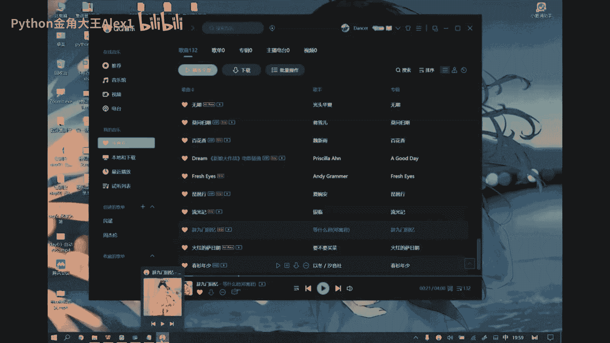

好了时间差不多了啊，来同学们能听到我说话的，帮我扣个一啊，好的啊，那我看看今天还是这些熟悉的名字啊，你们又来了啊，今天来了不会白来的啊，因为今天我们讲的东西啊，是这个可视化之外的啊，我们第一天讲可视化。

然后呢第二天讲这个函数啊，其实都是都是我们这个基于excel的啊函数对吧，它本质上呢，其实帮我们是能解决这种统计效率的对吧，这个其实嗯，他能帮我们解决工作当中的大多数问题啊。

但是其实在我们日常工作当中呢，我们还有一些在excel之外的一些问题，也需要我们处理，那如果我们用用这个传统的方式，可能就是我们靠耗费各种的人力是吧，我们靠人力靠时间去往上堆啊，然后呢。

我们可能也会听说过一些，关于说这个Python自动化办公的一些东西啊，但是呢可能一直大家没用过啊，所以今天呢就来带给大家，带大家那个去搞一下这个东西啊，那咱们应该有一些同学是完全没有Python基础的。

对不对，咱们这个完全没有基础的，就是完全没接触过编程的同学，咱们有吗，我看看，嘿嘿不难啊，没那么难，你听完我这节课的话，你就有思路了啊，咱们这个完全没接触过编程的同学，我看看有多少个给我给我扣个二。

完全没接触过编程啊，连变量是什么都没听过的，来都抠出来啊，都抠出来，我看看有多少个，大家觉得编程这个事儿是不是特别难呢，对不对，我们普通人类哈，你扣一算什么啊，我让你扣二啊，没搞过的扣二啊。

当然搞过也可以扣一，这个可能大家的感受是这个唉普通人，我学编程太难了，因为我一上来，大家会给我讲什么什么操作系统是吧，然后计算机组成原理，然后再讲什么二进制，然后讲八进制，16进制，然后再讲什么变量。

数据类型一大堆下来听着都害怕，对不对，可能会有这种感受啊，然后我看看啊，咱们大概有有嗯，咱们现在直播间，这里面只有这么几个同学是科二的啊，那我还是简单过一下啊，我简单过一下，但是我今天没。

我今天就不可能给你讲的特别的这个基础部分，可讲的特别的细致啊，你那你如果是完全没基础的话呢，你先听思路啊，听思路，你看这个事儿就编程这个事儿距离有多远，然后我们所谓的这种自动化的提取数据。

然后去处理表格，处理这个PPT什么的这种东西它到底有多难啊，你感受一下，其实没有你想的那么难啊，好啊，那我我呢今天先我花大概半个小时的时间，我先把咱们今天会用到的这些基础知识，我先简单过一下好吧。

如果你有基础的同学呢，照顾一下咱们其他没基础的同学的，这个关照一下啊，咱们互相关照一下，你呢有基础呢就当复习了啊，没基础的话，那你就了解一下大概的一个形形态，这样的话你知道我后面要解决什么问题。

OK好啊，那我就直接用这个编译器了啊，用编译器了，然后这个编译器就是我们在那个集训营录播的。

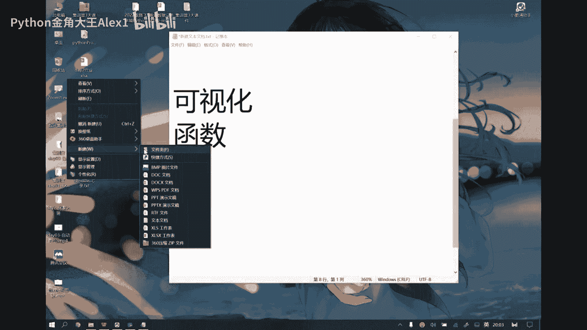

第三天里边啊，第三天里面会给大家介绍一个叫叫mini counter的，那么一个包管理工具，然后它里面自带一个主peter notebook这个玩意儿啊。

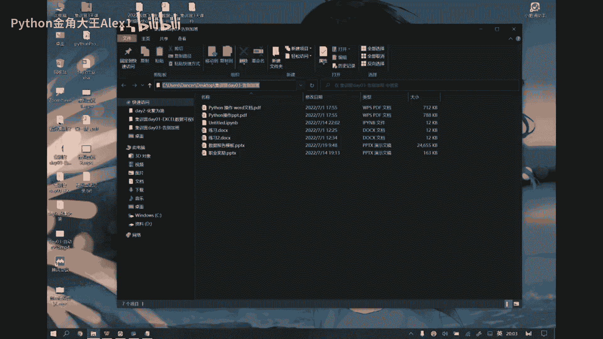

就是我们做数据分析比较常用的一个编译器，什么叫编译器啊，其实就是你写代码的东西啊，就是一个写代码代码的工具哎TIMI，就是你代码必须得在编译器里面写，在编译器里面写的方便一点啊。

当然你也可以用文本编辑器写啊，但是那个你得这个熟练最好啊，熟练了以后再用它写的是比较好的好，我这边就是在一个做一个启动啊，这块其实你看我我在操作一个终端。

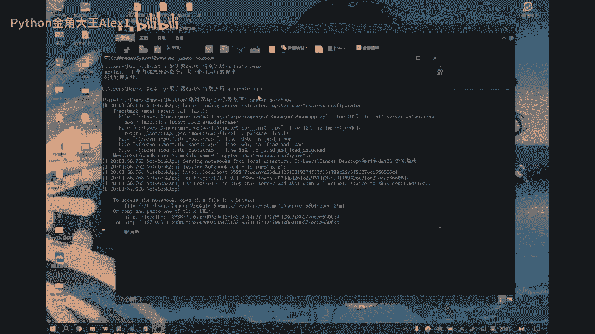

其实你不要被这个吓到了，我就是一个启动，相当于你在桌面上点一个应用程序，道理是一样的啊，就两个指令就是都固定的好，然后呢我们先去聊几个基本概念啊，几个基本概念啊，我我们想其实说白了编程语言是什么。

它为什么叫语言呢，为什么要语言呢，就是因为它是一种对话的，用来对话的一种东西啊，这么一种体系啊，那他专门是跟什么跟计算机对话的，所以说我们要了解计算机是如何去理解，这种词义的。

所以你要知道用什么样的语法规则，然后去跟他交交流啊，就这么点事儿好，我第一个要解释的问题就是变量哎，变量啊，什么叫变量呢，就是计算机为什么要搞一个变量这样一个概念，因为计算机。

它其实所有的数据都是存在这个内存条里边的，啊啊它怎么存放数据呢，这边就是为什么要去讲二进制的问题啊，就是因为它是用用这种电流的状态，来来表达数据的，比如说有电流我可以表达为一，那没有电流呢。

我可以表达为零啊，所以说我我一个一个这个一个内存条的，这么一块啊，一块一块位置呢，那他如果有电流通过的话，我就可以表达出一个一了没有，那就零了，那好我可以做组合对吧，那我222个板子放到一块儿的话。

我就可以表达几个数啊，10011100，我不可以表达四个数啊对吧，如果放三个呢，放四个能放五个呢，如果我无限多下去的话，那我就可以表达无限多个数，对不对啊，所以这就是为什么他要有有这个呃。

能表达那么多数据的一个本质啊，那变量是干嘛的，变量其实用来用存放数据的啊，我们从宏观的视角去理解的话，就是说计算机它的所有数据，都是以电流的形态存在的，所以呢如果我们想去想去使用这个数据的话呢。

那我必须要怎么样呢，我必须要告诉你在整个这个内存条上，哪个哪个空间啊，哪一段哪一段它表达的数据是什么，所以这个东西它必须要通过变量的这种方式来，给你括起来啊，给你括起来。

告诉你这个里边存的这个电流的状态，它表达的是某一个数字，那么这里边就出现了一个变量的概念啊，变量的概念，然后再宏观一点讲，就是变量，我们可以理解为是一个盒子里边放放一个数三。

或者是一个盒子里面放了一个九，或者一个盒子里面放了一个八好，那么我们要用变量来存放各种各样的数据，就是说计算机的数据你不能让它独立存在的啊，它独立不了，它必须有一个盒子给它装起来，OK啊。

所以就有了变量的概念，那我们怎么表达概念啊，比如说这表达变量啊，比如说你现在想想去存放一个工资啊，那公司我们可以起个名字叫salary salary，然后它等于100好，这是我今天的工资。

OK这样呢我就相当于做了个什么呢，我相当于把这个100这个数据啊，存到这个变量叫salary这个盒子里面去了，那它里面存的是一个数值为100的东西，这个等号就不能读作等号了。

我们在计算机里边啊读作赋值符号啊，就是我把一个数呢保存到一个变量当中去，OK好这是变量的概念啊，变量呢它有很多类型啊，就是不同的大小，就是这盒子大小不同，那么我们存放的数据呢它也不一样啊。

就是结构不一样，比如有的可以存整数，存12345，有的呢可以存小数，比如3。14，然后4。668等等等等啊，有的呢可以存文本，可以无限场下去，里面存了一句话啊，比如说啊今天很热，哎，这是一句话。

那我们在计算机怎么表达一句话呢，加个双引号就表达一句话了，这个呢是一个新的类型，我们叫字符串，就是我们excel里边那个文本类型啊，就它OK啊，然后那还有一个一个类型呢。

就是我们今天会用到的叫什么叫列表，列表就是一组数据啊，我想表达一组数据的话呢，那比如说我现在有十个数要表示，有十个数要表示啊，那十个数我说得起十个变量名啊，就比如这个叫A这个叫B这个叫C，这叫D好了。

那我就需要人为的去管理十个不同的变量，这样这样如果我的数据量很大的，比如说我们我们动辄处理及几千几万，几10万条数据的话，你能写得起这个变量吗，写不起对吧，这种情况怎么办，我们直接叫一个列表。

我们叫比如我们叫d data list，诶，我就用这个名字来表来表示一段连续的数据，他们是放到一段连续的内存条上的，诶，它们的大小我们是给他确定好的，然后这里面可以存个一存个二，存个三，存个四等等等等。

那这样的话，那我就可以用这个名字来表达这一组数据好，我可以根据什么呢，为什么是连续的呢，因为这一组数据，我可以通过位置的方式来找到它，比如说这是第一个数，第二个数，第三个数。

第四个数我可以找到里边的内容，但是有一点你要注意计算机它查树有个毛病，它不是从一开始查，他从零开始查啊，从零开始查，也就是说我现在如果有一个叫D啊，list的这么一个变量，它是一个列表。

它这个列表里面存的是这么多个数，比如说这个是存的是三，这个七，这个是11，这个是八好，那我们想访问第一个数的话呢，它的位置我们描述为零，它描述为一，它描述为二，它描述为三，我想访问第一个是这个变量。

那我就用date list，然后后边接上一个中括号，里边写上它的索引位置显示零，那我表达就是，我要找的是这个列表当中的第一个数据啊，这个数据的值是多少呢，是三啊，这是列表的概念，它其实就像一个容器一样。

我可以用它来装更多的数，OK然后还有一个类型的叫啊，我们叫什么呢，叫这个叫这个这个类啊，叫类，这就复杂了一点啊，为什么要搞这个东西，因为比如说我现在想描述一个用户的信息，我想描述一个用户的信息。

那用户里边可能包括什么呢，比如说有用户的名字，唉，有年龄有age啊，然后有这个收货地址address，哎有地址好了，我的用户呢是这样的一个复杂的一个结构，那么这个时候呢我想去描述所有的用户的话呢。

方便我管理的话，我就可以用一个复合的形态呢，去表达这个一个用户，那么这个时候我就可以抽象出一个类的，这样一个概念，那类的话呢，其实它属于我们我们程序员自己，定义的一种类型啊，不像整数啊这种小数啊。

字符串这种，它都是语言层面给我们已经预制好的啊，就你可以直接拿来用，但是类类型的，我们我们一般是可以自己去定制的，根据你的需求可以去创造各种各样的类型啊，这种类型除了可以有有这种啊，这种这个值之外呢。

这个我们叫属性，它还有什么呢，它还可以去执行一些函数啊，比如说他可以去来一个啊这个吃啊，我们叫e it函数，然后里边我们可以写上一个逻辑，下一个逻辑，比如说我们啊就像excel的那种什么some啊。

Some if count，if啊等等这些函数一样，它呢是可以去给它去单独设计一些函数，来操作这种这种数据的结构的啊，这个是类好啊，OK你大概也知识了解这几个啊，然后呢我们再说一个几个结构啊。

几个结构就是你要想跟计算机交流的话呢，那你必须要你如果只是知道这种变量啊，然后数据类型之类的东西呢还不够啊，你还得有一些能够表达一些分支逻辑的，还有一些重复逻辑的这种语法结构来帮助我们。

比如说我想表达一个分支啊，表达一个分支，比如说我们经常程序员有一个段子啊，说你你这个出去买，比如出去买点东西啊，然后你出去买苹果嗯啊出去买买一斤苹果啊，出去买一斤苹果，如果你碰到了一个卖西瓜的啊。

就买一个啊，就买一个，OK这个逻辑啊，程序员他的理解思路是这样的哈，就是说你你出去买一斤苹果，然后呢那你碰到一个卖西瓜的，OK然后呢你买一个回来啊，这是一个什么呢，这是一个判断条件。

就是说如果啊就我们用昨天的if函数的方式，来来表达这个逻辑啊，就是以假如假如碰到卖西瓜的啊，卖西瓜，那怎么样呢，买一个啊买一个，那如果没有呢，如果这个条件不成立呢，我就买一斤，看明白了吗。

所以说那用这个逻辑来看的话，那就是说我如果碰到卖西瓜的会怎么样，我会买一个苹果，如果没碰到卖西瓜的，那我就买一斤苹果对吧，所以这就出了一个笑话啊，这是程序员经常开开的玩笑，就搞了一个段子。

但本质上它其实就是一种分支结构，因为计算机你想它是一个石头对吧，它只是一个石头，它怎么能够去理解人类的语言呢，所以它一定是那种傻瓜式的，指哪儿打哪儿的那种方式，你一定要把这个事儿给他解释的特别的清晰啊。

可控它才能够去理解你的含义，所以这个分支语句啊，就是你要把所有可能的情况告诉他，你要怎么去应对，就这么一个玩意儿啊，他帮你去解决这个问题，那我在计算机里面怎么去表达这种结构呢。

假设我们现在有一个有一个scar啊，分数它等于四百四百分吧啊400分好，我，我现在想想去表达一个逻辑，就是计算机它给我可以给我一个结果啊，我让计算机告诉我一个结果，假设你现在面前有100个数字啊。

100个学员的分数，我现在想快速的知道这100个学员谁能上本科，谁不能上本科，所以呢你要告诉他，如果你这个高这个分数如果是大于400的啊，大大于390吧啊四百四百四百五吧是吧，如果你大于450呢。

那么我就告诉你啊，我告诉你什么呢，这个本科，那否则呢我就输出一个叫，这个专科，OK啊你先听这个结构啊，什么意思呢，就是说我我们我们计算机执行它的过程当中呢，我们先碰到一个变量啊，叫SCR啊。

它是里边赋值的是400，现在呢我碰到的if语句，那么我就会判断它后边的这个条件，这个条件表达式，这个表达式如果成立了，如果成立的怎么样呢，我就走他后边的这个后续语句，后续语句啊，然后他如果没成立。

这个如果是个是个假，如果它不成立，那我就走什么我就走，else后面的这个后续语句，这是一个分支结构，是二分支结构，OK啊，然后至于这里面的print是什么意思，它呢很简单，就是一个函数。

它就是可以帮你把里边的这个双引号括起来的，内容呢把它打印出来啊，把它打印到你的屏幕上去，就这么个意思啊，所以你看这个代码啊，这个代码如果我们运行的话，我们按CTRL加enter运行的话。

我们会输出一个专科，为什么呢，因为这个SCR它scar大于450是不成立的，所以他走else后面的这个语句，执行这个语句啊，那我们改一下，比如我们变成了600，那我输出是什么，是不是本科啊，怎么样。

因为我这个条件成立了，所以我就走后边这个语句，OK啊，然后那你要注意什么呢，就是注意这种语法结构啊，Python的语法结构呢非常的依赖我的这种缩进，一定要注意缩进。

所以如果你完全没有这种Python的编程基础的话啊，你要想写我的代码，一定要注意我的结构，该换行的地方换行，该缩进的地方缩进，我这边的缩进都是用tab键一键完成的啊，什么意思。

比如说他回来我直接按一个tab键过来的，知道吧，不是说用那种空格咔咔咔顶过来的，不是那样的啊，直接tab键过来，或者你在上边直接换行，它也能帮你自动识别，我要不要缩进，OK啊，这是一个二分支结构啊。

那么它也可以简化一点啊，也可以简化一点，比如说啊我们也可以问，可以就看这个人他能不能上本科，我并不考虑其他的情况，那我可以直接来一个if盖，然后大于450，如果大于成立，那就是本科啊，如果没有。

如果这条件不成立，我就什么都不干，我在下面写一个字，写一个什么都没做，OK好，我现在这个scar是600分啊，600分啊，那么他判断这个条件，他发现这个条件成立了，成立了。

我就会执行我的后边的这个缩进语句啊，好那我再改一下，我现在比如说我这个SCR啊，这个我不是600了，我让它是一个300，那现在会怎么样呢，同学们啊，他呢就输出什么都不做，为什么为什么看这个结构。

因为我这个if后边的这个条件表达式，他现在怎么样不成立了，不成立怎么样呢，我后边的这个缩进语句就不会执行了，那么他不执行就是这条语句就完事了，然后再往下走，走到这条语句了。

那么他就要输出什么都不做这个内容啊，所以这是它的一个执行顺序啊，就是说他怎么执行呢，这是第一次，这是一个语句，然后到这整个if这一块，这是一个叫分支语句啊，然后再往下走到三，这是一个什么。

这是一个打印语句函数语句，OK计算机的执行顺序是顺序执行的，从上往下去执行啊，好啊有了这两个，然后啊那我再教大家一个方法啊，教大家什么方法呢，比如说我们文本函数，咱们说昨天讲excel啊。

excel里面是讲了很多文本函数啊，比如说有这个made对吧，还有这个left，还有这个right对吧，这些大家还有印象吧，有印象是不是好，那么我们在这个就是编程语言当中，怎么怎么去记录一条文本呢。

比如我们在我们在学这个语文课文的时候，经常会说说小明说，冒号对吧，然后加上一个什么双引号，双引号啊，然后今天下雨好，大概这个意思啊，那你看我们说一个人说的话，是用双引号引起来的，这里边就是一条文本。

就是条文本，就是我们在excel当中的那种非数值型的东西，都是文本，那我们在这个编程语言当中，文本呢它的记录方式啊也是用双引号，但你要注意它编程这里边儿啊，没有用什么的。

就没有用这种这种这个汉字的这种拳脚拼音的，都是用英文的那种半角拼音，所以我们想表达同样的这个文本怎么表示呢，在计算机里面应该用的是半角拼音的，这个双引号。

当然Python呢它可以支持你用单引号的方式来表示，这两个东西啊，是一样的，它表达都是一个文本啊，单引号和双引号有什么区别，单引号省了一个键啊，你不用按shift，而双引号你得按shift，对不对啊。

所以我们经常写Python的程序员呢，都喜欢用这种单引号的方式来表达一条文本，这个文本我们在计算机当中把它称之为叫，字符串，字符串，你看一组就是一串字符嘛对吧，一个你看一个J。

一个I1个N1个T它就是字符，那么一串字符就是成了一个字符串，空格也是一个字符啊，注意一个空格，两个空格是不一样的，字符串啊，好那我们我要讲个什么呢，我要讲这个字符串啊，它有一个函数。

你看又跟excel是一样的，它有一个函数叫什么呢，叫判断一个字符串是不是以什么结尾的，比如说我们来一个这个啊，万岁，我想判断这个字符串，它是不是以什么什么结尾的，那我想判断它是不是以万岁结尾的。

那我们可以做一个点叫案子with，这就是一个函数，就跟你在excel当中去调用一个函数是一个道理的，但它的调用方式是用点的方式来调用哎，用点的方式来调用啊，好我调用这个函数干嘛。

我要检查前边这个单元格的内容，它有没有后边这个万岁，是不是以这个晚上怎么样呢，案子案子的啊，以它为结尾的，那它如果是以它结尾的，我就会返回一个true，如果不是呢，如果写个one呢。

就会返回一个false，好这个东西很好用啊，就类似于你你用那个比如说你write函数能干嘛，你read函数能不能去检索一个文件的类型啊，对啊，我能不能用right函数来判断你一个前面的文本。

它是不是描述的是一个文件的，一个文件的名字对吧，那这个文件什么类型，就是跟它的后缀名有关。

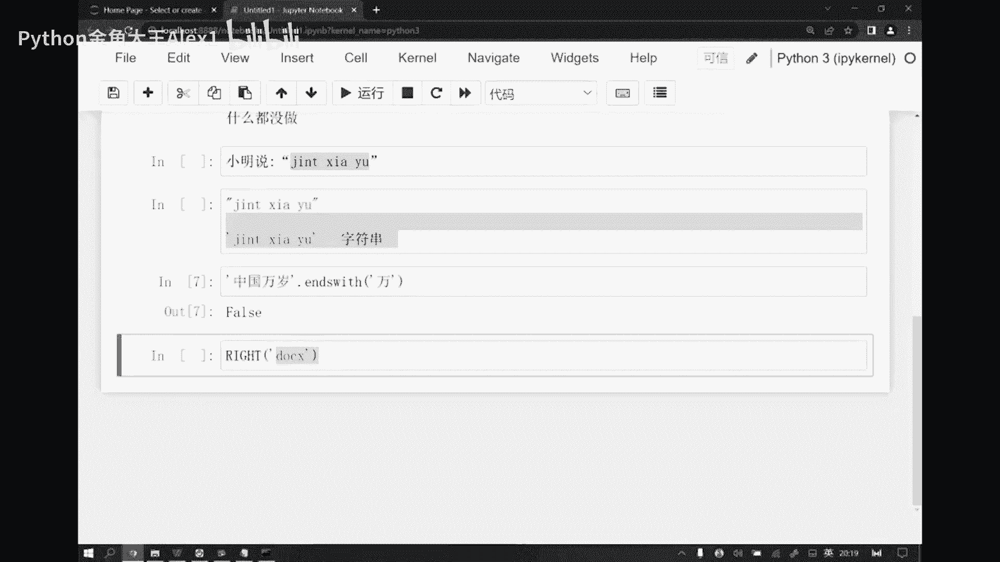

对不对，举个例子啊，比如说你看我们现在看到的就是在这里边，大家看到的这些文档，你像这个物这个PDF文档它都是什么PDF结尾的，PDF结尾的对吧，然后我们现在操作这种这种这个编码的文档。

它是以IPINB结尾的，IPN结别，然后我们操作这种word文档，它怎么样，是doc x结尾的对吧，然后你的PPT文件是什么啊，是PPTX结尾的，所以你知道这个以后呢，你现在已经可以干嘛了。

你已经可以来判断一个文件是什么类型好。

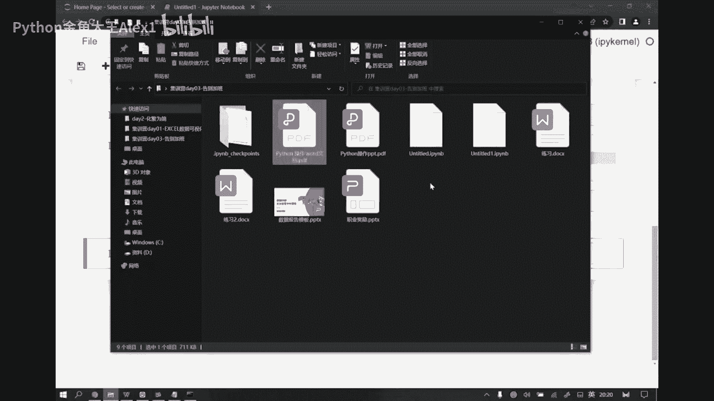

那我就我就想判断，点DOCX，我想知道这个文件它是不是一个word文件，怎么办，我直接来一个as with，然后点D点写不写都行，反正是吧，或者说你就直接来个DOC还加个点吧，这样它才能是一个文件啊。

这样稳一稳妥一点，看它就是true，那如果你是一个点PPTX呢，它就是一个false对吧，你就可以通过这种方式来判断一个一个文件名，它通过这个文件名来判断它，是不是一个什么样的类型啊。

好那如果你现在想去处理啊，你现在想干嘛呢。

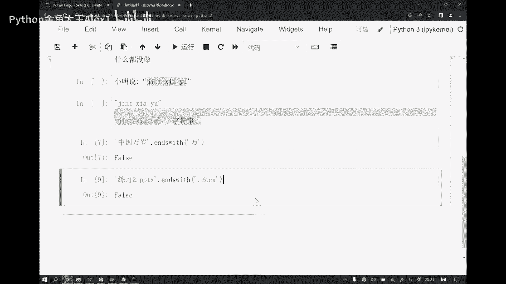

你想去处理整个，比如说我现在这个文件夹内的啊，我这个文件夹里是有这么多文件啊，我这些个文件我想找出来，我想把这里边是word文档的这个文，这个文件的名字给它找出来。

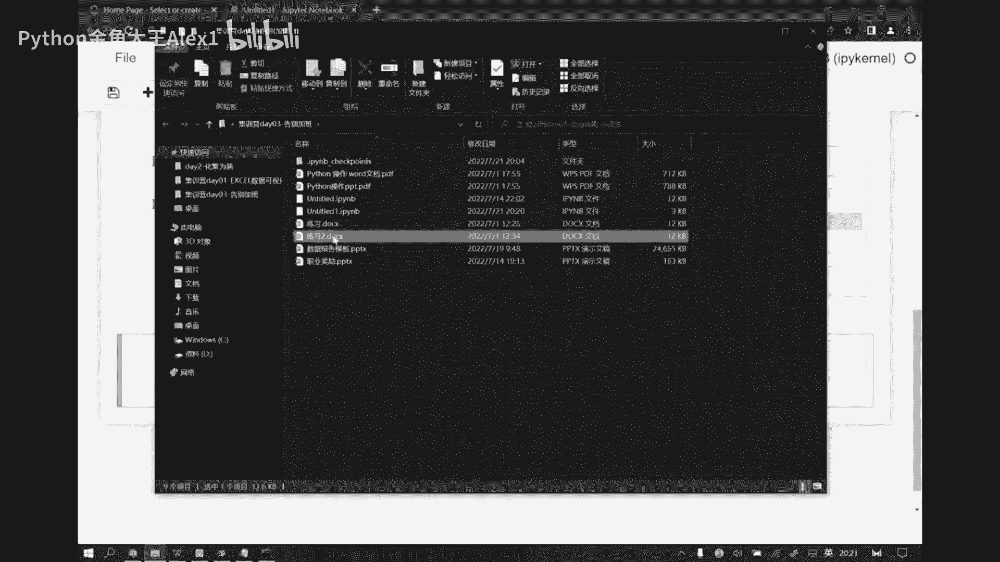

这个事儿怎么干，哎这个事怎么干啊，那我们先先教你一个方法，你看啊这个东西你应该在日常工作当中会用啊，什么方法呢，咱们在Python当中啊，有一个模块啊，有个什么叫模块啊，你可以认为是一个工具包。

工具包就像是excel给你提供的那种函数包，是一样的，这里边有很多的功能，其实都是以函数的形式，还有一些其他的形式，你可能那些形式你可能听不懂啊，先不说那些了，你就认为是一一堆函数的一个工具包。

那么一个模块呢，它主要是解决你一类问题，一类问题，那我们想去操作本地文件的这类问题，还有一个单独的模块来帮我们干这个事儿，是谁呢，就叫OS模块，你要想去用这个工具包，相当于比如说你你出去干活了啊。

你出去干活了，现在你要把你的工具带上，怎么带啊，通过一个指令给他带出来，Import os，这什么意思，相当于你把这个工具包拎起来拎出来了，带在身边了啊，那我要用import来告诉你的啊。

你的告诉你的Python的这个编译编译环境啊，你告诉他我要用这个OS包了，把它导进来了，倒过来以后，我们就可以在下边后边就去使用它了啊好了，我导出这个OS1块啊，干嘛呢。

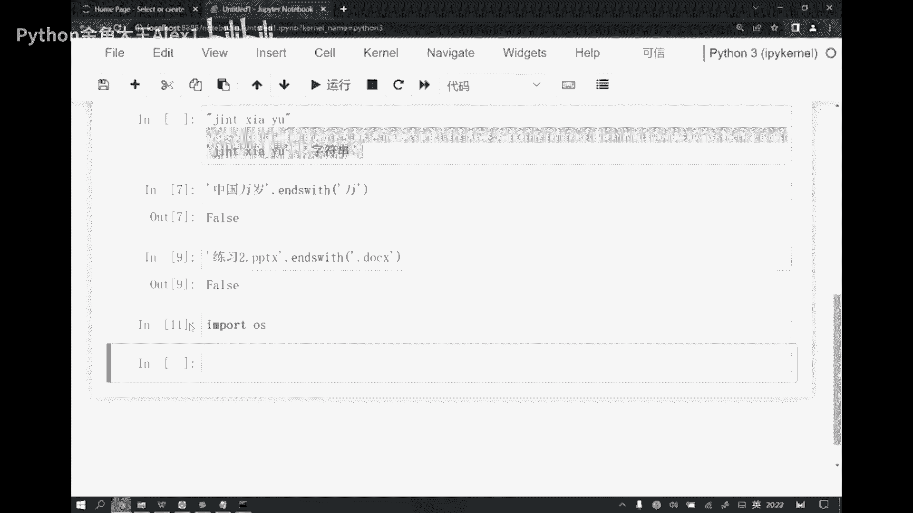

那我现在如果想去快速的把这个文件夹内的，所有的文件给你批量的加载出来啊。

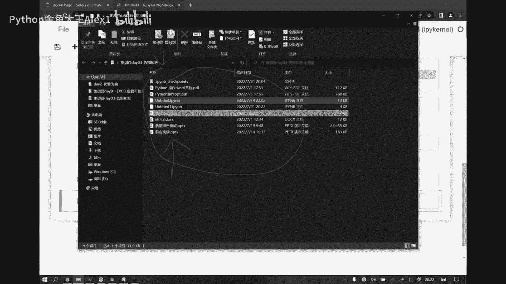

我想快速的读到，你怎么读看啊，这个事儿特别简单，你根本不需要有什么编程基础，你就照葫芦画瓢都能干出来，list dr点杠，看着啊，我就把这些文件说都给你拿出来了，对不对。

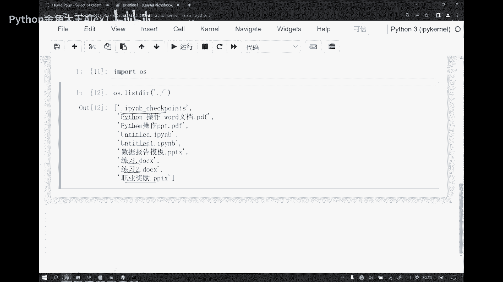

都给你拿出来了啊，就跟我刚才那个看到的是一样，有Python操作word文档的PDF文件。

这个对吧，有Python操作PPT的这个PDF文件，这个后边都一样的啊，不多不少不多不少，还有什么，还有一个文件夹，这个是不是这玩意一个文件夹好，那么这里边可能大家看不懂的是什么，是这个玩意儿。

这玩意儿啊，我我先解释一下语法结构，我我去调用这个类似的DR呢，它就是个函数，这个函数在哪呢，在前面OS这个工具包里了，我想调用它，相当于说我我在工具包里边找到里边的。

叫list d i r的这个函数啊，所以那这个叫OSOS往里边找这条路路，就是路径的一个查找过程，所以我要用OS点，DIR的对吧，就是一个层次结构的问题啊，只不过我用点的方式来进行进行查询。

这是我的语法规则，那么后边这个这个字符串是什么意思，写了一个点杠，什么意思，有点杠啊，它在它表达的是一个路径这个词啊，大家可能如果没有编程基础的同学，会有那么一点陌生啊，其实路径是什么，就是一个位置唉。

就是什么位置呢，你你在计算机当中的你的一个位置。

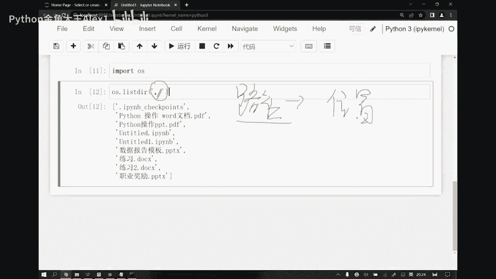

你怎么去描述计算机当中的位置啊，同学们看看啊，计算机的位置怎么描述，他一定是有有一个基点的，比如说我们现在想去找到某个同学谁谁家，那我肯定会怎么样，我可以找，比如说北京市，然后怎么样再找这个昌平区。

然后再找什么什么路，白沙路，对不对，然后找到什么123号，然后再找到这个这个路飞学城，然后再找到201这个房间，然后里边的某某个位置找到了那个人，对不对，这是一层一层一层一层定位，你一定是有一个基点。

这个基点一定是大家都都知道的，那么你对于计算机来讲，他也得知道，他得知道几个基点，我知道什么什么位置，开始，我去按照这个路径一层一层一层地追溯下去，我就能定位到某个具体的位置。

那我们再来看计算机的存储逻辑是什么，比如说我们随便打开一个文件，比如就这个day2作业啊，我们右键属性就能看到什么，能看到它的这个位置啊对吧，能看到它的位置好，我们再换个位置啊，我们再找一个。

比如我们去找一下D盘，D盘里边我们随便找一个，比如说这个路飞这个文件夹，比如这个企业合作，然后我们来一个属性好，能看到什么，是不能看到我，我这个对对没看到啊，看到了这位置啊，在这儿呢说一个D盘。

一个冒号斜杠，一个路飞啊对吧，什么意思，就是说计算我们windows系统啊，windows系统它是有盘符的，什么叫盘符，就是你这个盘，你这个电脑这个盘啊，C盘D盘这个C还有这个D盘，这个D这就是盘符。

这就是我我任何语言我都能够找到的这种基点，我基于这个基点就可以逐层往下，一层一层一层找下去的，那么他们怎么去表达这个层次结构呢，用这个反斜杠啊，用这个斜杠来表达我的层次，所以我如果想想去找到。

比如说啊我现在这个这个目标位置啊，比如我们现在操作的这个day3，集训营的这个这个文件夹啊，哎哪去了，一二啊，这呢它的位置是什么，就是这个这个先清理掉啊，就是你可以在什么呢。

在这个上边这个地址栏里边你能看到它的路径，看到吧，从C盘开始，斜杠users用户嘛，然后在斜杠这是我们的那个电脑的，就是老老师这个电脑的那个用户名叫dancer，但是下面什么是桌面啊，Desk top。

然后桌面上有什么有个数分集训营啊，有个数分矩形，然后这个矩形里边我们诶再找到这个三的话，那你再进来，你看从这个数分进行之后又怎么样呢，所以又干出来一个第三呢，又是一个路径啊对吧，所以说我从G点。

从这个C盘一直一层一层一层一层，我能找到这个文件夹，如果我再想进去进一步找到它里边的某个文件，哎，某个文件，那我怎么办呢，我在后边再接一个斜杠，然后把这个文件的全名写到后边去，放到后边去。

那么这个位置就是我这个文件的一个，准确位置了啊，所以所以呢，那我们想去在你的电脑里面去定位到一个文件，你必须要告诉这个语言，它的具体存放的完整路径是什么样子的，这个呢就是你的一个路径的概念能理解吗。

同学们其实就是描述一个文件的位置啊，但是你要注意是什么呢，注意的是我这个文件的存放位置啊。

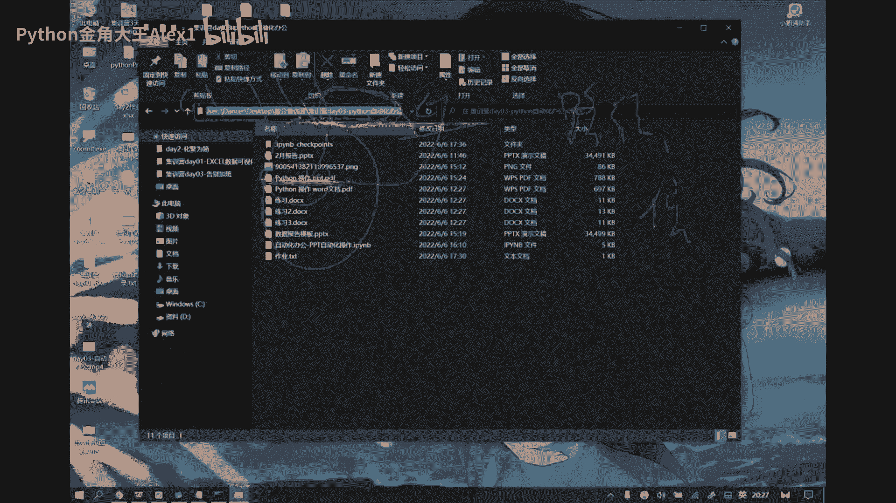

相当于什么，相当于是你这个你这个目录啊，就是你这个目录啊，它是一个文件夹，是一个盒子对吧，然后在文件夹它本身是有一个具体的位置的啊，这个是为这个是它的一个我们叫叫位置位置，然后文件夹里面会有文件名。

文件名，一个文件名，这个位置，然后后边再拼上你这个名字的那个doc x，这是你这个文件的具体位置，而不算名字，往前看，这是你文件的存储位置，这能理解吗啊，你要想访问文件。

你必须要给这个全路径就是带名字的，我才知道是这个位置下的谁啊，你要不给名字，我只知道你描述的是这个位置，但这个位置下面有很多文件，我就不知道到底你要的是哪个文件了，我只知道你描述的是在这个这个位置而已。

OK啊这就是全路径的概念啊，那我这边写个点杠什么意思呢，它就是相对路径了啊，相对路径了，比如说我现在里边有两个文件，一个是AA点DOCX，一个是B点DOOCX，好了，这两个文件它俩的相对位置是谁呢。

他俩的相对位置是什么，是是同目录下，同目录下我就点杠啊，就点杠就是我的同目录，那如果我想往上走，就是两个点能找到上一层啊，想要找往下层一层找，比如说我这个doc里边，它是放到另外一个盒子里面的。

这个这个比如我们叫doc文件啊，有这么一个路径，那么它我这个B跟这个A的相对位置是什么呢，那就是点杠，然后再加上一个doc文件啊，这是它的一个相对路径，OK啊，所以它是一个相对路径和绝对路径的一个概念。

你要想访问文件呢或者访问目录呢，就是文件夹呢你都要描述清楚这个路径啊，我现在描述的什么呢，因为我我现在这个U叫UNTITLEE这个文件啊。

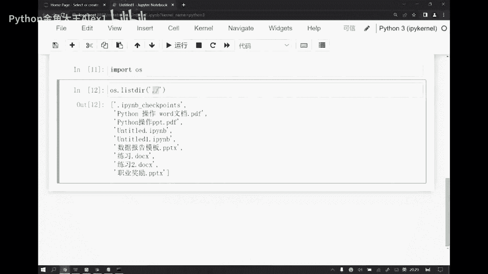

它在哪啊，它在存放在我这个day3这个集训营里边，哎怎么就找不到了呢，啊在这呢我操作是谁啊，是这个啊，untitled啊，这啊untitled1这个文件，所以我这个文件我想访问我所在的文件夹。

它里面的所有文件的，那我肯定是用点杠，这是一个相对路径的一个表达方式，也可以啊也可以啊，但是习惯是写这种点杠的方式。

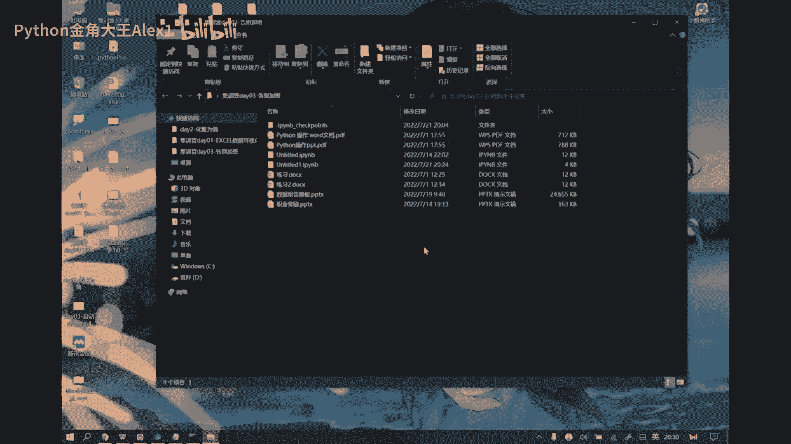

OK啊，所以我现在什么意思，就是在访问我当前就是你看list什么意思，列表对吧，DR什么目录，就是我要去列出这个目录下的所有文件，就这么个意思啊，就是列出这个某一个目录下的所有文件，然后下边这个点杠。

这个点杠哎呀哎点杠啊，表示当前文件所在的目录，OK啊好当然这外边得扩一个双引号啊，得加个双引号，这才是因为路径得，我得用字符串的方式来进行表示啊，好了我现在拿到这个什么东西啊，它是一个列表啊。

就是我们刚才提到的那个列表，我们怎么去表达一个列表啊，这个可能大家看起来有点懵啊，我写个简单的，比如说你想想表达想存放五个数啊，那我们就要一个d list，我们用一个中括号。

12345这样的方式呢就表达出一个列表了，哎这个列表你你会发现它的完整结构啊，就是什么，就是一个中括号，括起来里面放了一一组数，这个数与数之间呢是用逗号分割的，哎逗号分割的，这是一，这是二，这是三。

这是四，这是五，那么我这个列表里面放了五个数，那么这个是第零个数，这是第一个数，这是第二个数，这是第三个数，这是第四个数，这是什么，外边这个是我的索引index，这个是我的数据是data啊，DK好了。

那你看我这个结构啊，虽然它看起来它是竖着放的，但是它的结构其实你拆解的话，跟它是不是完全一样的，只不过我第一个元素是个什么，是一个字符串，第二个元素也是一个字符串，第三个，第四个，第五个，第六个。

第七个都是一个字符串，它们都是用什么，就用逗号分隔开的呀，对不对，那我问大家这个列表它里面有几个元素啊，查就行了，一个两个三个四个五个六个，七个八个出九个九个元素啊，OK啊好啊。

也就是说它是以一个列表的形式呢，把你所所要去罗列的那个目录的文件呢都给你，通过一个列表的方式给你返回了，好，那你将保存这个数据怎么办呢，我说了，计算机的数据是不能裸着放啊，我得怎么样。

我得找个盒子给它放起来好了，现在给了你一个列表，你得拿个盒子把它保存起来，这个盒子我们叫什么呢，比如我们就叫files，看叫一个fails好了，这个数据哪去了，没了是没了吗，不是啊。

只是他把这个数据它返回的那个列表啊，给存到这个files这个变量当中去了，所以现在如果你想看那个数据在files里边啊，怎么看呢，直接我们做一个print fails就把它打印出来了，看到了啊。

但是呢你你用的我们如果是用这个主，peter notebook这个编译器的话呢，有个小福利，什么福利呢，你不用你想，你想看一个变量，你不用去print打印它，你直接把这个变量往这一丢一运行也能看到。

看到了吧，也能看到，这是为什么，刚才我不接收，我不接受这个变量，会直接看到下边这个数据，而我接收了以后就看不到了，因为我这个东西啊是存到变量里的啊，那个拜占庭问的是那个py charm，有没有这个功能。

没有啊，py charm必须你要你用print才能把它说出来，因为这个属于叫叫IPAYTHON，哎，Python给你提供了一个机制，咱们用PY差吗，其实你你用的是那个Python的那个那个环境对吧。

然后咱们这个主peter他用的是IPAYTHON环境，这个玩意儿是专门来帮你做科学运算的，就做做数据统计啊，做什么表格处理啊，这种啊这种东西啊，所以他这个编译器主要是干这个。

他相当于也是基于Python的一个内核啊，给你给你单，搞出来的一个这样一个特殊的一个东西啊，所以你看它它这个东西前面有个叫out的，这个玩意儿，叫什么叫输入输出历史啊。

这个细节我也是在录播里边给大家强调过啊，大家感兴趣可以再看一看，OK好了，你现在拿到一个变量，这个变量是什么，是一个列表好了，是一个列表啊，然后呢，我我现在想去想。

去使用这个列表里面的每一个东西怎么办呢，这时候我们就要用到一个新的方式，刚才我们讲了一个一个什么呢，叫if语句，这叫分支结构，分支结构，然后呢我们跟计算机对话的时候呢，还有一种结构是最常用的是什么呢。

就是循环结构，为什么要循环结构呢，因为你分支是告诉计算机到什么遇到什么情况，你要怎么去做，遇到什么情况，你怎么做，像教傻子一样教他，告诉他，你碰到了个苹果，你就买一个，你碰到个香蕉，你买一串。

你碰到了个西瓜，你买半个，你要一个一个都告诉他，你要不告诉他，他突然间碰到一个桃子的，碰到个卖桃子的，他就蒙圈了，他不知道怎么搞了，所以你要告诉他，如果你碰到了其他的所有的水果，都不要问诶。

这样的你的程序才能正常执行下去，不然的话他就会怎么样，他就会紊乱，它就会蒙对，你的程序就会报错，OK啊这个我们其实在这个编程里面，我们叫什么，我们叫这个鲁棒鲁棒性哈，就是程序的鲁棒性。

就是其实我们或者叫叫容错保护，容错机制啊，就说我们说一你的程序，那个你的程序写的够不够strong哈，其实都是指的，这个就是我你对于这种突发情况或者意外情况，你有没有做过这种错误的一个处理。

就是你要你要给他设定好一个，应对的一个处理规则啊，所以这种的都是通过分支结构来完成的，那么还有一种方式是什么呢，就是有些问题我们要重复的做，比如说我我我银行，我登录手机银行的那个客户端。

我输入密码错一次，他告诉我再输入错一次，再输入错一次，再输入错一次，再输入对吧，我要重复的干这件事，那你怎么能让计算机执行这种指令呢，就是靠循环结构，循环结构，你要一直干下去，比如说你要你要让他说。

你要让他去打印一个这个路飞，路飞city啊，你让他打印这个，他只能帮你打印一次，那你你告诉他，你给我重复说十次，重复说十次怎么办呢，那你也可以这么干，你可以这么干啊，我们干出十行代码，然后运行对吧。

它能帮你说十次，但是如果100次1000次呢就不行了，所以我们要有机制啊，什么机制呢，这种机制for啊放，然后这个i in一个range5，然后我们输出，路飞city诶，你看一次两次三次四次五次。

对不对，哎输出五次啊，然后其实这种循环啊，这种循环大家如果有，如果你学过C啊，或者学过java机的同学啊，你可能看还有点不习惯，但如果你你是没有任何编程基础的同学，你看他啊，我再给你解释一下。

你就会觉得很很容易理解，为什么呢，啊就是它这个for循环呢，首先我这里边关注的是一个次数，OK那好大家可能看这个五，大家知道了啊，这个玩意儿应该是跟我的次数有关系，这是容易理解的啊。

那我range呢可能就是一个函数啊，至于这个函数是干嘛的，我不清楚，但是我知道这玩意儿肯定跟我有关，所以如果我现在说你给我变成十次的话，那我们即便没学过编程，你也知道把这个数据改十，我就输出十次了。

对不对，你输出100次变成100，我就输出100次对吧，但是呢你要想想能用好这个玩意儿啊，那么接下来这几句话你要听清楚了，它是个什么概念呢，就是Python Python的for循环机制啊。

它特别的人性化，怎么叫人性化，大家想回想一个课文啊，我不知道咱们在座的同学啊，有没有这个这个年纪稍微大一点的啊，就是比如说我是八零，我是八零后啊，咱们八零后的同学应该学过这个课文，叫什么，孔乙己。

有有印象吗，孔乙己这个同学啊，他当时有一个啊，就我也不知道为什么对这个这个事儿，这么这么深刻啊，反正当时我们老师给我们讲这课文的时候，我就记忆特别深刻，我到现在我还记得孔乙己有什么动作呢。

他啪啪啪啪排出了七枚大钱是吧，七个七个什么，就是那个那个反正就是就是钱嘛对吧，就是七七哥七哥那个大大钱吧，是不是还是那玩意不纠结这个了，因为我们当时我们老师在课堂上，给我们做了个动作。

所以我印象特别深刻，他这个叫什么呢，这叫枚举，对不对，他你想那个动作一个两个，三个四个一个往这排啊，那好那首先怎么样，首先你孔乙己兜里得得放这么七个铜板，对不对，放几个铜板，一个两个三个四个五个六个好。

你看这玩意儿跟啥很像，这玩意不就是个列表吗，里边我放一个三，我放一个五，放一个七，放一个二，放一只，不过它是什么，它是铜板，我们是数对吧，这是一样一样的结构啊，好了我现在要怎么样。

我现在要把它一一个两个三个四个五个，六个七个，我给他一个一个个掏出来，往这放，往这放，我这有只手，对不对，这个手是谁，这个手就是这个I这个I就是手，我这个手要怎么样，我拿出来一个再拿出来一个再拿出来。

一个再拿出来一个再拿出来一个再拿出来，一个一个个给他拿出来，拿到了I这里边拿到I以后干嘛呢，我要给你放到桌面上，怎么放这个I我丢到下边，这个动作就是我要放桌面那个动作。

那我们这块可以认为是一个打印的动作，一个打印的动作就是一个print的动作，对不对，好这个逻辑，同学们啊，这个逻辑你要能理解的话，这个Python的for循环啊，你就理解了，我现在把这个事给你变一下。

我变成这样子，然后这个地方我不输出，路飞city了，我输出谁，我输出我手里当前拿的这个钱啊，这个A是我的手，对不对，我手从我这个兜里面掏，掏个一块的，两块的，三块的，四块的，五块的都掏出来。

一个一个的掏，对，掏一掏出来一个放手里收，然后干嘛呢，扔到桌面上再掏，第二个放手里，扔到桌面上再套第三个，第四个，第五个一直掏到没有了，OK现在你看我这个动作通过一个循环的方式输，完成了，输完成了。

我写再复杂一点，第一第一个啊，第二个诶，好了后面不写了啊，现场运行看看，把第一个，只不过这个时候把整数变成一个字符串了，把第一个拿到手里，放到桌面上，回来再拿第二个放到手里，放到桌面上，再回来拿。

第三个放到手里，放到桌面上，同学们能听懂这个意思吗，能听懂吗，所以你会发现for循环，Python的这个Python的for循环是什么，就是一个枚举的过程，就是个媒体的过程，你拿到这个东西。

你你你除了可以放桌面上，你能不能先绕一圈再放到桌面上，能不能，所以说好你这个语句你可以再复杂一点，再复杂一点啊，我，看看这个是多少面额，显摆一下，对不对，我拿到一个钱以后好了，我显摆一下。

显摆一下再怎么样再把这个放到桌面上去好了，现在变成这样子了，这个改回来啊，这个变成一，这个变成二，看我这个循环怎么样，我我这两个动作每一次都会做一次，我拿到一个钱的时候，我拿到一块钱出来，然后干嘛。

先选一圈，然后放到桌面上回来再拿第二个钱，再选一圈，在哪再放到桌面上，第三次第四次，第五次，对不对，所以你在这里边，你在这个循环的过程当中，你想做什么都行，到这块儿我再来一个啊啊这个我写写一下啊。

这个are，是多少块的好，我想我想在这个地方说我拿到几呢，我就想把这个值呢说出来，我想说出来啊，那怎么办呢，其实这块我就可以用一个占位的方式，I，好这叫什么这个玩意儿啊，其实就是你那个格式控制字符串。

就是这个I什么意思，就是我要用一个花括号的方式把这个变量，就这个I这个变量啊，给它放到里面去，那么我前面加上一个F，这个F什么意思，就是for，format是格式控制啊啊那它在输出的时候呢。

就是R4I块钱，这个I它不会输出I，它会输出这个变量里面的值，这个I如果是一就输出一，如果是二就写二，是三就写三好了，我们来看啊，这个动作变成了三个动作，选一圈，然后丢到桌面上，然后告诉你啊是几块钱。

说一句话对吧，好执行，看看这是一次循环对吧，这三句话完成了，然后到这儿到这儿到这儿是不是五四啊，是不是五次啊，把我兜里的五块钱都掏出来了啊，做了三件事，OK好了，那么这个事我说可以无限的延展下去。

六七或者你写个100行不行，你这边有几个数，我就怎么样呢，我就去迭代多少次，一直韬光为止，哎韬韬光为止好了，那么现在同学们这个东西听明白了吗，这个for循环的含义听明白了吧，来给我扣个一，听明白了。

给我扣个一，好啊好OK那好，现在啊现在我们再做一个变化，现在我们再回到刚才刚才我们是怎么写的，这个地方我写的可不是列表啊，我写的是啥呀，我写的是这么玩意儿，这啥意思啊，这个玩意儿没多复杂的。

它就相当于什么，它等价于01234，等价于这个东西，好不信，我们来看看啊，我把这个给他替换成一个range5，看我第一次拿到是不是零啊，然后是一，然后是二，然后是三，然后是四啊，他告诉你是什么意思啊。

它告诉你的是一个0~5的区间，默认的步长为一好，那我现在想生成1~6的区间怎么写呢，我写1~61到六的区间啊，然后我步长为二呢，写个二就是步长为二，那它表达是什么，把它放过来啊，把它放到这儿来。

135就是从一从1~6这个区间隔两个数，取一个，隔两个数取一个，隔两个数取一个，所以我取的是123456，怎么取取到第一个隔隔两个数取到三，隔两个数取到五，隔两个数没了，是不是只取到135了。

所以这个range函数它干嘛的，就跟我们昨天讲的那个那个那个那个run run，还有那个run北between那个excel函数是一样的，帮你生成一组数据啊，帮你生成一组数据，只不过它是有规律的。

帮你生成一个等差数列而已，就这么作用，所以当你只写了一个五的时候，相当于什么，相当于这是五，这是零，这是一啊，所以如果你不写这个一和零呢，那我就默认给你这么处理了，明白吧，所以我可以直接写个五就完事了。

OK所以说实际上本质上呢我们就是在干嘛呢，我们就是在对一个列表啊，同学们，我们就是在对一个列表进行干嘛迭代操作好，这个你要听明白了，那么接下来我们来看啊，跟我们有关联了。

我们刚才这个OS点list d i r，我们把点杠我把这个东西一罗列出来，我是不是得到了一个什么列表啊，同学们列表对不对，好，我们刚才讲的for循环可以干嘛，说可以对你这个列表进行迭代呀，对不对。

可以对你的列表进行迭代好了，那我先写的写的这个简单点，易于理解一点啊，这个是我们的fails，我把这个列表啊存放files了好了，现在干嘛，现在我要对我这个files进行迭代。

fail in files好，我现在把这个I啊，我起个名字起个fail这个feel呢，可我我这个可读性更高对吧，因为I我不知道啥意思，但我起个fail，我知道啊，这是文件对吧，这是文件的意思好。

就也就是说我其实从后边这个列表里边变遍，历出来的是什么，是文件好了，这个文件我要干嘛，我要把这个名字啊打印出来好了，看看我们是拿到了这么多个文件呀对吧，拿到这么多个文件啊，这个时候是不再是列表了。

我们是把里边的每一个文件都找出来了好了，每一个文件是什么东西，他就是一个字符串啊，同学们，这玩意就是个字符串啊对吧，你看我们刚才那个列表啊，这个files就是刚才我们保存的这个列表。

不都是用单引号引起来的一个文件呀，啊一个文一个文文本啊，就是个字符串，对不对，好了，这个字符串我们可以干嘛，我们是可以判断他是不是以什么DO，CX结尾啊，比如说我现在想干嘛，我现在想知道。

在我当前便利的这个当前文件夹内有，我想把里面所有的PPT文件找出来，我只想找到它里面的PPT文件怎么办，你当你拿到每一个文件的时候，你干嘛，我做一个判断，我判断这个feel它是不是按with点PPT。

X的，如果是怎么样输出，它明白吗，我这个feel是个变量对吧，这个变量是什么，这个变量里面会随着循环的迭代，我会存放每一个这个字符串，是不是好了，也就是说我现在对一个字符串操作。

一个是不是以点PPTX结尾的这么一个逻辑，它如果是我就执行后边的输出语句，如果它不是怎么样，不是我这个语句就完成了，我就啥都不做，这个就完成了，完成以后怎么样回到循环，是不是继续去迭代第二个文件名啊。

然后然后再进来再判断你是不是以PPT结尾的，如果是我就输出，如果不是啥都不干，继续再迭代第三个，第四个，第五个，第六个，一直到什么，迭代到最后一个文件为止，对吧好了，这个过程它就可以帮我找到。

我整个目标文件夹内的所有的PPT文件，看看，说就把这两个PPT文件找出来了，同样道理，我现在想找它里边的所有的word文档怎么办，把这个后缀名改成doc x，我就把两个doc文件找出来了，对不对。

OK啊，那么现在同学们啊，我现在想去换一个啊，我现在的想想去啊。

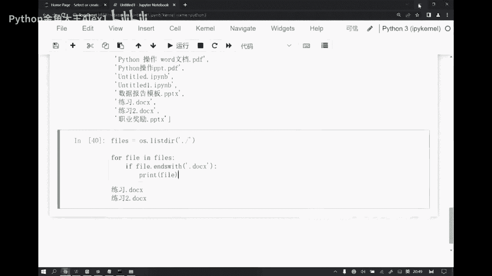

这个吧，第二天啊，哎第二天我再再不第二天了，我随便创建一个新的目录啊，这样一个目录，这个目录啊，这是测试测试目录好，我在这个目录里面，我多放几个文件，比如我放一个，这是一个doc啊。

这是一个测试1PRT，然后呢，我再去创建一个这个word文档，然后再创建一个PDF文件，好啊，就这样一个结构啊，我现在干嘛呢，我现在就想去找到我，我这个测试目录，测试目录下边的所有的word文档啊。

word文档我再来一个，这是一个doc文档啊，我再来一个doc x文档好了，那你看现在我我这个目录下有说有两个word文档，一个是doc的，一个是DOCX，就两个不同的版本吧，对不对，好了。

同学们这个事儿我怎么办啊，我怎么办，根据我们刚才所讲的啊，怎么办，所以你第一个问题就是，你要你说得先把这个目录给我写出来啊，对不对，这个目录我们得写出来啊，好把这个目录复制复制出来啊。

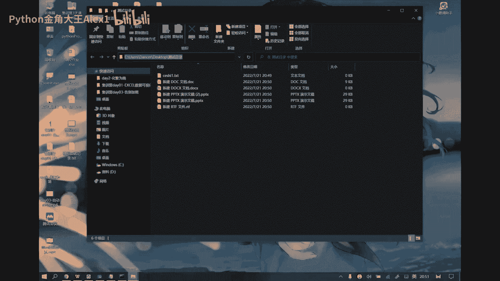

在这里边复制出来，OK然后我们在这个代码这边，我们去做什么，我先去OSOS点去list dr，我把你这个目录啊给你找出来，好在这边我们要注意一个问题啊，注意一个问题，就是windows的这个它的路径。

就是我我windows那个文件的目录表达方式呢，它是这种斜杠，然后我我们在代码当中操作的目录呢，是这种这种斜杠，所以呢你你为了保证我能够正常识别的话，你在前面加个R，就你不用去做这种转换了。

就一个个再转了，不用这么转了啊，所以如果你是复制的这种这种路径的话，你前面加个R就行了，OK好这是一个小小的细节啊，这种就是要注意一下好，我用它呢把我的这个目标，这个目录下的所有文件找出来了。

然后我现在干嘛，我现在说要对它进行迭代啊对吧，我放，然后一个fell in，诶好，我现在要对这个返回的列表的数据，一次一次拿到，我要干嘛，我要找到里边word文档，那我word文档显然有两种不同的后缀。

怎么办，那我就判断是吧，我判断我这个fell，它是不是按with d这个点DOCX啊，然后再加一个or或者feel点案子，with点D点DOC，如果是我就输出这个fail，看到了吧。

是不是你看这个or陌生吗，不陌生啊，我们昨天讲excel函数也讲到all了，对不对，这么搞的，只不过它这是一个条件，这是一个条件，我们现在怎么写的，我们现在只是把这个东西改了一下结构，这是一个条件。

它返回true或F，这是一个条件，返回true false对吧，就是一个条件一，然后一个条件二中间用一个or来连接，跟它本质上是一样的，只是你在不同的场景，在excel当中这么写。

在Python当中这么写而已对吧，所以说我说你你用excel去学编程，能不能学是一样的，因为你用excel，如果能善于去用excel的函数去解决问题的话，你如果你擅长拆解的话。

那么你其实用Python一样可以搞，你不熟的只是这种这种这个语法结构，但其实这种语法结构并不需要，花你太多时间去理解它啊，跟你用excel的这个学习成本其实高是高了一些。

但是没有大家想象的像登山一样那么难啊，它所以说现在就是现在的这种这个IT的IT，为什么说他现在入行门槛变低了，一方面是啊，一方面是什么呢，一方面是这种我们的技术的发展，它越来越倾向于什么呢。

业务而不是技术，比如以前你玩玩这种编程语言，都是要学什么计算机组成原理，你一定是往底层干的，现在什么，现在语言层面上能给你往上封装，就往上封装，能简化就简化，把你把你想去表达的东西。

像写作文一样那么简单啊，所以说现在的这个开发成本也变低了，就是我我会，程序员会把更多的思维放到业务逻辑的处理上，而不是在语法细节的处理上，因为它在语言优化的层面上，已经做到了很很优化了。

至少已经进步很大了啊，所以说Python呢就属于这种这种语言啊，就是所以它为什么现在小学生推这种Python语言，就是这个道理，因为它好学啊，OK啊好，然后那你知道这个以后。

其实你已经已经在自动化办公这个门槛上呢，你已经打开了一扇小门了，哎小门了，至少现在你知道了，我可以去哎定位到我想要的文件了，好啊，那么接下来我们就再深入一下啊，再深入一下干什么呢。

我拿到一个word文档的时候，我现在想读它里边的内容，这个事儿我怎么搞，那我拿到了一个PPT文档的时候，我也想读它里面的内容，我怎么搞，那或者说我再夸张一点，我想把它里面的内容做一些修改，怎么搞是吧。

哎这些问题啊，我们接下来就给大家解决啊，好你要想解决这个问题啊，基本上上边这点基础足够你用了啊，足够你用了，那么只不过你在，你在自己去解决自己的需求的时候呢，可能会磕磕碰碰，碰到一点语法上的小障碍啊。

但是这个东西很容易克服，你只需要踏踏实实的，比如说你找一个什么Python语法的这种课，随便找一个啊，随便找一个，那么各种平台啊，这种课有的是找一个，你把那个语法呀好好的去跟一遍。

然后你想解决这种需求都足够用了，不用那么啊那个有板有眼的说一个一个知识点，一个过，不用那样啊，就是简单粗暴一点，就以你的现实需求为出发点去搞这件事情，缺什么找什么，这里面核心的逻辑就是什么。

你要你要擅长去做这种规规则化的这种拆解啊，你一旦能把一个事儿能能描述的非常清楚了，以计算机的逻辑去把它描述的很清楚了，OK这个问题你就解决了，接下来你只是你的卡点都是在语法的一些。

比如我哪个函数是可以干这件事的，然后哪个语法的规则是可以解决我这个逻辑的，OK啊，所以说那你其实这个时候，你你只是在欠缺语法工一些工具而已啊，你像老程序员，它为什么可以面向对象编程。

因为它的逻辑是通的啊，他知道计算机怎么处理，他已经习惯了计算机那种表达事情的，就表达业务的逻辑，所以说他在哪个环节上缺什么，我百度一下就能定位到啊，但我们没接触过这些人，因为我没见过。

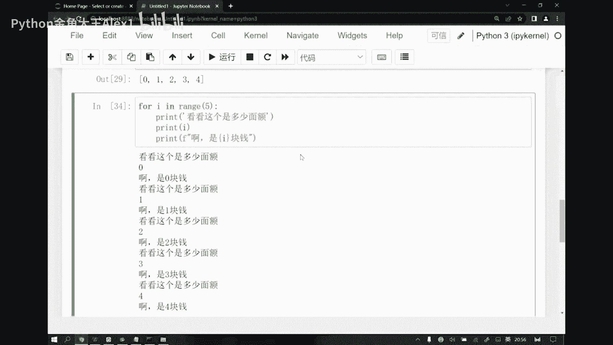

所以我也不敢往那想啊，就是这个道理好啊，现在我们来看word文档怎么操作，还是那个那句话，计算机处理一切事情就是找规律，如果我不能梳理出一条规律的话啊，你能给我说的很清楚的话，这个事我解决不了。

同样的word，大家现在想一想，word在我们眼中是一个什么东西，乱七八糟，有文本，有格式，有有字体大小，有颜色对吧，有加粗，有斜体，乱七八糟那么多，然后还有表格，哎这个东西有什么规律呢是吧。

有什么规律呢，OK啊，你看看我们Python是怎么解决这类问题的啊，咱们来看一下这个。

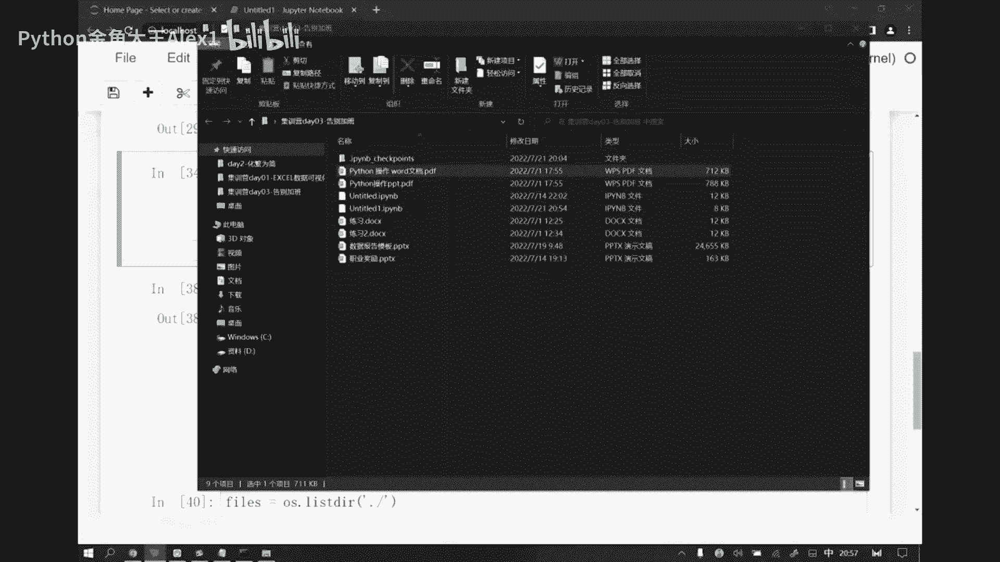

对啊，嗯嗯好，稍等啊，稍等稍等，首先啊我们把一个PPT的一个完整结构啊，我们给它抽象成这么这么点事儿，哎就这么点事，就这张图，首先你一个word文档啊，一个word文档呢，我就把你规划为一个什么呢。

一个这样的一个类啊，这样的一个类我就可以给你描述成这样一个类，好这个类里边啊，这个类里边有什么呢，比如说你一个文档，我知道里边啊，你有段落啊，然后你还有表格啊，你还有图片等等信息好了。

我就把你规划为什么，你都你的这个不论你的写的是什么，你什么格式都逃不开这两个，一个就是段落，一个就是表格，你一定能拆解出这两类啊，当我拿到一个段落的时候，那么它里面主要就是文字啊，图片的问题。

我们今天先不聊啊，图片也是一样的啊，规则是一样的好，一个是文字，一个就是表格，如果你拿到一个是一个一个段落文字的话，OK那么在文这个段落里边，我又可以再帮你进行一个拆解，我可以把你拆解成什么呢。

你你的段落里面一定是有文字的，那如果我们段落它是有一些这个格式设置的话，怎么办呢，我又把你抽象出一个新的一个结构，叫rs叫rs，这个rs干嘛呢，他是帮来帮我们区分我们这个文本的结构的。

比如说你的字体是什么样子的，你的颜色是什么样子，你的字号是什么样子的啊，好这边是一个啊，那好我们往下看啊，看举个例子举个例子，比如说我们对于这样的一个word文档好，它在我们计算机眼中是什么样子的呢。

整首先整个它是一个doo document，一个这样一个数据啊，这样一个类型的数据啊，其实我们严格讲叫对象啊，那你不用想那么深，就是它这它是这么一个类型，这个类型呢是我们自定义出来的啊。

我们针对word文档，我们抽象出了这样一个有规律的，一种可描述的类型啊，这个是我们自定义的，好好了，对于这个文文档里面有什么呢，它有有这么多个段落，一行就是一个就是就是一个完整的一个啊。

就是一个这个段落嘛，啊我们就把它称为一个叫paragraph，好那好，第一个第一行这是一个段落，然后第二行那个空行是一个段落，这空行是一个段落，然后第三行是一个段落，然后这边又是一个段落，好了。

这些段落里边啊，你看首先我这里边的文字是一个加粗的，然后字号偏大一点的，颜色是偏蓝一点的，然后这里边呢这是一个正文，然后后边就是一个加粗的字体，然后后边又是一个正文好，然后下面这些字体都是一样的好了。

那么我们就会怎么样呢，我为了方便去管理我的数据的格式，我就把你这个连续的一段啊，连续的一段格式完全一致的，这些数据呢称之为叫一个run，所以呢我们会看到这是标题，这个它是连续完全结构一样的。

它是一一个run，然后在这个段落里边，这里是正文加上这个逗号这一段文字，它的结构完全一样的，所以它是一个run，然后我和前面样式不同，这个加粗字体又是一个完全一样的字体，它又是一个独立的run。

然后后边儿我是普通样式，它又是一个独立的软，看到了吗，只要你是一段连续的，那结构完全一样的，它就是一个run，这个run可以干嘛，每一个run它们的结构不一样啊，不一样啊，就连续之间是不一样的。

但是比如说这两个跨度之间，他俩可能是一样的，但这个不重要啊，重要的是我们方便去管理它，然后再往下看这个啊，他没有他没有去做什么，做这个换行，这是一个run，然后再往下换个行以后，这就是一个run对吧。

所以这叫连续的啊，只要你是连续的，你的结构完全一样的，OK你就是一个run，所以我可以通过这种run来管理我的结构啊，管理我的这个比如说我的外观设置，所以你是可以通过代码的方式来对它进行，手动修改的。

OK好了，你知道这个这个文档段落以后呢，那好你再看表格，表格是什么呢，你在一个文档里面看到一张表格以后，他直接会帮你读成一个tables，这样的一个一个属性出来，那么表格它怎么管理呢，它可以看行。

也可以看列，比如说你现在这有这么一张表格，三行两列啊，我我可以一行一行的来查看你的数据，也可以一列一列的查看你的数据，所以呢你想看行的话，我可以通过表格的rose属性来找到我的所有行。

我也可以通过我的表格的columns，来找到我的所有列啊，那假设我们现在以从行的方向来访问数据，我用table点rose能拿到每一个行，比如你有三行，那我就会返回一个列表，列表里面有三个元素。

每一个元素是一个行的所有信息好了，那我们现在把这个视角再放到这一行上，这一行上这一行里面又会有什么呀，又会有两个不同的单元格啊，对不对，所以说对这一个行数据来讲，它我依然可以去便利它里边的sales。

sales唉，一一行里面可以有多个sales，每一个sales里边又有什么呢，每一个赛尔里边又有一个段落，所以你拿段落以后呢，又回到这儿来了，段落里边有可能什么呀，有没有内容，又有可能有元素。

如果你只关注内容访问它就行了，访问我的text，如果你想关注字体什么的，那你访问到run，然后run再进一步访问我的color或者是size之类的，这样一些啊，这个结构信息，OK好了。

这个结构大家能听明白吗，这就是我在计算机眼中我的一个word文档的结构，就是你所有的东西我都可以给你对号入座，到里面去，有了这个规律啊，那我们就有章可循了，计算机就能干活了，同学们跟上了吗，同学们跟上。

我扣个二啊，没跟上啊，我们现在讲的是思思想对吧，你要先从思想上认识他，然后再跳进到语法细节上，因为你你下边的思想没没有理解的话，那么你在写看代码的话就会越看越懵，所以说你看比如说咱们同学。

如果你想用Python去解决你的问题，你去网上随便找一段代码，你能看懂吗，你看不懂，为什么看不懂，不是说你语法有问题，那个语法的问题都很好，都好解决，不好解决是什么，是你不知道他他他是怎么考虑问题的。

他的逻辑你捋不顺，所以你像这个有编程基础的人，我一看代码，我知道他表达什么意思，因为我对这个语言很熟了，我知道他这么写，他有他有什么他的那就是内在的思想是什么，但是我们如果没有这种基础的人。

首先语法就是一大关已经卡住你了，所以你不太好理解他的意思，然后呢你又你又没有这种逻辑，所以呢你就完全看不懂了对吧，一旦出个小问题，你都你都定位不了，你也你也无法解决，是不是，除非你找到那种可丁可卯的。

就正好能能匹配你那个需求的，那这种情况你能用，否则其他情况你应该用不了，OK啊好了，所以说你学学东西一定是先怎么样，一定是先学这个思想，先学我的我的方式，我的我的方法论，我的思想啊，OK有了这个之后。

你再用我们的语言工具再帮我解决问题，好啊，我来演示一下怎么去用这个玩意儿，你要用它的话呢，那你就得干嘛呢，你就得装这个库，就又是一个你可以理解为是一个模块儿啊，啊这个模块模块一般是我们语言内置的。

就是Python的开发者，他直接给你开发好的一个一个功能啊，那么像这种这个三方库的话呢，它是三方，什么叫三方，就是一些非官方的人啊，非就不是Python开发团队，就是这一拨人，他们给你开发出来的模块。

这就是三方库，所以你要想用三方库呢，那怎么办，三方库是开发出来的，什么意思，就给你写了一堆代码，这个代码相当于给你设置了很多函数啊，很多功能，然后你想用的话呢，你得导入到你的本地，然后你才能调用它啊。

就像你要你要想用一个工具包，想想修你自己的车，那你得怎么样，你得买一套回来哦，但你不用花钱是吧，你直接什么你你pipe in store，这就是买了啊，免费的啊，零元支付的是吧，直接安装就行了。

给他装到你本地来，这时候你就可以用这个模块，里面的所有函数了啊，所以你要先把它装上啊，装上它装怎么装这个玩意儿啊，怎么装这玩意儿，其实我在录播里面也讲了，我给大家演示一下。

就是如果你现在已经装好这个环境了，那么你就直接进到你你现在使用的这个Python环境。

那我我们呢都是用这个activate这个base啊，这个环境就是你你一做这个activate base呢，相当于什么。

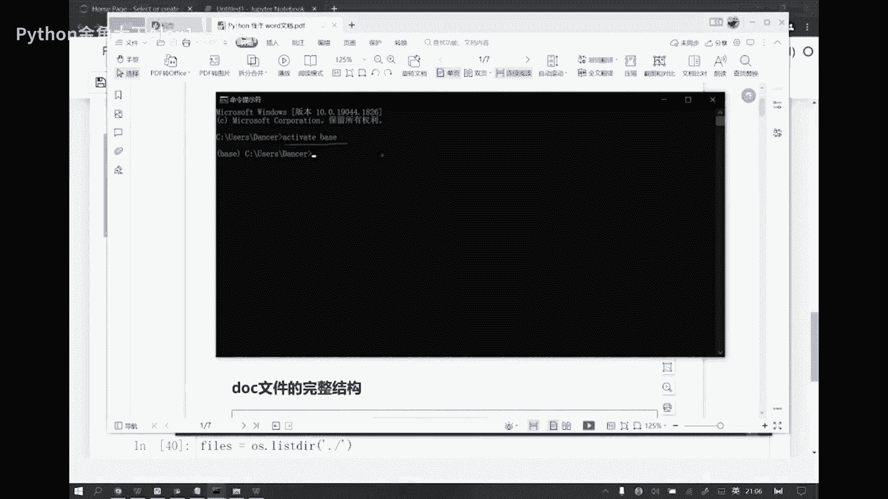

相当于是你激活了你激活的，激活了一个你已经预装的一个base环境，这个环境我们叫base base环境是个什么环境，它就是一个Python环境，只不过它的名字叫贝斯啊，这个环境里面给你预装了很多的。

跟Python开发有关的各种资源包，各种各种模块，各种库对吧，都给你配置好了，所以为什么要在环境当中去去这个写代码呢，就是因为你一一方面你能调用它，一方面你的代码能在这个环境下才能运行，你如果没有环境。

你的代码什么就干不了，不能运行啊，就这个意思，所以呢我我们这个其实在激活一个环境，你要想把你的你的包呢装到某个环境里面，你一定要在这个环境下看到吗，前面有个括号对吧，在这个环境下去PIP。

然后in store装进去，就是就是Python是最愿意搞这种虚拟环境的，比如说我这是一个环境，这个叫base，然后呢我又来一个环境的这种，比如我们叫ENVE，然后又来一个环境啊，这个是ENV2。

然后它们里面可能都有Python啊，这有个Python，然后这有个Python，这里面也有个Python，但是工具包可能不一样，比如这个Python里面我们装了主peter。

然后这边可能我们装了requests，然后这边可能我们装了pandas，那么你你如果是在base环境下去写代码的话，你就只能用主peter，你不能用后边这俩，因为你这个环境里没有明白吗啊。

你在1V1V二里边想去写代码的话，你就只能用pandas，因为requests跟这个主peter里没装，所以你要想在这个base里面想也想使用pandas，怎么办呢。

你要在这个里边去pip install pandas，把它也在这里装一下，明白吧，所以同样道理，我现在想在base里边，我想在这个base里边想去使用我，我那个操作doc的那个库，doc x那个库。

那我要在这里边去pip install，明白吧，所以我们说为什么你要切环境啊，为什么切环境，所以在这啊，Pipe in store，然后Python gun杠DOCX这样一装就完了啊，回车他就开始装了。

明白吧，Error and on and pipe，一音啊，写错了写错了，P i p in store，然后Python gd c x这样装就行了对吧。

因为我这什么requirement already status feed，就是我已经装了，我已经有这玩意，所以他给我提示这个代码，如果你没有，他会给你一个进度条，叭叭叭叭一顿一顿弹弹弹弹弹。

最后装完了啊，又给你弹出这个盘符了，就算完事了，OK啊，这个其实细节。

我在那个环境安装里面都给大家讲了，但是你可以自己去试，所以你要你要用，你就得把这个装上啊，装上它以后你就可以用了啊，怎么用，在这边我们就直接导入它，Import doc x，好这个酷啊。

这个包我们我们装的时候叫Python d o c x，但是我们导入的时候这名字啊就叫DOCX，这俩名字可以是不一样的啊。

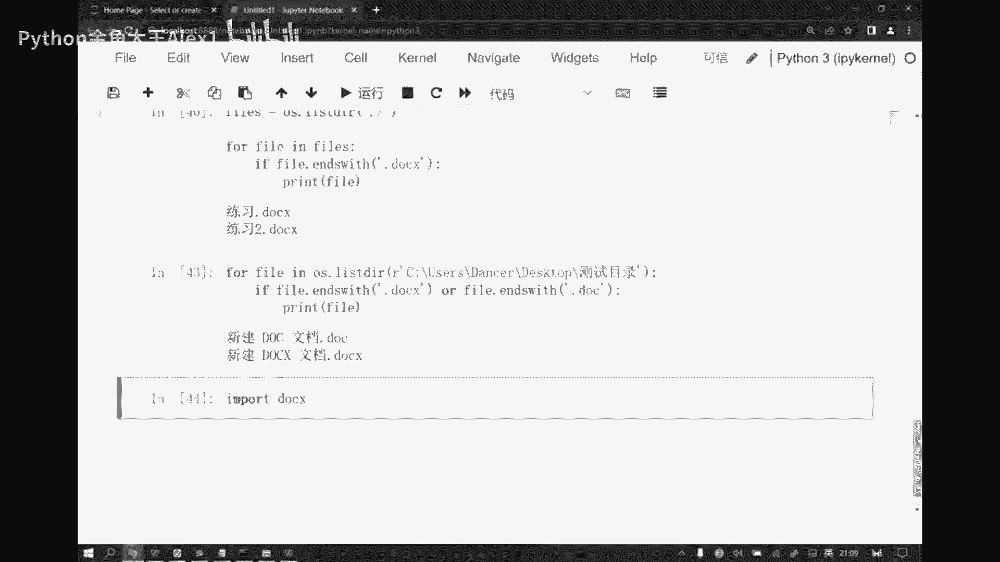

好我导入它以后干嘛呢，我现在想去操作一个word文档，比如说我现在这有个练习这个word文档，嗯我打开方式换一下啊，Word。

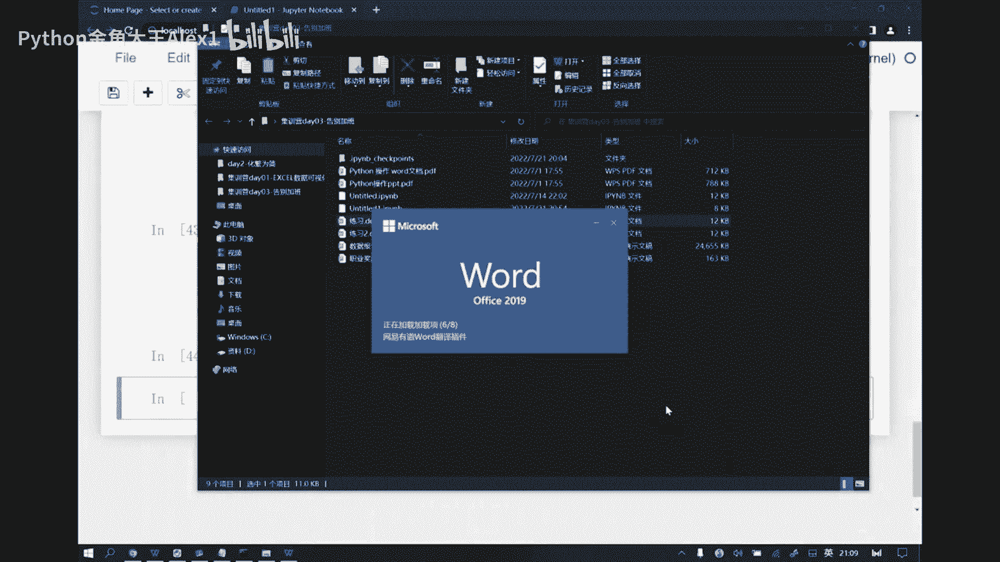

OK好了，这个word我们看一眼啊，其实这个word里面就是三个段落，这是一个，然后这是一个，然后下边这就是一个三个段落对吧，我现在想去把这个文档哪读出来，我想操作它的话，怎么就是第一步。

我先把整个这个word文档，先给它加载到我的计算机当中去，内存条当中去，这样的话我才能去对它进一步的操作啊，这个过程我们其实叫初始化的过程啊，就像我们开机啊，它会有个初始化对吧，有这样一个过程啊。

包括你更新电脑的时候。

不会有一些什么loading之类的，其实都是干这个事啊，因为我我现在啊，你的你这个文档它是存在你的，你的计算机的硬盘的，就是本地磁盘的，然后我们的Python呢是运行到你的什么呢，你的那个内存条当中的。

这是两个不同的空间，我现在要把这个硬盘里边的这这一堆，就是这一堆数据啊，本身也是电流嘛对吧，一些我电流的排布，我把它呢给它得加载到内存当中去，我的Python才能对它进行操作，当我对你操作完以后。

我再重新给你写到硬盘里，这样的话你这个文件呢就处理完了，所以你第一件事干嘛呢，你要把它加载到里面去，怎么加载，用我这个document这个东西我去做一个什么。

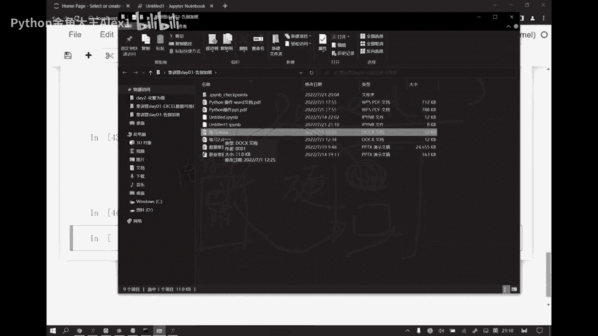

做一个loading就行了，怎么loading呢，这样啊，我我们在这个docs里面有个东西叫这是什么，就这个啊，因为你不是要把文档加载成document吗，所以我们这边直接做一个这个啊。

我们从你这个doc这个包里面去，把里边这个document这个工具给你找出来好了，我用document干嘛呢，我去提取我的文档到我的内存条当中，我把我的练习点DOCX拿过来啊，当然你像刚才同学说。

我不写点杠行不行也行，我这个地方我就不写点杠了，不写点杠就说明我要找的是我当前目录下，那个叫练习点doc x的文件啊，好看到了吧，我我一运行出现了一个什么，出现了一个输出，这个输出的结构很奇怪。

看起来也很乱啊，好好像是挺复杂，其实不复杂，当你看到这样一个尖括号，然后叭叭叭一堆，后边又来一个零，然后叉叉叉的一个东西，这是什么，这就是一个对象了，这是一个对象嘛，就是我们说那个类。

我们自定义的那个那个那个类型啊，它就是它的这个是呃嗯怎么讲，实例化这个词大家可能听不懂，就是就是符合这个类的描述的一个数据，哎那么这个数据就叫一个对象啊，比如说我们说一个人，我们定一个人类。

他有有胳膊眼睛头啊，这是人类，那么只要你有胳膊眼镜头，我们都认为是人类，人类啊，就这个道理啊，OK所以现在呢你看到是这么一个数据，这个数据啊就不得了了，他啊可不是你看到这么点东西啊。

它实际上呢给给的只是你一个地址，就是你这个数据在内存条当中能存放的地址，它的地址是0X2C什么EE7FF，然后518C0这个地址啥意思呢，就是告诉你它在内存条当中哪个位置，因为内存条它它不是用那个。

就是十进制整数来表示的，它是用一个16进制整数，本质本质上就是一个数字，这个空间可老大了啊，同学们可老大了，你所有的那个word文档里面的内容，它都在这个空间里面写给你写给你写好了。

用各种电流的状态给你表示好了，明白吧，所以太大了怎么办，太大了，我就不给你全展示了，我就告诉你这个东西在哪吧，所以说为什么对象的表达方式是用这种精简的，这种表达方式，它其实本质上是为了节省我的输出的。

这种开销啊，我想访问他，我只要知道地址，我就能找到他，就像你知道一个宾馆的具体地址，你就可以找到那个宾馆的房间一样啊，OK好了，这个对象干嘛，我要给它保存起来，我定一个变量就叫doc好了。

这个doc里面存着什么，doc这个这个这个变量里啊，练习点doc x文件的所有内容好了，所以说你只要对这个doc进行一步一步的提取，就能找到这个doc文件里面的所有东西好了，怎么去定位。

现在你你已经拿到了这个doc，这个doc是什么，就是这个文档了，你所有信息都在这个对象里了，好了，你现在想找到它的段落，怎么找找它里面的叫paragraphs这个属性，你要想找它的表格。

找它里面的叫tables属性好了，我们先来找段落啊，因为这个里边是没有没有那个表格啊，找段落怎么我们在这个doc里面直接paragraphs，看到了吧，给给了你个什么，是不是给了你一个列表啊。

逗号逗号用逗号分隔的，OK好了，又是什么，又是这种0X叉叉叉的一种表达方式，是不是还是一个对象，它的太大了，我们只给你个地址好了，在这个对象里面有什么段落，里面有什么段落里边有，段落里面有文本啊。

还有什么，还有每一段不同文本的结构，对不对啊，我想要结构就找到它里面的run，再一步步拆，如果我不关注结构，我只关注文字，直接访问它的内容就完了好，我先做简单的，我只关注内容，我不关注结构。

OK那怎么办，拿到了每一个段落，每一个段落数都应该有它的一些这个文文字啊，好这个列表里面刚才我们说了啊，列表里面我想拿到第一个元素数，用零的方式来访问啊，拿到第第二个元素用一，拿到第三个元素用二。

对不对，好，我先拿第一个元素啊，怎么拿这个列表，我加上一个中括号里边写一个零，这是什么，是我的第一个段落，我现在已经到哪了，我现在拿到了这个paragraph的第一个啊，第一个段落好了。

这个段落我拿到以后，我只需要访问段落里边的什么text属性，就能找到它里边的文字了，OK现在我们提取文字，这边是什么，提取第一个段落，然后提取第一个段落的文字，我的第一个段落数在这个变量里面啊，对吧好。

我现在对这个变量power para1，它读取它的text，看看拿到了什么，说第一个段落的文字啊，对吧好啦，同学们，那我现在想拿到它所有段落的文字，怎么搞一个循环不就搞定了吗，现在你这个文档。

你这个doc文档我再加载一次啊，放到这里这块，你这个doc文档啊，我直接可以通过paragraphs找到所有的段落，好了，我对所有的段落做一个便利，For power in paragraphs。

然后我拿到每一个段落的时候干嘛呢，我再去提取你每一个段落里边的text，所以在这里边我们再去输出PARR点text啊，我为了看得清楚一点，我在呢给你来一个分割线，看看我拿到第一个段落的内容，画个分割线。

又拿到了第二个段落的内容，再画个分割线，又拿到了第三个段落的内容，再画个分割线，是不是把我整个文档的内容都提取出来了，同学们对吧，好了啊，这个word文档，word文档想去提取它的内容。

同学们有多复杂对吧，你现在可能没学会啊，尤其是你们你要你要是没有代码，这个编程基础的人，你可能你可能先听个热闹啊，可能你现在还不知道怎么应该怎么搞，因为会有很多细节，很多很多这个坑你要当。

但是你宏观上去看，宏观上看，你想解决这个事情，你其实你的学习成本是很低的，你并不需要像我们曾经想的那样，我要是是要把Python语法全过一遍对吧，实际上你只需要理解这么几个基本概念。

你就能把这个问题怎么样磕磕绊绊的唉，照葫芦画瓢的给他搞出来，对不对啊，所以说这个东西啊它离普通人没有那么远，尤其是你你只是在做一些最基本的这种自动化，办公的问题啊，这个东西根本不像说我们像转行的跨度。

那么那么夸张，没那么夸张啊，你就有针对性的去挤，学习几个语法结构，学习几个模块足够你用了越用越熟，越用越熟，OK啊好，那么再再换一个啊，现在假设我现在想去干嘛呢，这个稍微复杂一点。

就是我现在想去提取它里边的嗯，这个这个这个块儿啊，这个块，因为有时候，比如说我想去修改我的word文档里面内容，然后那我我我如果就一般来讲，我不会说用代码的方式来去设计，我的word文档的这些样式。

因为不直观明白吧，不直观这种场景什么会什么情况会用，比如说你是做前端开发的，你做移动端开发的，这些结构都是给你写好的参数，你就这么干，不会变的，唉，这种情况，我们会用代码的方式来把这个外观进行设置。

但是如果你只是在做批量操作，那我劝你一句话啊，你不要去用代码的方式去去设计，这个什么字体啊，颜色这种东西你应该怎么样呢，你应该设计好一个模板，你用工具去设计一个模板，这个效率更高，然后干嘛呢。

你只去负责修改里面的内容，只负责修改内容啊，这个是最好的一种方式，能理解我的意思吧，模板就是样式的东西，能用工具还是用工具，除非你是那种纯粹的做前端开发的人，我才会涉及到说我用代码的方式去改改。

这种东西，本质逻辑是什么，本质的逻辑是你，你这个东西一定是要被高复用的，就是你你开发你废挺垃圾，你开发了这么一个模板出来，然后一定是几千，几万甚至几万人每天在用的东西，你才有价值。

你要说我现在就写一个报告，今天用，明天不用了，那你说你坑死瘪肚，费了3000进设计一个东西，然后明天又不用了，有什么意义呢，没有意义啊，那唯一的意义可能就是你练习一下而已，能理解吧。

所以说你你只有是这种复用性高的东西，你才值得说你用代码的方式去写一下，如果复用度很低，这种需求就一次啊，如果量级什么的都说没有，不至于说我必须得代码的方式才能解决的，解决的话，我劝你还是用工具去去干。

不要用代码的方式看有用代码上，代码的本质一定是要什么，一定是高复用性，一个简单的操作，我正常操作得俩小时，我觉得每天操作一次也没啥了不起的，但是你可能开发两天把这功能搞定了以后。

每次一键三秒钟搞定了对吧，这样的话你长远看才是节省你的时间成本的啊，而不是说啊说我设计两天搞这个东西，我还不如两小时搞定了，你不知道是你天天要用吗对吧，OK啊，所以说这块啊多说两句。

就是你不我我们啊不期望你啊，就是我们不鼓励你用代码的方式，去改这种这种东西啊，这种这个外观，但是你还是要搞这个东西，为什么，因为如果你你单纯的去操作TT，你会把这些原有模板里面的这些内容啊。

全都覆盖掉啊，所以说你要想去保留，保留你word文档的原有结构的话呢，那你一定要访问到run，然后再去进一步的操作里面的TST，他才会把这些东西都给你保留下来，而只是把你的文字变了，如果你你在这一层。

就把把你的文字直接变了以后呢，那么这些东西全都就会被覆盖掉了，相当于你的你的结构就被你破坏了，明白吧好，所以我要说我要说这块为什么要深讲一点，就是这个道理，OK那我们现在来看啊，怎么去操作run。

还是回来看这个结构，看这个结构啊，run在哪里，我拿到了每一个paragraph的时候，那么这个里边如果我一段文字的结构是一样的，它就是一个run，对不对，好了，我们先来验证一下这个事儿啊。

第一段我们来看我们这个这个文档，它一共有几个run啊，怎么搞呢，还是这这这段文字啊，给它复制下来，现在我们不是拿到了一个段落了吗，拿到了段落了对吧，每一个段落都有可能里面有N个run。

是不是有N个run，所以该怎么办呢，我们就去对你的这个power去操作你的rs啊，这块我们稍微慢一点啊，比如我还是以刚才那个为例，我只操作这个第二个run吧啊第二个paragraph啊。

那也就是说这个我放在这儿啊，然后这个PARO2它等于doc点paragraphs，然后一好这是第二个段落，然后第二个段落里面有几个run呢，我们来做一个power2点rs这几个，这是这是一个有两个。

对不对啊，它有两个，那如果是这个第一个呢也是两个。

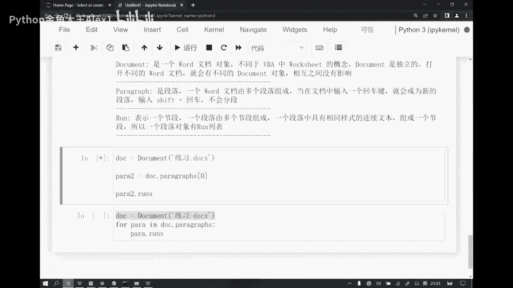

那如果是第三。