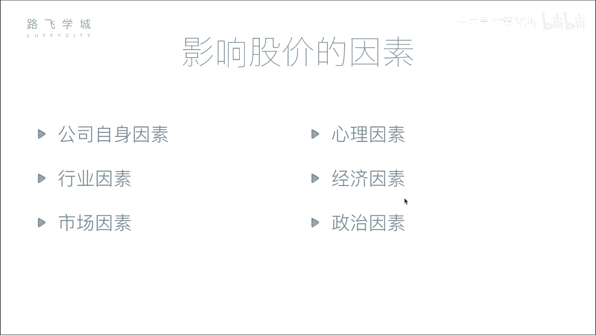
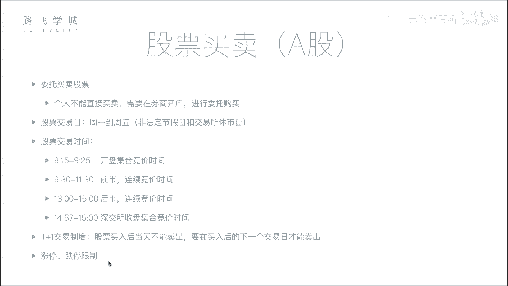

# 【2024年最新版】 Python金融量化投资分析+股票交易+项目实战 - P4：03金融量化分析-影响股价因素&股票买卖知识 - 程序员艾雷克斯 - BV1DES9YPExT

啊，那接下来我们说一下这个影响股价的因素啊，嗯我总结了一共是6个因素。嗯啊首先我们说影响股价最根本的因素应该是公司自身因素啊。O我这个先补充一下啊，就说刚才讲到1个IPO。啊。

对吧就是你的相当于我们公司有钱了。比如说我们路飞啊，又发展几年上市了，到了这个证券市场上，对吧？证券市场上呢，那首次发行，相当于你要给他定一个价格，对，对不对啊，叫公开首次公开募集价格。

那比如说啊我我觉得我这个公司最终客观的评价之后得到了说我这个公司市值是啊50亿人民币嗯，是吧？对50亿人民币，那你要在这个市场上去卖，你不能指望这一个股股民买了，嗯，你要想让更多的股民买，你就把它拆开。

是不是？就把这个整个50亿市值，你分成很多份，让小股民也能买。对，所以呢就是分成了多少呢？分成了1亿股，嗯50亿1亿股，那就一股就是5块钱对对不对？那相当于。小股民就可以买嘛，我买1万股。

那就是5万块钱交给我。对，是不是啊？那好，但是这个是公开募集的价格。当你今天这个小股民花相当于啊5块钱买了一股之后，第二天。它可能会涨也可能会跌，对不对？或者在经营个半年，那我们这个杜飞做的越好。

那他可能公司整个的市值涨到了70亿。那这个人的股票单个的股票就涨了，嗯，是不是啊嗯所以啊就会有相当于嗯这个股票会随着我这个公司的经营状况，对它的价格而反生变化，对不对？嗯啊也有可能一些其他原因。对不对？

就是说那这个呃创始人。跑了对不对？啊，那我肯定会跑。😊，我不是，那所以他会他也会那那就相当于重大口闻。对，股价就会跌。对，还有一些什么其他原因，比如说大家都不想学IT了，嗯，对不对？

大家都想去学这个什么搬砖。对，那我这个。预期的这个经营就会收益就会变低。对它也会跌。对，就各种原因。所以你在这里是总结了那么几个原因，对吧？啊，啊刚才爱丽丝也提到了，我们这儿说的一些原因啊。

首先我说第一个公司自身原因，就是他刚才说的你这个公司运营的是好还是不好，对吧？因为你股票的涨跌，其实相当于是啊买卖的就是买的人数和卖的人数的一种这个相互博弈之后造成了一种结果。咱们用下边市场因素会说啊。

那为什么人要买你股票肯定是判断你这个公司首先营业又好，对吧？对吧？我营业额就我现在公司值一个亿，你假如说你公司现在发展的好，你一年之后能值两个亿，那我买你的股票就能翻一倍翻一倍对吧？啊。

这是公司自身因素，就说是影响股价因素的最根本的因素，啊，第二我先跳过行业因素，我说市场因素，市场因素是影响股价因素的。最直接的因素。怎么理解呢？你的股价长期来看是看公司的资源发展。

短期来看看的是买卖的人数。啊，如果说你这个股票当前买的人多，卖的人少，相当于你股价供不应求，你的股价就会上涨，对不对？你联系一下，比如说咱们不看股票，买苹果任何一个上品都市，买的人多。

卖的人少就是供不应求啊，就涨价就涨价啊。股票也是一样啊。对买的人多，卖的人少就会涨价，同样卖的人多，买的人少，就大家狂抛就会跌价就会跌。对啊，我这个价格卖不出去了，说好多人在卖，那我就降点价格。

看看有没有人卖呗，对吧？就是这种你降我降全都降对，全都讲啊，那就等个就跌了，啊，这是最直接的因素，就是市场。那还有一些其他的因素，比如说刚才Alex说的行业因素啊，大家都不想去IT了，都去搬砖了。

你这个行业发展的不行了。你这个行业的可能相关工资的一些股票都会定。对，那比如说最近这个人工智能特别火。对那我我也是我看到人工智能火我觉得啊发展挺好，咱们投钱，可能好多人工智能相关公司都股票都涨。

最近确实好像都涨嗯啊，还有几个比如说新理因素心里说说什么呢？就你这个股民不冷静了看到好多人都抛抛了吧，就是从重性，对对吧？这是一种就是可能不理可能这个公司没那么坏，没那么可能。

但是可能比如说有一个大股民他一块一口气抛了可能十万股啊，小股民一看ok这个这个人家这个懂的都抛了，这么多钱都抛了，那我也赶快抛了吧，这心理因素历史上发生过好几次啊。

曾经美国在八几年几几年就是说有一个叫黑色星期五啊，就是因为电脑交易出错导致了说一下子就下来，连续抛了好多的指就是就卖了好多个股票。对那导致整个市场以为说会发生什么这么多事情，因为股民也不知道你看。

机乎都抛开了，然后，那就导致直接就崩盘了。对啊，整个市整个的这个纳斯达克的市值就是叫什么？来着蒸发了20%多就。一下子就钱好了，全都没，都没了。对对啊，那还有经济因素啊，这个就涉及到一些国家层面的了。

比如说你这个国家当前的政策啊，政策或者是包括我们说这个叫利率嗯，什么保证金率，就是一些国家的它的利率啊或者是外汇啊等等，这些都可能会影响股价啊，就比如说举个例子啊，利率涨了，股价怎么样，嗯。

存款利率涨了。对。经济学上我们来推一下，存款利率涨了会怎么样，会大量的钱都去存到银行。也，那你市场的钱就少了。对，市场上的钱少了，股票就。就就就就就会跌，对对吧？跌很涨跌嗯。

但是一般啊也不一定有这个经济学上就是好多说法，但是市场中可能你要特殊情况特殊分析。啊那经济因素之外还有政治因素。嗯啊，比如说这个前段时间就17年暑假可能左右吧，6月份左右的时候印度这个不是印度。

我是说那个美国呃美国跟朝鲜不是闹骂，对吧？朝鲜美国这个特朗普不先宣言嘛，嗯然后朝鲜说啊，我不排除像关岛进行核打击的可能，嗯，然后美股就一落千下。

啊，然后到什么时候呢？过了一段时间，美国那个发言人说了，说啊，我们跟朝鲜是以外交谈判为主，美国才涨过来，真的是一落千丈，就是这国家要什么只要不出事。对，可能跟朝鲜打起来，我要不稳定。对。

那我钱存在套力看吧，我怕取出来跑路嘛。对，那你取出来是吧？就是对买就卖的人多了嘛，所以就走价个对，这是正式，并且要发生这个呃就是这种军事摩擦的话，军工股肯定会涨啊，比如说朝鲜跟美国要搞事情。

那你就会发现中国的军工股都会涨啊，这这反正一些噱流性的东西。对对对。好了，继续好，这是影响股价的一些因素嗯。然后接下来我们说一下股票买卖的一些过程呃过程或者步骤啊。刚才我们说到这个个人不能直接买卖。

需要在券商进行开户，你连接券商的服务器委托，然后对他进行购买，这个购买过程叫做委托买股票啊，所以说这是我们说的，你要在券商进行开户，然后进行委托购买。然后第21个股票交易日。

也就是说你的这个股票交易所不是所有时间都开门。或者说你星期天半夜12点打个电话，我要买股票，没有人理你，人家需要睡觉，对吧？好，股票交易日就是。非法定节假日，一般来说是周一到周五。

但是如果比如说十一放假，他们就放假，就是你不放假，股票就股票交易所就不放假嗯啊，那你放假他们就放假。当然还可能有一些特殊的时候，它休饰啊，一般情况下没有。啊，那交易日是这个周一到周五。

交易时间也不是一天24小时工作嗯啊，什么呢？一般来说是上午9点到下午3点嗯。啊。那这整个9点到3点这一天的时间，我们可以把它分成几个阶段啊。第一个阶段我这没有写，9点到9点15理论上来说开门了。

但是它不做任何叫做竞价啊，什么是竞价呢？你这个我们说啊举个例子，你有1万个人想买股票，1万个人想卖股票。那你怎么一对一的进行买卖呢？嗯，因为你股票肯定是哎我卖出去多股票给你，对吧？

那你一万个人和1万个人股票交易所就要进行撮合。嗯，就是说哎谁买谁的谁卖谁家，你两两个他买成功了，他卖成功了，嗯，这叫做撮合。那一般来说这个竞价的过程是连续。

你就说他可能股票交求应该是两秒或者是3秒完成一次，把这几秒内所有买的和所有卖的融在一起，然后进行。撮合啊，这个撮合的具体过程啊，暂时先不给大家细讲啊。这个过程叫做连续竞展。

也就是说很快的就两三秒错过一次。嗯你就感觉自己如果价格定买卖价格真的合理的话，很快就会成交。但是我们说9点15到9点25这个时间段不是连续竞价我们叫做开盘集合竞价时间。什么叫做极点价呢？

也就是说你从9点实际上9点开始到9点25这个时间，这25分钟，你都不会进行撮合。嗯，你买了啊，我申请买好，你就那个申请提交上去了。股市先不管你到什么时候呢？这个交易所先不管你到9点25的时候。

把这25分钟所有买的和卖的申请嗯进行撮合。嗯，也就是说这是一次长达25分钟才撮合一次。啊，这个目的是为了什么？是为了出来这个竞价出开盘价。今天的开盘价。

今天的开盘价就是你开盘就是集合竞价的那个撮合的价格。嗯啊这个价格怎么定的？就是根本原则是让成交量最大嗯啊就是你成交的数最多啊，具体的这个还要涉及到一些算法的功能嗯啊就是它怎么实现的。这个算法还比较复杂。

啊，你只需要知道需要让成交量最大。好，那过了这个开盘结合降价时间，9点半开始到3点都是连续评价，就是3秒跳合一次，2秒凑合一次这种。啊，当然对于深圳交易所，它有一个就是特殊的地方。

上海没有深圳它后3分钟是一个收盘集合增加时间。嗯，后3分钟也是不撮合，就是57开始所有的提交的申请都不撮合了，到三年统一进行撮合啊，它是为了出收盘价。嗯，但是上海比如上海来说，它没有收盘及合增价。

它的收盘价就是你三点结束的为止，你的那个交易的价格就是收盘价嗯。啊，这是交易日和交易时间的一信习。然后刚才比如说我们刚才的这个T加一交易制度，和涨停界行的限制，我们大才都已经说过了O。

