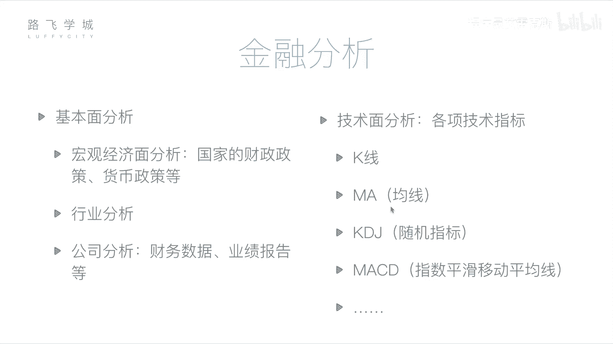
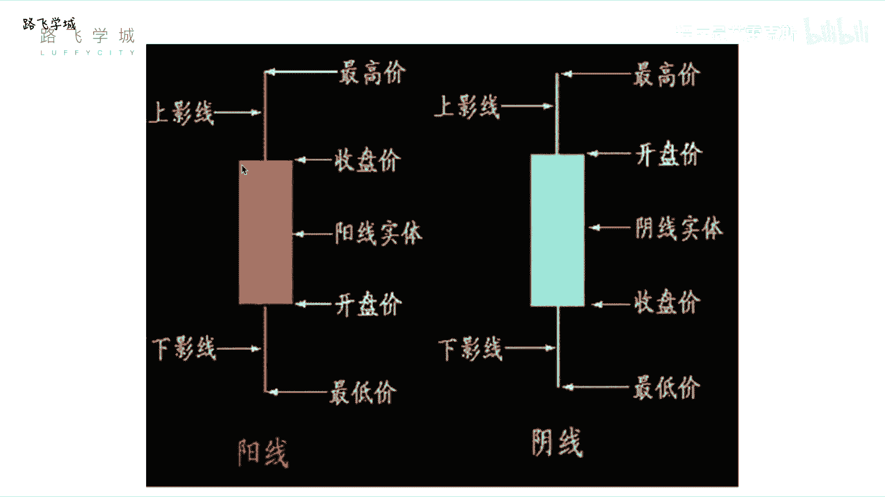
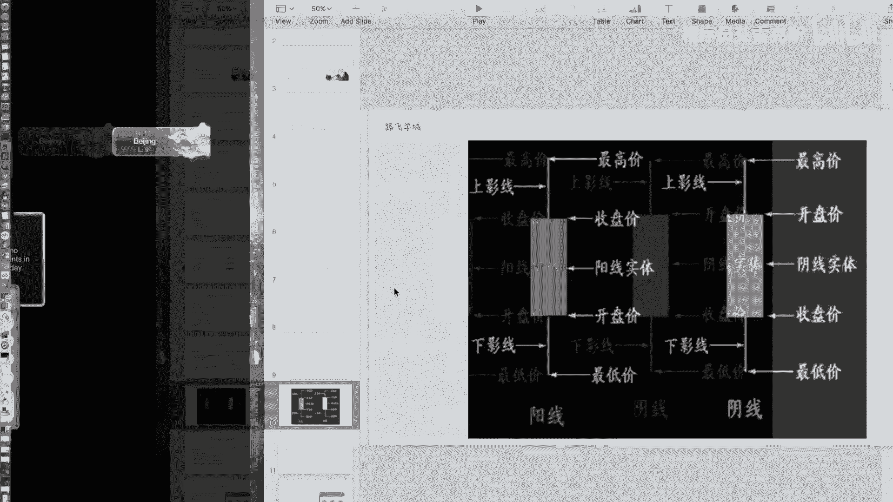
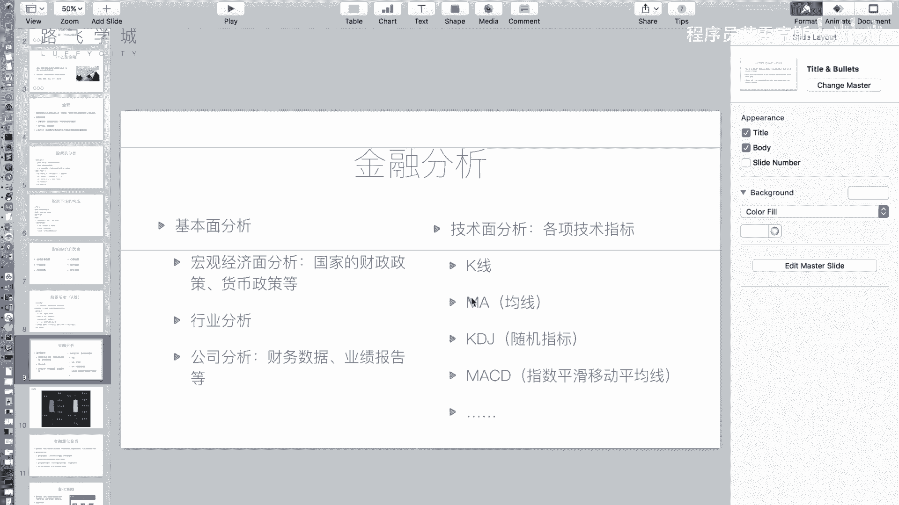
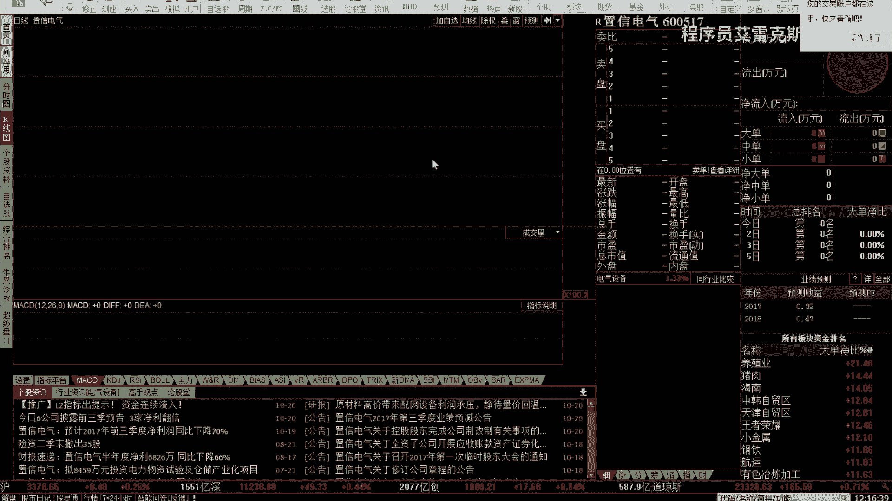
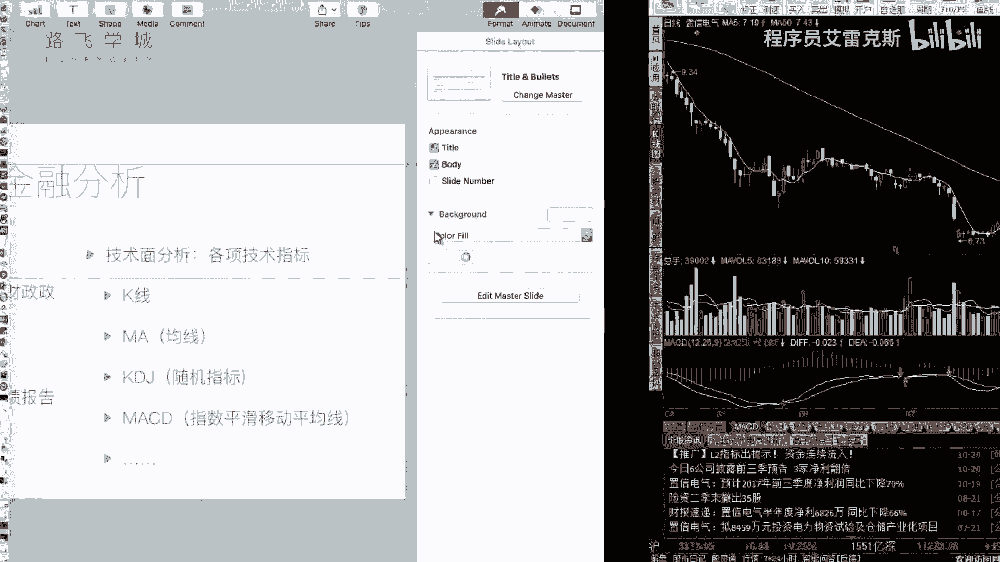

# 【2024年最新版】 Python金融量化投资分析+股票交易+项目实战 - P5：04 金融量化分析-金融分析 - 程序员艾雷克斯 - BV1DES9YPExT

好，那接下来讲完了啊金融和股票的一些基础知识。我们来说一下金融分析。也就是说哎我买完股票我怎么买，我不能瞎买吧。嗯哼，那我有一些分析的手段，我来判断这个股票我是不是可以买。嗯我判断他接下来可能会涨。

还是可能会赔。嗯，好，瞎买的都赔了。对，瞎买的瞎买的其实就是赌博嘛，这赌博对你就纯钱就是赌博纯赌博，什么都不懂，就是瞎买。那我们金融分析有两方面的分析方法，第一个叫做基本面分析。第二是技术分析啊。

所谓基本面分析说的是什么呢？说的是你要啊看你这个公司的运营状况啊，其实也就是我们之前说的营销股价的因素之呃，公司的公司自身的因素。对对，就是说当前的经济状况好不好，国家的经济状况好不好？

这个行业的状况好不好？你这个公司运营是不是好，哎，通过它来跟你这个决定，我是买还是不买好，包括三方面，第一个宏观经济面分析啊，包括你分析一些国家的财政政策啊，货币政策等等。

就是你看国家最近是他想让钱去股市还是想让钱存着啊。当然这个宏观经济没分析啊也不要过多的限到现状里边，因为事事实证明好多跟这个我们的规律都不太一样啊，这个不一定的啊。第二一个是行业分析。嗯啊。

就是说你这个你要判断这也是相当于一个比较宏观的东西了。你判断哪个行业整个行业，你当前的教育行业是不是好，你这个IT是不是好，包括你这个什么一些什么炼钢炼煤，这个挖煤这些行业。

哪个行业好一点发展还是行业分析，你可以提取，比如说提取这个行业啊，几只有代表性的股票，看一眼它们走势大家都能判得出来啊，再往下具体的最具体的公司分析啊，比如说我要买这个中国茅台这个股票啊。

我就看这个公司啊，因为你公司上市之后，你所有的财务数据都要分开对，所以这个就是说啊每年这个上市公司集中在呃这个就是什么要发几次财报，那那个在春节33月份是发好像是全年的财报。啊。

平常每隔一个季度也可以发财报。那全年的财报之前，就是说如果你已经啊比如说现行你自己本身就了解这个公司很久了，然后你本来就知道他今年的经营非常好，那你不用等财购出来之前，你已经知道他今年还好。对。

所以但是普通小散户，他可能不知道。对，所以你就可以趁机提前进入对，那等他财报一发肯定会大涨啊，几乎会大对啊啊，这个是他说的一些就是策略，就是你等他财务报表出来判断，就预先那个时间段先买啊。

对我说的是你如果不知道他他好还是不好，我就看财对我就看财务报表，今年赚了多少钱，股票值多少钱每家上市公司都会定期发他的财报，这些都是公开，并且是客观公正的对啊，那也就是经过这种会计事务所审计的。

所以数据一般来讲，整体来讲是比较比较真的对，也真的这是我们说通过你的财务数据，包括你自己判断看新闻等等。这个自己实实际考察等等啊，你做公。司的分析就是看你公司运营那么好还是不好。那通过这个来判断。

如果他的运运营非常好啊，你觉得它非常赚钱，你可以考虑买家的股票啊，这都是基本面分析啊。第二1个叫做技术面分析啊，所谓技术面分析，它的核心是什么呢？是叫所有的这个信息都蕴含在市场就是你市场交易的信息。

也就是说你判断什么呢？你看前历史前一个月前一星期等等。历史这个时期一段时期内整个的市场走势，就是你看它就是一个月之内股票是涨还是跌了，包括看一些我们说技术指标啊，当然你看它一个月前涨。

它不一定接下就会涨，有可能会跌，对不对？那我们就不能只看涨跌，我们要定义一些技术指标。那这些常见的技术指标。比如说K线啊，我们会不会说MA均线啊，包括KBJMAC等等等等啊。我们这儿先简要介绍一。

前两个啊K线和MA，也就是K线和均线啊，那K线是什么？好，我们先来看一下这个。

那个那对啊，我们先来看一下，这是一个就是啊。就是股票炒股的软件啊，我们可以看到。如果不看这两条线的话，这是我们股票每一天的走势，这个图叫做K线图啊。所谓K线图，它也就是说它每一天我们看。

整个的走势来说啊，先看整个的走势是从。2017年5月4日到2017年10月20号的股票走势啊，横轴是时间，纵轴是你的股票价格啊。比如说我们看。这一天啊指向2017年5月22号可以看到啊。

这上面写的开盘价10。73块，这个收盘价10。33块，最高价10。75块，最低价10。32啊。这个数怎么来的？整个这四个数都蕴含在这一个K线。你看到吗？就这个白色的一个柱状的东西，我们把它放大看一下。

好，就是每一天都会有一根这个柱状的东西。那这个东西叫做K线。啊，这个东西怎么看？好，我们来看一下K线啊。首先有阳线和阴线之分，阳线是白色啊，是红色的阴线。哎，是白色的。嗯，大家看过是蓝色的呃，蓝色的。

白色的就是不是红色的，不是红色的，就基本上都是阴显啊，白色的、蓝色的等等都有啊。那一般来说这个图可能还不太准确，阳线就是。

大部分都是空心的。我们可以看到这个。

我们可以看到这个啊这个红色的都是空瓶的，空瓶的表示阳线。好，那这个K线怎么看啊，阳线代表今天的股票是涨的，阴线代表今天的股票是跌的。那什么叫今天的股票是涨了呢？

我们知道股票看长时间在今天和明天的价格不一样。嗯，但同时今天一天内就是9点到3点，这个时间段每一时刻的价格都不一样。所以它会有4个价格开盘价啊，我们叫开盘价就是什么呢？就是我们说9点到9点25。

那个集合竞价出来这个价，秒它的开盘价。然后从这个价开始进开始波动啊，最后三点接着那个价做的收盘价。啊，如果开盘价比收盘价低，那就叫做低开。高总。对，是吧，就是涨了对，就是今天的价格是涨了。

那这个线就要用阳线来着啊如果开盘价比低收盘价高叫高开低高开低走啊，就是高很高的价格开了，但是它往低了走，那今天就跌了，那今天就是跌的就是阴线。那除了开盘价和收盘价一天内还可能有两个价格最高价和最高价啊。

最低价和最高价，对，也就是说今天比如说10块钱啊，开的还但是咵冲到了15，冲到15之后呢，就是但是最终收盘的时候又跌下来，跌到了这个1212，所以它整体还是涨，对，但是它最高时最高价，收盘是这样。

但是如果是冲到了15，但是最终收盘的时候是9块，那其实是跌了，对对吧？所以它就是一个阴线了。对，所以我们说这个有4个价格表现在这个K线上啊，具体表现四个价格分为看啊，阳线的话，阳线做例子啊。

有实体这个中间的红色的。这个框框嗯这个长方形叫做实体嗯上面这个跟下边这一这两道叫做影线啊，实体的上下边缘表示开盘价和收盘价。嗯嗯啊，影线的最高端叫做最高价，影线的最低端叫做最低价啊。

所以就这么一根K线表示出了你这四个价格很牛逼，对，很牛逼，一个的线这个线其实最最最初来源源来源于日本日本卖鱼啊啊鱼市上他们用这个来表示啊，然后后来股票接钱过来了。对，然后你你拿真的看啊。

没说完呢啊阴线我们来看一下跟阳线有什么区别啊，第一个它的颜色不一样。第二个你发现看的啊下边反过来对实体的下边缘表示收盘价，嗯上边也表示开盘价嗯为啥呢？因为你跌了，所以肯定你开往下走。

对你开盘价要比收盘价高嘛，嗯对，所以上边表示开盘价好吧，那么来看一下嗯啊真实的例子啊对。比如说这根这根K线啊，这个有那个上影线，这个有上影线，有上影线短一点。啊，我们来看这个吧。对。

我们来看5月25号这根这个线啊，它的下边，你看右边显示10。11块，对吧？对你看开盘价是不是啊，不太就差一分钱吧，可能有一点是我指的不太准，10。1对吧？这个收盘价。你看右边指的是10。29块，对不对？

他这是10块，也是29块，对吧？对那这是下边这个你看我它就打出来了，这个问题，最低价最低价9。95块啊，最高价在这儿。最高价右边是10。5块左右，嗯，对不对？嗯，啊，这是一个K线。

当然K线可能有一些特殊的情况。比如说呃比如说这个。啊，这个看到十字线嗯是什么呢？开盘价和收盘价是一样的嗯啊开盘价和收盘价是统一的啊，也有可能什么呢？没有某个影线。就是这个嗯啊这个就特别特殊。

6月6月15号这个没有两根影线，这就是什么呢？就是开盘价和收盘价就是最高价和最低价。嗯，就是中间波动过你的对中间波动过，但是你可没有10块开盘，然后那没有比10块按照商盘12收盘，它可能一直在涨。

就是10块10块1块就不可能超过102哎，对，可能有个特殊的形态。对啊，那可以有一些根据K线的形态方式来做分析。嗯，哎各种各样的形态。我们后面可能会说到好，这是K线。那第二个指标，我们介绍的是均线。

好。什么是均线？

点。我们可以看啊，显示两条均线。我们可以看到这根白色的线和这根黄色的线就是两条均线。那均线是什么意思呢？白色的线啊是我们叫看哪写的，就上那写的MA5嗯，它叫做5日均线。嗯，黄色的线60叫做60均线。

什么意思呢？是什么意思呢？所谓均线就是取你前若干天的价格做一个平均啊，平均值啊，是收盘的平均值还是开盘的平均。呃，是收盘的平均值嗯。是吧你也不确定应该是收看的平均值什么，反正是个平均值。

就是你选一个价格，作为今天的代表是一个平均值，没有问题啊嗯。然后我们看啊，比如说这个7月4号这一天它的均线的值是怎么算出来，它是算3号、2号啊，不是3号，因为这个3号，然后6月30号。

因为它没有2号和1号，两天周末放假对吧？就是往前数5天这5天的价格做一个平均，就是这一天今天的均线均线的值。值点，然后你把每天的点都连起来，哎，就是一条均线。对，然后60均线就是你往前数60天。

60天的价格走对个平啊，这就是M60，所以它的英文叫做mooving every中文叫做移动平均线。啊，不是说从今天开始算之前所有从就是股票上市开始，不是算所有的是往前算对两你往前算若干天啊。

这个是表示你能表示你最近的一个波动。那这叫做均线。那关于均线，咱们后边讲变化策略的时候，会有这个双均线策略说到啊，到时候再给大家细讲一下均线。

好。