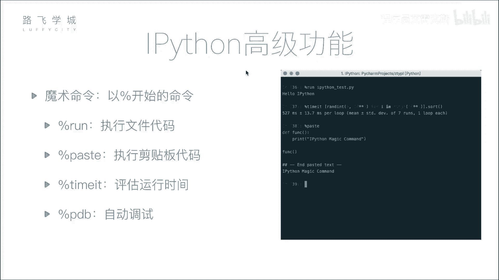
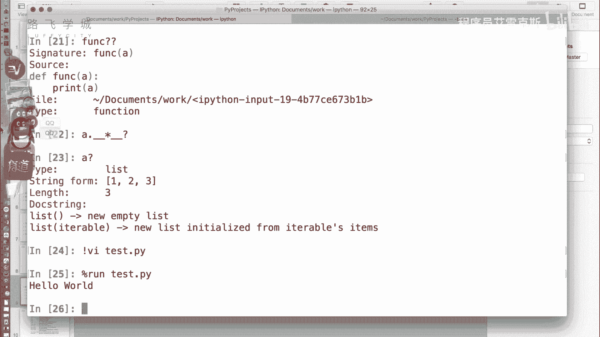
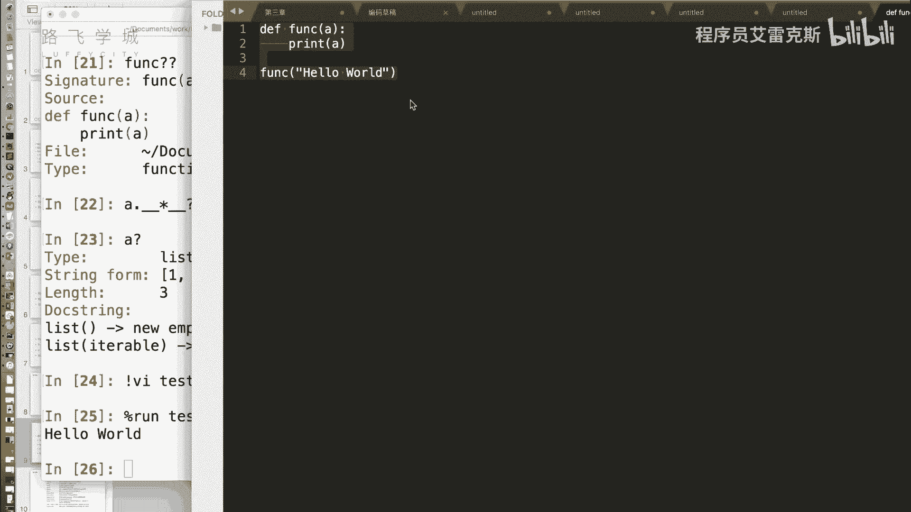
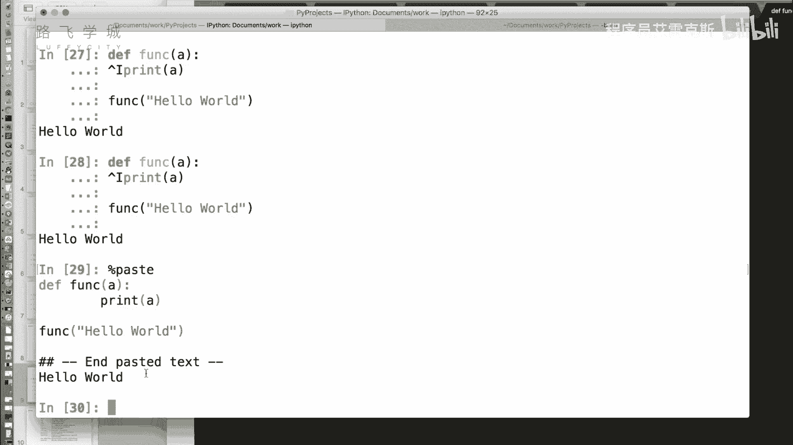
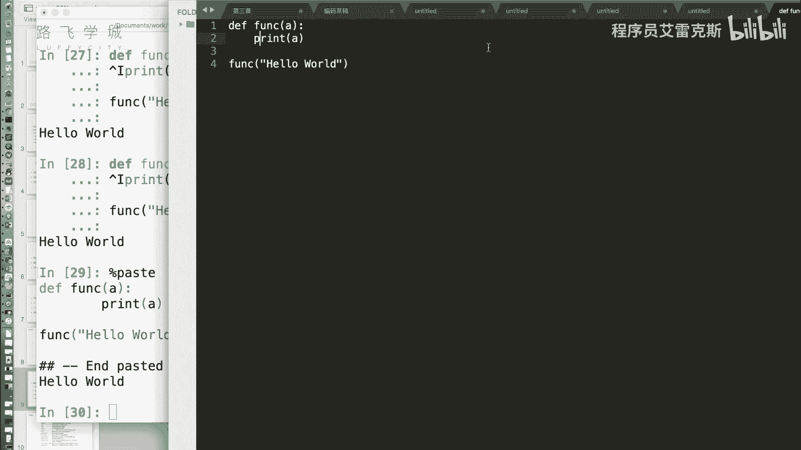
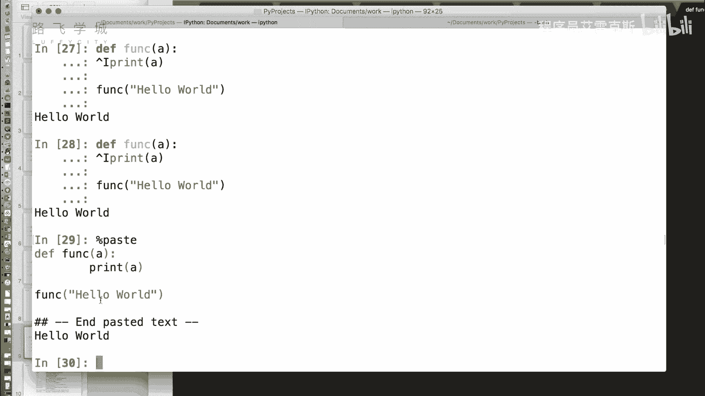
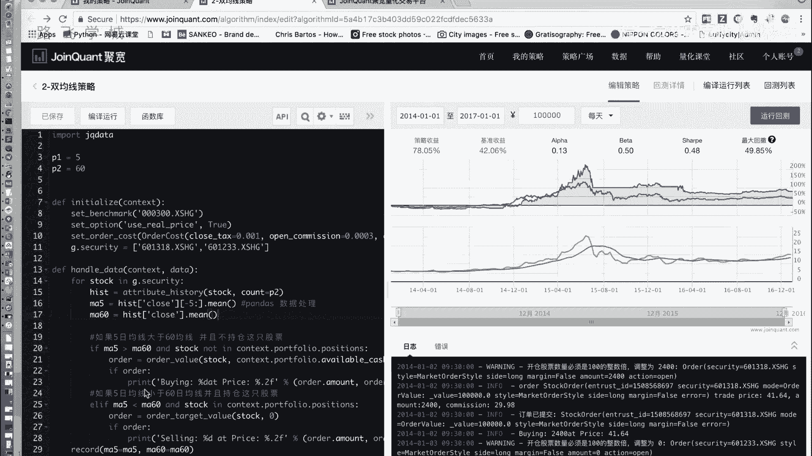
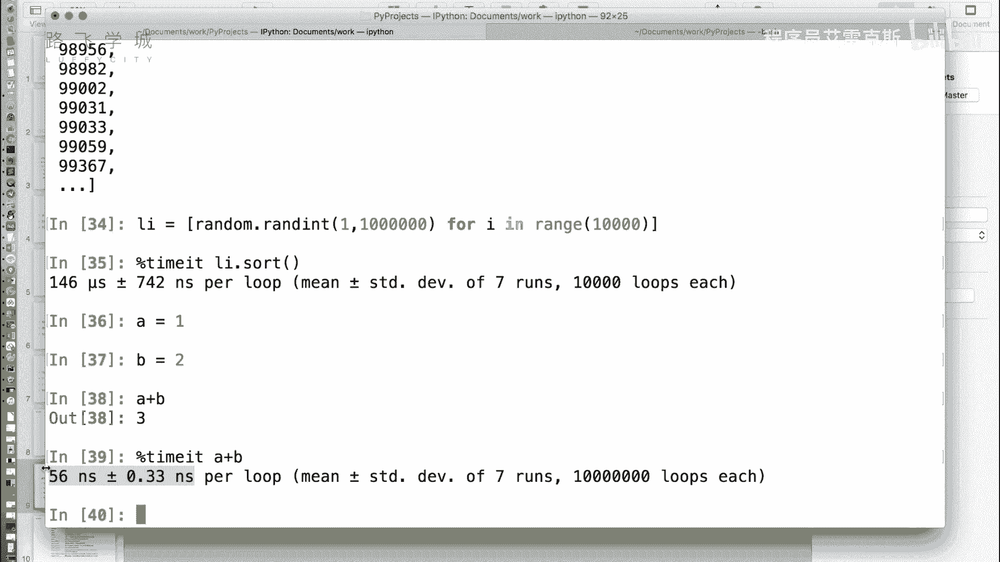

# 【2024年最新版】 Python金融量化投资分析+股票交易+项目实战 - P8：08 金融量化分子-ipython魔术命令 - 程序员艾雷克斯 - BV1DES9YPExT

好了，我们现在给讲这个魔术命令吧。好，我们接下来说一下ipad里有一个比较啊有意思的一个稍微好玩一点的高级功能，叫做魔术命令嗯。

它本身提供了很多的魔术命令。所谓魔术命令就是以百分号开头的一些命令。比如说。啊，我们在这个文件夹下，首先我们可以自己写一个拍摄文件。我们知道这个呃在拍摄命两行里，如果我想运行一个拍摄文件的话。

是需要退出命两行。然后执行tthon。特咩啊。执行。啊，执行python那个加我们的代码文件名，嗯，在控制台上运运行这个名对吧？那在ipad里我们不需要退出来。

首先我们可以其实我们可以比如说用VV看我们可以直接写一个python文件。就写一个最简单的。Hlo，玩。好，在这里我们用魔式命令摆分号run啊，加上哦，还能在交互器里运行pyon程序吗？我靠，好娘啊。

这个月我们的文件名就是百分号run加上我们的文件名，嗯，就可以哎运行on运行一个版python交互。在python的交互器，那有些人可能呃有些同学可能喜欢在比如说一些这个编辑器。

h time，比如说slime啊，smepy time就可以自己编译了啊。比如说我们创建一个，我们这次写多一点啊。我们写一个函数版的hello world啊。好。那我们我现在摁了ctrorl C。

也就是说把代码复制过来了啊，我们可以直接粘到这儿。嗯啊，当然有的时候对于有些代码说，比如说你看。

这里粘贴出现了一个什么嗯它出现了一个特殊字符。对，这是因为我在这儿摁了一个t键。啊。我操，现能这么修改，就可以可以这么修改。那你看现在执行的是不行的啊，没有，因为我刚才什么了。我我再重新粘一次啊。啊。

进行运行啊，整段代码也可以修改是可以的，可以直接粘过来。但是它我没有调用，它就直接运行了吗？嗯，那个方向就调用哦哦，你看下面那句sorry对不对？那除了直接登记，他还提供了一个特殊名嗯，paste名。

啊，就把刚才那个看到没有？执行了pas之后，他先把这段代码打印出来，嗯，然后给我输出了一个这是一个分格符啊，然后执行了一下啊，pas命令就相当于是执行剪贴版里的。嗯啊。

比如说你可以你可能是写着一特别长的几百行的代码。嗯，但是你可能需要一哎里边一部分我做测试用一下。嗯，我又不想再开一个文件复制粘贴过去，我可以把这一个复制过来，然后在这把块pas。嗯，这是第二个命令。

第二个魔术命令。

啊，paste那除此之外，还有一个叫timemate啊，这个命令是干什么的呢？我们平时写那个代码啊，之前你们讲装时系统的时候你们讲过，我要如果比如说要估计一段函数的运行时间嗯。

我们是不是用到time模块，呀我们可以用高级量，我们可以用装饰器对，来对这个函数进行这个封装。好，那假如说这个函数运行时间特别短了，嗯，你用time模块是不是经常会遇到这个函数算时间特别短。

然后我运行出来是0秒。对啊，那我们看用这个tmate问就会怎么样。嗯，我们来一个s帚函数吧。首先我们创建一个。创建一个随机的列表啊。1万瓦啊，我们假如说对着这个LI点st函数。现在是不是已经排好序了。

嗯，对不对？我这么执行是不是可以排好序？嗯，好，我们重新创建一个啊。那如果我想估计哎我这个排序的这行代码。需要多长时间？我们在前面加上百分号time make。意见。啊，他为什么时间有点长？嗯。

你发现没有？他时间比较长，为什么时间有点长？是因为看。出来的结果时间146，这什么微秒嗯，正负加减742是吧，纳秒嗯。per6 per per6就执行一次，为什么我们刚才画的时间长一点？

因为它对于你一个特别短的函数，他给你跑了很多次，嗯，来最后取了一个平均值。这是他的平均，那为什么要跑很么多次啊？因为你一次的话，比如说啊我现在是一个这个呃这个排序函数。比如说我算那一个A吧。

A等于一B等于2嗯，A加B你算一下它的时间那你如果用time模块的话能算出来嗯，算不出来，这这个瞬间的问题，对吧？对他们用time。他跑了第少次，后面这个一会儿我们可以看信息，我们可以看上面看出来了。

好，跑了没有这么多次，跑了一共是跑了7回，每就是7次运行，每次运行跑了这么多次嗯。哦，每次运行跑到100万次。对，然后算出来这一个操作是56纳秒啊，纳秒。

那你你就比较能精确的拿到这个就是一个特别微小的指指令，它运行一个花多长时间。对，这就是需要对于你做的这个整体的代码性能优化，可能会有帮助。对，比如说你想测试某一个函数或者某一个部分。

它需要多少时间啊是很有用的。尤其是这种特别这个不是说一个操作不是特别时间特别长。但是可能你代码需要一直调用它肯定时间长久啊，他没什明显好。

