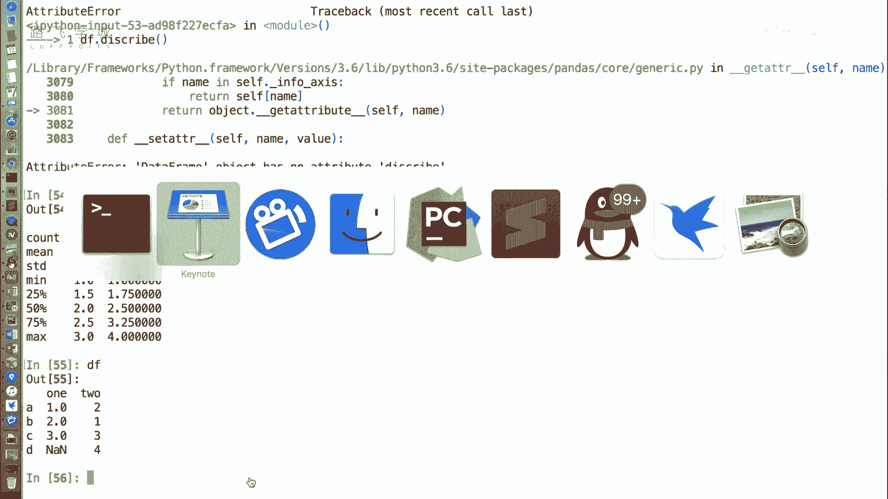
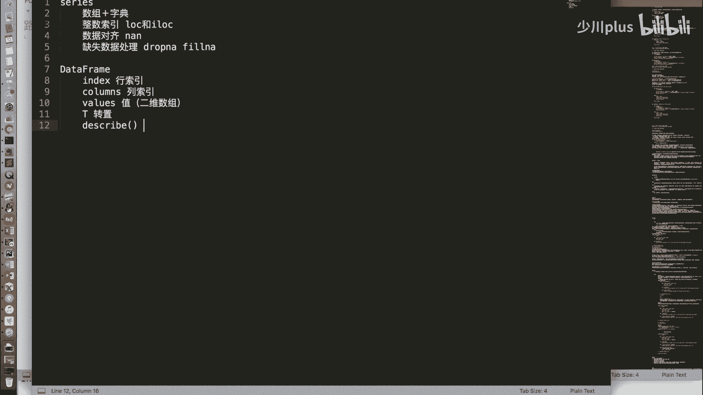
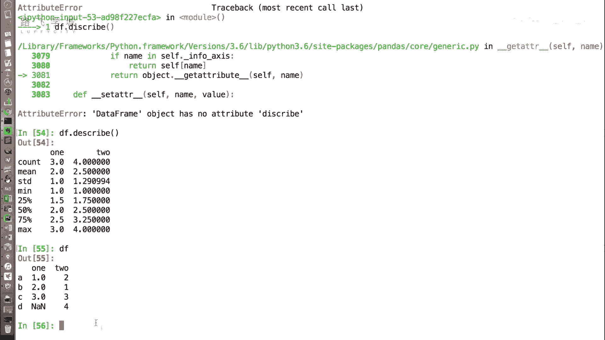

# 【2024最新系统课程】用Python开发金融量化与股票分析交易平，实战项目70集，学完做项目！ - P23：23 DataFrame常用属性 - 少川plus - BV1ptDWYzEWG

好同学们，刚才我们介绍了data frame对象的一些创建方式，那接下来我们说一下它有哪些常用的属性啊，和series对象一样，index属性用来获取它的行索引啊，所谓行索引也就是我们竖着那一排的索引。

嗯啊那values也和series一样，用来获取值啊，serious index获取所谓in value获取值，但是不一样的是，我们的data frame里，这个values获取的不是一个一维数。

是一个二位数，我们来给大家演示一下好，还是这个data frame对象，它DF点index返回的是他的对ABCD，这个我们叫行索引，就是A指的是一行，所以它是行索引，好，那DF点values返回的是值。

但是值它返回的不是一个一维数组，返回的是一个二维数组对对，而且是一行是一个一维数组对好，这是和serious一样的地方，那不一样的地方还有T表示转置，所谓这个转置。

我们其实在number py那个库里给大家介绍过，就是把它行跟列交换过来，就是行变成列列变成行，OK啊，那因为data frame是个二维的，它还多了一个索引，就是我们的列索引。

就是在最上面那一行列索引啊，那获取列索引的属性是columns啊，好来看一下对于DF对象DF点T转置，我们可以看到是把行变成列列，变成行完全倒过来，好的慢点啊。

行行索引行索引ABCD变成了列索引ABC行，所以one two变成了列索引，怎么都变成了1。02。0了呢，之前不是1234吗，二一对他这个问题问得好啊，我们之前说过n a an是一个特殊的浮点值啊。

啊NNN是一个特殊的浮点值，所以虽然我们在DF创建的时候，大家可能没有看到在DF创建的时候，这个位置指定的是123是整数，但是因为它是一个浮点值，所以这些值都被调整成了浮点数。

也就是说在data frame或者series里，你的一列要是一个数据类型哦，这点我们在never学校里也说过，你的一个数组要是一个数据类型，所以因为有一个NNN它变成了浮点数。

那么我们看DF点T为什么倒过来之后，都变成了浮点数，对啊，他们都是整，因为一列要是一个数据类型，我们把它转过来之后，1。0和二乘了一列啊，那它默认的是把所有的不是浮点数的东西，都转换成浮点数。

因为浮点数可以暴露整数，但是整数不能暴露浮点数对，所以你看他把所有的这个二变成了2。0，那这个一变成了1。0啊等等等等，那怎么把一列再变成从从浮点数再变成整数，就是我们之前说的那个s tape啊。

as type方法对于series对象和DF对象都可以，可以把它的类型转换成int或者转换成浮点数，你想转化的类型好，这是T属性啊，那获取它的再看再看回来，DDF这个对象获取它的列索引。

就是one two是通过columns属性来获取啊，返回的是one two的这个一个数组对象，那还有最后一个不太常用的属性，DF点describe啊，描述它返回的，加括号this qu啊，不好意思。

是这个什么属性，不知道啊，没有框嗯，就是有括号的呀，我是拼错了，对不好意思，这样写啊，DF点describe加括号，这是一个方法啊，描述它返回的是这两列的一些描述，我们可以看一下返回的什么。

首先count你对比一下DF这个函数啊，DF这个对象他对于每一列做了一些统计啊，对于第一列做的是这个叫count，就是个数min平均数，std标准差，min最小值max最大值嘶。

哎这第一列是对每一列分别进行统计，嘿这个就表示什么呢，第一列one这一列的数有三个，因为它有一个缺失值，所以count是三，这就表示第一列one这一列的平均值是二二，这一列是是相当于他对这个每一列。

就进行了这些操作，对做进行这些操作，可以快捷的看到一些信息，OK啊，最小值最大值这个25%，5%是75%，这个50%指的就是中位数，就是一列数里中间那个数，25呢，25就是1/4倍。

上这个数我来解释一下这个什么东西，比如说你有一个数组是12345，6789十好，那你给他排好序之后，它的中位数就是它中间位置上那个数对，就这大概是这是对，大概是这个位置二分之额，25%就是他1/4位置。

那大概是二啊，75%就算3/4位，这样的数据算是啊，这是一些统计学上的东西了，好这是我们说的啊，data frame这个对象的一些常用属性啊，index好总结一下。

data frame对象的一些常用属性，index获取的是行索引，columns获取的是列索引，获取的是值啊，就是data frame里的值的数组，那它一般来说因为data fm有好多类。

所以它一般会是一个二维数组，T属项获取的是data frame的转置，也就是把行变成列，列变成行，好describe，方法嗯啊，返回的是对于每一列的一些描述的统计信息。

这就是说这数数量std是什么来着，std是标准差啊，卧槽求标准差是直接给求出来了，不是好。

