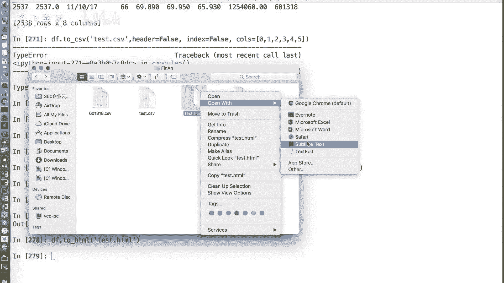
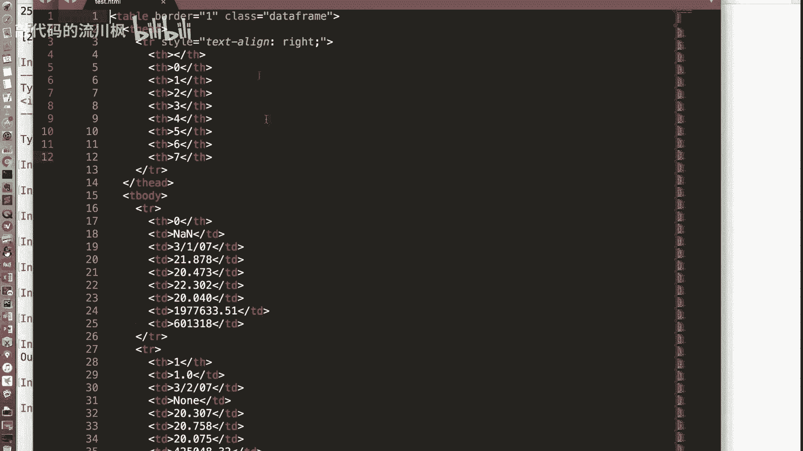
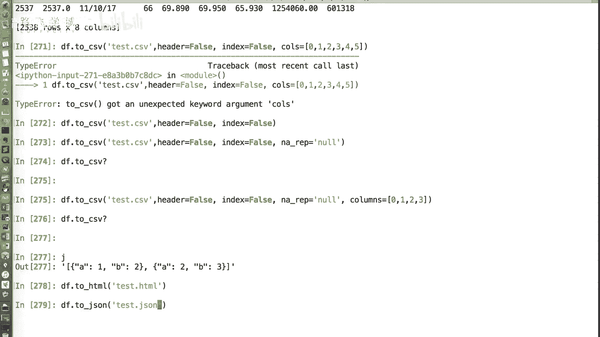
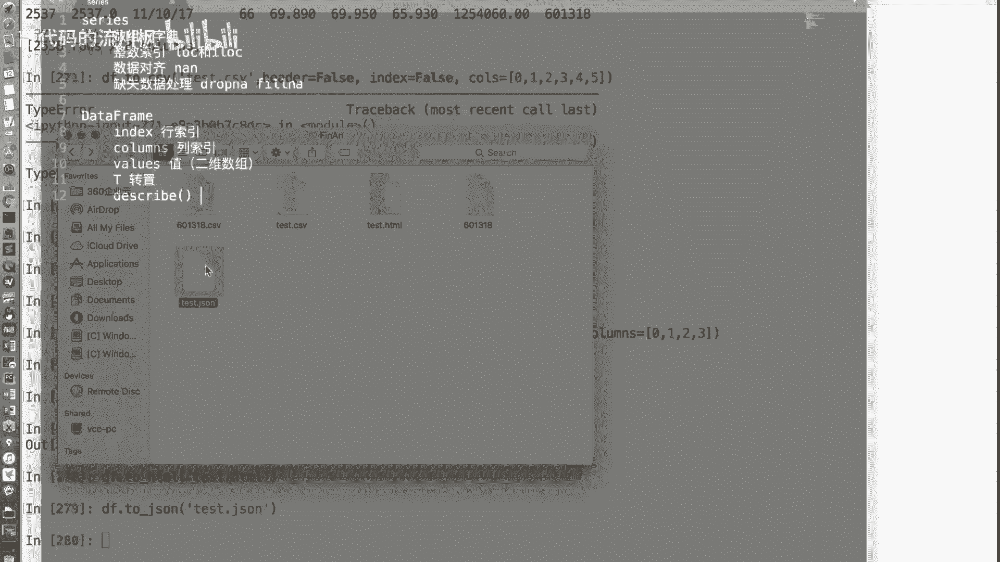
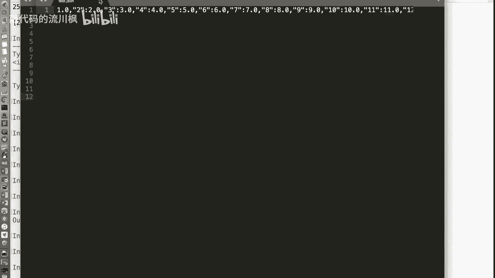
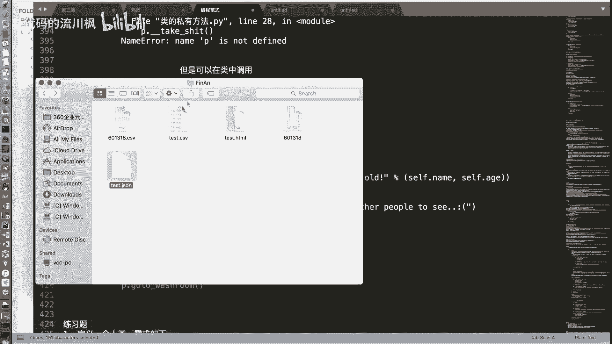
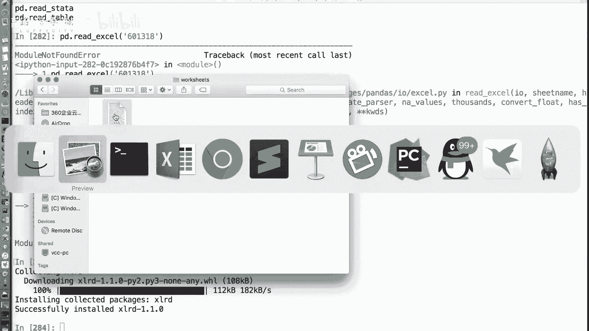
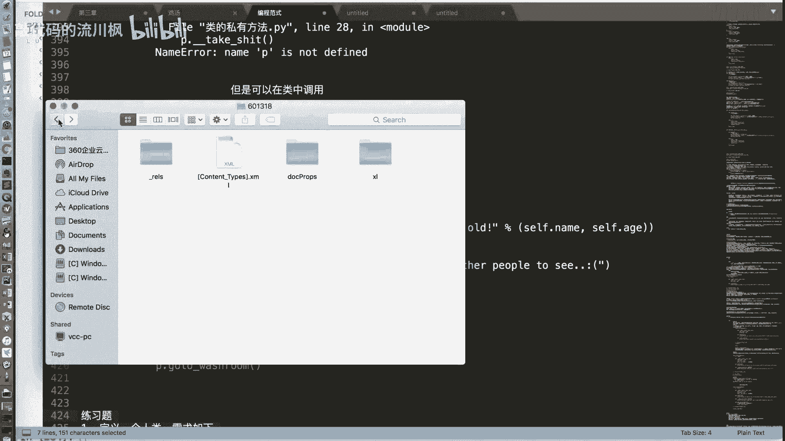
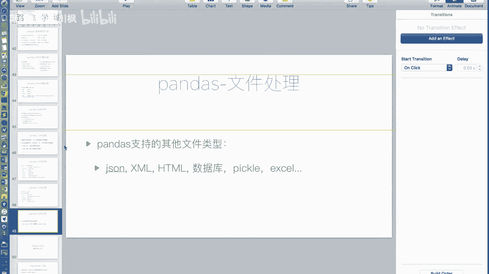

# 【2024版量化交易】全B站最实用的金融分析与量化交易实战课程，整整100集，3天从入门到项目实战，学完即可做项目，少走99%的弯路~ - P31：31 文件操作3+pandas收尾 - 敲代码的流川枫 - BV1uFCVYYETd

好那个之前我们介绍了啊，read csv函数就是读取文件，那to csv函数就是把它写入到文件，好之前我们也讲过to s to csv这个函数，但是我没有说他一些参数好，现在我先给大家说啊。

S1P参数跟瑞的CSV的SEP参数一样，这个只不过就是我指定写到文件的时候，我拿出来封口服用，看你不指定SEP默认就是逗号啊，to csv默认就是逗号separate啊，你可以指定啊。

N a r e p，和我们之前说的RCSV里的这个n a values，是反着的，Nn values，我们是不是说把一些字符串解释为n a an，那我们的to c s v的NAREP。

就是说我把NAN写成哪，是写成什么字符串，转换成什么字符串放到文件里啊，OK啊，默认的话它是空字符串，对啊，你如果这个地方是n a an了，你给他，比如说你是NNN还是空格，空格或者是空字符串。

或者是NAN字符串都行啊，默认的话是空字符串，OK好，header等于false一样，只不过如果header等于false的话，那个read csv是不读，就是不把第一行读成header。

这里边是不输出第一行那个列名那一行好，还有个index等于false，就是不输出行索引一列，嗯哼啊，最后一个COLS啊，你可以写一个列表，指定你输出哪些列，如果说你不是说所有列表函数数。

你可能输出其中两列，那你就COS等于一个列表，然后列表里是行，是这个列的编号或者是列名都可以，好简单演示一下好这个data from me对象，比如说我先给它找一个，我把它。

第零行第零列这个位置给它改成NNN啊，然后我们把我们把这个这个列表给他写进去啊，DF点to c s v啊，SEP我就不指认了，比如说我可以指定header等于false啊，index等于false。

输出的列有时候可以是零一啊，2345我就输出前六列好啊，当然忘了一个最关键的参数就是文件名，文件没写在最前面啊，比如说我们这是你这个现在本来就没有header了，你还header现在有header啊。

哪个啊，1234对啊，你如果不指定的话，他会把这些去掉，不是不指不写等于false的话，他会把这些写到第一行哦，哦他不知道你是自动创进来的，这个作业他会把012345写在第一行啊，这些也会写在第一行。

但是我们现在就指定是false的话，它就这个行和列都不写了啊，好column c o s c o l s不能这么传，因为嗯我知道了，C o l s，等于因为我们现在COS是整数，所以会出问题。

嗯你先不管我先不测试了，我先测试之前的好，来看一下test csv，啊是不是没有了对啊，因为我的对data，我的data frame，这个这个NN，这个NN它们是本来本来就选的N不是。

那他们没有没有办法管，我们看这个NNN它变成什么嗯，我指定了吗，没有指定没有指定，那我重新再写一下，看它变成什么了，它变成了空哦，OK默认的话是空字符串吧，比如说我变成我让它变成这个NAREP。

等于说我别闹了，我区分一下叫NULL吧，对好吧，啊那就变成这个co，想输出指定行呢，想输出指定行，就是我们来看一下吧，我们来看一下它的这个啊文档啊，有更多的参数，我没有讲一个课特别的参数。

比如说这个服这个小数的格式啊等等等等，我们来看一下这个c o l x so columns吗，叫columns吗，那里有一个columns，我看啊叫columns啊，那是就是因为它这个什么呢。

它这个data frame这个不是pandas，这个库现在还是0。19版本，所以他一直在更新，有的时候就是前一个版本，到后一个版本对名称会变化，所以这个有的时候我的知识可能跟不太上，那现在看来是改名了。

改成全称了，columns了，我们再试下，0123前四行哎，不是我错了啊，那看来就是改名字了，你看他只有前四行，刚才那是前四列，前四列，不好意思，前四列啊，他只能要前四行吗，不值不能。

为什么我就想要前四行，你要是想要前四行，对啊，前四行前四列，那你就把前四行先切出来，在to csv啊，他没有是吧啊，我不确定有没有好吧，没关系，那个也也不难啊，可以看一下。

因为我这是只是缺了没有没有这个没有rose，并没有，那就切片了之后再再再去对，那你就切片了之后在这个好不好，没问题，这是我们说的data这个data frame的啊，这个pandas to csv方法。

那除了CSV文件，它还支持其他的文件类型啊，比如说JASONXMLHML数据库，pico excel等等等等都支持啊，我这里时间关系就不给大家一一介绍了，我可以演示一个，比如说我们来看啊。

我之前创建了一个这变量，它存的是一个JSON类型的字符串，你能把它直接存成XMAN吗，存成X它不能指定格式对吧，它可以存成XL好，直接to xm多少多少XML没有了没有，那不能存。

他还能to circle呢，卧槽牛逼，to jason是可以to HTML，就HTML长什么样，他怎么它也不是个TML的数据啊，他怎么，他估计是XML的。

各种不是哦，表格里你打开你打开你打开这个这个有点意思。

你打开就双击打开，对这就是这就是页面的HML的表格啊，那还挺好，求jon to jon呀。

然后然后这个我知道怎么看这个JSON的格式。

它不就是放在哎在哪呢，你把它打开到我的页面上再来啊。

吃点这一把拖过来，我擦好，可以，放好行得copy过来是吧，太长了啊，可能会对我知道你想让它这个好看一点，但是因为太长了，而且他可能过来了，这是JASON的格式啊，good ok啊，保存读取也是一样。

读取也支持好的，比如说你可以你可以看一下这个re啊，我们用我们的这个IPAD的这个查询功能来看一下，它支持啊，不是DF了，pd不好意思，pd点read，好有好多剪切版，csv excel等等等等。

GBQ啊，有好多我们可能自己不熟悉啊，这这可能是一些其他的格式啊，比如说HMLJSON，然后包括PICO什么cycle，Cl query，cyco table等等，这些都知识牛逼啊。

那我在这再多说一点吧，really excel啊，我们可能经常用过excel表格啊，看我们这把这直接存成了，我们这直接存成了一个差啊，叉LSX的excel文件，那它的话啊。

你直接这个pd点read excel是会报一个错，601318会报一个错，报一个什么错呢，No module named xl rr，因为XL处理需要对需要这个库，所以要装一下这个库。

啊啊因为这个excel它的文本格式不是文不，他的二文件格式不是文本格式，它不是二进制，它是XMLX什么XML，我们大家说一下，来看一下，这是个XLXLSX文件，对不对，然后给他复制一下。

然后把它过来重命名为点zip嗯，解压，成功解压了，我可以你可以看里面RELS，这是什么参考的一些东西，这边没有，这里边啊，是你的一些文档啊，这包括是你的缩略图好，然后你的文件的格式。

文件的数据存在这里边，然后是work it it1啊，你的文件的格式是存在这里边。

你感兴趣大家可以自己看一下，这里边是你的一些数值之类的，不拉不拉库。

这它其实是一个XML打包的文件啊，那不说那个了，我们说装上了这个库之后就可以read excel了啊，is a directory啊，不好意思，好我们可以看这就是读取了excel文件啊。

也是比较常用的一些，那其他的比如说JASON啊，比如说这个HML，比如说这个数据库，大家可以接下来自己去看一下这个文档，或者是在IPAD里，其实你输入这个P，你输入你的就是我们之前介绍过的类型方法啊。

read这个比如说你想看cycle啊，问号你就可以看到它的参数各项说明，然后包括啊有的还有例子啊，然后等等等等，这些就大家自己再去看，我们这个pandas as的内容就讲到这里嗯。

哼好简单总结一下pandas数据库，我们讲了series对象和data frame对象两个数据对象啊，series主要处理一维数据，data frame处理二维数据啊，就是做一个跟一个表格一样。

那详细来说，我们讲了他的怎么使用它的索引和切片啊。

要注意这个整数索引的时候要要lock和i log分开，data frame对象做索引的时候，建议用中括号里边加逗号的方式，而不要连用两个中括号，那除此之外。

我们介绍了这个2SIRI对象或者data分布对象，做操做运算的时候是要对齐的啊，是要做这个数据对齐，要按照标签行和列都要对齐，那出现缺失数据的时候啊，就是NAN就是我们的缺失数据，出现缺失数据的时候。

我们可以通过drop n a或者FUNA，把这个确认数据扔掉，或者是给它补充上新的值嗯，那另外我们还讲了这个pandas里，对时间序列的支持啊，文件处理等等这些操作。

那啊我们关于pandas as这个核心库的模块介绍，就到这里，后面我们会有一些练习题，大家一定要练一下，要不然就就白听了吧，就全忘记了好吧，那我们啊pandas学习这一章就结束了。

