# 【2024版金融量化】AI结合金融如何做落地项目？迪哥手把手教你3天从入门到项目实战，学完即可做项目，少走99%的弯路，学量化交易看这套！人工智能／计算机视觉 - P15：第3章：策略收益与风险评估指标解析 - 迪哥谈AI - BV1NW421R7d7

这节课咱们来说一下策略的评估指标啊，先说一下评估指标指是什么东西啊。当我们做完了一个策略之后，那肯定要在历史数据当中啊进行一个测试吧。看咱们这个策略哎，到底是赚了还是赔了。那赚的赔了，它并不是一个词儿。

你得告诉我，哎，比如说赚了多少呢？那相比于大盘来说，我们比大盘有什么样的一个优势呢？以及当我做了这样一个投资之后啊，或者说当我做了这样一个策略之后，我会遇到哪些个风险啊。

我做这个风险是值得呢还是不值得呢？以及哎我的策略跟别的策略相比，那有什么样的一个优势啊，这个就是我们要做的一个策略评估指标了。我现在大家看一下，就是后续啊咱们要用到的一个呃策略平台。

这里呢我先不介绍啊这个平台干什么的。咱们先来简单的去了解一下我的一个结果，咱们讲这个策略评估指标主要是做这个分析的。那看这里哎咱们就其他都不管啊，就是看到几测就行了。你看这里是不是说当。

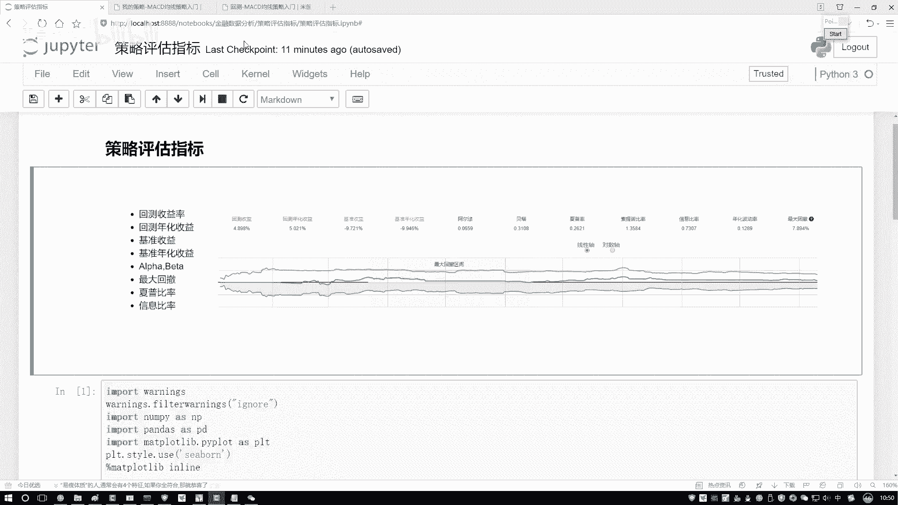

我们做了某一个策略，你不用现去管是做什么东西，等后面课程当中，我会详细给大家去解释啊。当前哎我们这个平台它做了一件什么事儿，以及呢我们要做什么样策略，什么样实验。我们现在只需要关注啊，就是有哪几个指标。

你看这里。这些指标是我们最常去说的。然后一会儿呢我会在咱这个n当中一个大家去讲啊这些基本的评估指标啊，它们都是什么意思，以及呢我们的计算公式是什么，主要啊就是大家可能看这个计算公式看起来挺长的。

挺闹心的，没关系啊，最好是去通俗的理解就可以了。我建议大家就是对这几个指标，哎，一说你就知道大概什么意思就行了。不用把公式背下来啊。公式我只给大家简单的描述一下什么意思。

主要呢咱还是得知道这些指标表达是什么东西啊。其实说白了就是为了让大家能看懂什么，看懂就是咱的一个分析结构当中啊呈现出来的各个指标，哎，它都是什么样的一个意思啊。行了，我们来看一下吧，这里有哪几个指标。

😊。

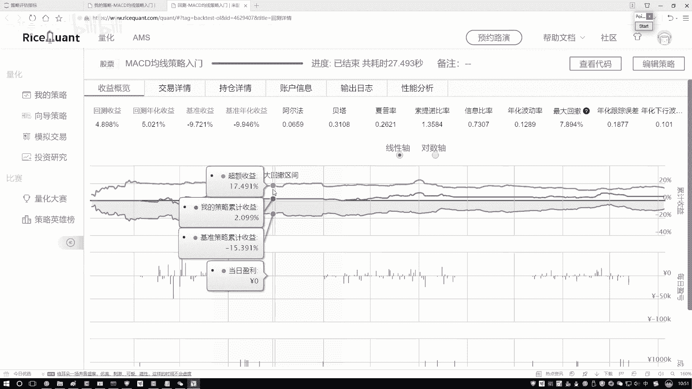

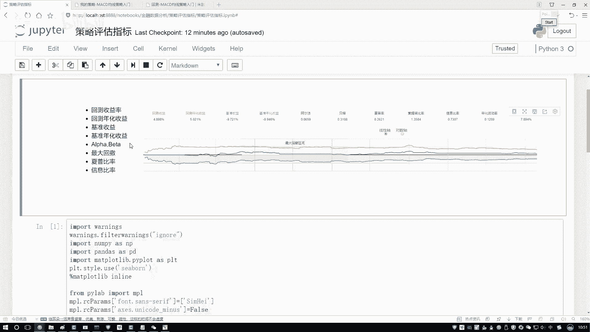

先说第一个吧，叫做一个回测的收益率。一个一个来吧，咱一个去说啊，一会儿呢我会下面就是咱边写代码，边给大家去讲啊每一个策略，然后它都是做了一件什么事。第一步这样咱们还是先把这个工具包给导进来啊。

工具包导进来这块呢加上了一些字体啊，主要是呃方便咱们去写我们的一个中文的数据啊，咱们一会可能要画图。第一步还是先把这个数据给读进来啊。然后呢。

一会儿啊咱们基于啊我们现在的一个本地数据来做一下我们的一个策略，先不用咱们该给大家说这个平台啊，先拍当中给大家捋一捋，都是什么意思。等后续呢咱就不自己算了，全是基于这个平台，它自动啊帮我们生成出来的。

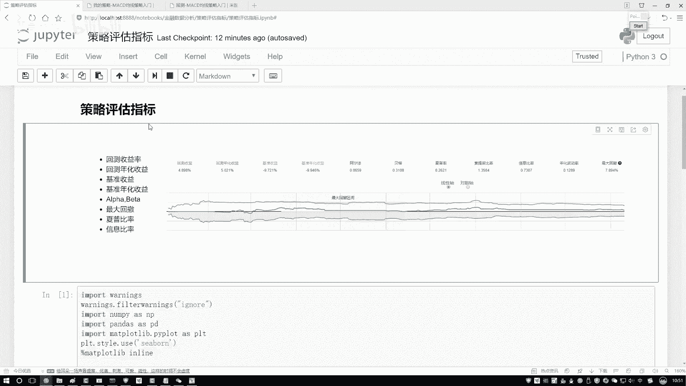

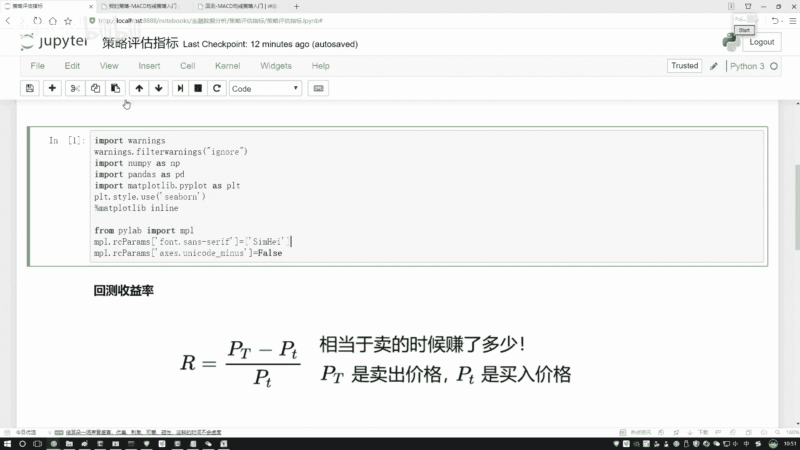

多一下数据，然后我说指定一个index啊，就是一个日期是第零个就可以了啊。然后指定我们数据名字叫做一个data。然后呢看一下咱们数据啊长什么样子。行了，这就是我们这个数据啊。

然后反正就是有些股票有一个指标啊，在这些指标当中，你就看它发生一些变化，然后呢当它发生变化的时候，我不是想看嘛，就是你的上面你不是跟我说了，有这么多指标嘛。咱来看一看这些指标啊该怎么样去算啊。

这是给大家提供的一个样例数据。然后呢我们就一个去说吧啊，先说最重要的一个也是最基本的一个叫做回测的收益率。你看这里。

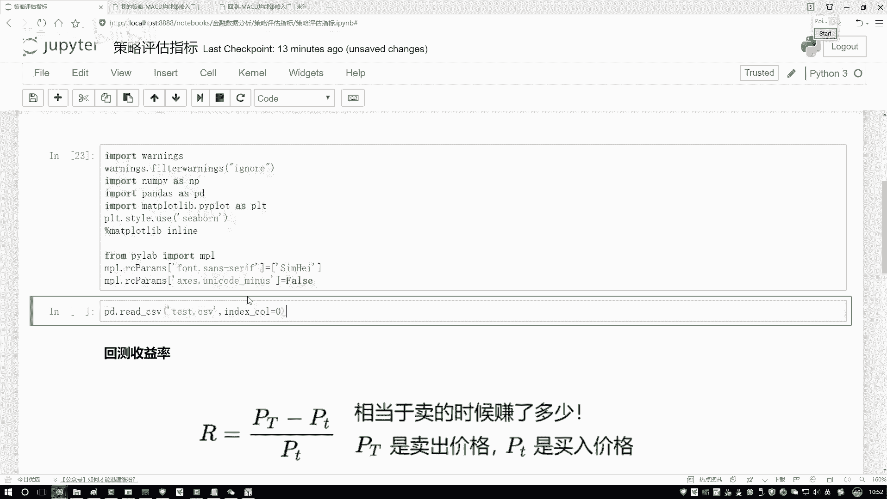

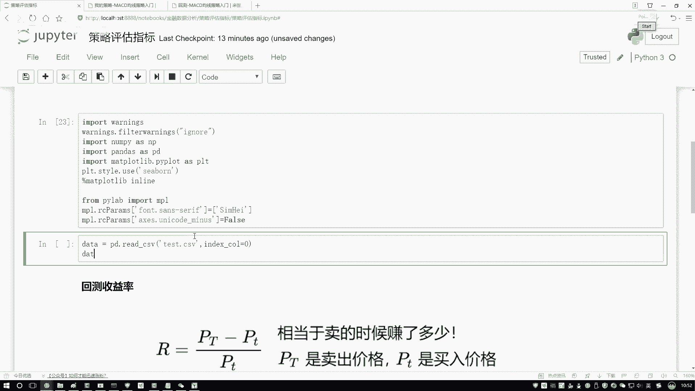

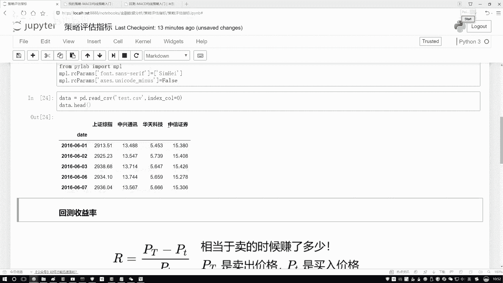

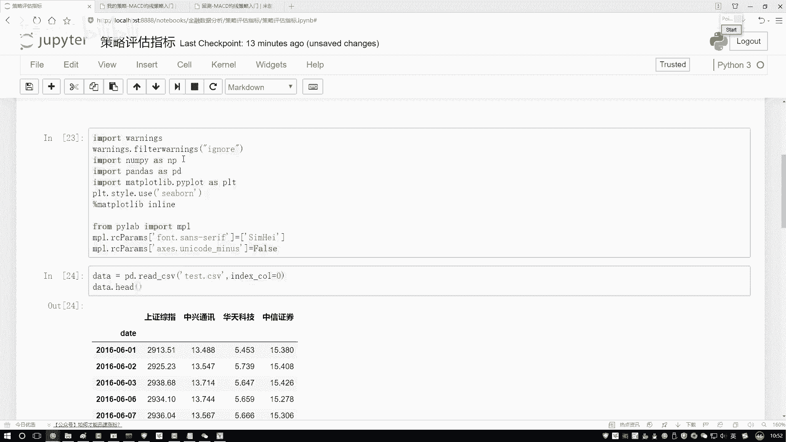

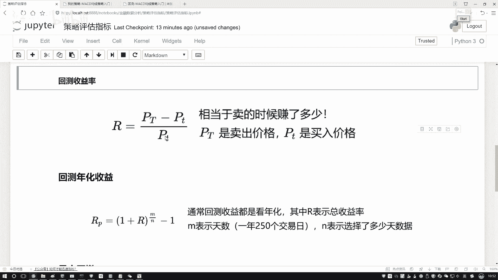

这块什么？第一个指标就是回测的一个收益吧。回测收益啊，它是这样一件事儿，就是呃当你做了一个策略之后，那你肯定也要最终知道你的策略，比如说你说选这个从15年到这个20年的一个某个股票，每股某个股票的数据。

然后你选了一个策略，然后什么时候买收入卖，然后得到一个结果，这个结果就是哎最终你赚了多少钱啊，但是注意点它是什么？它不是一个钱多少吧，是相对啊你一开始有的一个本金啊，你赚了多少。

你看这里比如说它是一个40多啊，你就大家知道了，哎呀，我折腾多年，我大概指得我这个赚的一个钱，相对我的本金来说多了多少啊，大概这样一件事儿。行，然后给大家看一下吧，就是我们的一个券公式。😊。

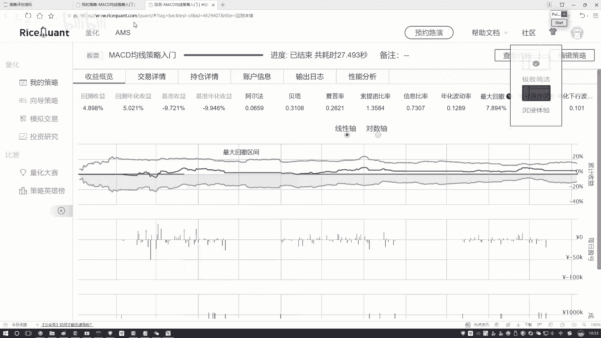

基算公式啊非常简单，回测收益率。你看这里有一个呃PT大体的意思就是说咱们现在的一个卖出价格啊，就相当于一开始啊，你是有笔钱啊，然后有有笔钱之后，你去买了一些股票，这是你开始有笔钱买了股票，然后呢。

后来隔了一段时间也卖出去了。我们现在啊就是分子当中，是不是相当于是你赚了多少钱啊，但是注意点赚了多少钱是相对谁来说呢？是相对啊一开始你有多少钱啊，咱们来说的算了一个什么回撤的一个收益率吧。回测收益率啊。

是咱们呃在这个计算策略吧，或者说做评估的时候，我们最常用的一个指标了，主要就表示着我们当前哎呀，这件事做的怎么样吧啊，这是我们的一个回测收益率。😊。

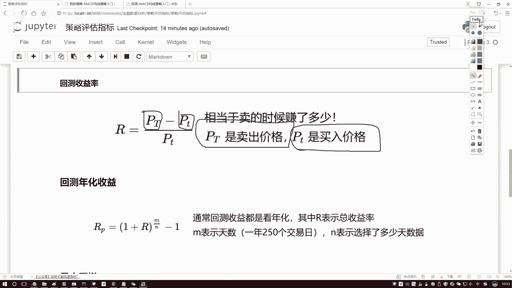

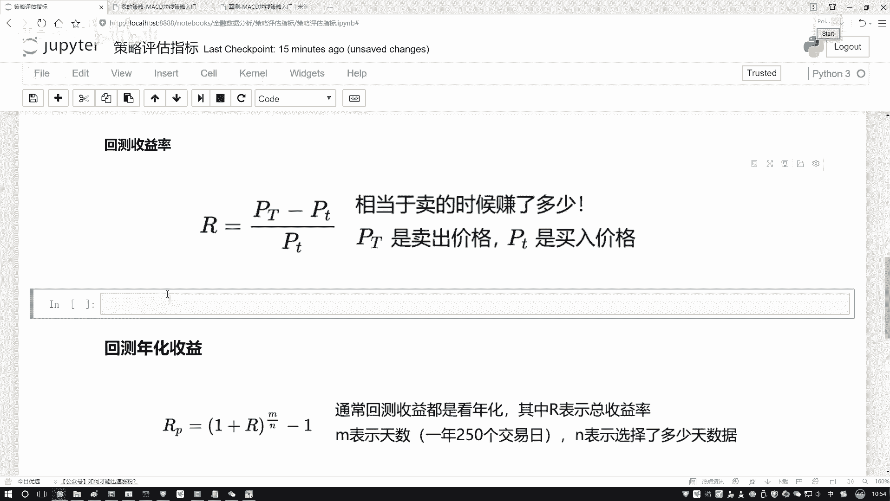

然后呢给大家来看一下吧，就是咱们这个回色收益率啊该怎么样去做这样一个计算。其实这样呃，我们一会儿画图，您可以画一个图啊，比如这样。现在我们是呃从这个比如说比如说啊15年的、16年的、17年的、18年的。

你可以看一下，就是随着时间的一个变化，你的一个回测收益率，它的一个变化情况吧，我们是可以求这样一个变化情况吗。那怎么求这个事儿呢？那是不是说啊你用每一个时间点，它的一个PT值啊，比上什么。

比上最开始它的一个值就可以了啊。来看一下吧，当前我们的一个做法？好来，这里我说这样，我说现在啊我构建一个de frame，de frame当中啊都是一些呃我的一个比值数据啊，这可以了。

这里啊就是我们先不做这样一个减法，因为我们可以这样，你看这个东西，我们是不是可以这一块做什么，这块做的除法，后面减什么减去一个一是不是一样的呀啊，咱一会儿直接减一就行了。我不做那么复杂。

最后减一相当于把这个公式给它做了一个化简来写一下吧。那你说第一步要算什么？😊，是不是你算一下这两个数据，它的一个比值啊，怎么算？那我说我构建一个date frame吧。好了。

先构建一个date frame在这个date frame当中啊，是不是说对于我每一个时间点，我的一个结果，你看这是一个结果吧。要比上什么，最开始我的一个情况吧。好了，最开始的情况。

那就是我什么第一个数据就可以了吧。好了，对date frame当中，我说点IOC一下IOC当中啊传谁呀？第一个数据是谁索引为零的吧，这样我构建完之后。😊，咱们现在得到了什么？就是我当前的第一个事儿。

这我就做完了吧。好了，咱们现在把这个第一件事做完了。然后呢，哎给大家画个图也看一下，但当前这个结果对它我说我去做一个plot，然后我指定一个pic size，等于的稍微大一点来看这个图。😊。

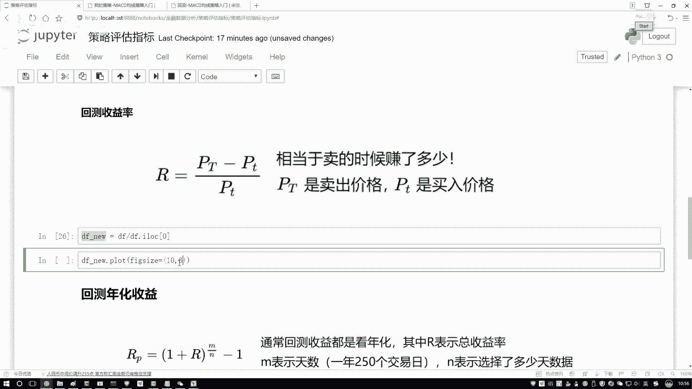

这是什么？这就是相对一开始啊，一开始是一的情况下，我相对一开始比如一开始是1块钱，我现在把这1块钱变得怎么样了。哎，通过我这样一个策略是吧？行了，那然后咱还没算完，我们要算什么一个回测的收益率吧。好了。

那我说我最终啊咱的一个回测收益率，然后一个 return特值。😊。

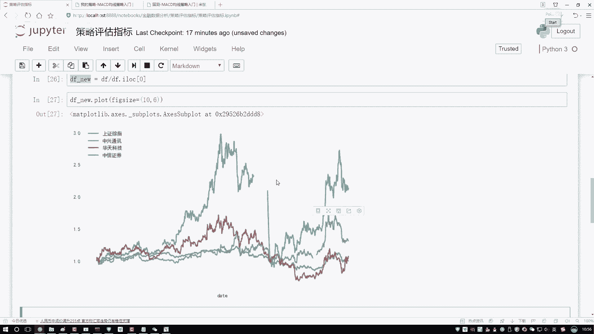

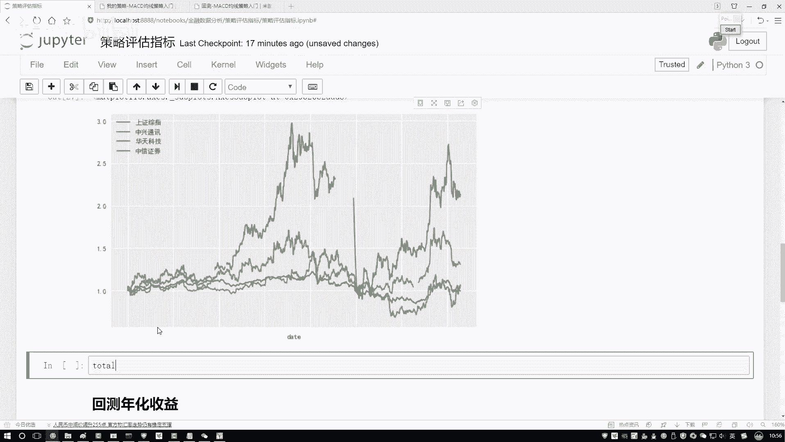

等于什么呢？等于在我的de frame当中去干什么？对于我的每一个哎，咱们算最终的回得收益率啊，最终回得收益率，那就是最后一个值吧。那不要忘记还要减什么公式当中告诉我了嘛。

最后还要减谁减去一个一是不是就可以了啊？然后呢把这个东西，我说做成个表格吧，再展示起来，看着好看一点。现在我说我构造一个de frame，在我当前de frame当中啊。

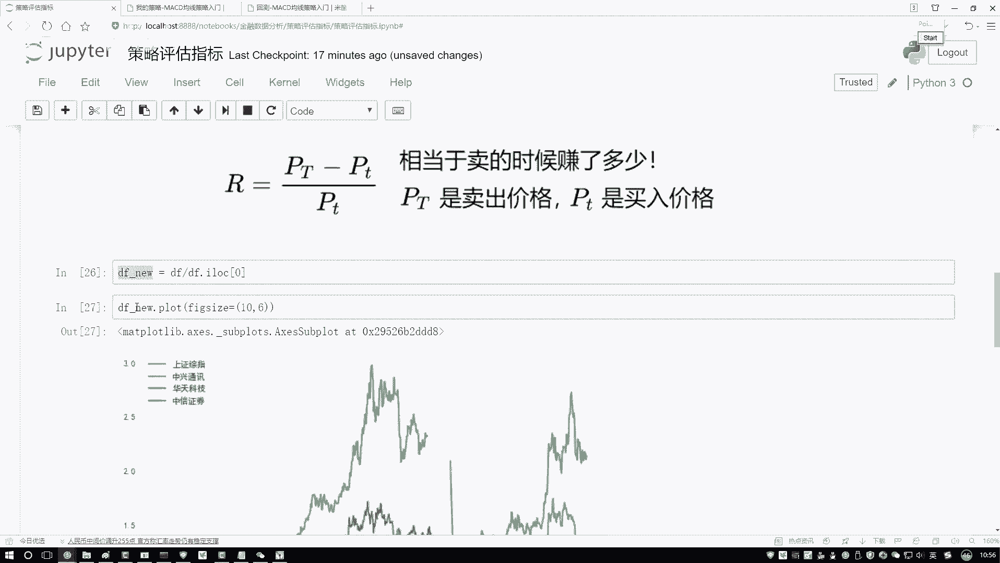

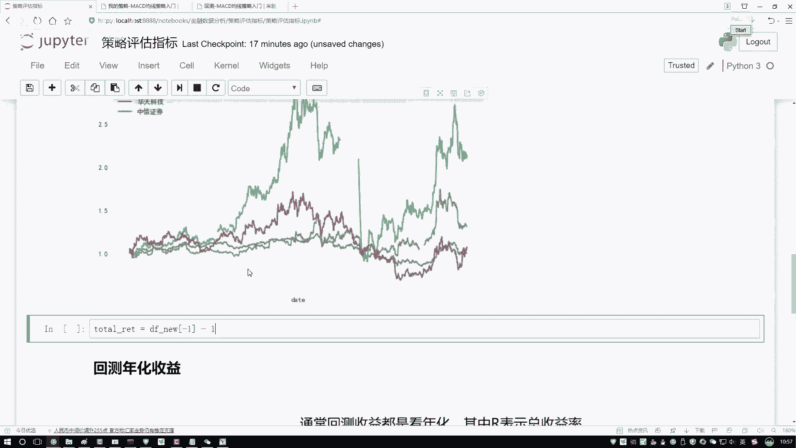

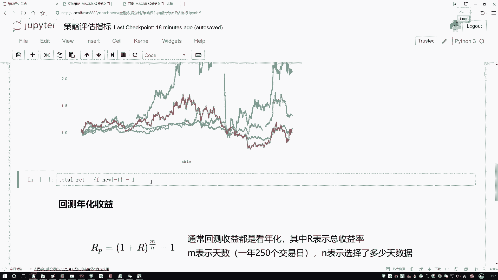

把我的一个结果给传进去，然后用它的一个点V64，这是我的一个数值呃，然后指定完数值之后，我说指定一个列名吧。呃，我的列名我自己叫做一个名字，叫做一个回测收益率行。好，叫做一个。回测收益率行了。

然后指定我的一个索引呃，指定了索引，然后就拿原始原来索引就可以。

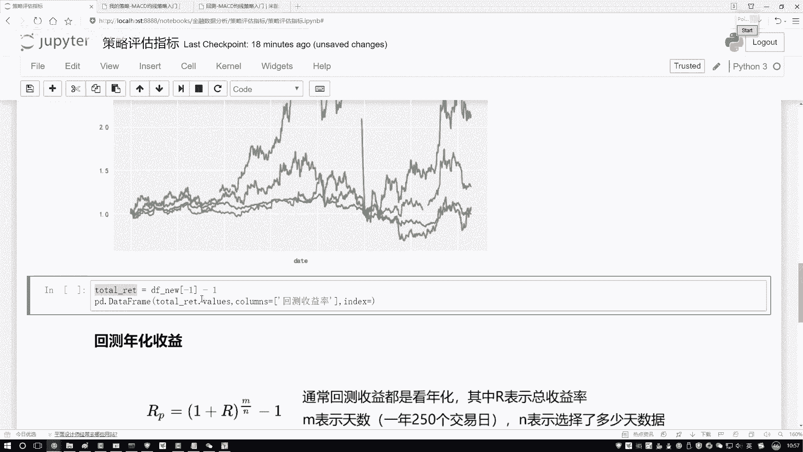

第二index也行，我们来质行一下啊。哦，看一下遇到小问题，这个负一没有在我的一个索引当中哦 frame当中，我得去点LOC一下，然后再执行一下。这样我们是不是就把这个回测收益率哎给算出来了。

相当于哎呀我跟一开始相比，我现在是赚了多少，通常突然赔的可能性也有啊。因为你看这里就是其实这里我们是没你就假装是吧，就是这个数据就是我们做了一个回测之后，咱得到的结果。

其实这个东西啊它就是正常的一个走势，我们没有做东西只是独见了。你就当做是我做了一些策略之后，哎，我得到了每一天它的一个收盘价啊，就当做这样一个值就行了。

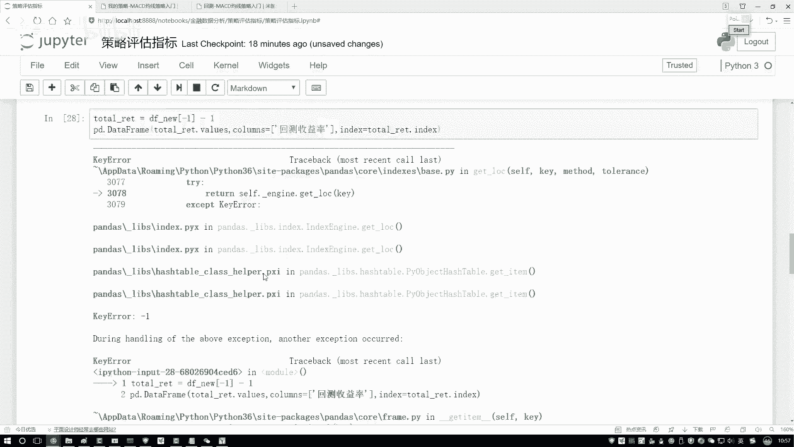

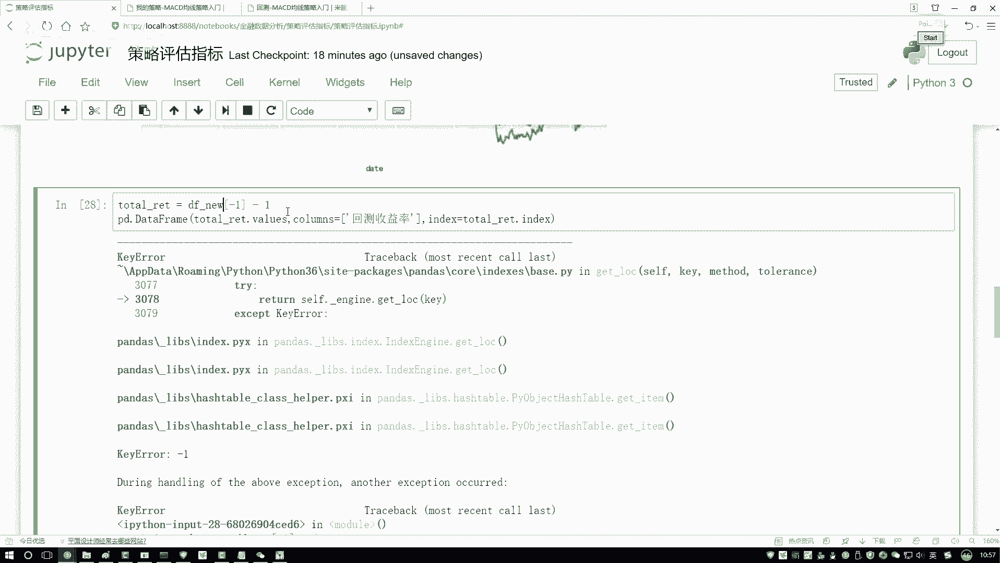

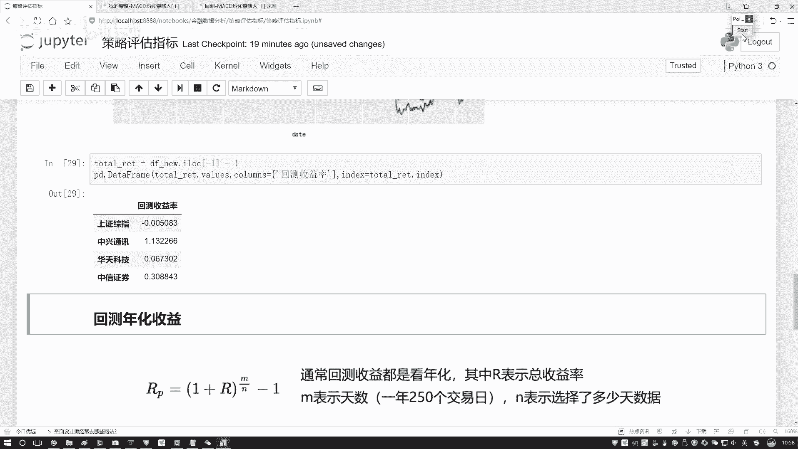

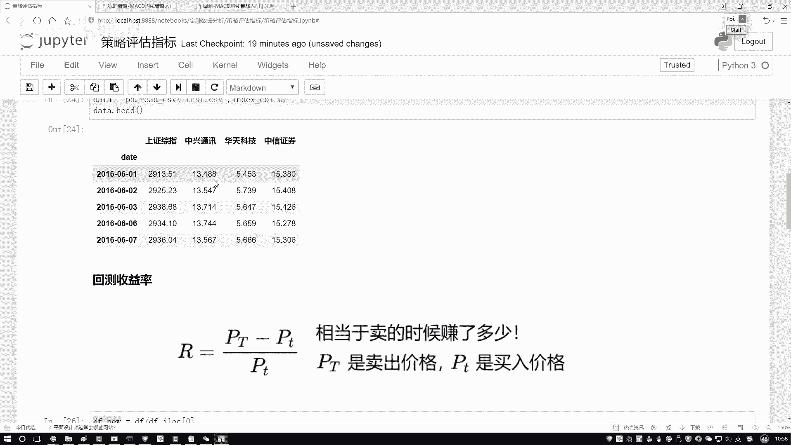