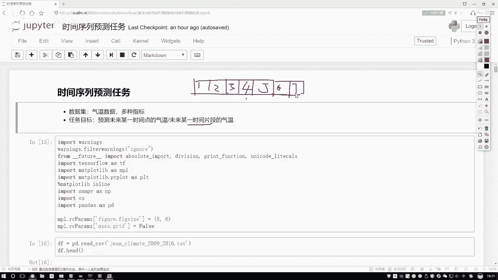
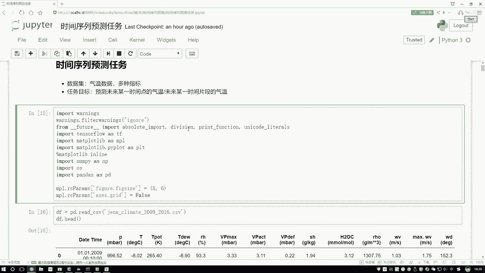
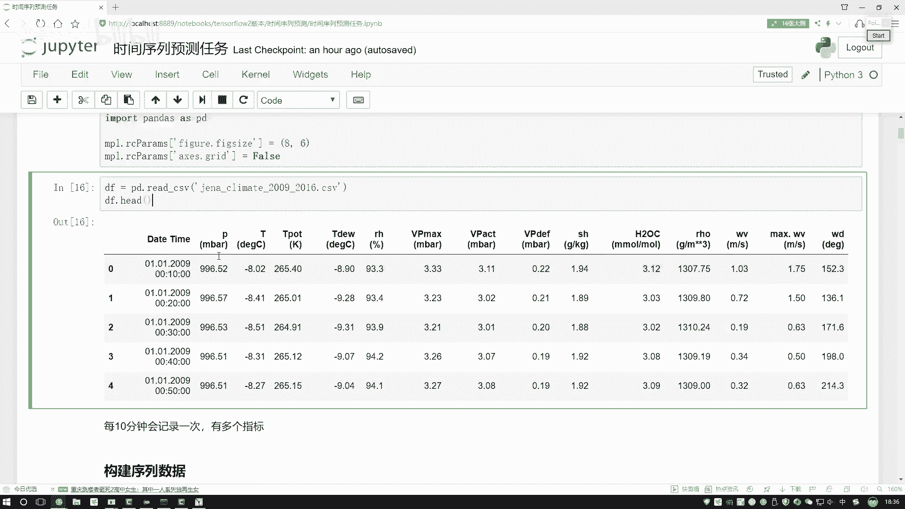
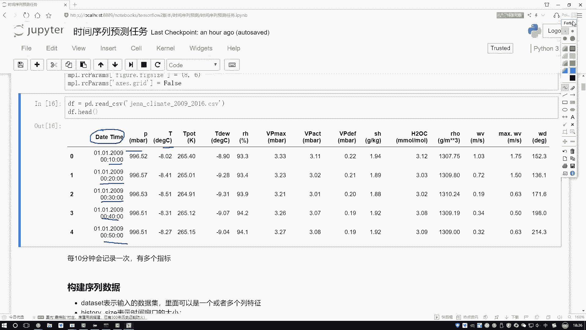
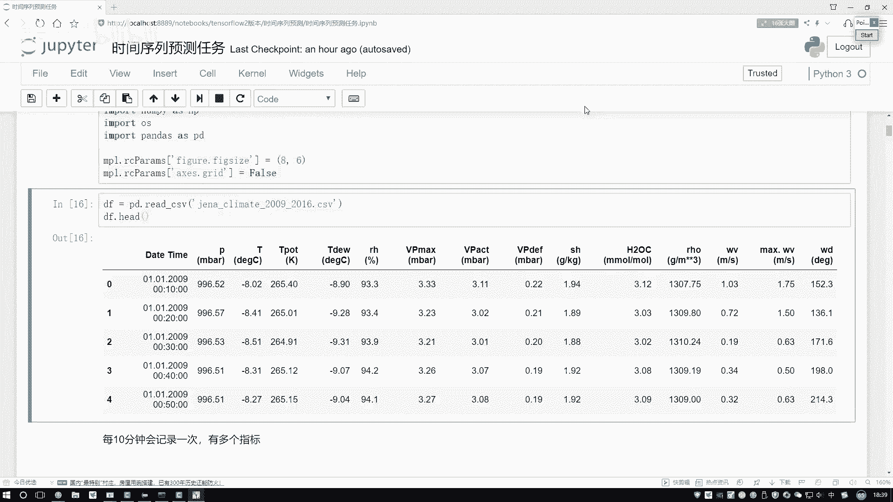
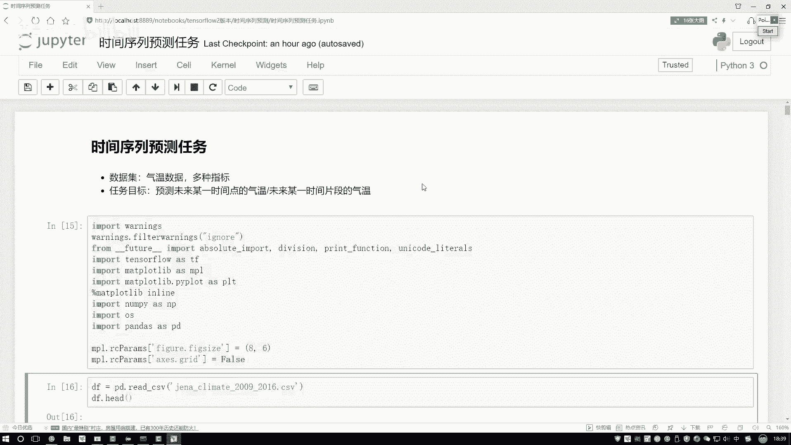

# 【2024版金融量化】AI结合金融如何做落地项目？迪哥手把手教你3天从入门到项目实战，学完即可做项目，少走99%的弯路，学量化交易看这套！人工智能／计算机视觉 - P39：第8章：基于深度学习的时间序列预测 - 迪哥谈AI - BV1NW421R7d7

这节课咱们的任务目标啊是基于tsflow进行一个时间序列任务的预测。谢谢大家解释一下吧。咱们的时间序列啊说的是一件什么事儿。这里啊就是咱们的数据啊，跟之前是不太一样了。

在以前任务当中好像是我们的输入哎对应一个输出一个输入再来一个输出再来输再来输出输入之间啊可能没有什么太大的关系，比如一些图像数据，还有呢传统一些数始数据，当然啊就是文本数据当中啊。

可能是跟时间数据啊比较相关的一句话我们也可以把它当做是一个时间序列。因为一句话当中啊，咱们有第一个词哎第一次出来之后再说第二次，第二次出来之后再说第三个词，有这样一个数据的关系啊。

我们把这个任务啊就叫做一个时间序列了。其实在这边当中啊，咱的时间序列啊还是比较常见的。比如说一些气温数据，气温啊随着时间的变化，然后得到各种各样指标。那我说我想接下来去预测在未来的某一段时间当中。

我们这个气温的一个走势，那这个就是时间序列，我们会基于啊历史的一个数据。当然这个历史数据啊并不是。😊，某一天的，而是一个序列。比如现在我有这个这呃一个月的吧，一个月当中有一号它的一个气温。

然后还有2号的气温，然后呢还有3号、4号一直到5号的气温吧。我说接下来我想预测第6号的一个气温数据，我大来策划这个是么要预测的。那这回啊大家可以想一想，那既然咱们这些时验序列任务。

前面的一个输入是不是都会对最终就有产生影响，一会对六产生影响，234562345也会吧。所以说啊咱一会儿要大家用的模型，肯定咱不是一个传统神经网络，也不一般情况下也不用卷移神经网络，应该有什么？

应该用一个R人网络吧。好了，一会儿啊咱们的核心价构，就是用R人来去构建一个时间序列预测的一个任务。然后接下来呢给大家说一下吧，就是哎咱们这个任务给大家举了一个例子。😊。

数据集啊给大家选的是一个气温的数据啊。像我刚说的，咱们真拿到一个气温数据。然后呢，在这个气温数据当中，我们有很多指标，比如说实际的气温点有多少，然后当天的一个压强，当天的各种各样指标降水啊降于哎。

好多指标咱都有啊，这些我们可以当做一些辅助特征。然后呢咱们任务啊就是去预测未来哎，比如说某一个时间点，或者说某一个时间片段，那时间点和片段有什么有什么区别啊，给大家再化一下时间点这样。

时间点就让咱们概化的，我就拿小化解吧，我说知道这个1233天数据，然后呢，我说去预测这个第四天的第四天是吧，它是个时间点吧，好了，预测出来第四天它结果值，那给我们感觉是预测一个值吧。

那我们能不能接下来去预测一个时间片段呢？或者说预测一下接下来的一个序列呢？比如这里这是第四天。😊，这是第五天。然后呢下面还有第六第七天。哎，我说我预测一下后面这几个值行不行啊，肯定也可以的方法比较多啊。

呃，咱这里给大家举一个比较直接的就是一个多输出的问题。比如这里我说输入是前三天的那输出，如果说你想要未来4天的那我说啊咱输出结果值，哎，咱就得到四个结果是就可以了。比如说咱们现在之前我说做第四天的。

那就是回归任务，那我做第4567呢，我们预测出来四个结果，再去做回归是不是也可以啊？这个就是咱们当前要做一件事儿，一会儿呢会分成两个阶段，第一阶段跟大家说一下，呃，一个时间点，比如说预测第四天。

咱们该怎么做。然后第二呢跟大家再说一下，比如说想预测一个片段吧，4567或者是更长的一个序列，咱们该怎么去做啊。然后第一步还是先把咱们工具包导进来，这个没有什么特别的，到时大家直接直下就行。😊。

然后呢看我们数据吧，这个数据啊，它是从这个2069年到2016年的一个天气数据，数据里边它的一就是数据样本量是挺多的。然后大家可以看一下它这个第一列第一列啊是数据的一个时间呃。

第一条数据啊是09年的1月1号，然后10点的。第二条数据呢，它是09年1月1号啊，不是不是不是10点啊，它是那个0点10分，第二个它是0点20，第三个是0点300点400点50。

所以说啊当前我们这个数据啊，它是按照一定时间间隔进行一个就是自动记录的，每个10分钟会记录一下当前的一些环境指标，比如说有加强啊，温度啊，还有后面哎各种各样指标降水风速哎等等的。

这些是咱们当前拿到的一个数据，哎，隔1分钟，9一条记录数据了。然后呢接下来咱们会得说一下，基于我们当前这个数据吧，咱们怎么样去构建这个R模型，其实方法还是比较简单的。直需我们看什么。

咱们来想现在我说要预测。

未来的一个值，那我的输入应该是什么呀？这回咱们想一想，我说我们的输入啊，咱们不可能是某一天的那是几天呢？三天还是5天还是10天啊，这个需要大家自己来选择。比如说我说现在设这个窗口吧。好了。

我说这个窗口它是10天的，这里有10天数据。我然后呢我说预测第11天的，可以吧。那接下来呢我说前十个窗口，我做完了预测第1天的好了，那这时我构造出来了一个X和一个Y吧，X是我当前哎一个序列吧。

或者说一个时验窗口，里边呢有10天的第一天第二天第三天，因为它是个序列，所以说咱们一会用I人这没问题吧。好了，Y值它是第11天具体的一个值，那一个值就是咱输入结果，这个X和Y啊看起来没问题。

那现在好像说我只构建了一个X和一个Y啊，那我们接下来训练的时候，我得有很多组数据吧。那接下来再怎么构建数据呢？😊，咱们来看啊，这里我说是前十天的。那好，那我说我下一个，我再画，我拿红色画吧。

我说我再取个片段可以吧？再取个片段。第一个片段是1到10天。第二片段我取2到11天行吧，我说当做X然后呢把第12天的，我说给它当做Y，是不是也可以啊，给我们的感觉啊，就是这个数据反给范儿了。

我可以不断怎么样，在数据当中啊去截取我的一个时间片段，在时间片段当中呢，比如下一个时间点，我当做标签，再截片段再当标签是不是可以啊？这个啊就是咱们的一个一会儿啊咱们基本做法，或者数据集当中啊。

我会选择出来很多个时间片段当做咱们的训练数据行了，先给大家解释了一下，就是哎咱们当前时间区列预测任务。我们要做的几件事儿。😊。

