# 【2024版金融量化】AI结合金融如何做落地项目？迪哥手把手教你3天从入门到项目实战，学完即可做项目，少走99%的弯路，学量化交易看这套！人工智能／计算机视觉 - P40：2-构建时间序列数据 - 迪哥谈AI - BV1NW421R7d7

接下来啊来看一下咱们实际啊数据处理的一个流程。第一步啊，咱们还是先把我们的CSV数据啊给读进来啊，刚才看过了，咱们实际有的数据指标。然后这里呢哎我们看一下第一个函数，第一个函数当中啊，它就是我刚说的。

我们首先得先把数据构建成一种序列的格式X和Y起码底配对的，并且X是序列Y是未来的一个时间上呃它的一个结果值，哎，咱们做这样一件事啊，然后先给大家啊解释一下呃一会儿啊咱们会用到的几个输入的参数。

这几个参数我先给大家解释解释第一个叫d就是一会儿啊咱不是有这么多个特征嘛。那你说哎咱们这个你要构建实验方口当中啊，用哪些个特征，表示着实际输入的特征。呃，一会儿咱们会给大家对比实验啊。

就是我只用一个特征或者用多个特征，哎，咱可以多做一遍d就是我们实际的一个数据集。😊。

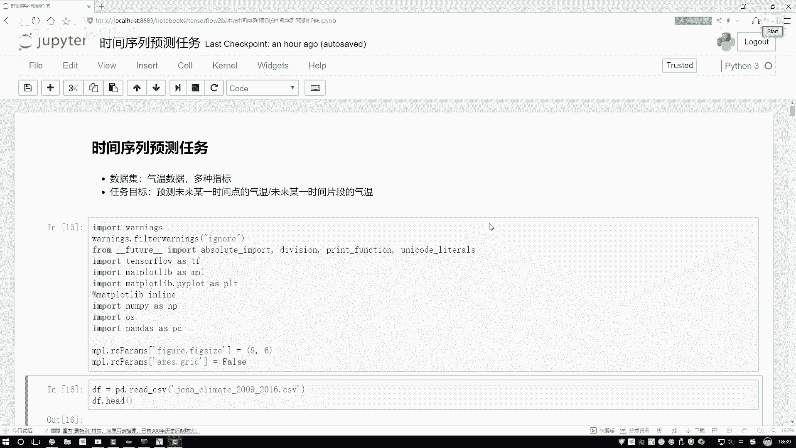

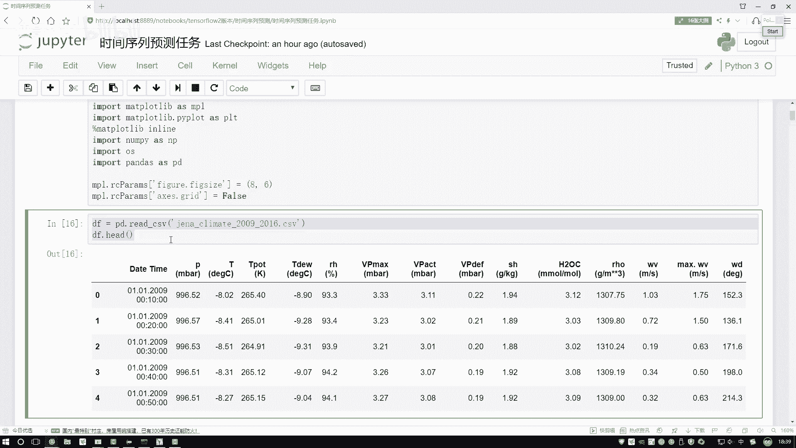

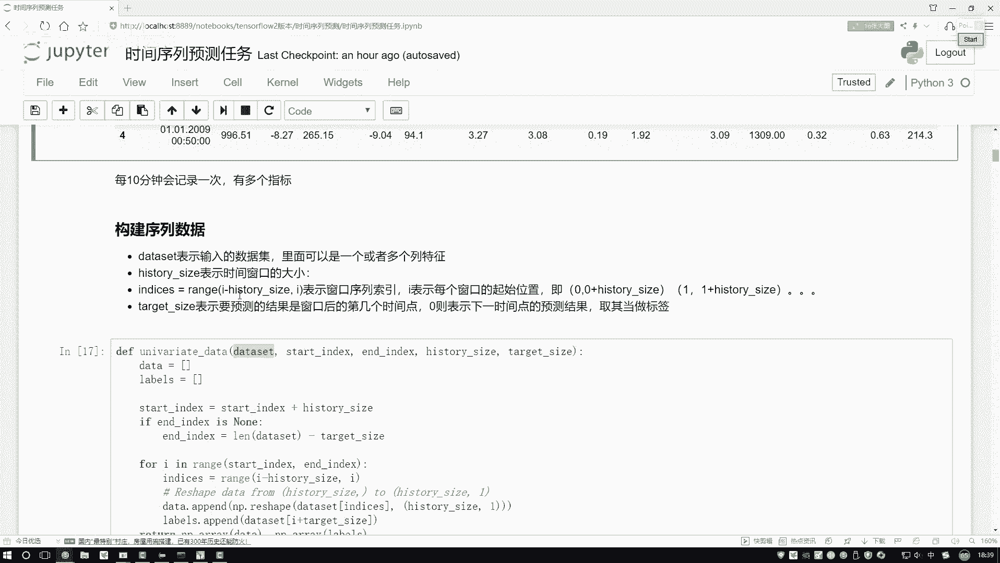

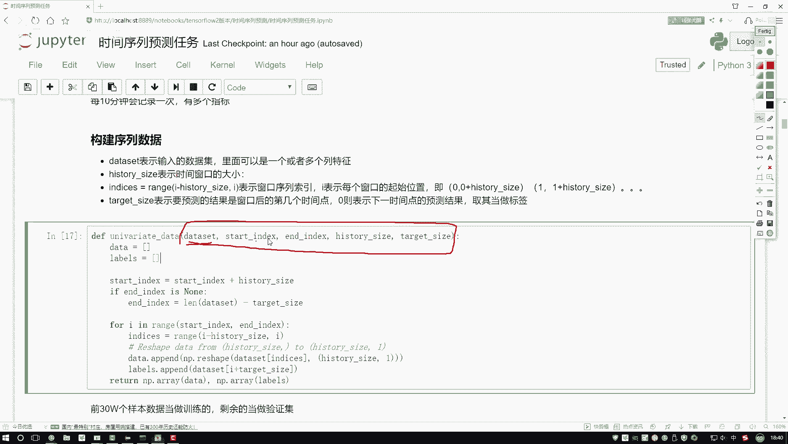

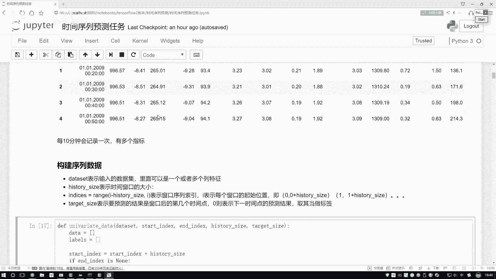

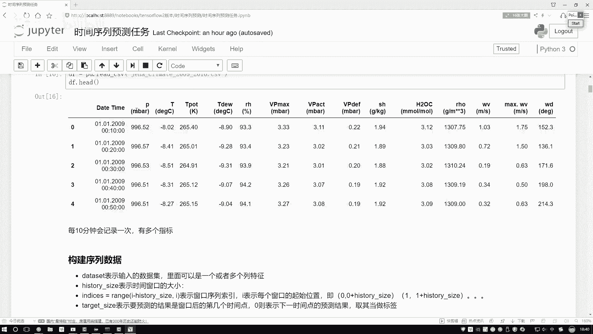

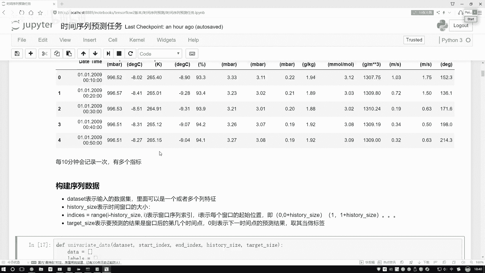

然后呢，索引索引这样就是咱这个数据集啊，它其中比如说呃是这么大的，然后里边可能有这么10万个数据吧。然后呢你需要去选啊，当前从哪个开始那一般索引你说为几啊，一般就为零是吧？它为零的意思，比如说在零这块。

我说一开始从这去去去那个取序列哎这个意思然后呢这个history size它的意思表示着是咱窗口的一个大小。比如说我说这里我设这个20这20意思它就会从你ar索引开始，哎，找这么20个。好了。

它们几个先当做什么？他们几个先当做我的一个X一，然后下一个值，这就对应一个Y1，这个是一个窗口大小。然后呢，接下来设置一个呃index索引。这个ind索引啊，它实际表示就是窗口的一个序列了啊。

因为就是呃我们要取这样一个窗口数据，你需要把这个窗口当中啊，每一个样本，它的索引都告诉我吧，这是1234点点，然后到9，比如说取取这么哎到十0吧，比如说取10个，你是把它的索引都告诉我啊。

这个index啊，它的意思就是说呃你在这个序列当中啊取了哪些个索引。哎，咱得把这个所有索引全部拿到手。然后呢。

再下一个呃再下一个就是我们的一个呃target他意思就是咱那个标签标签意思啊就是说呃现在比如说你取了10个样本构建一个序列，那你想预测的哎是第几个呀，是比如说第11个呢，还是第12个呢。

还是接下来的11到15这样一个片段呢？如果说它为一个值，那表示着哎咱就取下一个时间点就得了。如果说它为一个序列，那咱就预测接下来一系列的一个序列指标这就行了。这个就是咱们的一个标签了。

也是我们要预测的一个结果。行，先给大家解释了一下，就是呃咱们这个函数当中啊会涉及到的几个参数。然后呢，咱来看一下这个函数啊构建的方法。😊。

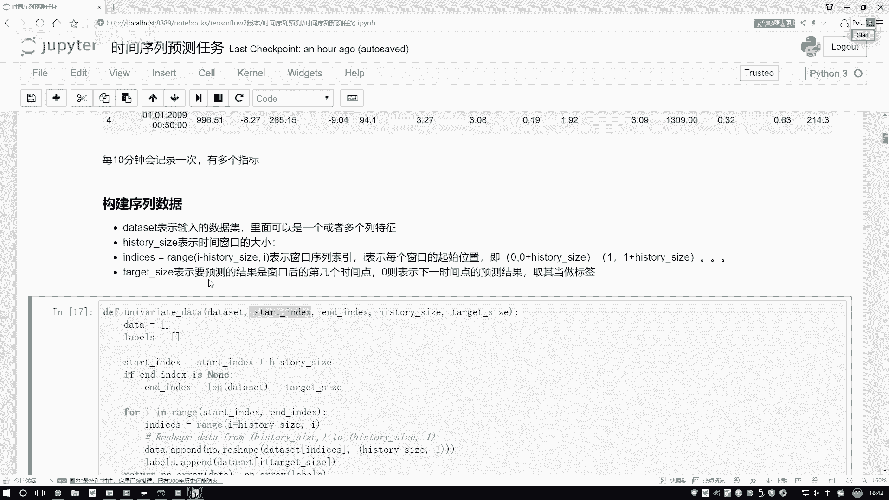

一开始的时候我说指定一个star索引索引这样就是它这里啊一会儿我们会做这样一件事。我们实际啊指定的索引，它是从从什么？它是从一个I开始，I呢是索引，它的意思啊就是说比如说你的一个索引吧。

咱们来看一下面一下下面我设置了一下这个参数，咱可以来看一下，在这里比如说我说呃设置一个ar索引是0，咱来看，比如这里当前的一个结果值，这是一个0。然后呢比如说我设置一个序列大小，它是20。

那这一块它就是一个零加20是吧？所以说这一块会进行一个更新啊，索引是从C开始的，是从20开始的，它的意思啊，因为我们下面构建一个rangerange的意思就是你这个I它是从sar索引的开始的。

我为了使的最后一个变成这个20。所以说在这里咱注意啊，这个引带索引它的写法稍微有点不同啊，它是一个I值减去你的缓存序列，相当于啊是从这开。😊。

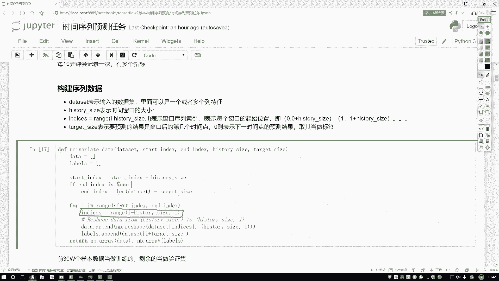

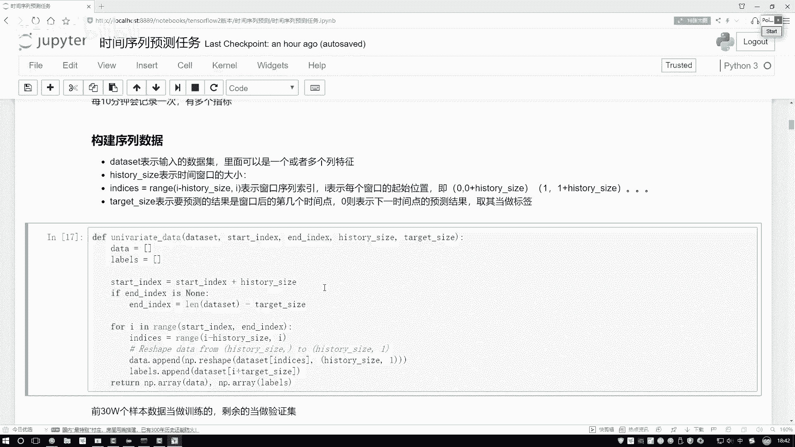

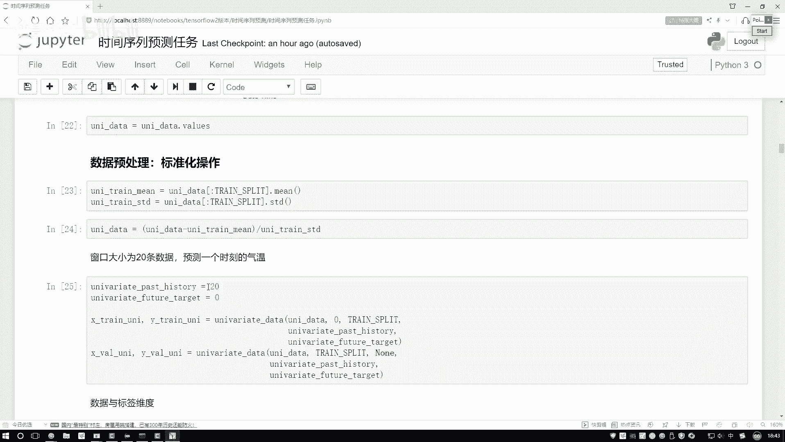

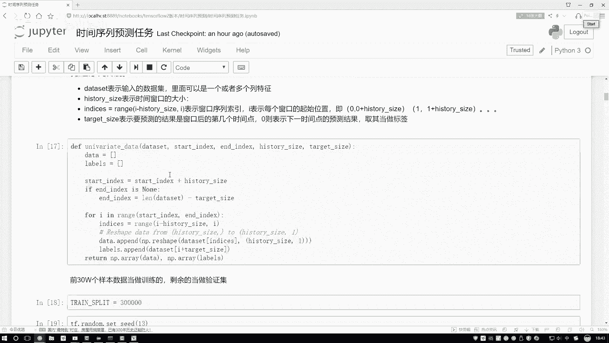

开始的比如说啊这个sar索引哎它是等于1个20的。然后呢，我说我这个缓存序列，或者说我时间序列，它也是20的，它这块是不是一个II相当于从sar索引开始吧。那是不是1个20减20就又相当于从零开始了呀。

所以说到时候大家如果说你看这个代码觉得挺奇怪的，它这块其实主要就做一件事，为了使得咱这个range设置的更方便一些，所以啊咱们看这块多了一个减法的操作。实际上如果是大家自己在执行过程当中也可以打印结果。

这里是我打印出来的。这个转始操作过程当中啊，第一步第一步就是一开始的时候，它是一个0到0加上一个缓存序列，那就是从0到20是吧？好了，第二个是多少？从一到21页。那下一个呢就从2到22呗。

这个就是咱当前实际执行过程当中啊，我拿到的一个索引的一个结果。好了，你拿到索引之后，这里还做一件事，拿到索引，那你说我取索引，它只是像是一个一串的数吧，但是我需要的不是一串数，而是一个数据是吧？

所以说这里啊给它做一个reshop操作，把它转换成哎一一列实际上可以说啊就是转成一列，实际当中呢可以输入的一个数据吧啊，一个二维的数据。然后接下来的一个标签。标签制作方法也是一样的。在这标当中啊。

你看这个迭赛当中，这个II什么？I就是说你从哪开始的吧。好了，I加上什么呀？I加上当前的一个我们的一个就是预要预测的一个位置。一会儿呢这些参数啊都需要我们自己来指定。

你希望去预测未来就是间隔几个时间片段得到结果你可以间隔5个，也可以间隔10个也可以去取一个序列。这个就是我们现在啊怎么样去构建一个X，还有一个Y的这个写法稍微绕了一点，大家就知道这点行了。

就index它是从0开始，然后0到这个20，然后1到212到22，也就做了这样一件事，非常简单，我们就可以完成取X还有取Y的一个数据的。😊。

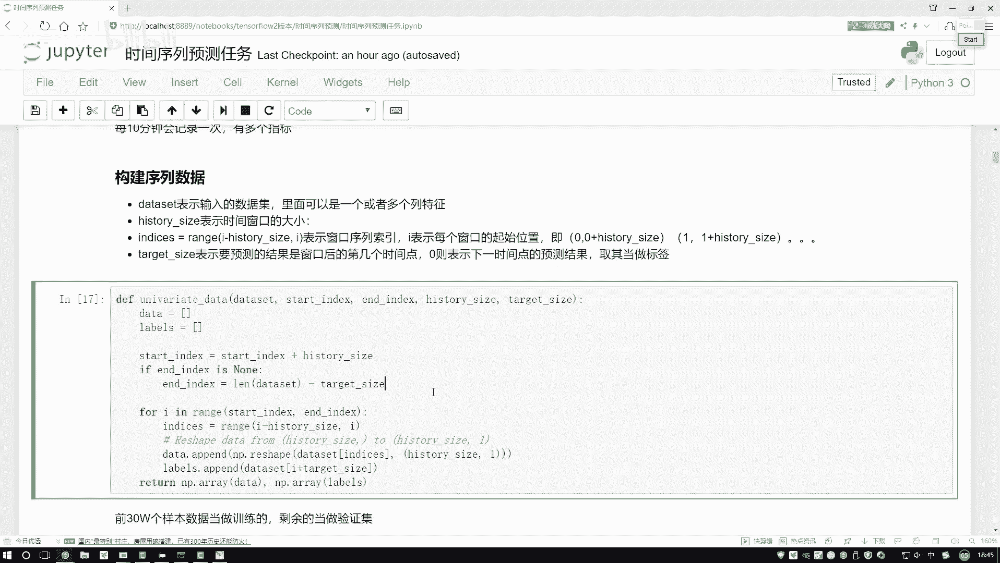

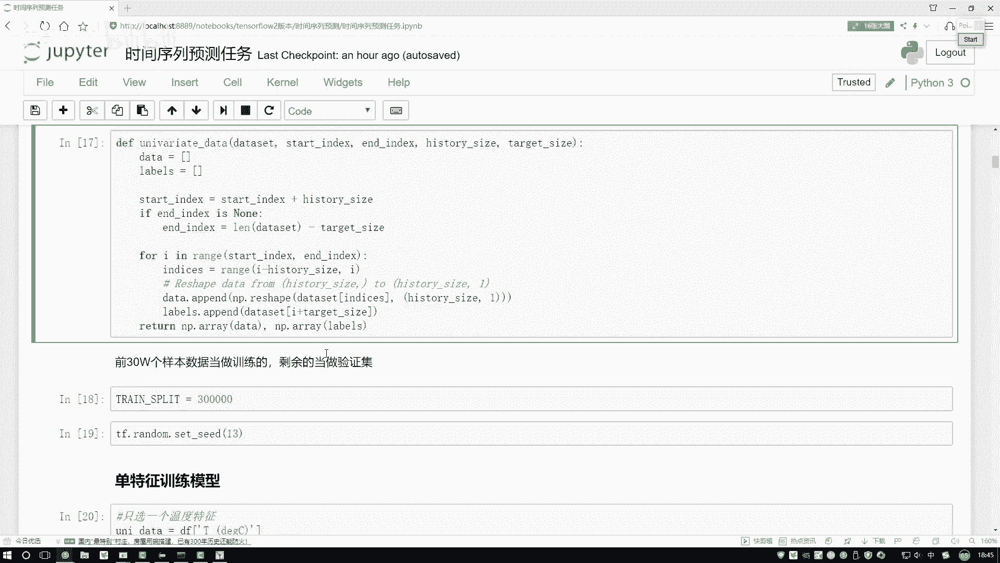

下一个下一个就是呃咱们这里就是做了一个训练集，还有一个验证集。训练集当中啊，这块由于咱们数据量比较多啊，训练集咱取这么前30万个样本的数据，然后呢测试集呃，不是验证集，我们就取剩下所有样本数据就可以了。

指定好一个随机种子，一会儿呢咱会取数据。

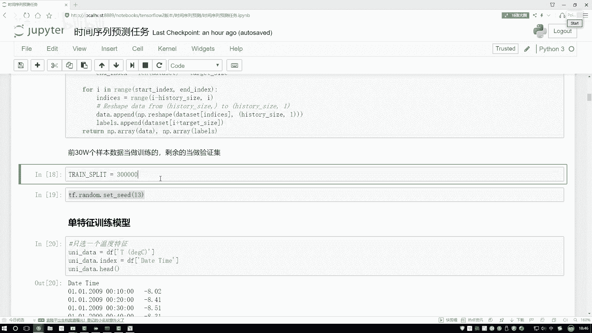

我们的第一个做法就是先选择其中的某一个指标来进行预测。哎，咱这第一个指标选的比较直接啊，只选一个温度指标。你看这里在这个电影当中啊，我只选择了一个温度，基于温度要去预测一下。

接下来啊咱们的一个呃十就是接下来它的一个温度的结果值等于多少，咱先选择一个特征来去做这样一件事儿。那下面呢我说我画个图吧，展示一下我当年的特征，展示当前特征啊主要大让大家看一下。

就是呃实际这个指标到底跟时间有没有关系。大家可以发一件事啊，就是随着时间变化，这些指标浮动的差异是微比较明显的。所以说啊这是很明显的一个实验序列问题，一会儿呢咱们就要预测啊，比如说给了一个序列。

这是给一个序列，你预测下一个序列结果值，那下预测一个序列呢，预测序列，拿蓝色画吧，就是再预测接下来的一个走势，哎，这是我们要做的一件事儿。

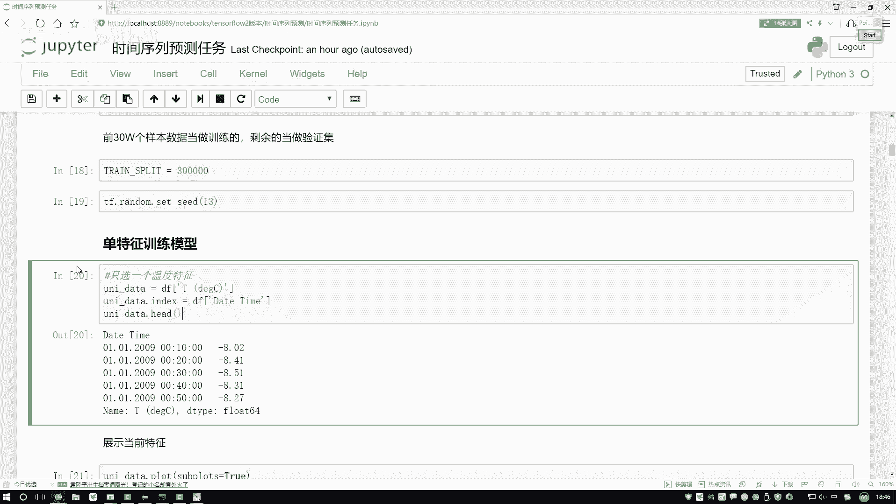

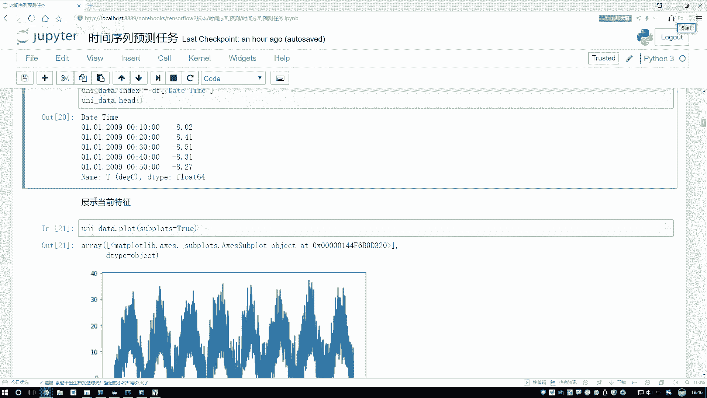

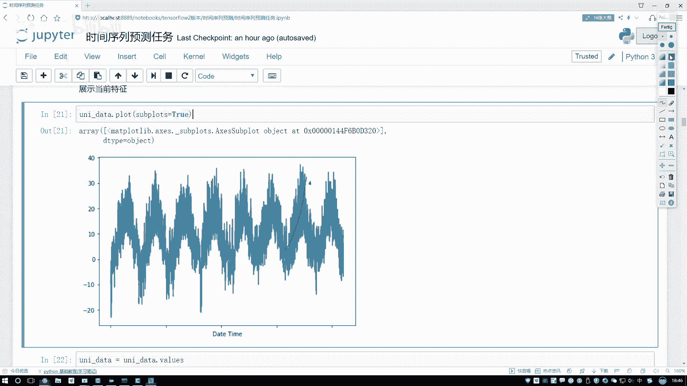

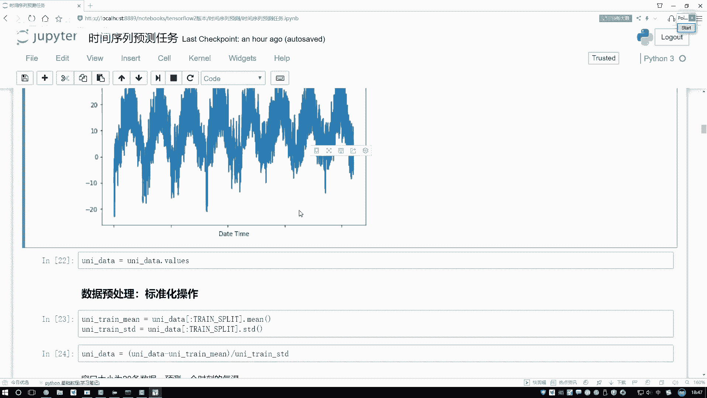