# 【2024版金融量化】AI结合金融如何做落地项目？迪哥手把手教你3天从入门到项目实战，学完即可做项目，少走99%的弯路，学量化交易看这套！人工智能／计算机视觉 - P42：4-多特征预测结果 - 迪哥谈AI - BV1NW421R7d7

接下来啊咱们要做一些对比实验啊，之前咱们只是用一个特征来完成当前的一个预测任务。下面呢咱们来看一下，就是用多的点特征的时候啊，效果会比之前更强一些。这里呢我们不光选择了跟气温相关特征。

还把一些跟压强相关的也加进去了。现在这个对数用当中啊，我们有3个不同的指标了啊，就是一会儿咱们特征啊是有三个的。那下面呢我同样把这个图可画出来了三个特征分别的一个走势，可以观察一下。

就是它是否跟实验序列是相关的，基本的一个走势，大家可以看到，也是跟实间相关的吧。一会儿呢咱们把这三个当做我建模的一个输入。然后下面就是基本的处理方法跟之前还是一样的，还是啊我们对数据先做一个标准化操作。

做标准化的时候，大家记住啊，就是呃只能用咱序验级信息啊验证和测试信息啊，咱通通的不能加进去啊。就是这块我指定了哎咱只用的是序验级那前30万个数据。那接下来呢咱们写个函数，这个函数它有这样两个功能吧。

呃一个功能是我可以预测。

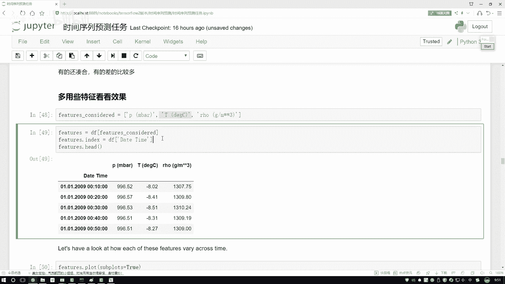

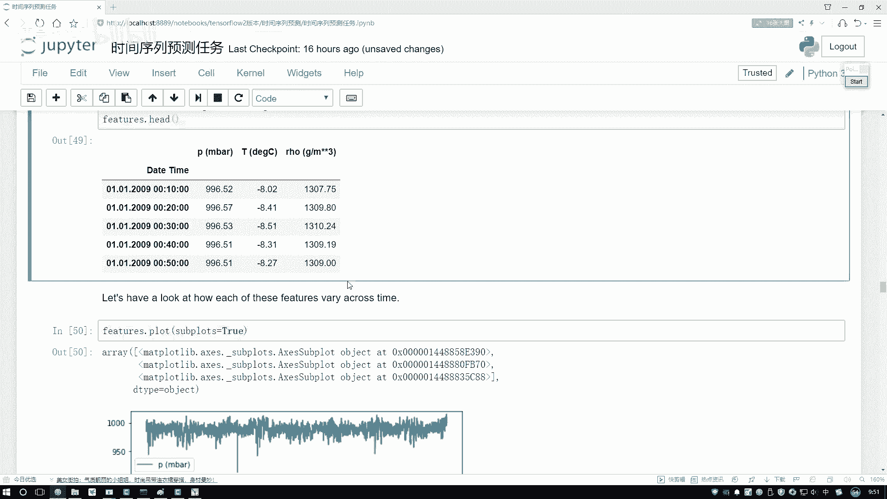

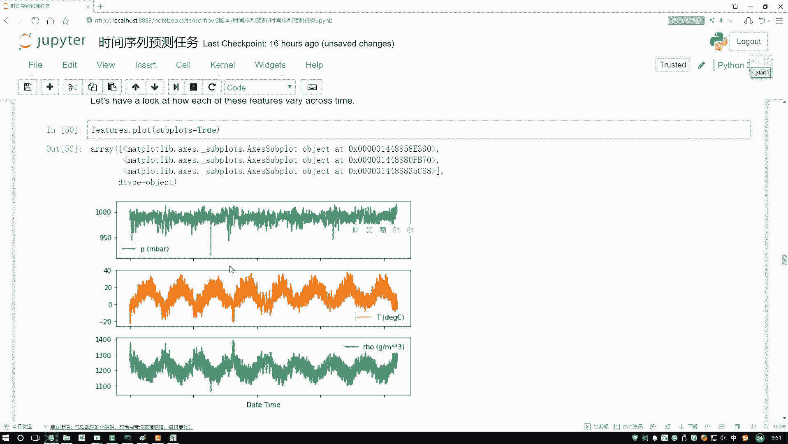

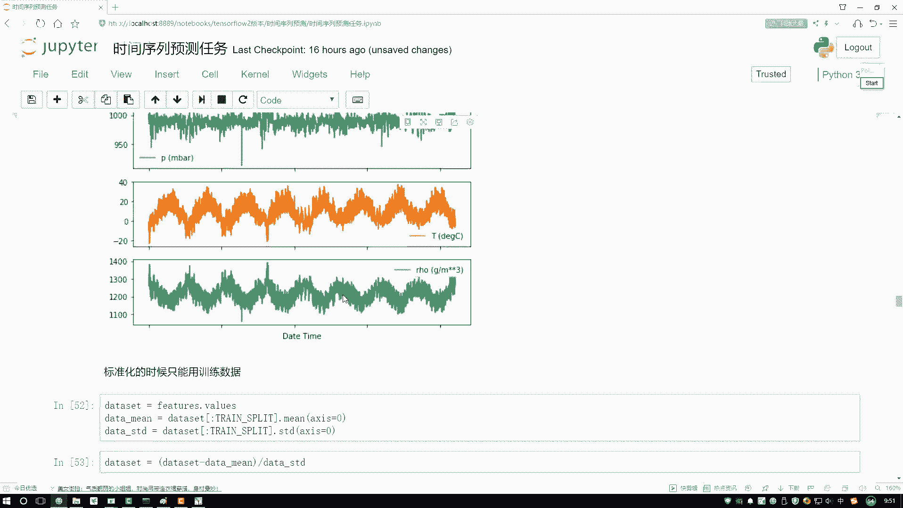

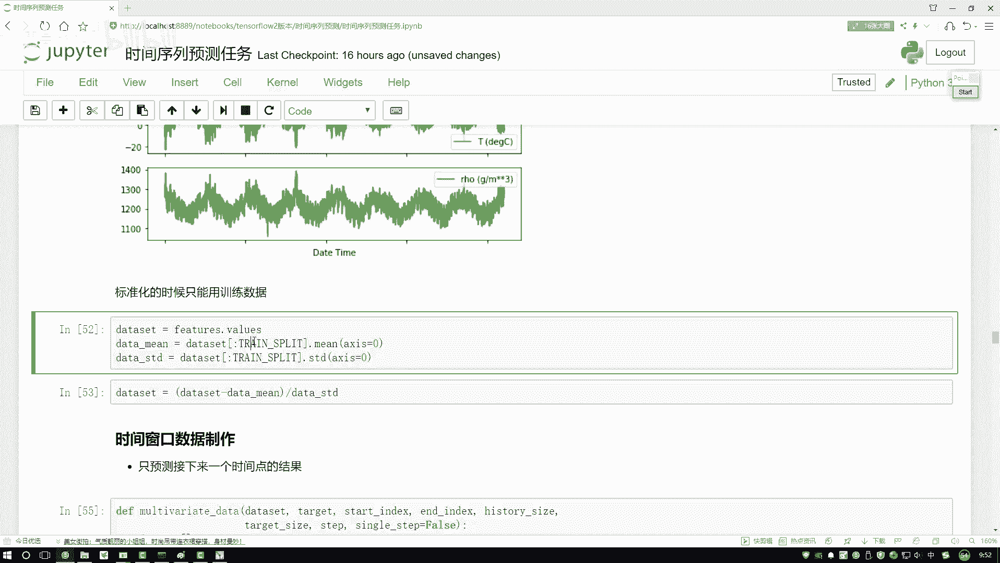

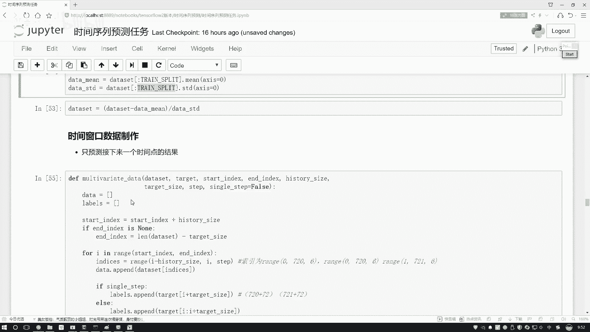

未来某一个时间点。比如说我拿前面这个窗口去预测。然后未来比如说第六天吧，它的一个结果，未来的一个时间点咱们能预测，并且呢我也可以去预测未来的一个序列。其实无论是点还是序列，方法都是差不多的。

只是你预测结果是一个还是个多个，再来看一下吧。这期中啊，一会儿我会选择的一些参数。

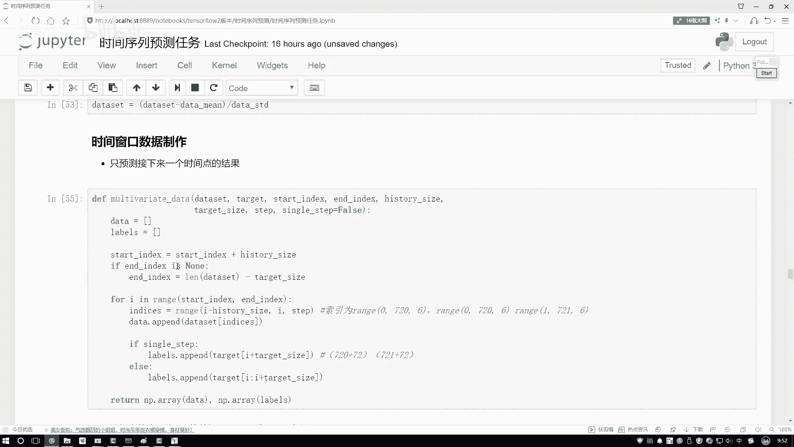

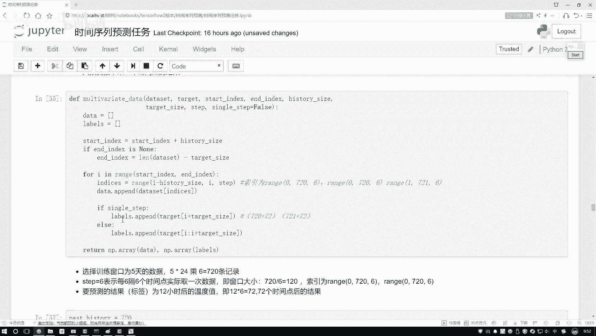

这里呢啊在这里我可以给大家写出来啊，这是咱选的几个参数。第一个参数啊，我说咱当前啊一个窗口大小是720720这个意思，就是我们有个任务要求。哎，他说用这个以5天啊为时间窗口做咱们的一个训练的半月数据。

那5天一共会有多少数据啊，咱可以算一下，那又应该是一个5，那每天24小时5乘上1个24是吧？然后呢接下来那你说每个小时我是每隔10分钟记录一个样本，那这块应该再乘上一个6吧。

所以这里啊它就是等于一个720了。那给我们的感觉啊，就是如果说拿5天为一个窗口做成720个数据，一次啊训练输720个数据，看的数有点多呀，咱可不可以稍微简化一点啊，我可以来看一下上面的一个走势啊。😊。

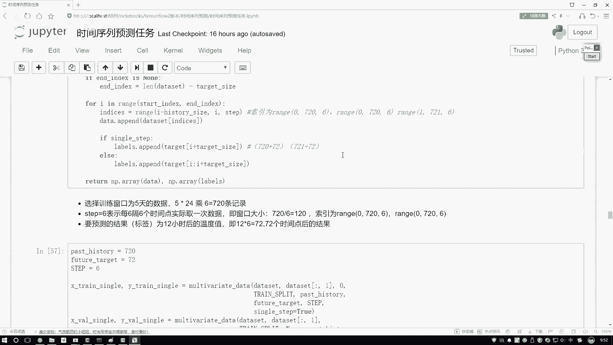

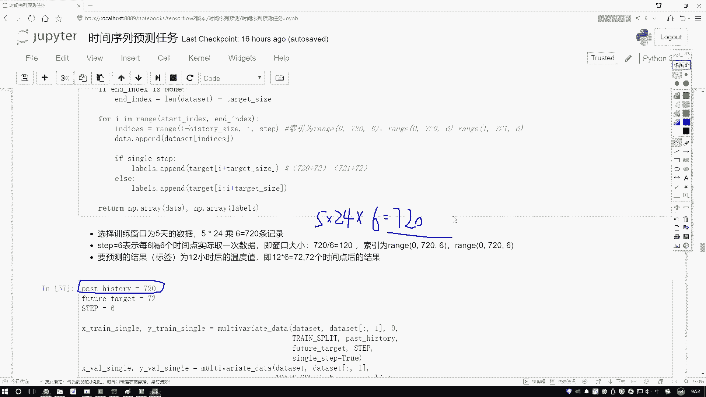

你说上周的走势啊，可能你说呃它是每10分钟记录一次，那你说第10分钟的和第20分钟的，或者说和第30分钟吧，他们之间怎么样会非常的接近吧。所以说啊在这里我说每隔10分钟啊，看着取的有点太近了。

我能不能做一些间隔呢？是不是也可以啊，大家可以看一下，就这里咱们这个range函数啊，多了一个参数之前呢只是从谁到谁是吧？现在呢加个range，现现在这里加了step值step值，这里我也写出来了。

就是咱窗口实际你在训练的时候，它里边的一个参数的一个值，你看0720，那就是从第零条数据到720条数据，然后后面有个6就是每隔6条数据实际的去取一次，那这一个样本取完之后啊，它就不是720了。

而是多少720比6相当于只有120个数据。他的意思啊就是说嗯咱不按照原始数据啊，每10分钟一取了。我说按照我自己想法，每一小时取一个数据当做我们训练的一个。😊。

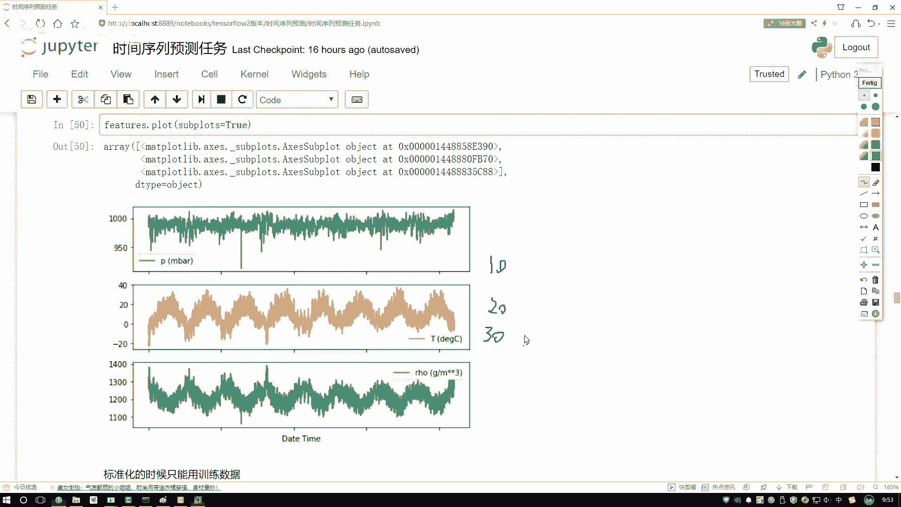

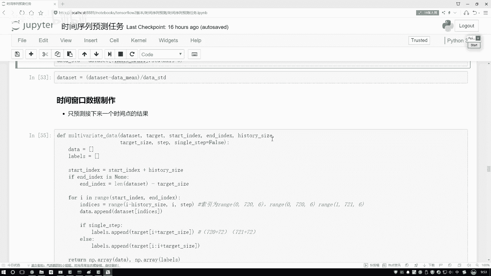

时间不长，哎，这个意思。那下面呢也是哎这样1个120，这个就是咱的一个缩引是怎么指定的这块应该是第二个应该是一。然后第二个下第三个应该就是一个二了。这个给大家说了一下，就是跟之前咱说有点不同啊。

我们举个时间窗口是按照每一个小时为单位的。

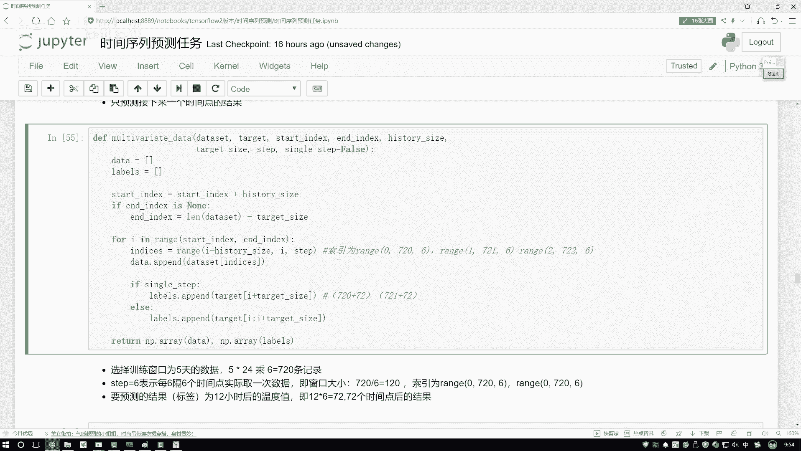

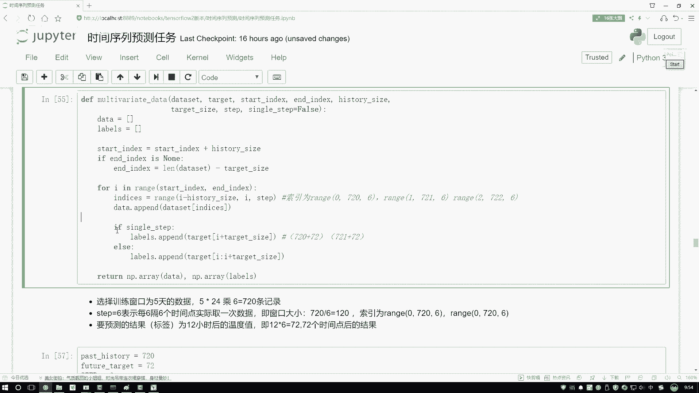

然后这里呢对我们的一个标签啊做了一个判断。呃，这里就是有一个s step意s step就是说呃你要预测的结果是未来的某一个时间点吗？若为处值相当于啊要预测的是一个时间点，再来看一个时间点是吗？

那这里边传进来的，是实际的一个索引吧，一个索引对应着一个值，比如说第一个所以那就是你看他说未来哪一天啊，它是未来12小时之后的一个数据，所以说啊就是你这里要加到多少，那就是根据你这个任务来取吧。

看看你就是想预测未来多少时间点之后的，咱就把未来多少时间点之后加过来，你看72，这为什么加了72啊，加72的意思啊，就是说呃咱未预测未来12小时嘛，那12小时一共间隔了12乘以6等于72时间点吧。

所以说我要预测的是不是下一个时间点了，而是后12小时之后的一个数据，这个就是咱们的一个标签做了这样一个判。段那如果说呢我要预测个序列，那就是al当中的。再来看好这al当中，它传进来的是几个值啊。

这所以里边首先第一个它不是一个缩引值，而是什么？而是一个区间吧，这个冒号啊，全来一个区间意思什么？比如说我想预测一下呃，未来啊不是12小时之后了，而是这12小时区间每一个时间点它的一个温度是多少。

说白了上边你要预测一个值，这里要预测多少个值啊，未来12小时，那就是有72个值了吧。所以说啊这个label是不同的。第一个lin single step当中label是为一个值里边我要预测一个序列。

如果预测一个序列的话，它里边是72个值啊，这是咱标签跟之前有些不同。然后这个也是给大家解释完了，来看一下我们构建这个数据集，关数计方法跟之前啊都是一模一样的。只是说这回咱们传建的参数有点不同了。

第一个时间窗口我是选了是5天的，一共720个。然后呢预测未来的，我选1个72，你可以预测未来一个区间呢或者是预测未来一个就是未来一个序列的。

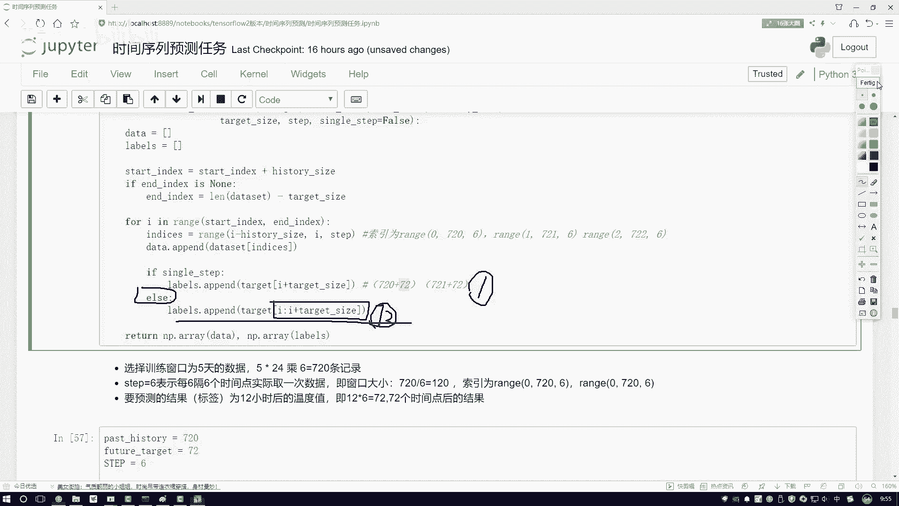

这个都行啊，这里咱把这两个值啊全部给指定出来了。好了，第一次第一次咱这样啊，咱是分两个实验。第一次的时候，我说我这个CO step给指定成数值，相当于是我只预测未来12小时之后的一个时间点。

咱先预测一个时间点啊。那看一下吧，就是做完了这个数做完了这个数据集之后，咱的一个数据的维度。训练数据维度这是120乘3120表示是我间窗口一共呢是有120个序列的。

然后这个三啊就是说每一个序列每一个时间点上它有三个特征，咱之前不说了嘛，我现在拿到数据当中啊是有三个特征的。这个就是我们当前训练数据的维度。然后下面呢就是我的一个标签的维度，标维当中啊。

这里它的逗号默认没写，就相当于只有一个值吧。那好了，接下来构建咱们的训练数据实际的做成一个方法跟之前啊都是一模一样的，这个就不给大家重复去看了，跟之前咱这个方法都是一样的。然后下面下面这个指列方法也是。

😊。

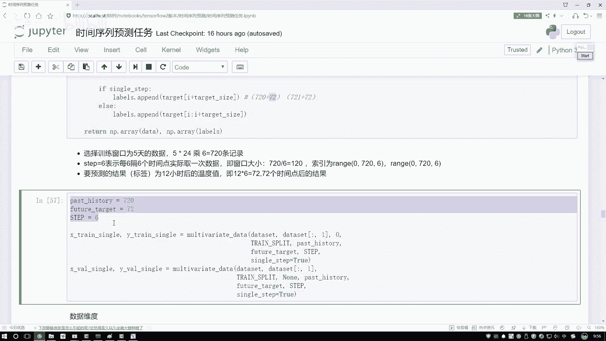

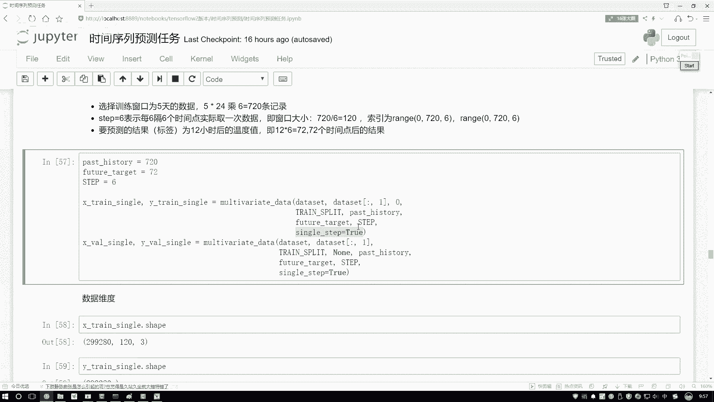

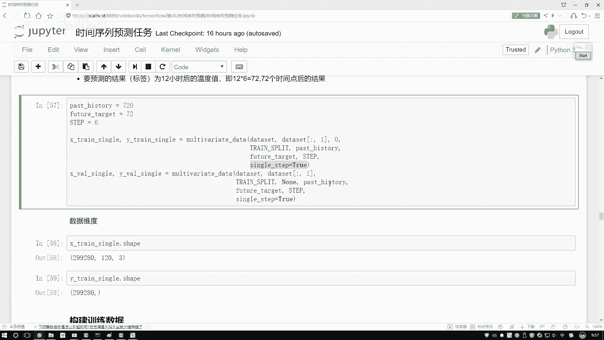

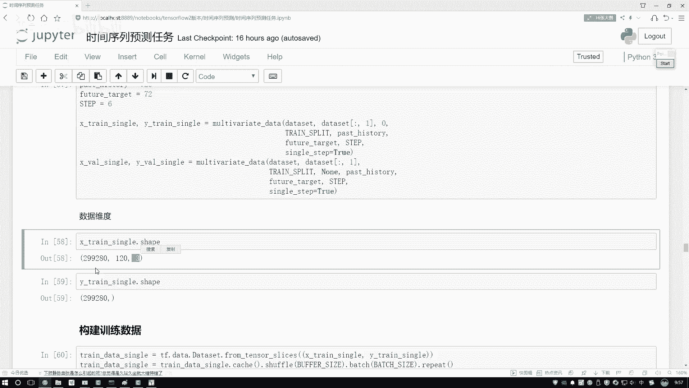

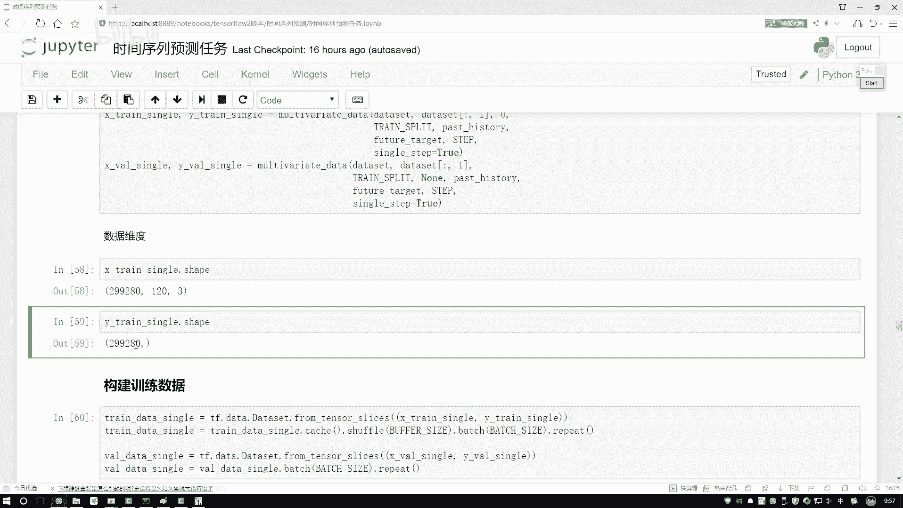

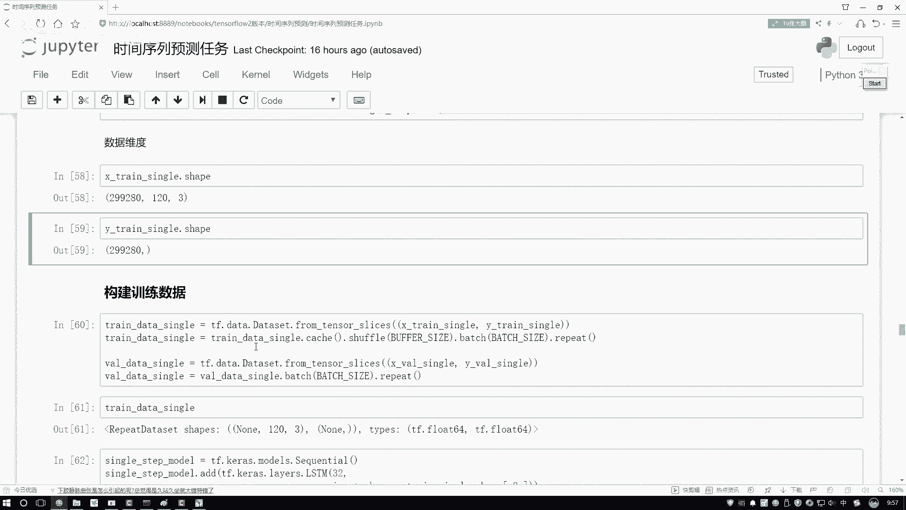

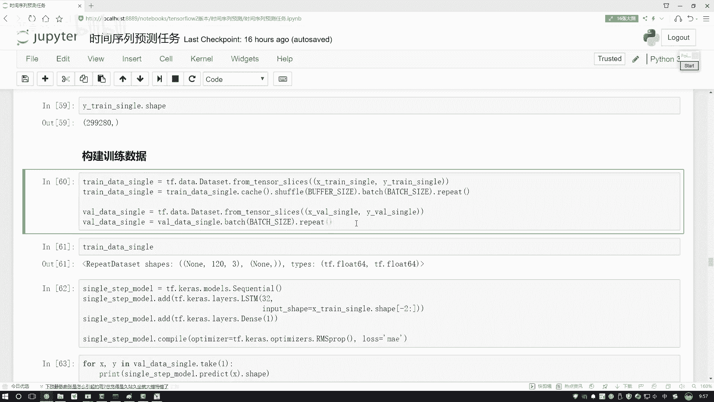

之前一样的，只不过说我把这个隐层时间员啊稍微的设置了多一点。因为咱现在输入数据更大了一些是吧？好了，隐层，因为咱们现在输入特征多了一点嘛，把这个。😊，啊，那什么影测人员稍微设置大一点。

最终呢还是得到一个预测结果值。那下面做这个训练。训练完之后啊，咱可以看一下这个结果，训练操作跟之前一样的，咱就不看了。来看结果吧。结果当中啊，这一块啊打印了一下当前训练损失下降的一个情况。

然后下面呢打印一了画了一下实际的一个预测结果。这绿测的是我们预测的这个差的是实际它的一个结果值呃，看起来好像是还有一点差异是吧？但是可能啊比之前效果好一些了。这两天跟大家说了一下，就是我们有多个特征。

并且呢预测的话，我可以任意去选啊未来的某一个时间点，并不一定是紧接着这个时间点，你可以在标识当中啊自己去设计，哎，我要预测哪个时间点，这些啊咱都能是去做到。哎。

这个是咱预测了未来间隔的一个点的一个结果值。😊。

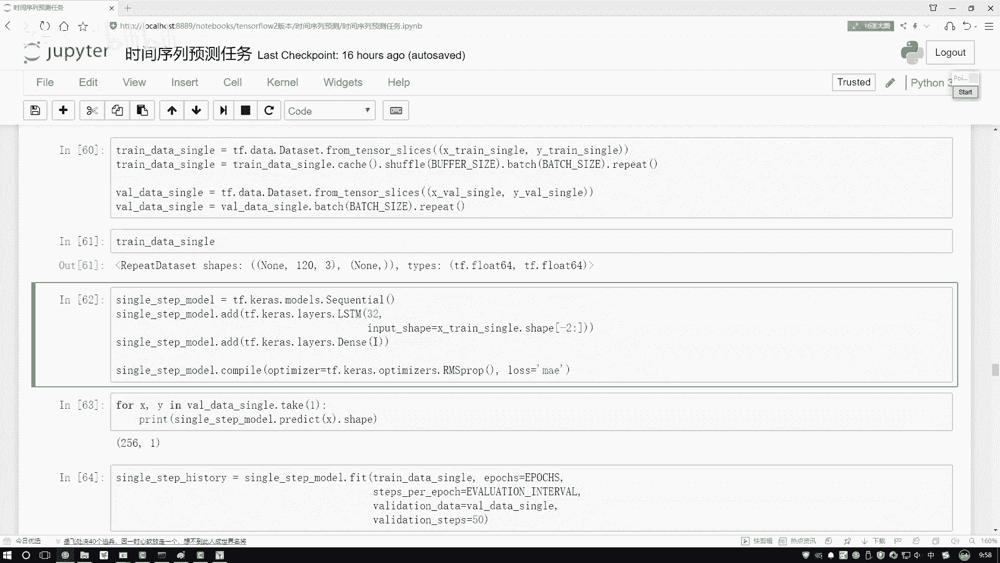

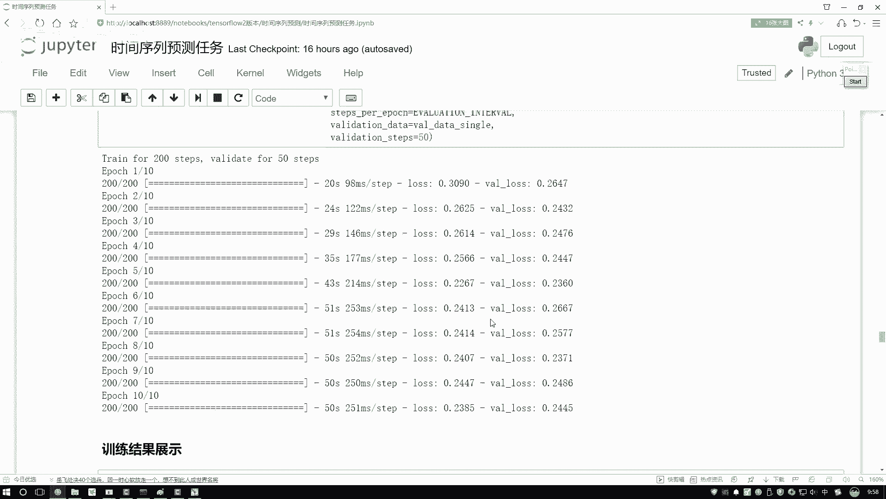

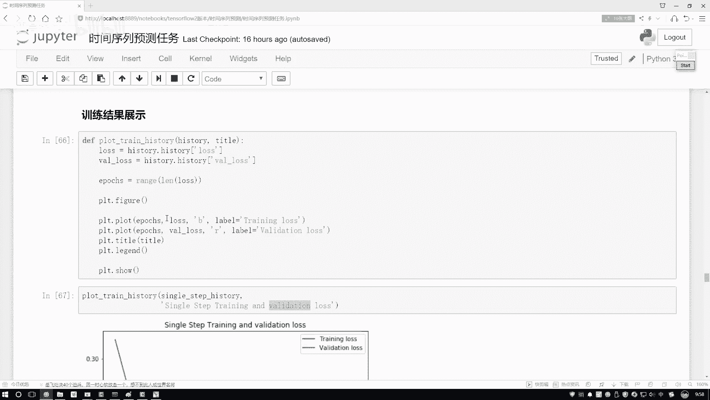

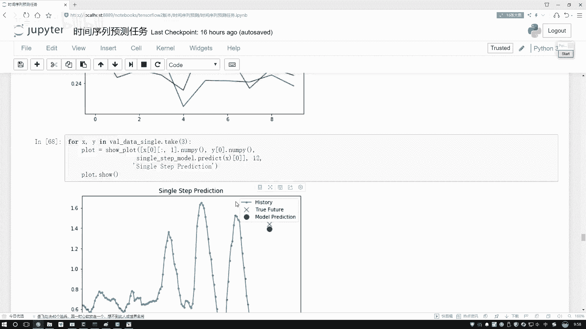

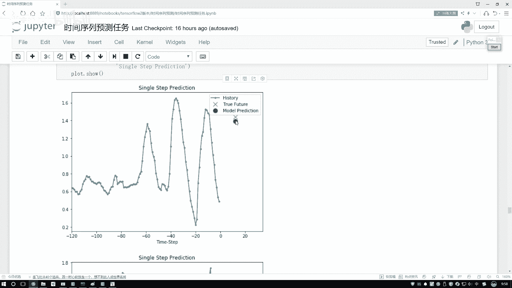

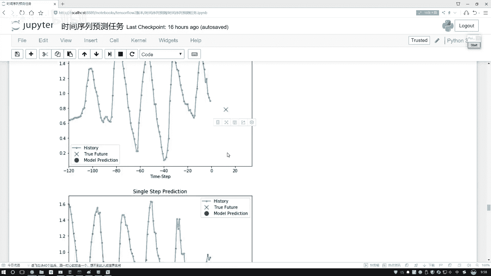

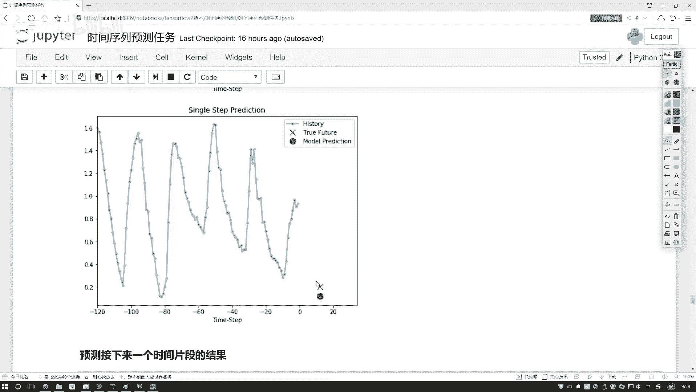

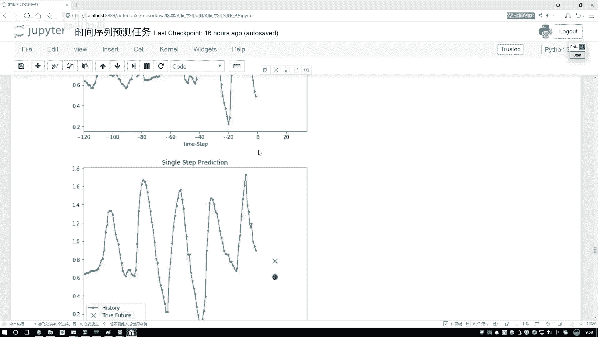

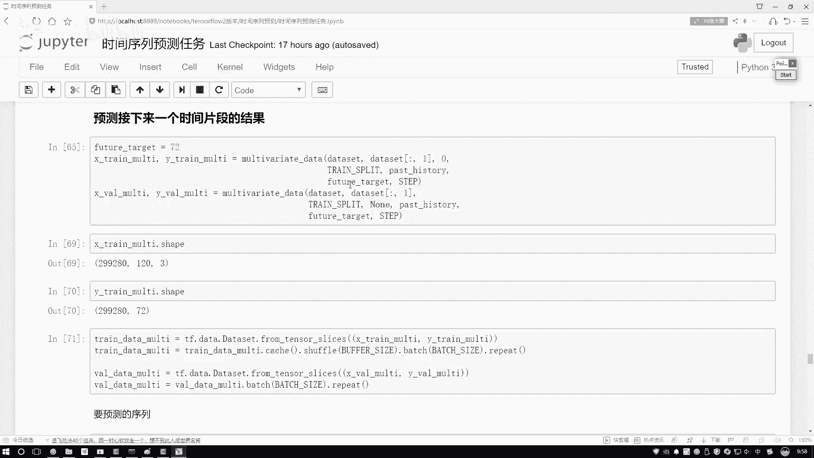