# 【2024版金融量化】AI结合金融如何做落地项目？迪哥手把手教你3天从入门到项目实战，学完即可做项目，少走99%的弯路，学量化交易看这套！人工智能／计算机视觉 - P43：5-序列结果预测 - 迪哥谈AI - BV1NW421R7d7

接下来啊咱们再来看一下啊，这回我就不预测一个时间点了。我说未来啊一个序列的一个结果，预测出来多个结果，这个咱们怎么去做。其实方法也是呃很简单的，在这里我们只需要你看这个参数当中啊。

它没有写什么出 false是吧？咱们来看一下默认的这个函数。这个函数当中，它默认情况下什么？哎，在这里默认它这个s step是一个fo，也就是默认搜什么，默认咱是一个多标签的预测的。

所以说咱们来看一下吧，这里我们没有指定成一个数值，那它会怎么样，它会把咱当前要预测的这个序列也给它做出来啊。呃，序列数据跟之前的做法是一样的，没有什么太大的一个区别。然后呢咱们主要看这个标签啊。

打印一下标签这个维度，咱们来看。😊。

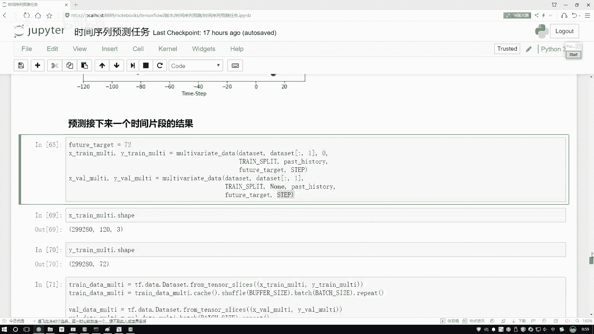

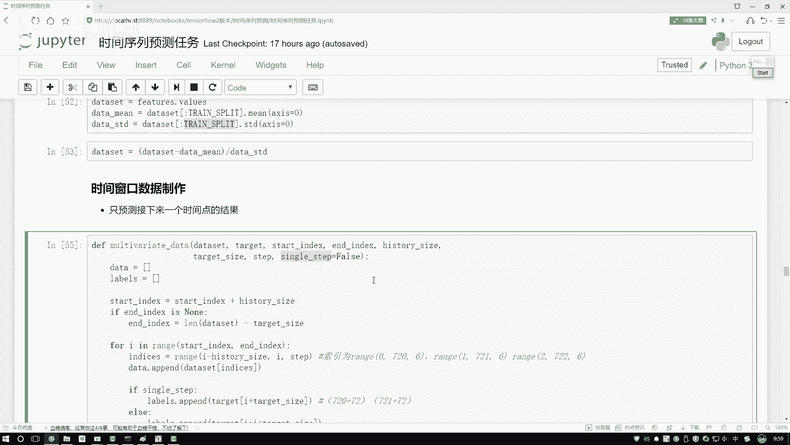

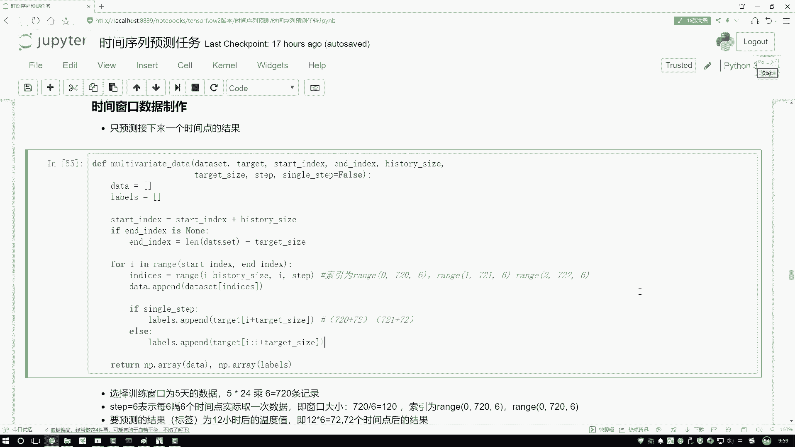

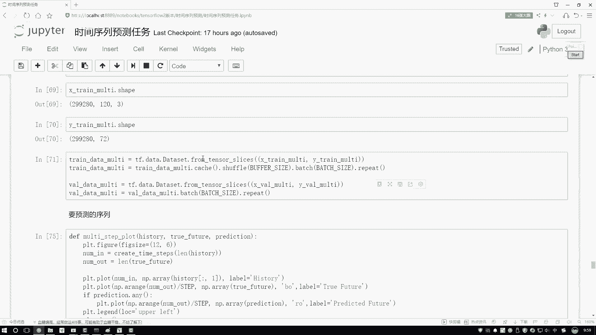

你说这个标当中啊，它第一个纬度跟之前是一样的，这以咱不说了，第二纬多少72吧。也就是说标签当中啊，我们预测的不是一个值了，而是未来多少啊，72值未来的一个区间了吧。好了，这个是唯一的一点不同啊。

只是我们的标签不同了，那标签既然不一样了，咱得到的一个结果也会不同吧。在这里哎这做败事数据，这个咱们不用去看了啊，然后咱来看这个序练的时候，训练的时候，这块有点不同啊。你看这里咱是用几个序列去做的。

我说把这个任务啊也做的更复杂一点了。咱不用一个LTM咱有两层的第一层LTM啊得到了32个隐藏执行源。然要大家注意一点啊，就是当我们堆叠这个LTM当中的时候，你需要把它返回的一个序列设置成一个触值。

因为呢就是我们再往上去堆叠一个LTM相当于哎我第1个LTM做完之后，我得到的还是一个输入吧，要输入到另外一个LTM当中了，所以啊不能给我返回的是一个结果值。😊。

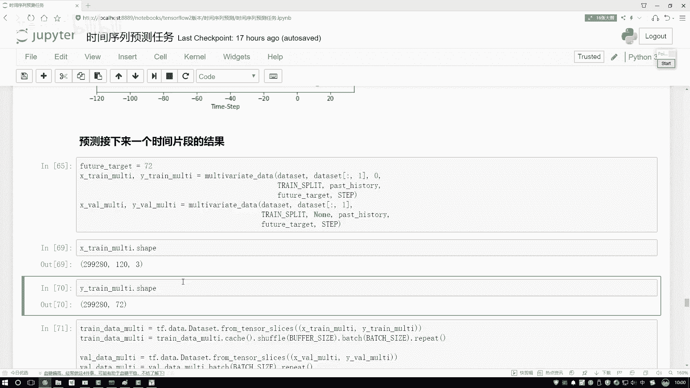

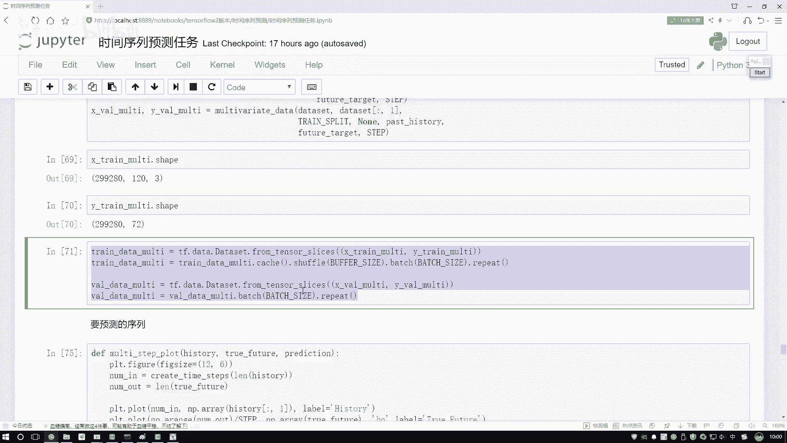

我还要这个序列全部的一个结果，一定注意啊，这个值必须是个触值，要不然没法去练。然后呢，接下来我说我按顺序吧，再加一层LTM可以吧？好了，最后我说我连了一个圈阶层，圈阶层，大家注意啊。

我们的输出一定是多少啊？还是一个值了吗？不是的吧，跟咱的标签得对应起来吧，标签当中啊我设置了咱有72值。那这回呢我用这个神经网络做预测的时候，咱要得到结果，它必须怎么样，也是72个值吧。好了。

这个是唯一点不同啊，咱们得到了72个结果，然后呢可以看一下吧，这一块是打印出来了，确实它是72个结果，下模型做训练，这大家不看了，来看一下损失的变，不用看损失变化，直接看最终预测结果吧。

在这预测结果当中啊，这个蓝色的是实际的值，然后这个红色的是我们预测值。你看这里这个趋势它是不是预测出来了，有一个先下降在上升的趋势。然后呢咱们在这个神经网络当中，你看它是不是也是先下降再上升的一个趋势。

这个趋势哎预测的还算可以啊，可能不是特别那不是算是那么特别准，这个是也是啊有一个下降再上升的神经网络预测完之后，它是不是也是类似的一个趋势啊。这里要给大家看了一下。

就是咱们当前啊怎么在这个fer当中吧去做一个。😊。

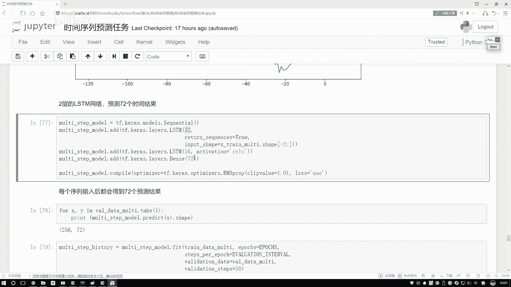

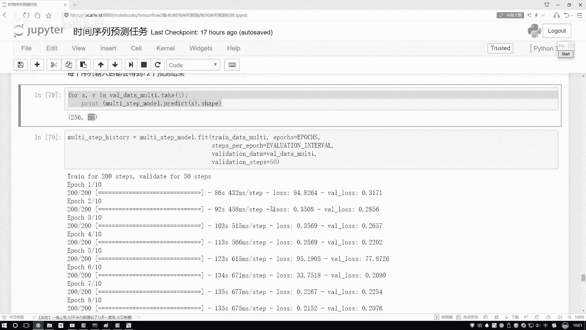

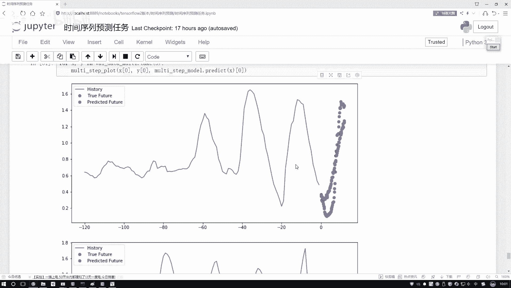

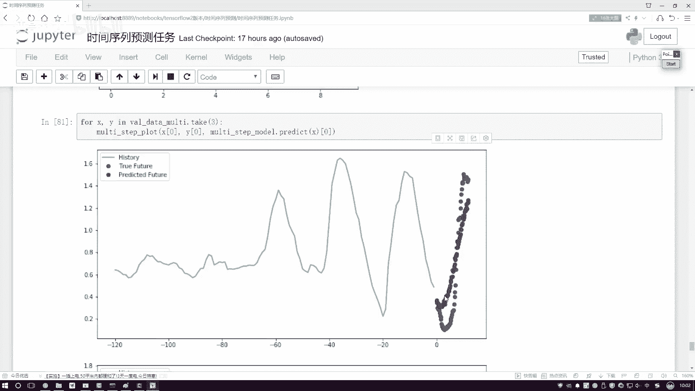

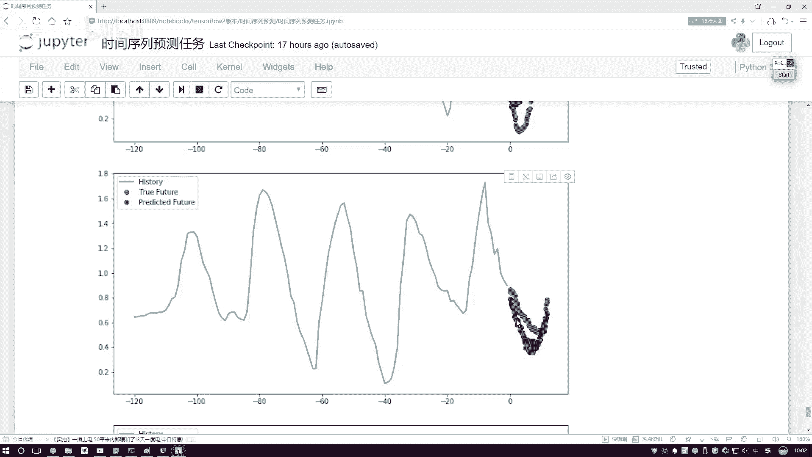

做时间序列预测任务。其实说白了咱这个demo还是比较简单的，主要是基于哎咱们的实验窗口指定实验窗口指定一个标签，咱们去做预测就行了。关键啊就是怎么样把咱的数据取到手，做成一个Y一个拜了。

然后呢输入到咱们的L天网当中啊就可以完成咱当前哎一个时验序列了。不光能预测未来的某一个时间点，其中啊还有未来时间片段是不是也行啊，只需要你把标签稍微改一改，你标签为一个值，那我要预测一个点呗。

标签为72值，能预测未来72点是就可以了。大家可能会问一个问题，就是。

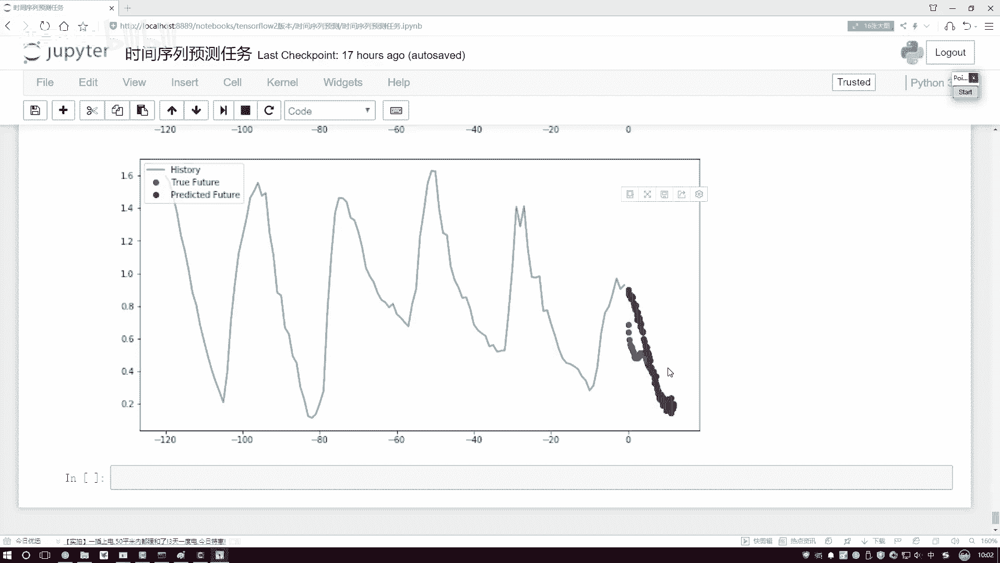

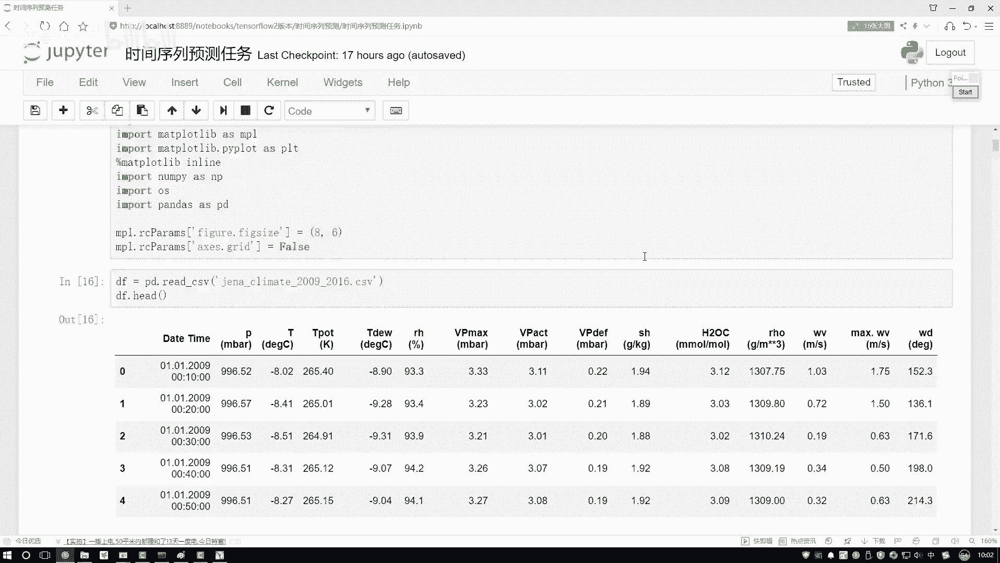

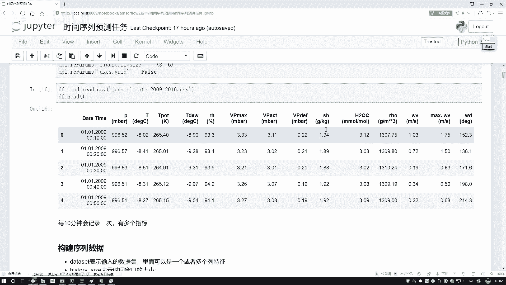

你说你现在在全链界当中预测出来72点，那这72点，它是怎么跟你标签当中未来72个时间，就是未来72个时间当中真实值它是对应起来的呀。其实啊这个不用大家操心了，神经网络要预测什么结果完全是由谁来规定的。

就是由损失函数来规定的。一开始呢神经网络它也不知道这72值到底是什么。但是它通过损失函数可以看出来，我这72值啊，如果说跟原来的哎72个时间点一一对应起来。第一个点对应第一个值，第二点对应第二值。

如果它对应起来会使得损失损失值啊越来越小，它就会朝着这个方向去做的。所以说啊当我们有神经神经网络的时候，最核心的一点啊就是你的损失函数该怎么样进行设计了，你的任务的需求。

咱们的任务目标完全啊都是由这些损失函数帮我们来做这样一个约定的。行了，这里给大家说了一下咱们实验序列啊一个基本的玩法。😊。

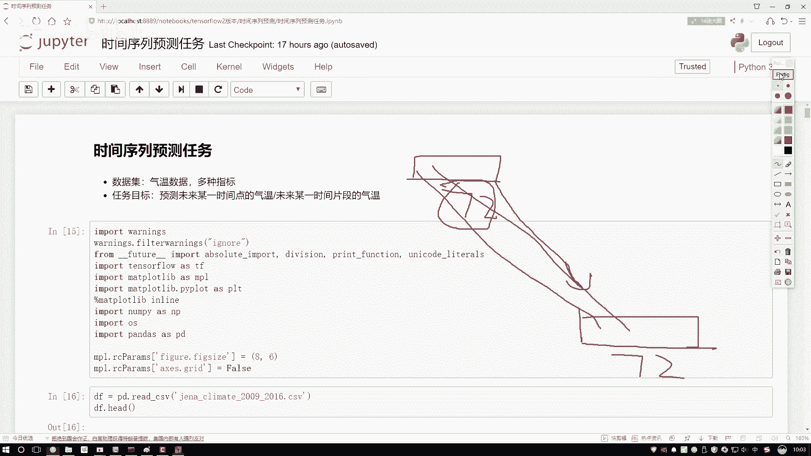

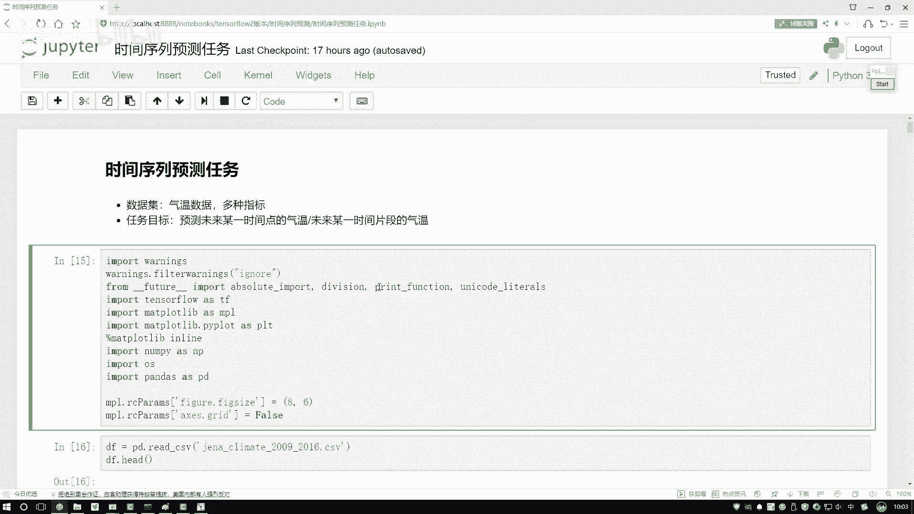