# 【2024版金融量化】AI结合金融如何做落地项目？迪哥手把手教你3天从入门到项目实战，学完即可做项目，少走99%的弯路，学量化交易看这套！人工智能／计算机视觉 - P5：2-序列变化情况分析计算 - 迪哥谈AI - BV1NW421R7d7

再看下一个下一个就是让我们做这样一件事儿啊，我们要去呃变换情况的一些计算啊，什么叫做变换的情况？这不叫变换情况吧，就是叫个变化吧。

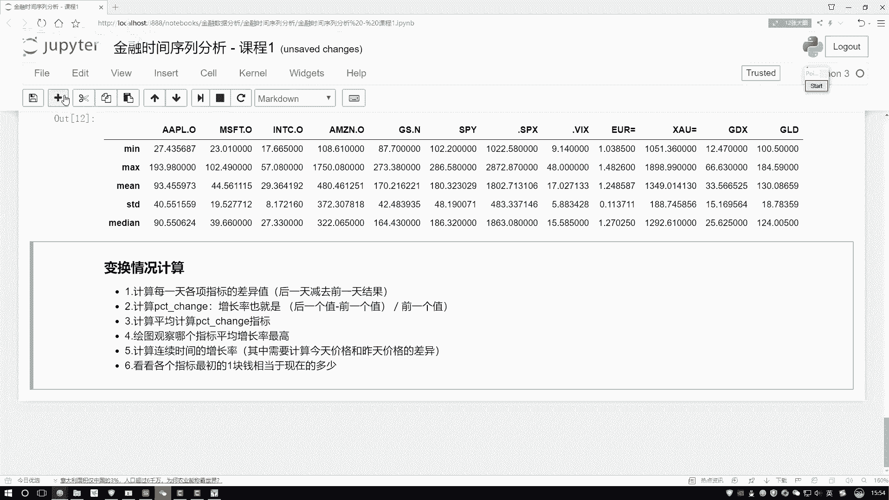

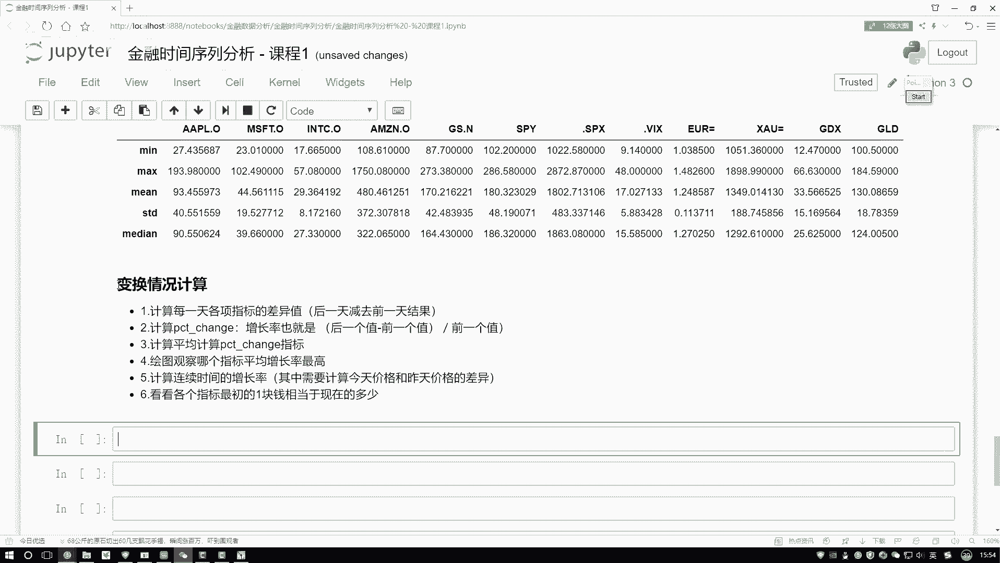

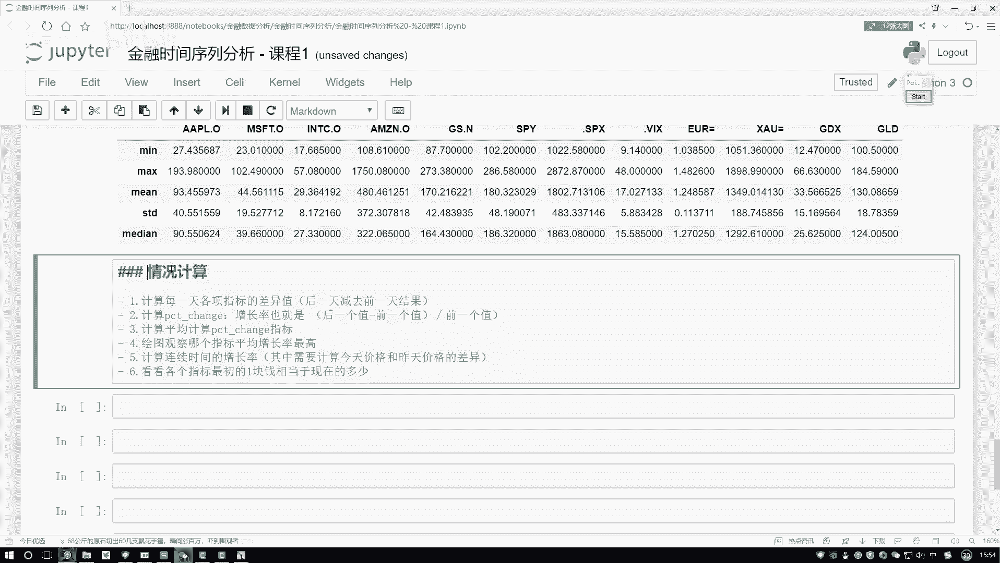

呃，序列变化情况，它的一个情况计算啊，这个可能描述有点抽象。咱来看其中每个点要做什么，然后咱把这个东西实验出来啊。首先第一点，我说啊要去计算一下呃，每一天指标的一个差异值。

什么叫做每一天的一个指标差异值呢？这是这这个意思啊，你看在我这个。数据当中啊，你看这块，比如说这有1月4号和1月5号的数据是吧？我现在啊就是我对于每一天的数据，那其实我都不关心当天啊是30还是38啊。

你跟我说没印象，我希望你告诉我这样，哎，就是当前啊，你告诉我它的一个增幅有多大，比如说涨了1块钱还是跌了1块钱，你能不能告诉我这样一个指标啊啊，我们要做这样一件事儿，那这件事怎么去做呢？

那你看我们都需要用什么，后一天的数据再减去咱们前一天的数据吧，我们得后一天减去前一天，那这个东西说起来容易，那我们该怎么去写呢？啊，其实在这个盘当中啊，非常简单，我们直接干什么。😊。

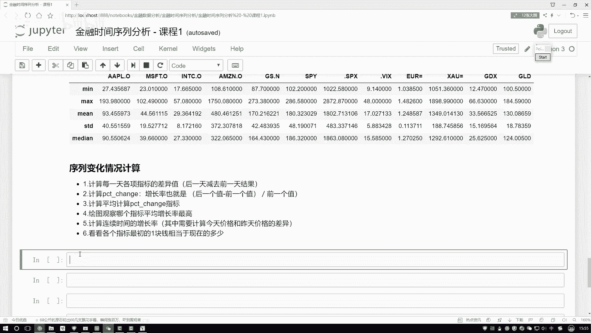

对于这个data，我们干什么？我们去算一下它的一个差异就可以了吧啊，第difference以下。在这里呢我们执行完之后，然后呃打印前5条吧，咱来看一看当前的一个结果，看一下吧。这里啊。

我们这个我们这个所以没变，是不是？但是你观察一下1月5号的时候，它是等于什么0。052来回到我们的数据当中。1月5号的时候，这里。😊。

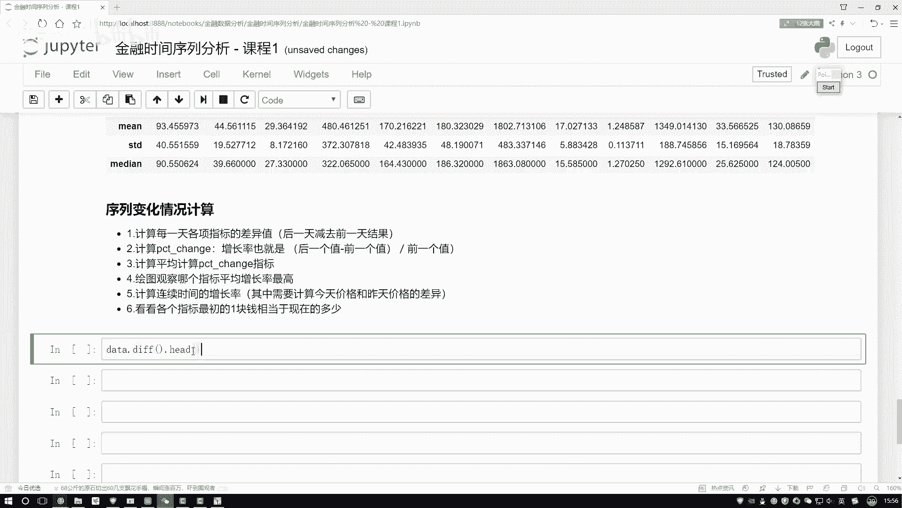

0。052怎么来的，是不是用我们当前这个数据减去什么？前一天的数据，咱得到的呀。那你看其他指标是不是都是用当天的这个指标减去前一天的了，那为什么1月4号这块你多出了一些AN值啊， number值啊。

来看一下吧，因为前面这块怎么样没有值吧，没有值咱就没得减了，所以说它得到的就是一个AN啊，这样我们完成一下什么事，用当前的啊，当前的一天减去前一天的结果，我知道了，咱现在可以叫什么每一天跟前一天比。

我们的一个增幅是多少吧，或者说一个差异值是多少，这个指标在我们的实验序液当中啊使用的相对来说啊会比较多的一个指标啊，这里啊咱们是看的是一天的差异。那如果说看两天的差异呢？隔一天你看行不行？

隔两天隔一周一看行不行啊，都是可以的，我们可以在这个函数当中啊，怎么样指定参数吧。好了为了养成大家良好的差API的习惯。但凡你。😊。

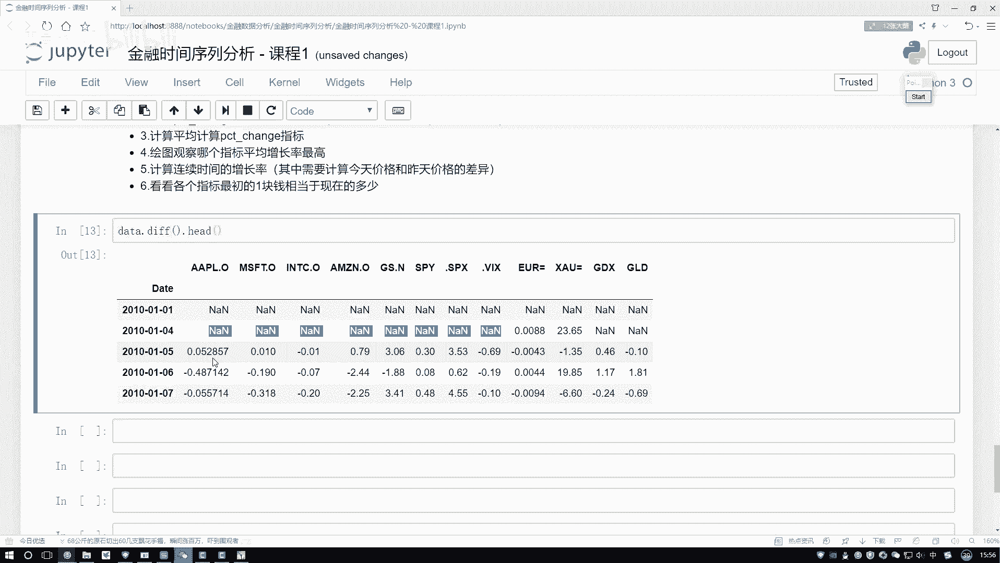

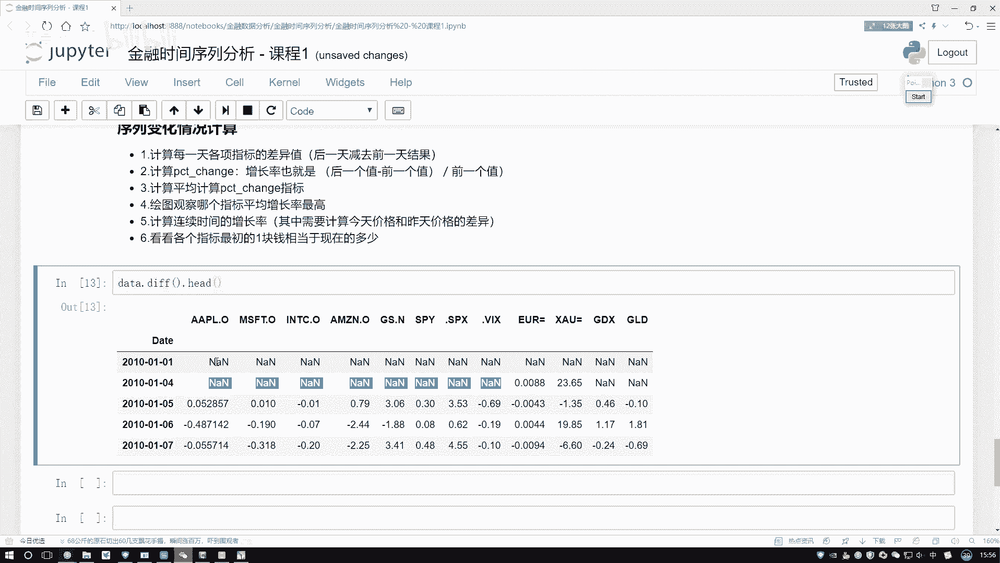

遇到不知道的函数，或者说遇到不知道这个参数该怎么写怎么办？最直接简单的方法，ctrl加C复制过来，要我么们百度去查啊，要不然API当中去查，是不是结果一下就出来了。我也是建议大家这么去学啊。

就是但凡哎你遇到了哪块，可能是你不是特别熟悉，或者想看其中的参数，多查多练，你自己做一遍实验才是最好学习方法，看着视频啊，看的时候都能听懂，不代表你自己写的时候就一定都能明白啊。

自己写自己查的过程要比看视频，我觉得是更有价值的一个学习过程。😊。

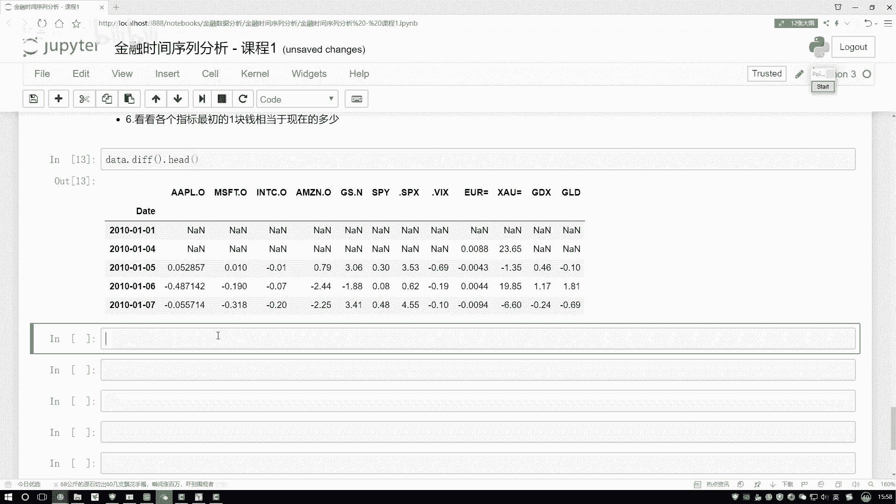

好了，咱们再继续说啊，这里这里我们的差异值看完了。那你看这个差异值当中，其实还能去统计指标。比如这块，你看我现在不想要哎，它这个每一天的个差异了，我想看一下整体。那比如说我看整体。

那你就告诉我一些统计特性呗。那比如说一个均值。

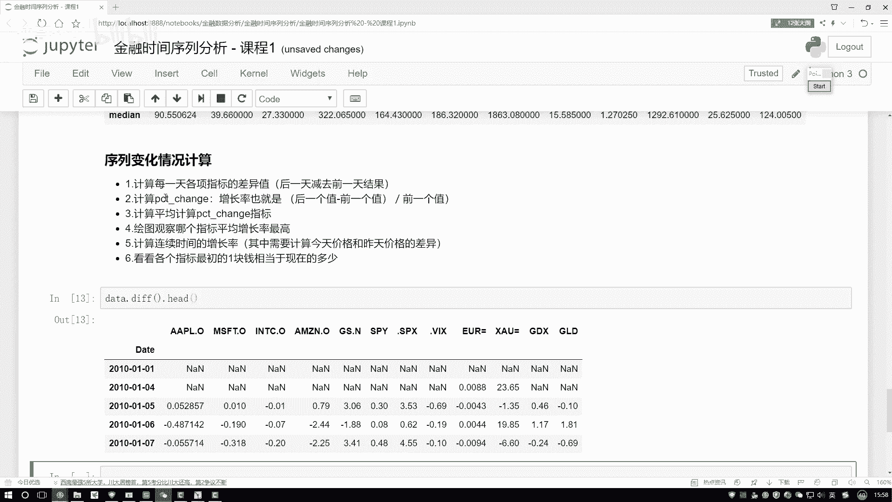

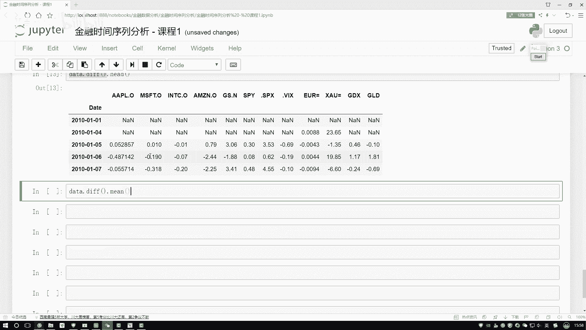

均值我点面传建之后，是不是各个维度啊，你看它的一个平均情况，咱就全部给它算出来了，这个值还是比较好算的吧。那然后呢，接下来哎，你说我想换一种统计的方法。那现在可能这样啊，就是呃一个股票。

你告诉我它涨了个1块2块3块的，好像来说没有什么太大的感觉，因为比如说从1块钱涨到2块钱，那也叫那是涨了1块钱是吧？那从1万块钱涨到1001块钱也是涨了1块钱，但是你说这个1块钱，它是相同的概念吗？

第一个股票翻了一倍，那第二个股票没没咋变化，是不是？所以说当我们在计算的过程当中啊，很多时候我们看的呀，不一定非是一个差异值，而是一个什么可能是不是一个增长值吧，或者说不是一个变化值。

而是一个变化率或者是增长率吧，什么叫变化率呢？你看一下这块我们没列公式，我直接给大写了，因为比较简单。

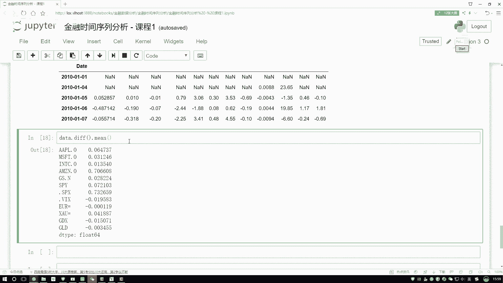

很简单，它用后一个值减去前一个值再比上前一个值，这是什么？那再有个除法，那不就是一个率吗？所以说此时啊当我们在计算过程当中，也可以用这个增长率来帮我去做计算吧。好了。

这里大家可能说哎呀增长率后约值减前一个值，然后呢比上前一个值，我要不要自己去写呢？自己写其实很简单吧。但是啊有一个现成函数，巧了帮我们去做了，直接给它复制过来，咱先来看一看它的一个结果。

对于我们date frame当中我算这个增长率，然后做完之后我去点ha一下吧，先来看看结果。😊。

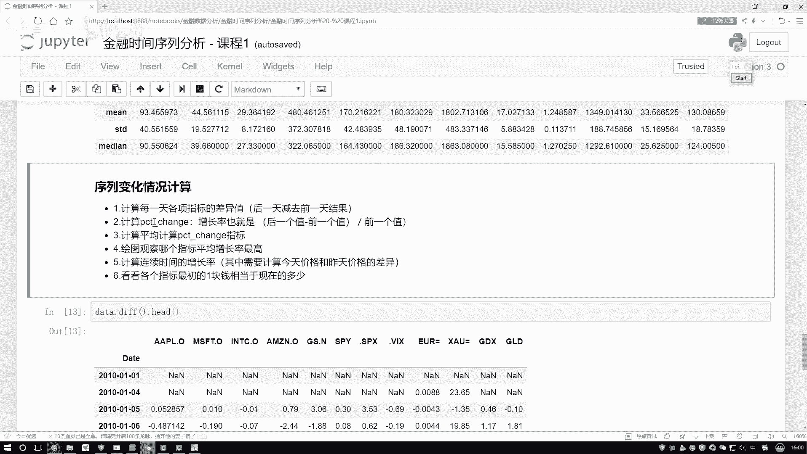

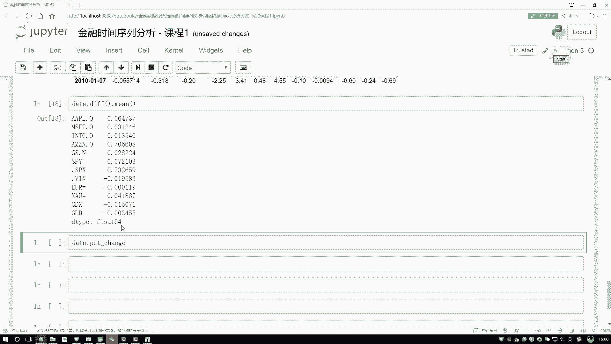

你看当前我们这个结果怎么样，是不是之前哎都是一些就是增长了多少，现在呢变成了增长的，比上前一天的变成什么了，一个增长率了吧，这个小点后面太多了。

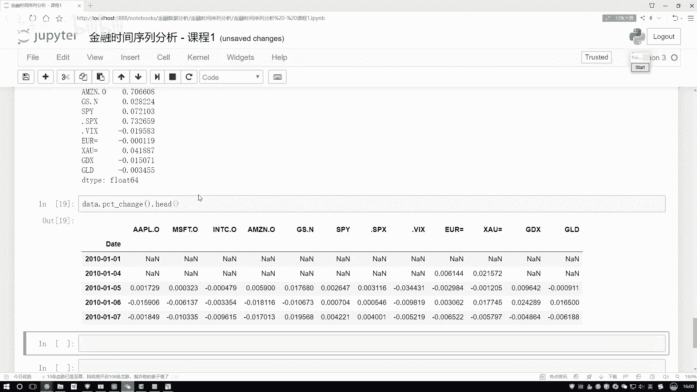

为他少点，为他留个三位得了啊，就留上比较小的些值。这就是咱们这个增长率。那大家可能说哎呦这个增长率你怎么看着这么低呀，那确实如此啊，你说这个一个股价它一天讲到底它才能讲涨多少啊，涨那么0。

2个百分点涨0。1个百分点都不错了吧，能涨就行，是不是在这一块咱给大家说了一下，我们可以算什么啊，不光算一个差异值还能算我们的一个增长率，好了，增长率当中，哎。

那你说现在啊对于增长率你给我这个时间序列当中花了这么多天，呃，这今天涨了明天跌了，后天涨了大连跌了，你能不能给我算个平均呢？啊，是也可以啊，把这个东西复制过来。😊。

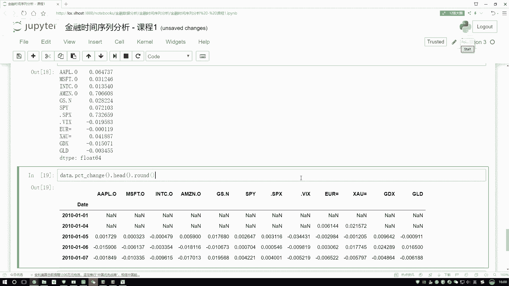

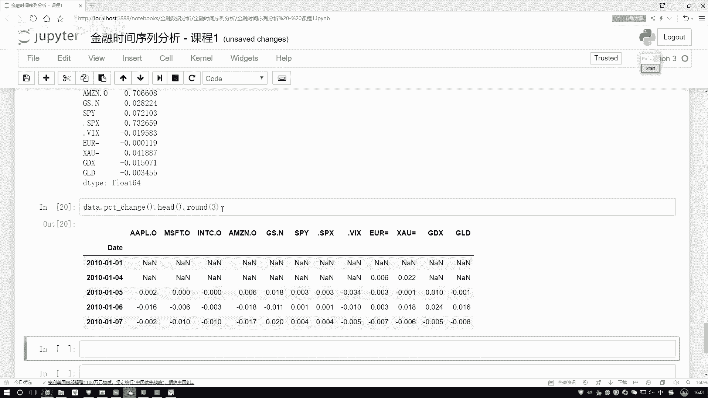

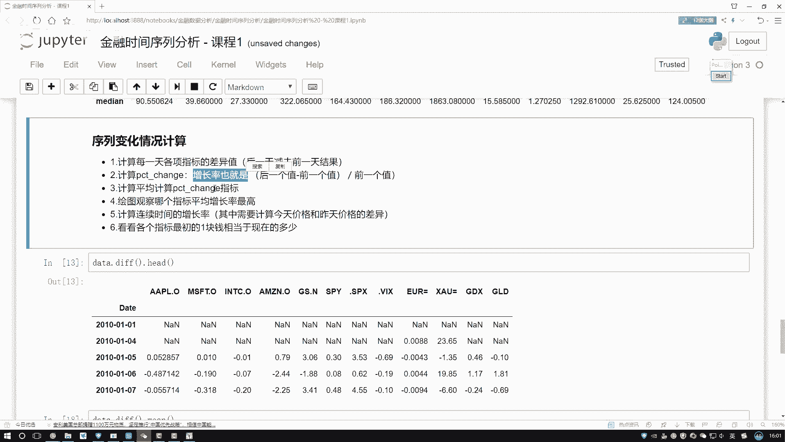

之前咱是一个点 hat是吧？好了，这就先算一个平均。算完平均之后呢，我还可以干什么？算完平均之后，我还可以再去把这个图给它展示出来吧。直接的我说我去点p一下。在点p过程当中啊，我可以去指定一下，哎。

当前我们用什么样的格式来去画这个图吧。那你说先用什么格式画这个图呢？平均的值，哎，它是某一个指标就一个结果吧，一个指标就一个结果，那不能用折线图来表示吧。

我们可以用什么条形图是不是最简单的只用条形图看到当中，你去指定你要用什么图来去画是不就可以了。然后呢指定好当前我这个图的一个大小。呃，比如说一个16得了，来看一下当前画出来结果。

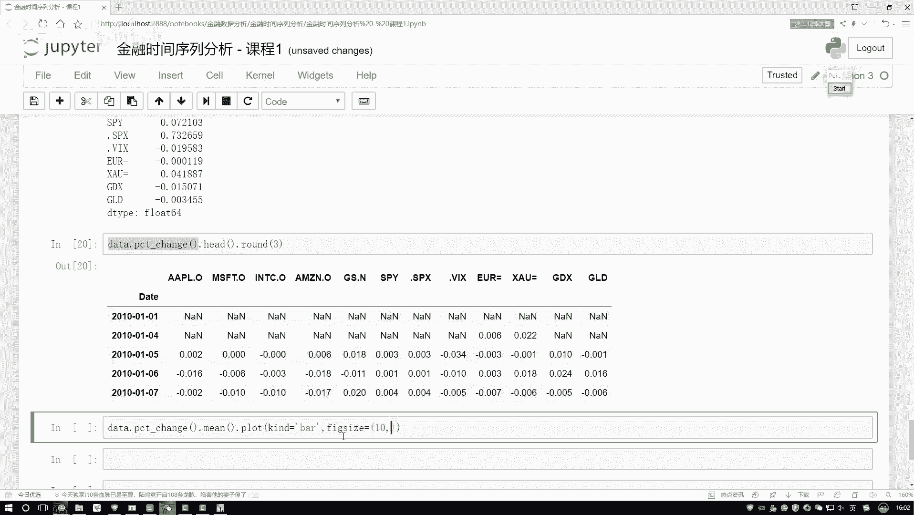

好了，各个指标啊，这反正咱也不用管了，就各个指架。然后你看其实它的一个歪轴，这个值确实都比较低吧因为它也不可能往往左涨涨这样一个结果的。这样我们是不是各个指标结果就一目了然了。非常清晰啊。

咱就会以得到哎当前我们增长率它的一个平均结果了。

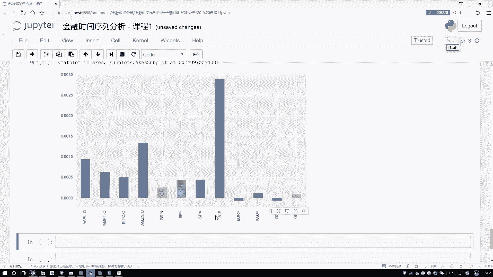

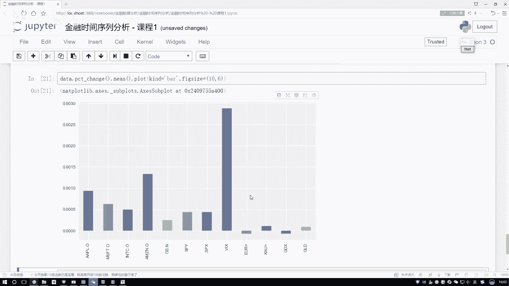

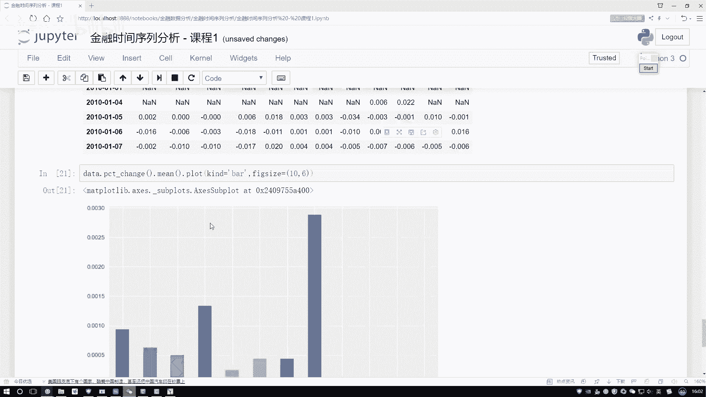