# 【2025数据分析】Numpy+Pandas实战金融量化分析，让你数据分析驱动投资决策！🚀💰 - P11：10 股票数据预处理 - 疯狂架构师 - BV1EL6mYzE2i

那么在上一小节呢，我们已经把这个data frame的基础操作呢，给大家进行了一个讲解哈，那么这一小节呢，咱们就给大家设计的两个小的项目啊，通过这两个小的项目呢。

我们对data frame的基础操作进行一个巩固，重点是对我们data frame当中的索引，跟切片的操作呢进行一个巩固啊，那么在咱们课程刚开始的时候呢，首先啊我给大家介绍一下。

咱们整个课程讲解的一些内容的概述，对不对啊，然后在咱们整个课程的内容当中，我说会涉及到相关金融量化相关的这个项目，卖力对不对，那么这一小节，咱们就通过这两个股票策略的制定啊，就来充当咱们的金融量化。

那么意味着通过这两个案例的一个实现，那么可以让大家去感受一下，如果使用咱们的数据分析做金融量化，去制定股票买卖相关的策略的话，咱们怎么去实现，OK吧，当然这儿的话，我们设定的这两个这个小的项目哈。

第一个啊，第一个是纯粹是为了让我们去巩固，咱们data frame的基础设定的一个项目，那么第二个双均线的一个策略，那么这个项目的话就是一个真实的一个，股票买卖策略的一个制定。

那么它也是一个真实的金融量化的一个案例，的一个设计和编写，OK吧，那所以说啊这个双均线的话，我们可能得下一小节才能说，那么这一小节咱们主要是来看一个，第一个初步的一个股票分析的一个案例啊。

那么通过这样的一个案例，通过这样的一个项目，咱们就可以来巩固一下咱们data frame的基础操作，也可以让大家感受一下，如果咱们想使用数据分析做金融量化，咱们需要掌握哪些这个技能，对不对好。

首先的话在这看一下我们具体的一个需求，首先第一个需求啊，咱们需要使用to share这样的一个包，获取某只股票的历史行情数据，那首先我们要知道哈，我们想要去制定股票相关购买的一些个策略。

那我们需要对股票的一些个历史的交易数据，进行某种形式的分析对吧，为什么基于股票的历史交易数据呢对吧，因为股票的历史交易数据是公开透明的，我们是可以很好的货到的，那如果基于股票。

未来的一个这个股票的一个走势或者它的行情，我们是无法获取相关数据的吧，我们只能是通过对以往的历史的数据做分析，去预判未来的股票的行情是怎样的，对不对，OK吧，希望各位也能够理解哈。

那在这的话第一个需求咱们需要使用to share模块，对某只股票的历史行情数据进行一个捕获，那这块的话咱们来看一下这个to share啊，to share是一个什么样的东西。

首先to share这个包的话，我们需要对其进行一个手动的下载，OK吧，我们需要手动的对其进行一个下载，那这我写一下哈，下载那首先他这个to share我们叫做财经，叫做财经数据接口包，接口包啊。

你想用它的话，你得进行一个安装，Pip in store，先下载一下我们的这个to share单词，别拼错了，OK吧，那下载好了之后，咱们就可以去使用这样的一个，财经数据接口包了。

那么什么叫做财经数据接口包呢，那么在这的话我们可以在网上呢进行一个搜索，搜一下to share，看一下它叫做财经数据接口包，我们打开它的一个官方文档，那么这个官方文档。

它会对我们to share进行一个介绍，他说to share是一个免费的，开源的Python的一个财经数据接口包，主要实现对股票等金融数据，从数据采集清洗加工到数据存储的过程。

能够这个为金融分析人员提供，快速整洁和多样的便于分析的数据，那也就意味着这样的一个财经数据接口包，可以给我们提供相关金融产品的一些个数据吧，对吧，便于我们的一些个专业人员。

对相关的这些个金融产品进行一个分析，对不对，那这块的显示器上各位自己去看，自己去看啊，那这个看左侧左侧这块的目录栏，我们不需要每一个都去看啊，不需要每个都去看，因为现在我们只是针对我们目前的这样的一。

个项目进行一个数据的捕获吧。

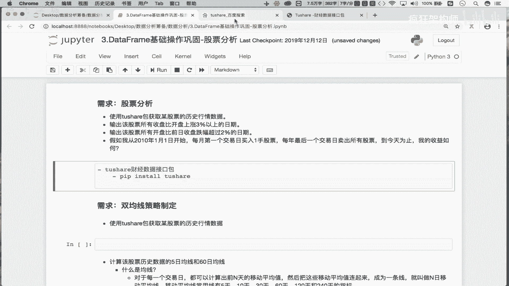

我们要的只是股票的数据吧，那在这的话我们就可以看一下，你看这块有相关的交易数据对吧，然后呢除此之外还有什么呢，还有我们的上证指数啦。

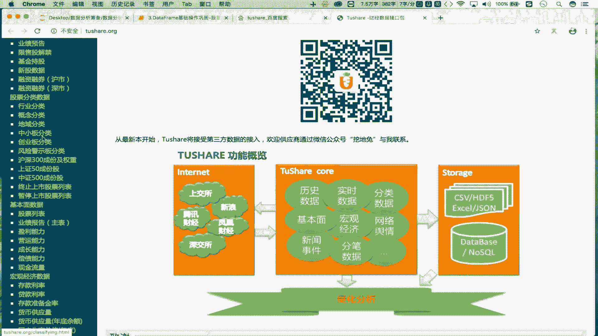

还有我们的基本面数据啦，还有相关的银行的这个宏观经济数据啦。

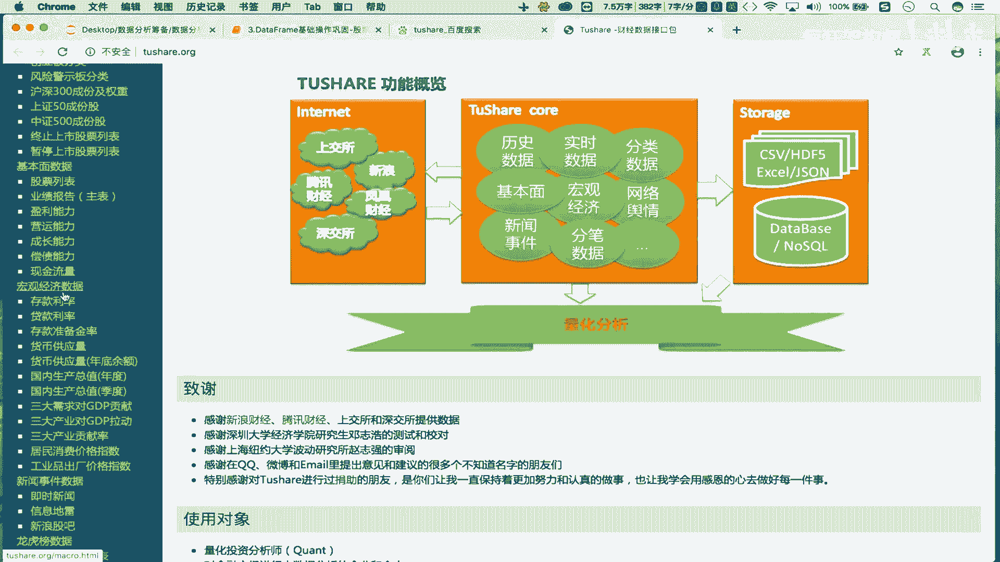

还有新闻事件，电影的龙虎榜等等等等，有各种各样不同类型的财经数据。

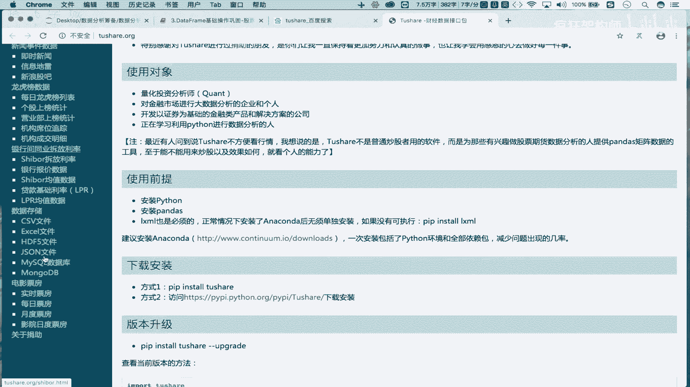

OK吧，那我目前想要的是历史数据啊是吧。

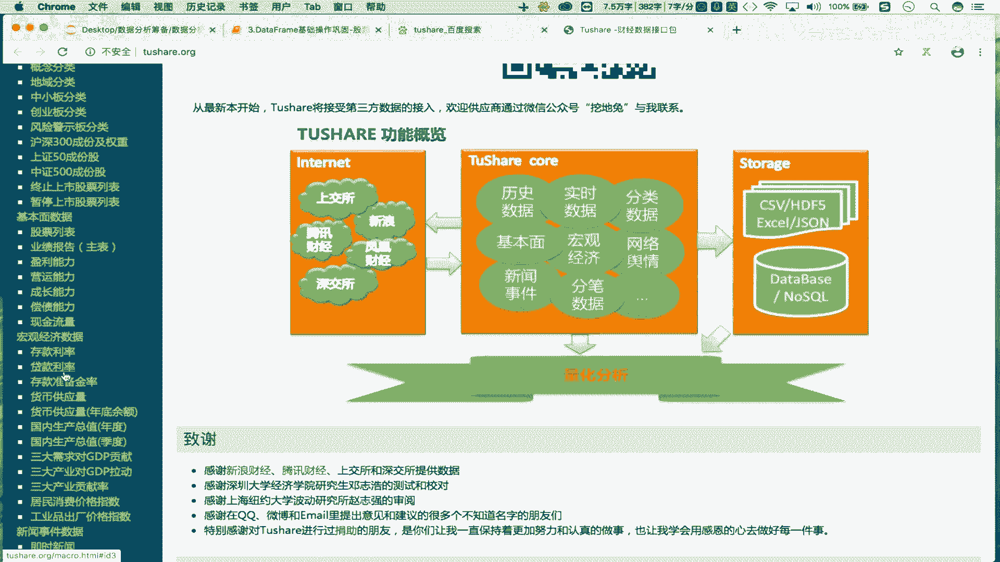

要的是股票的历史数据，从哪找呢，你看这块的话就找一下这个什么呢。

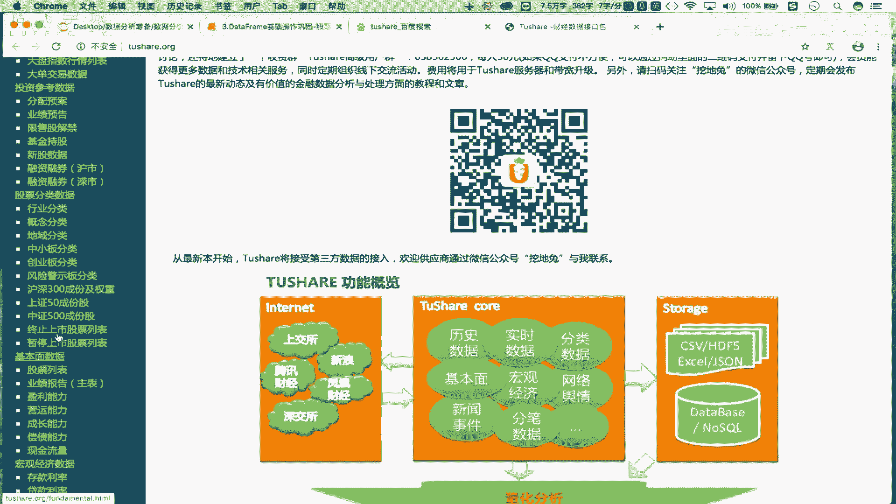

在这个交易数据这块有个历史行情，是不是你点一下这块会告诉我们，基于to share这样的一个接口调用怎样的方法对吧。

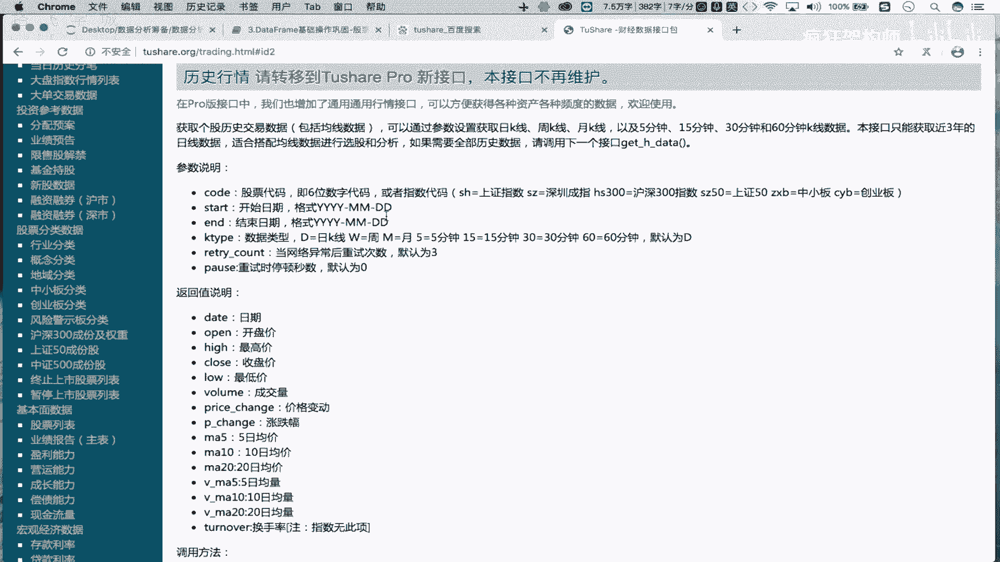

传入怎样的参数，可以得到怎样的数据。

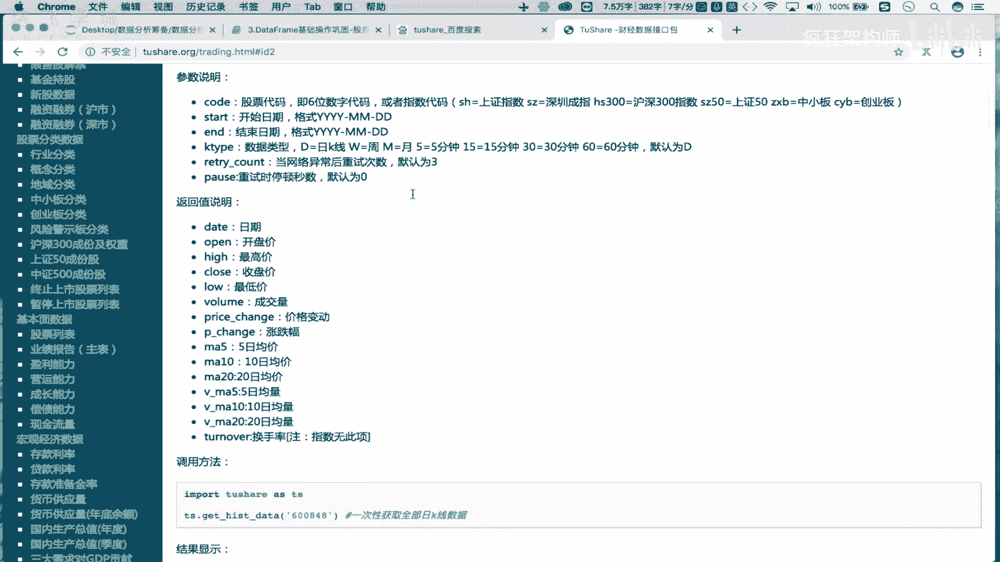

包括这块每一个方法，它的参数，包括它的返回值，这块都有详细的一个介绍。

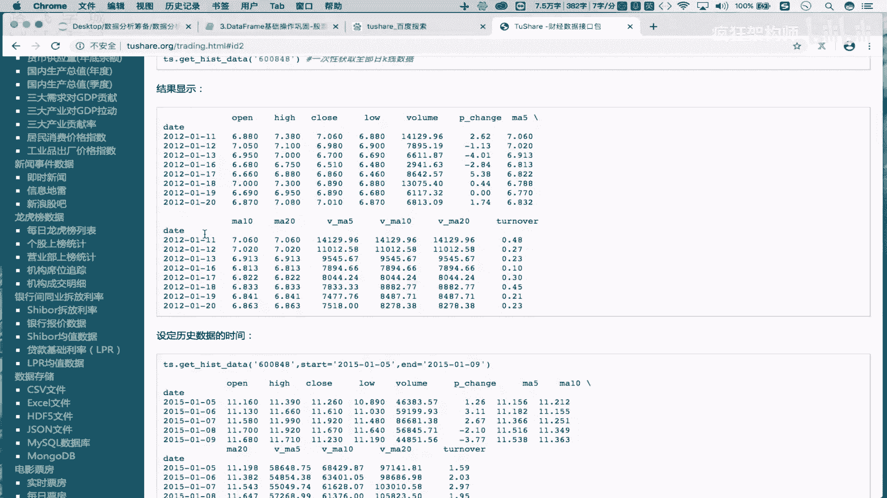

OK吧，那么各位自己去看就可以了，OK吧啊，用到什么。

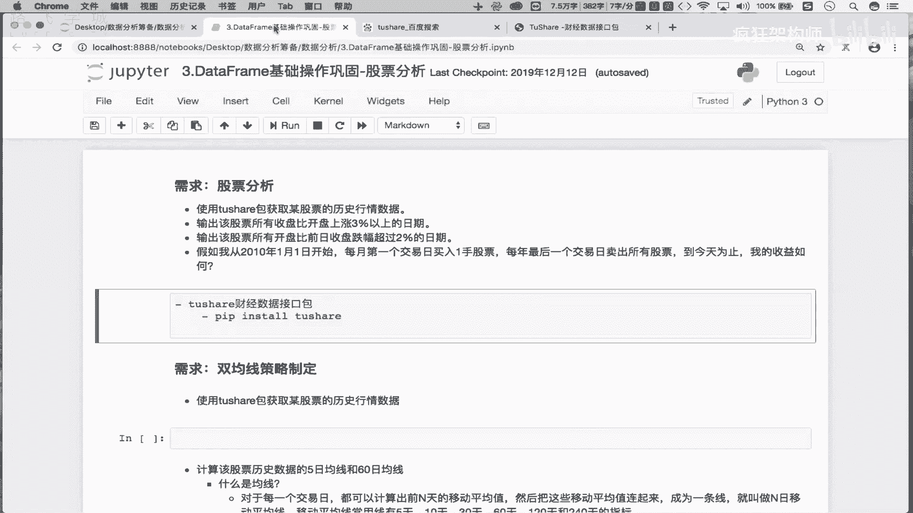

就来这个说这个这个这个中文文档里边，去找什么，是不是就可以了对吧。

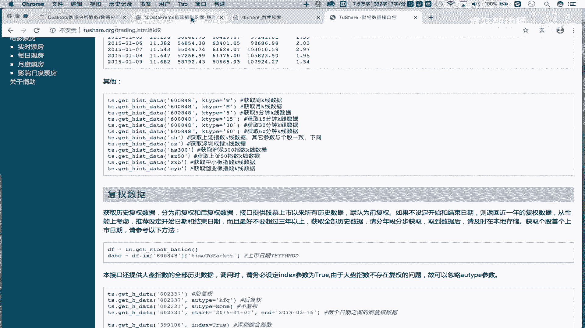

那我们在这大概知道了to share包是什么了对吧，知道之后呢，那么接下来咱们就可以去使用了啊，去使用了，首先第一步，我们说在这需要获取某只股票的历史函数，数据吧，怎么获取呢。

首先我们把to share模块下载好之后，在这先导一下啊，先导一下相关的模块，To share，As is，我们叫做ts，可以吧，好再导一下我们的pandas吧，pandas i s p d好。

那再导一下什么呢，从pandas当中import，导一下我们的d frame和serious啊，我们后边可能会用吧，那甚至我们可能还会用到NAPPI吧对吧，把NIKE呢也都给他导一下子就可以了啊。

那这样的话我们相关的模块就已经导入了，导入了之后呢，先看第一步的需求啊，在这我们想要获取，获取某只某只股票的历史行情数据，那怎么基于to share模块，获取某只股票的历史行情数据呢。

好在这的话使用我们的这么的ts啊，ts然后点儿我们叫做G杠k data，通过调用这样的一个方法，就可以获取某一只股票的历史行情数据。

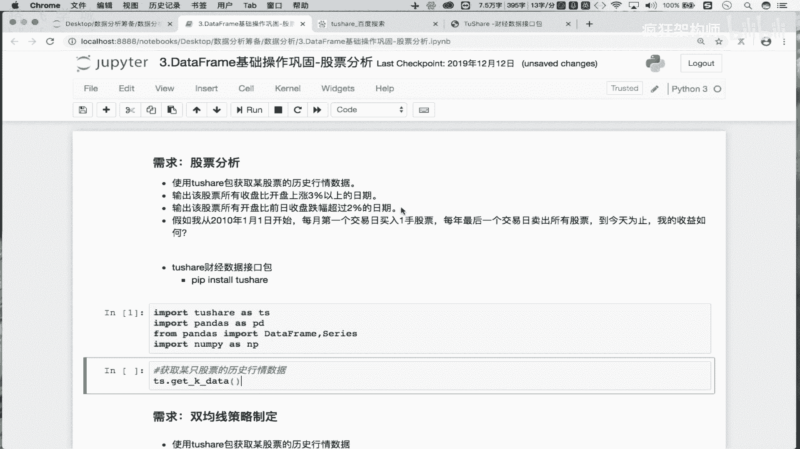

我怎么知道知道调用哪个方法呢，就是在这样的一个中文文档里边去找吧对吧。

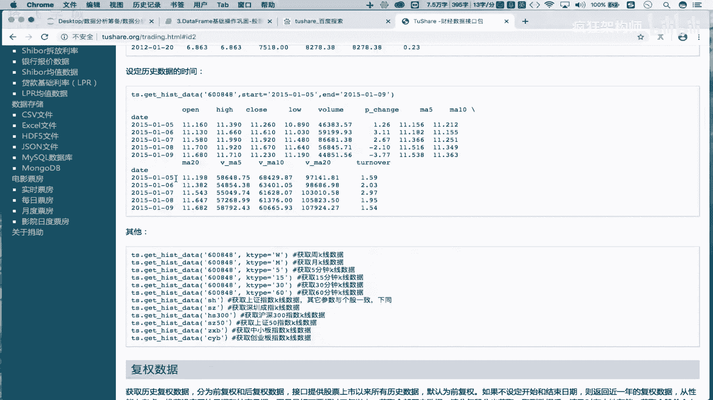

去找啊，你看点击这个历史数据是吧，刚才我们点的点击这个历史行情。

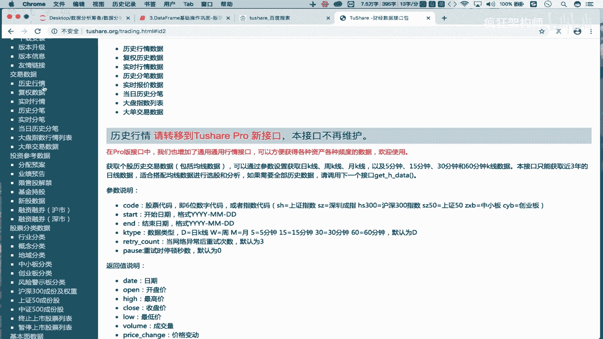

就可以知道调用哪些方法，获取哪些股票的历史行情数据吧，OK吧好，那首先这个get k data传什么参数呢，首先第一个参数code code是什么呢，code啊code我们传入的是股票代码，OK吧好。

那这又传一个我们叫做600519OK吧，每一只股票都有其对应的一个股票代码吧，就code后边传入的是字符串形式的股票代码，OK吧好那除了code之外还有什么呢，还有start和end啥意思呢。

就是你想获取的这支股票的历史交易数据，你获取的时间节点分别是什么呢，对吧，你比如说start是说这支股票是吧，开始的时间摁的是这支股票结束的时间吧，你只能获取过去的某一个时间段，之内的历史交易数据吧。

那现在比如说我就想获取什么呢，这只股票从开盘啊，就是从他这个挂牌交易那天，到昨天的历史交易数据怎么办，是获取过去所有的历史交易数据吧对吧，那怎么办呢，那我们得知道他是哪一天进行股票售卖的吧，对吧。

那如果你不知道的话，怎么办，这个start你可以写一个比较早的时间OK吧，比如写一个2000年1月1号，那很有可能这个60519，它指的是茅台这只股票，那么这支股票应该是零二或03年正式上市的，OK吧。

那我这的开始时间是一个比较早的一个时间，那么意味着end的我就不需要写了，end不写的话，默就是截取到昨天吧，因为昨天是收盘了，今天没有收盘，你就获取不到今天的数据吧，OK吧。

那在这的话我们来获取一下啊，看这返回的是什么，那这返回的应该是一个data frame啊，那这我们去接受一下DF，好，在这我们去打一下DF走，那如果想使用这个凸线模块的话。

必须要保证你的这个啊机器是有网络的，OK吧，它是需要从网络上获取指定数据的吧，你看在这的话我们就获取了什么呢，获取了多少数据啊，是不是从2001年8月27，这一天开始获取的数据。

因为从这一天他正式挂牌交易股票的，是不是好，一直到哪天结束呢，看一直到2020年的2月18号吧，对吧，是昨天吧对吧，是昨天啊，因为我们今天股票还没有收盘，今天19号没有收盘。

那么意味着我们这只能获取到收款之后的数据，吧对吧，我没有写N的，那没有写结束时间，没写的话，就是默认获取到什么呢，最近的这样的一个时间吧，OK吧，一共获取了四千零四千四百零五条数据吧对吧。

那这组数据获取了之后，那每一列各表示什么意思呢，首先data这一列啥意思对吧，是我们的交易时间，open是不是这一天的开盘价，Close，收盘价害当天的最高价，Low，当天的最低价是吧。

它是当天的成交量，扣的是股票代码，对不对，这五列各自表示的含义，各位能够理解哈，那现在呢其实股票数据呢我们就获取了，那获取之后的，那么接下来干啥呢，你比如说啊，那每次我想获取这组数据的话。

都需要去执行这样的一个方法，对不对，那这个方法这个函数在执行的过程当中，需要从网，需要借助我们的网络从网上去下载数据吧对吧，那为了这个保证我们的这个数据，获取的一个稳定性。

那我是不是可以把这组数据获取了之后，干什么呢，是不是可以把它存到本地啊对吧，这样咳将互联网上获取的股票数据干啥呢，是不是存储到本地啊对吧，怎么往本本地存呢，存到本地哪呢，你往数据库里边存。

OK往本地的文本文件里面存也OK，那怎么存呢，看一下这块有一个什么呢，DFD2to杠一个什么什么东西，你看DF是不是我们获取的data frame啊。

这个date frame里面存的是不是咱们获取的茅台，这个600519这支股票，所有的历史交易数据啊对吧，那把这个这组数据to是不是写入到哪啊，那写到哪呢，你看可以写入到excel。

可以写入到这个CSV文本文件里边吧，可以写到字典里边，可以写到excel里边，也可以写到哪呢，JASON里边可以写到看to SQL也能写到数据库里边吧，对吧，都可以，那这块的话咱们就选择什么。

选择我们的to5杠CSV写到文本文件当中，可以吧，OK吧好写到本地，我们叫做茅台DRCSVOK吧，那通过这样的一个代码的执行，我们就可以将这一组数据写入到本地，你看当前我本地并没有茅台点CSV吧，对吧。

没有啊，那现在我执行一下走，你好，这组代码执行结束了，看一下我本地啊，这块的话我们刷新一下，刷新一下，看下这块是不是多了一个叫做茅台点CSV啊，打开看一下，这是我们刚刚写到本地当中的数据吧对吧。

那么就意味着现在我已经将数据写入到本地了，吧对吧，所以说在这的话可以啊，注意我们说可以通过调用，调用to一个杠叉叉叉的一个方法，将DF，将data frame中的数据是不是写入到本地，进行清除啊。

OK吧，那么这个操作你需要记着怎么去用啊，怎么去用好，那现在既然数据写到本地了，是不是，那接下来我可以干上我们的将，将本地存储的什么呢，数据读入到data frame当中对吧，那现在我就可以将什么呢。

将本地这个茅台点CSV，这个文本文件当中的数据，是不是读到我们的data分当中啊，那怎么读呢，pd啊D2可以调一个什么呢，re杠什么玩意吧是吧，read杠CSV是不是将本地的文本文件当中。

数据写这个读取到我们的data form当中啊，read跟excel是不是将一个excel当中，数据是不是读入到我们的这个data from当中吧对吧，后边还有其他read的系列函数吧。

那这我们用的是read刚4。4V是不是好，我读取的是不是本地当中的茅台，点CCSV啊对吧，那这返回的就是我们DF看一下，那现在这块的话，DF我点head一下，还记得什么意思吗。

head是不显示data from前五行对吧，那现在数据就读取出来了吧对吧，你看见我读取出来的数据，这块我们需要做处理啊，接下来在这干什么呢，需要对读取出来的数据进行相关的处理，处理什么呢。

首先第一点啊，第一点你看这一块的话，我们读取出来的数据是不是多了一列，这一列是无用的吧，是不是可以把这列先删掉对吧，删掉啊，那这怎么去删除呢，好在这删除删除DF中指定的一列，那怎么删呢。

df deer删除的话，要么是remove，要么是delete，要么是job，是不是你都可以去试一下吧，你看remove按tab有提示吗，没有吧，delete tap也没有提示吧，那只剩下什么呀。

job了吧对吧，用job啊，那job这块的话，它有一个参数叫做labels labels，表示我删除谁好，那这我删的是应该是这一列啊，将列索引传过来吧，对不对好，因为你这只是传入了一个字符串形式的。

一个索引吧，那它到底表示的是行索引呢，还是列索引呢，通过轴向指定，那轴向如果是零啊，轴线如果是零，我们说零表示是列，一表示长吧对吧，但是在job这样的一个函数当中，零跟一刚好相反了啊，在job函数当中。

零表示的是行，一表示的是列，OK吧，刚好反过来了，OK吧好然后再写一个in place，in place的话等于一个true，in place等于true的意思，就是说将这个删除的操作。

直接作用到原数据当中，那如果这块in place等于true，不写的话，默认in place等于false，如果in place等于false，意味着job会给我返回一个新的data frame。

那么在新的data form当中已经将这一列删除了，那原始的data fm当中还有这样的一列，OK吧，那in place替代等于true，那么意味着这个删除的操作，直接就自用到了原数据当中。

好执行一下走，并没有给我返回任何的结果吧，但是我在这看一下df d r head的走，是这一列已经在原数据当中被删除了，OK吧，被删除了啊，那现在啊，现在的话，我们就已经将我们的指定的列进行了一个删除。

OK吧，那接下来我们还需要做怎样形式的处理呢，好那在这的话干啥呢，我想查看啊，查看这个每一列的数据类型是什么，OK吧，比如说我就想知道贝塔这一列对吧，所存储的这些数据是字符串类型呢。

还是其他的什么类型呢对吧，那open这列到底是整形呢，浮点型的还是字符串类型的对吧，我需要看一下每一列所对应的数据类型是什么，好那这块的话怎么看每一列的数据类型呢，有这么几种方式，比如说我想查看指定列。

你比如说DF，我就想查看data这一列它的数据类型是什么，怎么办，那先把这列取出来是吧，再点一个，第，OK吧，返回是O，那么意味着这一列是不是字符串类型啊对吧，那除此之外。

我们还有一个便捷的方式查看我们的类型，怎么查看呢，DF点一个什么呢，info啊，调一下info这样的一个函数走，你看这块给我返回的是什么呢，是data frame这组数据的原始信息。

这组原始信息当中就告诉我们什么呢，它的这个行索引是从0~4呃，4405吧对吧，是不是一共有4406行数据啊对吧，这是他的行的个数吧，然后你看下边是不是每一列都是索引呢对吧，你看不。

data这一列一共有4406个数据啊对吧，有4406个数据是不是非空的数据啊，类型是object open这一列啊，它的类型是float64啊对吧，code这列是不是int64啊。

那么意味着通过调用一下info，我们就可以返回什么呢，返回这组原始数据的一些个基本信息，从这些个基本信息当中，我们就能够知道每一列，它的一个数据类型到底是什么吧，并且它还有一个什么作用呢。

我们也可以通过info去查看某些列当中，到底是否存在空值吧对吧，你比如说这显示的是一个4405啥意思，那所有的数据一共是不是有4406个呀，对不对，那如果这显示的是4405的话。

意味着是不是有一个数据是空数据啊对吧，也可以基于我们的info，给我们判定哪些列当中存在空值吧，对不对，好这个稍后我们会用到啊，会用到，那所以说在这我们会发现什么呢。

发现我们data这一列所存储的数据是字符串类型，对吧，并不是时间类型吧对吧，并不是时间类型，那所以说接下来我们就需要注意操作，加上我们的将time这一列转为什么呢，时间序列类型对吧，那这个怎么去做呢。

这个我们在上一小节是不是讲过一个函数啊，对吧，讲过一函数叫做to gdate time，是不是可以将指定的一列的数据类型，是不是转成时间序列啊对吧，那咱们就试一下吧，转一下试试啊。

应该是pd d r to杠data time，是不是是不是需要将我们将谁进行一个转换的，是不是将我们的这个DF当中的什么呢，是不是time这一列转成我们的时间序列啊，那转好之后。

不将转好的结果再次赋值给这一列就可以了，对吧，那现在我们去执行一下，走好，那在这的话我们看一下啊，这给我们报了一个key era的个错吧是吧，是哪呢，是不是to date time。

我们这传入的值传错了是吧，这样的话，我们传入的是不是得是一个索引的名称啊对吧，得是一个字符串形式，所以的名称叫做time，是不是走单独去试一下啊，还有错，太繁荣了，是不是好，这一块我们在这呢去试一下子。

这一块我们使用什么呢，这样吧，使用df d r to杠date time，PT点to杠date time好，打开它的帮助文档，我们看一下需要传什么，对不对，首先你看需要传的第一个参数叫做ORRJ。

我们可以点一下这个加号，看一下参数一各表示的是什么含义吧对吧，你看这我需要传入一个integer float string对吧，可以传入的还是一个列表或turbo数都可以啊，或者是一个一维的数组。

或者是series是不是都可以啊对吧，那这咱就传呗对吧就传吧，首先那我这首先传入的哈，传入的是我们的DF当中的time吧，首先看一下DF中括号time，我取出的是谁，哎这不叫time吗。

哦叫data是不是啊，叫data不是time啊，叫data，所以是不是叫data呀，DATE是不是叫data，对不对，那这返回的是不是series啊对吧，那么这个series就可以啊。

可以是不作为我们to date time的一个参数啊，对吧啊data啊，然后呢再次把它赋值给df data走，是不是就可以了对吧，那接下来咱们来看一下DF，看下前五行看起来没有任何的变化，是不是。

但是这一列的类型就变了，是不是呢，好在这我们再次info一下吧，走你看一下，那现在data这一列它的类型不是object的，而是data time64了吧，OK吧。

那现在我们已经将data将date这一列RETIME是data呀，对吧，将data这列转成了时间序列，是不是，OK吧好那么接下来还需要做什么事，做什么处理呢，好在这的话我们来看一下，你看原始的数据哈。

它的行索引没有任何的意义吧，是用的是隐式，然后索引啊对吧，那演示的行索引是没有任何意义的，你会发现在我们原始的数据当中，有一列叫做时间，那我们知道那这个股票的历史交易数据，时间。

这样的一列数据意味着是每一天的时间，跟每一天时间都不一样啊对吧，那咱们能不能使用我们时间，作为原数据的行索引呢，所以说接下来我们干什么呢，将，将data这一列是吧，作为作为原数据的行左眼，OK吧。

这个DF是不是咱们的原数据啊对吧，我需要让指定的一列作为原数据的行索引，那么这个操作咱们也做过吧对吧，在上一次也做过吧，叫什么呢，叫做to杠index，是不是，PDDR啊啊。

这个这个DFDR叫做set杠index吧对吧，那这我们需要传入的应该是case，case是字符串形式的吧，传入的是我们的这个列索引啊对吧，就是说将什么，将这一列作为咱们原数据的行索引吧，对吧好。

这需要加入一个in place等一个true是吧，将转换的操作直接作用到原数据当中吧，tony好，然后呢，咱们来看一下有没有装好DFDR，看下前五行，SONY现在原数据，你看一下，那么贝塔这一列是吧。

就不是作为列了吧，而是作为我们原数据的行索引了吧对吧，剩下的开盘价，收盘价，最高价，最低价成交量跟我们的股票代码，还依然是作为我们的列，而只有咱们的data作为原数据的行索引了，是不是，OK吧。

那意味着，现在我们就对我们读取出来的股票的历史交，易数据进行了基本形式的处理，处理完了之后，那么接下来咱们就可以去实现后续的操作了，OK吧，实现后续的操作。

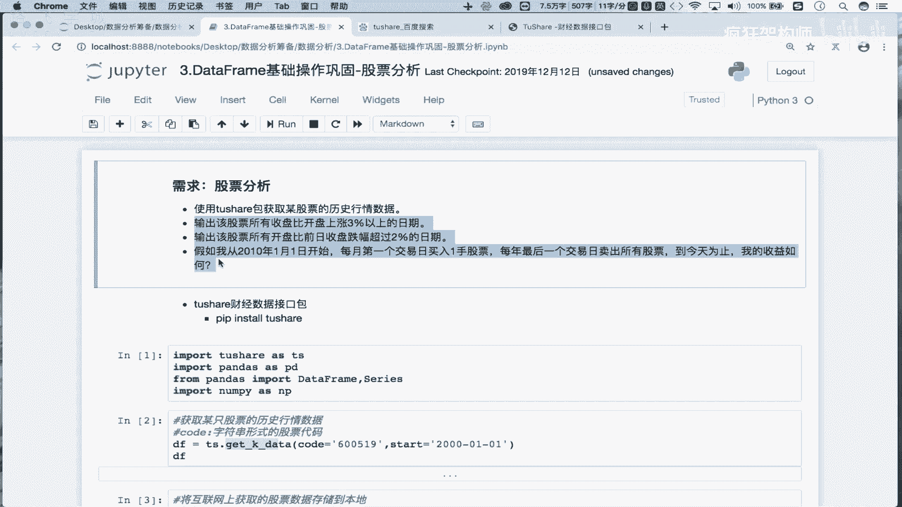