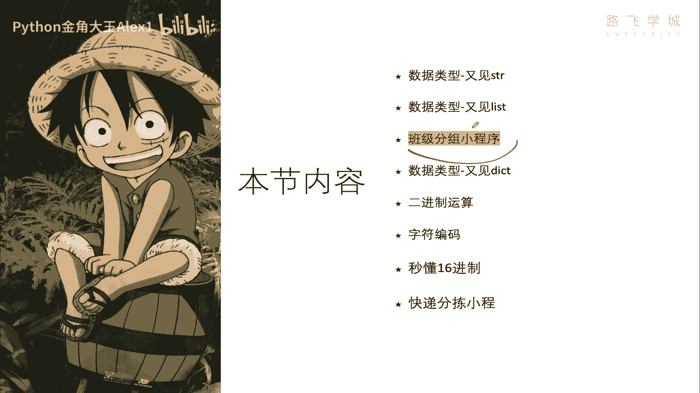
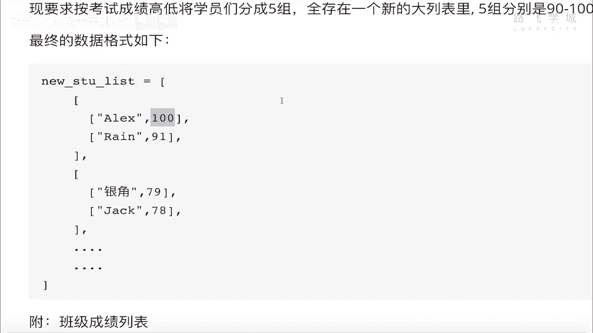
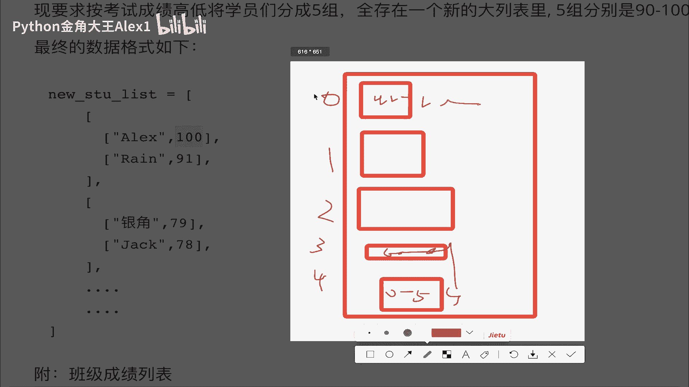
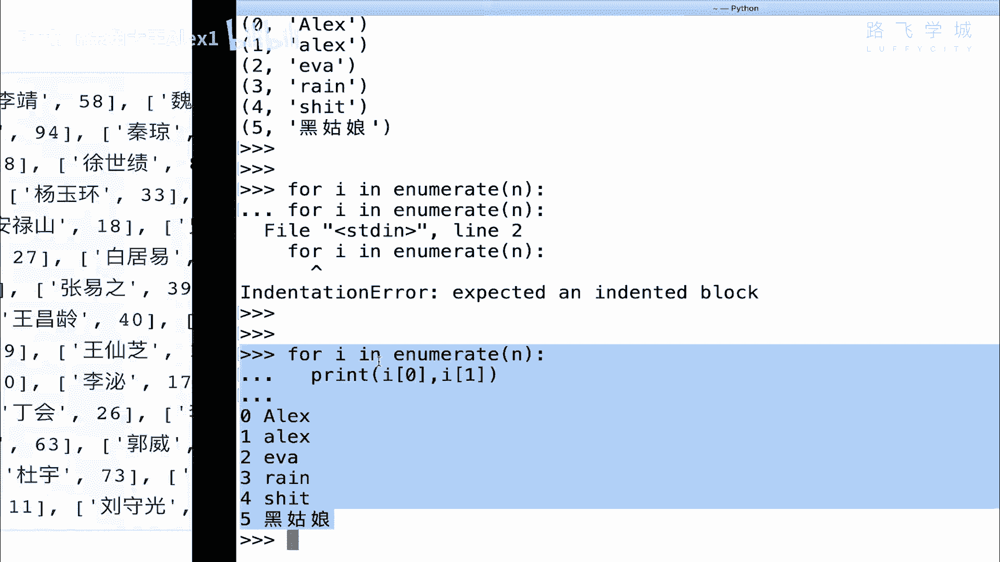
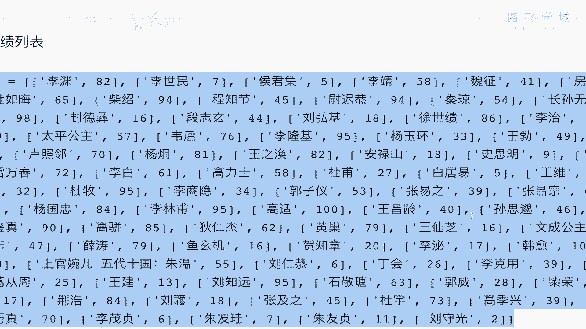
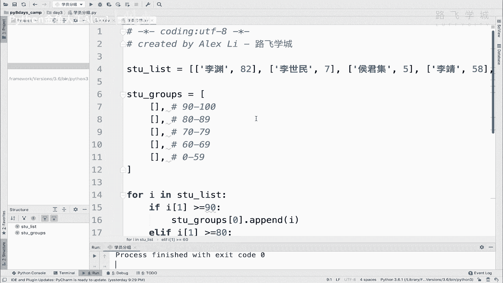
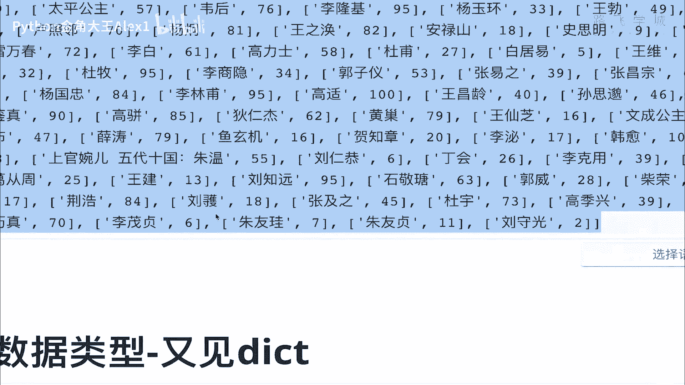

# 【2024年Python】8小时学会Excel数据分析、挖掘、清洗、可视化从入门到项目实战（完整版）学会可做项目 - P32：04 班级按成绩分组小程序 - Python金角大王Alex1 - BV1gE421V7HF

OK同学们这一小节呢咱们就学一个练习题，这个练习题叫班级分组小程序。

就是为了练我们一个列表的，咱们直接来看需求好不好，诶，这个需求呢是这样啊，假如说你们班现在有五十五十五个人好吧，50多个人吧，然后呢每个人的姓名和成绩啊，它存在一个大的列表里，看到没有。

哎这个一个大的列表里，每一里面有一个小列表啊，第一个元素是姓名，第二个元素是你的成绩好吧，TX考100分啊，我弟弟考的少，黑姑娘呢天天玩打扮自个儿对吧，考的少更少啊，那总之呢她的需求是这样。

我要求你呢咱们这个班要按成绩来分组啊，这个一共分五组对吧，这个分完的这个组呢全存到一个大的列表里，这五组呢分别是90~100分的，在一组80到九八十九的，一组七十七十九的，60~69的。

然后呢就不及格的，再放一组，这种差生就直接拉出去斩了啊，那这个最终的这个数据格式是这个样子的，看到没，最终也就是说你产出的数据格式，要这样一个大列表里面套一个，这是这一组的列表，看到一个大一个组啊。

这是另外一个组对吧，这一组里面就是90~100的，这一组就是应该是这个什么呀啊70到啊，就这就这啊，这组应该是70~79的对吧，总共是五组，然后组里面又有小的，看到没有，所以我要求你变成这种格式对吧。

从这种格式变成这种格式，你说怎么弄啊，你怎么弄，我在这里呢已经帮你把这个什么呀，这个这个学员列表给你列出来了，省得你自己做了啊，你看这里面都是一些这个你的同学们都很牛逼，还还咱们太平公主，Anyway。

那总之你想想怎么实现对吧，变成这种格式，其实啊你你这样啊，你自己先嗯，我先给你思路吧，其实无非就是说判断这个后面这个分数的高低，根据分数高低，然后呢对吧，把它添加到不同的这个小组里面去。

是不是其实就是锻炼你这个操作啊，好像什么思路啊，或者我再告诉你一个思路吧，其实很简单。

就是你生前首先有一个大列表对吧，然后呢大概一个大列表，对不对，大列表里面先生成几个空列表，空的就代表五组吧对吧，然后呢这五组是不是都有位置啊对吧，这个是一啊不对sorry，这个是零，对不对。

1234这个索引你都确定好了对吧，比如说这个第四这个索引为四的，就代表是0~59的，是不是，然后呢这个就是代表60~69的，对不对，那就一样的，就是91~100的对吧，然后你就判你就循环你这个列表里的。

就循环这个数据源里的这个每一个小元素，然后判断它里面那个值，如果是如果是对吧，是哪个区间你就给扔到哪里不就完了吗，就这么简单嘛对吧，思路都告诉你了，你现在暂停视频，不要看往后看，然后自己憋个20分钟。

或者写个写个20多分钟吧，看看能不能写出来，如果实在写不出来，你再继续看后面的视频，因为下面我就讲代码了好吗，我就是这个思路啊，我就是这个思路啊，这个生成几个大的空列表。

然后呢去循环我那个循环我这个什么呀。

循环我这个数据源，哎，Sorry sorry，循环我这数据源，然后拿着每个去判断，判断完了决定扔到哪个列表里好不好，OK那我就写了啊，咱们在这里生成一个叫叫什么呀，学员，学员分组好吧，学员班级分组。

然后呢，我首先说一个class list啊，叫什么啊，先把那个s t u list拿过来，好不好，拿过来啊啊。

就TP过来，大家看啊，这里有，你看还挺多，值的是吧，那值不管它，然后呢，我们就在这里给他上一，给他这个什么，你当然你正常循环他对吧，就是每个打印它就是这个，对不对，就是那么一些值嘛是吧。

然后我先生成一个大列表，就叫啊new s t u r s t u groups s t u分组了吧，一个大列表，大列表里面呢我生成五个小列表，看到没有啊，这个是91~130。

按CTRLD它就生成好几个是吧，生成五个小列表，然后这个是80~1个89是吧，这个是七十七十到八十七十九对吧，然后这个是60~69，是不是，然后零啊到这个啊，59，OK就这么简单啊。

然后你就循环你的列表就行了呀是吧，I index s t u list，然后呢判断判断你这个拿到底拿到它的分数嘛，是吧，if if i1是吧，I1就是它的分数嘛，如果I1属于是这个叫什么呀。

大于大于个90对吧，那你就给他放到什么呀，放到这个s t u group里面的，相当于是是不是索引，第一个就是零里面的append，你的什么呀，I不就可以了吗，对不对，elf如果I1这个什么呀。

大于个80，对不对，不大于90不就大于80嘛，对不对，大于80你就是一样的，好简单超级简单，这个啊把这个一对吧，就放到这个里面去，对不对，然后再来判断FLF是吧，这个i sorry。

AI1大于个70对吧，然后我们就给它放到这个里面去对吧，看看不是I1I2是吧，group2就放到这个这个这个大于70对，大于70，大于等于一个阶段是91哦，Sorry，应该是应该是90。

那这个应该是大于等于90，单元要包括对吧，大于等于80，大于等于一个70，对不对，放到这个70里面，再下面一个就是一样的呀，就是69了，69大于等于一个60是吧，再一个，否则就全都给他放到，什么里边呀。

放到这个，最后对不对，0~59，那就减，那就完了，一定分组程序就写完了，Sorry，就这么简单，同志们，咱们来for for i in这个in这个student groups，对不对。

然后for group，然后呢print你的不看着真的不就可以了，同志们就写完了，这才几行啊，超级简单，是不是咱们来试一下啊，出错啦，说什么错了呢啊list in in index index啊。

这个这这叫什么来着啊，列表的取索引的操作必须是数字，而不是这个啊，必须是数字，咱们取的不是数字吗，HOON啊，哦哦哦sorry sorry，这里写错了，I下面的一看到没有，他说那个取列表的这个索引啊。

这个必须这个这个值必须是数字，咱这个写了一个I了，写错了啊，你把元素放一起，这样看到没有，取每一个每一个元素的这个成绩嘛是吧，大家看出来了，就这么简单，你看啊第一组是不是90分的，全都是90分。

90分以上的对吧，哎你看这几个人，这个李存勖啊，李隆基，他把唐玄宗是吧，杜牧诗人李林甫这个首相，然后韩愈是一个也是一个诗人吧，刘知远是那个叫叫叫后唐后唐，什么什么什么后唐是石敬瑭是吧，长孙吴。

这什么85分李渊啊，房玄龄这还挺好，Anyway，哎我操李龙，李世民竟然不及格，我操得了个七分，哈哈LV同志们，这是不是就搞定了，就是这么简单好吗，哎所以其实你会发现好多东西其实很简单，语法很简单。

只不过是一个思路的问题，是不是好的啊。

这个就是咱们列表，你把这个自己能独立做出来，列表的一个基本使用。

你就会了。