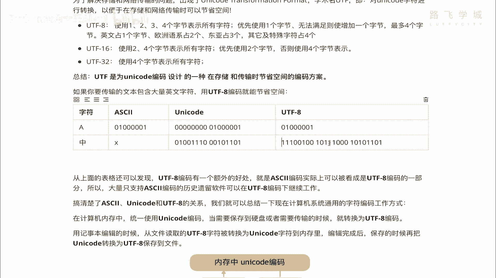
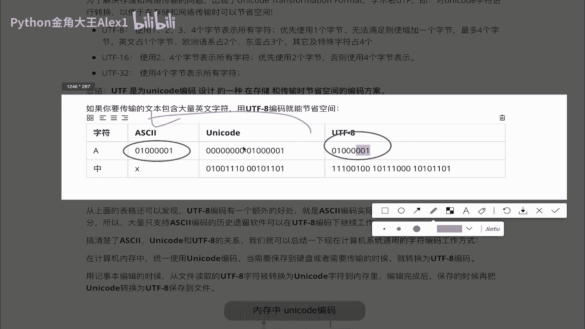
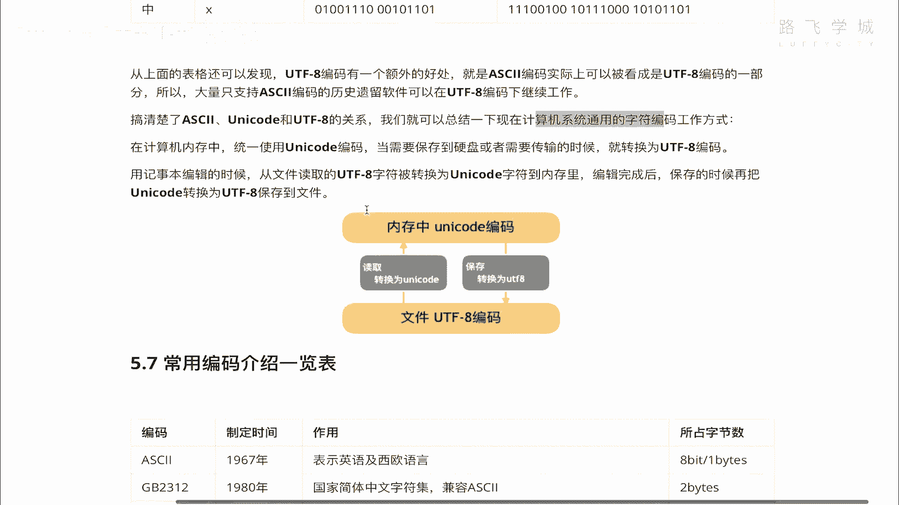
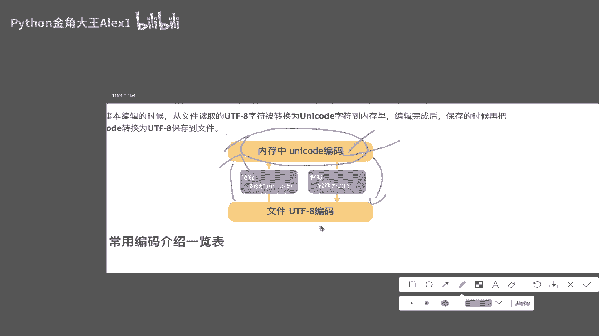
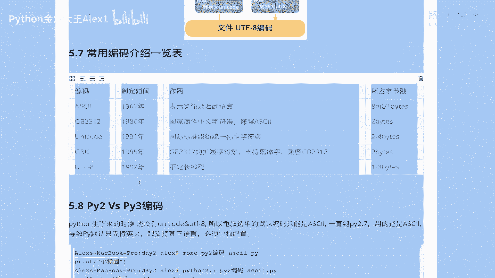
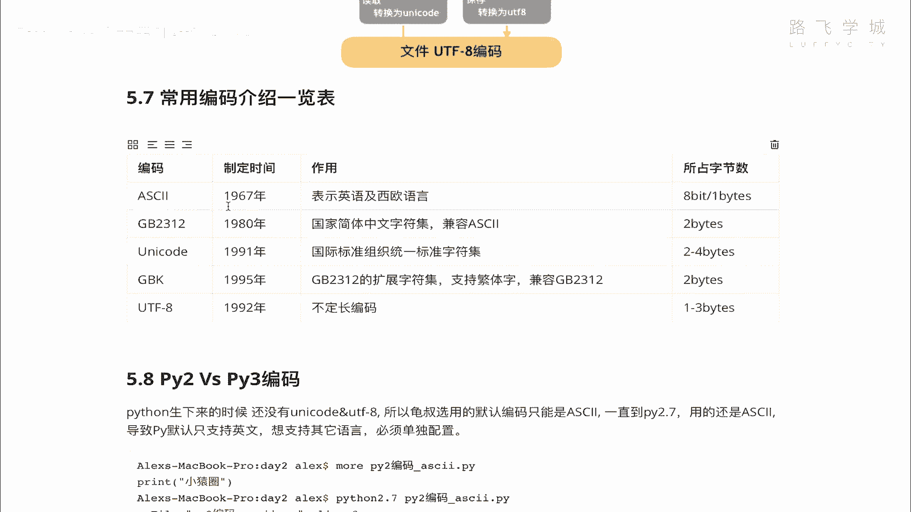
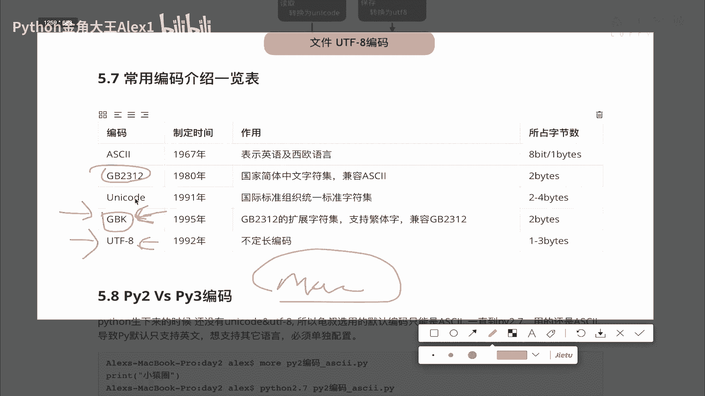
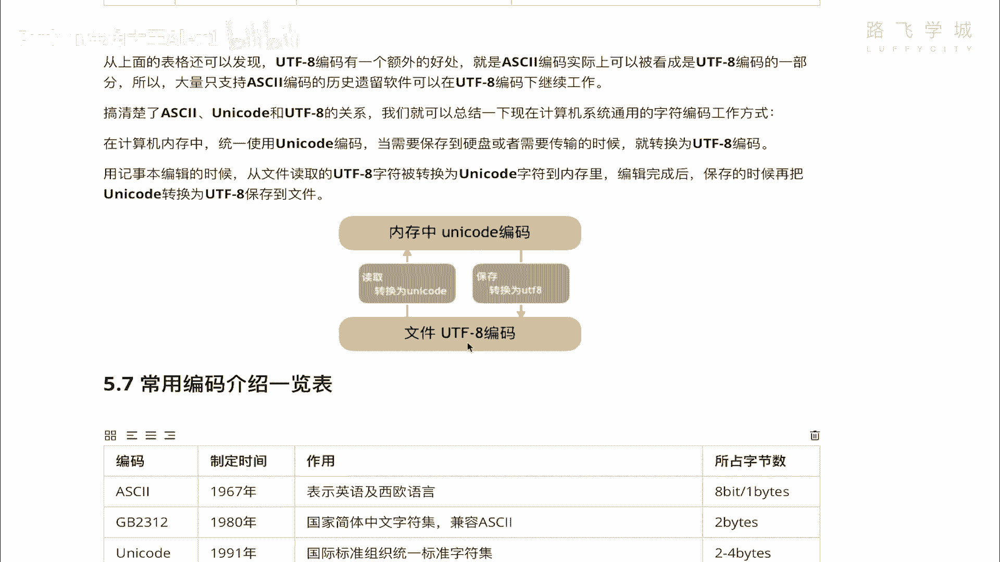

# 【2024年Python】8小时学会Excel数据分析、挖掘、清洗、可视化从入门到项目实战（完整版）学会可做项目 - P39：11 utf8又是个什么鬼 - Python金角大王Alex1 - BV1gE421V7HF

OK同学们上节课呢咱们通过学这个叫什么呀，UNICODE啊，这个万国码我们知道哎，它可以支持全球各个语言了对吧，就没有乱码的这个问题了，但是新的问题又带来了什么新的问题呢。

大家也知道这个unit code，它这个存储所有字符对吧，常用的字符怎么会常用的字符是两道啊，两个字节，然后呢特殊字符是3~4个字节，对不对，也就是说什么常用的一个中文，一个英文字母都至少占两个字节。

比如说我存一个大写的A对吧，他至少要占用两个字节，存一个中国的中，他也占用两个字节对吧，哎那咱们JBK占两个字节没问题啊，本来就是一样的嘛，都在GPK也是两个，但是这个可就麻烦了。

因为在然后在这个阿斯克码表里，对不对，阿斯克码表里一个英文字符是吧，一个英文字符，这是阿斯码表啊，一个英文字符是占一个字节的，对不对，但是也就是说如果改成你这个UNICODE，那问题就大了。

我一个十兆的文件，对不对，十兆的一个文件立刻就变成了20兆，什么也没变，就是改了一下编码，夸就20兆，对整个的对吧，美国人说我靠，你这不是这不是抢劫我的这个硬盘存储空间嘛，对吧。

那这个硬盘价格随声上涨是吧，随声上涨应声上涨啊，但这是无法容忍的啊，美国人说你不行，你不能这么干啊，其实我告诉你，由于咱们现在这个内存空间特别大啊，内存空间，基本上你的电脑也是八个G。

或者是16个G更大，甚至还有32个G的个人电脑，所以呢也就是说一个这种字符串啊或者什么的，你怎么讲存在在内存里啊，也就是在内存里啊，这个你存成两个字节对吧，存成三个字节也就无所谓了。

因为反正我内存空间大都是临时存储嘛，对不对，但你存到硬盘上可就不行了，你真正存到硬盘上，同志们诶，你真正存到硬盘上啊，它变成了两个字节，那你这个可是永永久存储，是不是永久存储，包括你网络传输。

这个网络传输大家知道网速依然是不够快的，现在5G还没普遍，对不对，那网络传输的时候，明明咱们都你想传的快，那肯定要对，这个人家还想研究各种压缩技术，是不是把你这个啊把你这个文件快速的传过去。

你这倒好对吧，我这个一兆变两兆单车变摩托，是不是啊，那这个肯定受不了，所以呢像这种啊，这个UNICODE它虽然好处是解决了乱码，所有的乱码，但是坏处带来就是在这个遇到网络传输，或者是存到硬盘上的时候啊。

它的空间这么大，是是导致这个效率降低，对不对，导致硬盘空间使用大了，导致网络传输速度慢了，对不对，产生速度慢了，所以呢这是无法容忍的，那为了解决这个问题呢，哎人们科学家们又研究出来了一个什么呀。

叫UTF8的一个编码，明白吗，这个UTF8的一个编码是什么意思呢，它的全称叫unicode transformation format，什么意思，它叫UNICODE，也就是说在哪里呢，我空了啊。

对看到没有，Unicode transformation，就是UNICODE转换格式，什么意思，也就是说，当你涉及到文件存储和网络传输的时候，我就把你这个uni code的这些编码。

按照压缩技术看到没有，按照压缩技术给你转换成省空间的一种方式，这种转换的这种压缩转换的技术，就产生了一种新的编码，这种新的编码叫做UTF啊，UTF明白吗，Ut f，然后为什么这里强调一个UTF杠八呢。

因为UTF它有好几种版本，只有这个八版本是最流行的，那他有几个版本呢，Ut f8，U t f16，UTF32什么意思呢，32就是所有的UNICODE字符啊，都用四个字节来表示，这他妈哪压缩了，哪优化了。

我对吧，明明我在这个UNICODE占两个，你这全都变成四个了，所以这个很显然就没法用了，所以没人用这个UTF16对吧，UTF16呢是说使用两个或四个啊，两个或四个对吧，优先使用两个，否则使用四呃。

就是两个不够，再用四个，那不跟我UNICODE本身一样吗，对不对，所以呢这个也没用，用起来也没解决问题，真正解决问题的是UTF8，它使用12344个字节啊，来表示所有的字符，1234啊。

什么是什么情况呢，首先优先使用一个字符啊，如果一个字符无法满足，再增加一个字节啊，首先使用一个字节，写错了一个字节，最多使用四个字节，它规定了如果你是英文，你就占一个字节啊，英文字母吗，如果是英文字母。

你就占一个字节，欧洲语系，比如说像一些什么西班牙语，拉丁语，说什么俄俄俄俄俄语什么来什表达的，这种就占两个字节，东亚的日语，韩语，中文这些都占三个字节，特殊的占四个啊，显显显显。

而咱们这这个其实用了UTF8，中国人就比较吃亏了啊，相比UNICODEUNICODE中文是占两个字节，在UTI8里占三个，但是啊我泱泱大国地大物博是吧，不跟他计较，所以三个就三个吧。

OK所以这就是UTL8，它又叫可变长的编码，就是可可变长，也就是说它是1234嘛，根据情况你是英文，你就一个你是中文，你就三个欧洲的，就用两个，明白意思吧，诶这个就是一个什么呀，设计出来这个UTF8。

就是可以用来在存储和传输的时候节省空间，明白吧，当然传中文并节省不了对吧，还增加了空间，但是传英文节省了，注意啊，这个整个国际的这种各种组织，都是美国来主导的，是不是啊，那个时候你出现这个东西的时候。

那个中国咱们也不强啊是吧，也没办法跟他抗衡，所以就只能这么办了，anyway啊，到现在为止，UTF8就是咱们这个网络传输使用的，或者是存到文件里使用的，最通用的一种编码格式。

明白意思吗啊它在内存里是UNICODE，但是在硬盘上就转成了UTF8K，然后呢你听听就行了，你现在不用死记硬背，你说啊，这不是吧，你先理解就行了啊，对应的关系看看啊，这里有一个英文字符A。

这里有一个中用阿斯克码的话呢，它就是一个字节，阿斯克码表示不了中文，那用UNICODEUNICODE，大家看英文就是两个字节，中文也是两个字节啊，但是到了UTL8，英文还是一个字节，中文就是三个字节。

看到没有，那大家会发现一个问题，在这个UTF8里面，这个是一样的，看到没有，也就是说UT8遇到英文直接是采用的U，直接是采用的阿斯克码编码，你明白吗，他如果遇到英文，它是直接采用的阿斯克码的编码。

明白吗，所以这个怎么讲，你可以理解为阿斯克码，现在已经变成了UTL8编码的一部分，明白吗，编码的一部分好啊，这也会导致所有用一特别老的时候，它只那种一些软件，它只支持阿斯科码，对一些历史遗留软件。

现在在UTL8下也可以继续工作，因为UTL8直接进入阿斯科码，明白这意思吧，OK好，那我们搞清楚了阿斯克码，UNICODE和UTF8的关系之后啊，我们就总结一下，计算机现在通用的这种字符编码。

这个这个工作方式，第一个它在内存里。

大家看这张图啊，这张图它在内存里，咱们现在啊这个基本上都是用的UNICODE，你跟各个语言呀，各个软件呀，在内存里都把它是变成UNICODE，明白吗，这是万国码，然后呢到了这个这个什么呀。

你要存到这个硬盘上啊，存到硬盘上呢，那你就要干嘛呀，把这个UNICODE转换成UTF8，看到没转换车有一个转换的过程啊，以后怎么转，具体代码上怎么转，我们以后交啊，那你硬盘上的文件啊，在硬盘上。

文件存的这个格式就是UTF8格式啊，你一个这个什么文档啊，这个各种文档形成的就是一个UTL8格式，然后如果你想把它读到内存里，你就需要再把它从UTF8转成UNICODE，明白这意思吧。

内存内是UNICODE，硬盘上是UT8，中间需要转换的过程，OK这个就是目前的这个啊，主流的咱们使用编码的这种就是存文件呀，网络传输啊都是用的这个东西。

OK好吗啊，这个知道了之后，我们最后再来说一下这个常用编码介绍啊，常用编码介绍这个阿斯玛说了，GB2312unit code啊。

然后GPKUTL8这些都说了，那有的同学说现在都用UNICODE了。

都用UT8了，是不是像咱们中国的这种GBK啊什么的。

GB2312就退出舞台了呢，注意了，我告诉你，首先GB2312基本上快退出舞台了，新的网站都不用这个，基本因为它太老了，你你可能到一些三四线城市的，什么那个政府信息网上对吧。

这个这个就开发了好多年的网站上，就网站上可能还能看到这种GB2312，现在中国咱们系咱们这个九零后的程序员，零零后的程序员写写软件，基本上都用UT8格式，但是八零后的程序员啊，一些历史遗留问题的软件。

还是用的GPK比较多，另外一点就是说我们国家政府强这个名，就是这个这个政策，要求说所有微软的系统进入中国啊，微软的系统进入中国，默认编码是要g pk，虽然有这个啊通用嘛。

但是呢我们一直就说不想被人制肘了啊，被人制衡，所以就是说这个嗯你来中国这个系统，这个操作系统默认要支持GBK，所以咱们的windows系统上你默认编码其实是GBK，明白吗，它不是UTF8啊，默认GPK。

但是我的Mac电脑，我的Mac电脑啊，默认是UTF8，默认UTF8啊，这个windows是GBK，OK这个就是咱们的什么呀，常用的就是机械编码这些关系啊。

好了最后最后还剩一点时间，我们再补充一下，也就是说在Python里面编码的问题，你大概听一听就行了，这里你不需要太记住啊，因为啊我觉得你们很幸运，你们现在开始学python3，你不用学python2。

在学python2的时候，很多人没搞懂编码这些细节的时候，他在使用python2就遇到各种各样的编码问题，非常的痛苦，我之前学的时候就是哎呀一会儿就乱码了，一会儿就出错了，好痛苦，我又不懂。

我那时候也搞不清楚这些编码的逻辑，那我说为什么呢，是因为python2注意了python2是哪年诞生的，python2他可是89年诞生的，在89年诞生的时候，我问你那个时候有这个什么UNICODE吗。

没有IUNICODE是91年诞生的，所以他刚开始诞生的时候，他没有unit，它只没有unit控制，它只能用一个编码叫阿斯克码，对不对，阿斯玛67年就有了，那阿斯玛问题就是它只支持英文。

但是python1开始，所以python2里面就是默认值，它的默认编码就是阿斯克码，所以呢如果你写中文会报错，他是不认识的，明白吗，如果你想让他认识中文，你必须明确的告诉他啊，我写的这是一个中文才行。

所以在才涉及到在python2上明白意思，在python2上你要写中文，你必须要提前进行一个声明，在文件的开头进行一个声明，明白意思吧，来我们可以啊，给大家演示一下，你你看一看就行。

你电脑可能也没有装这个东西好吧，然后呢啊我在这里写吧，啊这个PY2啊，中文好吧，然后呢这个必须要声明什么呢，声明这个东西看到没有啊，这个一个井号，一个减号星号，然后coding ut l8。

当然也可以这样写啊，当然也有人直接啊，直接这样写，应该是对吧，UTL8也行啊，反正这就是它有好几种写法，有好几种写法，这个你可以有空自己去官方查一下，我一般喜欢这么写，你只要这么写。

其实就相当于告诉你的Python解释器，因为Python写在开头了吗，Python解释器一解释，它取到第一行，看到说这里面有一个UTL8，就知道说下面这些文字，下面这些东西我需要用这个UTI8来去解释。

明白意思吗，我需要用UTY来解释，如果你不写这个东西，我告诉你，你不写这个东西，你直接在这里print一个啊对吧，亚历山大啊，金角大王吧，金角大王八大王啊，Fuck。

那这个时候你用python3执行没有任何问题，但是你用python2的话会直接报错，咱们来看一下我在这里我的操作系统啊，我的操作系统默认自带一个python2，看着一点进去是python2，点7。

0是吧，现在官方已经不更新了啊，我直接用这个来去执行我的代码，day3里面的一个什么呀，PY中文看着直接报错，大家看是不是报错了，它显示一个说语法错误，NASA字符这个东西不认识是吧，不认识。

因为我python2默认只支持阿斯克码，我用阿斯克码编码来去处理这段代码，发现处理不了，因为这个我不认识，我不认识，所以你必须告诉他，你说哎这个兄弟啊，这个什么呀，这个这个你你你。

你别用你自己默认的那个编码了啊，默认的方式处理了，你用这个什么呀，阿特你用我这个告诉你的UTF8好，这个时候你再执行，大家看是不是就OK了啊，所以在python2里面写中文必须要声明。

现在我都是python3了啊对吧，我这个创建一个文件，我告诉你不需要写的啊，我这个只是说一创建它就会自动写，是因为我配置的模板，但是你其实不需要写，这说明了人python3里默认它就是UNICODE。

明白意思吗，默认在内存里就是UNICODEDEFD3里O，所以你写的中文直接可以被认认识好吗，同志们，这个就是在python2和python3的一个啊，一个情况你先大概知道就行了，你也不用自己试啊。

也不用自己试，那到此为止，咱们的编码就彻底给大家讲完了，具体编码之间怎么转换，因为刚才讲说对吧，存到文件里要转呀对吧，从文件里读进来也要转啊，这种转换等我们再讲文件操作。

