# 【AI云量化】股票策略第2讲，量化策略代码学习 - P1 - 量化策略学习 - BV1mf421Q7xs

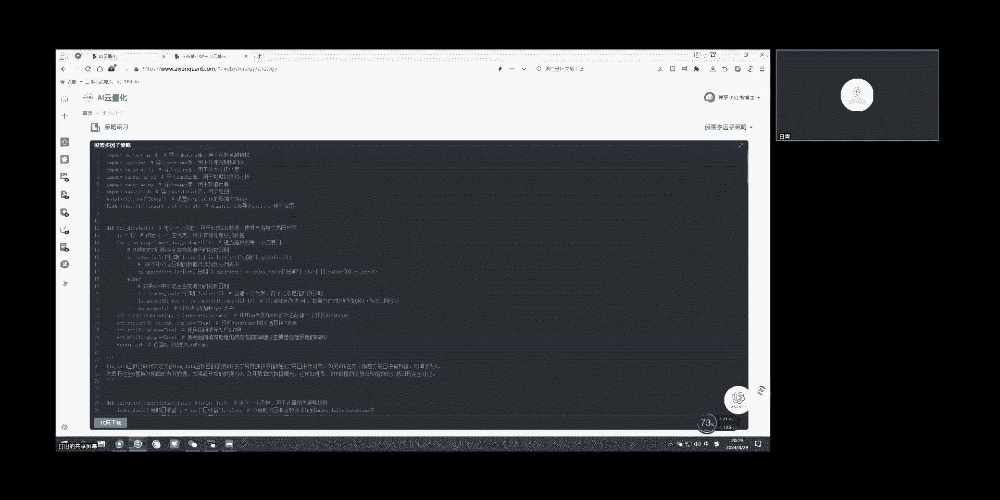

好处理好数据，校对数据之后就进入下一步，我们定位到145行。

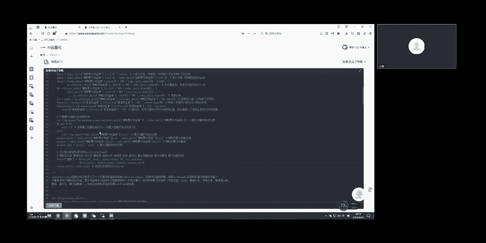

145开始。

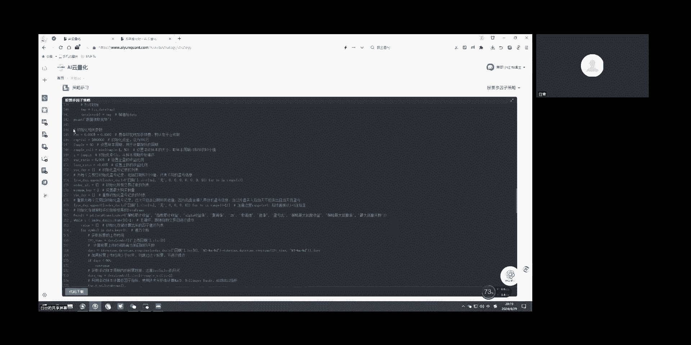

就可以看作是一些初始的相关参数，比如涉及到费率，本金滚动样本窗口止盈止损值等，还有一些我们啊里面会用到的初始化，每日的收益情况，每笔信号记录等这些信息，定义好初始参数。

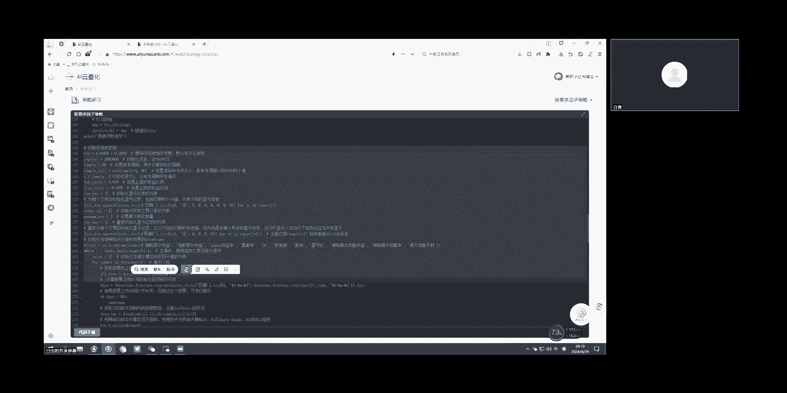

那我们就进入了回测框架，就是从这个while循环162行开始。

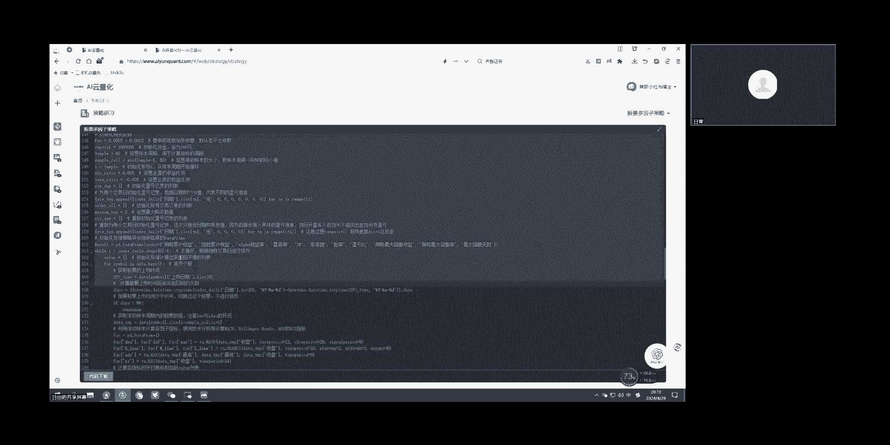

这个I是指指数嗯，是是指数据索引下标，就比如说我总共有五八百个交易日，因为他前面数据已经处理好了，假设我I放在40，就代表从第40个交易日开始来，来进行这么个处理，进入循环，那首先就要计算因子。

这里面163~179。

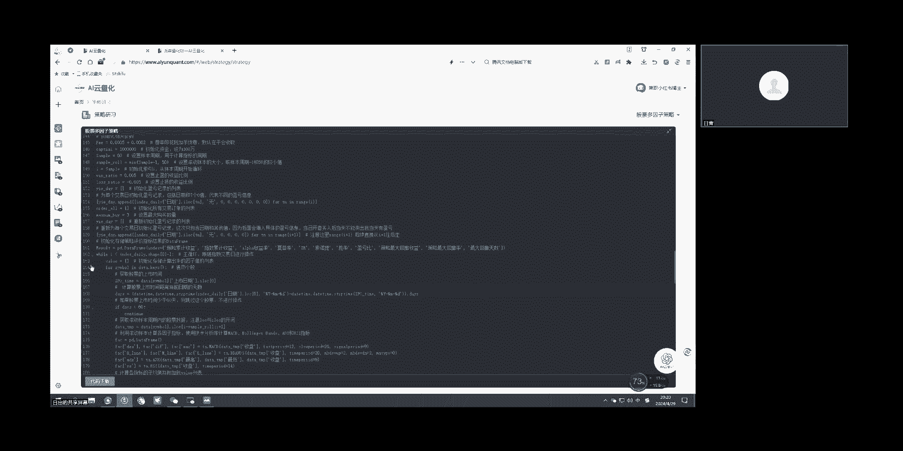

这些都是计算因子的呃相过程。

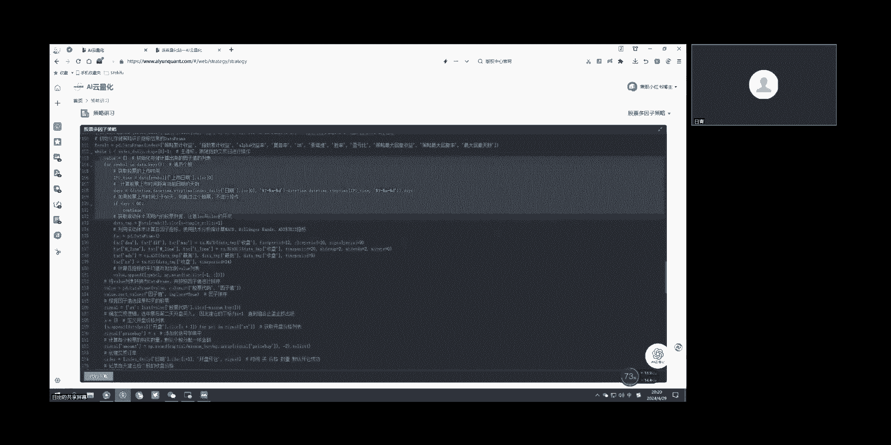

这里面大概的一个比一个意思，就是说我假设现在data点key里面，假设有十只股票，我现在我要一一对他们进行相关指标，那么这样的话，他后面我会把这个指标都统一计算一个值，放到value这里面。

所以你整个下来，那就相当于每只股票都有对应的一个值。

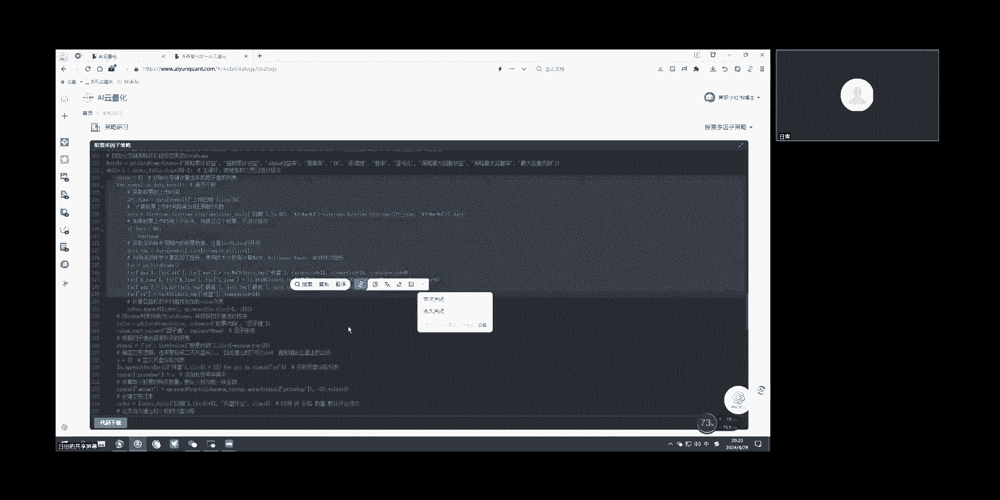

呃这就是我们常常理解为的，比如一个前面的初始的指标计算，然后嗯后面的话，它还会对这个值进行一个简单的处理，比如说这里很简单，就是用个排序，我升序谁在前我。

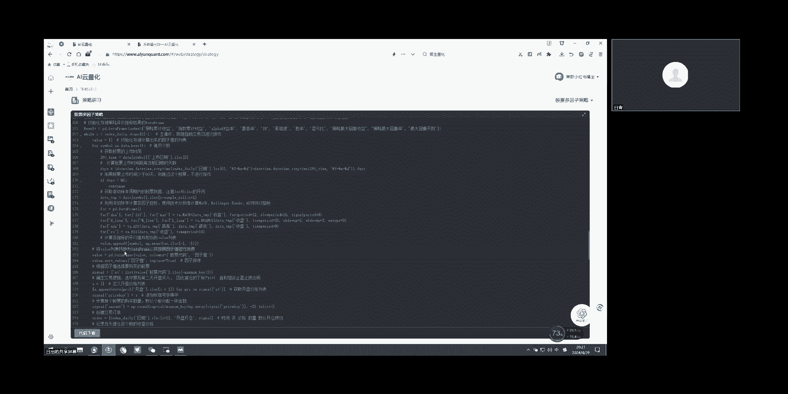

我到时候我就选前面五个，或者说选倒数最后五个，就是用这种方法呃来来确定最终我选哪些股票，嗯我们可以看到从这个186开始，这个single它就是记录，就是一个字典里面记录你这次买什么票。

因为他是呃我们这里最大好像是最大，是选了三还是选了五，忘了啊，就嗯这一次我最多是选了这么多票，然后每支票它对应的买的价格是什么，它对应的数量是什么，然后我会把这次的交易订单，我先把它记录一下。

还会把开仓之后，它当天是有收益的，那么计算一下，这里呃有一个点就是189行，我这边有个I加一，它的嗯，就初学者他可能不理解为什么是I加一，不是I，这里面要根据他代码来来来揣摩他的意思。

就是我们从DI开始拿数据，但是我为什么是I加一开盘，这里写了开盘才记录，那么它的一个逻辑就是说，假设我今天截止之后，我根据这个信号处理了得到了哪支票，那么我是想打算第二天开盘买。

所以他们的价格都是第二天的开盘价，通过这个索引的这个下标I加一来确定嗯。

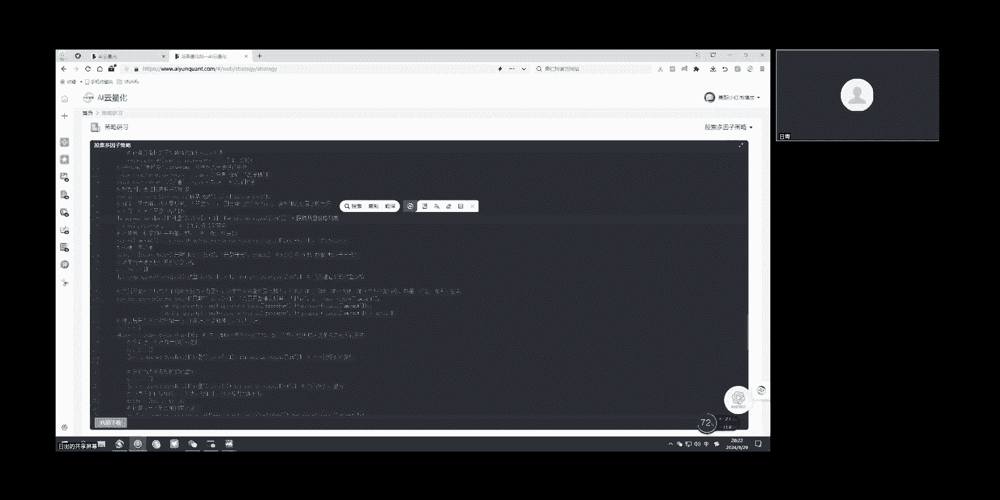

然后看到第204开始，因为股票它是T加一，所以你你本来是用截止到I的这个数据，去计算了信号，I加一你开始买了，所以你你真正能卖的是要还要再隔一天，那么就是I加二开始就进入了一个平仓，那进入平仓。

同样我们就可以计算相关的持仓收益，你可以计算根据上面的成本，我们前面有记录他开仓的价格就和数量，那么你就可以计算当前时刻它的嗯，价格跟刚才说的这些，你可以计算一个累计的持仓收益。

你也可以计算今天跟昨天对比的一个持仓收益，就这一块其实是开放的，就大家哦，你不想这样止盈止损都可以就在这边去改呃，这里会嗯提供了按止盈止损来进行一个触发。

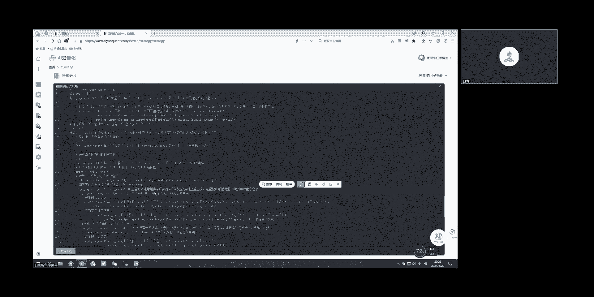