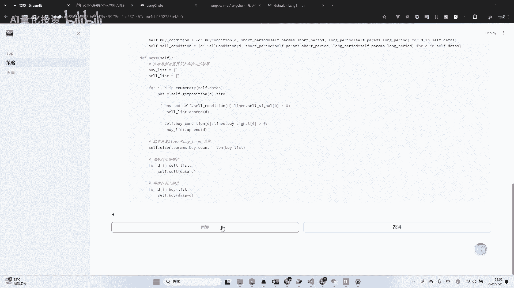
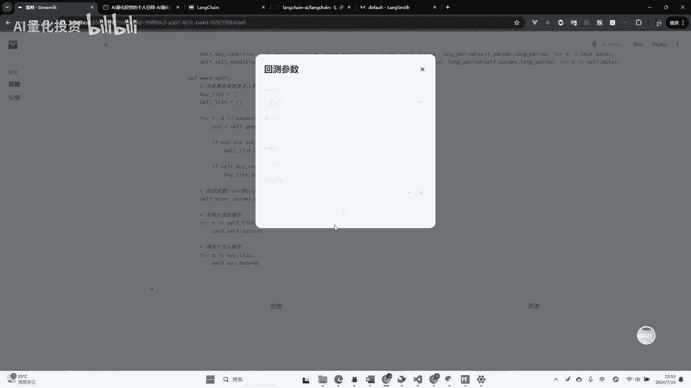
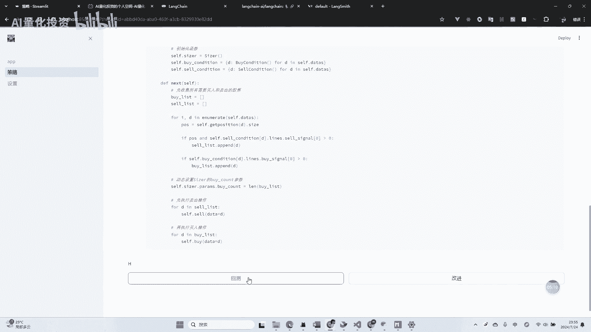
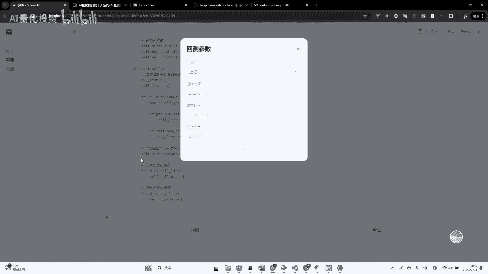
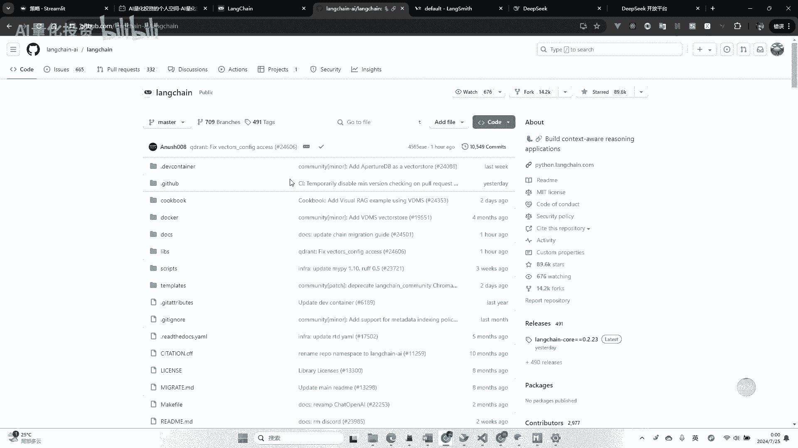
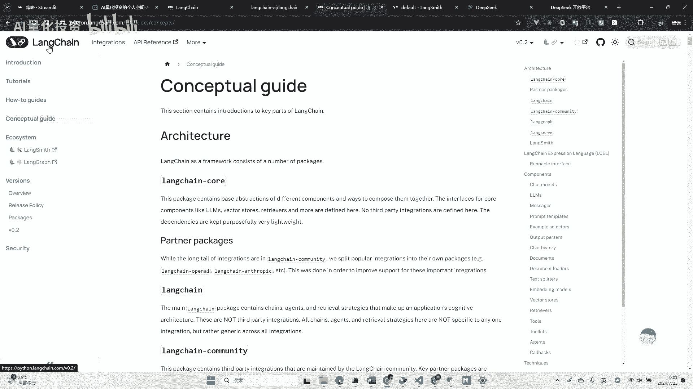
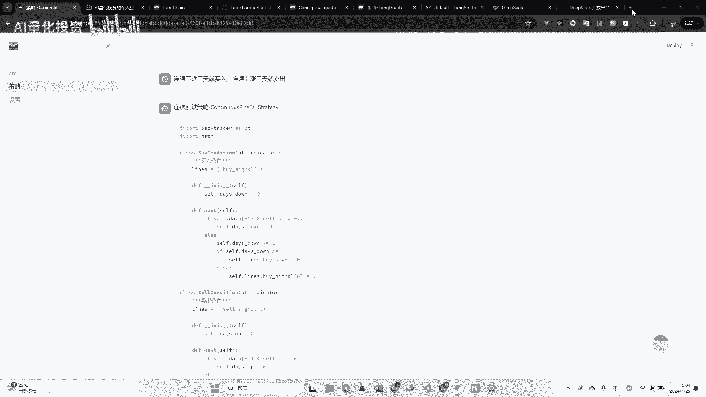
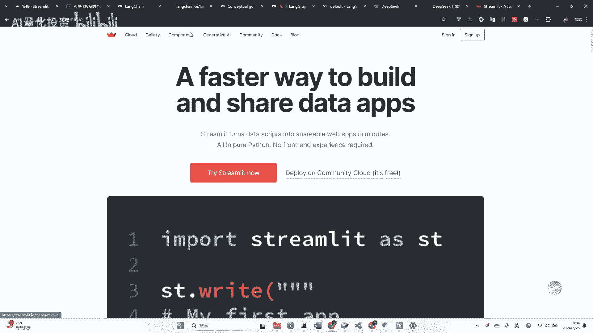
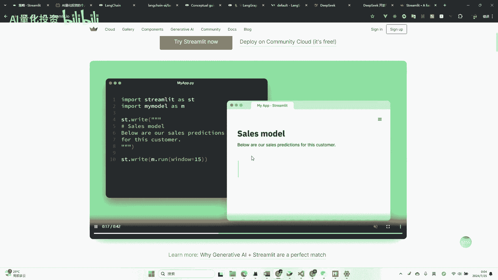

# 【AI写量化（二）】大模型辅助自动编写量化策略并运行回测 - P1：20240724_235026 - 量化投资技术 - BV13ZeRepETg

大家好啊，这个视频呢继续给大家分享一下嗯，如何用这个AI辅助我们编写量化策略，并进行一个回测啊，首先我们还是来看下效果啊，嗯这里的话我还是自己做了一个小工具，然后这里的话就可以像叉叉。

GBT一样的输入一些文字啊，我们还是双写双均线均线策略啊，上双均线策略，然后呃让他们帮我们编写一个这个策略啊，额这个工具呢，其实我目前呢就接入了，我之前介绍这个deep thick啊，这个大模型。

然后用他的API进行一个生成啊，这个后面的这个呃技术细节呢，我可我在这个视频后续呢会大概讲一下啊，然后这里的我们现在正在生成，等待一下这个生成的时间呢，还是嗯目前还是比较长的。

大概需要50秒到一分钟左右啊，啊因为其实虽然这里只输入了五个字，但是我在这后面其实做了很多工作的啊，然后大家等待一下咳，呃然后可以看到目前这个双均线策略呢，就嗯这个生成成功了。

可以看到这里的代码还是不少的，可以看到嗯，这是按我规定的一个策略模板去写的，这个策略模板呢，我在上一个视频，这个mean in camt和back trinder如何结合的时候呢，嗯也用到了这个模板啊。

那那它生成这个策略，我们试一下能不能真正的运行呢，我们这我在这里做了一个回撤的按钮。

然后有几个参数都是我预先设置好的啊，这里股票池呢我们选上证五零啊，然后啊起止时间，结束时间呢就是自己大概选一年时间吧，嗯近期一年时间，然后这个回测呢，其实就基于我上个视频分享的那个嗯。

呃QMT跟BACKTRINDER结合的那个库啊，我用到了那里的数据源啊，也就是说这里的这个回测呢，需要我们在本地启动QMT的数据源啊，客户端才能进行一个这个回测啊，然后我们现在试一下啊。

因为是AI写的策略，我也不确定能不能回撤成功，我们大概试一下呃。

回测的话呢，因为他调用本地的这个还是挺快的啊，可以看到现在这个嗯他就回撤成功了啊，然后我这里呢，结果目前我就简单的画了一下，这个额市值的账户的这个资金的这个曲线啊。

嗯可以看到大概是这么一个啊这么一个走向啊，嗯然后当然这个这个策略的这个啊，就是一个测试策略了啊，它并不一定嗯这个啊有什么实际的价值啊，那这样的话可以看到我们这一个额量化策略呢。

就从生成到运行呢就由AI帮我们去完成了啊，嗯要比我们自己手动写的要快很多，那我们再试一下，再试一下其他策略吧，因为双均线策略呢这个比较经典嗯，可能AI比较了解对吧，那我们来试一试一个比较也不算太。

也是一个简单的一个策略吧，因为目前太复杂的，我还没有测试嗯，比如说一个经典的老太太策略啊，连嗯连续十下跌三天就买入啊，连续上涨三天就卖出对吧，嗯就这样一个无脑的策略，我们让这个AI帮我们写一下嗯。

嗯这个还是要等待一会啊，我们再等待一下啊，然后在等待的过程中呢，我们可以看一下，其实我这里用了long串，后面我们会介绍一下这个框架，然后他long串现在有一个long斯smith，它是可。

这里呢是可以看到那个那个我们嗯，就是每个策略运行的时候的消耗的token，还有呃他的时间呢，比如刚才我们生成那个双均线策略呢，大概有用了48秒，然后用了这个2000多个token啊。

然后我们现在这个策略呢还在生成中啊，啊这里可以看到，我们这里也可以看到，我们正在这个嗯执行的策略啊，啊这个这个工具呢都是这个long传，这个框架官方带的啊，现在可以看到这个是这个策略也生成了。

然后我们可以看到这里的话，他应该啊他这反应有点慢，他也他也完完事了啊，这里大概45秒，用了1900多个token啊，嗯这个策略我们再给他回测运行一下啊。

还是依然用上证五零嗯。

然后回测的话回测的话还是比较快的，因为我们是本地的话，用用这个嗯BACKTR点跑的啊，啊可以看到这个曲线也画出来了啊，呃就说明这个回测的额策略呢实际运行了，而且他这个模拟的交易都执行了。

所以它的市值在变化啊，然后这里呢后续的话呢，就是还可以做一些更多的测试啊，我目前也是自己在测，那那这样的话，那这样的话呢，其实聪明的朋友已经看得出来我在做什么了，就是嗯其实这个策略如果我们手动编写的话。

挺麻烦的对吧，这这些代码我们手手去码，它也需要码挺长时间的，而且嗯这里其实就是一些买入，卖出条件的不同对吧，这些这些东西其实AI帮我们写的话啊，其实目前的话这些大模型都能实现啊。

那我们更复杂的策略呢其实他也能写，但是嗯在做更复杂的时候呢，可能我们要人工进行一些干预了对吧，嗯比如他写出来设备，我们要自己进行一个校验和测试啊，然后这个流程可能会更加的长啊，那目前的这个简单的策略呢。

就能通过AI帮我们运行嗯，编写和运行了，接下来呢我就介绍一下，这个东西到底是怎么做的啊，其实现在这个时间点呢，大家去接触这个AI的一些开发呢，因为我相信我的粉丝可能会编程的人，应该是多数。

然后大家在对AI这块可能也比较感兴趣啊，我个人也目前对这个东西也很感兴趣，嗯现在这个时间点呢，技术AI也是一个非常好的时间点啊，因为国产在做百万大战，我之前也讲过，目前的价格都很低，可以给大家看一下。

我现在测试这个deep seek这个账号啊，嗯我现在用的是deep sick，然后这这些额度都是他免费赠送的啊，他赠送大概赠送了我嗯，这个一个月我现在每测试一次呢，用2000多个token。

然后也没用掉多少啊，嗯这个就算充钱的话，500万头坑大概也就十块钱左右，所以是非常便宜的，现在而且不光不光是deep sick，就是嗯国产的这个一些大厂的这些模型啊。

现在基本上都做到了这个一块额百万级的token，在一块钱左右啊，嗯所以目前去做这些与使用这些API呢，是比较合适的啊，呃然后下一步就我说一下这个long串吧，呃这是浪川的官网，然后这是浪川的这个嗯。

GITHUB可以看到这个这个很恐怖啊，这个long train大概这个框架呢也就上线一年，到现在也就一将近一年的时间吧，可能一年多，但是真正的成型，包括他这个呃0。1的0。1还是0。2，现在应该0。

2的发布嗯，没有多长时间，然后现在的这个star量，已经到了这个将近90K了啊，就9万多开发者在关注他，嗯马上再过估计一两个月就会超过这个百万吧，啊啊不是百万10万吧，超过10万嗯。

嗯然后这个框架其实可以去了解一下，然后其实现在B站上也有很多，这个这个的教程啊，啊大家可以去搜一下啊，但是long串的这个东西吧，现在嗯学习起来呢需要大家去理解一下啊。

因为他的文档啊写的嗯。

嗯这个文档写的其实挺抽象的，然后我自己大概学习了一下他这个东西呃，其实主要分几部分，这个long串呢，它主要就是嗯把一些嗯大模型接入进来，然后在它它主要是做一个agent的概念，也就是说嗯。

你通过各个大模型提供的这个API接口呢，然后你在它基础上再做一个这个agent，他就是在国内翻译现叫智能体啊，嗯嗯然后嗯这个智能体呢是处理一件事，比如说我这里做的智能体呢是处理，帮我们编写策略。

然后运行策略等等。

嗯这里面他这最重要的，目前这个最新发布的这个东西叫long graph啊。

这个东西其实可以大家可以去感兴趣的啊，对这块开发感兴趣的可以去了解一下，我目前的那个小工具呢，就是用long graph去开发的啊，它是一个嗯它是一个工作流的一个工具啊，呃为什么叫graph呢。

其实就是嗯一个工作流的图啊，因为你所有的工作流加在一起呢，就是一个嗯图的数据结构嘛对吧，当然这个需要大家对这个数据结构啊，了解做一些了解啊，对比如说我拿我的那个做的这个为例呢，第一是编写策略。

那编写策略就是一个节点，这个节点之后呢是一个人工的额判断对吧，我是下面是要运行策略呢，还是要改进策略呢等等啊，然后这里就会产生两个分支，如果我我到了这个运行策略呢，点了运行策略呢。

它就走这个运行策略分支，然后运行下面还有各种各样的节点，最后它形成一张图啊，这个就是long graph啊，他这个他现在这个文档写的都都都比较梗啊，理解起来比较难，大家可以找一些教程呢去看一下。

可能这块说的有点抽象了，就是嗯直接直观点怎么说呢，就比如说我这个为什么我说这句话，他就给我生成了这么一这么一个策略呢，啊这里其实是最简单的，就是做了很多提示词啊，你可以认为我在背后其实写了很多提示词啊。

包括这个策略的模板，其实我都是给到了这个大模型，然后由大模型根据这个模板再来扩写和编写，我的这个策略啊，然后他啊我还给他规定了很多的这个啊，一些一些指令吧，啊，就是你要你要嗯输出一个什么样的数据结构啊。

你要生成策略中必须包含哪些部分呢，这些都是我指定的啊，然后再说一下这个啊这个页面界面啊。

界面其实是用这个steam。

the steam Lt啊去，嗯编写的就是呃。

这个这个目前也是Python这个生态里，比较好用的一个工具啊，可以看到这个介绍，我写了几行代码，他就给我生成一个页面啊。

啊所以这个嗯是很方便的，然后包括它提供了这个他这个框架。

也提供了这个生成式AI的一些一些工具啊啊啊，包括其实像我刚才那个界面就类似，就这样去实现的啊，这里都有相关的例子啊，然后这个视频呢其实呃只能给大家简单讲一下，这个东西是怎么一个思路去做的。

嗯这中间呢其实需要实现，还需要一定的代码量的啊，嗯包括浪串呢，这个东西也没办法说，在一个很短的视频里讲清楚啊，嗯然后呢，然后最后如果你看到这了呢，我还是推荐一下我自己的这个莲华星，知识星球啊。

啊目前正在做啊，然后也欢迎大家加入，后续这个工具呢也会在这里去呃，分享啊。

