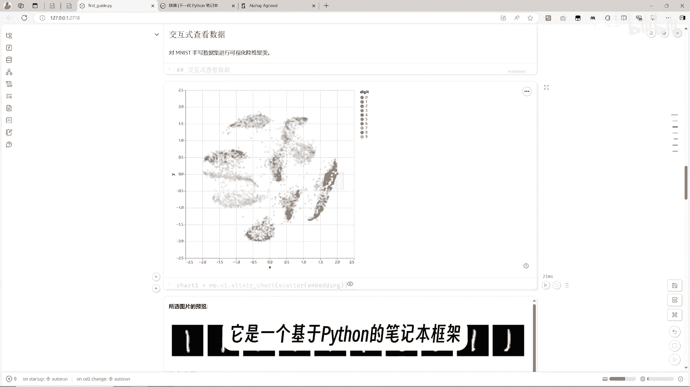
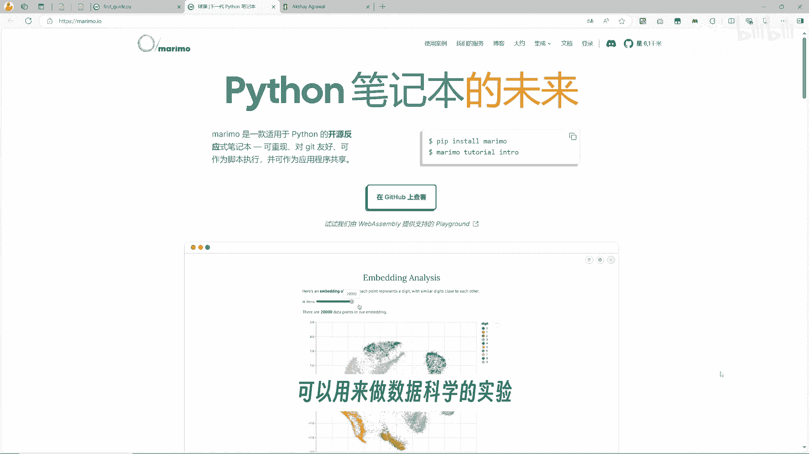
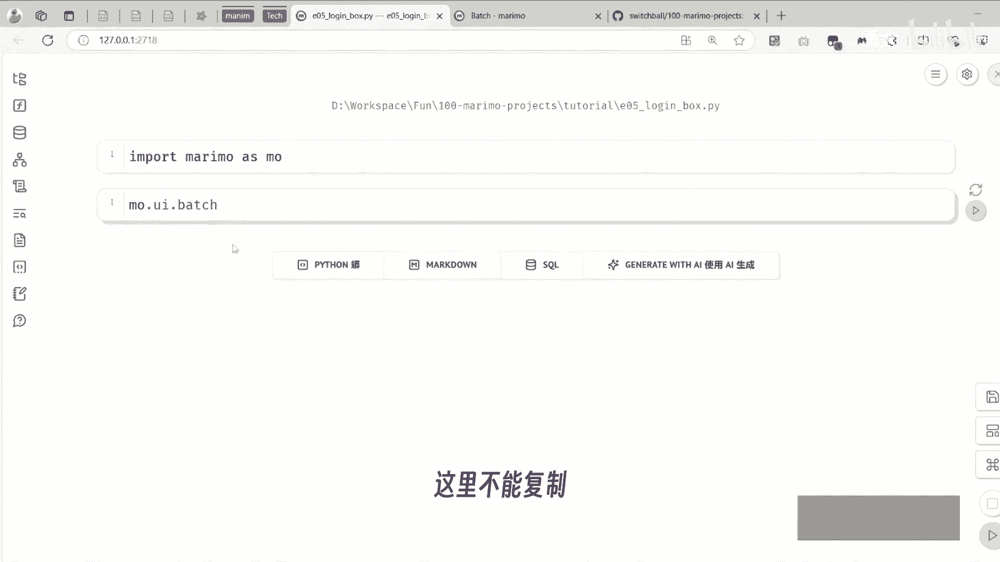
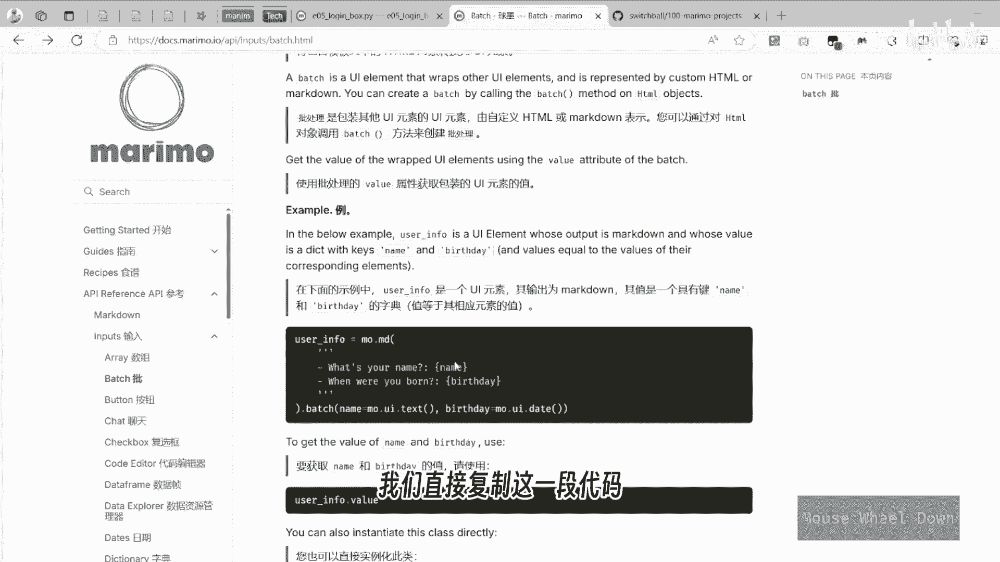
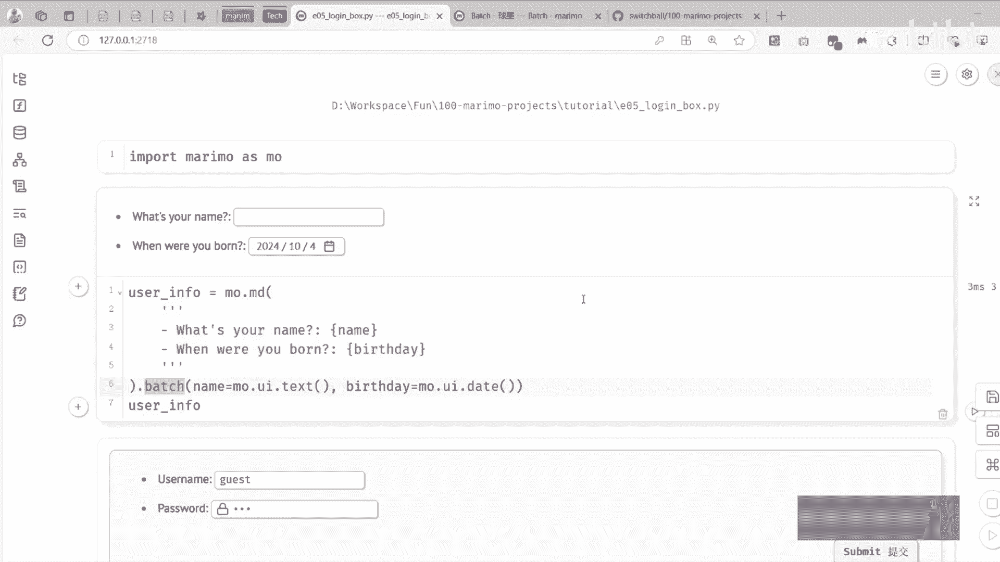
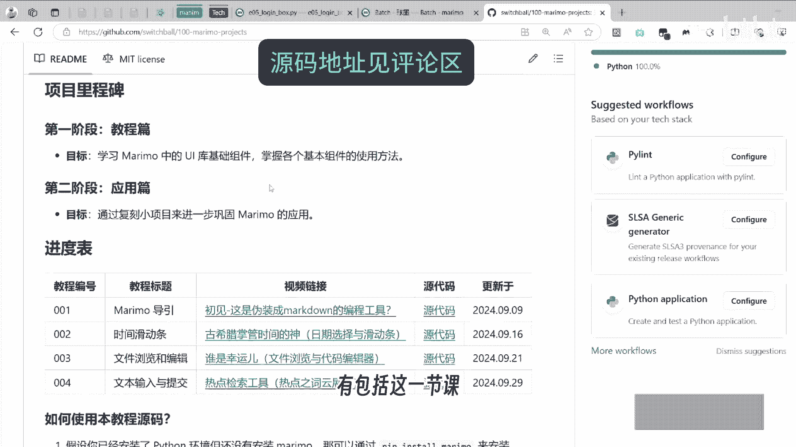
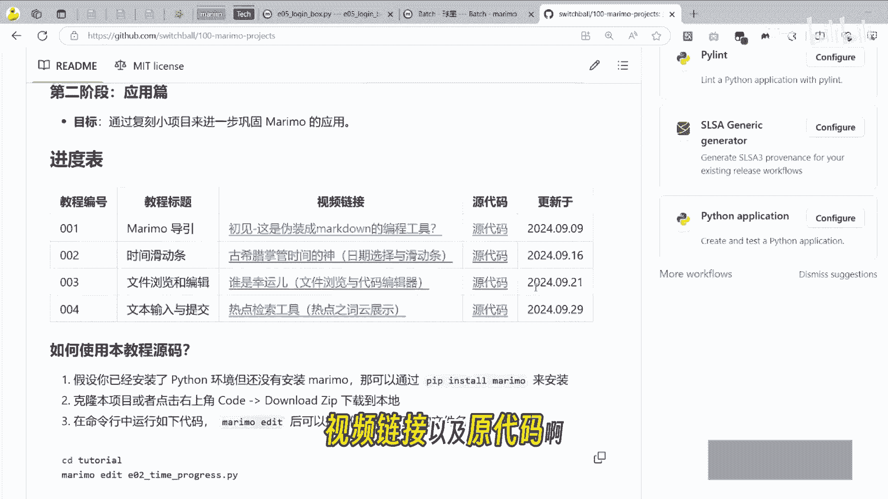
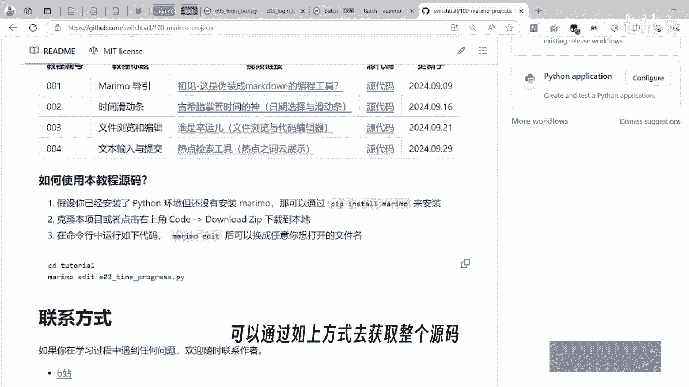
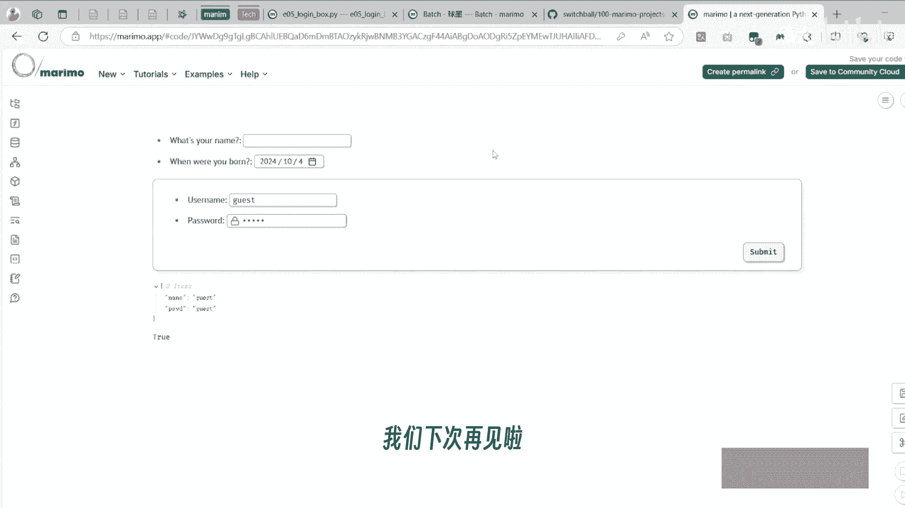

# 【Marimo系列05】登录框（Bacth 批量化 UI） - P1 - 潇大 - BV1uk1DYjEAu

我们今天继续maroon的基础教学，你可能是第一次听说maroon，它是一个基于Python的笔记本框架。

类似于TRIPOR，可以用来做数据科学的实验，也可以部署到网页端作为工具使用。

那今天的主题呢就是batch bush，这个词可以翻译为批处理，也可以翻译为批量化，我们可以看到他的介绍中写的是，把一个包含模板文本的HTM对象，转换为一个UI元素，好像有点绕，那什么意思呢。

我们直接复制这个代码，这里不能复制。

我们就到它的官方的文档中去找，我们直接复制这一段代码运行。

我们就可以看到它输出了这样的一个内容，这里是一个文本的字符串，后面的这个是一个占位符，通过这个BUCH之后，你可以把每个占位符，比如这里的name就对应为自己的文本框。

这里的birthday就对应着一个日期的选择器，这里需要注意的是，这里其实并不需要用f f f dream，因为这样会报错，只需要用用大括号把它括起来就可以了，我们试着这个思路来去实现一个登录的对话框。

那我们就想到登录对话框就需要用到它，首先有一个用户名，你叫name，它需要有一个密码，这样的话只是打印出了一个文本，接着我们需要用一个bar函数，把它对应的占位符换成对应的UUI。

比如说名字其实只需要一个text的UI，给他一个默认的用户名，对于下一个密码控件来说是一样的，也是text控件，但是它可以有一个类类型等于password，这样我们就得到了一个可以输入。

用户名和密码的内的控件了，我们把它命名为login box，我们只需要通过login box点value就可以获得这个值，比如说我在命名这里随便输入一些值，那这里我们看到我们在这里输输入的时候。

他是会立即响应的，我们希望能够达到一个提交按钮的效果，那么可以在这里加一个bob form呢，就可以把任意的输入框，转换为一个提交的表表单，这时我们只有提交了这个点了提交按钮之后。

这里才会出现这样一个结果，好那为了验证它的结果，我们其实需要先建立一个账号，你们可以给一个account，我们可以初初始一些用户，比如说get它初始一个root吧，那有了这样一个账号之后。

我们就可以去写判断，首先定义一个函数叫做check login，用来检测用户密码是否正确，那这里我就输入用户名跟密码，我接着需要去判断说，是否这个输入的用户名在这个account中，如果在的话。

它的密码是否等于这个用户名，如果这样的情况下，我们就返回一个true，否则我们就返回一个for false，那在定义完这个函数之后，我们就可以去调用一下check login。

这里我们就可以把这个locking点value值给它，传入到里面，现在得到的是一个pose的结果，我们把它的这个值改改一下，改成guest，guest点提交之后，你就发现他得到了一个true，除此以外。

我们还可以继续，下一步，我们可以使用O点data点TOTOST来输出一行内容，说登录成功，那如果不成功的话，我们就是用用户名或密码错误，那现在就是成功，我们随便换一另外一个值。

那它显示的就是用户名或密码错误，可以继续在这里改一个颜颜色，这样错误的时候就会用一种警告的颜色出现，好了，那这就是关于大阐述的教学，如果你想获取这个源代码呢。

你可以看我的这个GITHUB，在这个项目中，有，包括这一节课和之前的课程的所有的视频链接。

以及源代码啊。

这一课内容会稍后更新上去，可以通过如上方式去获取整个源码。

那如果你觉得这个过程还是太复杂，其实还有一种更简单的方式，也就是说在这里可以有一个共享，有一个创建链接，发布点创造，那一定要输入一串话，我们点击创造，他就会说已上传，已复制到剪贴板。

那我们就可以把这个链接在这里去做，打开要打开好像有些问题，那还有一种方式呢，我们点共享试一下，这个创建web assembly链接，它也会复制一串链接就很长，打开之后它就会有这样一个正在加载的页面。

这里的我们就可以看到它，整个过程都是在转成在本地执行的，你们可以试一下，输入刚才的用户名和密码，点击登录就可以看到登录成功的提示了，好了，本期内容就到这里了。

