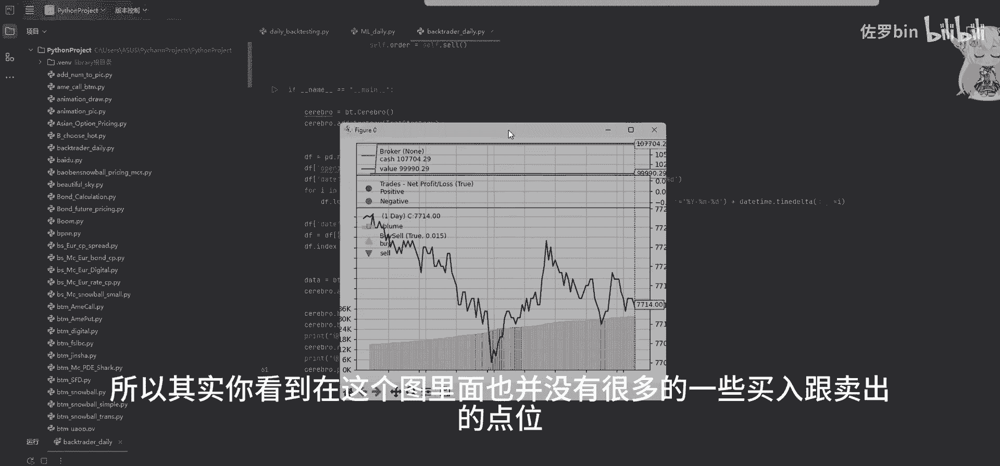
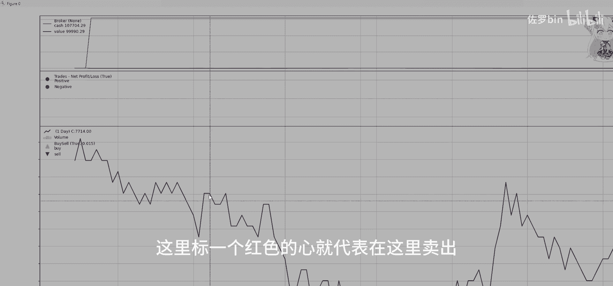
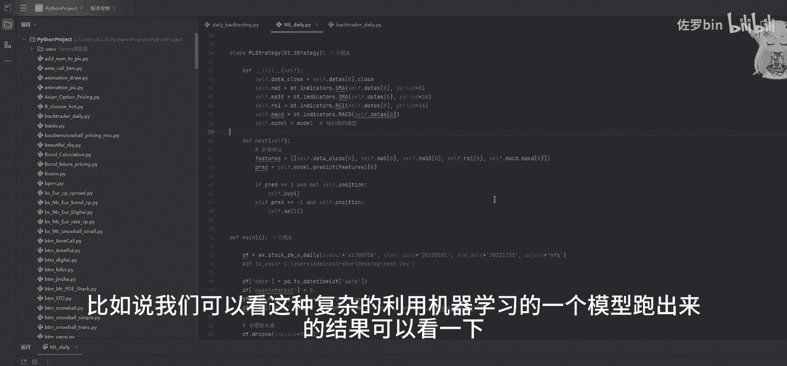
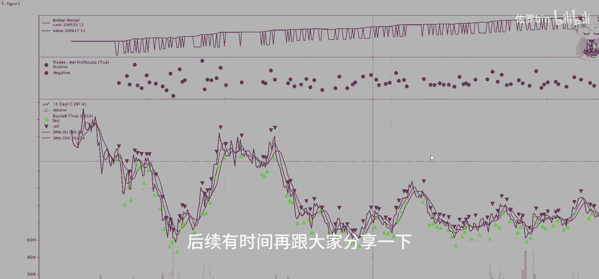
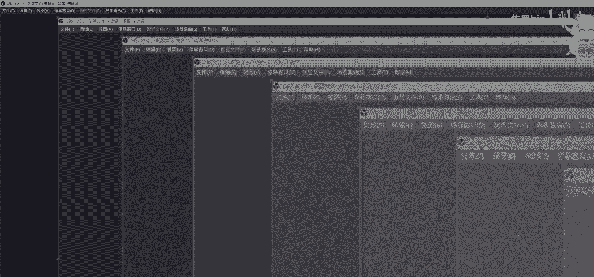

# 【Python】如何构造最基础的量化回测框架 - P1 - 佐罗bin - BV1NT64YsE8Q

Hello，各位小伙伴们大家好，今天我们看一下，如何用Python去构造一个简单的量化交易策略，那首先我们需要用到一些库，值得提的是这个back trader。

那这个back trader是一个量化交易策略的，回测的一个库，然后to share是一个金融数据的一个接口，那有些数据可能是付费的，OK我们来对我们的交易策略做一个定义，Plus。

那首先是定义这样一个记录，或者说日志的一个函数，那它其实就是打印我们这个数据中的一些信息，对吧，print接下来就做一些初始化，那首先d data clothes，那是我们定义为这个数据的一个收盘价。

或者说每天他如果是日内数据呢，你可以定义为最新价，order是我们这个成交的一个订单，那最初始的状态肯定是没有，by price是你一个进场的价格，by commission是一个手续费。

进一步我们要去定义告诉这个策略，我们什么时候执行一个买入或者卖出的，一个动作，那首先还是要对当前的价格做一个打印，如果说你此时是有订单的，那你不要再执行重复的订单，但是如果说你此时没有订单。

并且你手上是没有持仓，那就执行买入跟卖出的一个判断，那首先我们这边也是选了一个，非常简易的一个判断方式，首先我们是假设它的一个最新的价格，小于四星价格，并且次新价格小于次次新的价格。

我们就执行一个买入或连跌两天，我们就执行一个买入的动作，如果说连涨两天，我们就执行一个卖出，这是一个非常符合逻辑的一个交易策略，就是逢低买入，逢高卖出，那到我们这个主函数的部分。

首先我们要对交易策略做一个初始化，那cerebral cerebro，它是一个回测框架的一个核心，或者说大脑，首先这个是初始化的动作，你把这个核心里面去添加进，你的回测的一个策略。

test strategy就是你构造的一个简易的交易策略，我们要把这个数据给填充进去，那PD点read csv，那这个是我们去读取这个CSV的一个文件，我们可以看一下文件在这个地方。

那他其实不是日内数据，那我们用到的样例，是白银期货的一个日内的一个数据，最基本的一个数据的框架，首先这个time时间然必备的几个点，open开盘价high，最高价low，最低价，Clothes。

最新价格以及这个volume是一个成交量volume，它是递增的，随着时间的推移，它的成交是逐渐增多的，那我们还要再添加几个，比如说这个open interest，它是一个持仓量，我们可以统一定义成零。

这个date是在back trade的框架里面，是必须的一个字段，我们可以定义成随便一个日期，比如说12月6号往后递推，比如说每一个最新价对应的就是递推一天，加1+1天。

那这个是由于back trader，它的一个数据填充的一个必须的一个要求，它是以这个日每一天的日期，作为一个每个数据的一个标识，或者说序列，我们再回到这边去看一下。

那首先我们把这个open interest跟date，都已经定义完之后，我们还要做一些格式上的处理，那首先我们这个DF点date，就是说在这个data frame这个数据框架下里面。

date是做成这种IMD就是年月日的一个形式，除此之外呢，我们有一些其余的字段是不需要的，必须要的是date，Open high low clothes，Volume，Open interest。

那这七个字段是必须要有的，然后除此之外，还要对这个DF点index，就是它的一个序号做一个定义，而且它的序号是一定要是，我们这个date的一个字段，那这一点是非常重要的。

可以把这个data位到这个核心里面，就data等于BT点face pandas，data再加入进去，那这个CEREBRO点BLOKER点，such cash设置，我们的初始资金是10万块钱。

Set commission，是每成交一次是0。1%的一个手续费，那我们初始的一个总的持仓的一个value，是初始的这10万块钱，Get get value，在跑完整个回测的一个框架后。

我们再看一下整个的一个组合的一个持仓的value，然后得到最终结果，我们可以简单跑一下这个结果，他大概是这样一幅图，因为它这个策略比较简单，所以其实你看到在这个图里面。

也并没有很多的一些买入跟卖出的点位，可以看到这个黑色的线是我们最新价，或者说期货的一个日内的一个价格变动，在红色的区间，可能相对来说，这个有一个比较大的一个涨势的一个区间，那可能因为买入的点位比较少吧。

可能就一两次，所以我估计这里也没有标，这个绿色跟红色的一个星号，如果说买入点位相对较多的，它会在这里显示，在比如说在这里是标一个绿色，就代表在这里马路这里标一个红色的星。

就代表在这里卖出，那其实我们最终这个结果可以看到，还是相对来说比较一般的，他是亏了大概十块钱，初始资金亏了十块钱，因为他执行的一个交易动作也没有很多，可能在这种日内比较波动大的一个行情下。

这种非常简单的交易策略还是比较不太适用的，比如说我们可以看这种复杂的，利用机器学习的一个模型，跑出来的结果可以看一下。

那他这种结果有非常多的一些，买入和卖出的点位，那这些可能会涉及一些比较高频的一些交，易的一些动作，后续有时间再跟大家分享一下。

好以上就是我们的一些今天的分享。

