# 【Python三剑客】建议所有想学Python数据分析的同学，都好好看看 - P9：02 pandas修真之前戏基础_02 Series的进化之DataFrame~1 - 北大数据分析 - BV1YuCGYqEQH

OK啊那么这一小节的话，咱们就来看一下这个data frame，它的一个基本使用哈，那么在上一小节呢，咱们最后呢遗留了一个问题，我们说这个series呢它是一个一维的数据结构，是不是。

而我们又说这个date frame是由series组成的，那你说这个date frame，它应该是一个几维的数据结构呢，OK吧那这个问题各位是怎么思考的呢。

好那我们就来看一下哈，那通过我们上节课的一个演示。

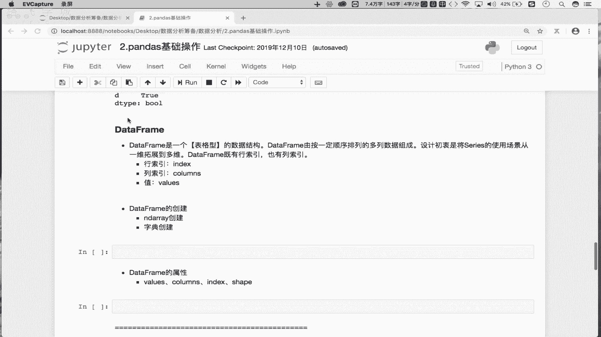

我们如果创建了一个data frame对吧，这块显示的是不是一列的数据啊对吧，那这一列表示的是一个一维的数据结构吧，那如果哈如果有多个series s组成的话，就有多列呗，那多列凑一起的话。

不就是形成了一个表格型的数据结构了吗，那么表格型的数据结构是几维的，是不是两维的呀对吧，是不是有行和列是二维的一个数据结构啊。

所以说咱们的data frame，其实上是一个表格型的数据结构，OK吧，那么这个表格一定是由行列组成的，是不是，那所以说咱们这个data frame啊，它的一个设计的初衷。

就是将series它的使用场景从一维拓展到多维，这个多维指的是我们的二维的意思，OK吧，所以说啊我们的series啊它是一个一维的，它是不是只有我们的这个一个索引啊对吧。

但是呢在我们的date frame当中，它是一个二维的，所以说date frame应该是有两种不同形式的索引吧，分别是行列索引吧，那么意味着我们整个的这个data frame。

它的组成元素是由三个组成的，第一个是我们的行索引，第二个是列索引，第三个是行列索引所对应的值吧，对不对，那所以说我们的data frame，就是一个表格型的数据结构。

你就可以完全把我们的data frame当成MYSQL，数据库当中的一张库表，那那MYSQL的库表不就是表格型的数据结构吗，对吧，是由行列组成的吧，它也会有行列索引，是不是啊。

那么这个data frame它就是一个表格型的数据结构，OK吧。

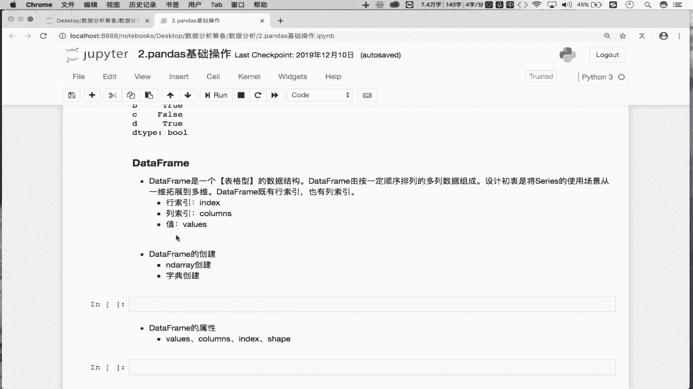

那么接下来咱们知道了data frame是什么之后，我们再来看一下date frame怎么创建吧对吧，首先看一下啊，那想创建的话，在这我们需要先导一下data frame这样一类吧，怎么导呢。

from还是从我们的pandas里边import，我们需要导入一下这个data frame就可以了，OK吧，那么接下来咱们去创建data frame啊。

首先第一种方式看一下，我们调用data frame的构造方法进行创建。

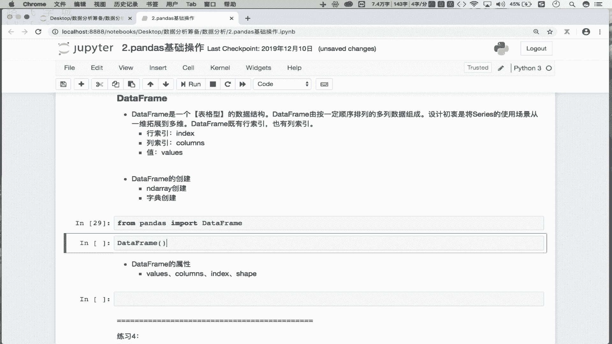

那构造方法有哪些参数呢，data是不是我们的数据源，数据源是12维的数据源啊，对吧好index是我们的行索引，columns列索引，DETAPE是元素类型对吧，咱们依次去试一下。

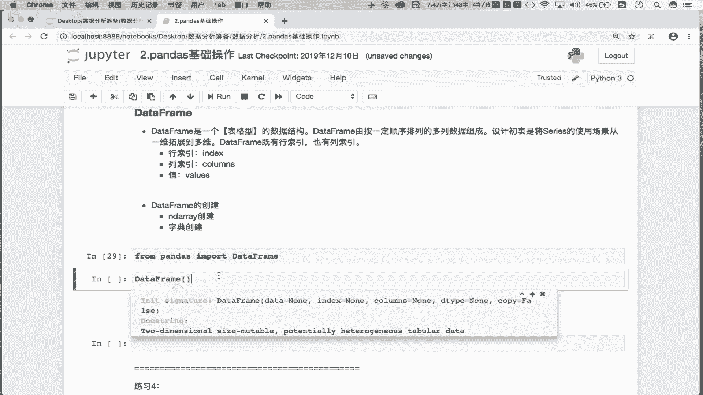

比如说这块的话，data我首先给它赋一个什么呢，列表行不行，比如说这是123，这个是456，OK吧，那现在我所创建的是不是一个二维的表格啊。

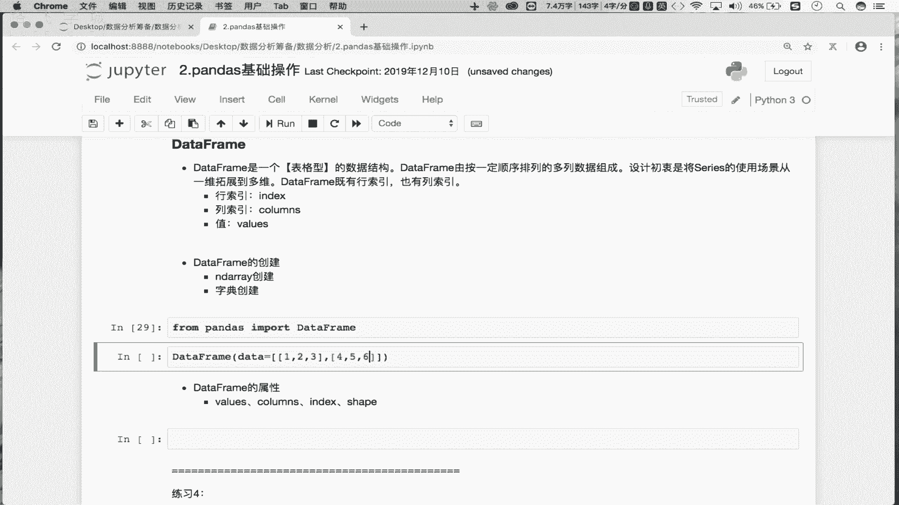

对吧，我们再来打印看下，我找看这返回的不就是一个两行。

三列的一个数据结构吗，对吧，是一个表格型的数据结构吧对吧，那这是一种创建data frame方式。

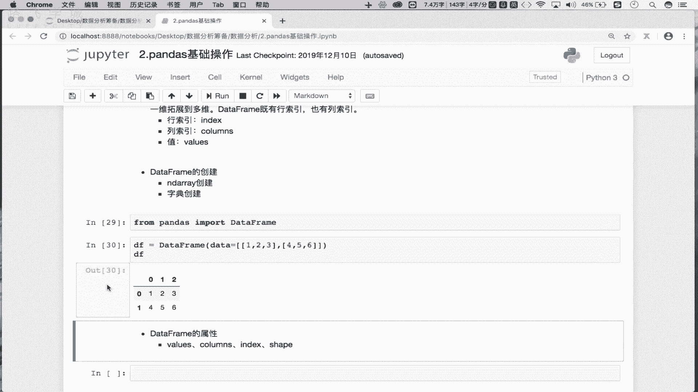

是不是使用二维列表啊对吧，除此之外还可以使用什么呢，data frame啊，我们的数据还可以是我们的nip吧，nip点random点random int行，那这块就是从0~100。

size是一个六行五列，六行四列吧。

OK吧，那这返回的是不是一个六行四列所对应的，表格型的数据结构啊对吧，所以说第二种可以使用我们的NIKE，充当我们的数据吧对吧。

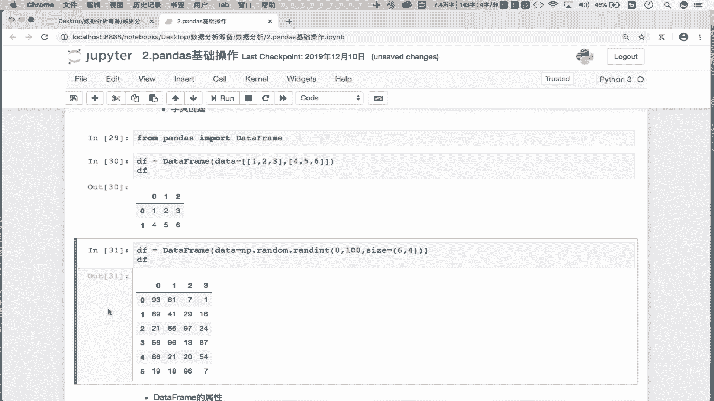

那除此之外还可以使用我们的字典充当数据，DIC字典，比如说啊这我有一个字典。

这个是什么呢，比如说是一个name啊，后边跟的是一些人名吧，比如是一个张三好，李四王老吴，OK吧，好那么第二个啊，净值它所表示的是它的一个salary吧，工资是不是好，工资分别是一千两千三千，OK吧。

好，那字典创建好之后，我们看一下DF就等于data frame，那么我们的数据源data就等于我们的DIC好。

然后的话来这看一下我们创建好的data frame jo，看一下，那现在我们创建的也是一个，表格型的数据结构吧，对不对，你看是不是有name跟salary这两列啊对吧，name这一列存的是名字。

salary这列存的是工资，OK吧，那现在我们这儿会发现我们字典当中的key，是不是作为了我们data frame当中的列索引啊，你看这块的话行索引还是012，是不是用的是隐式索引。

而我们的name salary就变成了显示罪了吧对吧，所以说使用字典创建我们的这个什么的，创建我们的这个data frame的话，字典的key啊，就是我们data frame的列索引吧对吧。

你想给它指定行所怎么办是吧，那我们说这个columns这参数是列索引吧，是不是有列索引了，不需要指定了吧，是不是只需要指定行索引啊，对吧好我们叫做A，C可以吧，走那现在我们这个date frame。

它的一个行列索引都变成显示的了吧。

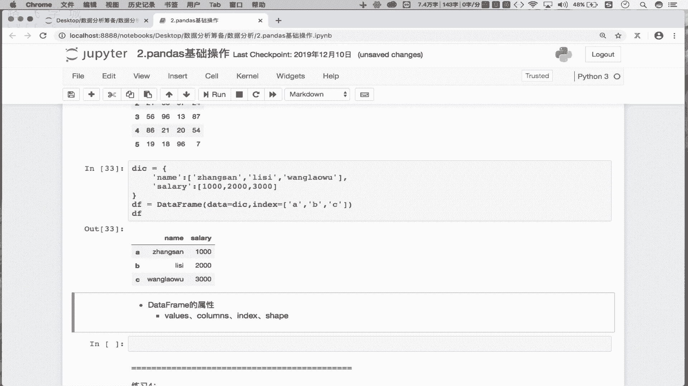

对不对，好，那么通过我们的这三种方式。

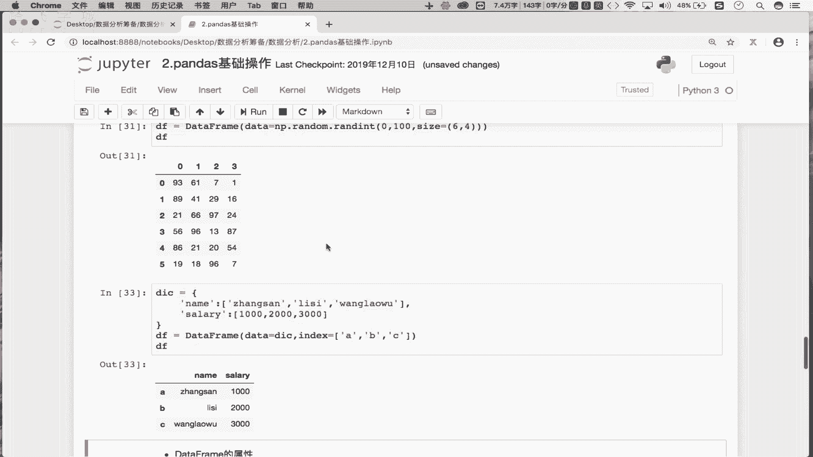

我们就可以创建出来啊，我们的一个二维的表格形式的数据结构了吧。

对吧，叫做data frame是不是好。

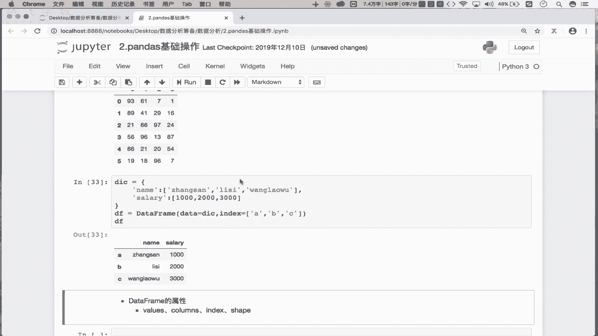

那么下面的话看一下data frame常用的属性啊，这个属性的话就简单了，首先d f d r values返回的是不是我们date frame。

存储的二维形式的数据啊，是不是返回的是一个二维的单位数组，是不是好。

那DF点columns的返回的一个是列索引吧。

name valuary是不是DF点index返回的是不是好作业，AABC啊，对吧好。

那还有DF点shift返回的是不是形状啊是吧，两行三列是不是形状对吧。

当然也有什么DF点什么的，d type看行不行走。

你看这个DF点DETAPE是不是报错了对吧。

为啥报错呢，是因为你的这个什么呢，data frame是由行列组成的吧对吧。

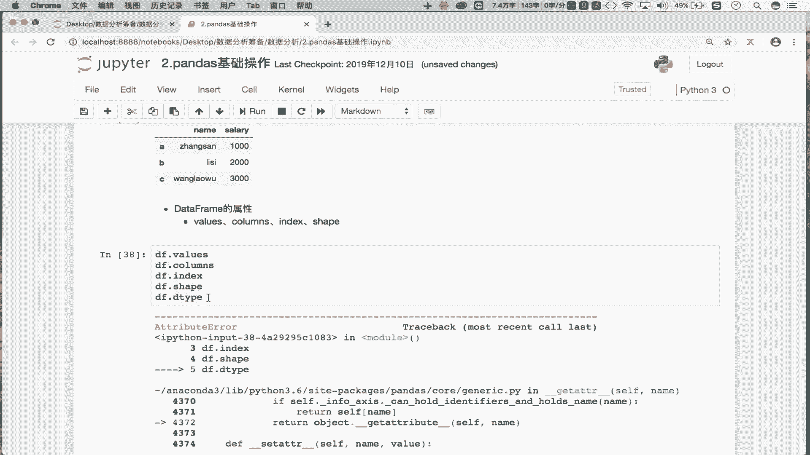

你到底是想看哪一行或哪一列的类型呢对吧，你这选举了吗，没有吧，你看因为你的这个data frame是不是有两列组成啊，对吧，你看第一列都是字符串类型，第二列是不是整数类型啊对吧。

那一整个的data frame，所有的元素是不是既有字符串，也有整数啊，那怎么算它类型呢，算不了吧是吧，只能是说取出其中的什么呀，只能取出其中的某一列或某一行，单独去看某一行或某一列的这个什么的。

数据类型吧，因为我们data frame的某一行或某一列取出来之后，它所返回的就是一个serious，我们知道series能看数据类型吗，能看吧，因为series所存储的数组元素的类型是一致的对吧。

而data frame看每行跟每就是行跟行或列跟列之间，可以存储不同类型的数据吧，对不对，你看这取出来之后，这一列取出来是一个单独的serious吧，它取出来之后也是一个单独的series s8。

这两个series是可以存储两种不同形式的数据啊，对不对，所以说在这你不能直接去看data frame的类型，只可以去看data frame某些行或某些列。

它的数据类型吧，OK吧后边我们再看啊，后边再看，那所以说现在在这啊。

我们就已经知道这个data frame怎么创建了，是不是啊，并且它所常用的这几个属性。

我们也都知道什么意思了吧是吧，并且我们在创建data frame的过程当中。

这个data index，Column detape，这几个构造方法参数我们也能够知道啥意思了，是不是好copy，不用管它啊。

那么这个创建方式我们知道之后呢，那么接下来我们来看一个练习。

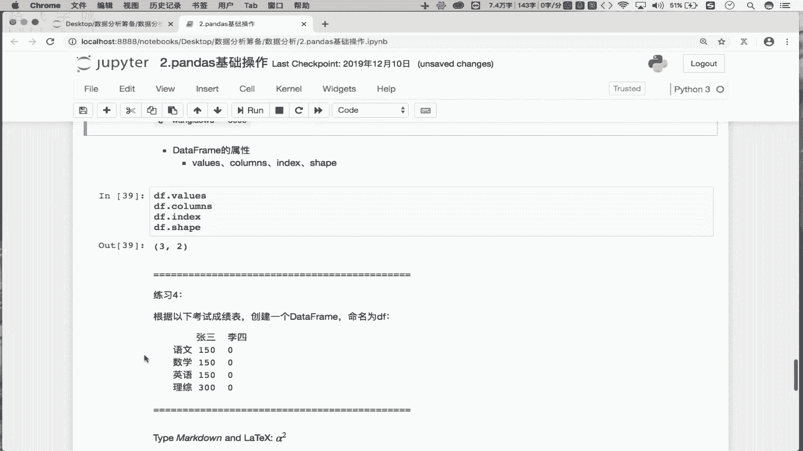

说我们需要在这干啥呢，需要在这去创建这样的一个形式的data frame，是不是由四行两列组成的呀对吧。

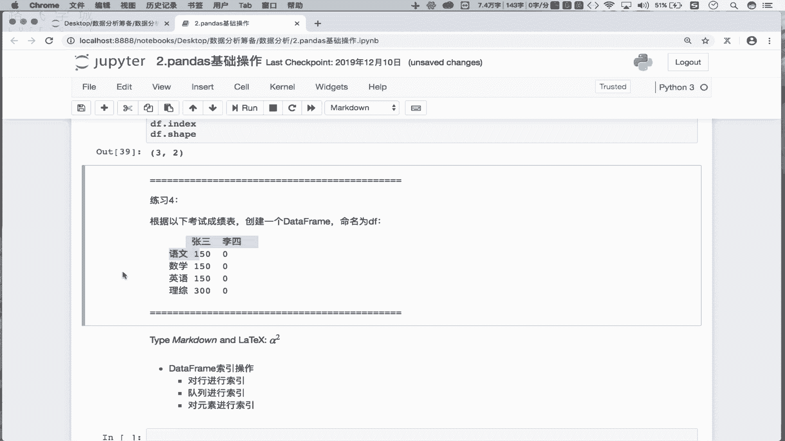

那这个怎么创建呢，你可以使用NIPPP作为数据源，也可以使用字典，也可以使用列表作为数据，是不是都可以啊对吧，那这怎么比较方便呢，是不使用字典作为数据比较方便，因为我们知道字典它的key作为的。

是不是我们这个data frame当中的列索引啊对吧，那这就是我们的什么呢，张三呗是吧，是不是第一列后边跟的值是谁，是一百五一百五一百五一百五啊，对不对。

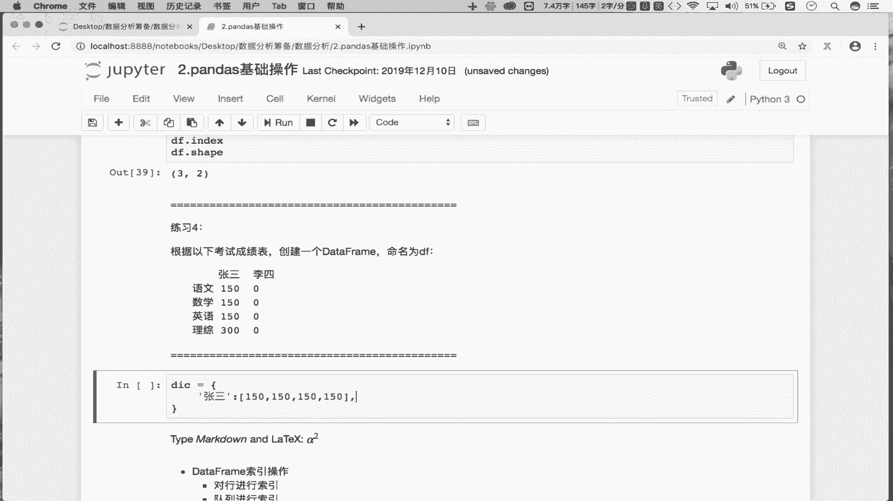

好第二列是不是李四啊，李四啊，好李四的话，那这块跟的是不是零啊。

对吧，字典有了吧，好DF就等于data frame，好，我们的数据源data就等于是不是DC，那我们的张三，李四是不是作为data frame的列索引啊，那行损有吗，没有吧。

我们是不需要在这指定一下行索引，index等于啥呢，等于语文，是吧，还有数学英语理综是不是。

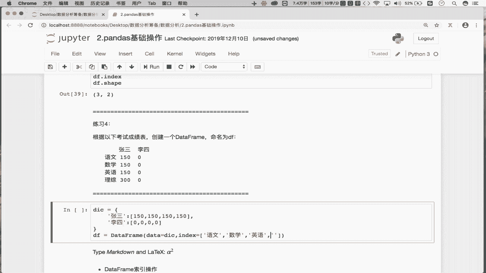

好现在的话我们来看一下df tony。

那现在就创建好了吧，跟上面是一模一样的吧对吧，所以说在这使用字典创建我们的data frame，更加的灵活和便捷，是不是OK吧，如果你这用的是我们的这个NIKE作为数据的话。

你还得手动的去声明它的显示的行索引。

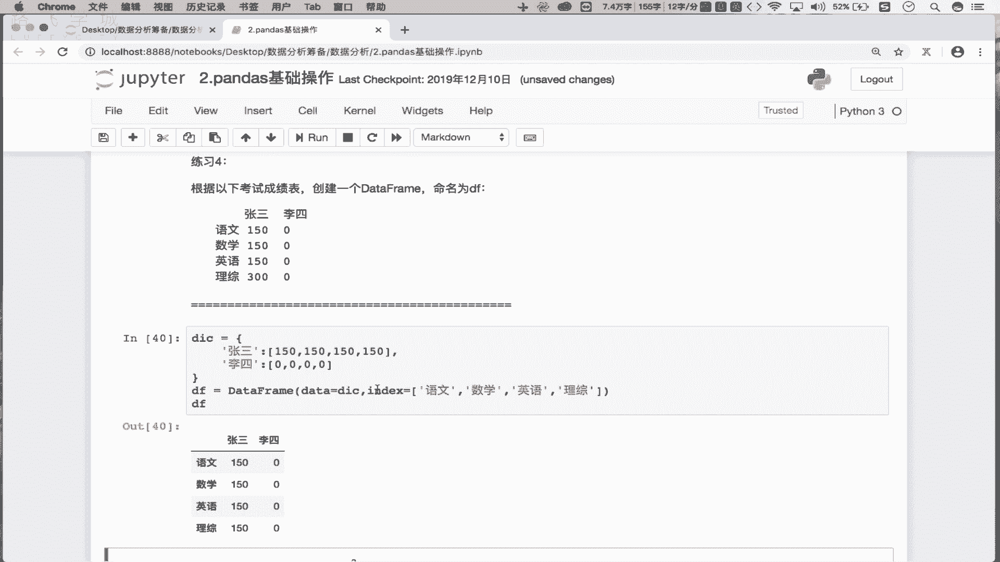

跟显示的列索引吧，OK吧好。

那这个是咱们data frame的一个基本创建的形式，OK啊。

