# 【Python金融分析与量化交易实战】完整版教程，含配套课程资料，想学就点进来看看 - P44：47.46.3-策略初始化与数据读取P46 - 多模态大模型_ - BV1LM4m1Q7z9

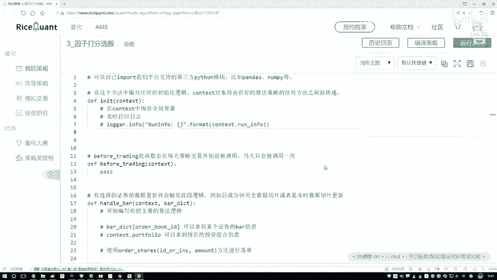

这里我已经是打开了一个新的策略文件，在这里呢我们一起来去动手，实现一下这个因子打分选股行了，然后按照我们的顺序，咱们一步写啊，第一个咱们现在要做一个驻扎方法，在这个context当中。

我们要指定当前我们的一个大池子，你要到哪儿当中去选这个股票啊，咱为了使得这个效果能够偏好一点，咱们直接在那个沪深300当中去选啊，这样咱们使得收益率看着能够更好看一些，好了，咱们写沪深300。

这是咱们现在指定好的一个大池子。

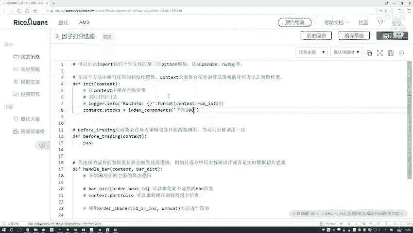

然后接下来呢我说在这个context当中，那一会儿我要做调仓，那调仓底啊，你是不是得告诉我诶，我到哪儿去选一些好的股票吧，那这块咱们先指定一个变量名字啊，就是我们上一次哎咱们当前的一个排名情况。

一会儿呢我会把这个排名情况给得到哎。

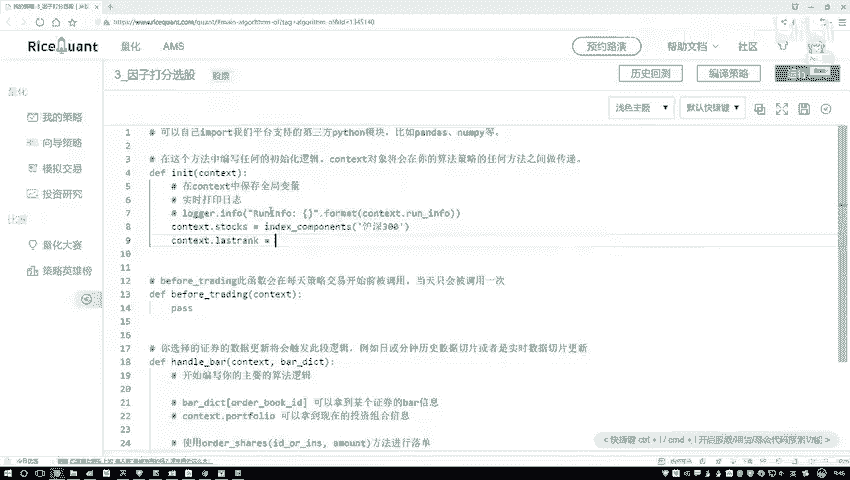

咱们context当中先指定好，一会在这个当中去选啊，那么前十或者前20个，然后接下来呢咱们来指定一个定时器吧，在这个定时器当中啊，我们去指定一下啊，它的一个调仓我们是run的方法啊，咱选按月调仓。

爱情当中啊，第一个就是一会儿咱们要去自己实现这个函数。

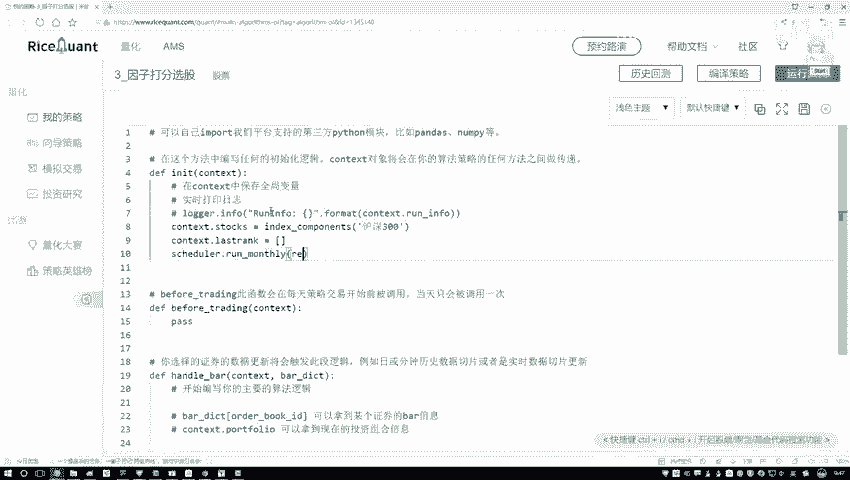

我们写个REBANCE，然后第二个写个一就行了，然后既然我们想要这个函数了。

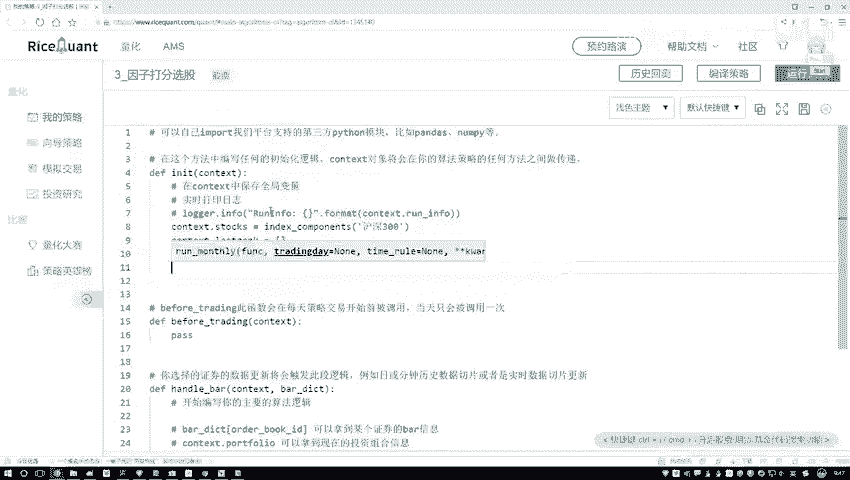

下来S8，下面我们来定义一下，在这个函数当中直接复制一块啊。

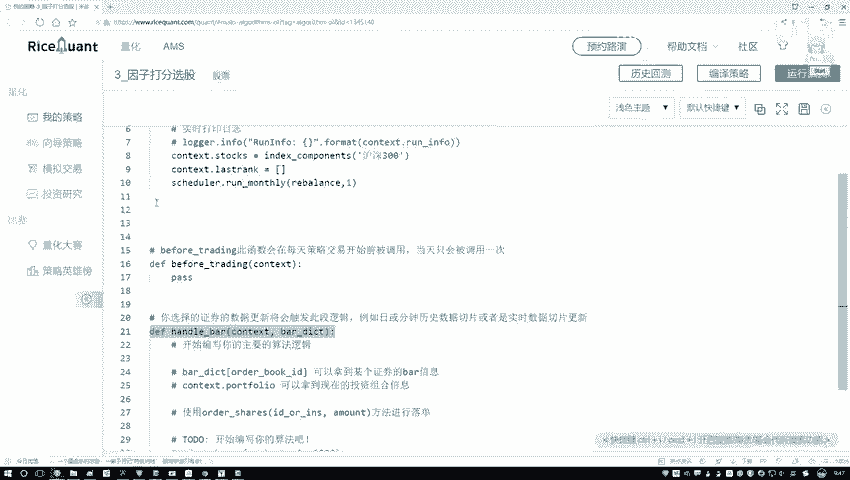

写什么，写一下咱们的一个rebel函数，在这个REBELA数当中，我们要做的事其实还是蛮多的，其实最核心的一个什么最核心的哎。

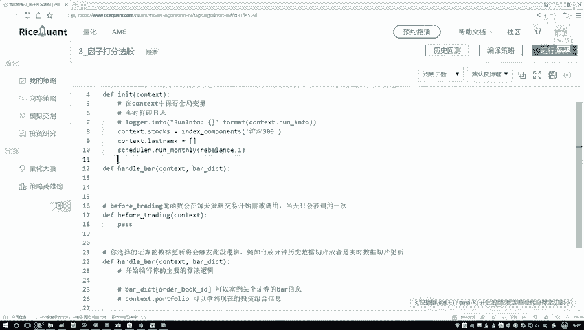

就是咱们怎么样去指定我们的一个评分了好了，rebel当中嗯，第一步咱们就得现在把呃，那前300个或者说排序好的300个，或者说是那个排名的十个吧，咱得返回出来，在这块我得知道哎呀。

当前你排名完之后的一个股票，那这块咱们自己去写个函数吧，比如说啊他就是get socks。

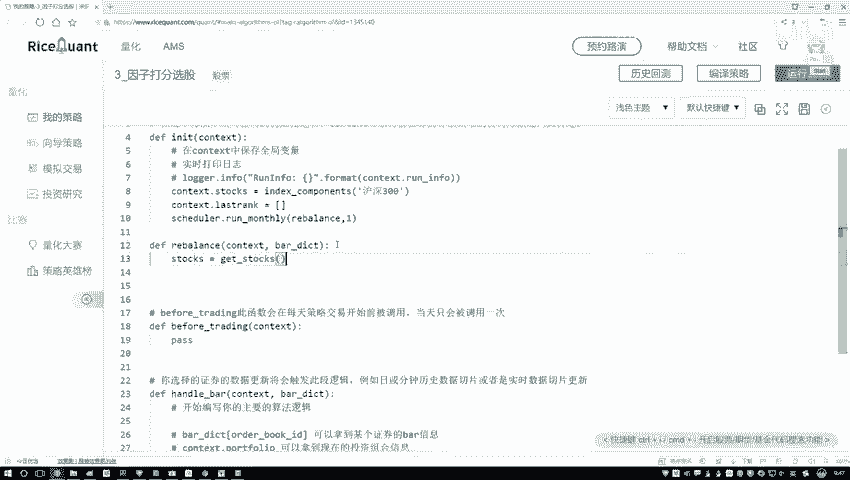

我们自己写个函数，在这个函数当中啊，他要去帮我们去实际的去啊做一个评分操作，我们来写一下哦，还是把这个复制下来，然后名字改一下，叫做get DOS这个函数当中我们就去写吧，第一步干什么。

第一步我们是不是说要去获取哎，咱们现在需要的一个数据啊，所以说第一步咱们肯定要做一个查询的操作，get查询操作，查询操作当中，咱们来写吧，第一个就是你的一个query query。

我们自己写query query，因为我们查的比较多啊，这块我单独列出来了，我们查查的就是刚才在notebook当中，我们是不是来给大家列出来了，有那么六个指标吧，哎或者是啊有几个鼠标都行。

或者大家自己玩的时候，你有多少个多少个，咱就以那六个为例子给大家来说吧，好了，咱们应该写第一个，我直接复制了这个fundamentals，啊这算了这些了，fundamentals他应该会给我提示啊。

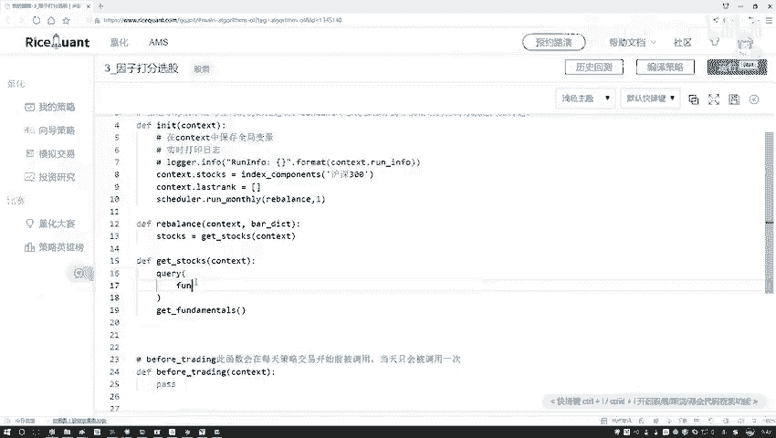

fundamental当中呃，咱们就选了第一个就是那个每股收益。

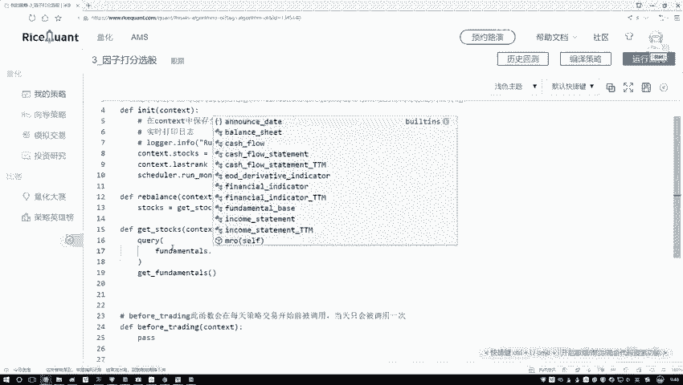

在那个金融指标当中，唉我们有一个每股收益没有收益啊，看一下它是一个D开头的。

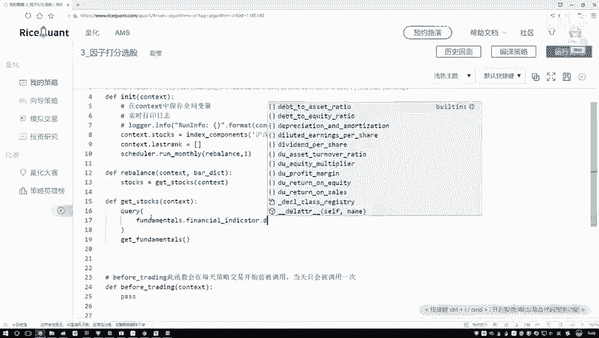

找一找看一看啊。

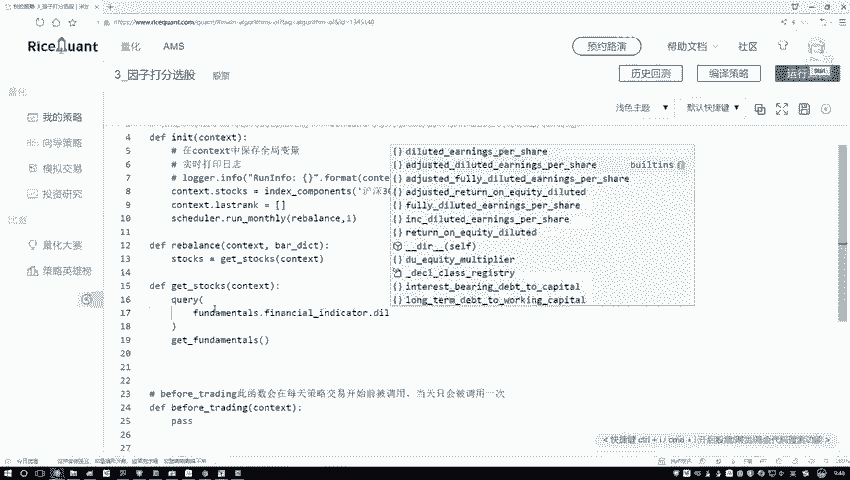

这这呢这呢对，就是大家第一个每股收益是吧，PROSHARE诶，咱们点进来，这是我们第一个要做的每股收益，为大家写一下它的一个名字，这就是我的一个每股收益，每股收益EPS指标，然后我们希望它是怎么样。

他是越高越好的，这是我们第一个指标好了，然后在这块我们写上个逗号，这里咱们是第一指标，然后我们再写第二指标，第二指标像是我们nobody当中给大家说的，哎我还有一个呃净资产的收益率啊，跟这个都是一样的。

我可以把前面一些全部给它复制过来，好，全部复制过来之后来找一找。

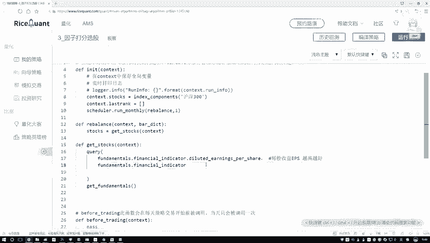

竞赛收益率也是一个节日指标哦，在这不是也它是一个收益率。

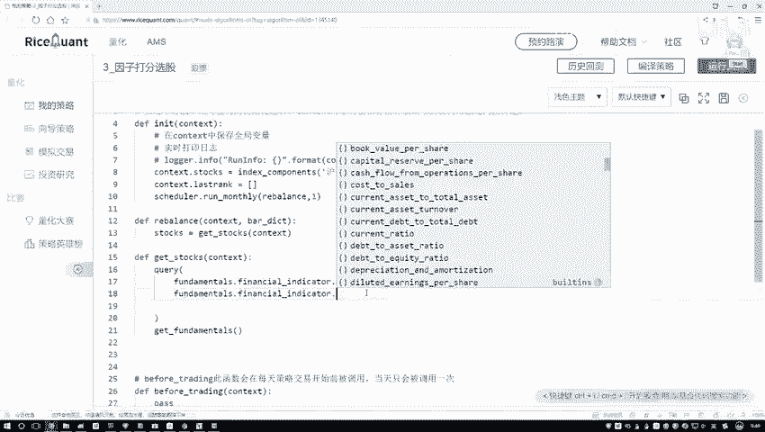

是一个return开头的，return开头的当当一个这个指标好了，我来注释一下，它叫做一个净资产，净资产收益率，我们也是希望它它是一个越高越好的，然后呢再来最后一个吧。

最后一个还是哎在这个折当中都一样的，第三个我们来说就是有一个投入资本的回报率，投入资本回报率啊，那也是一个return开头的回报率嘛，return一下呃，return一下。

然后净资产的回报率来找它是一个on什么啊，最后一个是吧，看一下哎对这是我们精彩的回报率，然后呢给他指定名字吧，叫做一个净资产回报率，然后我们也是回报，回报对啊，我们也是希望他能够越高越好的。

这是我们现在把这三个指标全部列出来了，那有三个指标之后，其实还没完，我们要对这个指标怎么样，哎是不是说得找一下他也在为股票当中啊，这个操作，估计大家应该相对来说都是比较熟悉了。

在这一块我们指定一个filter。

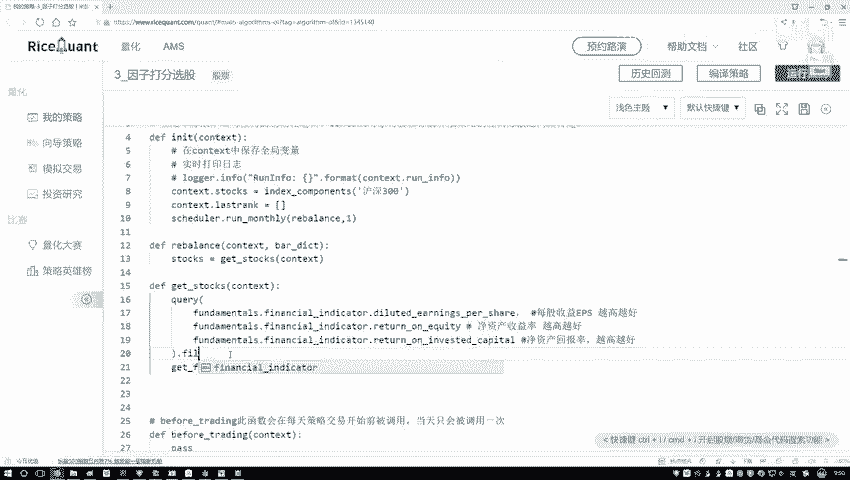

在这个filter当中，我们来去指定一下fever当中来指定一下吧。

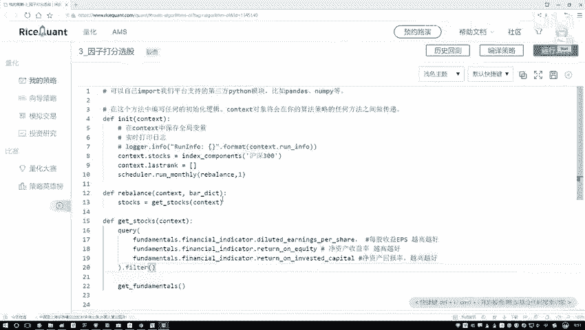

当前哎我们的股票得是带我的这个池子当中，好了，fundamentals点啊。

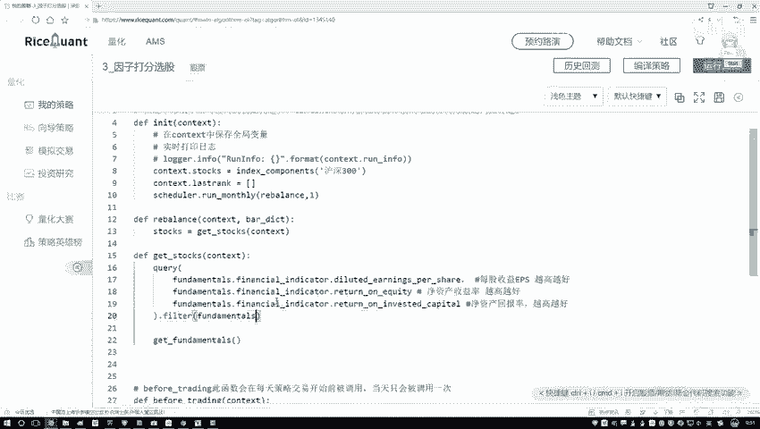

点一下咱们当前的哦，demo当中，然后有一个stock stock in哦。

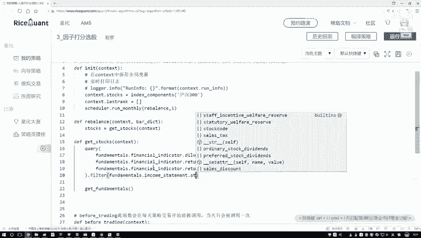

Stop code，然后对它，然后点in的一个操作哦，对它，然后我们来进行判断一下，是不是在我们的16当中把我们的一个呃，或者咱把这个池子给拿到手，这就完事了，就在这里啊，咱们写了一下我们的query。

扩容完之后，大家注意点，这没完，它返回是什么返回的格式诶，最早一次课就给大家说了，我们得把这个格式怎么样给转置一下吧，到时候方便我们去取它的一个索引的好了。

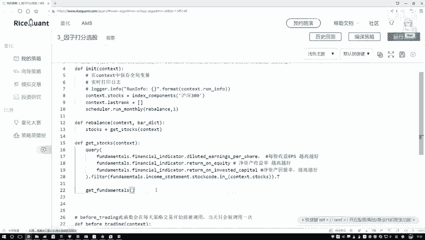

然后这块咱们直接写一下吧，get fundamental当中，我们来写在这个get函数当中啊，我们来去把这个query传进去啊。

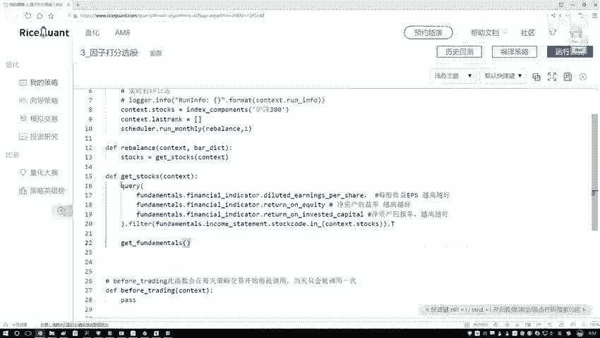

这样吧，我直接给它复制进来吧，直接把这个query传进去，然后这块正好他是一个点，哎这也完事了，呃，括号也没什么问题好了，这是咱们完成的第一件事，我们现在把一些越高越好的指标给他拿到手了。

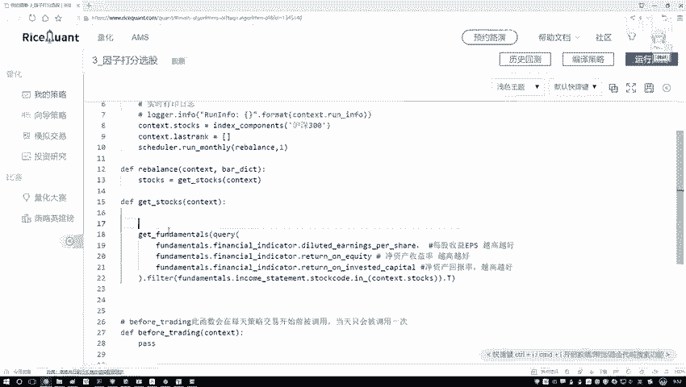

然后我给他指定个名字吧，咱们一会儿得区分啊，这个东西呃。

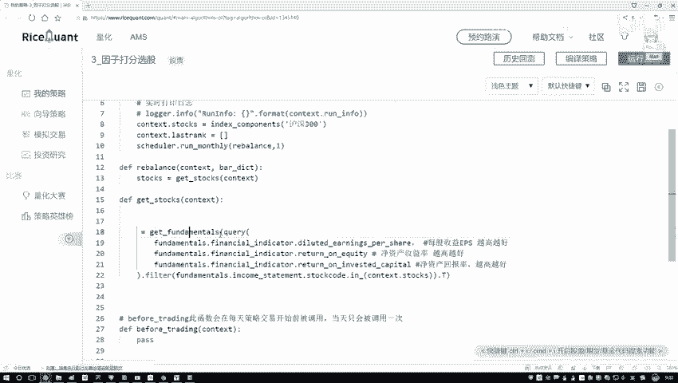

它是一个越高越好了，指定一个fundamental，我们希望当前得到的data frame。

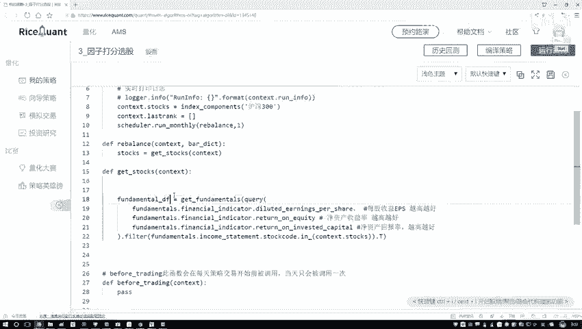

它是越高越好的，指定一个up就行了，然后复制一下吧，就是在我们当前这个鼠标当中啊。

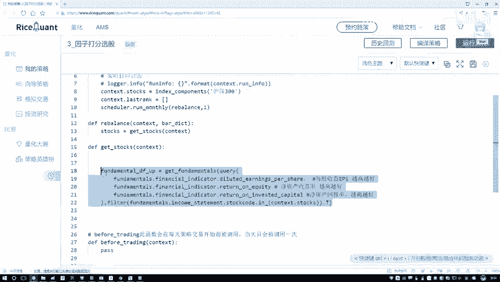

我们不光要拿这个越高越好的，还要拿什么。

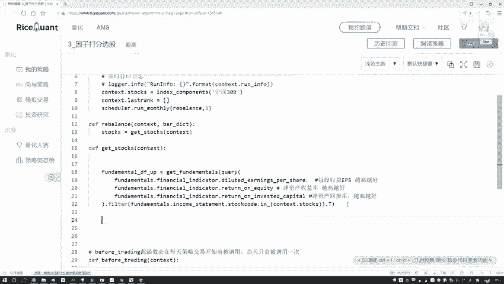

是不是还有一个是越低越好的呀，来咱写一个，当我把这些名字稍微改一改就行。

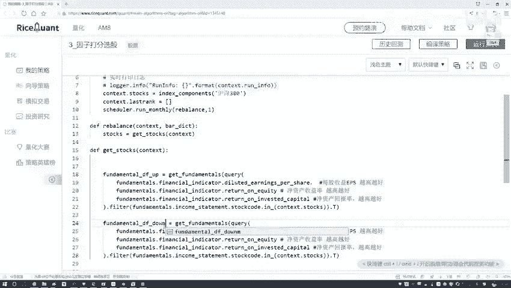

然后下面基本这些操作都不用去改的，几个指标啊，把这个改一改，这个它就不是美股的一个收益率了，我说这个叫做资产负债率，资产负债率我们希望这个资产负债率啊，它是一个略低越好的。

那这三个其他都是一个越低越好的，我把这三个值啊拿到手啊，它都是越低越好的，这是一个资产负债率，然后还有一个就是呃PB的一个，一比上一个PB吧，啊因为PB我们需要什么PB，我希望越高越好。

所以说啊不是就是一比上一个PB，我们希望越高越好，所以说当前的一个pp值，我们希望它是一个越低越好的啊。

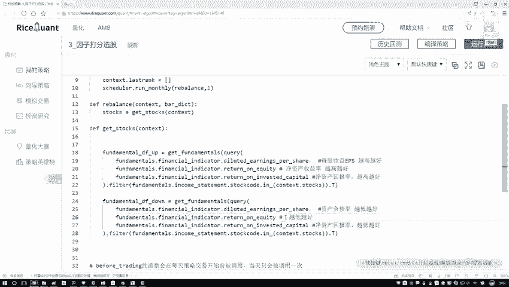

这是一个pp值，然后第三个第三个我们再拿到一个市值吧，市值反正也是越小越好的，虽然大家简单的得到改一改吧，第一个我们给给它改成实际的值，叫做一个资产的负债率哦，资产的一个负债率是吧，好了。

找一找他有没有当前诶没给我出它的提示呢。

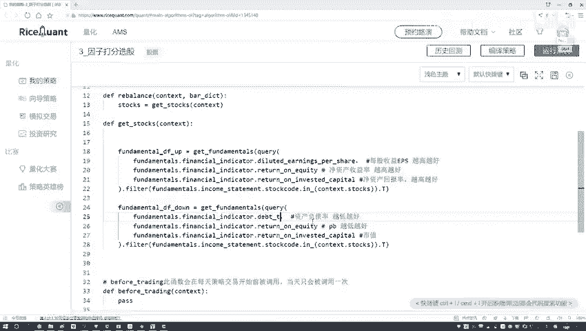

点一下呃，资产的一个负债率就是哎就第一个是吧。

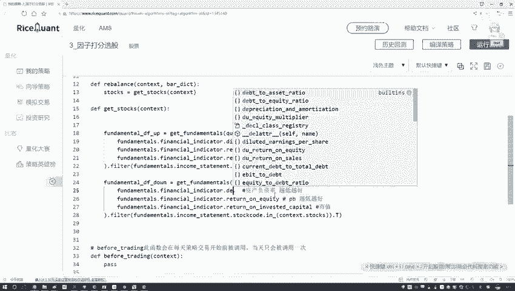

然后第二个叫做一个pp值，我再点一下哦，点一下就是PB在这里直接点一下。

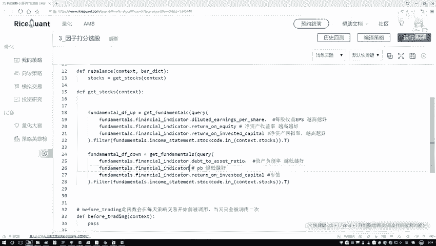

他应该会拿到这个PB呃，找一找诶，这里怎么没有这个PB呢。

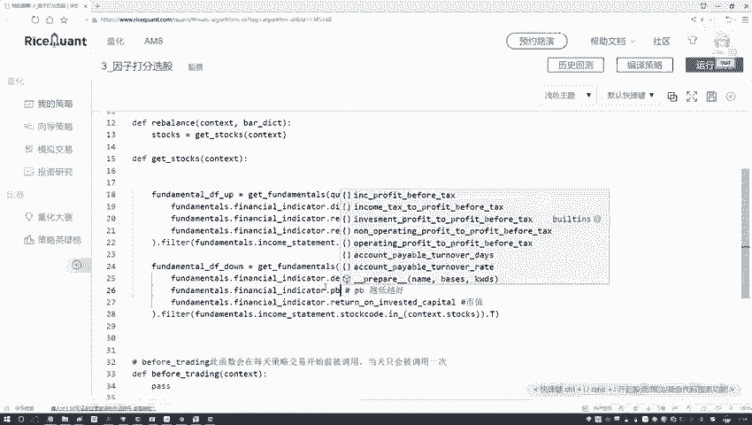

当前前面这个不对，想用这个稍微改一改啊，改一下就行了，D然后把这个改成一个pp指标，第一就是这个PV指标，我们也希望越低越好的，然后第三个就是我们的一个市值，直接把这个复制过来吧，直接把这个赋值。

然后是值它就是一个点market中的，找一找，第一个就是了好了，我们现在就已经把我们当前的呃，需要查找两个数据全部做好了，一个我们是越低越好的，第二个我们是一个要去，第一个我们是一个越高越好的。

第二个我们是一个越低越好的行了，这两个值咱现在就有了，而这个点T诶，这不太对，大家来观察一下这个点T应该是放哪儿的，诶，是不是我们最后的时候才放这个点T啊，那不应该是点括号里边吧。

应该是你get fundamental之后，我得到了data frame，对data frame做转置吧，所以这块有点毛病，我们得把这个点T给它放到外面啊，这刚才差点有点小毛病。

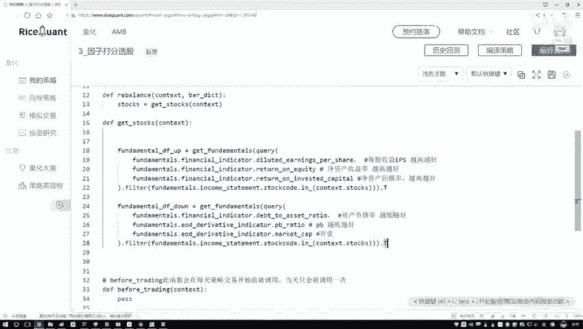

转置要到外面，最后我们来去转制的，然后这一块做完之后这样吧，咱先打印一下，结果来看一看，一会儿咱们来打印一下，哎算了一会儿一会咱们打印吧。

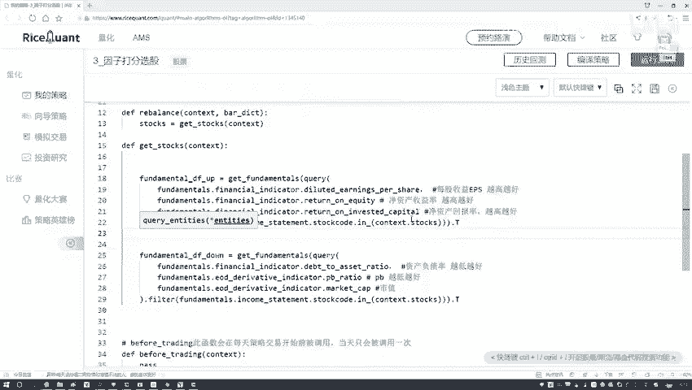

等运行运行的时候，其实这块大家说说结果吧，现在我们得到什么。

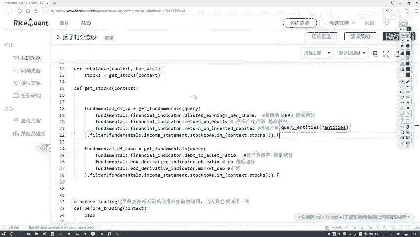

一共300个股票，当前这个data frame，它的一个这个值多少，300多少三，那下面呢也是一个300多号三吧，啊这块有个越高越好的，这块有一个越低越好的，我们现在把这两个指标数据。

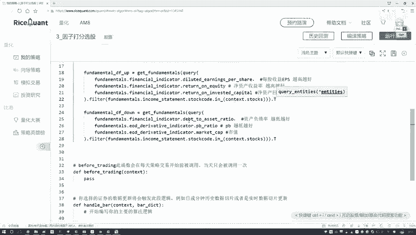