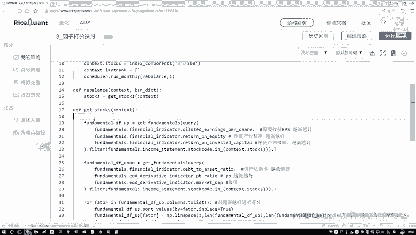
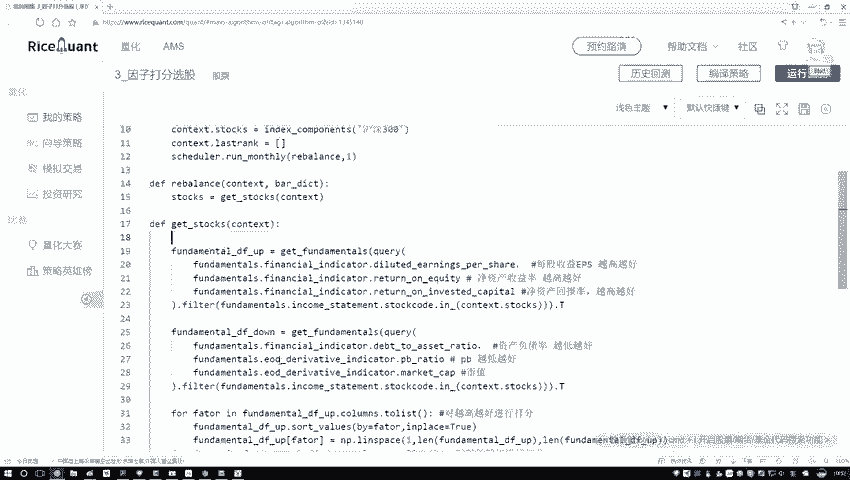
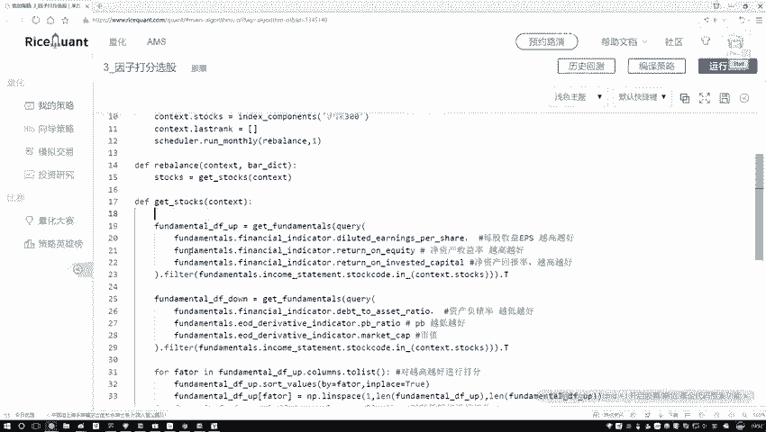
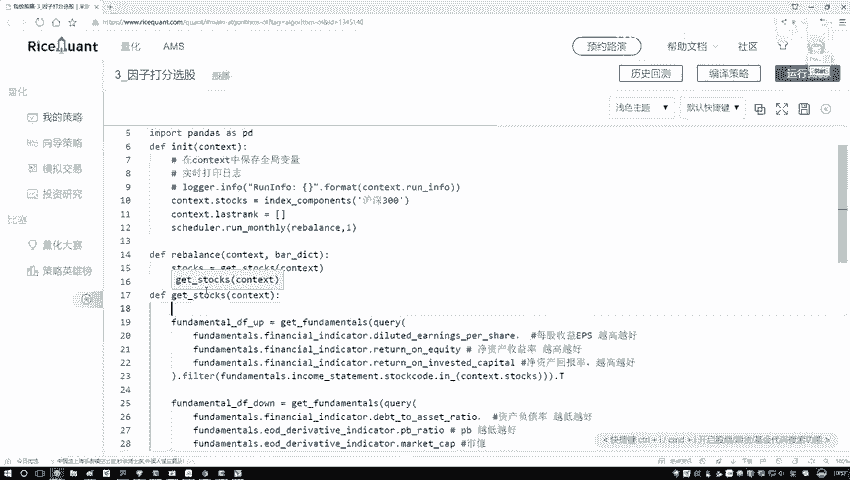

# 【Python金融分析与量化交易实战】完整版教程，含配套课程资料，想学就点进来看看 - P46：49.48.5-完成选股方法P48 - 多模态大模型_ - BV1LM4m1Q7z9

接下来咱们来把这两张表给它做一个拼接操作，咱们写一下这块呢我们要做一个拼接操作，pr操作，就是啊用一个data frame去转另外一个data frame，就完事了，咱们把这个复制一下。

就是让我这个down，然后呢我说他点啊，然后去转一下，这当中啊，把我们第2this frame给它传进来，这就行了好了，现在我们把两个data frame已经拼接起来了，然后我们给它起个新的名字了。

现在在这个data frame当中，我们要做的其实上就是一个排名操作吧，好了，我指定名字叫做一个电弧状就可以好了，现在呢我们已经有了一个代表了，但是这个代表当中还没有，咱们这些排名的信息吧。

在这块我说我新建一个列啊，新建一个列，这个当中呢就叫做哎咱们现在排名的一个结果，我叫做一个得分值吧，暂时先让这个得分值吧，它是一个都是零的，然后呢我们把这个得分值实际啊给它计算出来。

在这里我们就是哎这给我提示什么东西，这块我们传进来的就是呃指定好，南派点ZS当中，你矩阵的一个维度，我们指定成一个300×1的就行了，这块就是一共有多少样本数据，然后接下来再写一个一。

把这一列数据给它构建出来，那好了，现在我们这一列已经构建出来了，但是这一列里边的数据啊全是一的啊，我们得写一下这块呢我们要去计算总分，计算总分，然后并排序，现在呢我们每一个指标分都有了是吧。

那接下来我要把这些指标的分啊，给它合在一起了好了，把它们计算一起计算一起啊，其实上我需要什么，就是唉我看一下当前比如说咱这六个指标嘛，六个指标做一个加法，算一个求和操作，这就完事儿了吧，好了。

咱们写一下这块，我看上一下，然后呢接下来我说把这个横着的，把它们其中一个一个的全部加到一起行吧，加到一起，我说我取最后的一个总和，这就完事儿了，然后呢，接下来我在对这个总和干什么，做一个排序的操作吧。

好这里我说要做一个SVALUES，做一个排序，排序当中啊，现在唉你告诉我你要去拜哪个指标了，那既然我们已经排到一起了，那最后排序完之后，com算完之后，咱得到什么scar，里边就是前面所有的累加吧。

好了，把这个scar拿过来就行了，然后呢我们希望这个排序啊，它是升序还是降序，应该是一个降序吧，因为现在我们要找的什么排名最，就是分数最高的哎这些结果吧，所以说咱们指定成一个false。

我们要做一个降序好了就完事了，做完降序之后，现在我说呃给它一个返回值吧，这个就是我的一个data frame啊，把这个返回值咱们给它做出来了行了，那现在我们已经得到了总分的一个结果。

那接下来啊把这个东西直接叫做一个啊，这个其实我们不需要其他指标，我们只需要什么，只需要它这个cos值就行了，把其中的一列拿过来好了，这一列这是一个呃，就是一个series。

在这个series当中我们取了某一列，这个列拿了之后，接下来我说哦，你做一个返回吧，返回什么哎，我们返回的是前十名那个得分啊，还是前十名那个股票啊，我们要选的是前十名的股票吧。

所以这里我们要把他这个index，也就是股票给拿到手，并且呢给他to lift一下，在这里我再取吧，取一个前十，那就是从0~10，哎这就完事了，这样我们就完成了。

咱们当前就是呃get stars当中咱们的基本操作了，相当于啊。

哦第一步我们是去啊读我们的因子数据，短线数据之后呢。

对应的数据啊，我们做做一个打分操作，把最终打分结果我说拼接起来，最终呢咱再完成一个排序，那现在他返回结果就是啊我买guest DOS当中。

你执行一次，我们现在就你返回哎呀，当前啊就是当前某一天的啊，当前这些指标，然后他具体的前十是谁，我们就做完了吧，好了，这里我们的最关键的一个函数已经做完了，就是怎么样获取诶当前我的前十诶。

