# 【Python金融分析与量化交易实战】完整版教程，含配套课程资料，想学就点进来看看 - P56：59.58.8-优化参数设置P58 - 多模态大模型_ - BV1LM4m1Q7z9

然后呢这一块我们大家来想一想，有没有什么问题，哎这个东西没有什么问题啊，如果说这个M看着挺奇怪的，M这个东西如果说等于一个100，你算100个样本，那好像没啥事，给我加上一个万能加上一个万呢。

你更新一次参数要算100万次，结果这个东西是不是就有点奇怪了，哎这东西是不是有点奇怪了，你说你要更新一个参数，你要算100万次，得到一次更新，再更新，再算100万次，这东西有完吗，这东西没完了吧。

算起来就是像一个无穷尽的一个东西吧，100万字才得得到一个结果，更新一下是不是太慢了，所以啊我们把这个东西叫做一个批量梯度下降，但是它有个问题，批量虽然好，你是求了所有样本平均的一个最优的一个方向。

但是一旦样本多的时候，这件事做起来会非常慢，这是PRT下降一个优点，最优解哎，很容易得到，但是也有缺点，每次速度都非常非常慢啊，有这样一个事，然后呢我们再来看随机梯度下降，随机提下是什么意思啊。

像我刚才说的，在这里，它既然你用所有样本去算它比较慢，那我能不能给他每次只用一个样本啊，好像可以吧，你看我把这个M我说我不要他了，你随便给我找个样本吧，我不要看这车怎么样吧，做个抽样吧。

我把这一步直接就去掉了，可以吧，这一步直接去掉了，更简单了，所有这一步都去掉了，后面是不是照样练，照样落下来，后面这一步你说有有影响吗，只是前面这一步吧，我加了M个求了平均，我不算求平均了。

这一步你看速度快不快，之前可能是正常情况下10万个样本吧，跑一次，现在一个样本跑一次速度大概多少次，10万倍吧，几个数量级啊，这个是一个随机梯度下降，但是随机梯度下降问题更大，每次我只找一个样本。

那这个样本虽然快，但是它一定合适吗，有没有离群点，噪音点有问题的数据有吧。

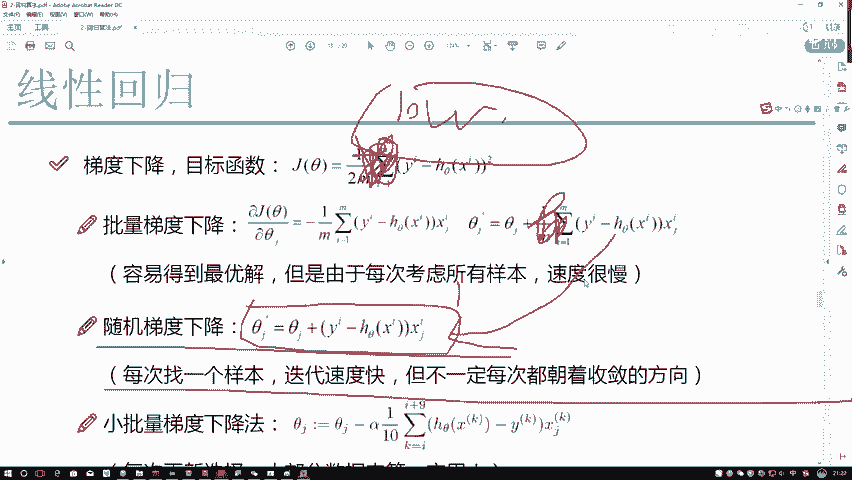

数据每一次朝着一个方向是一个收敛方向吗，不一定吧，如果说给大家画个图。

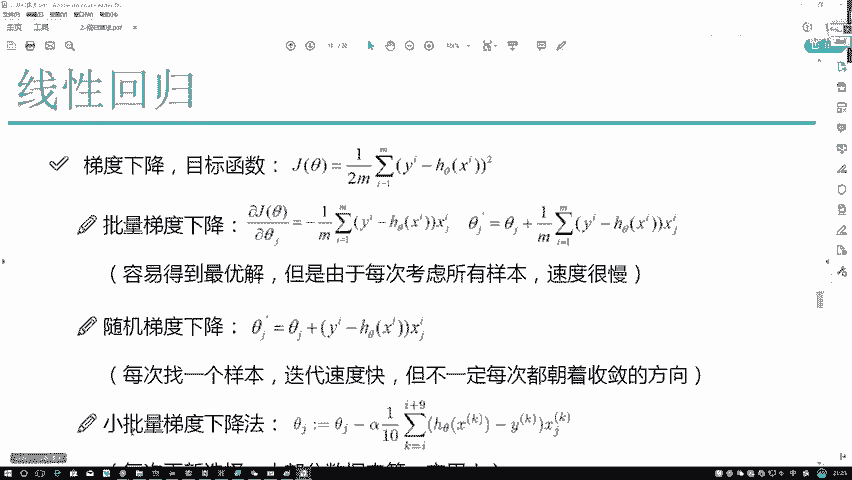

大概这个样子嗯，可能就是一个批量梯度下降，当前的一个迭代结果是长这个样子的，然后呢这是我的一个loss function，就是我的一个损失的一个结果，然后这个是我的一个迭代的次数，它会随着电次数。

大概呈现出来这样的一个趋势啊，这是一个批量梯度下降，我写一个P这是一个批量梯度下降，然后呢再写这个吧，这是什么，这个可能就是一个嗯随机梯度下降，这叫做一个GD，然后T加T度下降吧。

这叫一个SGD随机梯度下降，它随机梯度下降，可能这样，它是一个浮动的感觉，大概是这个样子，因为每一次啊你在进行优化的时候，他不一定都是朝着一个收敛的方向，也不一定朝着一个好的方向不太可控啊。

因为它不是一个平均的感觉，所以啊就是他每次结果可能不是特别好。

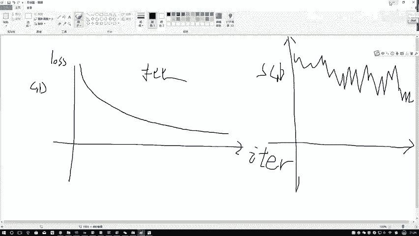

这个是一个随机梯度下降，那现在我们解释了一个批量解释题。

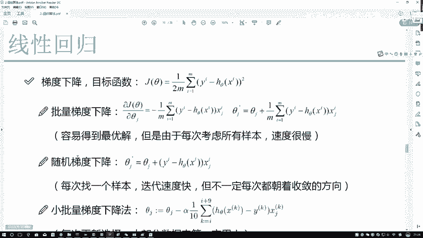

解释了随机，那看起来都各有各的毛病，是不是，那怎么样去解决他们的各自的问题啊，能不能综合考虑一下，再一个就是要给大家说的一个什么，小批量梯度下降，小P下降，小批量梯度下降是这样一个事儿，当前我们有什么。

当前我们有的是不是说哎呀，随机和一个批量要综合了综合过程当中，那你说我现在不用一个，我也不用全部的，我拿出一部分可不可以啊，当然可以的，在这里我们就拿出一部分出来来算一下吧，这一块就是加上了一个什么。

加上了一个这样的一个纸I，从一开始到九，什么意思啊，一共我选十个样本来去做行吧，我不用100万，我也不用一个，只选择其中一部分，后面的结果是不是照样跌下来啊，后面结果是没有任何改变的，这个我都没想。

后面结果不会任何变，只是说呢我把样本数量改了一下，这个叫做一个小批量，或者叫做一个mini batch，有一个batch这样一个含义给大家写一下，这个叫做一个败者，表示这一次咱迭代的一个样本量。

哎呀那大家可能会问，那这一次迭代多少个合适啊，你十个十个20个100个都行啊，但是程序员一般喜欢怎么玩，程序员喜欢一般比如说二的一个三次幂，二的四次幂，常见的有什么常见的一些，比如说256啊，64啊。

128呀，这些是比较常见的一个拜师数量，比如说64表示什么，一次我迭代这么64个样本，这个意思啊，这表示我当前一次迭代64个样本，所以说啊，在这里给大家解释了一个批量梯度下降。

我们实际当中使用的也是这种批量梯度下降，或者叫小批量梯度下降，mini batch表示我一次迭代过程当中，选择一部分样本，这个样本数量需要大家自己来进行设置，后续呢会大家会看到。

我给大家讲神经网络的时候，会看到一些例子啊，例子当中就会涉及到这个BG，BG选的大代表什么，选择大，代表着你当前希望这个结果能够越精确越好，因为样本数量越多，平均越精确吧，但是速度也很慢。

但是呢如果说你样本数量选项少呢，选择一个八个，那速度大概会很快，但是呢没有那么精确，虽然说这个东西没法进行权衡，但是普遍情况下是这样，在你的时间和性能，时间就是你可容忍的训练时间，训练个两年能等吧。

等不了吧，那什么叫做一个机器的性能呢，你的这个batch设置越大，占用的内存，如果说你显卡在玩的时候，占用的显存相对也会越大吧，在你设备所允许的前提下，尽可能越大越好，这东西一般越大越好。

很少见低于64的，除非你是有一些限制，164，128，256是比较常见的，这个叫做一个啊我的一个平衡性下降，以及呢我BT使用的一个方法，然后在这里啊就是该求导过程当中呃，其实我们是求对谁求导。

是对C的进行求导吧，当你对C的进行求导的过程当中，X你知不知道，Y你知不知道，你都知道吧，你在求的时候相当于这样一个事，相当于现在有一个GX，你要对这个就不不是GG里边，它不光是GX。

它是一个G里面再套了一个，里面还套了一个T1这样一个X吧，你是不是要求导过程当中就给它分开去求，先投外层再求底层吧，求外层添加什么，把底层看成一个整体，那这不就是个X次方吗。

X方为求导是2XX直接落下来就完事了，你不用管这个Y和X是什么东西啊，直接落是不就得了，因为你是要对谁求导，你对C的求导吧，你只是关心C它是不就完了，这个是该怎么进行求导。

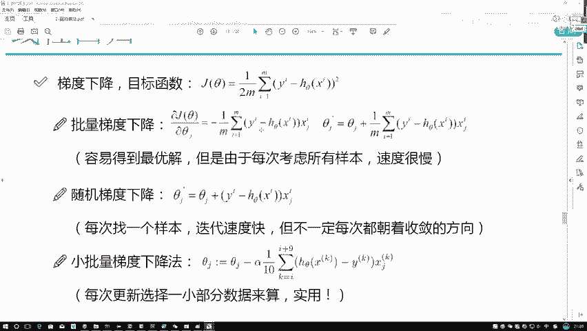

然后呢我们再来看一下，下面还有另外一个点就给大家解释，叫做一个不长不长，或者说你可以把它当作是一个学习率，学习率是这样一个事，你说当我们要进行一个下山任务，我是不是说一次前进一小点啊。

那这一小点儿到底多小啊，普遍情况下，当我们设置参数的时候，就是在你算法模型当中，你需要自己写，叫做一个learning rate，学习率，它一般情况下是比较小的，常见的0。01H表或者是0。001。

这些只是比较常见的，很少前提下说把这个学习率设置的比较大，一般情况下都是比较小，多小为止呢，就是直到你容忍不了的小为止，或者说当你一开始的时候，你可以把学习率设成0。01。

然后你觉得当年这个东西还有点问题，学习的不好，你再把学习率调小一点，这个就是常见的一种方法，当我们再去做调参的时候。

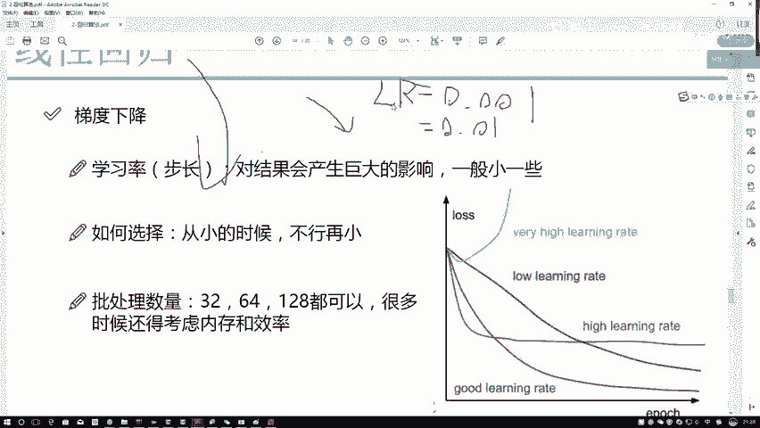

学习率这个参数，或者说一次更新不长的一个幅度，相当于这里还有这样一个参数。

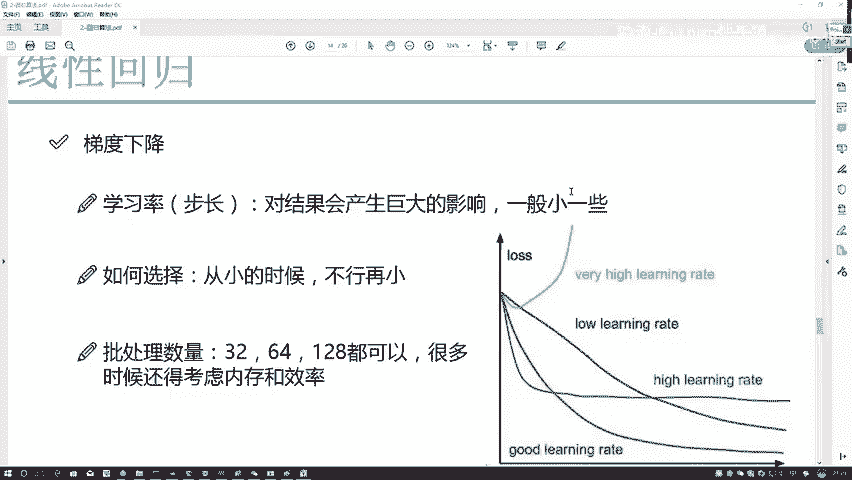

就是这块写了一下，有一个阿尔法是吧，这个阿尔法什么意思，它就表示我们学习率，你看右边算出来这个结果它是什么，右边这个东西算出来的结果，它是不是当前的一个更新的一个方向啊，那你的一个方向。

然后乘上一个就是沿着这个方向走多大距离吧。

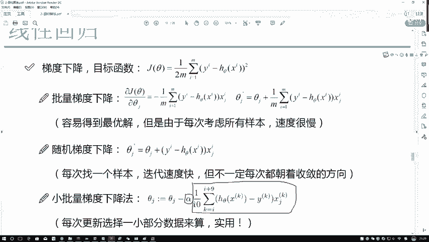

你乘一个系数，这个系数就表示咱当前的一个学习率了，学习率越大。

一次更新越大，学习率越小，一次更新它也越小，这个意思一般情况下几率还是设置的偏小。

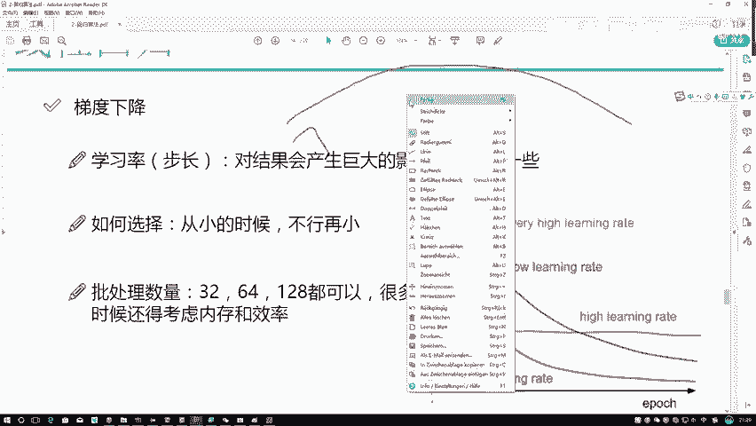

它是比较合适的，然后呢咱们再来看接下来啊。

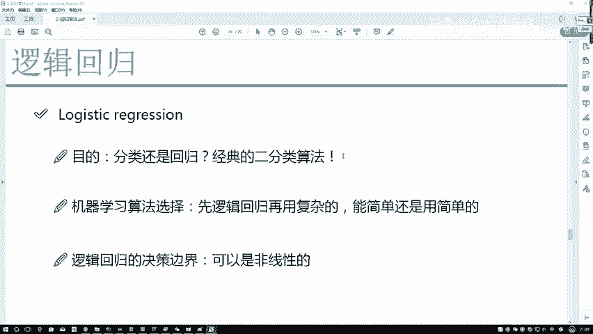

就是呃这个下回就是T下降，在这里已经给大家解释完了啊，解释了一下我们的一个从线性回归当中，怎么样进行优化求解，过渡到了咱们这个梯度下降，其实啊普遍情况下都是这样的，我们是用优化算法来进行求解。

而不用直接求解的方法，所以说以后啊，大家无论看到什么样的机器学习算法，怎么样，机器学习问题都不用想，没有直接求解那一说，都是用优化的思想来进行求解，P下降相当于是最常用最老版。

也是最经典的一种下降方法了，后续可能还会涉及到一些。

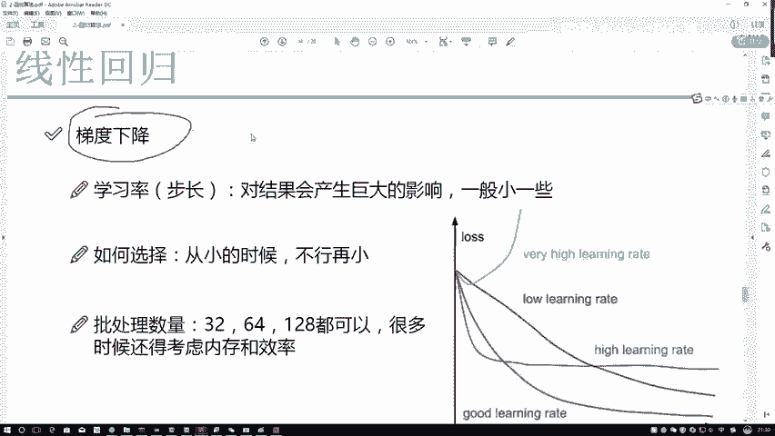