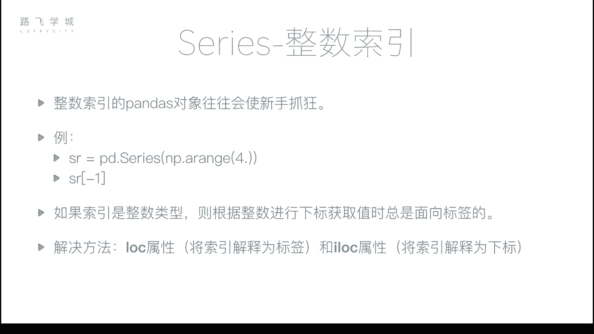
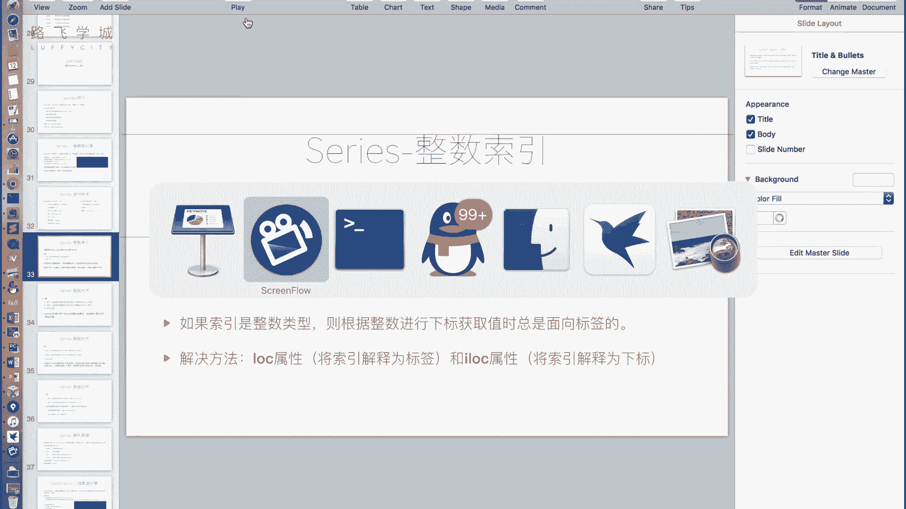
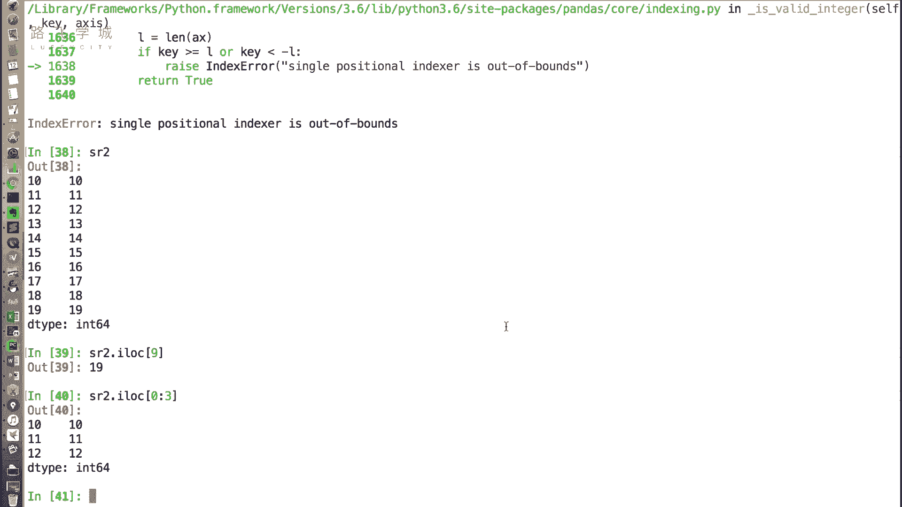
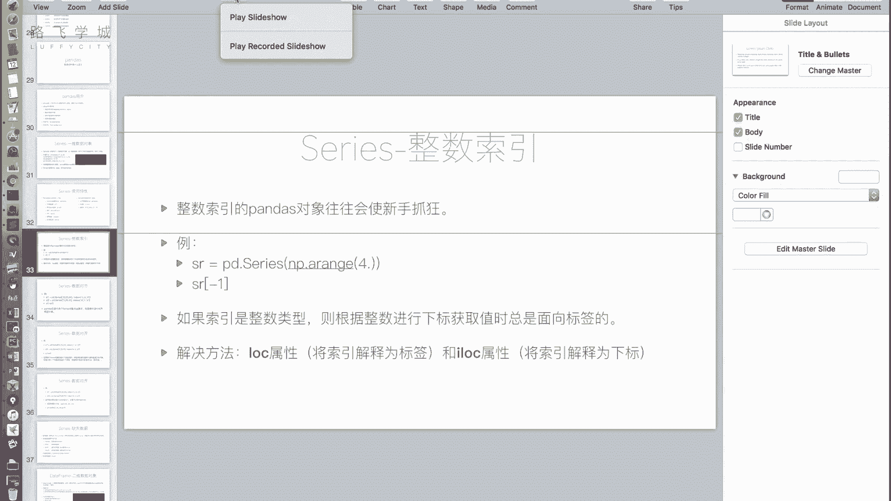

# 【Python金融量化+股票交易分析】清华大佬耗时一月讲完的实战课程，包含基础教程、进阶学习、项目实战案例 - P18：18 series整数索引问题 - 敲代码的技术宅 - BV16J6MYYEkL

那刚才我们介绍了一些series的基本特性，那接下来我要说一个serious对象，使用时候非常重要的一个注意事项，就是当你使用整数索引的pandas对象的时候，往往会让新手疯掉。

整数什么意思，也就是说比如说好。

我创建一个SERIC下嗯，好我通过NP点a range传一传递一个20，我们可以看到这个SR对象是自动生成的，一个整数索引，因为我没有给它指定索引对，所以它是自动生成的。

从零开始到19的这么一个下标索引好，那么如果我把它切片成啊，切片成一个，从十开始到最后的对象，可以吧，好用copy函数让它复制，我建了一个新的，我通过切片建了一个，创建了一个新的SR对象。

那这个SR对象它仍然是整数索引，but他不是从零开始好，那么这个时候我如果输入SR20，它代表什么呢，代表第一个，它代表这个代表是代表最后一个，对它有可能解释为这是这个十，解释为是我们的标签。

那如果是标签，他就应该输出这一行的这个十哦对，那么他也有可能解释为所以所下标对标，那解释为下标所应该输出的是第19个，789十应该输出的是这个值对，那他到底输出哪个呢，哪个都不输出的是十啊。

这个时候很容易使新手服务，而且如果我想SR2一，是不是想获取最后一个值，这个没有七了吧，然而当然它会报错，为什么呀，为什么呀，就是因为当你的下你的索引是整数的时候，使用SR2中括号。

你这个中括号的值一定会被解释为标签，为什么没有，为什么它规定因为有歧义，他不知道该解释什么，他就规定解释标有签，那所以这个时候很容易封掉，OK啊，切片什么的，因为你涉及到有两种解释方式都不好用。

那么我们怎么办怎么办，不要用整数做标签，有的时候我就要用等数字标式怎么办，有办法有两个属性要跟大家说，第一个叫做S2点lock lock，那第二第二个叫SR2点i lock，操什么玩意儿，什么玩意儿。

SR点lock后边加中括号就告诉你，你这个中括号强制告诉你的程序，你的编那个解释器，中括号里边一定解释为标签啊，比如说我这个地方输入十，他输出就是十嗯好，那如果我使用i lock一定解释成一九对。

中括号里边一定解释为下标对，那我这个时候输入十，它输出的是是不是越界了，嗯啊因为开始了从10123456789啊，没有十，那我就输入九二十九，I i lock9，它就输出的是19。

也就是说这个九解释为了谁加标啊，那你建议大家啊用整数索引的时候，一定要使用log和ALOG进行区分，那使用log和i log，只是指明了说你接下来中括号的这个东西，解释为啊是下标还是标签。

那么它中括号里面可以用也是，所以这个切片布尔型索引，花式索引等等都支持，OK只是说显示的说了，你这个到底是索引啊，是下标签还是下标，明白吧，比如说我这是从零切到三，那它就是把前三行切出来。

反正i lock就是用索引来的，因为整数会产生歧义嘛。

所以你要只要涉及到整数，你一定要用lock和i lock就OK了，对不对。

好吧。