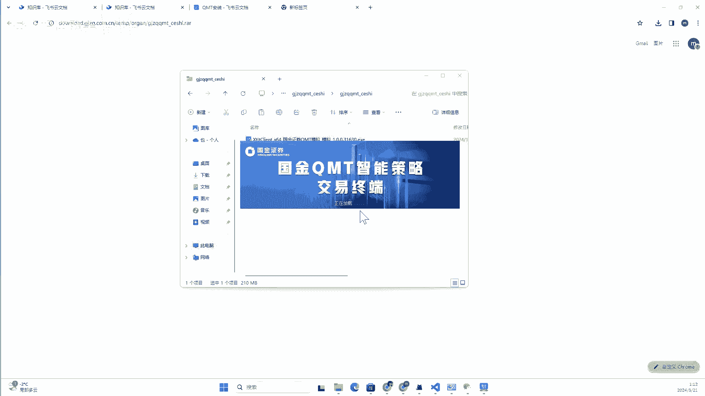
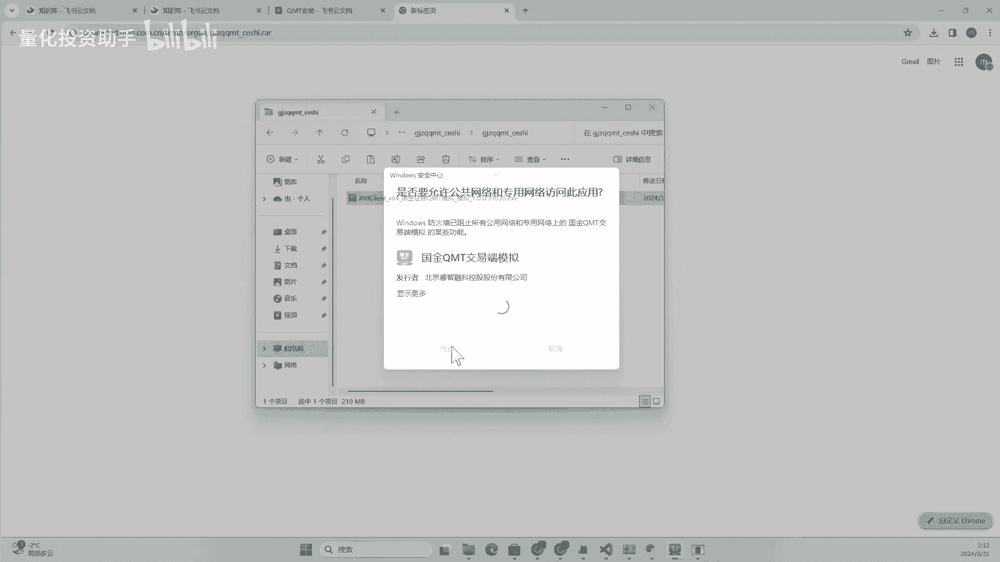
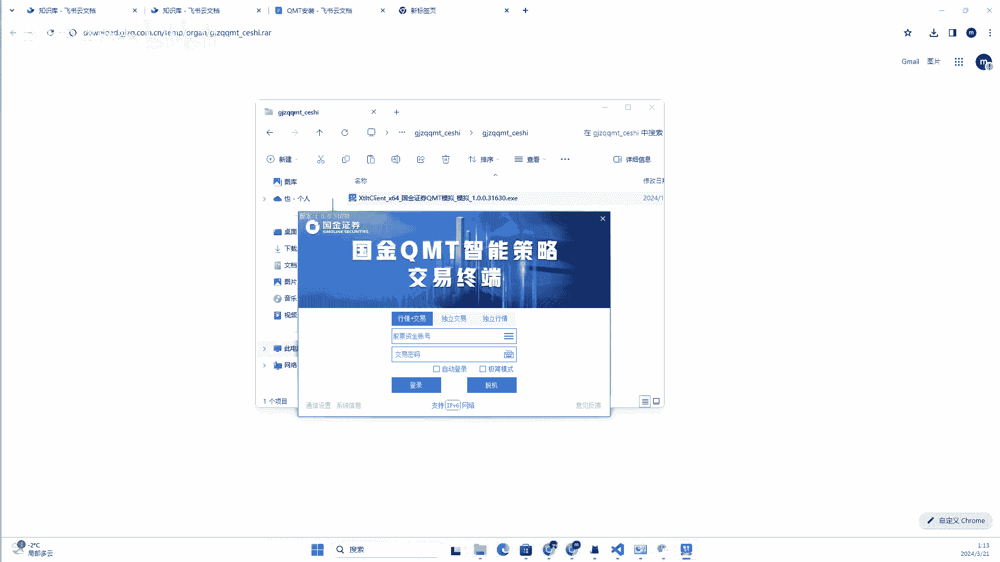
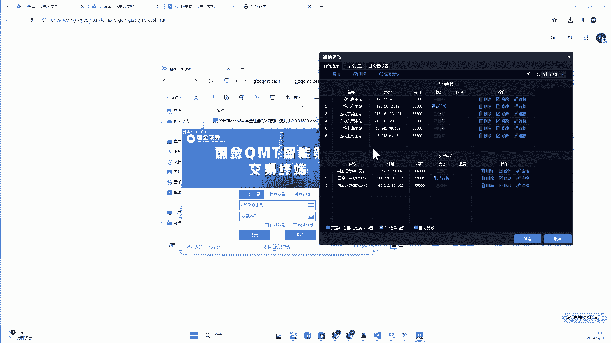
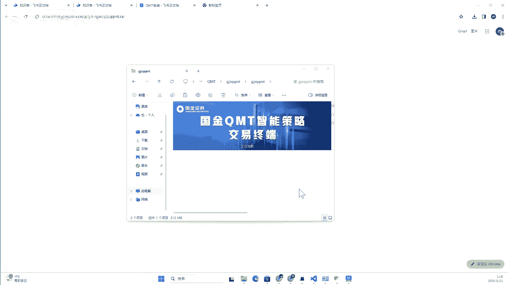
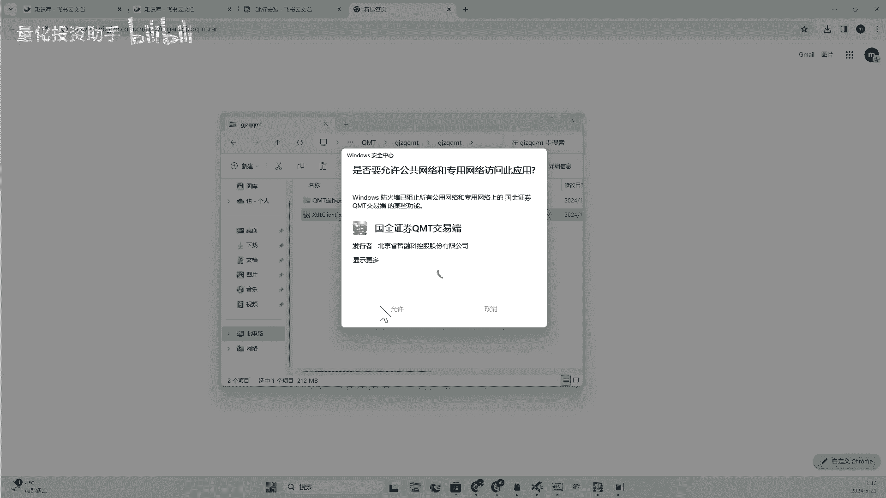
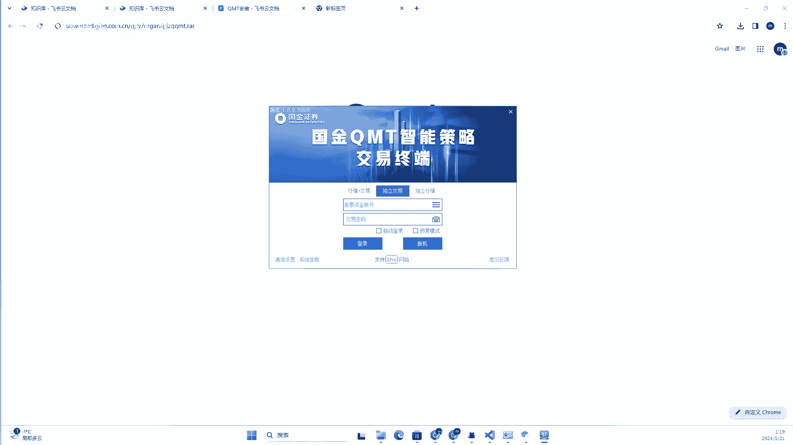

# 【QMT量化交易实战】1.QMT安装 - P1 - 量化投资技术 - BV11f421Z78r

大家好啊，这个视频呢介绍一下KMT安装嗯，开通QMD之后呢，嗯他的其实有两种客户端，第一个呢是嗯模拟端，另外一个是实盘端，模拟端呢是用来测试的，实盘端呢是用来真正进行量化交易的。

嗯这个视频的内容比较简单，我们简单过一下，然后带领大家实操一下，首先是模拟客户端，模拟端呢是券商给用户体验或者测试的，开通之后呢，开户后呢，客户经理一般会第一时间给你申请，然后申请之后你就可以下载了啊。

这是一个信息的样例啊，客户经理会给你发这些信息，他有测试的账号密码，然后相应的链接我们进行一个下载就可以用了，稍后我们会实操一下，嗯在下面呢就是十版客户端，当那个实盘客户端申请下来之后呢。

我们就可以用安装这个实盘客户端了啊，申请成功之后，它会以邮件的形式发到你的邮箱，然后里面有相应的下载地址啊，这是我收到的一个呃邮件的样例啊，可以看到这里有相应的告诉你。

那用户名和密码呢就是你股票账户的用户名，密码也有相应的链接，由于这里呢是啊，我之前开通的啊，就大就是给大家看一下啊，相应的链接呢我就隐藏了嗯，下面呢是客户端的安装，安装的他其实就是一个普通的EXE。

我们就按照步骤指示安装就好了啊，可以看到这是一个它的安装的界面，我们就一直下一步下一步就行就可以了，启动客户端呢如果成功安装之后呢，我们就可以启动它啊，呃如果想用mini mt呢，我们就要勾选极简版啊。

这这是一个登录的界面，然后这里是输入账号密码和极简版啊，这呃现在呢就带领大家简单了解一下，后面我们会进行一个实操啊，然后关于什么是极简版，什么是非极简版呢，我们会在后面的课程里详细的去介绍好。

下面我们就进行一个下载和安装的实操，下面假设我们已经拿到了，这个模拟端的一个链接啊，我们进行一个下载，啊可以看到我们把它链接粘到浏览器上呢，他就开始下载了，我们等待它下载完成。

可以看到我们现在这个文件下载完成了，我们把它解压一下，可以看到这里呢就有相应的E文件，我们点击安装，俺需要一定的启动时间啊，安装界面我们就打开了，我们进行下一步的这个安装啊。

我这里是因为我开通的是铂金的啊，我这里国金的啊，模拟端为例啊，接受下一步啊，D盘啊，然后他会进行安装，我们等待它安装结束，好现在那个进度条已经跑完了啊，然后这里选择创建桌面快捷方式，启自动启动。

我就不不勾选了，那下一步，然后运行，嗯还是等待一下啊，嗯可以看到那相应的客户端就启动了啊。

我们允许。

启动到我这边嗯，然后可以看到这里的话，就是会出现一个登录界面，登录界面上有一些功能嗯，这里有三个选项，就行情交易额，还有呃独立交易和独立行情三种，它会启动啊，顾名思义吧。

就是行情加交易呢就是功能最全的对吧，正常我们就点这个嗯，然后这里的话是资金账号和密码的话，就输入和你开通的相应的账号和密码，极简版啊，这里就勾勾选极简版的，就是mini q mt不勾选极简版的就不是啊。

就是主QMT自动登录呢，那就是自动啊，你点了他下回就会自动登录啊，然后这里可以查看相应的呃这个通通讯配置啊。

点击这个啊，他会显示你的行情主站和交易中心，这个后面我们会详细介绍啊。

目前我们先不用改嗯，那这样呢这个嗯这个模拟端就安装成功了，我们这个视频呢先不登录，只是先把它安装成功啊，后续会介绍登录以及相应的功能好，那我们下一步呢再来安装一下这个实盘段，之前已经讲过了。

十盘端的链接呢在邮件里啊，我这里因为我已经开通过了，所以我找到我相应的邮件，找到相应对应的链接，把它复制到这里，再进行一个下载啊，可以看到10万端呢就开始下载了，这里的报名会少一个测试这么一个后缀。

好我们还是等待它下载完成好的，等待了一会儿，我们的这个石板端也下载好了，还是相应的给它解压啊，然后这里找到相应的实盘的ESSE，还是进行一个安装啊，他说这个我领导进行了保护啊，我这里选择人要运行。

嗯是这样啊，可能因为我这个是新做的系统，然后正好可能防火墙没关，建议大家在装的时候呢，也可以把相应的防火墙给关掉，然后进行一个安装呃，安装的这个客户端的这个步骤呢，跟刚才模拟端没有任何的区别啊。

只是名声变了一下，因为嗯其实他两个本身的在程序上呢，基本上就是一个软件，只是配置和配置不太一样啊，一个是模拟交易，一个是实盘交易，就差在这儿已，然后我们还是进行一个安装啊，等待他的进度条读完好。

进度条读完了，然后这里的话它默认给我勾选了自动启动，我不要这个东西啊，然后下一步啊还是运行一下。

嗯可以看到这个哦，这个还是允许一下。

呃这个登录界面呢跟模拟端没有任何的区别啊，其实是类似的，只是嗯功能上，实际登录之后的功能上有一些区别啊，那这样呢，我们就完成了模拟端和客户端和实盘端，两个端的安装啊，这关于这两个端呢。

其实在你实盘端开通之后呢，模拟端基本上除了你日常做一些测试，他基本上不要太用，不推荐他用太多的这个模拟端，都用实盘端就可以了啊，当因为但是实盘端的开通呢需要一个过程啊。

那这时候可以拿那个模拟端熟悉一下功能，练练手啊，这就是这两个客户端的区别和用途啊，好那这第一节呢关于KMT的安装，我们就介绍到这里。

