# 【iFinD云课堂】金融分析与量化投资系列课程(三)Python基础语法 - P1 - 同花顺金融数据终端 - BV1HSqbYXEnG

啊咱们整个课程体系啊，它我在讲的时候呢，以及同学们在自己练的时候呢，都用咱们IPHONE终端就可以了，就可以完成了，那么咱们在终端里面怎么打开量化呢，那我们可以看到这里有一个这个工具中啊。

有一个量化风控是吧，这里就有量化研究，那在这里就是我们的量化平台，那我们所有的课程都是在咱们的量化研究中啊，进行这个啊进行讲述的是吧，那今天的主要内容对吧，今天主要内容大家看到是，咱们会去介绍同花顺啊。

不是咱们去介绍这个Python的基础语法是吧，啊基础语法这个关于Python呢，我们在一开始给大家讲到过，这个Python是咱们说做大数据啊，数据分析以及做量化的啊，基础是吧，做做量化的基础。

那么那么Python到底去怎么去学呢是吧，怎么去学呢，那呃肯定啊，你开始学Python的时候，你要知道这Python它是一个什么什么东西对吧，你怎么去用它，而这就涉及到下载安装的问题啊，这个下载安装呢。

我们说嗯咱们说可以直接在百度上去搜一个啊，咱们百度上去搜Python是吧，啊咱们去输Python，然后呢这里会有一个官方的网站是吧。

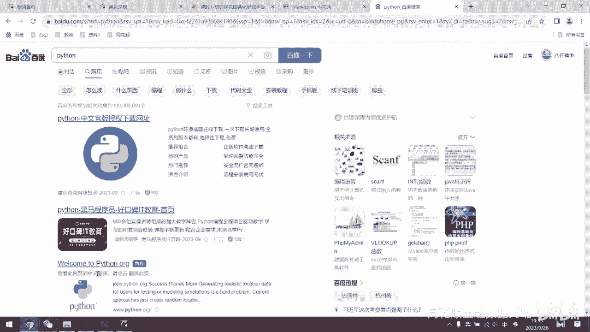

这个Python的官网，啊关于这个Python呢它会有一个官网，他这里面呢就会有Python的这个下载是吧，这一般我们下载下来，它就会自带一个Python的集成环境是吧，自带一个集成环境啊。

因为这个官网是外网啊。

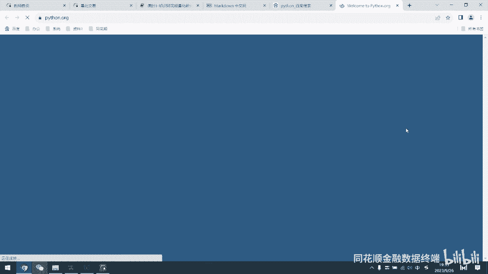

外网，所以说打开的速度会偏慢一些，这个服务器在外面啊，那么可以看到啊，在这里呢就是我们说Python官网啊，在这里会有一些下载下载的选项是吧，现在的Python呢可以看到这里有什么Python，3。

11是吧，3。11这个所有版本啊，以及我们说源源代码，然后呢关于windows的版本是吧，关于咱们说Mac也可以是吧，然后Mac苹果电脑也可以，还有说其他的平台啊，LINUX呀什么的也都可以。

这个就是咱们Python的一个好处啊，它就是指呃不限制平台是吧，是任何平台上都可以用对吧，不像有些软件呃，数据分析软件可能它只有windows版本啊，它甚至没有Mac版本，比如说什么。

我记得这个那STA，STA好像是没有这个苹果版本的啊，这Python用起来就很方便。

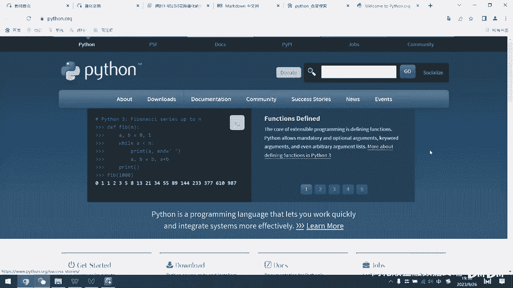

它这个啊非常方便，在官网中呢可以选择下载，然后呢这里还会有其他的一些这个工具，比如说在这里会有一个什么啊。

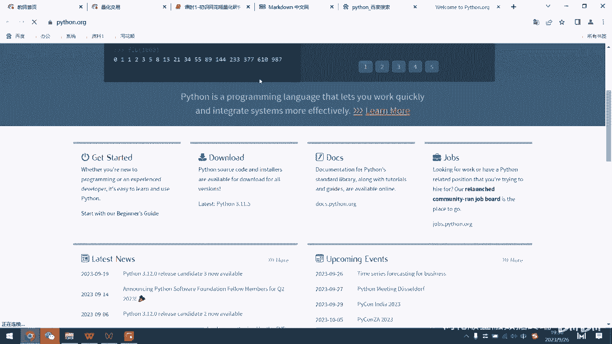

会有一个新手的指导是吧，新手的指导啊，那但是我们在官网上下载的Python呢，其实并不是很好用是吧。

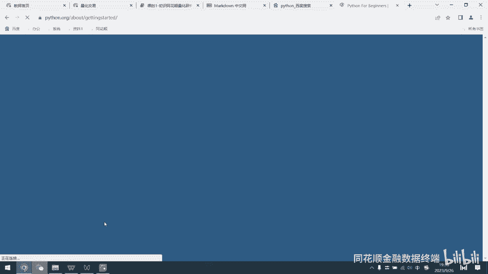

并不是很好用，我们可以看到在。

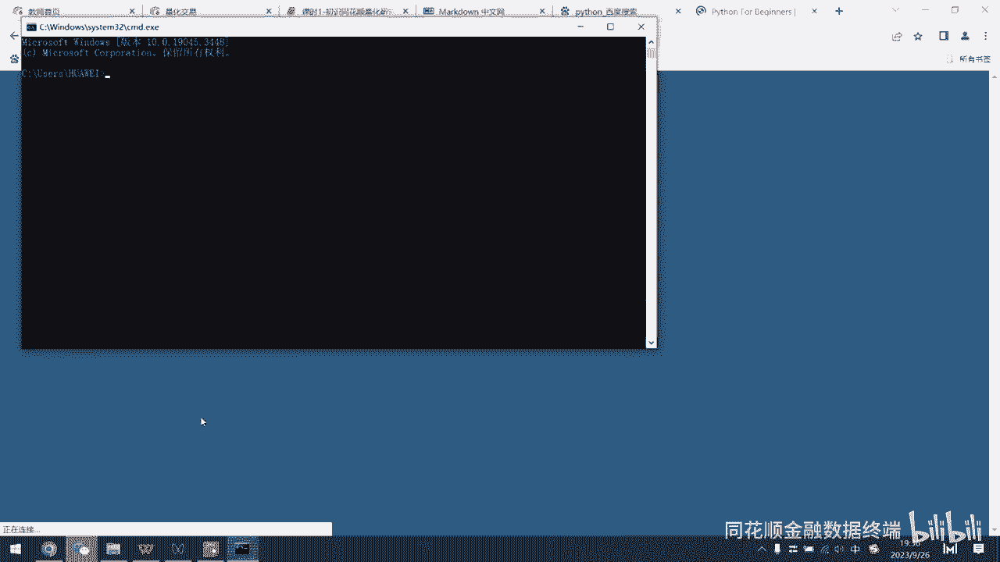

啊在在官网上下载的这个呃苹果呃。

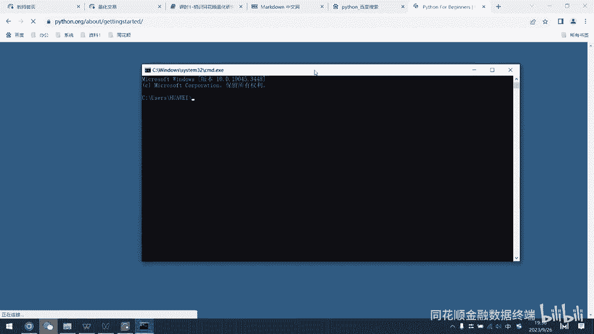

这个Python它会有一个集成环境是吧，啊它会有一个IDE是吧，集成开发环境，那么它的这个界面呢，就会像我们的电脑的这个运行一样，它只是这种黑白的是吧，它只是这种黑白的，然后呢你就只能在上面去输入啊。

去输入这个，文字是吧，把输入文字，然后呢去运行啊，其实是非常不直观的，非常不直观的，那么可以看到在这里啊，我们这台电脑其实是没有下载jupiter notebook的，是吧。

没有下载jupyter notebook，所以说我们在运行的时候呢，他就哎也会告诉我们直接啊报一个错是吧。

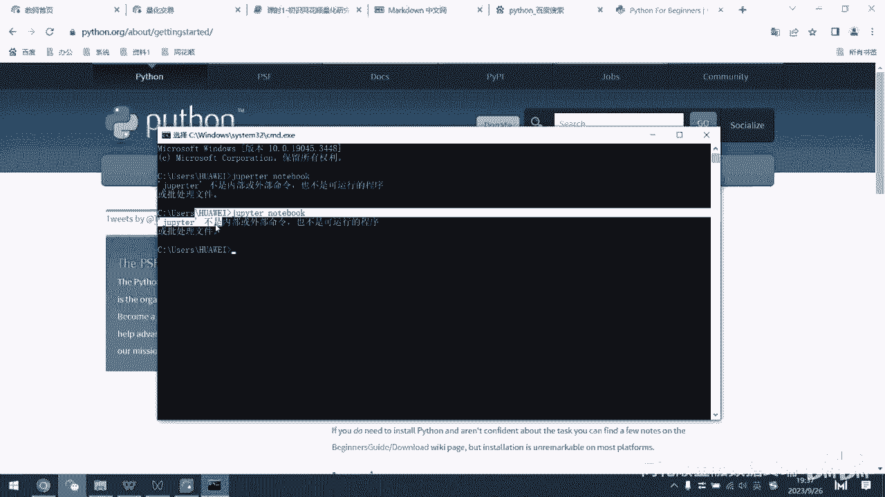

报一个错，那么我们说Python官网它的集成环境就是这样子，很难用是吧，很难用，那我在这里最推荐大家下载的，就是咱们说anaconda，安娜康达这个软件啊，他其实他这个像大蟒蛇是吧，大蟒蛇我们在搜索啊。

我们搜索它就可以看到他的一个中文网啊，在中文网，然后我们各个平台上也都会有，关于安娜康纳的一个教程啊，啊这个教程是吧，咱们呃CSDN也有，知乎也有是吧，这个教程。

这个我们就是说安娜康纳他的官方的文档是吧，这个官方的文档，那怎么去用，那么我们可以在这里直接去点击下载啊，直接点击下去跳转到安娜康纳的下载界面啊。

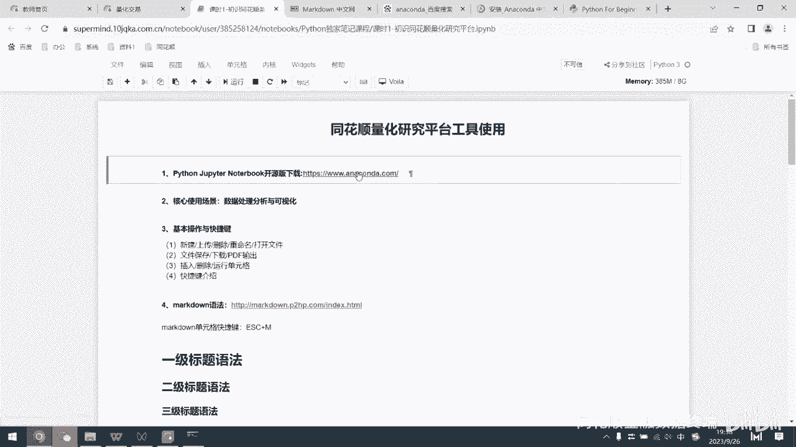

他这个下载界面呢需要咱们说先去申请一个，申请一个账号啊，这个账号然后呢就直接去下载就完了。

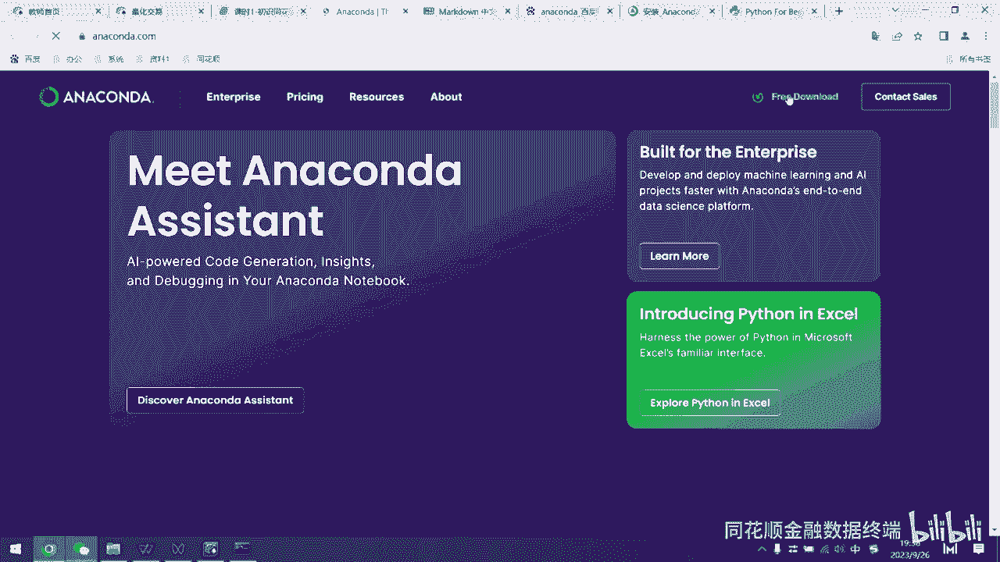

然后下载就完好了，这个我们说下载，根据你的电脑选择不同的版本啊，因为你登录的时候呢。

它是需要你的一个云账号的，这苹果的是吧，那那这个这个这个这个windows就在这里啊，就在这里LINUX的是吧，那这个anaconda下下来之后呢，我们就可以它它其实这个anaconda呢。

就像我们去网吧是吧，网吧的这种游戏平台，它里面各个软件呢全都在里面啊，各个软件全都在里面，然后呢你只要去点击额。

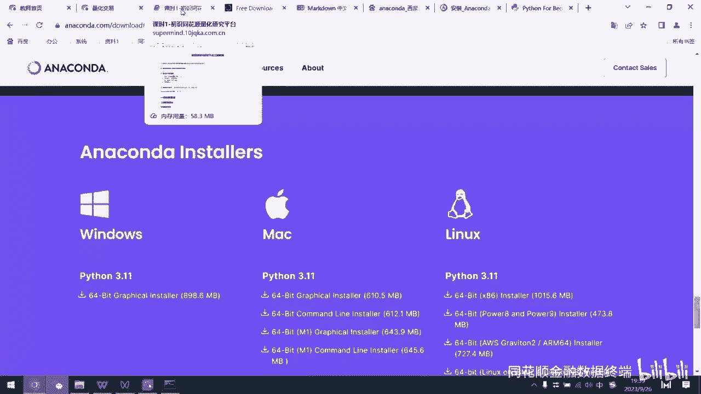

你想要用的咱们说这个软件，或者说咱们叫做这个IDE就可以，我们说一般用的最多的就就这个jupiter notebook，用的最多的是吧，然后呢包括我们这个流量化实验室里面，它其实是什么呢。

它其实是内置了哎，内置了一个jpter notebook这个研究平台呢，他就是他就是其实就是那jpter notebook啊，只不过是我们在这里呢创建一个文件对吧，新建了一个python3文件。

然后呢我们在这文件里面去进行编辑对吧。

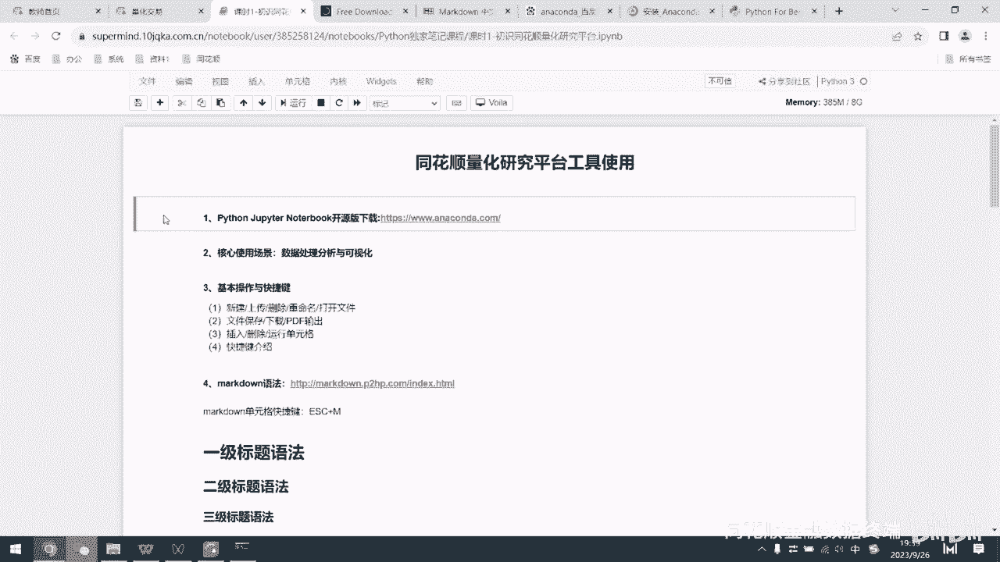

进行编辑，那么啊关于安娜康纳的下载呢就是这样了，然后呢下载这个安娜康纳之后，其实呢，你会也有可能有些同学不不想用这个notebook是吧，他有可能说用这个什么啊，spider啊。

或者说这个patch charm是吧，patch charm呢也是也是一个集成环境，只不过它的区别呢它会更加啊重量级一些啊，他会是呃有一些这个复杂的项目，或者说开发的项目啊。

我们说一般人们都会去用这个拍char。

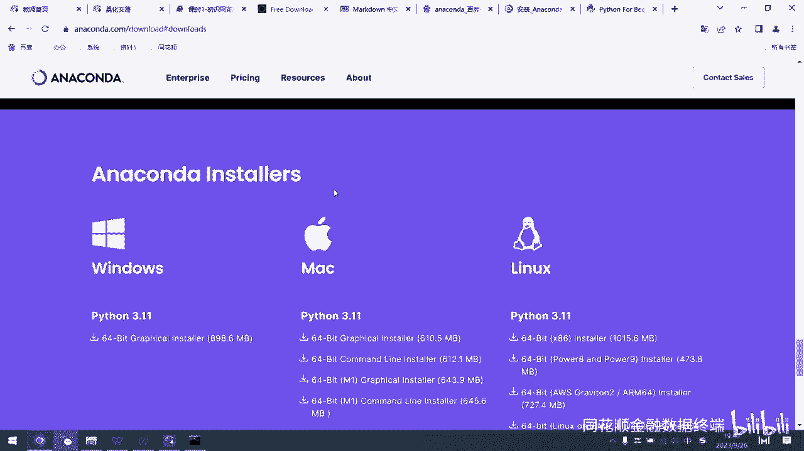

让我们说说做这个量化的研究啊，或者说咱们去分析一些数据啊，啊用轻量级的这个notebook就可以直接完成了，就可以完成了，这notebook呢它有什么一个取呃，什么什么好处呢。

就是说大家可以看到我的我的这个键盘啊，点上下是吧，它会在不同的单元格之间进行进行跳转，那么每一个单元格它都是独立运行的，它都是独立运行的，那么我们可以在一个单元格里面去进行，咱们的操作是吧。

来进行我们的操作，然后呢去运行它是不影响别的单元格的，所以说呢，这就很方便我们去进行代码的修改和调试啊，啊测试和这个是改动啊，测试和改动是吧，每个代码块独立运行啊，然后呢他们他这个notebook啊。

它还有一个好处，就是说它可以在不同的模式下进行转换，那么大家可以看到这里有一个in是吧，啊这里有个in，然后呢我们说呃咱们去点击，在这个它是处于蓝色的这个状态下啊，我们去点击键盘，键盘上的M是吧。

键盘上的M哎，可以看到他这个印就没有了对吧，印就没有了，因为这个我们这个快捷键M呢，是把我们的代码格式改成了什么，改成了咱们的标记格式啊，标记格式也就是咱们的markdown格式。

我们可以看到在这里再点一个M是吧，啊在这里再等一个M是吧，都改成了咱们的标记格式，然后呢改回咱们代码模式怎么改呢，点击一个Y啊，点击键盘上的一个Y，那就改成了代码格式了啊，大家可以看到这个其实额好处呢。

可能现在还看不出来是吧，那在之后讲解中呢，大家也可以看到，为什么啊，为什么说这样非常方便啊，那么在咱们的这个markdown格式下呢，它它会有一个，其实markdown它也有一个自己的官网啊。

我们说点击这个官网可以进行这个跳转啊。

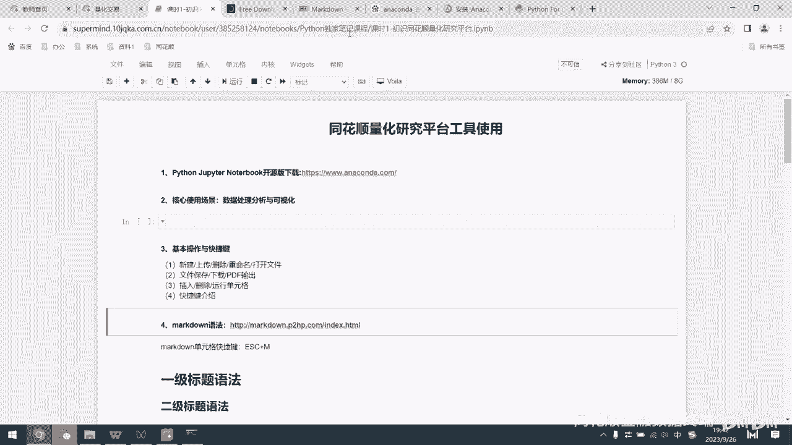

这个是他的markdown中文网，然后呢他会有咱们的这个入门啊。

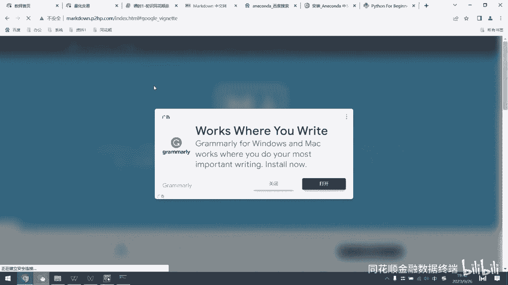

他会怎么入门，这markdown是什么是吧，这个markdown呢，它其实这个语言中呢功能非常的强大，我们可以在里面直接输入文本对吧，这个就是文本了，那我们同样也可以输入什么，我们输入一个网址。

大家可以看到这个网址，我我我鼠标移到这边，它就会有一个哎它就会有一个变化是吧，我们去点它，它就可直接可以为我们跳转到这个网址啊，这个网址格式对吧，那么我在这里再给大家展示一下啊。

我在这里如果是截一个图是吧，啊不截个图，我直接这样子，这个复制图片是吧，复制图片，然后呢在咱们在这里啊，去先把它调成啊标记格式，然后呢再去点击粘贴啊，诶粘贴不出来是吧，这个复制图片应该是复制图片。

然后呢。

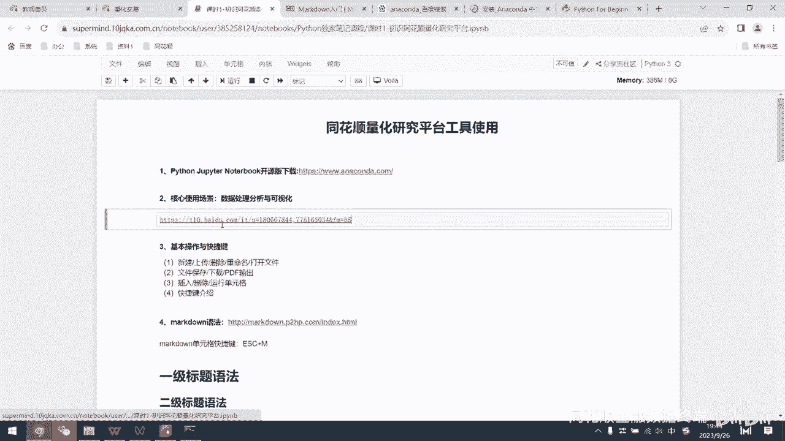

在这里他也可以完成跳转，但是他跳转其实是一个图片的链接了啊。

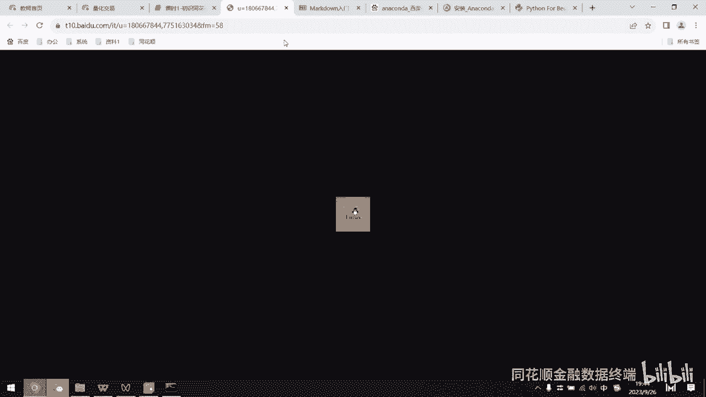

我想要指的一个是截图，截图，比如说这样我去截一个图啊，然后呢我在这里呢选择粘贴对吧，粘贴，那么在运行一下哎，可以看到啊，这里其实是已经我们把这个截图插进来了是吧，这个是markdown的另一个。

那它其实支持多个模态的一个文本输入啊，我们说图片啊，那URL啦，还有咱们文本啦都可以啊，都可以，然后是吧，这是一个例子是吧，这是一个例子，那么那么在这里呢，还关于关于我们说JPNNOBOOK是吧。

我们说还有一些基本简单的一些呃操作啊，基础操作呢就是咱们在这个首页界面是吧，首页界面，如果说你下载了本地的anaconda啊，你也可以说去，在这里也可以看到是一模一样的界面啊，这个界面是一模一样的啊。

只不过呢它里面的这个路径呢，就是你的电脑的文件夹了啊，电脑文件夹了，因为我们这个时电话平台里面的路径，所以说它其实是我们的云文件夹啊，云文件夹，但是带呃逻辑都是一样的啊，我们在这个文件夹中啊。

可以去新建一个文件啊，点击新建一个文件是吧，它其实是一个空的文件呃，文件了是吧，空文件我们把它关掉是吧，那么在这里呢可以看到这是我新创建的，那么选中它之后呢，我可以把它关闭关闭是吧，关闭它的绿色就没了。

为什么要把它关闭呢，因为我们说不管是云路径，还是我们说本地的路径啊，这个运行的状态下，它就会占用我们的内存的啊，运行的文件太多了，我们的运行起来就非常卡是吧，这上面会有我们的内存使用情况啊。

还有我们的存储空间，存储空间呢，就是我们说他是把这个存存储存储啊，文件大小占了多少是吧，那么这个是咱们说新建一个文件是吧，那么那么在上传，点击上传，这个按钮呢就可以把我们电脑里面的啊。

就可以把我们的电脑里面的IPYNB对吧，这个格式的文件直接传进来，或者说也可以去传什么啊，咱们的数据哎，传咱们的数据，比如说CSV格式的，或者说这个excel格式的数据啊，我们都可以通过它上传上来啊。

上传上来，那么这是上传功能啊，这是新建功能对吧，那么点击进来之后呢，我们可以看到哎我们这其实是一个Python文件对吧，但是呢它的它的大小，它的字体大小什么什么的都不太一样是吧，那有的它显示在中间。

那么有的呢它有这个序号是吧，他有这个序号，那么有的呢他这个是加粗了，有的没有加粗是吧，有的没有加粗对吧，这是只是怎么去处理的呢，哎怎么去处理呢，还有说加粗和斜体是吧，斜体那么这个加列表是吧。

这个是无序列表，那这个是有序列表，那甚至还可以咱们去调整这个字体的颜色，来字体的颜色，甚至说加目录是吧，加目录，而我们去点击到这个这个目录里面呢，就可以去跳转啊，它其实是往下去跳转到了目录一了，对吧啊。

这是加目录这个操作，那其实呢这个这些操作呢，都是属于咱们的这个markdown的这个基本操作了，基本操作了，我们说啊一个一个来讲啊，首先呢说新建这个上传这些的，都已经那个什么讲过了对吧。

那么接下来第二个我们说文件的保存，下载是PDF输出呃，也就是说你整个这个文件怎么去输出出来是吧，那么在这里是一个保存的按钮对吧，大家都知道了，那在文件中呢我们可以选择什么，选择什么，这个说把它另存为啊。

或者把它重命名对吧，保存都可以，那下载为什么呢，下载为咱们可以选择什么IPY文件对吧，还有咱们说HTML啊，他这个其实就是一个啊像像网页一样的格式了，像网页的格式啊，当然还有其他的一些这个格式了啊。

还可以输出成PDF和文本是吧，这PDF呢其实就是咱们呃，可能说给别人分享起来啊，用的最多的一个一个文件了，一个文件，那这个是PDF的文件格式啊，那么在这个内部呢，这个第三个小节咱们怎么去插入删除啊。

运行单元格是吧，插入单元格呢咱们说可以向前插入和向后插入，可以进行两种选择是吧，咱们同样还是要在颜色是这个蓝色的时候，才可以去点击这个快捷键啊，比如说在这里我去点击个什么A键对吧。

字母上按这个键盘上的A呃，就是说在这个单元格的前方插入一个是吧，再点个A是吧，再插入一个是吧，那么往后插入怎么去点呢，就是快捷键B啊，快捷键B往后插入，那么删除怎么去删除呢，删除就是点两下D哎。

点两下D，是吧，那么咱们还有一个运行快捷键的运行单元格，我们这里可以看到他，这这个in后面其实是有空的对吧，这个空的呢就代表它没有运行过，还没运行过，我们在这里呢随便输入一个了是吧啊，是是个一等于一。

一等于二是吧，然后呢把它运行一下，运行的快捷键是shift加enter，shift加回车键，哎是吧，运行一下，然后呢他这里是二是吧，说明我们这是运行了第二次，就是说整个文件啊，它只运行了第二次，对吧。

我们是运行的，他这里是报了个错，对吧啊，他这里报了个错，那么说一等于二是吧，这里呢其实就是咱们说啊会结婚，待会再讲，到了待会又讲了两个等号，等于判断它其实它会为我们去进行一个判断，一是否等于二是吧。

那我们说这个肯定不等于二了对吧，那所以说它会输出一个false false，布尔型false是吧，那这个是但是我们重点是运行啊快捷键来运行，那么shift加enter就是运行单元格啊，单元格。

那我们说如果说点击到这个单元格内部，可以看到这个光标其实是变成了绿色是吧，它这个绿色呢代表我们现在处于编辑的状态啊，编辑的状态，这个编辑状态下呢，你其实去按快捷键就没有用了，比如说你在这里点了两个D哎。

其实它只是会默认你去输入，输入了两个D是吧，A也是一样啊，A也是一样啊，然后呢只有我们说当它处于蓝色的时候，我们再去点两个D哎，他才可以说快捷键有用啊，快捷键有用，那么接下来啊。

接下来这个是咱们说markdown格式下，markdown格式下怎么去把它做这个标题啊，做一级二级三级标题是吧，大家其实平时用过word啊，用过word也都知道怎么去用，是吧，唉怎么去把它标成一级标题。

二级标题就直接点一个字体就好了对吧，直接去点这个字体的调调整就可以了对吧，那么标题一标题二是吧，然后我们去用这个呃markdown格式怎么去调整的，其实更简单更简单，我们只需要说先输入一个井号键啊。

当然了，我们要把它转化成markdown格式啊，输入一个井号键是吧，然后呢这是一级标题，对吧，一级是吧，然后呢那输入两个井号键呢，它其实是一个二级标题对吧，三个呢那大家可以看到这个字体也跟着变化了。

三级标题四个呢，这就四级标题了，大家可以看到需要点一个空格啊，跟这个跟我们的标题之间需要点一个空格，那它才可以识别出来，这个是按标题的这个输入是吧，那么可以看到哎，这里是一级标题，二级标题，三级标题。

四级标题对吧，那输入井号键，再加一个空格，那就可以了是吧，那么我们说在这里如果说让他居中怎么去做呢，居中我们可以看到，其实在前面你输入一个，输入一个什么呢对吧，一个小于号，一个大于号。

然后呢在里面去输入一个center，然后呢再去点一个空格是吧，这就居中了啊，是吧，这就居中了，那么加粗呢其实很简单，我们说需要加粗的字体，前面我们加两个呃星号，后面加两个星号，那就是加加粗。

那斜体呢啊要把这个我们说输入的文本啊，斜体表示我说加一个信号就可以了啊，加一个这个型号也就是乘号啊，其实是其实咱们乘号也就是这个数字键八对吧，他的这个乘号，那么加入列表是吧，加入列表怎么去加呢。

呃咱们说一个加号，一个空格是吧，然后呢说这个是这个是无序列表了，无序列表，然后你需要去输入第二个无序列表呢，你再去点一个加号是吧，第二个是吧，然后再去点击运行，哎，它就可以看到这。

这里就是一个圆的这种无序列表了，这跟咱们呃word里面也很像是吧，也很像咱们就是这种这个项目符号了是吧，项目符号，那只不过呢我们其实word里面它调整，可以变化的更多一些是吧，更多一些也更乱一点。

其实其实我觉得更乱一点，我那要是我来选的话，我更喜欢用这个markdown格式啊，它这里输入的字大小，字体的大小是吧，一般啊都是说一样大小的对吧，除非你去进行一些额外的设置对吧，比如说在这里啊。

这里这个字体明显啊是吧，它又红是吧，又变大了，那么可以看到，我们可以看看他是怎么去进行修改的，怎么去进行修改的，那么其实呢就是说我给大家分解一下啊，这里有一个什么，先是小于号，大于号对吧。

然后呢在这里面点一个font啊，这个font font的意思就是调整字体了，调整字体了，这个我们说啊他的这个个性化设置呢，你可以去设置成啊size size就是说font size了，字体大小了对吧。

然后呢我们说在这个在这个这个这个括号里面，是我们的设置啊，括号的外面呢，括号的外面是咱们的什么，我们的需要去背诶，这个修改的字体，比如说这里是变大是吧，那个larger，然后把它变成更更大的。

然后呢在后方结束的时候，还同样还是这个括号，但是要加一个什么结束符号是吧，这个这个斜杠，然后呢再去点一个font，那么我们就完成了字体的个性化设置啊对吧，它其实是哎设置好了，但是平时我们一般不用它啊。

一般有点麻烦是吧，有点麻烦，因为咱们说直接去，如果说要改字体大小的话，你就直接直接去这个这个点，一个井号就好了是吧，一个井号它也它也就变大了，那这个是我们字体大小，但是设置颜色的话呢是吧。

咱们就是color等于red是吧，那你不想等于red等于这个yellow，是吧，他这里就变成了黄色字体了是吧，啊这里就是我们说红色的啊，微软雅黑5号对吧，微软雅黑5号，这是我们的face，就是字体啊。

字体的样式，字体的样式同样还是跟咱们这个也一样啊，啊刚刚是一样，这里设置就好了是吧，这里设置这字体的颜色设置，因为这里是差不多，鼠标点选交互性更强一点啊，我们说markdown格式呢胜在一个轻便。

胜在一个轻便简洁啊，啊这是我们说调整字体大小，然后呢，这个颜色呢，我们当然也可以设置成这个LUE是吧，蓝色啊，然后呢我们在这里继续讲啊，继续讲，这里就是我们的目录啊，我们的目录需要设置目录。

这个稍微有点复杂有点复杂嗯，因为咱们的这个目录呢，是需要连接本文中的其他位置对吧，其实就是一个超链接的跳转了，但是这个超链接是限制在本文中的对吧啊，本文中的，那，所以说呢可以看到。

我们直接直接看他的这个格式是怎么样的，这个BR呢不用管它BR是换行的意思是吧，换行的意思呃，我们说下设置目录只需要去写两个括号是吧，一个括号呢是方格啊，英文的方括号它代表我们需要展示的这个字体。

然后呢后面的这个括号是我们的圆括号对吧，圆括号代表我们要链接的位置啊，链要链接的位置什么意思呢，大家可以看到这里有一个井号，圆括号中啊有一个井号，然后呢什么一目录一对吧，那我们在下文中去找一下。

可以看到诶，这里是不是有一个什么井号啊，一目录一对吧，目录一一目录一是吧，这是个这我们说要去写目录的时候，直接把这个目录的标题直接复制一下是吧，粘贴到咱们的这个啊括号中就可以了是吧，圆括号中就可以了。

这这个就是我们需要链接的位置是吧，这个两个部分嘛，第一个部分我们是啊，这个他长什么样是吧，第二个第二个括号呢，代表它要链接到什么位置是吧，我们这里呢选择目录一目录二目录三是吧，我们点目录三啊。

他给我们跳转到了目录三所在的位置是吧啊，这就是我们说做这个目录啊，要去啊要这个注意的啊，其实其实也简单啊，其实也简单呃，也不需要去特特别的去记，如果说你忘了，你在百度一搜就好了。

这个这个怎么去做目录是吧啊，markdown markdown这个格式下目录怎么去做是吧，他就会他就会告诉你，那么以上呢都是咱们说关于markdown格式哎的。

关于markdown格式的一些快捷键和操作啊，简单的操作设置啊是吧，那么关于代码格式呢，其实咱们说这个就是呃，就是说在里面输入什么内容的问题了是吧，那快捷键还是说运行嘛。

那运行shift加enter就是运行，然后呢，我们说代码格式我们也可以去呃，去显示缩放是吧，进行缩放，我们可以说点这个小三角是吧，直接把他这个藏起来啊，藏起来，这个out呢就是说它运行完了。

他就会给你一个out啊，就给你一个out，那这个是咱们说啊，咱们说juper notebook，其实使就非常NOBOOK的一个使用说明，但是咱们同花顺影的量化平台啊。

其实也就是咱们内嵌了一个notebook，那所以说我们直接点击进入是吧，好，这只是一个线上版的啊，Notebook，这个如果说各位同学自己说还不太懂这个，这个Python或者说怎么样呃。

不知道怎么去配置环境啊，这些的呃，咱们说直接就用咱们呃呃，IFM的金融数据终端里面量化研究就可以了，就不需要自己去下载一个Python了是吧，就不需要自己去下载Python了。

这台电脑其实是没有下载Python的啊，但是呢我们说做写Python代码啦，去运行了，去做数据分析也是一样，可以用对吧，我们直接用云端的环境就好了，因为咱们量化实验室里面。

它其实是呃配置了咱们日常常用的，非常多的数据科学的库的，就比如说我们的N派啊，pandas嗯，或是画图的库，或者说机器学习的库啊，都是在咱们的云端里面的，所以说呢你不需要去自己配置一些环境呃。

因为一开始你在啊，初学者对于配置环境这个东西，已经是一个非常头疼的问题了，因为可能说配环境半天配不好对吧，配置环境配不好，你以后再去敲代码什么的，就不可能完成的是吧，很多人在这一步就放弃了。

那么为了大家不要放弃啊，大家就用他们这个云端环境就好了是吧，娱乐环境就好了，听到这里呢，大家其实都很都很好学是吧，都很好学，那么我们也希望啊听这个课呢，你真的可以说自己还有能力敲一敲是吧。

能学的进去是吧，不希望说你们在其实是一个非常简单的，这个安装下载安装这里耗费太多的时间啊，耗费太多时间，那么大家可以看到，在这里呢我们说嗯其实熟悉了代码格式和啊，和什么咱们的标记格式之后呢。

我们其实就可以去进行进一步的啊，咱们说Python的基础入门了是吧，Python入门了，那我们说在基础语法中呢，我们需要搞明白是吧，大家现在呃如果说手里面打开了，手里面一再用电脑看是吧。

或者说电脑在旁边呢，这个跟着我一起来操作啊，啊咱们打开研究平台是吧，新建一个文件，新建一个文件啊，就是说咱们Python点击这个新建python3是吧，点击这个新建文件，那么你会跳转到这个界面来。

跳转到这个界面来之后呢，跟着我来进行一些操作啊，进行一些操作，首先我们说要去用一下咱们的print，这个print其实是一个打印的意思，对吧啊，咱们都熟悉啊，这个跟着我去敲是吧，这个print。

然后呢去输入一个，英文括号是吧，shift加上这个数字3。9对吧，这个英文括号，然后呢在中间你去输入一个123，你运行一下I运行一下，可以看到他其实给你输出了一个123是吧，输出了一个123。

那么那么接着我们再去进行，再去敲一个代码，就跟着我去敲print括号，括号中呢点击一个引号啊，引号大家可以看到这里有个引号对吧，引号中呢我们去输入一个，是吧，Hello world。

也就是咱们去开启咱们的Python的学习啊，Print hello world，那我们可以看到运行一下是吧，他其实为我们输出了一个i hello world，这个你输出输出到这个嗯，给你运行正确之后呢。

你就可以啊，如果说他不报错是吧，如果说他不报错，那么恭喜你是吧，第一关咱们已经闯过了是吧，第一关已经闯过了嗯，这个到这里呢，我们就算已经敲出了自己的第一个啊，Python程序是吧。

那么接着我们再往后再往后来看是吧，这个print其实啊，我们刚刚是呃举了一个例子对吧，怎么用print这个东西啊，print其实就是一个打印了是吧，打印的东西是什么，那就是你括号里面的东西啊。

就是你括号里面的东西，如果说你要去打印一个数字对吧，比如比如说123是吧，那那么他就给你打印123，如果说你要去打印一个算式呢，比如说123+123，是他给你打是短多少呢，哎它自动给你计算了对吧。

自动给你计算了246是吧，那么咱们再去看一下这个乘二是吧，乘一乘乘乘三是吧，那乘三它自动给你计算了，这个其实这就不是纯数字了对吧，这个其实是一个数学算式啊，数学算式，那我们说那我们说在这里呢，这个。

数学算式我们试试出来了，可以打印对吧，可以打印，然后呢我们再去打印一个什么，这个试一下啊，DEL试一下，哎，他其实给我们报了一个错对吧，他报了一个错，为什么会报错呢。

他说他说这个invalid syntax是吧，这个意思就是说无效的语法对吧，无效的语法为什么会是无效的语法呢，因为这个DEL其实是我们的它，它它这个Python内置的一个呃一个方法是吧，内置的一个方法。

也就是说DEL这个东西已经被占用了是吧，我们不能去打印它，那么如果说我想要去打印字母是吧，比如说汉字能不能打印呢，试一下呗，试一下就知道了，哎不，汉字是吧，哎我们是打一个汉字，他能不能给我们打印出来呢。

这个name汉字is not defined是吧，打印出错了，那么如果说我们想要打印一个汉字的话，怎么去半呢，我们说把它框上一个诶啊，我们去把他框上一个引号，这个引号呢其实，单引号和双引号都可以啊。

都可以，在Python里面它是一样的，是吧，运行一下I运行一下，他给我们打印出来了是吧，这个引号呢，引号中的这个东西其实是一个字符串是吧，这个汉字就是虽然是中文的，但是它也是字符串是吧。

这里面hello world，其实它也是一个字符串对吧，也是个字符串，那么对于字符串这样的数字的数据类型呢，我们必须要框上一个引号是吧，框上一个引号才可以进行打印啊，才可以进行打印。

那么那么接下来就要说到这个别的，啊print语句呢，它其实可以去输入很多的很多的这个，格式了是吧，这个比如说我们说要去输入一个汉字啊，这个字符串，然后呢我们说要去再输入一个数字是吧，输入数字一。

那么可不可以去输入呢，哎这里不行是吧，因为这两个不同的字符串之间，它其实你这样写，其实它把它并在一起了，这样子其实是一个不能被识别的东西，你要把它们分开，怎么分开呢，你去点一个英文句号啊，英文逗号。

那么再去运行，那么它其实是可以的是吧，它其实是可以的，也就是说不同的字符串之间，你只需要去点一个啊逗号，那么你就可以把它们连接起来是吧，比如说我在这里呢再去输入一些，再去输入一些这个字符啊。

那么可以看到他其实一样，可以跟我们打印出来对吧，这里是有字符串，有数字是吧，那还有说字符串，然后再加个1+1是吧，那其实这就是一个不同的格式都有了对吧对吧，不同的格式都有了，那么接着第二个啊。

第二个最实用的最实用的是什么呢，就是我们的一个什么注释，哎这个注释注意啊，这个是咱们的井号键对吧，井号键跟咱们markdown格式里面的井号键，不一样是吧，他是在代码格式下的井号键。

如果说啊在这一段代码上，我去前面输入一个井号键，你可以看到它整个变灰了是吧，整个变灰了，那我们再去运行它呢，没了那没了，因为井号键，其实开头的文字呢是会被我们的系统省略掉的，就是说它不会去运行的。

那么这个好处呢就在于是吧，这个井号键后面我们可以跟着咱们的注释啊，跟着咱们的注释，也就是说我在代码后面啊，或者说后面也可以是吧，下方也可以，我去跟着对这个代码的解释说明啊，解释说明对吧啊，解释说明。

那么这个好处就在于，我们可以很好的去理解代码，因为可能我们敲的代码过一段时间，我们再回去回头看已经忘记了是吧，那么有这样的注释呢，就会很好的帮我们去回溯，我们当时的这种想法啊，当时这种想法。

那么如果说要去敲很多很多行的注释，很多很多好的注释，我们说在这个一段文字的上方和下方，去输入三个引号就可以了啊，三个引号这三个引号呢可以是单引号，也可以是双引号啊，也可以是双引号。

那么接下来啊还有一个还有一个快捷指令，就是我们的input，这个print其实是输出啊，其实是打印是吧，那么我们要去给电脑输入一个东西是吧，怎么去哎，怎么去这个输入呢是吧。

输入呢我们有一个方法叫input，我们可以看一下这个input，前面后面还是要跟着括号的对吧，反正跟括号是这个必须的操作是吧，一般很多很多方法后面都必须要你跟括号。

这个要习惯我们去运行一下这个input哎，可以看到他给我们一个框是吧，他给我们一个框，这个框里面呢我们就说，是吧，这个这个这个随便输入一些啊，随便输入一些，我们呃他其实是机器在找我们去要啊。

机器在找我们去要这个信息是吧啊，然后我们去输入这个对吧，它其实就代表着我们呃输入了一个哎，这这一串字母是吧，这一串字母嗯，它的用处呢就是说在程序运行的时候，动态的获取我们的输入。

比如说我在每一天去运行某个代码的时候是吧，不同的天，那我肯定说日期不同了对吧，那么我可能说啊，它它这个第一今天我去输入的这个呃input是吧，input就是说二零239月26号对吧。

那明天我再去输入的话，我肯定说啊要去重新是吧，明天我就二零239月7号了对吧，9月7号，啊这个是动态输入的一个呃方法，是不是一个方法，那么接下来呢啊，接下来呢是一些它的主要的标识符啊，它主要的标识符。

这个标识符呢咱们说这个范围很大啊，范围很大什么，咱们说加减乘除也是标识符是吧，等于号也是标识符，那么这个这个标识符呢我们说可以，也就是说我们在输入，我们在写代码的时候啊。

经常要去给某一些嗯定义某个变量对吧，定义某个变量，比如说哈我大家设想在平时生活中啊，我去呃想一下这个姓名对吧，如果说班里面大家再去写花名册的时候是吧，姓名谁啊啊，比如说张三是吧，那给姓名李四是吧。

那么在姓名这一栏是吧，我是不是要去，name对吧，name啊name是吧，我们去等于什么，张三是吧，那张三，那么我们其实是把张三这个字符串啊，写到了这个name这里面对吧，写到了这个name这个里面。

这个name它其实就是一个变量了，我们可以看到在这里咱们再去输入，咱们去看name是吧，咱们去看name，他其实给我们展示出来的就是哎，就是张三了对吧，就是张三了啊，这个就是我们的标识符啊。

标识标识符嗯，这个标识符呢它可以是英文是吧，那可以是中文对吧，可以是中文也和，也可以说是英文和中文混合，或者说英文和数字混合啊，这都可以，但是啊，但是呢，这个我们不能不能去创建一个什么变量呢。

也就是说额有一个什么，我们数字开头是不可以的，纯数字也是不可以的，还有一个就是什么呢，就是我们说已经被占用的字符也是不可以的，比如说这个class是被占用的字，比如说什么DL也是被占用了。

字符被占用的字符呢，它会显示一个绿色，意思是它其实是已经有有意义了，就是说你不可能，你不能再给他去进行一个赋值了啊，赋值了，这里面就涉及到保留字符的这个呃概念了是吧，这个保留字符呢。

其实咱们说常见的and or not等等等等啊，这些全都是我们的保留字符啊，他们不可以变为作为变量或者说变数是吧，那可以看到这里面的这个保留字符呢，其实全部都是什么啊，都是小写是吧，都是小写。

如果说你要去你要去运用这个保留字符是吧，比如说and是吧，你让and等于一，也就是说给and赋值为一，这个等号是赋值的意思嘛，啊如果给它and复制为一，它其实是给你报错的是吧，这个是无效语法。

但是你如果说把这个and某一个字母改成大写，比如说A改成大写，那给它赋值为一是吧，那他其实不会报错了，那么你再去看一下这个and是什么是吧，哎他就是移了对吧，它就是移了，我刚刚咱们的赋值操作啊。

其实其实我们就是创建了一个变量啊，创建了一个变量，因为咱们什么呢，创建变量的时候必须要给这个变量赋个值对吧，比如说我去给刚刚是给name这个变量赋值了，为了张三。

那现在呢我给price这个变量赋值为一个数字是吧，复制为一个数字，这就完成了一个赋值，那么我们去查看这个变量的时候呢，它其实他已经给我们展示的，就是这个这个变量的值是多少了是吧，值是多少了啊。

诶关系的对吧，我们现在肯定有一个爱心点，是和面试者对我们在日本上啊，同时呢，我们说这里呢就是给咱们说多个变量去赋值了，比如说A等于B等于C等于一，也就是说同时给ABC变量赋值为一是吧啊。

我们这个时候呢去给他什么，你看一下B咯，看一下B是什么啊，B就是一对吧，那C是什么呢，C也是一是吧，CH1啊，还有一些别的花式操作啊，花式操作是吧，同时给这些变量赋值对吧。

等于比如说什么什么OP cp hp这个low p对吧，Lp，啊复制为什么啊，就是说开盘价收盘价最高价，最低价了啊，最低价啊，同时给这四个变量赋值了四个数字是吧，复制了14个数字。

那么这个变量其实它是区分大小写的，也就是说你的小写字母OP和大写字母OP，其实是完全不同的，完全不同的两个变量啊，两个变量删除某个变量呢其实也简单，就直接用DEL是吧。

那DEL其实就是我们delete的缩写了，delete的缩写了，这个时候呢我去给，比如说我这里给啊变量一赋值为一，但是这个时候呢我去删除之后呢，我去删除变量一，这个时候我们再去查看变量一的时候。

他其实是已经没有啊，name是吧，这个avarise e is is not defined，就是说它没有被定义是吧，它没有被定义，因为我们把它删掉了嘛，那么我们说不删掉呢，不删掉它就是一了是吧。

不删掉它就是一，那么接着啊，最后一个知识点就是我们的数据类型啊，这个数据类型呢啊，如果说同学们刚刚还记得我去打印了一个啊，hello world是吧，这个刚刚讲到过字符串对吧，我就打印了一个字符串。

那么它其实是在这里字符串类型啊，字符串呢，它是由数字字母下划线组成的一串字符了啊，比如说这个yes good，也就是我们说这个一个字符串啊，字符串啊，数字型的数字型的。

它就是说会有这个什么整数型和小数型是吧，整数型的就是比如说三了啊，比如说三了小数型，那就是带个小数点了，比如3。2了对吧，3。2了，这个就是数字型啊，数字型统称数字型，那接着布尔型是吧。

布尔型呢我刚刚给同学们展示了，一是否是否等于二是吧，一是否等于二，那么它给我们一个false啊，如果说一如果说我们说看一下一数不等于一，它会给我们一个true对吧，它会给我们一个true，啊注意啊。

这个字符这个布尔型呢他是不是字符串啊，因为字符串呢，它其实外面是必须要包一个引号的是吧，包一个引号呢，这个字符布尔型呢它是一个特殊的字符串组啊，那么在这上面这些其中之上呢，我们说有别的数据类型就会有啊。

列表是吧，元组字典分别是什么呢，列表它其实就是一个那方括号是吧，方括号尾的是吧，以逗号隔开的一个一个数据类型，哎列表是一个数字类型啊，这里我给列表呃，stock list是吧，负了三个值是吧。

赋了三个值，我们去查看stock list的时候，那就可以看到它是三个值组成的列表啊，三个值组成的列表，元组呢它其实就是说用圆圆括号标识啊，它跟列表很像是吧，它跟列表很像。

那我们在这里去看一下这个元素是吧，啊就是说他这个元组是不能更新的，也就是不能更改的是吧，你定义它什么样，它就是什么样啊，这就是元素，那字典呢其实这个它就会有一点不一样了，因为他会有一个什么呢。

key和value的这个key和value的一个呃区别是吧，也就是说咱们每一每一个组是吧，每一对数据他是有两个值的，一个是啊它的键，一个是它的值对吧，也就是key和value它组成的是一组数据啊。

然后key2和value2它组成的也是一组数据，也是一组数据，那么这个是咱们说啊字典型啊，字典型字典的最外面是用花括号包括包围的，也就是大括号包围的，那接着我们说简单的先讲一下我们的运算符。

运算符呢其实就是说我们加减乘除，这些都是运算符啊，然后等额这个这个等于是我们的赋值符啊，啊然后呢一些其他的这个数，两个等于是等于是吧，一个一个这个什么一个感叹号，一个等于就是说不等于的意思。

不等于的意思，这个咱们说熟悉了就好了，熟悉了就好了，啊是吧，我们去判断close price是不是等于open price呃，开盘价是否等于收盘价是吧，我让他给我们判断是吧，他会说是是吧，是为什么市呢。

因为啊这里我们定义的是开盘价，收盘价是吧，在这个等于一个十五十六是吧，那么这里他们俩是否不相等，它们确实不相等是吧，这个就是市的意思，那么其他的一些赋值运算符呢，还会有一些变体啊。

会有会有一些这个花式变体，比如说什么加等于减等于除等于乘等于啊，这个也就是咱们说A加等于一，也就是说让A加一再去给A赋值是吧，这个时候呢我们的A就是一了对吧，我们的A就是一了，这个逻辑运算符是吧。

这个啊与或非是吧，and啊，或者说not，或者说这个false在我们之后也会去啊，进行这个详细的解释啊，详细的解释，啊那么接着呢是我们的成员运算符啊，成员运算符是否呃某某东西是否等在，是否在什么里面。

这里就是用我们的in是吧，那我们可以看到股票名称中，我这个列表其实是包含了三个啊，公司的名称对吧，那我们想要去看一下，同花顺这个名称是否在咱们的股票列表中，是否在咱们的stock tm中。

那么我们去进行一个判断，哎他就是说in了对吧，那我们再去找一个别的值，那可以看到浦发银行，我们去判断浦发银行是否在stock name中对吧，这个是not in对吧，他就是不在对吧，判断他是否不在。

那么这个true也就是说他确实不在是吧，确实不在，然后呢我们的身份运算符啊，就是说is is说这个身份运算符呢，是判断两个标识符是否引自一个对象啊，x is y是吧，那如果说引用的是同一个对象。

那就是返回true，不是的，就是false啊，在这里呢我们说会有一个呃呃呃呃呃，Python会有一个缩进的概念啊，它跟其他的这个编程语言，实际上是有一些不一样的。

因为啊因为这个Python它是用缩进来代替，其他语言中的大括号是吧，就比如说啊if1啊大于一，比如说我们要用到if语法的时候，我们说点击一个回车哎，它会给我们自动的去缩进，因为在if这个条件下是吧。

我们想要去啊输入一些别的这个print，啊print这个一个什么一对吧，如果说如果说在if的这个条件下是吧，我们想要去进行别的操作，那么我们说需要去进行一个缩进，那么缩进的这些代码呢。

都是包含在咱们的if语句下的，哎也就是说也就是说这是一个复合的语句是吧，那他进行了一个判断是吧，诶如果说一大于21，那么进行pr进行print，那很显然一不大于21是吧，我们再去比较一下这个31是吧。

if31大于21print1对吧，那他可以看到他给我们进行了一个print，如果说我们不去缩进的话，他直接就给我们报错了是吧，就给我们报错了，那所以说这个是Python的一个缩进啊。

缩进的这个啊这个概念是吧，这现在呢，大家只只要知道这个缩进的概念就可以了啊，缩进的概念就行了，那么今天的啊，今天的基础语法的内容就讲到这里啊，就讲到这里，我们说在这里呢大家知道了这个什么呃，怎么去输入。

怎么去输出是吧，然后呢怎么去进行运算啊，然后呢这个具体有哪些是吧，简单的大概有哪些数据类型啊，我们以及我们行和缩进的这个概念是吧，就可以了，这个就是第一节课的内容啊，已经内容已经够多了是吧。

哎内容已经够多了。

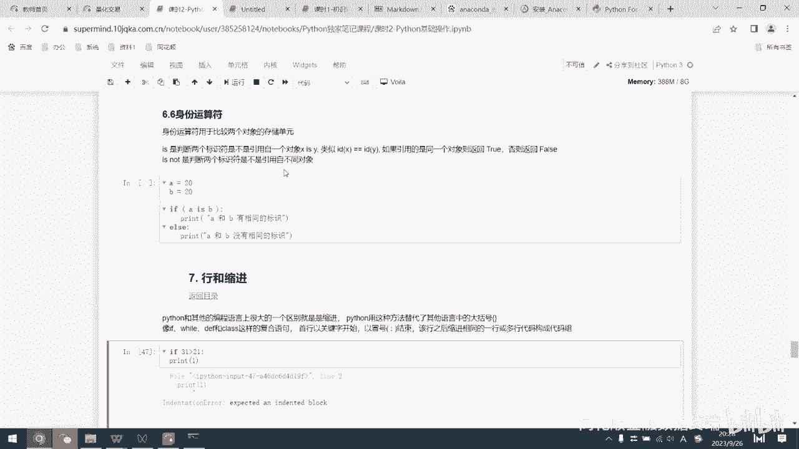