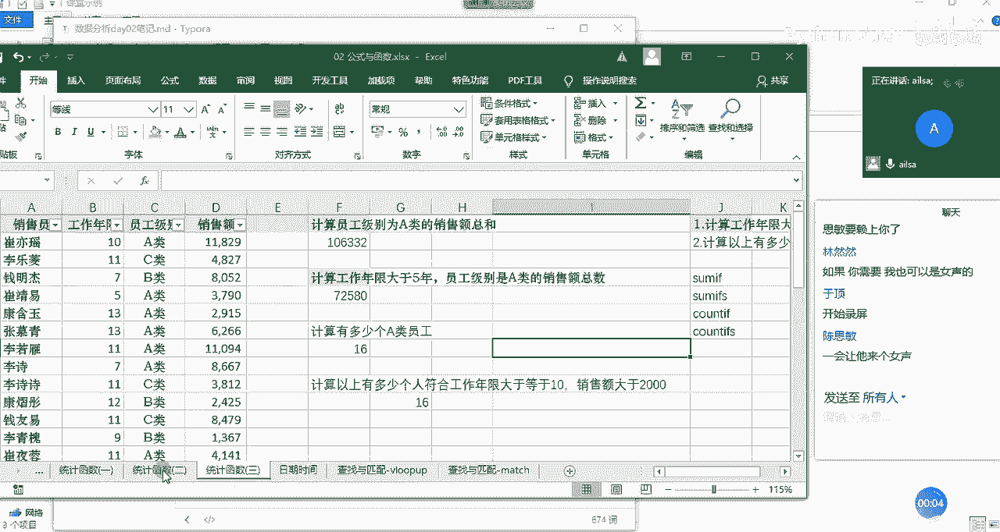
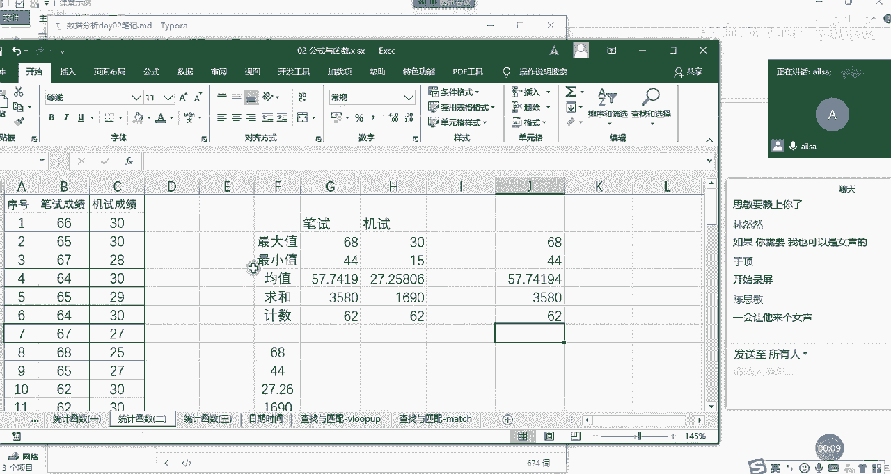
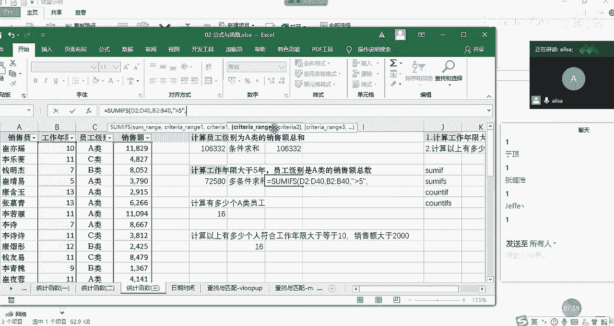

# 【python数据分析精华版来了（附文档代码）】10小时学会Python数据分析、挖掘、清洗、可视化从入门到项目实战（完整版）学会可做项目 - P11：06 统计函数2 - Python万能胶 - BV1YAUuYkEAH

好，我们开始讲解接下来的统计函数哈。哎，我们刚才讲了我们刚才讲了嗯最大值最小值均值求和计数，这些都比较简单的那接下来我们就讲有一定难度的哈，上一个阶段的啊这样的一个呃这样的一个呃函数。哎，我们看一下。

我们先看我们的一个需求哈，我们结合需求去想该用哪个函数去实现啊，首先第一个需求的话，就是计算员工级别为A类的销售额总和。哎，我们看一下它首先计算的是不是总和呀。哎，那我们学的总和就是我们的sam函数。

但是。

咱们在这个基础之上啊，他又给了我一个条件叫员工级别为A类的销售总和。那我们可以总结来说，他应该想让我啊使用的是一个条件啊，求和对吧？条件求和给定一定条件进行一个求和。

那我们也有对应的这样的一个函数等于什么呢？sum if我们学过sum了是求和。那我们也学过条件啊，就是我们的逻辑函数是if，那他俩是可以放在一起使用的。

就是我们的sum F函数对满足条件的单元格进行一个求和。我们看一下它的函数组成部分分三部分。哎，第一个就是我们的range。也就是说你现在给定了一个条件为A类。那我这个A类啊，它这个条件在哪个区域当中。

那我们看员工级别是A类，是不是在C类啊。那首先我们要选择的就是我们的C列的值哈，C列的值。然后选择完我的一个区域了之后，我们点击英文状态下的逗号。这个时候我们看第二个就是指的是条件，你的条件是什么呢？

我们看我们的条件是员工级别为A类，所以说我在这里面直接写A类就可以了。他就知道你想表达什么意思呢？A啊A类啊，这样去表达。然后我们看第三个组成部门叫sum杠range，就是我们的求和区域。

那既然给定了你的员工级别是A类的这样的一个条件之后，你想对哪一列进行一个求和呢？哎，那我们的求和区域。就是我们的销售额，对吧？我们选择我们的销售额作为我们的求和区域，然后我们按右括号进行一个ent特键。

哎，看到没有？我们这个时候就计算出了员工级别为A类的整个的一个销售额的总和。那在这里。

大家不要闲聊了哈，要听我讲啊。在这里的话，哎我们呃可以看到我在这里面只是举了一个简单的例子啊，那我们一般情况下输入函数都是为了批量实现的。所以说在这里的批量指的是这个A类，有可能会A类B类C类。

这样分别进行一个求和的时候，我们就可以用someF进行一个拖拉拽的形式进行进行一个实现，明白了吗？这就是someF函数。嗯。OK那我们来总结一下哈，someum of函数啊，还是我们的统计函数哈。

s of函数它的组成部分啊，它因为它是条件求和。所以第一个的话，就是我们的条件区域啊。第二个部分就是我们的条件。第三个组成部分，就是我们的求和区域啊，这嗯大家可以看到啊。

就是如果说你在日常的工作当中记得不是特别清楚的时候，其实excel都会给你做提示的啊，如果大家英文不是特别太差，都可以看出来到底是什么意思啊，我再强调一遍，这个是我们的条件区域，这是条件，就是求和区域。

好吧，大家现在手动操作一遍。然后啊没有问题扣一。

好，抓紧时间。我给大家半分啊，思命好快，我给大家半分钟的时间哈啊。😊，啊，其实边操作边练习的话啊，边听讲，这样的话相当于大家有参与感，然后呃就不会犯困啊，或怎样的是会效果会好一些。啊。

虽然我们讲课的进度啊稍微会慢一些，但是效果会很好啊。啊，主要是因为咱们人少哈，人多的话，我可能就不会啊等着大家去一个一个去敲了。嗯，我们的条件求和啊，私密完成了，其他同学呢是不是又在闲聊。

所以没有完成然然。啊，你叫他就好了哈。好嘞。😊，嗯。好的，现在是3个人。4个。好的。好的，那我们接着讲下面这样的一个案例哈，这样一个需求啊，我们是刚才是员工级别为A类的一个销售额的总和。

那下面是工作年限大于5年，员工级别是A类的销售额总和。我们会发现它的条件变多了，对不对？不仅仅是单列了，不仅仅是针对员工级别，还要针对工作年限，哎，这样的一个呃条件进行一个销售额的总和。哎。

我们就发现哎，你对一个条件，我会多个条件，我该怎么办呢？啊，其实也有它的一个计算方式哈。我们可以看一下多条件求和。啊，怎么来实现的啊？我们既然有someum if，这个时候大家可以想一下脑洞。

你比如说我们的number代表一个数字，那numbers是不是代表两个数字？那我们的s代表一个求一个条件进行一个求和。那多条件是不是加一个S就可以了呢？哎，我们看一下哈s if。啊。

它不给提示哈啊没有加等号，所以它不会提示啊，等号s if。哎，好像真的有sum X对一组给定的条件啊，指定的单元格进一个求和啊，其实它的一什么叫一组呢？就是说你有很多个啊条件进行一个指定的一个求和啊。

是这个意思哈，就是多条件求和。那我们看一下多条件求和的一个函数的组成部分。第一个叫sum刚润积，就是哎一上来就是我的求和区域是吧？哎，那我们的求和区域就是我们的销售额这一列。

我们选择它按多shift键啊，这样就可以了啊，这是我们的求和区域。那第二个部分是什么呢？第二个部分就我们的条件区域一，哎，我们就知道啊它后面可能会跟很多个啊条件区域啊，很多个条件哈，很多个条件。

这是条件区域一条件条件区域二条件这样的一个形式。那我们的条件区域一就是工作年限哈，这个啊啊我的鼠标啊被我咬了一口之后啊，只坚持了这么点时间哈啊废了啊。OK我们选择它啊，这是我们的条件区域一啊，往下拉哈。

条件区域一，然后我们的条件是什么呢？条件是大于等啊，条件是工作年限啊，大于等呃大于5年，没有等于哈。那这个时候我们该怎么去表达这个大于5年呢？啊，我们是这么来表达的哈，还是啊在双引号。

然后下面啊里面说入什么呢？大于5就可以了，它就能识别出来。这是我们的条件区域一条件。那我们再看后面是我们的条件区域二条件。那我们就要选择我们的员工级别哎，往下走往下走，然后到这里。

啊，我们再往上拉哈啊，这个时候我们的条件是A类。那我们跟刚才的是一样的对吧？没关系啊，没有鼠标的话，刚好我在操作上会慢一些。大家能看的更清楚一些。现在大家要跟着我啊去手动的操作。

然后我们看一下最终结果72580，这就是我们多条件求和的一个函数的啊讲解。那我们会发现一个什么问题呢？我们在单条件的时候，啊，我们的求和区域是放在最后一个位置的啊，我们前面是条件区域条件，对吧？

但对于多条件而言的时候，这个时候会怎样呢？就是说它也不知道说你后面到底有多少个条件，所以它直接把求和区域放在来了第一列，你后面想有多少个就添多少个，这样的话会看起来更清晰一些。

我就知道你到底想对谁进行一个求和。然后你的条件啊有巴拉巴拉这么多啊，这样的一个形式的呈现啊，下面我呃来给大家做一个啊some的一个啊总结。

someF啊它这个函数的组成部分的话，就是我们第一个是我们的求和区域啊，这个有略有不同哈。然后第二个就是我们的条件区域一啊条件。啊，还有就是条件。条条件区域2。条件啊等等等啊。等等等啊。

这样的一个组成啊，就是我们的s if多条件求和。我们对于单条件求和的话，直接叫条件求和就可以了。嗯条件求和啊就可以了。这是我们的s和some if。

接下来我们再看求和是怎么来实现的那计数呢啊啊我要问一下哈，some if大家都完成了吗？没有问题给我扣个一。

好的啊，建行没问题，四没问题。啊，我们现在听课的就6个人吗？67个哈。好的好的，然然也没有问题。行，那我们接下来讲countt函数哈。那我们之前说countt是计数，那既然有条件求和。

会不会也有条件技数呢？啊，当然是有了哈。你看我们要计算A类员工有多少个啊，这个其实countt会比s更简单一些。因为它只要对某一类进行一个计数就可以了，它不用指定专门的一个呃呃求和的区域。我们看它直接。

好，他直接就是呃value啊，我稍等啊。count if哈我们的count if我刚才写了一个count count。我们看到有哈哎我们看到有单填要求合啊，单条件技数，还有多条件技数是吧？

countif，所以他们是啊异曲同工的哈啊，我们看它组成部分，第一个就是range，也就是说你要对哪一列进行一个计数。比如说啊我要对呃因为在这一列当中，它有一个条件。那我们的所有的区域就先选择这一列啊。

所有的区域都先选择这一列，然后啊这是我们的条件区域，然后条件是什么呢？条件就是我们的A类啊是一样的。

在这写在这写比较方便些。A类啊，这个时候他会做接下来哪一步操作呢？就是说他直接把A类的员工筛选出来进行一个计数就可以了。因为计数并不要求他必须是数字呀，必须是什么什么，他只要能筛选出这么多条记录。

他直接算一下有多少个也就可以了。所以说他只有这两个组成部分，我们按ent键发现他确实A类员工有16个，这就是我们的countt if会比some if要简单一些。那对于多条件计数。

你比如说这个是工作年限大于等于10。然后销售额大于2000的啊，这样的一个计算方式的话，我们该怎么去完成呢？我们看一下我们需要使用的就是countt if也就是多条件进行一个计数。哎。

我们看一下它组成部分。首先第一个就是条件区域一条件。那其实我们会发现它跟sumif而言的话，它就少了一个求和区域啊啊，它是根据它的条件判断出来多少条数据进行一个计数就可以了。它第一个就是我们条件区域。

我们条件区域是工作年限，我们选择工作年限，然后往下来走往下来走，然后到达我们的最下面啊，这是我们的条件区域一啊，然后条件是什么呢？条件是大于等于10。那我们的条件可以这么去写，在文本的情况下啊。

写上大于等于10。

啊，那大于等于10，然后这是我们的条件区域一呃条件一，然后我们再看条件二，就是我们的销售额大约2000。那它的区域就是销售额这一部分往下拖动拖动到。没鼠标真的有点麻烦啊，然后我们的条件是什么呢？

大于啊大于等于啊2000啊，大于等于2000，也是这么来实现的。

嗯，大于等于2000。OK啊，大家跟着我操作哈，这时候我ent键哎就实现了我们的一个countt if的一个计算。嗯，那接下来我总结一下。

啊，总结一下countt if它是一个条件计数，它的组成部分是条件区域啊和条件这样的一个组成。这必须是英文状态下的逗号。哦。这是我们的条件技术。那第二个就是我们的countt if。啊。

就是我们的多条件基数，那它的组成部分就是条件区域一啊。条件。一，然后是。条件区域2。条件2啊等等等等等等啊。啊，这样的一个啊这样的一个文字表达，这叫多条件。技术。那到截止到目前为止，我们的统计啊。

统计函数就基本上就差不多了。也就是说跟那个我们统计学相关的，或者是啊这样的一些函数啊，掌握这么多，基本上就够用了啊。大家对于以上哈以上这些统计函数有什么问题没有啊，没有问题扣1。

好的嗯，那没有什么问题，我们就接一下我们。

