# 【python数据分析精华版来了（附文档代码）】10小时学会Python数据分析、挖掘、清洗、可视化从入门到项目实战（完整版）学会可做项目 - P16：11 数据透视表注意事项 - Python万能胶 - BV1YAUuYkEAH

嗯，好的，同学们，我们从啊现在开始进入我们的课堂啊，迷糊的同学就不要再迷糊了哈。你看我就立马就状态就来了哈啊呃，那我们看一下，我们今天上午都讲了哪些内容啊，我们看一下今天上午我们讲了公式与函数，对吧？

我们介绍了什么是引用例子的引用，这个非常非常重要，就是相对引用绝对引用以及混合引用的使用。因为它奠定了我们后面讲函数的一个基础。那我们都讲了哪些函数呢？我们讲了逻辑函数啊啊，有if啊 and or啊啊。

文本函数，也就是left right啊meed learn text replace。我们还讲了统计函数啊，巴拉巴拉这么多啊，都是比较常见的啊。

那重点记得就是我们some if啊 some if以及countt if和countt if相对来说有一呃有一点点难而已。然后下面就是查找与引用函数。那这个非常重要哈。

这个在我们的工作当中使用的频率非常高，大家必须掌握we look up和match函数，那它俩相比谁的重要性比较大呢，那当然是we look up它这个是我们的一个明星函数。

所以这个是必须要掌握的那we look up它有啊1234，它有四部分组成。第一个部分就是我们的查找对象。第二个部分就是我们的查找区域。第三个部分就是返回的值所在区域的第几列。第四个就是查找方式。

那这边有一个注意事项。也就是说我们的查找对象必须是在我们查找区域的第一列。就比如说你查找姓名的那你的区域当中姓名这一列，必须是在第一列，它才能够进行一个正确的查找啊，不信大家可以回去试一试啊。

你不把它作为第一列啊，试一下就明白了。嗯，下面就是match函数啊，这是也是一个啊查找函数，但它返回的不是你要查找的值，而是返回的就是你查找对象所在查找区域的位置而已嗯。接下来就是日期函数，日期函数。

我们主要啊使用的比较频繁的就是todayow，还有我们的date以及dday啊这几个的呃使用，大家掌握一下就可以了。嗯，那这就是我们今天上午讲的所有的内容，我们可以看一下。

对于函数的学习一定要说是嗯你掌握几个比较常用的。然后对于一些呃你从来没有见过的啊，那些函数的话，你只要去网上查一些资料就可以了。因为它有很多你没必要全部都掌握哈。就像我们的呃呃汉汉语词典似的啊。

就是你只有用到它的时候，你去查一下就可以了。但是呢你又要掌握一些最基本的，不然你不可能说用到一个查一个啊，是吧？

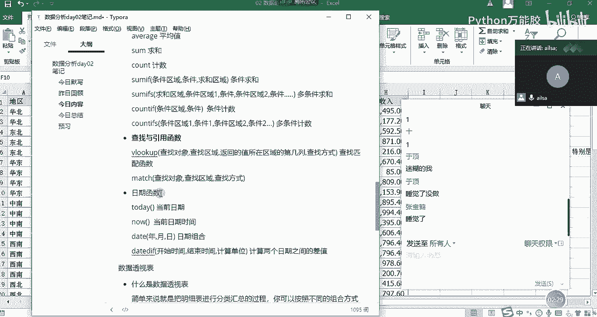

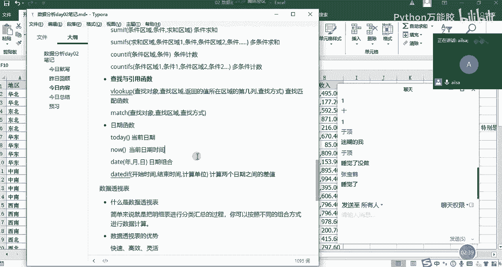

好，那我们呃函数啊公式与函数之分这部分呢，我们花了一上午的时间给大给大家去讲，然后相信大家也都学明白了哈。那我们呃在上午的最末尾呢，我们讲了一下什么是数据透视表啊，数据透视表，我们再来看一下。

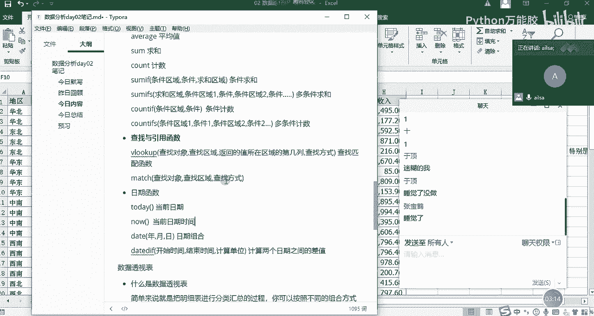

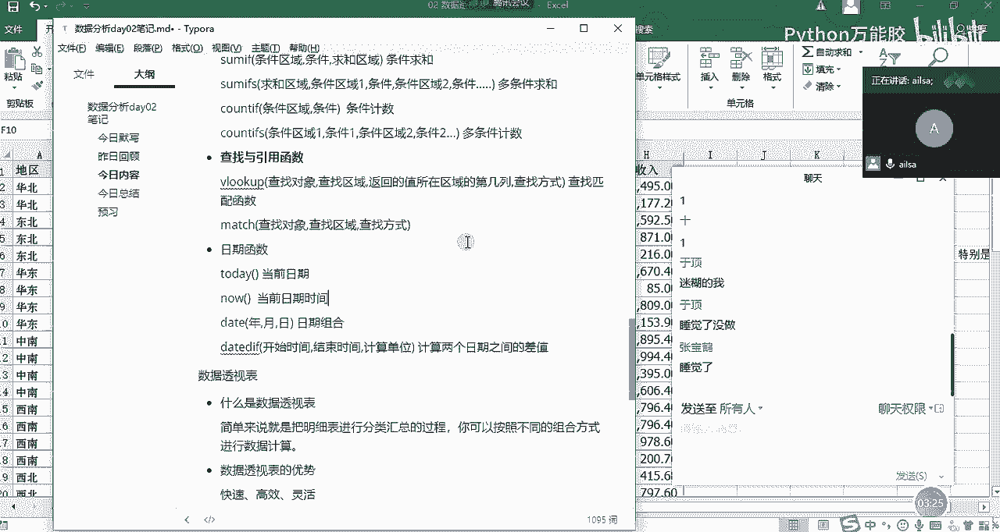

嗯，数据透视表的话，它其实啊我们通过我们在课上的时候，通过一个案例啊，就是说领导给你派了一个任务，让你啊对某一个数据进行一个快速的分类汇总的时候，我们尝试了筛选功能。啊。

就是一条一条去筛选这样的一个计算。还尝试了函数这种方法。嗯，那我们会发现它虽然都可以实现，但是却没有那么智能。而最后我们采取的啊数据透视表这样的一个方法的话啊是最高效的啊，所以说我们的数据透视表。

它的作用就是啊把明细表进行一个分类汇总的过程啊，你可以按照不同的组合方式进行一个计算啊，这就是我们的数据透视表。那我们从啊上面的实例当中，我们也可以看出我们的数据透视表的优势。它就是什么快速高效灵活。

对吧？

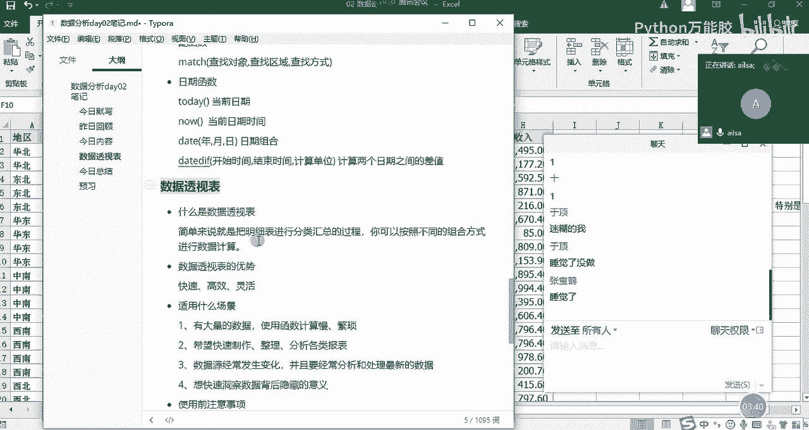

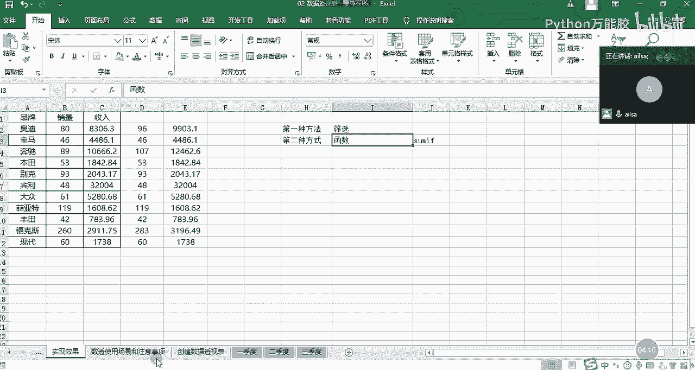

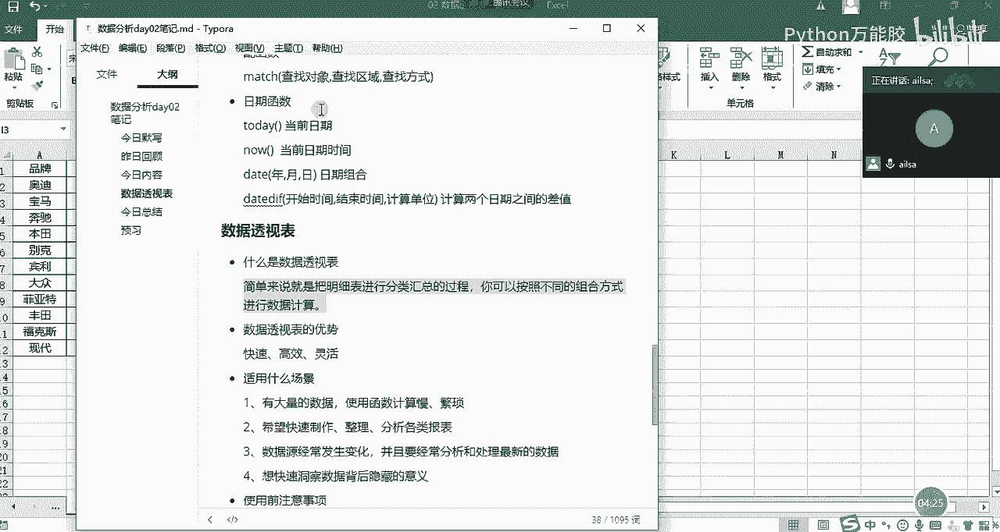

那它适用于哪些场景呢？啊，首先是数据量大啊。第二个就是你要快速的对它进行一个呃分类汇总计算。这样还有就是你的数据源如果经常变化的话，你也可以使用数据透视表，我们在下午的时候会讲哈。

然后最后一个就是说哎你想快速的进行一个分析，去发现数据背后存在的一些意义的时候，也可以使用数据透视表啊，就是我们在什么场景下使用。那呃说了这么多呢啊。

我们在最后的上午的尾声讲了一下使用数据透视表的注意事项啊，可能呃很多人呃呃讲的不是特别清楚哈。那接下来我们就一个一个来试一下。如果说我们呃我们这么做了之后，我们的数据透视表会出现什么样的问题？OK。

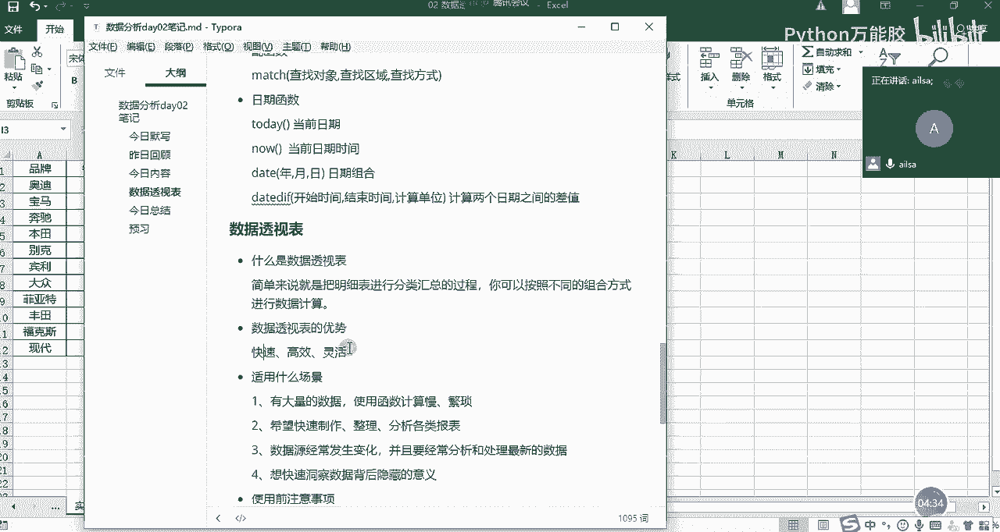

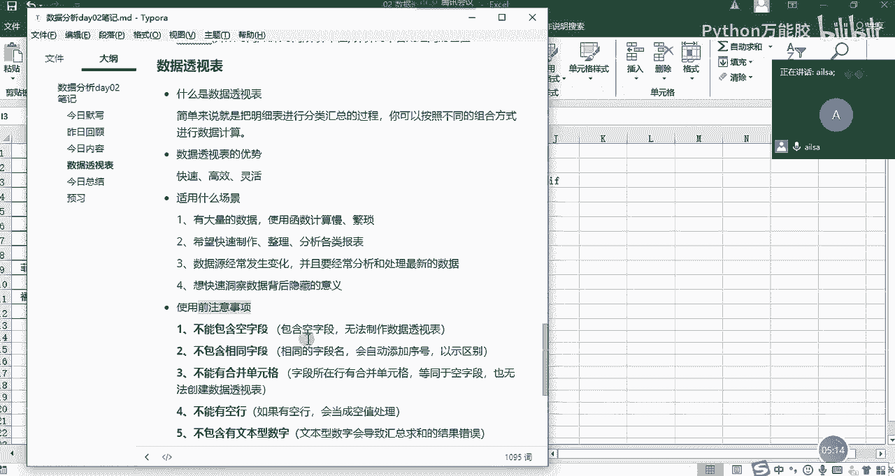

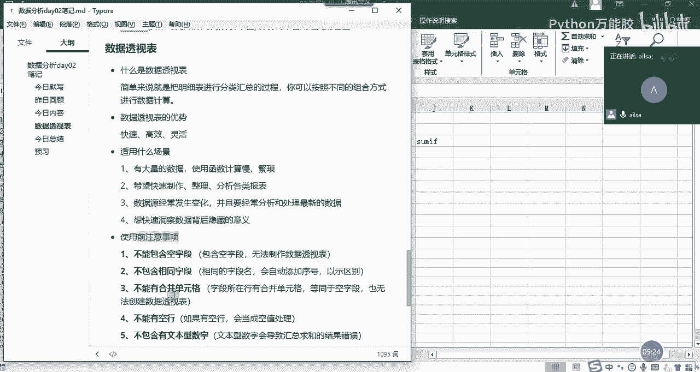

我们来演示哈，比如说现在有这样的一个数据透视表啊，跟刚才的表是一样的那我既然说了啊，这5个注意事项你不能犯。那我们看我们如果触方了这5个注意事项，会有什么样的一个效果。你比如说哎现在这个车型哈。

你看这个车型啊，其实这个应该是叫啊应该是叫类型啊。我们假设哈这个叫类型，然后这个叫车型啊啊品牌，这个叫品牌哈什么这个叫品牌。哎，这个叫车型。那我对它进行数据透视表。我们再来回顾一下，我们是怎么来操作的。

首先我们要把我们的呃鼠标，也就我们的数据区域定位到我们的啊整个的一个要做数据透视表的当中，不要在这儿哈，不要定位到这里定位到这里，然后点击插入选项卡。然后插入选项卡下面的第一个数据透视表。哎。

它出现了一个数据创建数据透视表的这样的一个对话框。那这里呢就是我们所选择的啊，我们要创建数据透视表的一个区域啊，它默认啊，已经是我们所想要的这样的一个区域了。

那第二个呢就是说我们要把数据透视表放在哪个位置。上午的时候，我已经演示了放在现有工作表的位置。那今天呢我就给大家给大家演示一下，放到一个新的工作表的位置的一个体现。比如说现在我点击确定。

你看他是不是建了一个新的s啊，对，然后出现了我这么想要的一个效果，这还是一个数据透视表的一个字段。那我们看一下，我们如果说对品牌进行一个销量的计算的话，我们就可以把品牌拖到行或者是拖到列。

我们看一下有什么变化，我们拖到行，哎它会在行方向上去显示啊，大家看一下是不重复的哈。所以说它是不重复的直接标签。然后我针对啊我这个品牌，然后进行一个销量的计算。这个时候我的计算啊的方式呢。

我们选择的是求和点击确定，OK它就出来了。那我对于收入而言也可以这样子，对不对？嗯，那这就是我们刚才呃回顾的如何创建一个呃数据透视表的一个最基本的操作。哎，那现在呢我把这个全部都取消掉啊，怎么回事呢？

我把这个品牌啊也取消掉，我把品牌拖到列方向看一看，哎，它是不是在列方向去显示了。然后我再把销量拖到我们的值，那我们看一下它是不是相当于是在列方向上去显示每一款车型的它的销量的总和呀。

但是我们会发现这种的一个展示形式跟我们日常的一个行为习惯并不是特别一致。所以说我们一般情况下是拖到行就可以了。这样的话啊好像更适合我们去看哎，整个的一个表的呈现。嗯，啊。

那接下来我再跟大家演示第一个啊第一类错误啊，就是列标题啊不能为空。假设哈假设这个品牌或这个车型啊，这个车型为空啊，这个字段为空，我把它删掉了。这个时候我们再重新去做我们的数据透视表，我先删掉哈。

我们再重新去做。然后鼠标定位到我们的数据区域点击插入点击数据透视表，点击啊，直接点击确定。然后这个时候我们会发现一个什么样的问题呢？哎，华北这是什么东西啊？哎，你是不是看着有点别扭啊。哎，华北北京啊。

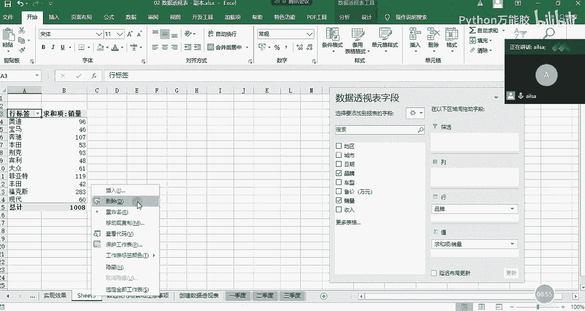

这这这这啊，这是不是没有标题了啊，是不是你看我们可以看一下华为北京什么2013啊，2013奥迪，它是不是因为它为空值，所以说它把啊2495。00249，它是不是把这一行作为我的标题了。那这呃就很尴尬了。

所实你就看不懂它到底想要的一个什么的效果了，所以说我们的标题不能为空。如果为空的话，它就啊往下又自动选了一行作为它的标题，这的话完全不是我们所想要的效果。所以说我们要把它改回来，我们要把它改成车型啊。

啊，然后我们再重新的啊重新的生成一下我们的数据透视表，点击插入数据透视表，然后新工作表确定这个时候哎我的字段又回来了，就这就是我们不能犯的第一类错误，列标题不能为空O。

嗯。

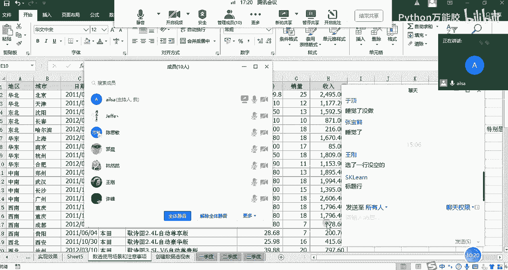

对啊，对，然后大家对于我刚才讲的这个事例有什么问题没有？

没有问题扣1。就是我们的列标题不能为空啊。6个人回复了啊，其他人呢？家人还没睡醒吗？我们至少还有2到3日OK啊OK。好嘞啊好嘞，大家都没有问题。那我接着讲第二类错误叫列标题不能重复。那还是这里哈。

比如说我这里面把品牌啊，这里也叫品牌，这里也叫品牌。我们看一下它会发生什么奇特的效果。哎，那我们还把它删掉哈。还把它删掉，然后重新再创建一个数据透视表。哎，这就这就不给大家啊再重复的去演示了。

确定我们会发现啊我们看字段哈，我们会发现它字段里面出现了一个品牌啊，品牌2，如果说大家对于这个表里面的结构哈，或者是列明特别特别多的时候，其实我们分不太清楚品牌到底和品牌二之间有什么关系。

他们俩之间到底谁是品牌，对不对？那你这么来看的话，其实就会影响到你对数据做的一个判断啊，呃，因为他俩都叫品牌，到底我用哪个品牌，是不是呃，如果是你自己做的表。哎，你知道这个品牌就叫车型。

然后你大概也就清楚了。但是你把这个数据发给别人之后，别人在做二次处理的时候，它就很头疼了。你这个为什么两个都叫品牌，是他俩都是品牌，还是说呃一个不是品牌，一个是品牌这样的一个效果。所以说我们。

尽量保证我们的标题不要重复，不要带来歧义啊，是这个意思啊，所以说我们这边还要改回车型，然后我们再看一下，我们改完了之后。它的一个字段的啊效果，我们点击啊确定。然后我们看一下品牌车型。

其实是因为我们要对整个的一个列标题进行一个分组啊这样的一些操作。所以说我们尽量保证我们的标题要唯一要完整啊，是这个意思。好，那大家对于这个问题听明白了没有？听明白给我扣个一。

好嗯，好的，没有问题哈没有问题啊。因为上午的时候呃，在最后的时候不是有同学说想把这个呃情况再给大家演示一下啊，这边应该都听明白了。然后我们再看啊第三个不能有空行，然后不能有合并单元格，保持数据类型一致。

这个不能有空行，我就我就不演示了哈，什么意思呢？就是说我们呃为了呃防止数据透视表出现一些这样或那样的问题，我们尽量啊不要有比如说啊那我演示一下吧，还是比如说哎这个宝马啊，它空了一个单元格。

我们不知道这个品牌是什么。这个时候我再对它进行一个数据透视表的创建的时候，大家看一下会出现什么样的问题。这个时候我把品牌，哎，你看我们的字段没有什么问题了哈，因为现在不是自动的问题，而是内容的问题。

我把品牌拖到行，然后把我们的销量拖到我们的计算求和像。这个时候我们会发现有一个空白时期，对不对？那对于这个呃品牌是空白的这一个东西我该怎么去判断呢？我就不知道了。

是不是那这个时候我还要回过头来把这个时期，这个我查出来品牌会空值的，我还要去判断它到底是哪一款车型，然后给它填写完整，哎，那就这个意思，所以说它不能有空的啊，这是我们的类别当中不能有空的。

如果是我们的数值当中的话啊，尽量也不要有空的啊，啊，应该呃影响不是特别大。但是为了保证我们万一它有影响的，所以说我们尽量保证我们的数据啊，是没有空的。然后如果数值就填为零。如果是这种文本型的。

我们尽量保证。他呃是准确的啊，完整的这样子。啊，这是我们的空行，我再给大家演示一下合并单元格。合并单元格是什么意思呢？啊，我们还拿啊我们还拿这个品牌为例哈，你看这里不是这么多奥迪嘛？我把它合并一下。

我们看一下会出现什么样的问题，这边是合并单元格，对不对？奥迪，然后我们给它做数据投视表。插入，然后数据透视表点击确定okK我们把品牌拖到行，把销量拖到啊我们的计算项当中。我们会发现我们的。啊。

我们的奥迪啊，他的我看其他地方还有没有奥迪。啊，没有了，我们的奥迪大概的一个销量的计算的话是113对吧？113，然后它这边显示的奥迪是25，你们想一下为什么啊，为什么它的空白是88。

而它这里面的奥迪却是25呢？现在给大家抛出这个问题，我们想一下。对，25加88等于113啊，你的数学功底还可以哈。看来后面讲统计学的时候，我得出点口算题了。嗯，对啊，非常好。

雨定说出了我们整个的一个问题的核心是什么意思呢？就是说我合并了单元格之后，我们把鼠标钉到这个单元格，我们发现一个问题，在这个名称框里面，它显示的是第二。

第二其实就是这个第就是这个合并单元格的一个最左上角这个位置。那它默认的意思就是说它只会代表左上角这一行的数据。所以说是25。那接下来这部分数据的话，它都会默默认为空。所以你在进行。数据透视的时候。

它会显示空白。那其实对于你来说，你在进行处理的时候就特别不方便。如果有很多杂七杂八的一些合并单元格的话，你处理起来是非常非常费劲的。所以你要给它取消掉啊啊，大家知道我们在嗯就是合并单元格批量取消。

有什么快捷方式吗？啊，我给大家演示一下哈，因为这里只有一个啊，所以说呃我可以简单演示一下啊，首先我们先取消掉，然后。啊，我好像忘了哈，conl加G。啊，定位到什么呢？空指。啊。

然后直接等于上一个单元格ctrol加enter啊就实现了啊。我再给大家演示一下哈。如果说你的呃某一列当中有很多个嗯有很多个空白单元格啊，有很多个合并单元格，你想给它批量的去除的时候啊。

你没有必要一个个去粘贴哈，我们在撤销回来，你很多人的操作是这样的。比如说这个宝马啊。好吧。我拿三个进行一个演示哈。比如说现在有这么多合并单元格，你想对它进行一个批量处理的时候，很多人就是先取消掉。

然后再复粘贴，对吧？取消掉啊，ctrl加D对ctrol加D啊，往下来走，这样啊，这样也可以挺快的啊，但是如果是批量的话就比较费劲了。那我们这边有一个方法，就是先选中它，然后取消啊合并后居中这样的。

然后我们点击定位定位条件选择空制，然后确定，然后等于上一个啊，等于上一个单元格，然后点击clent啊就可以实现了。啊，这是一个这是一个插入的哈。😊，啊，大家这个快捷方式听明白了吗？听明白给我扣个一。

我就是刚才想起来啊，给大家啊演示一下哈。😊，OK哈啊这就是我们批量啊啊批量去合取消合并我们的单元格的操作方式啊啊，那大家刚才也明白了，哎，就是如果有合并单元格的话。

其实对于我们的数据分析或者数据处理还是很不好的。那我给大家说一下，在我们整个的一个工作当中，我们在进行数据呃展示的时候，你可以有合并单元格，这样看起来更加美观。但是我们在进行数据处理的过程中。

比如说那些详细的数据哈，一般情况下都很少有合并单元格，明白了吗？只有在数据展示，你比如说你给别人展示某个事业部下面有多少个部门，这个时候事业部啊，这个肯定是合并单元格，然后对应的一个部门。

它的每一个汇总好的数据啊，这种是允许有合并单元格的。但是对于明细数据而言，我们很少啊很少有合并单元格。因为这样的话不利于我们后期的进行的数据处理。OK那我们再说最后一个问题。

就是第五个啊保持数据类型一致啊。你比如说现在还是奥迪哈，奥迪这里的销量啊，我给它设置成文本格式，我们可以看一下。现在它是文本格式哈。文本格式。然后嗯那我们再进行一个呃数据的重新的呃生成。

我们生成一下我们的数据透视表确定OK然后我们再把品牌拖到我们的行，然后把收呃销量拖到我们的值里面。啊，这里面是计数了，大家看到没有？它为什么变成计数呢？其实就是因为里面有个文本，它识别不了。

他以为你要计数。这个时候我们给他强行改成求和确定哎，我们会发现奥迪的数销量不是变小了吗？25没有了。那说明这个文本，我们看这里是不是文本，这个文本其实是不参与计算的那其实对于你来说。

你是想让它参与计算的。但是它无形之中设置了文本格式，那就不参与计算，所以说我们的数据得出来就是不对的，而且这种的话，如果你做数据透视表，你不是特别熟的话，你也发现发现不了什么问题。

因为也不是你一个个数的，对吧？也不是你一个个加和的，是系统自动生成的啊，所以说我们要把它改成啊，我们要把它改成数字啊，怎么去改呢？

啊，比如说对于这一个单元格而言，我们可以直接转为数字就可以了啊。如果说是多个哈给大家给大家演示一下哈，这也是一个小技巧哈。比如说这个也是啊，我一般情况下只有前面有绿绿尖角的这种。

我才会认为是一个文本哈啊OK这有三个文本，难道啊我们我们可以选中这三个直接啊转为数字，这样也可以哈。还有一种方式，就是我们选择这一列，然后进行什么呢？分列啊，分列是一个很好的操作方式啊。

我看能不能实现哈。啊，完成啊，这个时候你看就已经实现了。跟大家说，有一些格式的转换，特别是文本日期和数字之间啊进行一个转换的时候，我们都可以采用分列，进行一个呃单列的批量转换啊的实现方式。好吧。

呃那呃同志们呃那对于整个的一个我刚才讲的内容，大家有什么方法啊？大家有什么呃问题没有？如果没有什么问题扣1哈。对，分裂方法很好。

啊，好的。😔，好的，都没有什么问题。那我们接下来就讲解我们数据透视表的一些常用功能了啊，这些只是最基本的啊。网不好是吗？是我说话断断续续啊，还是你那边呃怎么回事？嗯，OK那我稍微讲慢一些哈，讲慢一些嗯。

OK那我们。