# 【python数据分析精华版来了（附文档代码）】10小时学会Python数据分析、挖掘、清洗、可视化从入门到项目实战（完整版）学会可做项目 - P17：12 数据透视表常用功能 - Python万能胶 - BV1YAUuYkEAH

那接下来我们就讲解数据透视表的呃一些呃呃常用的功能啊，我这边给大家记录了几种情况，然后我们可以根据这几种情况进行每一个问题的解决。然后它对应的也就是我们数据透视表的相应的功能的操作哈。呃。

下面那我们接下来演示的时候，还是以一张单独的数据透视表进行一个演示。这样的话我们会更加清晰一些。OK我们先看第一个问题啊，数据记错了，需要更改，该怎么更新数据透视表。OK我们想一下，比如说现在给了你啊。

这还有筛选，我把筛选取消一下啊。啊，瞧我这还账。OK那现在这样的一个表格，我们首先给它建立一个数据透视表，对吧？我们在新的工作表当中给它建立一个，这是一个新的啊系列11就是一个新的啊工作表。

然后我们模拟一下刚才的场景，比如说别人告诉你这个数据存在问题。什么问题呢？就是这个销量啊啊，奥迪的销量不是25，而是30，就少了5个，对不对？那我们刚才知道奥迪的销量大概是113，对不对？

那啊不我我得我得先创建完之后再改哈，ok25哈，我们先啊给大家看一下我们的整个的一个品牌，它的销量的啊计算OK奥迪是。啊，怎么变成96了？OK没有关系哈，96就96哈。

okK奥迪现在的一个销量总和是96啊，那接下来啊我把这个数据改成30，他记错了，改成30。那你看我这里面肯定是不变的，对不对？因为我已经创建好数据透视表了，那我该怎么去操作啊？啊，我刚才的操作是什么呀？

把它删掉，再重新建一个数据透视表，是不是？那这样是不是好笨呐？是不是我这个每一次如果说我这个数据透殊表特别复杂的话，我每次建完了之后，数据更改了，我要重新再拉一遍，岂不是很麻烦吗？嗯。

那我们也有自己的操作方式哈，我们不用删除，怎么来操作呢？大家往上看，哎，只有一个数据透视表工具。啊，那你看我把鼠标定位到这里，它就没有了，对不对？这个功能区域好厉害呀，怎么怎么一会儿有一会儿没有啊。

这就是一个什么样的功能区呢？这个叫呃这个呃这这是叫一个上下文选项卡，哎，你看上文下文叫上下文选项卡。那这个上下文选项卡呢，它是针对某一些特定的功能而出现的。也就是说如果说你的鼠标没有定位到这里。

没有数据透视表这样的一个功能，它就不显示，你定位到这里，它才会有这个功能。那我们看一下呃，它是否有更新的功能，它现在还是96，是不是我们点分析，然后我们看有一个刷新，我们点击它，然后点击全部刷新哎。

你看96加5是不是101，我们的数据就发生了变化。也就是说，如果说你的数据，你的整个的一个原数据里面的某些数据发生变化了，你只要在啊上下文选项卡当中的。分析标签下面的刷新啊，点全部刷新就可以了啊。

大家不用区别它俩之间关系啊，点全部刷新就可以了。然后它就会实现我们所有内内容的再次更新啊，大家对于这个问题啊，我刚才讲的这个有什么问题没有？OK没有什么问题给我扣1。这是我们的数据刷新功能。嗯。好的嗯。

好的，没有什么问题。那我们再讲第二个现象啊，第二个现象是什么呢？就是我们刚才的是数据记错了。那现在呢就是数据源的内容啊，新增啊新增了新增一行或者一列，那数据透视表。

它会不会啊需要我们再进行一个刷新呢或怎样呢等等一系列的操作啊，那比如说啊我们新增呢分两种情况。第一种情况是在我们的数据区域的内部进行一个更新哈，大家看清楚了，现在呢我给奔驰啊，奔驰加载内容。

现在我选中它，然后我们看一下奔驰这边的啊啊销量是107，然后我给它加一列啊，加一行，然后我们的销量看到没有？是7，对不对？

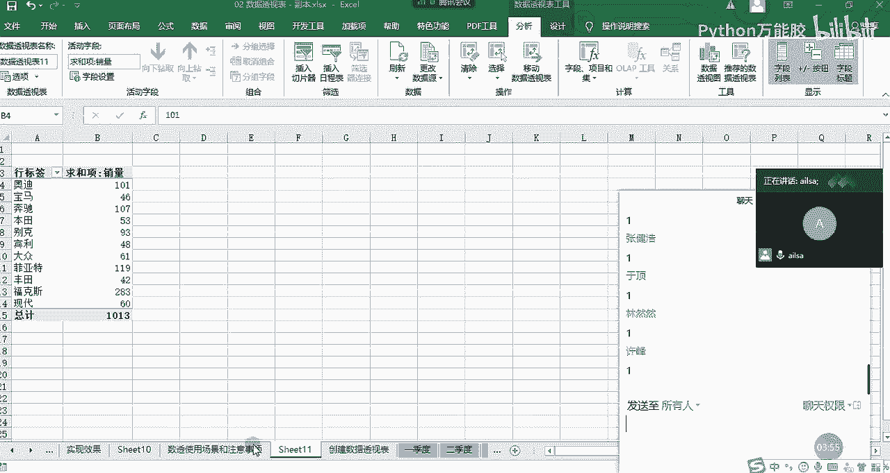

OK那相当于说那奔驰这边的数据应该再加上7才可以。那我们再看一下，回过头来我们看一下啊，奔驰的数量发生了变化吗？刚才是多少？啊，发生变化没有。我刚才忘记了。啊，奔驰的数量有发生变化吗？需要再更新一下。

对不对？我们再更新一下试试看哈。这个时候我们点击分析，然后点击刷新。OK啊，需要更新一下。我们会发现如果说我在数据的内部增加了一行，那我只要在这里边刷点击刷新，它就会把这个数据更新出来，对不对？

那接下来我再说一种情况，什么呢？就是既然在内部可以。那我在底部可不可以呢？也就是我们的数据区域的边界，哎，我们看一下我对福克斯这辆就是这种车型哈，然后进行一个添加，我们看到销量是增加了23。

然后我们在这里看一下福克斯是283，我们看数据有没有发生变化，点击刷新全部刷新。哎，怎么还是283OK大家告诉我这是什么原因。嗯，现在大家可以畅所欲言。

为什么我的一个宝马的数量啊啊不是啊奔驰的数量能刷新发生变化，而嗯福克斯却不行，是因为车的问题吗？啊，是因为人车好吗？还是怎样？嗯，大家有什么想法没有？OKA对，很很好啊。是因为什么呢？

你看我们在进行啊数据透视表的时候，我们有我们的一个数据源，对不对？我们看一下我们的数据源，它选择的是A一到H68A1到H68到哪到这里也就是说我们在最开始创建了创建的时候，我们已经指定好了这个区域。

那我在它的区域内部进行一个添加的时候是完全没有问题的。因为它都属于这个范围之内。但是如果我在它的外部添加了一行之后，那不好意思，我就选择不到了。所以说面对这种在底部或者是边上进行一个添加的时候。

你需要做的操作是啊是什么呢？啊，选择分析，然后选择更改数据源。你要把它数据源进行一个重新的划分划分到69。

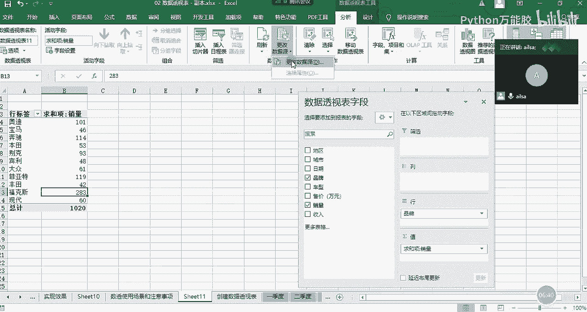

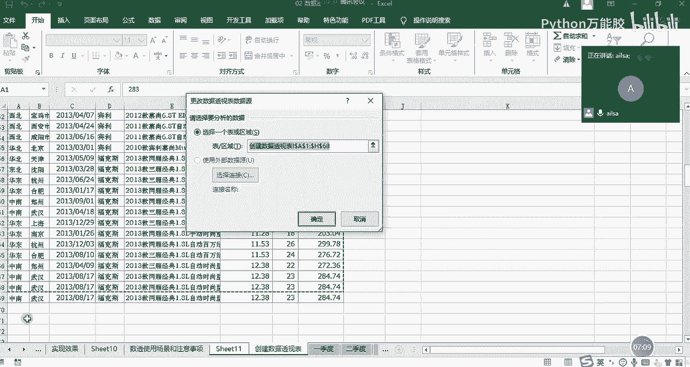

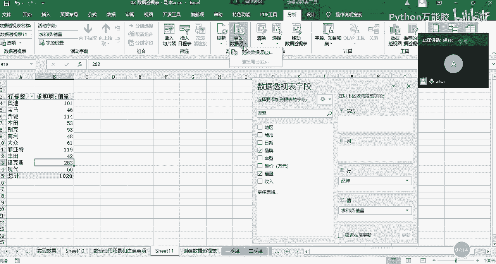

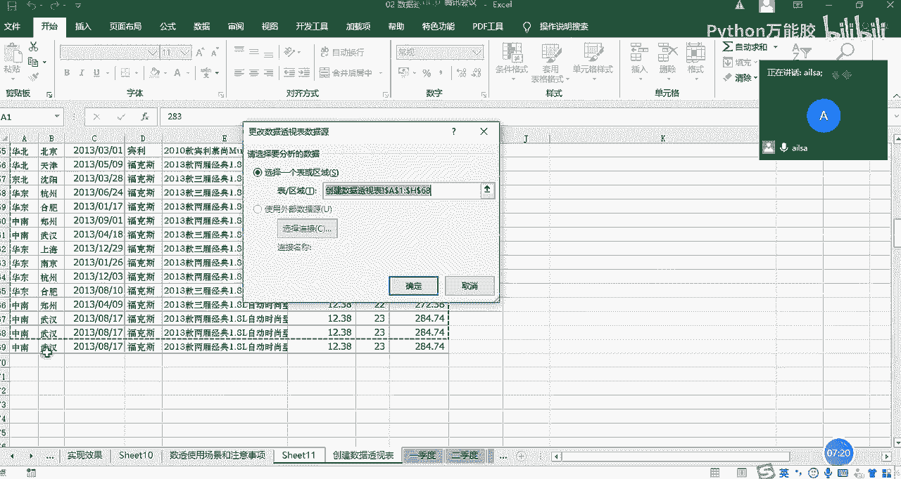

然后点击确定我们再回过头来啊，看一下福克斯的数据是不是已经发生变化了啊，这就是我们对于前两种情况的一个区分。一个是啊一个是更新数据啊，一个是更改数据源这样的两种操作啊。

大家不要小看这个呃大家不要小看这个这个现象哈。我现在给你们把这个问题抛出来了，你们才会发现。但是如果说你初初学这个数据透视表的时候，你可能添加了一行，你真的不知道它为什么数据还是不对啊。

有有可能你核对了半天，因为你对它的一个底呃，就是它的一个呃借借就是它的一个整个的一个原理不是特别清晰的时候啊，就有可能会犯这样的一个错误啊。啊，我见过很多同学然后他们第二个问题。

然后实现不了数据一直错的话，他们采取采取的方案很简单啊，删掉重新做就是了。好的对啊，这样的话数据就对了啊，他们有时候还挺可爱的，然后还找到我说，哎，为什么我第一次做的时候就是好的呃，就是不好的，我删掉。

它还又重新做就好了呢啊，是因为他不能更新的能力吗？啊，其实嗯简单暴力式的啊啊，就是因为你可能对某些小点不了解而已啊啊，人家数据透视表没有那么傻啊，人家也很智能的。好吧，那我们前两个问题就讲完了。

我们讲第三个问题。第三个问题是想要对机箱的结果，按照一定的顺序排序怎么办？哎，我们看一下这个是什么样的一个场景哈，你比如说现在我统计出来了这些呃不同品牌的车呃车的一个销量。

现在我就想看一下哪款车的销量最高，对不对？那我想给大家进行一个排序，怎么排呢？哎，我们想我们最呃最原始的方法，就是用我们功能区的排序方式嘛，对不对？那我们功能区的排序方式，我们先选中它。

然后在我们的排序和筛选当中点降序，对不对？点击哎它提示我。

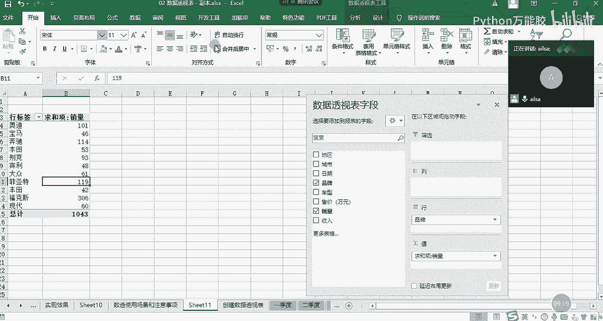

你不能这么干，对吧？我是数据透视表，我不是你普通的一个一些报表啥的啊，你不能这么干啊，好吧，啊，那不能这么干，我怎么办呢？我们哎这有个下拉小三角，我们去看一下。我们点选它哎，发现这不是能升序和降序吗？

我们选择降序。Yeah。这数据好像没发生变化。哎，但是我们看一下这个行标签，现在是X，对吧？奥迪是A，它好像是把这个行标签进行一个排序了。但是我想要的是销量进行一个排序，对不对？啊。

这个升序和降序不好用。哎，我们看到还有一个其他排序选项，我们点进来我们在这里可以看到哦，原来可以在这里哈，比如说我们可以选择升序和降序。然后这有两个选项，就是我们的列标签，大家看到没有是我们的列标签。

一个是品牌，一个是我们的呃求和向销量。那我们是按求和向销量来进行排序的，点击确定O那我们整个的一个销量排序求出来了啊，这个功能也有很多人不知道哈。他每次啊那我跟大家说，如果说别人不知道这个功能该怎么。

别人该怎么做哈，很简单。我不能在数据透视表里面去排序，简单的，我把它复制出来，单独到一个表里。我在excel里面排序不行吗？啊，当然也可以哈，但是如果你想你想在对这个数据透视表再进行其他的操作的时候。

你做出来之后还要再重新进行一个排序，就比较麻烦一些哈啊OK大家对于这个排序啊，了解了吗？啊，如果没有问题给我扣一。哎，艾思米有什么问题吗？好的啊，没有问题的话，我们接着看第三个现象。好。

第三呃第四个现象就是想要在数据透视啊的基础之上增加计算力啊，以及啊想要在数据透视的基础之上增加计算行。我们看一下这两种情况是什么样的一个需求哈。首先呢啊我们这边嗯。好。

我们这边再拉一个收入哈再拉一个收入，这边是收入和销量。现在呢我想我想计算一下，就是它的整个的一个单价啊，到底是多少哈，就是收入除以销量这样的一个计算方式哈，叫均价啊，我们可以理解为是均价。啊啊。

我在这里面只是模拟一个场景哈，我想就是我想在数据透视表的基础之上增加一个计算项啊啊，这个时候我该怎么去操作？有的人说那不简单吗？直接等于收入啊。除以啊销量不就可以了吗？这还用交吗？是不是哎，没有毛病哈。

我往下拉看一下。不行啊，这个这个实现不了，因为它本身我们可以看到这个公式就这么长，所以说它不能这么干。呃，数据透视它本身提供了啊这样的一个功能是在我们的呃上下文学员卡当中啊，我们给大家去看哈。

首先先记住第一个问题。我们想对某一列啊某两列或者多列进行增加一列的计算的时候，我们的鼠标应该定位到我们的列方向上哈，提到这里定到这里都可以哈，这里也可以。然后在我们的分析里面有一个字段项目和集。

我们点击它有一个计算字段，然后在这里呢在这个计算字段的对话框当中啊，我跟大家演示一下该怎么去实现。很简单，首先名称的话，我们就输入是均价，这个自定义哈，均价。然后公式呢公式大家看到没有？它有个限制条件。

它必须是字段之间的一个关系，看到没有？所以说我们的应该是。收入啊除以销量对吧？这就是我们的公式，然后我们点击确定啊。OK是，然后进行一个替换，这样它就出来所想要的效果了。这就是我们的一个均价的计算啊。

啊你看它是不是在列方向上增加了一列，这就是叫计算项啊，我为什么要强调在列方向上叫计算项呢？因为在行方向上它就不叫计算项了。我们看一下在行方向上出现什么样的一个呃新的呃新的名词。嗯。

那呃我们在定位上我们看我们把鼠标定位到列方向的时候，它这里面是计算字段，哎，就没有了。我们唉看到一个计算项是灰的，对不对？那计算项其实就是对于行方向而言，那我需要把鼠标定位到我的行方向当中啊。

定到行方向当中，然后再选择它看到没有？计算项就可以使用了。我们点击它之后。那它既然是在行方向上的，所以它只能针对行之间的一个关系进行一个计算。我们这边可以计算一个差值啊，差值计算什么呢？

计算啊宝田啊宝马和丰田和宝田宝马和丰田之间的一个销量的差异。哎，我们可以试一下哈，它们之间的一个啊各个数据的一个差异吧。我们可以试一下，首先它的公式就是我们选择宝马啊。

宝马OK选择它这就是我们的一个内容减去我们的丰田啊，点击这个然后点击确定就可以了。你看新增了一个差值，然后它的差它的销量的差值，它的收入的差值，以它的均价的差值就可以实现了。

这就是我们的计算项和啊这就是我们的计算字段和计算项啊，大家对于这个听明白了没有？

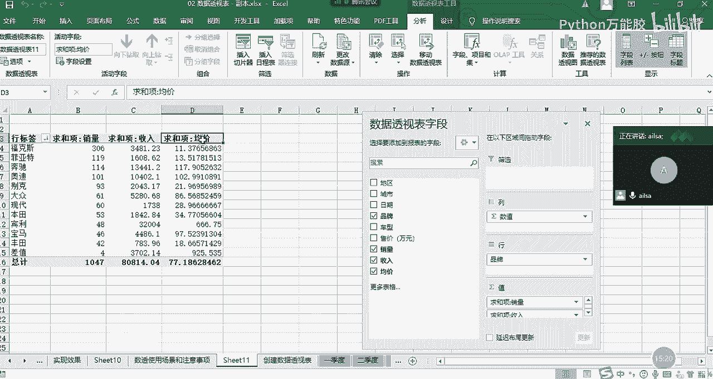

嗯。啊，这个功能不常用哈你只要知道就可以了啊。如果说呃就是我跟大家说一下，如果说我们在呃以后的工作当中，他问到了excel啊，excel的一些呃高级底的技巧的时候。

你就跟他说excel呃excel数据透视表。哎，我这边经常用啊，他不仅仅可以进行一些分类汇总，他还可以啊新增一些计算字段和计算项啊，如果别人知道的话啊，如果别人不知道他就不会往下问了。

如果别人知道他可能还会问一下，那你给我说一下这个计算字段是怎么来完成的，你就可以跟他家说一下这样的一个效果。如果他不知道他绝对不会问的哈。因为呃呃因为他不知道呃到底是怎么来实现的，他也不敢问。

这个很正常。OK这个问题讲完了之后，我们接着往下看下一个问题啊，就是呃第六个了。如何动态筛选数据透视表的内容哈。这个啊我们用的是切片器啊，切片器啊听起来特别特别高大上哈，特别是我们在面试的时候。

跟别人说啊，我会切片器啊，别人就觉得哦好像挺厉害的样子哈，我们把这我们只显示销量哈，这样会比较简单一些。然后我们把啊地区拖到啊，我们的行方向上。哎，大家看到没有啊，我们就显示了这样的一个格式哈。

这样的一个格式之后，嗯，有没有人觉得说不好看啊？我先问一下哈。😊，大家觉得好看吗？啊，好看的扣2。老扣一。啊，不好看的扣扣扣1。啊，不好看是吗？OK不好看，我们可以调整一下哈，最后还是扣的一哈。

我给自己挖了个坑。😊，OK啊，我们可以调整哈啊，就是因为你们要说不好看，所以我要进行一个调整哈，不然的话我没没法往下讲啊。首先大家看一下啊，大家看一下啊，我们该怎么去调整呢？

这个其实是一个缩减的一个符号啊。这个其实如果说没有啊在excel当中见过的话，还觉得挺高大上的。其实用不着哈，用不着啊，我们可以把它去掉，在哪去掉呢？在这里啊大家看到没有？这是不是灰的呀？

灰的代表选中的意思啊，这里的灰是代表选中的意思，我们点选它哎就没有了。就没有了啊，然后我们现在的操作不是要对这个格式进行一个调整嘛？那我们这个数据透视表这个字段这个这个呃对话框就不需要了。

我们就可以把它删掉了，对不对？我们把它删掉啊，然后那这样的一个形式呢，其实还不是我们日常生活当中看到的比较顺眼的这种形式。那我们还可以再进行调整。你比如说我把它转换成列表的形式。那是在我们的设计里面啊。

设计里面有一个报表布局，我们点击它，然后是以表格的形式呈现。那我们以表格的形式呈现的话，哎，它下面有汇总什么的。如果说我们不需要汇总啊，我们不需要汇总，我们还可以取消掉。那在哪里呢？

也是在呃我们的设计权限卡下面的分类汇总，这里我们显示不显示分类汇总就可以了。那其实我们刚才也有说到，对于我们展示类的表格的话，我们是希望它能够合并单元格，这样看起来更美观一些，对不对？

那我们想让它合并单元格，嗯，怎么来操作呢？啊，一个个合并吗？啊，还是用我的那种快捷方式啊。当然都不是哈嗯数据透视表自己有哈。在哪呢？啊，这个很少有人知道哈，在分析里面啊，在选项里面再点一个选项啊。

然后在这里啊在这里啊就是布局和格式，这里有一个合并且居中带标签的单元格。我们点击确定啊，大家看到没有？它已经呈现出这样的一个效果了。这个相对来说的话。

是我们对数据透视表进行了一个格式的啊略微的一个调整哈啊，相对来说会比较美观一些啊啊，这么去调了一下，大家觉得还可以吧？啊K啊，非常好啊，我就等着大家问这个问题呢哈啊呃我我先问一下，大家这样去调整了之后。

是不是跟我们日常见的表格会类似一些，也就是有点类似于我们做成的一个现有的数据报表的一个形式，对吧？啊，如果觉得OK的话，点一哈啊扣1。OK哈O那我再解答啊啊解答刚才你们也不用真明哈，我又忘了那谁了哈。

是间号啊，不是间号啊。好吧，那我回答这个问题哈，对话框删掉之后怎么打开哈？啊，当我呃当我第一次哈或者是前两次使用数据透视表的时候，这个问题困扰我了很久。嗯，我每一次啊觉得他的那个对话框特别碍事的时候。

我把它删掉了，我就永远都找不到。后来我只能啊我只能怎么操作呢？把这个删掉啊，就是把我的整个数据透视表全都删掉，然后重新建一个，它不就出来了吗？啊，对呀，你这种方式就很简单呀。但是你不觉得很傻嘛？

你好不容易调整好的格式完了之后你要删掉重建，对不对？那当然他肯定能删掉，肯定也能显示啊，不然人那么傻嘛，对不对？所以是在这里哈，大家看到没有？点一下。要出来了，再点一下，它就删掉了啊。

点一下点一下点一下点一下。明白了吧。明白了没？同志们。明白了，给我回复一下。刚才问的那个同学。好的嗯好的好的，嗯，好的。大家知道在这个地方哈，就是你只要点一下，它就会显示，再点一下，它就隐藏了。

包括加号啊，还有字段标题哈，这个我一般这个都会显示的啊。啊，那我们再接着往下说，就是我们如何对这个表格啊，对这个数据透视表如何进行一个筛选啊。第一个高级筛选的功能叫切片器啊，我把这几个字答上哈。

什么叫切片器啊，听着很高大上啊。那呃它在数据透视表当中也是属于比较高大上的一个部分了哈，点击分析，然后点击啊，我看看啊。插入切片器看到没有？插入切片器。然后这个插入切片器它什么叫切片？我们都学过切片哈。

它是选取一部分类似于筛选的功能。这个它的意思就是你要根据哪个字段进行切啊，我们是根据地区和品牌进行切啊，当然你可以呃根据你自己的需要进行一个选择，点击确定。这个时候大家看到出现了两个啊切片器啊。

我该怎么去操作呢？大家看我操作哈。首先我点击了东北，看到没有？这边只显示东北，这就叫动态显示图表，是不是特别简单啊，动态显示表呃，那个那个数据透视表哈，再点击华北OK只显示华北。

有的人说我既想看东北又想看华北没有问题，我们按住controrl键啊，选择就可以了啊，这样是不是东北和华北都出来了。然后你还可以看这两个地区下面的不同的品牌。比如说我只想看奥迪，哎，它只显示奥迪啊。

本田啊别克宾利，哎，你看它是不是只显示一个地区啊，那说明另外一个地区没有啊。啊，是这个意思啊啊是这个意思，好吧。这就是我们筛选啊，这是我们的切片器。如果说你这个条件不想要，你可以直接点上面的一个叉啊。

叉掉就可以，全部都选中了。这个点叉哎全部都选中选中出来了。然后比如说你只想看宝马，这个时候它会把宝马所对应的地区全部都出来本田啊这样的一个筛选啊，是不是啊非常的好用，这就是我们的切片器。啊。

其实讲完之后，你会觉得啊也没有自己想象的那么难。就你会发现啊大家如果听明白这个切片器了，还有我刚才的讲的那些内容的话，给我扣个一。嗯。好的啊啊，其实我跟大家说，当我们对某一个知识领域不懂的时候。

我们总结的说他是不是特别难，或者是说呃特别呃渴望而不可及。但你真正接触了之后啊，你会觉得啊好像也就这么回事，也没有那么难啊啊跟那个嗯跟大家大家认识新朋友是一样的。比如说你对一个朋友不是特别熟的时候。

你就觉得说我去他也太优秀了。然后这也好，那也好的时候啊，但但是当你真正的跟他成为好朋友，好哥们的时候，你会发现他臭苗臭毛病一堆哈，其实是一样的。哎，也就那样啊，大家大家都是普通人嘛啊，是这个意思哈。

所以说啊数据分析啊，也不是说啊特别渴望而不可及啊。还是很接地气的啊，我们可以看得出来。OK我们接着往下走哈接着往下走啊，然后啊如何根据某个类别拆分多个工作表啊，这个是什么个意思呢？啊，是这样的。啊。

对于这个切片器啊，我们讲到这之后，有的人说哎呀，我不想要了，我怎么删掉它呢？因为你会创建，你你就得会删除啊，不然的话摆在这咋整，你又把这个数据透视表删掉，重新做吗？啊，当然不需要哈，大家看到没有？

我现在没有选择它的时候，它是正常的。我如果一选中它它的四周是不是有一个小框框啊，我们直接按deelete键啊，就删掉了哈，按delete键啊，这是比较啊比较快速的哈，按delete键直接就删掉了啊。

这样的一个操作方式。那接下来我再讲啊，就是我们的如何根据。比如说现在我想根据这些地区让他们每一个地区都生成一个工作表，然后发给不同的地区负责人。

那这个工作其实在我们呃在我们的实际当中也会有这样的一个工作内容。比如说有那个分公司啊这样的一个数据的拆分。那我该怎么去实现呢？它这个是需要用到我们的报表筛选功能。嘿，我们可以看到这里。

然后我把地区拖到我的筛选这里。然后我们可以看到啊，现在它在这里面已经没有显示了，它放在了我们的筛选功能下面。然后我在这里面可以进行一个下拉，选择东北，哎，它又出现了东北，选择华北，它又出现了华北。

有的人说我想选东北和华北地区呢，那你可以选择选择多项，哎，然后选择东北和华北地区两个地区。那现在我想根据这两个地区生成两个不同的excel表啊，那这个时候我们需要的做的操作是这样的，选择分析啊。

选择选项下面有一个显示报表筛选页点选。你是不是要对地区进行一个筛选和生成确定啊，大家看到没有？东北和华北地区分别的数据已经出现在这里了啊，这就是我们所想要的一个效果啊，这就是生成报表啊。

报表生成筛选页这样的一个操作啊。好吧。啊，在这里还可以再进行多次筛选哈。OK啊，那大家对于这个听明白了没有？就是生呃就是拆分啊拆分表的这样的一种形式。啊，还有人笑咋的啦？啊，如果呃如果没有问题扣一哈。

我们接着往下讲。好的嗯嗯好的，我们接着往下讲啊，讲最后啊。

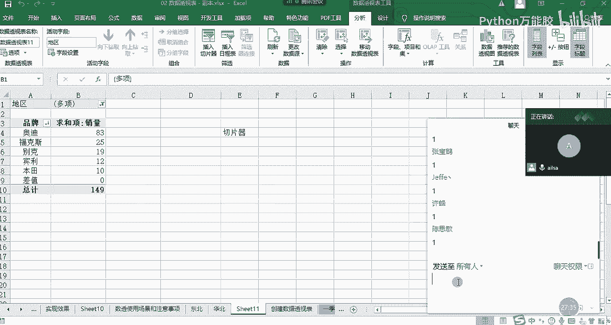

呃，呃最后两个问题就是如何合并多个excel表。那这个需求是这样子的啊，比如说现在有第一季度的表，第二季度的表，第三季度的表，我们会发现它的表啊，格式都一模一样。

现在呢我想让你给我分析一下前三个季度的一个汇总表啊，有的人说啊我们学过什么啊复制粘啊，复制选择性粘贴加和这样的一个形式。因为它的姓名的顺序也都一样啊。当然你那个操作也是没有问题。

那在这里我教大家一个数据透视表的高级的操作叫多重合并哈。啊，多重合并。然后我们这个操作方法呢，首先我们要一个多重合并的一个对话框，它这个功能的话，在我们的前台的功能区当中是没有的。所以说你需要设置一下。

怎么去设置呢？就是点我们的文件啊，点选项啊，然后有一个自定义功能区啊。

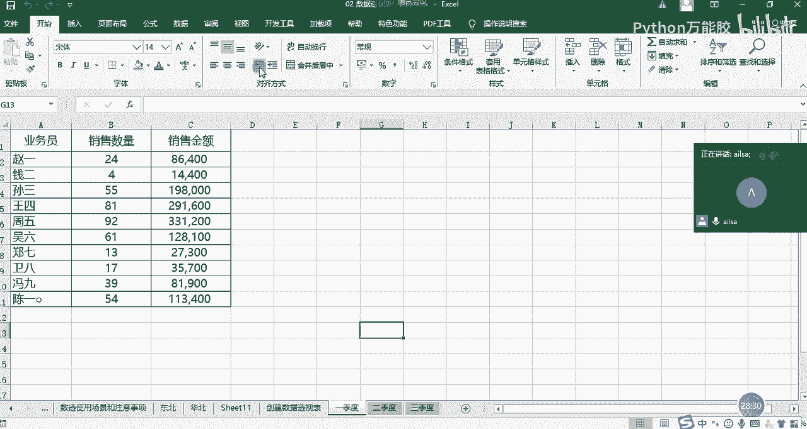

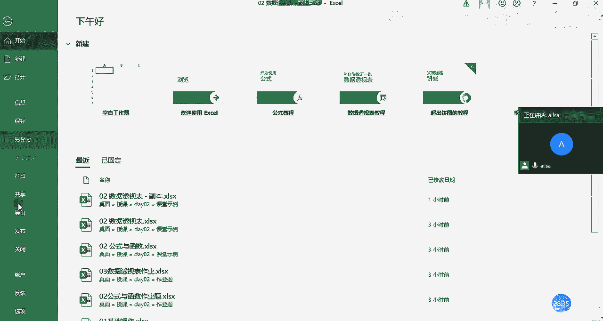

然后在下拉当中有一个不在功能区的命令，我们再往下走往下走啊，要拉好多嗯。我们看到没有数据透视表和数据透视向导，这个我们要把它拉到我们的整个的。你看这些就是我们整个的一个前台显示的内容当中了啊。

这个时候我们需要把它拉到我们这里面去，怎么去拉呢？你首先要给它建一个组哈。因为我之前已经见过了，我在这里面要删掉它，我先删掉。O看啊，现在已经不能选择了啊，删除了啊，O我先删掉。然后我选择它。

我直接点击添加的话，它会提示我啊，你需要新建一个组。嗯，那我该怎么去操作呢？就是说我一般习惯性放在数据下面。因为它是一个呃数据处理的一个一个方式。所以说我们点选数据这个选项卡，然后这个分组哈，这个分组。

然后点新建组我们可以完全不用命名，然后直接点击添加，它就到这个组里面来了。那我们再会去前台看一下，在我们的数据选项卡下面，是不是也已经有了这个数据表和数据透视表和数据透视图向导啊。

这个东西我们需要有这个东西。嗯，啊这个大家跟着我自己设置一下。

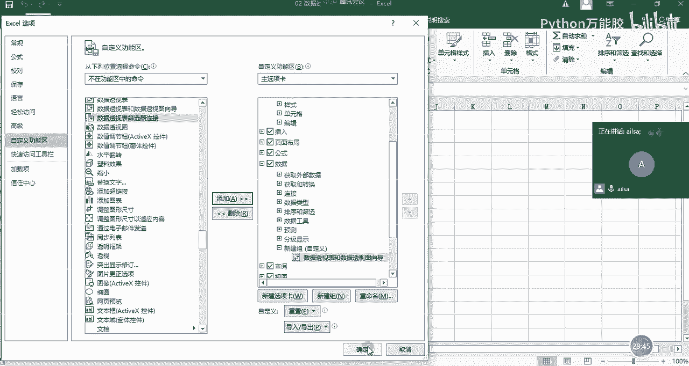

好吧，设置完了之后给我扣1。啊，需要我再带你们重新设置一下啊，可以了，是吗？如果需要的话，我可以再重新演示一遍啊。如果不需要的话，大家直接给我扣一就可以了。不。

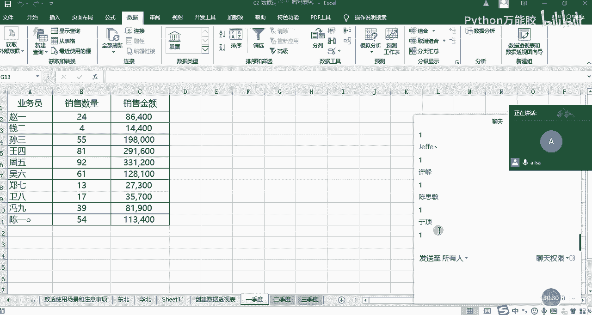

啊，就是在我们的文件选项卡下面，嗯，然后有一个选项按钮，然后有自定义功能区。然后我们大概拉到中间部分啊，我们要选择啊不在功能区的命令，然后我们拉到中间部分左右的时候啊。

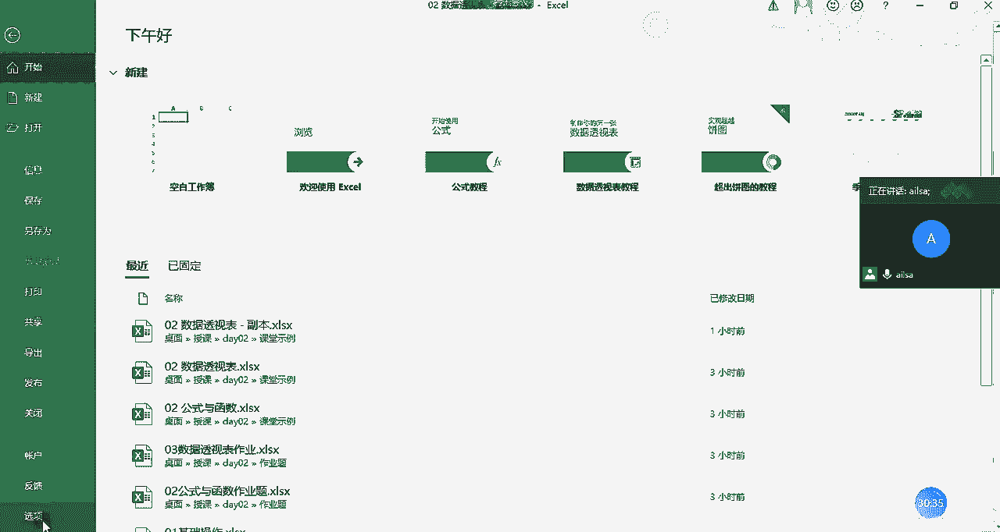

有一个数据透视表和数据透视图向导，我们呃要点击添加之前，需要在我们的数据选项卡或者任意选项卡按你自己的个人习惯哈，然后新建一个组，然后再添加进来就可以了啊。

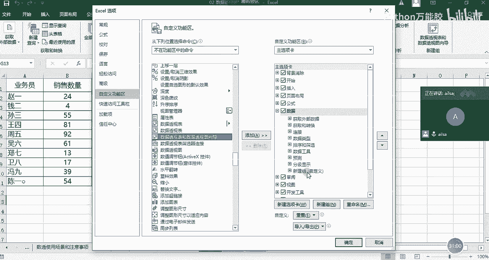

OK大家都实现了吗？啊，实现了给我扣个一，我刚才没有看到。好的啊，那我再接下来去操作啊。还这个该怎么去实现多重合并？嗯，那我再讲一下哈，如果说你不想设置这样的一个功能啊，也没关系，因为我们有快捷键。

这个快捷键是什么呢？啊？你估计这会儿应该有学生说老师，你为什么不早点说，对不对？我们的快捷键叫啊alt加D加P啊，out啊，稍等啊。out ALT哈加D。啊，alt加D加P哈。稍等，我再试一下。

alt加D啊，看到没有？alt加D啊，加P啊。print的P哈啊P啊就可以了。然后呃我之前第一次讲这个东西的时候，有的有的学生就说老师，你这个三个键我怎么按呢啊，对不对？我们先按前两个，然后先不着急。

然后再按P，它就出来了啊。所以说这个它的一个快捷方式就是outt ALT。加D。加T也能掉出来。就是你没有它也可以，你直接用这个快捷方式也能调出来。我之前以为呃一直以为它只有这种快捷方式啊。

后来我才知道它也可以在后台设置哈。这样的话其实就不用。因为我老是忘这个快捷方式啊，当时记了好久啊，OK哈。那我们调出来了之后，我们看怎么去操作哈，很简单了。那我们就选择多重合并。哎，往下去走。

然后这个都默认设置，然后再点选下一步，我们主要就是在这里面选择我们的区域。然后先选择第一部分的数据区域，然后点击添加，记得一定要点点击添加哈。不然就白选了啊，再点击啊选择我们的数据区域，点击添加。嗯。

然后再选择我们第三个部分。哎，你看他已经默认帮我选择好了哈，还挺智能。我们再点击添加。然后点击下一步啊，我们在新的工作表去实现这一步操作点击完成啊，看到没有？

他已经把我啊这么多人的所有的数据都已经统计好了，这就是多重合并的一个体现，就是他可以把很多个工作表啊的一个前提是他们的格式啊内容啊都要极度的相似哈。

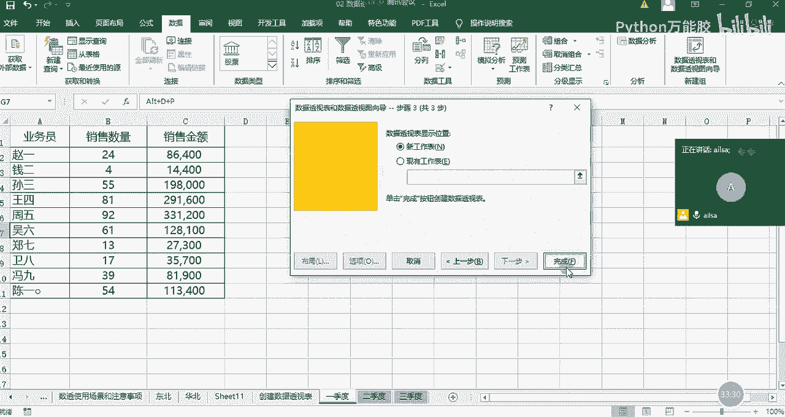

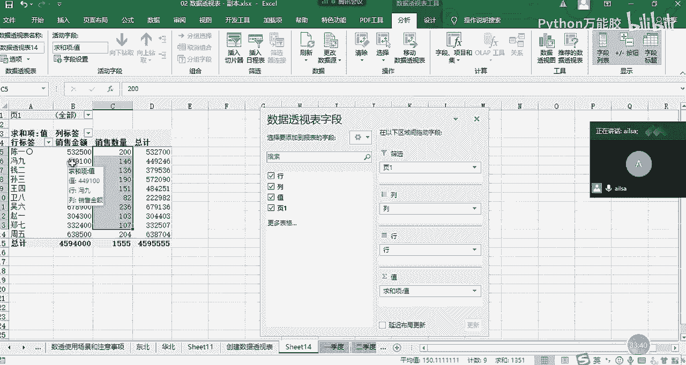

啊，这样的话他才能够实现这样的一个方式啊。OK大家对于这个啊。有什么问题没有啊，没有问题扣1。Hello。啊，这个有什么问题没有？是我掉线了吗？啊，没得没得，好嘞，吓我一跳。这有延迟吗？

其他人呢其他人我们讲完了之后这个就休息10分钟啊，休息10分钟。然后我们讲作业题。我简单再大家回顾一下哈。OK没有什么问题。那我们今天的呃数据透视表哦，还有最后一个哈，还有最后一个别着急哈啊。

我们还有一个数据透视图啊，我们看一下数据透视图是怎么来实现的。

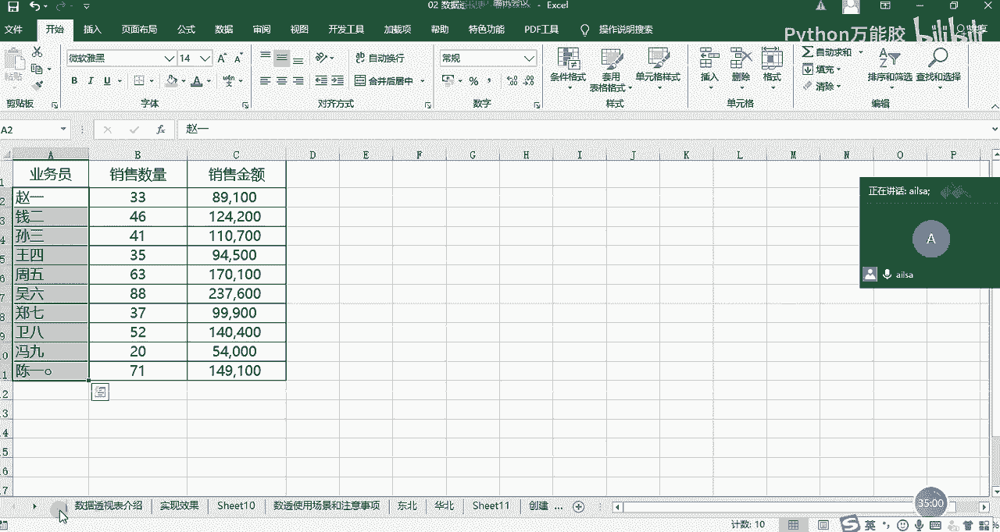

哎，你看我在这里面是不是创建了数据透视表啊啊，这是数据透视表，也就是说它就是以表格的形式去呈现的。那数据透视表还可以生成数据透视图。你比如说我们就拿这个销量而言，我们点击分析看到没有？

这里面有数据透视图，我们点击它哎啊，我们这边选择柱状图，最简单的。因为我们还没有讲图表，所以说我们就拿最简单的举例哈，这个先删掉，这个时候我们可以看一下这个图表，我告诉大家。

对于数据透透视图它有什么优点。首先它可以实现动态的显示，在这里品牌是可以筛选的。比如说啊我取消掉啊，最选择奥迪和宝马点击确定点击确定它就会只显示这两个内容。

就是它可以实现动态的啊去呃啊去显示我们所想要的效果啊，这是一个。然后第二个的话它会显示整个的一个啊就是它整个的一个版面的话会比我们的啊普通。

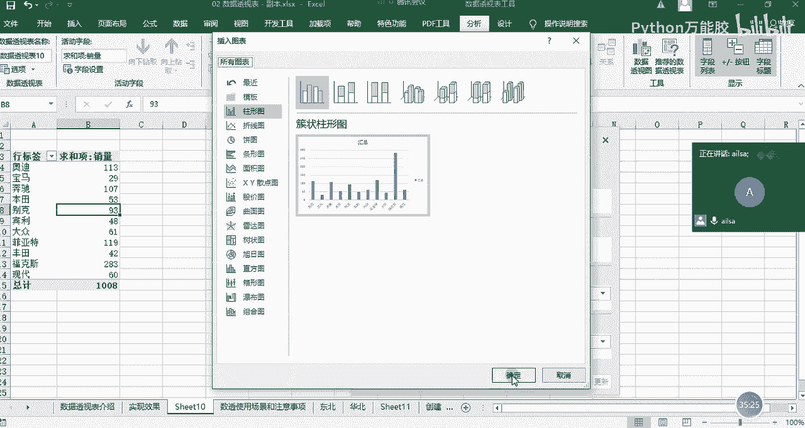

的呃报表的话会更呃更好看一些啊色彩会更柔和一些啊，这样的一个东西啊啊数据透视表啊跟我们的这个数据透视图，他们都是打包好的。然后以及跟我们excel当中明天要讲的图表都是极其类似的。

我们先知道它有这样的一个功能就可以了。OK啊，那我们这个就讲完了哈。我们把这个全选啊，这样很难看决定。OK啊，那这就是我们的数据透视图，简单提一下哈啊，我们来回顾一下我们今天下午都讲了哪些东西哈。

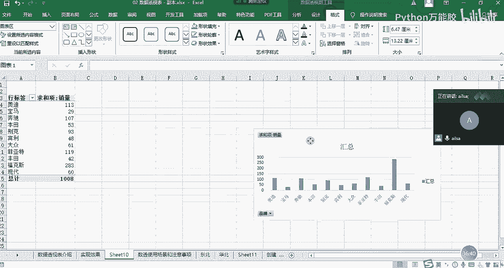

好，首先我们回顾了数据透视表啊，这样的一个优势场景注意事项。那我们讲了它的哪些功能啊，我给大家总结一下，第一个就是它的啊更新功能啊，就是说我们可以对数据啊，如果有需要进行数据修改的话，我们可以进行刷新。

大家应该想起来了，刷新啊。第二个就是如果说数据源发生了变化，特别是对于边缘啊，就是我们的区域外的数据进行一个新增的话，我们需要更改数据源。好，那第三个的话啊，就是我也给忘了哈。第3个。看一下第三个啊。

就是我们可以对它进行一些智能的排序哈。第三啊可以实现数据透视。数据透视的排序。很少有人知道哈，数据透视排序啊功能。那第四个啊就是我们可以对它进行一个新增字段的设置，也就是添加啊添加。计算字段啊。

第五个是添加自计算项，一个是针对列，一个是针对行。啊，计算项啊。第六个啊就是我们可以进行一个报表，或者是图呃那个透视表啊的优化，透视表的一个啊外观的优化啊，展示这样的。

第七个啊就是我们可以啊实现切片器啊的功能，对吧？切片器进行一个动态的数据筛选。嗯，切片器这个词很高大上哈。啊，大家一定要学会这个词啊，别人说哎，你在数据透视表中都用了哪些功能啊？哎。

你说其实数据透视表是什么什么啊，进行一个快速的分类汇总啊计算。然后呢，它这边可以实现排序，可以实现动啊切片器，实现动态的一个啊数据展示啊，然后还可以进行多重合并啊，多重合并啊啊。

以及它还可以建立啊就是比较啊比较灵活的。灵活的数据啊透视图这样的一个功能啊，这几个就是我们要讲的数据透视表的常用的功能哈。跟大家说，你掌握了这些，基本上你的数据透视表就已经玩的很溜了哈。

真的这个数据透视表是我讲的比较全的了。很多人我告诉告诉你们，在公司当中很多人都停留在只会见这样的一个东西。甚至说你这个呃就是就是大家问的一个问题，你这个字段列表啊，消失了，怎么去显示，很多人都不知道。

因为它只要实现它最基本的功能就可以了。没有人这么有像我似的，有闲工夫去研究研究的那么深哈。

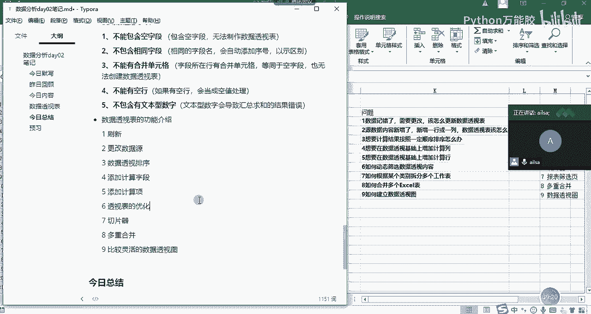

啊，所以说大家今天把数据透视表学完了之后啊，相当于是它的常用的功能啊，包括一些不常用的也都掌握了。好吧，那家大那大家对于这个呃数据透视表啊，目前讲的所有的内容还有什么问题没有没有问题，我们就休息啦。啊。

没有问题，给我扣1。ok没有哈没有，我们就休息10分钟。然后我下面讲作业。

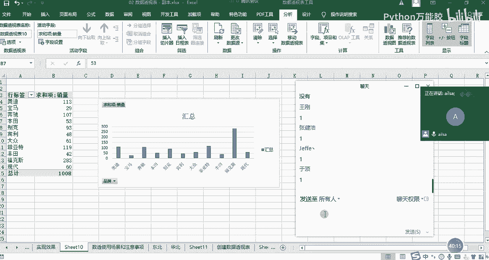

好吧嗯。