# 【python数据分析精华版来了（附文档代码）】10小时学会Python数据分析、挖掘、清洗、可视化从入门到项目实战（完整版）学会可做项目 - P18：13 day01作业讲解 - Python万能胶 - BV1YAUuYkEAH

分享昨天的作业。昨天的作业相对来说比较简单哈，而且量也不大，总共八道题啊，那我们一个个来看哈。

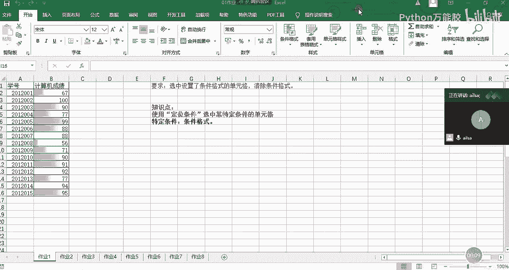

哎，这个时候我需要给大家互动一下，不然的话。还讲不出来了。啊。好嘞，我们先看第一道题啊，他说的我们先看题目要求，就是选中了设置条件格式的单元格，然后清除条件格式。

也就是说在它这里面呢有一些是没有条件格式的，有一些是有的，对不对？那我要把有的清除掉，没有的保留，大概是这个思路哈。如果说啊我先说我的第一个思路哈，就是我在日常工作当中啊，遇遇到这种问题。

我猜不管它三七二十一什么有的没的，我直接啊选择我的。还数据选项卡下面啊啊开始选项卡下面的一个条件格式哈啊。

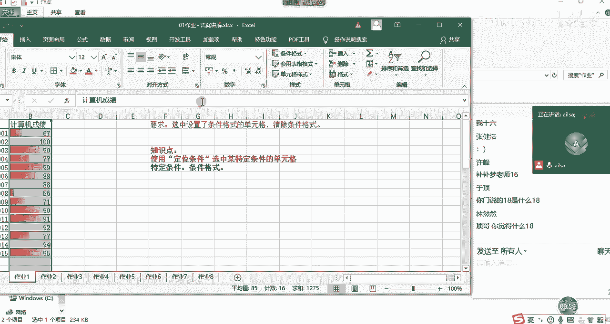

他这个说了之后确实不好用条件格式，然后下面有一个清除规则啊，我会把啊我所选中的单元格的规则全部给它清除就可以了。我就这么改。

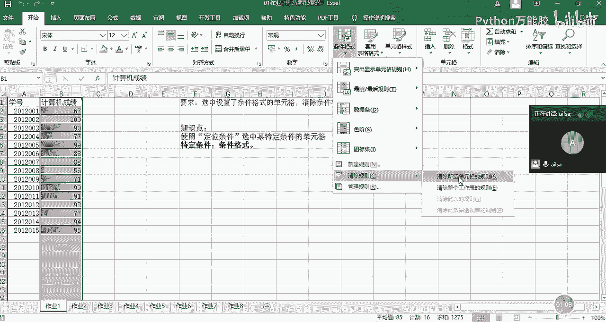

怎么简单怎么来啊。

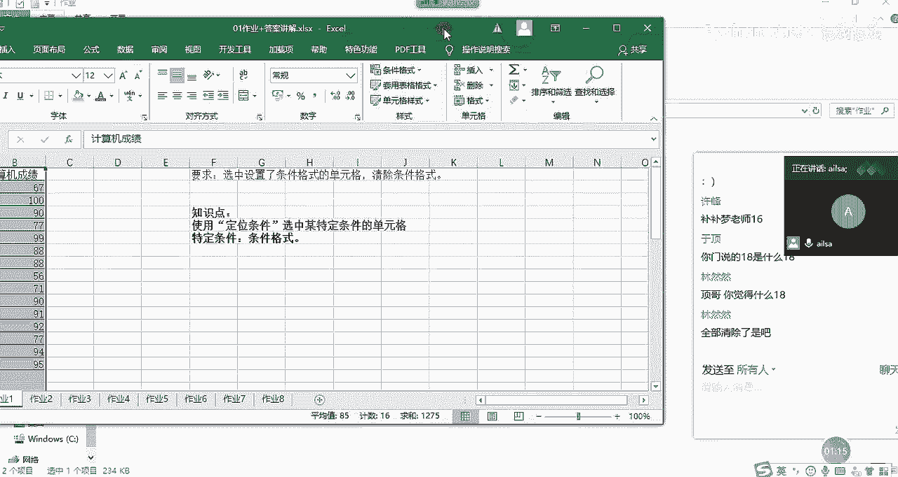

对啊，就这么干。然后的话但是哈我们要根据题目的要求啊啊，因为我们一般工作当中没有人给你这么啊这么这么限制，他的意思是什么意思呢？我大概理解一下，就是说假设这里面有其他的格式啊，比如说哎这是黄色背景的。

现在呢我想让你保留这些格式，只要把这些有条件格式的删除就可以了。他可能是想表达这个意思。那我该怎么去操作呢？我还是选中啊，然后这个时候我们就采用了我们的定位条件选择。好，选择定位条件。

然后这个时候我们选择的是条件格式啊，确定。哎。什么意思？选中，然后ctrol加G定位条件。不是条件格式，对吧？确定。哦，对我已经选中了哈，sorry哈，我这个定位是选中哈，傻了。

然后这个时候我们要把格式给清除，对不对？那我就把格式清除一下。

在我们这个清除里面有一个清除格式啊，清除掉就可以了。所以说你看我既保留了原来的格式，也把有条件格式的给清除了，是这个意思啊OK作业一明白了吗？

明白了，扣1。好嘞啊，我们看作业2啊。嗯，只有两个人。三个人。啊，大家加速哈，我们尽快快点讲。快点讲完之后，大家赶紧写作业，因为今天作业有点多哈。

好K我们看第二道题。第二道题是什么意思呢？就是说因为我们在有时候啊我们会进行两列数据的一个对比。比如说我们在这这一列的数据是我们手口算的哈。

假设是我们口算的这一列数据是我们用系统算的那我们想看一下我们口算的数据对不对的时候，我们可以通过突出显示，然后这样的一个方式进行一个呈现。那这个的话它也可以用定位来实现哈。

我先把它里面的格式全部都清楚一下。啊，这也是条件格式里面的啊，我要给他清楚啊。

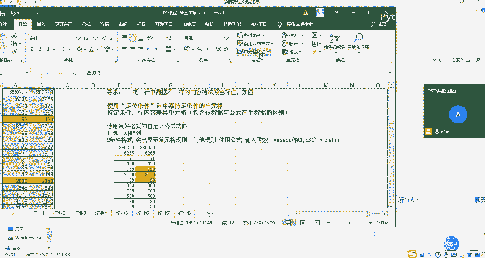

啊，请大家知道我们的条件格式一定要是在这里去清楚啊，所选单元格的规则。我清楚了之后，我们先看第一种做法哈。第一种呃第一种做法就是使用定位cttrorl加G，然后选择行内容差异的单元格。

它只是选择上哈行内容差异啊，这个里然后确定这是他会选择它，然后我们给它加上特殊的颜色就可以了。这就是我们使用定位显示不同的颜色。那昨天呢有同学就说哎我也可以用条件格式来进行实现。然后我是这么来实现的。

但是你用条件格式的话，有可能两个都加上了颜色哈。我们看一下怎么来实现啊，我在这我在这里面已经写好了我的一个操作方式哈。首先也是先选中啊，然后使用条件格式啊，突出显示单元格的规则，然后选择其他规则。

然后我们在这个下面选择最后一个使用公式啊，怎么是使用公式呢？然后这里的话我们是不是要判断A列和B列，它两个值是否相等啊，如果相等就不用设置格式了。如果不相等，就设置格式，那这个函数是怎么来写的呢？

它在这里面要写等于exact eXACT这个是精确的意思哈。嗯，然后在这里面。啊，在这里面，我们只要啊选择一个A一和B1，它就能识别到整列了。所以说啊啊因为我们的列是不发生变化，行发生变化。

所以说列方向上是加了道勒福，哎，这是一种写法啊，大家不用去这就是去研究，唉，它为什么这么写啊啊，这是B一啊，这样的一个形式。那它这个精确，它返回的是处和false，什么意思呢？就是说如果这两行啊。

这如果说啊这两列啊同一行的这两列的值是相等的，就会返返回处。如果不相等，就会返回false，这个时候我们只提取false的值啊，这提取false的值，然后对它进行一个格式的调整。

比如说我们设置为填充为黄色的，点击确定啊，点击确定。哎，你看它也显示出来了，这就是我们所想要的效果。

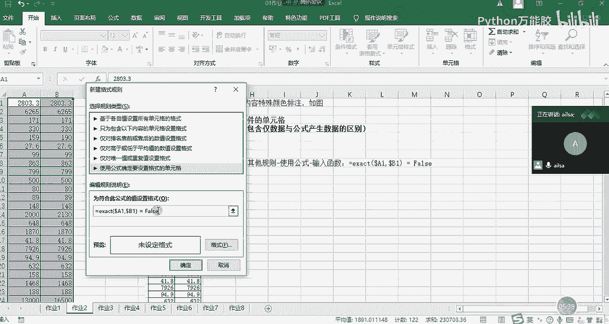

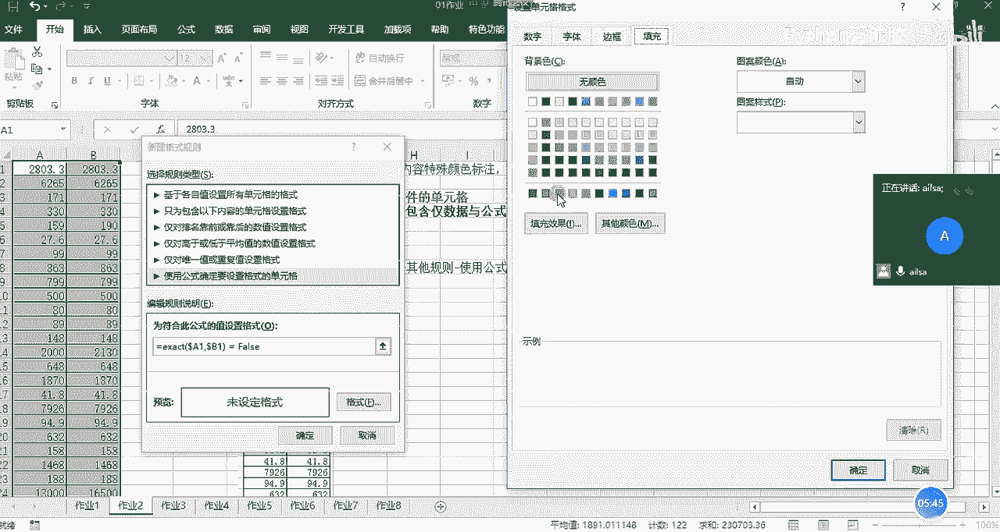

但是我们会发现。哎，好像有点问题哈，你看这里的呃这里的27。6和27。6这边是不一样的。我们看一下句子的值，这是一个公式里面计算的这是一个啊，那这里的话我们把它粘贴过来之后。

他应该是应该是基于小数位数的一个计算啊。我们看它应该是精确的，不仅仅是27。6，还有可能会更多。所以说它没有显示出来。可以看到啊，我们使用条件格式的时候，它计算的会更精确一些。

而使用我们的啊行内容差异的话啊，好像啊，不对，这个会更精确一些，而这个不是啊，这个不是呃太精确啊，是吧？结果是不一样的啊，大家有发现这个问题吗？啊，大家有发现这个问题没有，他们俩结果不一样。

可能还是因为小数的问题啊。啊，知道我们这两种方式就可以了啊。OK好，大家给我个响应啊，如果没有什么问题，给我扣个一，自己回去再试一下。嗯。

这只是两种方式哈那我们可以看到刚才我第二个操作方式呢是在条件格式里面输入的一个公式啊啊，这个的话相当于是有一点点的高级操作了哈啊，这个也没有关系。如果说你想实现某个效果的时候，你完全都可以去百百度啊。

别人就会告诉你，你该怎么去操作。你只要把你的需求描述清楚就可以了啊，这是我们的作业2啊，作业3，我们看一下。

哎，作业三呢，它其实就是把两列合成一列啊，然后呢，但是它们中间会有空空白，就是交叉的地方。现在啊它们的交叉点不会存在重复的现象，就是这里也有值，这里也有这个现象不存在。

那我们就使用的就是选择性粘贴跳过空单元格的一个方法。那怎么来操作呢？首先我先把这某一列的值粘过来啊，这个就因为有空制，所以说我们在进行区域选择的时候就会出现啊就是断层的情况，所以我们要呃下拉的这种方式。

我们先选择过来，然后我们再选择这一列啊，进行ctrorl加C，然后把鼠标定位到这里右击选择选择性粘贴，然后选择跳过。空单元格点击确定，然后就实现了我们所想要的效果，对吧？啊，这个应该也没有什么问题。

OK我们再往下讲啊，作业4作业四的话，它其实就是合并上下啊上半年和下半年的一个数据啊，我们第一种方法啊，我们今天讲了公式与函数之后，在这里我们就可以使用公式与函数了。那这个表它巧在哪个地方呢？

就是说它的格式一模一样啊。所以说我们可以直接使用这样的公式进行一个呃拖动就可以了。而且完全不要不需要加啊我们的绝对引用或者是混合引用。我们还有一种方式就是用我们的呃选择性粘贴，直贴粘贴加号就可以了。

那怎么来操作呢？哎，你比如说现在我把这个数据复制出来。这个数据复制出来。放在这里啊，这个时候我复制这一部分数据，cttrol加C，然后把鼠标定位到这里，右击选择选择性粘贴，点击加号确定。

那么它就粘贴过来了，对吧？这我们在课上讲过了啊，这个就也比较简单。那第二种方式的话就是使用公式啊，是M5加上M12，它在往右拖动的过程当中都相应的发生变化，所以说啊这边可以直接进行一个实现啊。

因为它的格式完全一模一样。

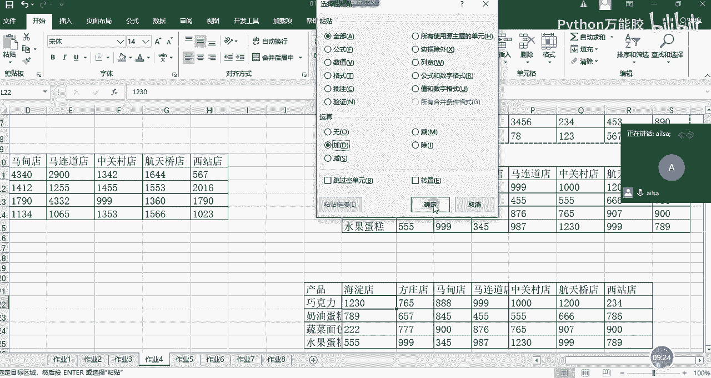

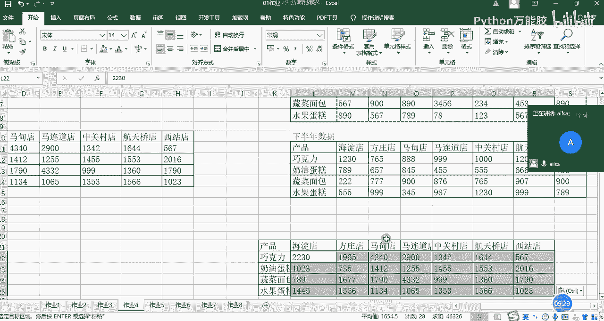

这是作业4啊啊，大家对于前啊三和四这两个作业啊有什么问题没有？啊，没有问题，给我扣个一。

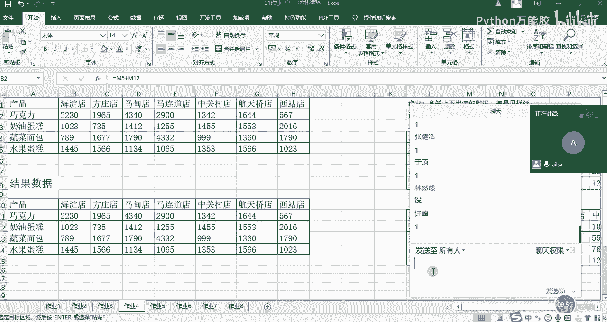

没好的啊，看来大家掌握的都还可以哈。我们看作业5。好，作业五我就不讲了哈啊，我们在课上讲过了，就是我们啊先选中快速定位到我们这个空置，然后进行一个自动求和啊，快速求和这样的一个方式啊，我们看作业6啊。

作业六的话是自动生成啊A列到啊就是在A列当中自动生成1到啊1万个连续序号哈。这个的话，因为我们昨天也讨论了啊，今天考试也考了，其实特别简单，我们先在这里面输入一个一，然后呢。

啊，在我们的呃填充这里啊输入啊向下啊不序列哈序列，然后选择在这里选择列，然后步长为一，然后宗止值为啊11万，然后点击确定啊，它就出现了我们所想要的效果啊，这个也是我们填充序号的一种方式啊。

大家知道就可以了啊。如果说真有人问到这个方法了啊，你可以给别人选一下G哈，你看哎我可以这么去实践，是不是很简单，嗯，这是我们的作业6啊，今天也考过了，所以说就不啊进行一个呃讲解了。OK我们看作业7哈。

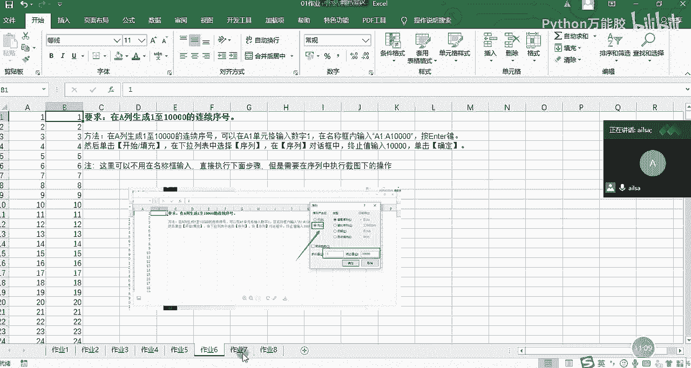

好，作业七和作业八都会用到分列啊，我们看作业7。啊，作业期呢我这边啊我这边要求就是可以第一步可以尝试一下cttrol加E。如果ctrol加E实现不了，你就可以再呃就是再尝试呃就是我们的分列啊。

因为它都有1个VS嘛啊，对不对？然后我们把它先拿出来看看，我们把它拿出来看，我们用ctrol加E先试一下。嗯。什么情况？ctrorl加E试一下。OK那我们看一下，然后是中国啊，我们把这个粘出来。

中国啊粘出来，然后是阿尔吉利亚。吓我一跳，我还以为没录呢，阿尔及利亚这两个值对吧？我们摘出来之后，然后我们先试一部分啊，ctrl加E哎，好像实现不了，对吗？大家实现了没有？哦。

大家实现了ctrl加一能实现吗？嗯。国歌响应。分裂的是吧，ctrl加E好像实现不了。没关系，那我们就采用分裂的方式。好，分的也可以啊。再撤销一下。OK我们采用分裂的方式。插入啊不对。啊。

我们直接在数据下面有一个分裂。嗯，我们看一下哈。我们啊选择其他，我们试试VS哈。我还没有这么去试过啊，好像可以哈，用V，然后去给它家进行一个拆分，点击下一步。应该很多人不是这么干的。

很多人是不是先把VS给替换掉啊，大家有没有呃这么去操作过？

啊，你是这么干的哈，只能V，然后SO大家可以把VS替换成逗号啊，替换成逗号之后，然后以逗号隔开也是可以的啊。啊，我们可以这样哈，我们可以啊ctrol加。H然后把VS。啊，刚才那种方法也行。

但是你可能要需要进行一个二次处理哈。不过每一种方法好像都需要二次处理一下逗号，然后我们点查找全部试试。

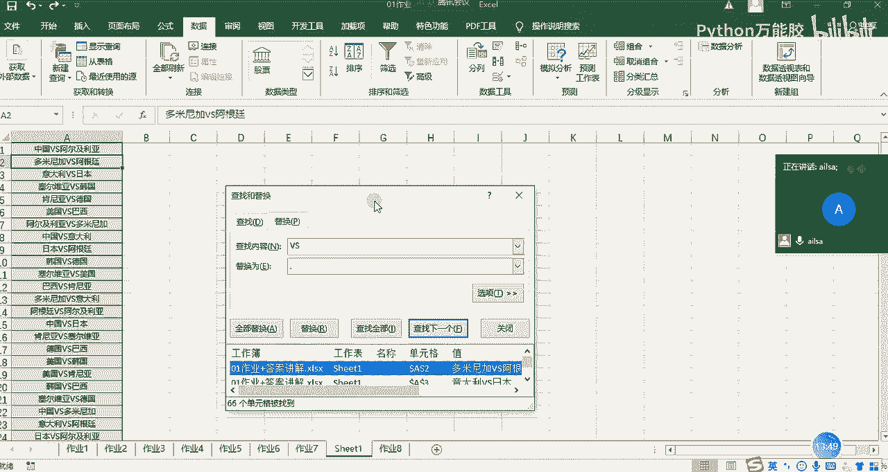

O。啊，都是可以的哈，ctrl加A全部替换，是不是我就替换了啊，替换了之后我们再进行一个分列啊，这个时候我们可以选择分割符号啊，选择逗号啊，下一步啊完成啊就可以实现了。然后去重的话。

大家一定要注意去重的话，我们一定是因为它有可能把你这边的列可以删掉了。所以说你要把它单独啊啊单独拿到一边去啊，我们可以再放到一个这个地方啊，然后在这里面单独对着。因为它把这一列，比如说这两列重复了。

它把你这边的值也删掉了。所以说我们选中它，然后在我们的。

在我们的这里啊删除重复项啊，我们只有一列，所以直接点击确定啊，是不是保留了这么多。然后我们在这里再进行一个重复制的删除啊，还是一列，点击确定OK就可以了。

这就是我们的一个呃分列加删除重复项的啊一个操作就实现了。

对吧哎，就跟这个是一样的，嗯，这就是我们所想要的效果。大家大家对于这个有什么问题没有？

好，空格也可以啊。中国啊。空格也可以。OKO。好的。哦，你的意思是说用个空格，对吧？啊，间号是这个意思吗？嗯，没关系啊，不是是吗？没关系，我们可以私下再沟通，你可以把你的呃。

我等会儿可以给大家发一个动图的录制啊，动词录制的一个软件啊，大家有什么问题都可以把它啊录制下来啊，录制下来。然后的话我们就可以去动态的去展示。行，那我再私下的跟建浩再沟通一下。是吗？嗯。

我这边有我这边有，我等会儿给大家分享。那我们私下再沟通哈，建浩嗯。

哎，我们讲完了第七题，我们看第八题哈。第八题的话啊其实没有什么特别好的方法，分裂也可以ctrol加E应该也能实现。我们先试一下哈。我们先试一下啊，就是我看看啊。嗯，反正得一列一列来啊，只能这么说。

没办法一次性的去实现所有的操作啊。所以说嗯这边要加两列啊，然后是工作能力，也可以分列，都是一样的。工作能力，然后是88。5，我们试一下。啊工能力就不需要了，直接就这个就行。

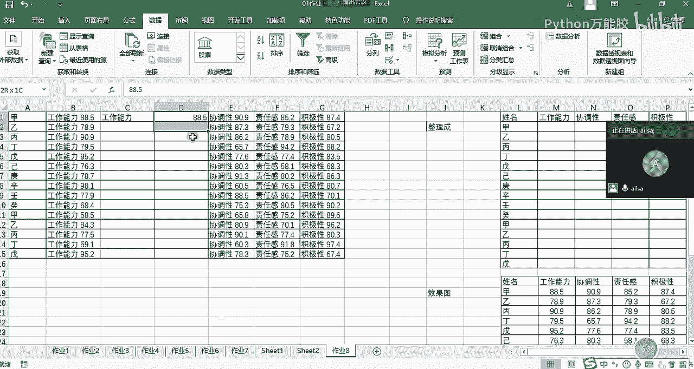

啊，好像可以，对吧？然后把这个值弄出来之后，直接复制到我们这个地方就可以了。因为它的顺序是一样的那协调性和责任感、积极性等等这些也是这么来实现的啊，呃，这是cttrol加E分类的话。

就是它们中间有个空格沿着空格去分裂就可以了啊，当然你也可以用函数哈，因为我们会发现。

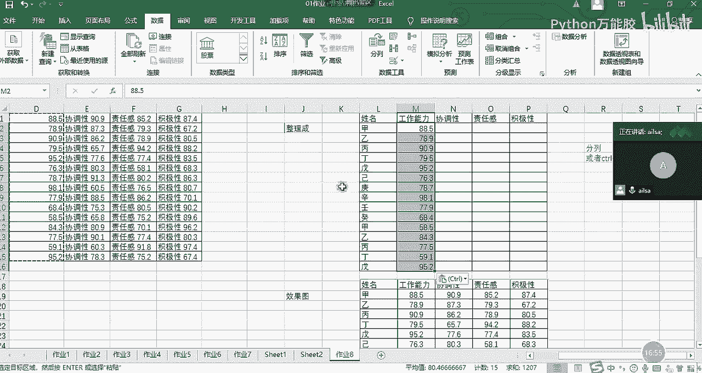

啊，它前面的啊长度是一样的，对不对啊？它后面的好像也是一样的，你也可以用我们的文本函数来进行实现，也是可以的。好，大家可以尝试一下，我们今天学完了函数之后，都可以试着呃用一用。嗯，O哈。

那我们还挺快的哈啊，不到20分钟就把我们作业讲完了。哼呵呵。😊，没毛病，用函数的话是可以的。没毛病。对的嗯。因为你用啊你用函数的话，你可以拖动，所以说它可以一次性实现。啊，因为我们昨天没讲嘛。

我们昨天没有讲函数，所以说我说它不可能一次性全部都实现。如果讲了之后，那你这个就可以实现了啊。

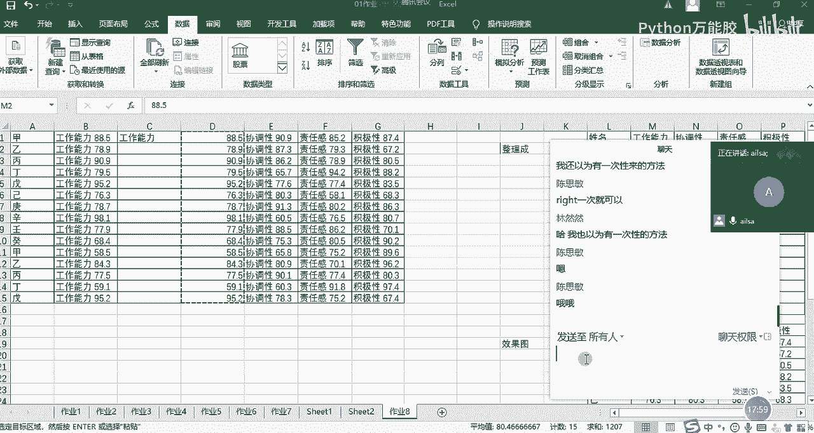

因为你看啊我给大家演示一下吧。啊，想一次性时间也可以啊，我先把它删掉。啊，然后这个时候我把它清除哈，然后说等于啊啊我们看一下，我们直接rite吧。R I， JT， right。然后我们选择我们的文本。

然后我们截取1234，没有空格吧。4。我们看一下okK没有问题。这个时候我们直接往下拖动就可以了，对吧？哎，它实现了，然后我们再往下拖动啊，刚才是往右哈往下拖动，它也能够实现，对吧？就一次性实现了。

因为它这个表跟这个表的结构是一模一样的，所以说完全可以哈。没毛病，方法有很多啊方法有很多。

我绝对不会说哎一个功能的实现，它就一种啊。看你习惯采用哪个就可以了啊，当然越多越好。看你心情，今天用这个，明天用那个啊都可以。好，我们先把这几啊。

