# 【python数据分析精华版来了（附文档代码）】10小时学会Python数据分析、挖掘、清洗、可视化从入门到项目实战（完整版）学会可做项目 - P21：03 图表2 - Python万能胶 - BV1YAUuYkEAH

好嘞，那我们接着讲解我们的呃图表。哎，我们之前讲了散点图折线图啊，还有条形图、柱状图啊这四种图形。然后下面。是下面的这个呃为气泡图哈，我们讲解气泡图，气泡图跟散点图是类似的啊，我跟大家说一下啊。

它们之间的区别在于哪里？你看散点图是二维啊，也就是两类数据之间的一个相关关系。而气泡图，它展示的是三维数据之间的相关关系，也就是三类数据之间的相关关系。那我们就在想。

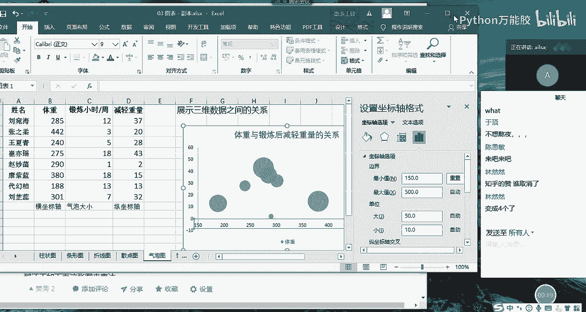

他怎么来呈现呢？你看它的呃它只有两个坐标轴，一个是水平轴，一个是垂直轴。水平轴如果代表体重的话，那垂直轴代表减轻重量的话，那第三个维度锻炼的小时的时长，这个是通过什么来体现的呢？

大家看一下这个气泡图跟散点图唯一的差别在哪里啊，是不是在于气泡的大小啊，那它这个大小哎就反映了它这个断炼小时的一个呃呃一个时长的一个大小就是气泡越大，时长越长，气泡越小时长越短。

那也就是说我们通过啊通过横纵坐标来体现前两个维度的数据之间的关系。然后再通过气泡的大小去体现第三个呃数据类型，它们三者之间的一个关系。这种情况就可以通过气泡图来实现？我们看一下怎么来操作的哈。

我们还是选择我们所有的数据，然后点击插入啊推荐的图表。然后这个时候我们在所有的图表当中选择，你看我们找了一遍哈，都没有散点图，对不对？那这个时候我们就啊都没有气泡图。sorry哈，都没有气泡图。

那我们就要定位到散点图。大家看到没有啊？这边有气泡图啊，所以说我们可以选择它，我们选择的是第二种哈，也就是说呃是这种一个呈现，我们点击确定。

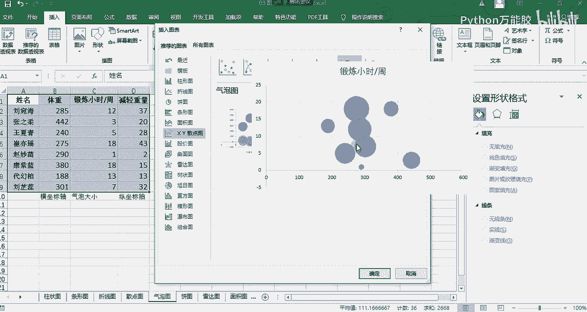

哎，确定了之后，我们会发现好像跟我们原来做的这个不太一样。我们来分析一下啊，分析一下哎，他这个啊他这个。放在这里哈，他这个呃我们把这个呃。把这个图例啊锻炼销售时场。OK我们再把我们的嗯看一下哈。

这个是我们明显看出来是我们的体重，对吧？那这个哎我们看一下它是不是我们呃它默认是我们的锻炼小时的一个时长啊，对不对？你看它最高才是25，那肯定是这个数，而不是减轻体重这个数。

但是现在我们想给他展示的就是呃呃横坐标是我们的体重，而纵坐标是我们的减轻体重，那这个气泡大小，我们来给它体现锻炼小时的一个时长，我们该怎么去修改呢？啊，这个时候我们可以右击，然后选择我们的数据看一下。

哎，在这里呢有个锻炼小时的时长，我们编辑一下。哎，这有一个编辑序数据序列。那在这里我们就可以去修改它们三者之间的关系了。我们一个个来看哈，我们不用看这个系列名称，我们直接看X轴，X轴就是我们的水平轴。

水平轴是我们的体重。哎，我们看一下水平轴啊，X轴就是B2到B9没有问题，是我们的体重哈。那Y轴系列它这边显示的是C，对吧？就是锻炼小时的时长。这个时候我们需要给它改成什么呀？改成减轻体重，也就是D。

那我们就给它改成D。啊，D啊D2，然后到D9。这个我们可以根据自己的一个需求，然后进行一个修改。那气泡大小我们希望体现的是锻炼小时的时长。这个时候我们再改成C啊C。

就是我们的锻炼小时的时长改成C就可以了。点击确定点击确定。OK这个跟我们原来的图形就有点相似了，但是还有点不太一样。因为我们并没有发现就是特别明显的发现它们之间的一个呃就是线性关系或者相关关系。

但是我们会知道说你看它这个体重其实最低的一个值大概是188，我们这从零开始的话，它这个趋势就不够明显，对不对？那我们可以对这个坐标轴进行一个设置，我们点击它这边就出现了设置坐标轴格式。

那我们选择我们的呃就是这个最后一个选项啊，这样的一个东西，然后我们选择坐标轴选项，这边有一个边界哈最小值，我们可以看到是为零。那现在呢我把它改成150哈，188是最小值嘛，改成150。

然后这个时候点击确定哈。哎，我们就会发现它整个的一个趋势啊有一点明显了哈。那我们分析一下这张图想表达的意思哈。首先这个随着体重的不断的增加，它的一个减轻体重的一个变化趋势，对吧？啊。

那图这个呃气泡的大小代表它锻炼的时长，那气泡越大，代表他锻炼的时长越长啊，那如果说这个气泡的位置越高，代表他减轻的体重就越大，对不对？

那我们看一下这个啊这个气泡这个气泡气泡所在的位置是大概300多斤的人哈，300多斤的人，然后他锻炼的时长也不小，但是他减轻的体重对应的还是比较低的，对不对？那我们再看这个气泡，这个气泡的话。

它的体重对应的体重大概是2到300之间啊，250左右哈啊，不对啊，250到300之间应该是200260267左右。但是它锻炼的时长也不小，对不对？源圈也是挺大的，跟它差不多。但是它减轻的体重也不小。

说明它这个呃达到的效果还是不错的，对不对？那我们就可以通过这种形式然后去发现说这个体重与减与它这个锻炼时长，还有它减轻体重之间的一个呃存在的一个关系啊，就可以通过气泡图来进行一个体现。

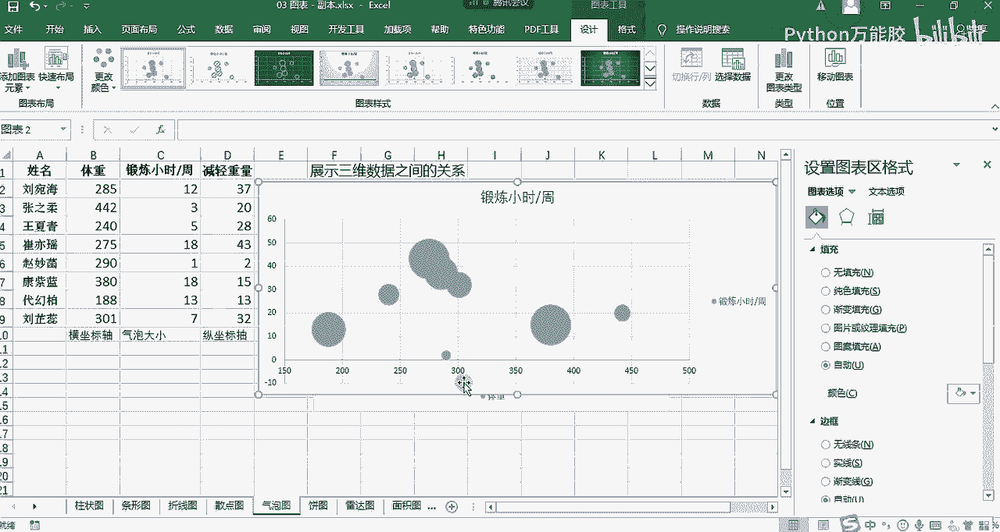

嗯，大家现在在自己。啊。啊。什么意思？什么体重440，什么怪话啊，那大家现在啊自己手动的操作一遍，然后看能不能创建这样一个气泡图啊。如果可以的话，然后完成了之后，然后也听明白这个的作用了。

然后我们就扣个一啊。我们一般情况下创建气泡图的话，用的还是啊不多哈。我们用的常用的是散点图。OK哈嗯。😊，啊，其实从这个图表中当来说的话，其这个啊这这个人他他的效果还是比较明显的。

你看他锻炼的时长也不是特别多，但他减的体重却比较多啊，说明他的效果还是可以的，但是他你看他锻炼了这么久，还没有人锻炼这么久，减的多呢，是吧？啊，所以说我们会发现一个就是就是从他俩来说的话。

可能体重基数越大，相对来说啊减的就会更猛一些啊，但但并不是绝对的。你看这个人啊体重基数也很大，但是他锻炼了这么久，减的还是比较少的。嗯，他这个其实没有特别大的一个啊，就是并不是说你锻炼的时长越长。

你的体重就减得更明显。我们很明显看出来它整个的一个相关性并不是特别强。OK两个人建出来了，其他人呢？好的，我再等半分钟哈。嗯。嗯。对于图表的一个其实讲解的话稍微是有点枯燥的哈，因为它这个。嗯。

他这个呃他这个必须结合到一个实例当中，然后去一步一步去操作的话会更明显一些。那就是单独拎出来的话啊，稍微是有点小小的断层哈啊，但是但是也没有关系，我们也是结合实际的啊一些情况进行的一些分析哈啊。

这是我们的气泡图。那接下来我们看一下丙图。还有我们都知道饼图哈一张大饼啊，分给多少个人。那我们从这个呃饼图的一个直接概念上来做的话，他肯定是想表达是某一类群体当中某一些类别的一些占比情况啊。

所以说那丙图主要是描述部分与整体他们之间的一个关系这样的一个作用，我们就可以使用饼图来体现了。你比如说你某一款啊就是某一个呃公司吧啊或者是那个分布哈，公司就是专门卖手机的哎，我们都知道哈啊。

然后他每一款手，他们公司会有很多个手机售卖。那每一款手机的一个销量，然后构成了他们整个公司的一个销量。所以说我们想分析一下到底哪些手机比较畅销的时候，我们就可以通过饼图来实现。

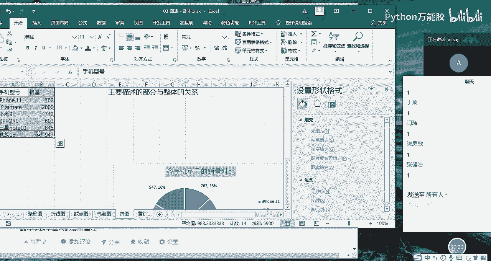

那丙图呢也是先选择数据插入，然后呃推荐的图表，然后在这里面选择丙图就可以了。那对于丙图的话，它有一个跟其他的图表并不是特别一样的地方，就是它的显示的数据标签哈，我先给大家一一一的去显示。

那我们知道了创建了这个丙图之后呢，我们肯定是想知道它每一个丙图的一个数值情况，对吧？我们添加数据标签，哎，添加完了之后，我们发现它在里面，我们可以给它设置一下啊，把它设置到啊数据标签外哈这样的一个形式。

但是我们可以从我们原来的图表当中发现说哎你这里啊是不是还设置了一个百分比啊，其实我们很想知道的就是这个呃这个类别哈，我们可以把它的。

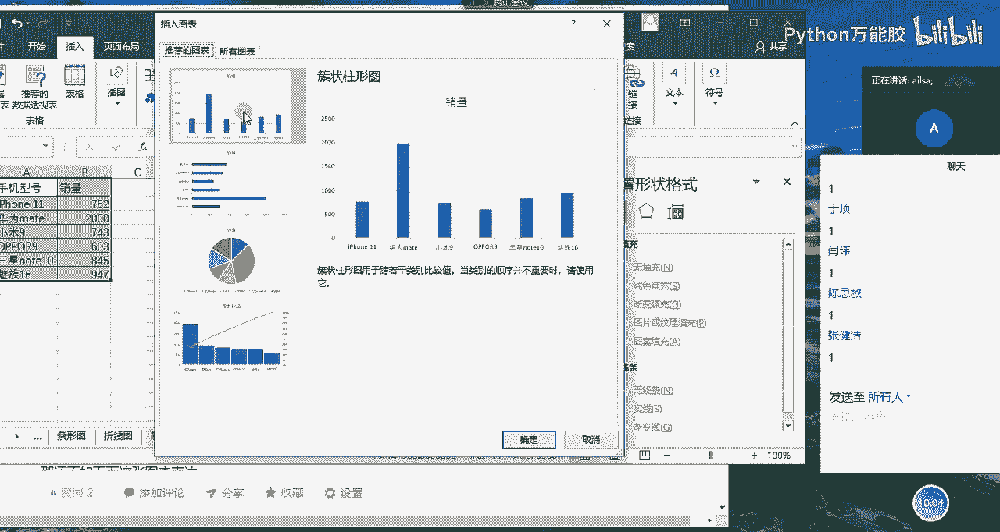

啊，图例放在它的右手边啊，这样会更直观一些。你比如说我想知道iphone啊762个销量，它到底占了总体的多少个百分比。哎，这才是我们所想要的一个效果，那我们就可以啊对它进行一个相应的添加，怎么添加呢？

就不是在我们的数据标签里了啊，它这里没有，那我们需要给它设置格式里面，然后在我们的设置数据标签格式当中的最后一个，然后有一个标签选项，然后大家看到没有？这有一个百分比。哎。

我们选择它这时候它就会显示每一个类别，它所对应的销量以及它所占比情况。我们可以看到这个。啊，这个华为的手机还是比较厉害的哈，华为的手机占到了34%，然后它的总销量为2000，这就是我们丙图想表达的意思。

就是总体呃呃部分以总体之间一个关系，一个占比情况来去分析某一分类，它的呃它的一个优势啊，或者是说所有的产品当中，它每一个产品的占比，哪些是畅销的产品。

哪些是呃就是呃之就是销呃就是之后的或者是叫卖不出去的产品这样子。哦，这后面怎么还带版分号呢？你的没有吗？可以设置。这本来就是百分比啊。900%多。你这选的有问题吧。我们点这个啊，我再说一下哈。

我们的百分比是在数据标签下面，然后选择百分比和值。啊，中间是逗号，对，中间是逗号啊，不是点儿哈啊不是点儿。前面显示的是你的销量。你比如说我们看这个iphone11，它是不是762，762的销量。

然后占13%啊，是这样的哈。是这样的啊，对，我们再放大一下哈，它这个是百就是762的销量啊啊然后逗号有一个百分比。但是如果说哈有的人就说那我可不可以不要这个前面的销量，然后只要后面的百分比呢。

也是可以的。我们也是在设置数据标签选项里面有一个数据标签，我们把值取消掉，它也就不显示了，明白了吗？也就是说丙图跟其他图形相比，它是有一个值和百分比的一个同类的一个选择的，就是你都选上它就都显示。

如果你不选其中的值，它又不显示了。好吧，那对于丙图来说，然后大家有什么问题没有。没有问题给我扣1啊，并且你已经完成了丙图的一个制作啊。好的，没有问题哈。那我们接着看雷达图哈。

一听这个雷达图好像很高大上的样子哈。其实啊它制作起来也是比较简单，它就是为了分析啊分析，然后不同维度哈，在不同维度某一些分类它的一个对比情况。你比如说最简单的呃对能力图是经常用雷达图来实现的。呃。

就是比如说两个员工，然后我们要对他进行一个嗯选拔吧，就是选经理，然后我们想知道呃到底选哪个好，那我们就可以给他分不同的一个类别，让他去整体的去看一下哪些。

啊，这些人啊这两个人在这些能力啊，或者是这些方面到底是一个呈呈现怎么样的一个效果对比。这个时候我们就可以用雷达图。那我跟大家演示一下怎么来实现，选择我们的数据插入，然后一样的操作。

然后选择所有图表选择雷达图点击确定。你看现在的图表还是比较智能的，它就能根据你所想要的效果来实现。那就是我们可以看出分析一下这个结果的话啊，就是这个。

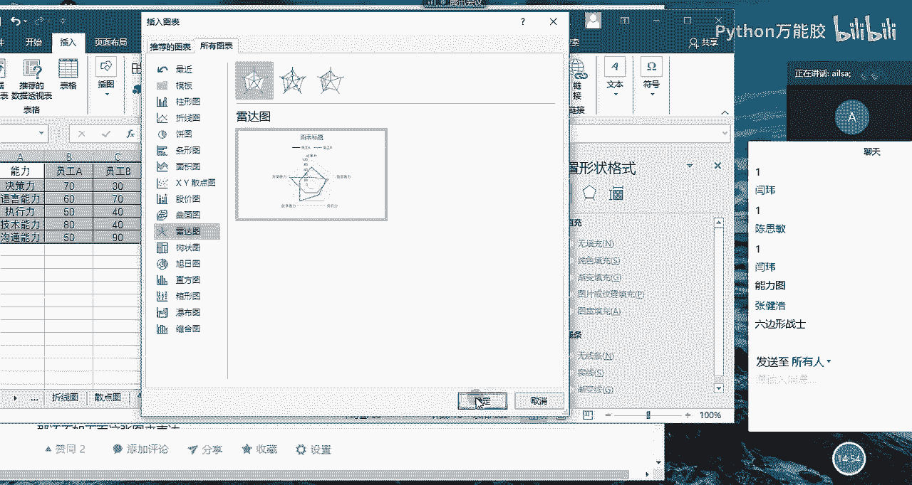

嗯，哎，把这个图理放边上啊，图里。不是放右边哈啊，那我们可以看出来说。啊，就是呃B员工他在沟通能力上是非常强的，就是说离中心点越远，他的能力越强。那这个A员工呢。

他在技术能力方面也是比较强的那说明呃A员工偏技术，B员工偏沟通能力。那如果说你想提拔的是一个管理者啊，那你可能就要提拔啊提拔B员工了。如果你想提拔的是一个技术技术啊，技术领导，那你可能提拔的就是A员工。

所以说很明显他们有自己一些哪些突出优势，就立马就呈现出来了，这就是我们的雷达图，就是呃多维度的啊多维用于多维数据的多维度的综合对比啊，这就是雷达图啊，大家明白了吗？明白给我扣1。啊。

其实这个图形放到如果说我们做一些分析的时候，放到那个我们整个的一个报告里面还是很美观的哈。哎，就觉得如果因为有些人他他不会的话哈，他会觉得说啊。嗯。他会呃他会觉得说哎你这个啊还不错哈，你这个还挺厉害。

其实也特别简单是吧嗯？那我们看一下面积图哈，面积图呢它其实也是对于。啊，它其实也是对于我们不同的一个数据维度进行一个面积大小的一个度量。也就是说面积越大，代表它在这个维度，数据量就越大，面积越小。

代表它在这个层面数据量就越小啊，我们就拿啊不同城市它的一个销量对比来啊来去做一个分析哈啊，还是选择这些数据，然后选择插入推荐的图标。然后我们选择的是啊这个哈就是我们的堆积面积图点击确定。

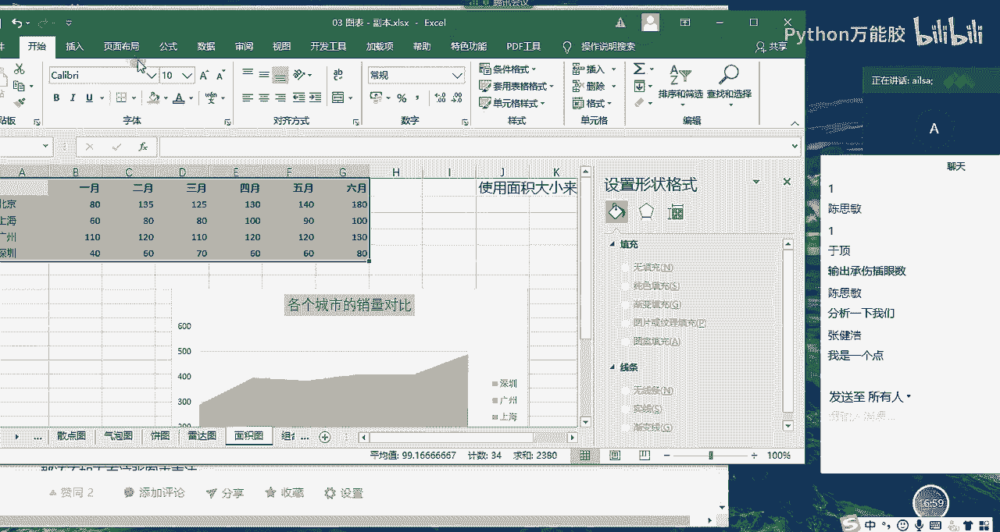

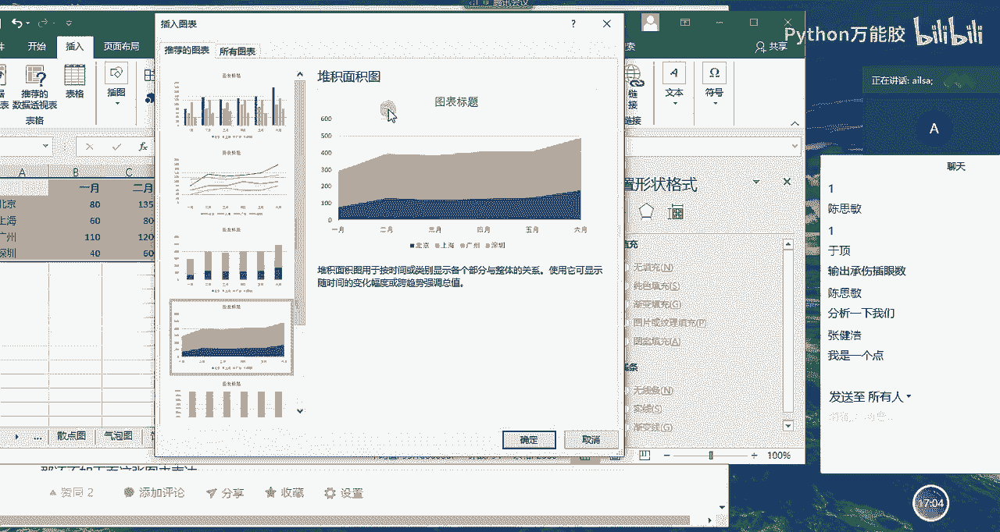

哎，那这个图形代表什么意思呢？我们可以看一下哈。嗯，首先我们先把图例放到啊放到右边啊。啊，是在右啊放到右边。然后我们知道这个不同的颜色代表不同的分类，对吧？哎，深圳、广州、上海、北京。

然后这个水平坐标轴是代表日期的。也就是说在1月份的时候，我们会发现说广州啊广州的数据量是最大的，所以说它的面积也是最大啊，看到没有？然后深圳是啊不对，深圳是最小的对，深圳是最小所以它的面积也是最小的。

然后随着时间轴的变化，它有一个折线的一个变化趋势所构成的这样的一个面积形成的一个对比。那你比如说6月份的时候，我们很明显，6月份的时候，北京啊，北京它的整个的一个销量是最好的。

所以说它整个的一个面积会逐渐的进行一个扩大。那如果说我们把这个面积去掉，其实它就是一个折线图的一个变化趋势哈，但是它又通过不同的一个面积堆积来表达它整个的一个大小来呈现的。嗯啊，所以说这个是面积图哈。

这个没有什么特别难理解的吧啊，大家做出来没有做出来给我扣个一。嗯，好的，面积图不常用啊不常用。如果你想用也OK啊，因为它还有不同颜色去构成，还还还算美观吧啊，只能说还算美观嗯。

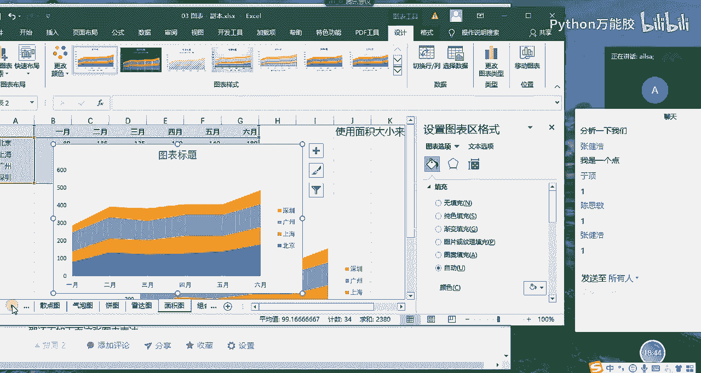

那我们看最后一个组合图，什么是组合图呢？你看我们前面讲的雷达图啊、面积图啊、气泡图啊、折线图啊，这都是单个图形，对吧？单个图形，那组合图呢它就代表的是两个级以上啊，两个两个或者是两个级以上。

但是我们一般情况下两个就够了哈。那那什么时候我们需要用两两种啊不同的图形进行一个对比呢？那就是当两个就是两个维字的数据差别很大的时候，你比如说啊你这是每个城市的一个销量啊，还是朝销量哈，销量对比。

然后这是它的一个销量的一个总计啊，就是在不同的年份进行一个加和。然后这个呢又是它的一个占比情况，就是说这个销量在这边所有城市的一个占比情况，还又是一个0到1的一个值。

如果说你想对这两部分数据进行一个对比的话，呃，那这个数据由于相对很少很少。所以说它的柱状的那个那个高度啊就会特别特别的小。你几乎就看不出来。这样你就没办法知道每一个城市它的一个占比情况。

所以说我们就可以采用组合图的形式。那它这个数据量比较小，我们就可以。让他用折线图，然后用呃一另外一个坐标轴来去呈现另外一个坐标轴来去呈现。然后这个这个销量呢就用原始的坐标轴去呈现。我给大家演示一下。

我们选择我们的数据，然后再把我们的分类选上，然后点击插入选择推荐的图表，然后我们最后有一个组合图，在组合图，这里的话，我们有一个设置什么呢？你看系列一啊，跟大家说系列一这边默认的啊。

就是我们的一个销量啊，所以说它是用柱状图，我们是默认的那系列二呢，我们默认是折线图，大家看到没有？在这个示例当中折线图非常非常的低。那是因为我们给它使用使用的是统一的坐标轴，那它是零点几呢。

它当然就是贴着地面走的那我这就是这就不是我们所想要达到的达到的效果。那我们就想让它呃就是直接在上面走一个变化趋势，那我们就可以把它设置为。

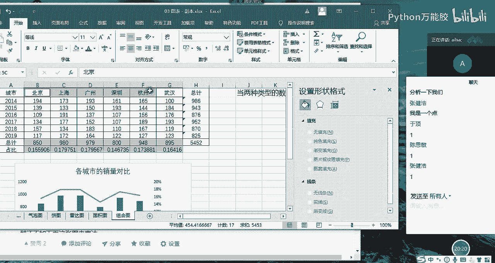

次坐标轴，我们看一下，我们设置为次坐标轴了之后，这边还是它的组坐标轴，然后次坐标轴是0到1之间，然后去体现这个变百分比。那我们从这个折线图当中，我们就可以看得出来，每一个地区的一个占比的情况。

你我们明显发现深圳是最低的对吧？广州和上海啊就是比较高啊，对吧？这样的话呈现出来会比较美观一些，这就是我们的组合图啊，大家现在创建出来了没有？

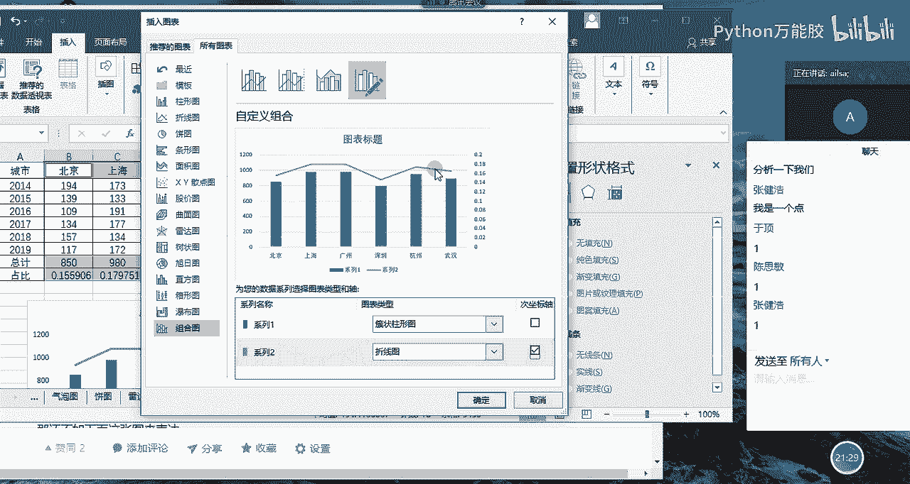

啊，创建出来并没有什么问题，给我扣个一。O然然没问题了。1米没有问题了。其他同学呢？好嗯，嗯，OK那我们啊我们在等其他同学的时候，我先跟大家说一下，我们图表到这里就已经讲完了。

然后我再带大家去回顾一下我们每一个图表，在这里做一个总结哈。

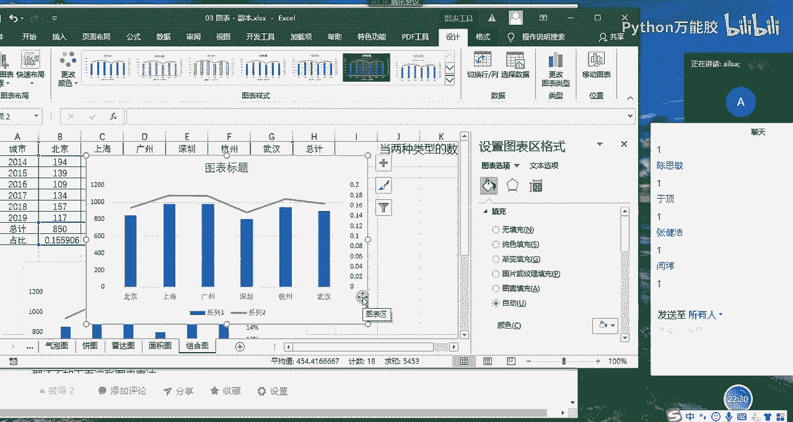

好，在这里做一个总结啊，我们看一下。我们啊这个不是。我们讲了我们图表的所有的内容，我们的图表的结构啊包含什么呢？哎，我们可以看一下哈，图表的结构再回顾一下。

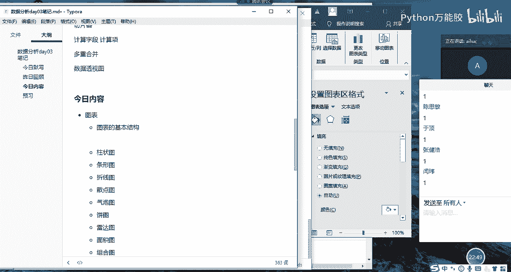

我们图表的结构包括标题坐标轴，对吧？还有我们的绘图区啊，以及我们的系列值啊，绘图区图例啊，数据标签啊，那我们的图表包含的就是标题啊绘图区。

啊，以及我们的啊坐标轴啊，这大的方向哈，坐标轴。啊，坐标轴，还有就是我们的啊图例啊数据标签这几个啊，可能你们现在在进行操作的时候还没有遇到什么问题哈。但是有时候啊我跟大家说，有时候你来进行选择的时候。

你比如说你想定位到这个数据标签或什么的时候啊，不是你想定位到这个坐标轴或数据标签什么的时候，有可能你定位不到的时候啊，或者是说你想定位到这里，它非给你偏偏跑到这里的时候，那有的人该说我该怎么办呢？啊。

其实也有方法是在这里哈，大家看格式，哎，点击格式这里啊，有一个。

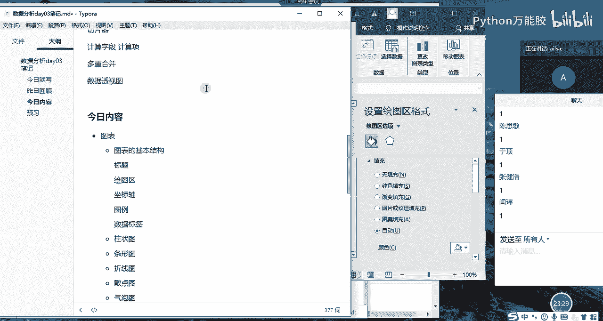

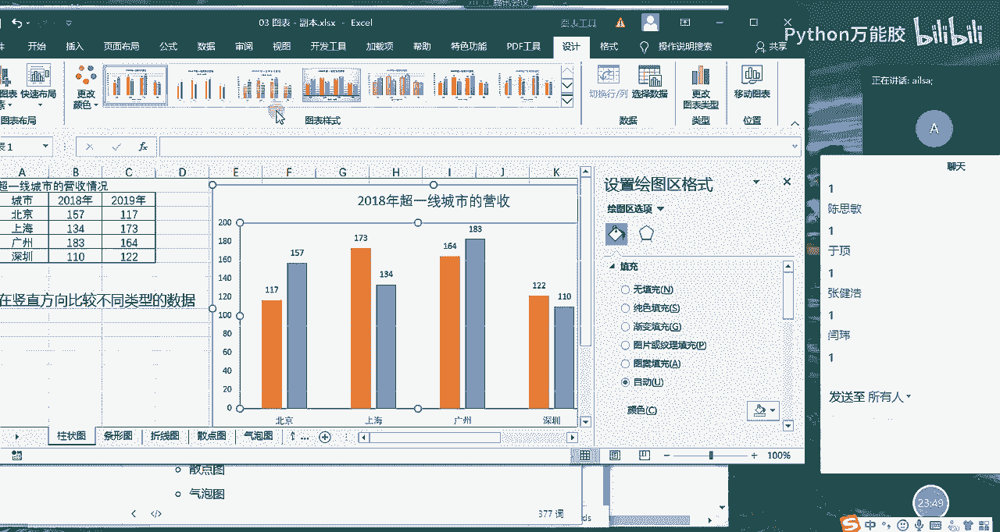

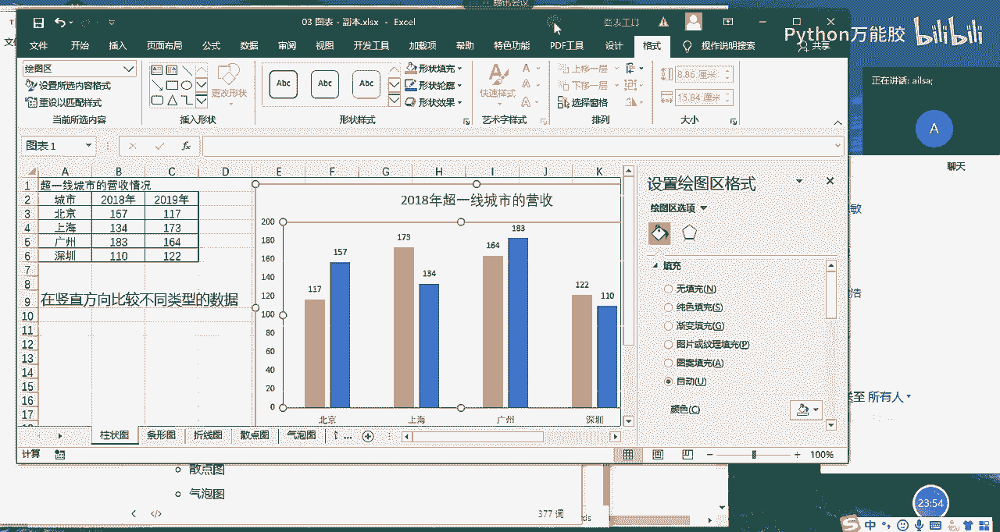

好，有一个这个这个地方，这里面所有的就是我们的区域的选择了，我们可以不用在这里面点点点。比如说我想我想点图表标题，我一点它就定位到我的图表标题了。然后我点击我的图表区，它又定位到整个的一个图表区了。

然后我点击我的呃图例啊，它就会定位到我的图看这里面设置格式都跟着发生变化了啊啊，就在这个位置，我们就可以选择啊我们想要的数据区域，或者是我们的图表区域进行一个相应的设置。好吧。😊，哎。

这是我们的一个区域的啊讲解。那接下来我们还讲了什么？我们还讲了条形图啊，柱状图条形图柱状图呢它是我直接在这想，它是在啊垂直。

垂直方向。方向的一个数据。数据对比对吧？或者是分类对比啊这样的一种作用。然后条形图它是在水平方向的分类对比，常用于啊常用于分类。分类的内容啊比较常识。显示更加美观。啊，这个看个人的一个习惯。

他们都是用来做对比的垂直方向和水平方向。然后折线图是主要用于反应。一段时间内。数啊某个某一个或多个。你。型的数据变化趋势，它主要反反映的是一个趋势，就是折线图。然后散点图。

它主要是反映啊两维啊两类或者是两维。两维。稍等哈两位嗯。两维数据的啊一个相关。关系啊这样的一个展示啊，气泡图它就是反映的是三维了哈，反映三维。三维数据的一个呃。一个内在联系吧，我们不能说是相关关系了。

它只能是内在联系啊，这样的一个东西。然后丙图主要是反映啊部分啊部分与整体。之间的关系，它占比情况。啊，占比情况。OK那雷达图它其实就是反映的是某。某两个或某。多个维度啊，某多个类别啊，在多个维度的对比。

分析。啊，这样子，然后面积图其实也是对于数据啊，通过面积大小来对比分析数据。来对比分析数据数据大小这样的一种方式。组合图的话就是对于。啊，数值。差异比较。大的啊出差异比较大的两种。两种类型啊进行。

的分析展示。啊，这样的一个呃一个成果哈。所以说我们讲这个图表呢大概也就这么多分类，这是基础的图表哈。你在工作当中啊，基本上这些也都够用了。但是嗯但是就是说我们可以自己有兴趣的话，可以再找找其他的图形啊。

就是说比较高大上的工作工作当中不怎么常用，但是可以用来显摆的那种啊图形啊，比如什么旭日图啊什么的啊，反正我是没用过嗯。啊，那个的话就有点像炫机了哈，或者说面试的时候，你跟别人说，哎，我做过什么什么图形。

用来解决什么什么问题哈啊，这样也是可以哈。但是我们前期的话先掌握这么基础的一个图形哈啊，这种图表的话，基本上在工作当中是常用的在面试的时候，它可能会问你啊，动态图表是怎么来实现的啊。

它基本上不会这这些最简单的哈，动态图表的话，我们可以通过函数的那种形式来给它操作数据的变化来达到这这个想要的效果。还有一个就是我们的数据透视图，它不是有下拉的选项嘛？它也可以实现动态的一个效果。

这个动态的效果指的是你那个图表里面的内容可以发生变化啊，就是啊对，添加控件，对，没有问题哈。添加控件来实现你所想要的效果哈。在excel当中添加控件，选择不同的内容展示不同的图表的效果。

这就是属于动态哈。OK那我们图表的内容带大家回顾完了之后啊，我们呃excel部分的内容就已经讲完了。我再啊说一下我们excel的几大组成哈。啊，回顾一下哈，我们讲了excel。The。啊，知识点。综合。

我们讲了什么呢？我们讲了操作啊，有基础操作和操作技巧啊。我们直接写操作，然后操作主要是对于我们进行数据啊清洗处理等等这些来实现的那第二个的话，我们讲了公式与函数。公式与函数的话，它一部分是用来计算的。

你比如说统计函数，它就是用来计算的。嗯，那你还比如说我们的文本函数，它可能就是用来还是用来对数据进行一个清洗啊处理啊，还有我们的日期函数，它是不是用来规范的啊，规范数据的这样的一个呃效果啊。

这是我们的公式与函数。那我们讲了数据透视。数据透视的话，它主要是快速啊对数据进行啊分类汇总，也是类似于计算哈，也是类似于计算。因为我们不用数据透视。我们用函数也能够达到我们所想要的效果啊。

这是我们数据透视。那最后一个就是我们的图表，图表的话就是数据可视化。也就是说在前面这些步骤操作完了之后，你如果想对数据进行一个呈现给别人表达一些你个人的观点的时候，你就可以需要对数据进行一个可视化。

这四部分组成了我们excel的四大模块啊的知识，它每一个都是一个大的模块哈，里面有很多内容，我们主要讲的是最主要的那个内容啊，那到这里为止，excel部分内容就讲完了。讲完了之后嗯。

那接下来相对对于大家大家的要求，就是说那现在我给到你任何一个excel的数据或者文件。然后我告诉你我想要实现什么样的一个效果。我想要数据怎么去呈现的时候，其实你已经完全可以给我实现了啊。

因为你前面的东西已经都学完了啊，那为了检验大家是否能够实现这样的一个效果啊，我们这边接下来需要结合一个案例，然后我先带着大家去实现一遍哈啊呃然后我们再去看一下呃，但但在实现这个步骤之前。

我要先给大家讲一下在实际的工作当中，我们是如何进行数据分析的啊，学完了这个之后，我们再进行呃那个实操的练习。好吧，嗯，那我先断一下。

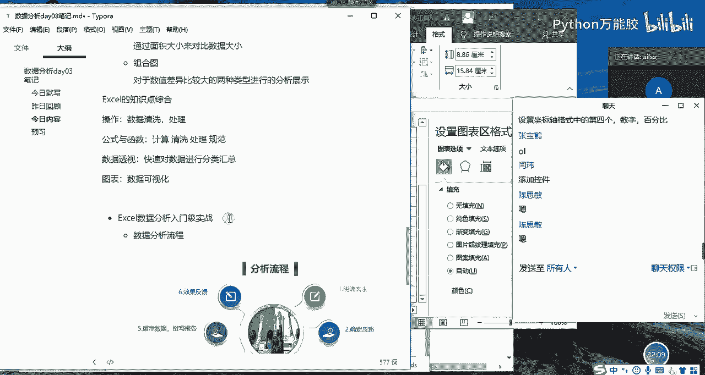