# 【python数据分析精华版来了（附文档代码）】10小时学会Python数据分析、挖掘、清洗、可视化从入门到项目实战（完整版）学会可做项目 - P24：06 公式与函数作业1 - Python万能胶 - BV1YAUuYkEAH

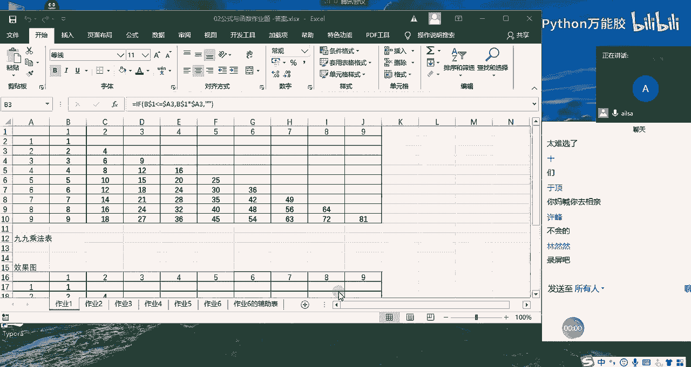

O。我们先看第一道题，那第一道题，它考察的是我们之前讲公式与函数的时候讲到的引用的啊一个操作。我们看九9乘法表，相信我们在嗯小学小学二年级的，把一年级二年级的时候已经是啊要需要每一个都背下来哈。

我还记得当时老师提问我被乘法口诀的时候啊，我还被给弄哭了哈，因为我不会啊，我觉得太难了，真的我背到二二得四二三得六之后，后面就不会了啊，那太难了啊，对，然后现在想想。

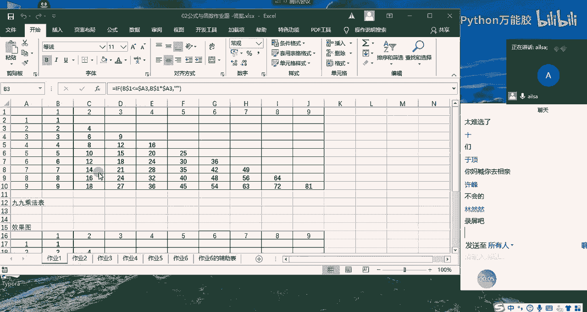

啊，现在想想还是觉得说自己能力有了一个很大的提升的。因为现在哎会背了是吧？哎，这就是自己在不断的进步吧啊。

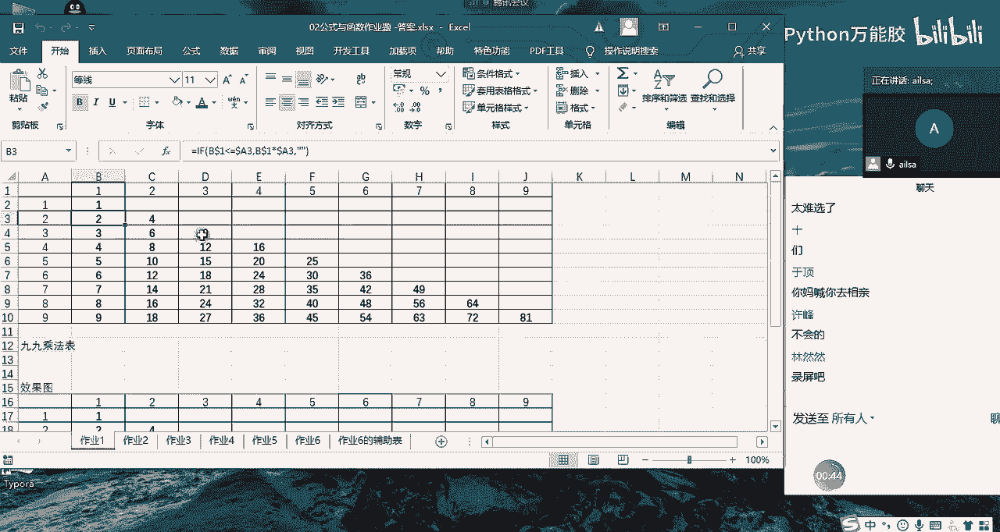

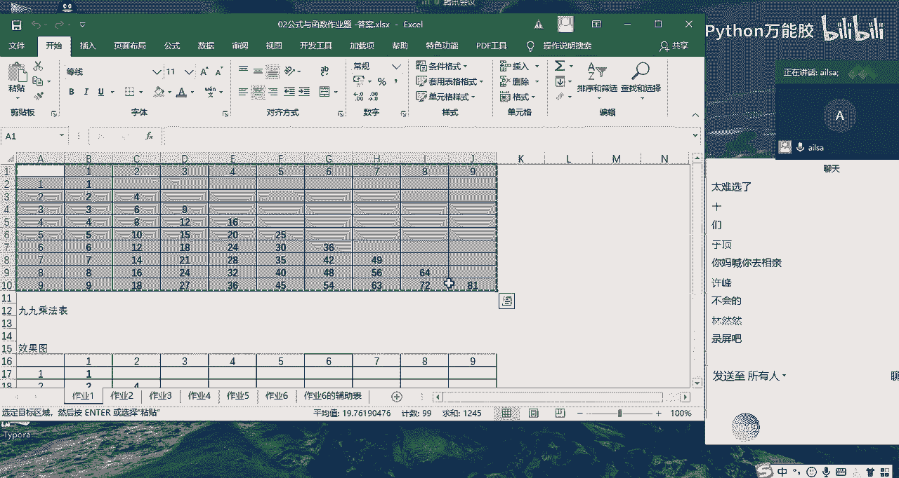

哎，OK啊，然后我们看一下这道题该怎么去做哈。哎，首先的话我们想一下乘乘法口诀就是我的呃这个列方向上的这个一一得一一二得二一三得三对吧？二二得四二三得六哎，这样的一个方式，那我在这里面需要输入的啊。

我先一步一步来操作。那对于这种比较复杂的混合引用的话，我们都是一步一步来操作的。首先我先在列方向上乘以哎我的行方向，然后我需要往下拖动，我们都知道我在往下拖动的过程当中，我这个一我是不希望它发生变化的。

所以我们在这个B30要加上绝对引经的乐，对吧？哎，我按N之键，然后我往下拖动，哎，往下拖动，我们就得到了我们一乘以123456789这样的一个结果。那这个时候我在往右拖动的过程当中。

它可能会出现什么问题呢？因为我们往右。

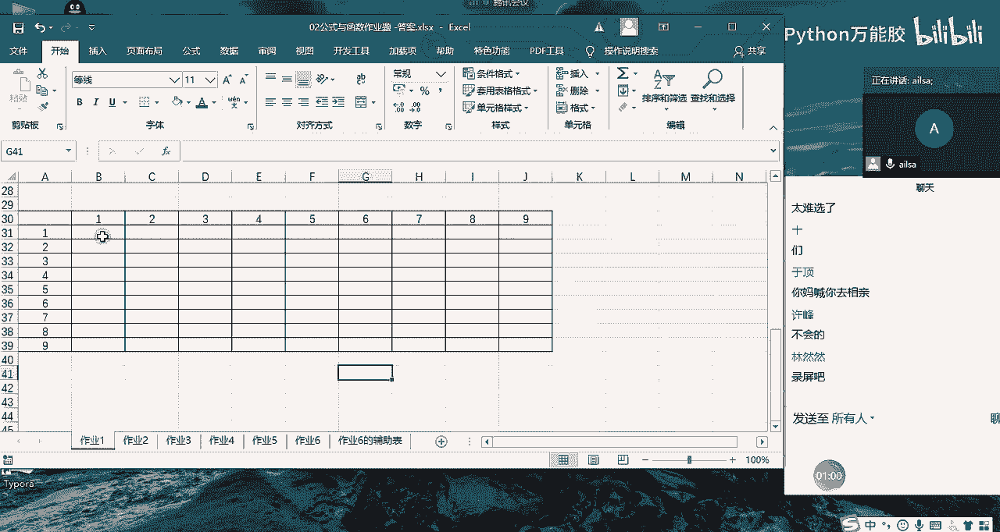

拖动是希望它的这个数字跟着随之发生变化的。所以说我们在加绝对引用的时候，这个的列方向我们是希望它发生变化，变成C列，对不对？所以我们需要把这个do勒符去掉。去掉之后，我们又在想。

那对于这个呃123456789啊，这个这个行方向上，我们该怎么去要求它变化呢？那我们在往右拖动的过程当中，其实我们是不希望它的列发生变化，但是往下拖动，我们希望它的行发生变化。

所以说我们把它的行方向上啊啊，把它的列方向上加上一个do不让它变，对吧？不让它变，然后按按键，这样我们就实现了我们所想要的效果，我们拖动，哎，往下拖动，这就是我们的一个乘法口诀表。但是一般情况下。

我们看看我写的对不对，应该是对的哈。123O一般情况下，我们都是要一个一个半圆就可以了。我们不会要上面这一部分，那我们该怎么去把这部分变成空呢？我们就想到用到了if函数，对吧？那我在前面加一个if函数。

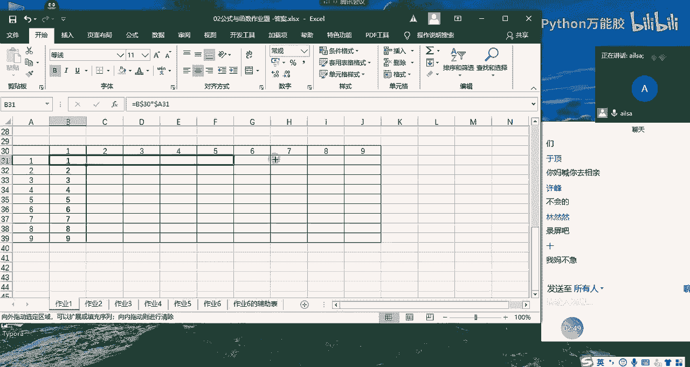

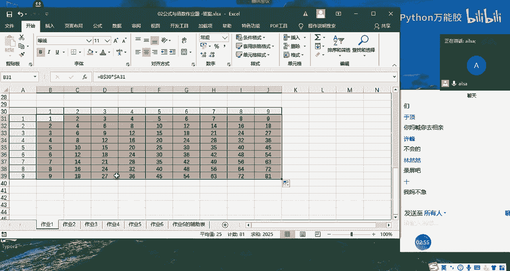

啊，FF函数的条件是什么呢？也就是说我们希望一一得一。然后如果它跟它是相等的啊，或者是说。它的值小于它的时候啊小于等于它的之后啊，大啊，我想想啊它的值嗯小于等于它的时候。啊，二二得四啊。

这个啊小于等于它这方面的时候是可以去显示的对吧？如果说是大于它的话，是不显示的。我看我们表要达清楚啊，这个单元格的值是。小于啊小于等于。这个单元格的指导我们先看一下啊。然后如果说它小于等于它。啊。

它小于等于它它就会出现。如果不是我们就把它设置为空啊，这样的一个结果啊。但是这里呢因为我们要进行一个拖动，所以说我们还需要对它进行一个道勒夫的选择。那这个单元格跟它是一样的。

B30B列就会就是在30前面加上道勒夫，也就是我们不希望它在行方向发生变化。那这个A31呢，我们是不希望它在列方上列方向发生变化。我们看一下是不是我们所想要的效果。

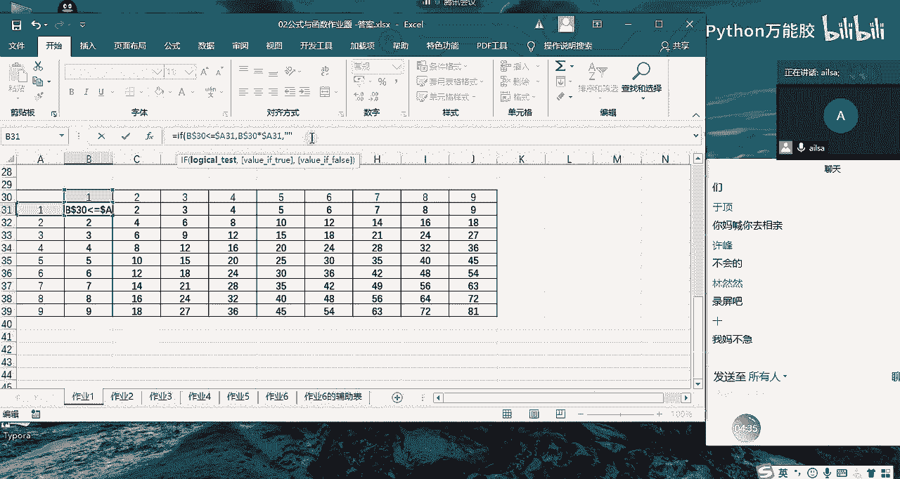

哦。

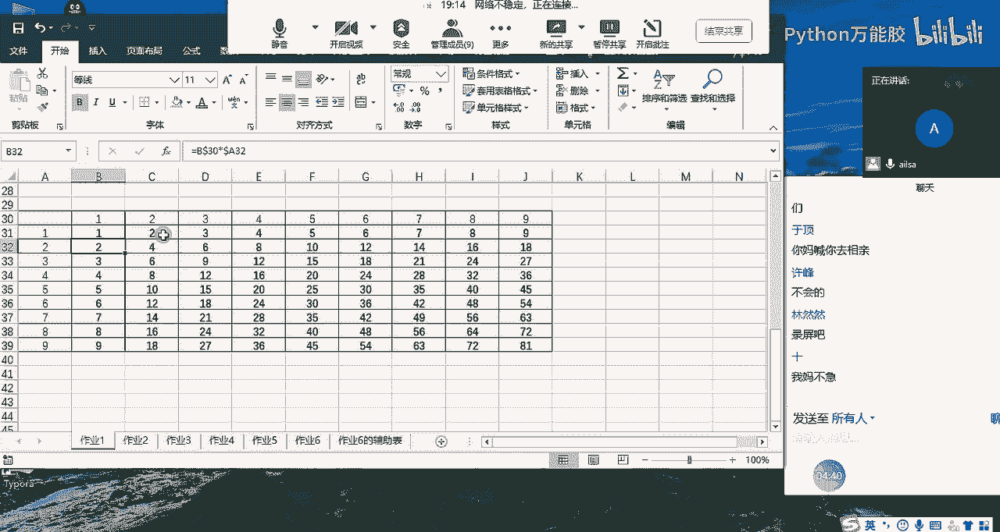

啊，大家现在能听到我的声音吗？Hello。阿老同学们，如果能听到我的声音过我扣个一。

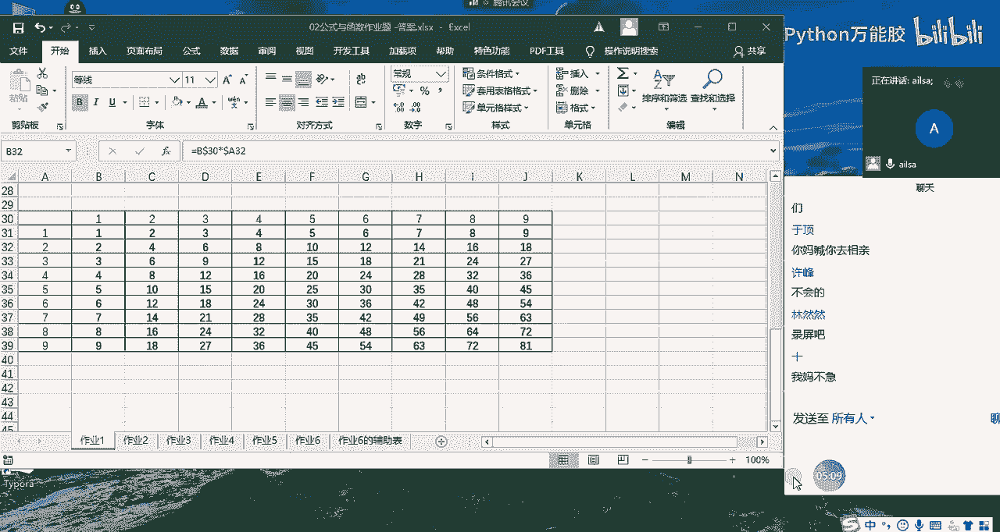

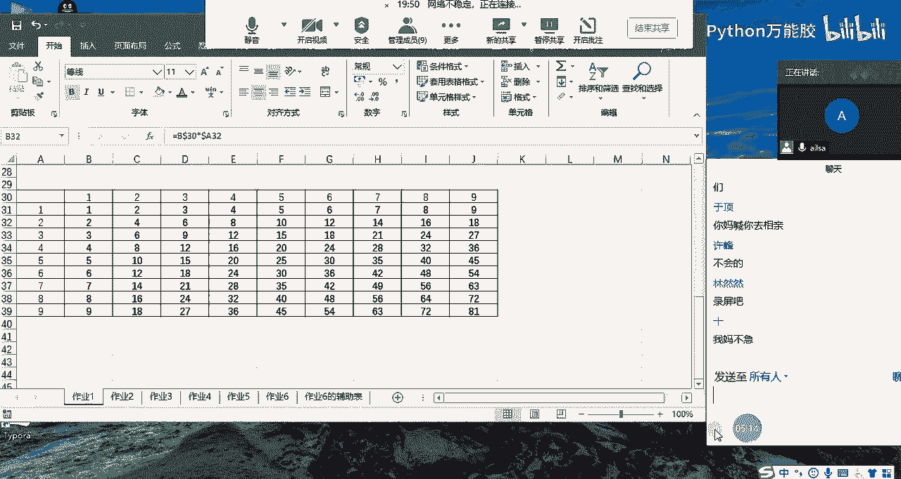

唉。我的妈呀。

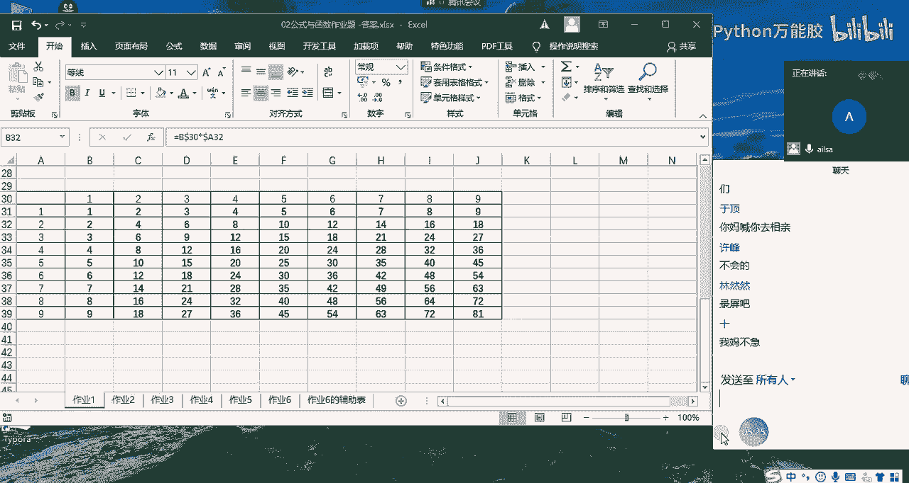