# 【python数据分析精华版来了（附文档代码）】10小时学会Python数据分析、挖掘、清洗、可视化从入门到项目实战（完整版）学会可做项目 - P27：09图表作业 - Python万能胶 - BV1YAUuYkEAH

嗯，啊，下面呢我们看一下啊图表的作业题。然后我们先看第一题啊，第一题呢是展示不同类型的销售额对比。这里面的类型写错了，应该是类别哈啊，不同类别的销售额对比情况。那我们要使用的是先对它进行一个分类汇总。

也就是说我们先使用数据透视表啊，对它对不同的一个类别进行一个汇总，我们把类别拖到我们的行方向，然后再把我们的销售额拖到我们的啊值方向。然后在这里面呈现了之后，我们再进行一个数据透视图的一个创建。

然后我们点击确定啊，这个时候其实就已经做完了啊，特别简单。然后我们加上我们的数据标签哎就可以了。这就是我们不同类别的，它整个的一个销售额的对比情况就已经做完了。哎，我们看是不是也比较简单。O。

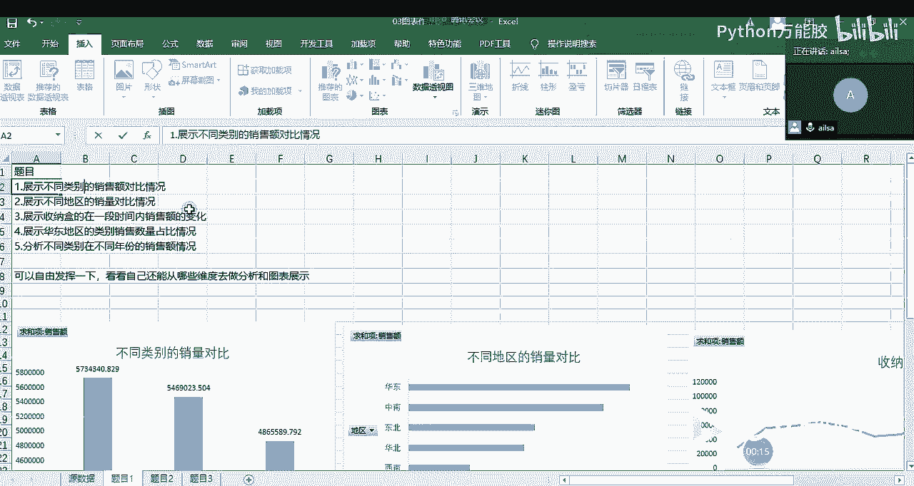

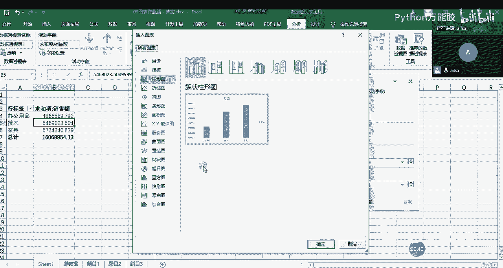

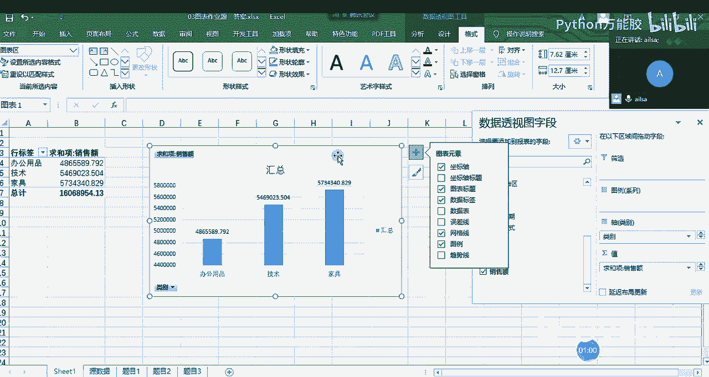

那我接着演示下面的啊题。下面的题的话，第二个是展示不同地区的销量对比啊，其实这个也比较简单哈。不同地区我们把类别去掉，然后我们找到地区啊有这样的一个分类，然后把它拖到行方向，它要展示的是销量对不对？

那我们把销售额拖出来，然后再把我们的数量拖进来，这个时候就是不同数量的一个对比了。然后我们再加上我们的图啊，就可以了。我们可以是柱状图，也可以是条形啊，折线图啊，还可以是条形图啊，折线图不合适啊，啊。

条形图啊，这样的一个结果啊，就可以了。那如果说你这样看不不是特别好看，我们可以先对它进行一个排序啊，进行一个啊降序吧啊，按照数量进行一个降序排列，这个时候我们再对它进行一个图表的创建，大家看到没有？

它就会按照一定的顺序啊去排序了。这样的话看起来会更美观一些。哎，这个数据还真的像楼梯一样哈，还真的啊一节一节的往上提升啊。

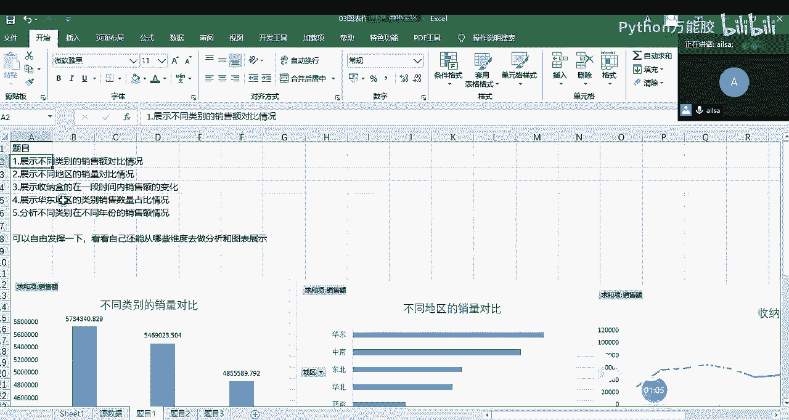

这样的。看，这样的一个效果，这就是我们的不同地区它的一个销量的对比情况。啊，那我们再看第三道题，它是展示收纳盒，在一段时间内销售额的变化。那这道题呢我们有两种做法。第一种做法。

我们把收纳盒的数据复制出来。然后再再展示它在不同时间内的一个啊销售额的变化。第二个呢是你用数据透视表做出来，然后做筛选。那我演示第二种哈，用数据透视表去做。那首先我们要知道收纳盒属于什么？收纳盒的话。

它应该是属于啊属于类别类的还是子类别类，OK不是类别类哈，要该是子子类别类子类别类哈，就是我们的收纳盒。哎，在这里那我们就先把它拉出来啊。

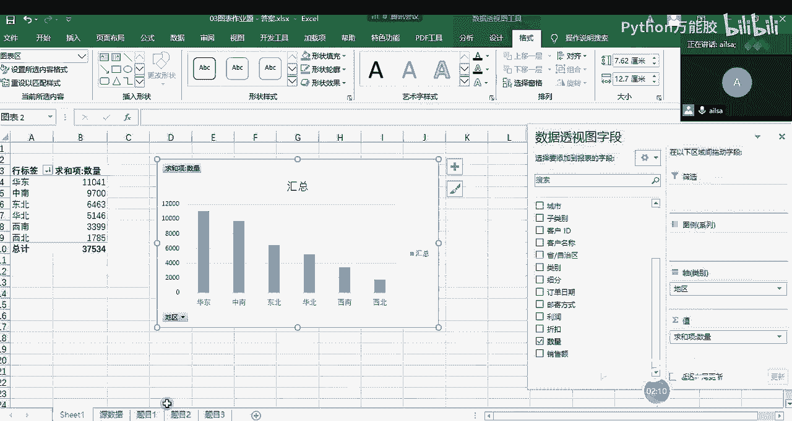

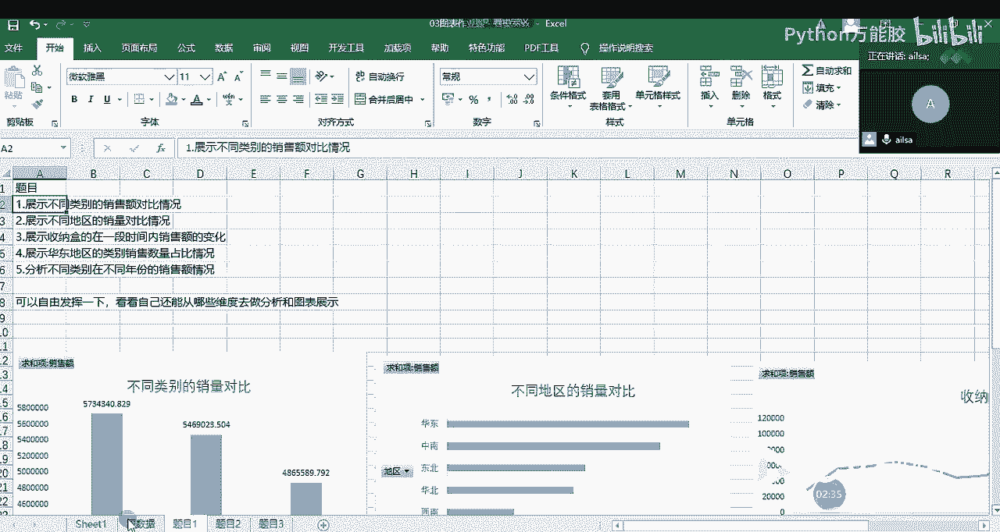

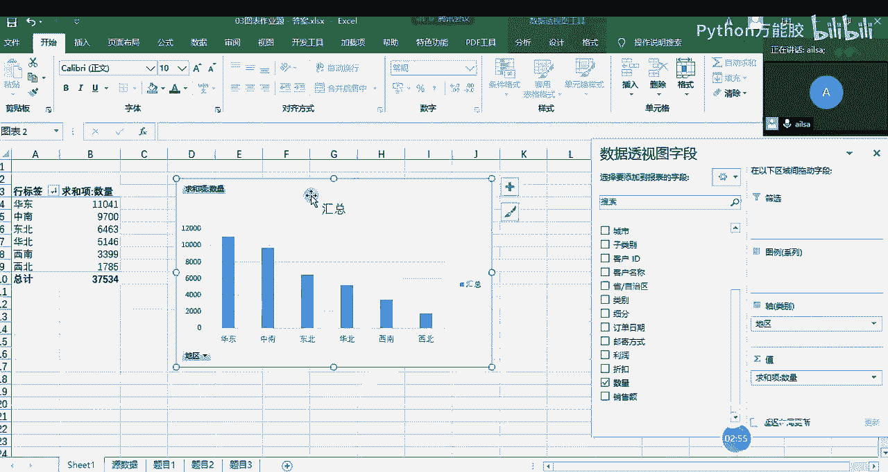

嗯，他求的是什么？啊，销售额的变化，所以说我们需要把销量先去掉，然后地区也去掉，然后是我们的子类别先拖到行方向啊，子类别拖到列方向。因为我们还有一个在一段时间内的变化，我们把订单日期拖到行方向。哎啊。

这个时候就可以了。然后我们再把我们的销售额拖到我们的值方向，它是不是显示了所有的子类别啊，那在这里是可以筛选的。我们点击这个筛选，选择哎选择我们的啊收纳盒点击确定。

这个时候只显示了收纳盒在时间啊一段一段时间内的一个数据，我们可以把它精确到季度啊，点开就可以了。因为点开之后，我们等会儿做图表的时候，它就会出现，我们点击分析，然后点击数据透视图。

然后我们点击的是折线图，哎，我们点击确定。

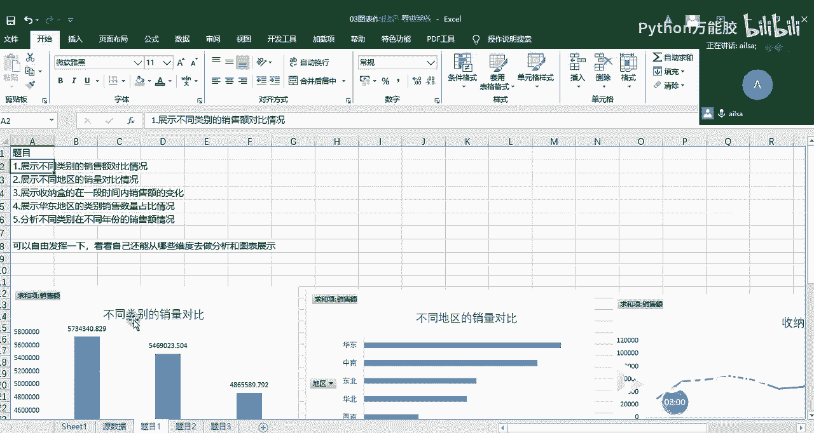

啊，这个时候它就可以反映在一段时间内啊，我们可以看所有的数据哈，就是2016年到2019年，它整个的一个啊收纳盒的一个销售额的变化的趋势。那很明显，它随着时间的变化，它整个都是一呈现一个上升的趋势的。

对不对？啊，那大家对于这个有什么问题没有？

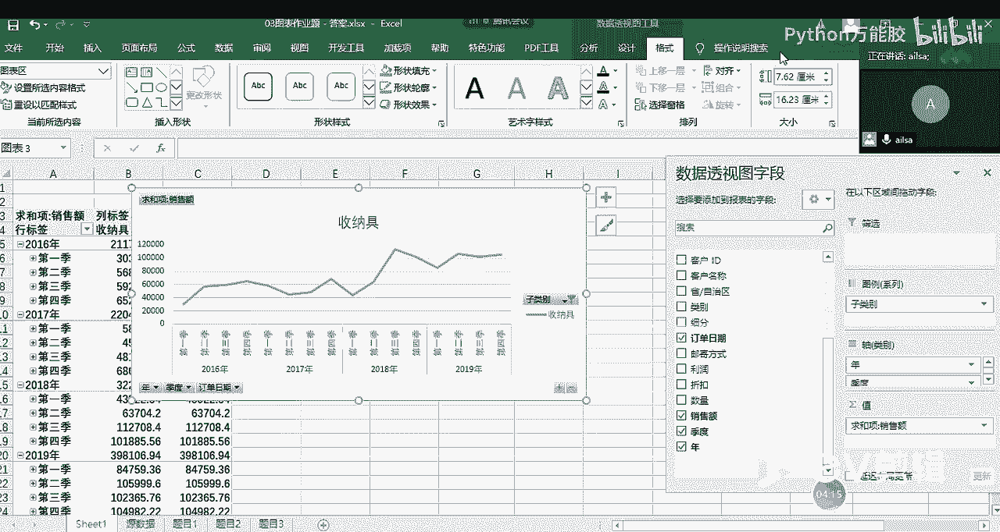

啊，没有什么问题给我扣个一。嗯，呃我这边看到微信群啊，有人说呃这个分类汇总有汇总是吗？你可以去掉就可以了。啊，王刚那个实现了吗？你是想表达你那个呃分类汇总啊，老显示是不是那个是需要去掉一下的。

我给你演示一下哈，我看这是哪道题。OK嗯，我不我就不以这道题为例了哈，我给你演示一下，对于分类汇总了之后，然后他如果说你不想要该怎么去掉哈，我们先把这个需求啊去掉。

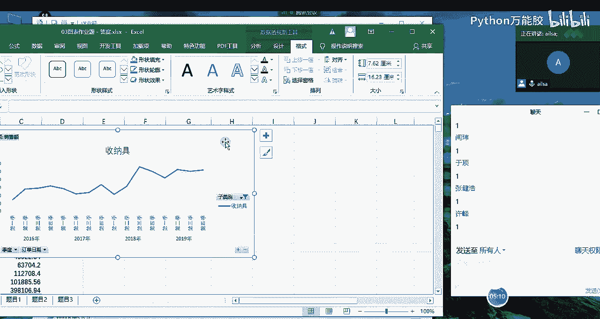

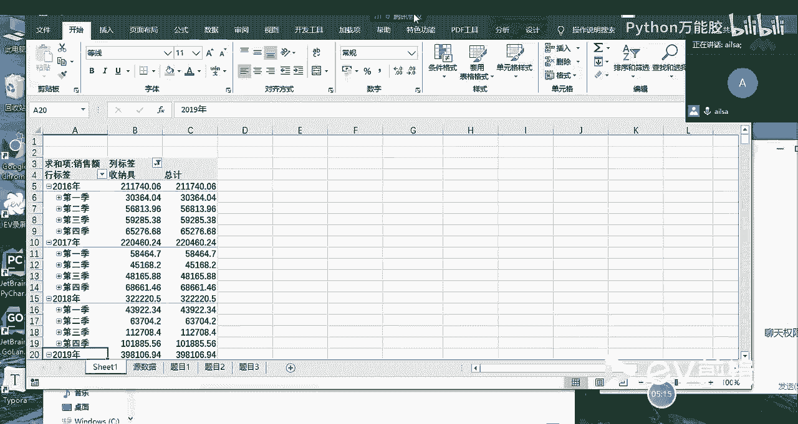

嗯，OK我们把啊把我们的订单日期去掉，销售。都学掉哈，然后。此类别也去掉。然后现在我按啊我按地区啊地区啊，然后对它的一个销售额情况进行一个汇总啊。啊，不对，他这个还是。啊，它是有两层判断。

每一个地区啊每一个地区下面的城市吧啊，城市A。哎，你会看到这里面有很多，对不对？然后他每一个都会有。每一个都会有啊没有分配的话，设计一下啊。在组组的底部显示分类汇总，你看这里面是不是有分类汇总啊。

然后你如果不想显示的话，你直接啊分类汇总不显示分类汇总，它就出来了这样的一个结果啊，直接在这里面设置就可以了。显示的话，你告诉他是在底部还是顶部，如果不显示的话，直接在这里面设置就可以了啊。

王刚明白了吗？啊，如果明白给我扣个一。

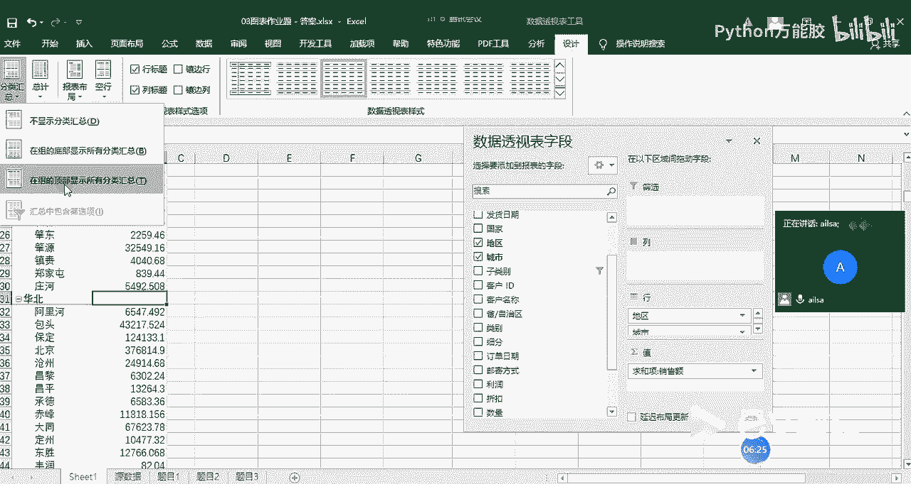

王刚同学。Hello。啊。不不需要一样哈不需要一样，你那个差哪呢？我看一下。啊，你说值吗？是。财务二期。不需要一样哈，这个完全不需要一样啊，这个没有那么死白哈。啊，一定要记得这个东西不要学死了哈。

千万不要学死了，你不要以为我的就是标准答案，没有啊啊，没有标准答案啊。哦。是这个没有标准答案的。这个你想按照你也想按照你自己的一个效果就可以了。嗯。哼我们可以在这进行一个调整什么的都可以哈。

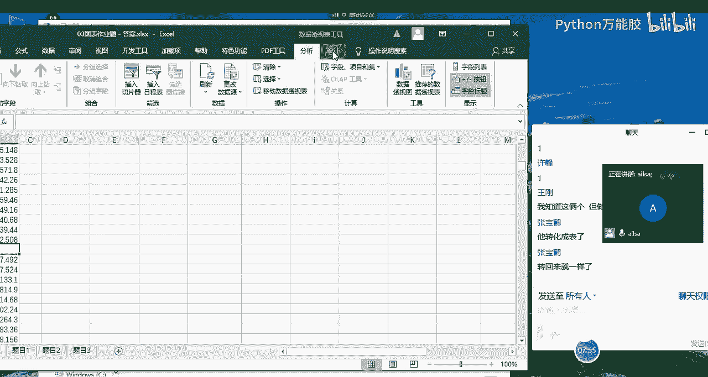

就就这几种这几个都是进行调整的。你想调整成什么样都可以哈。

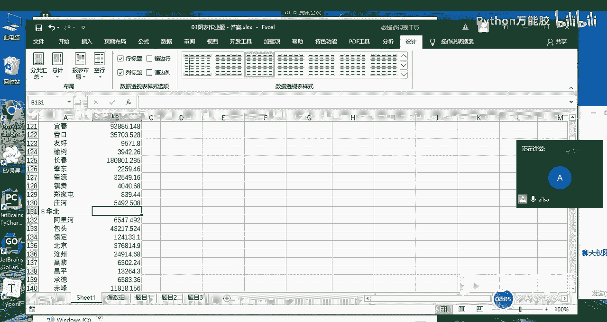

啊，你可以试一下。O好，那我们往下讲题目2哈。

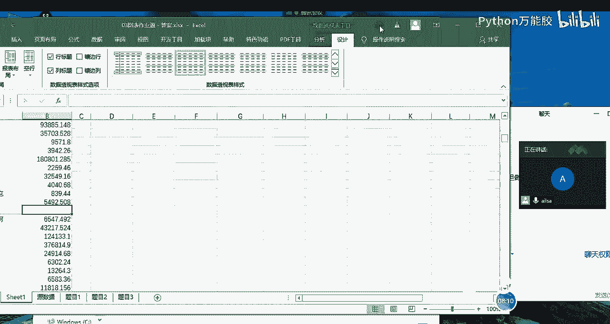

题目一讲完了吗？啊，还没有哈。OK最后一个。啊，华东地区啊，还有个第四题哈，华东地区啊类别的销售数量占比情况。华东地区啊，首先你可以把华东地区的数据筛选出来，然后进行一个销量的一个占比的计算。

你也可以直接用数据透视表，然后给它全部都显示出来，然后呢再进行一个筛选啊，啊就跟刚才我那样操作的似的啊，我就不演示了哈。这个这个没必要再显示了。啊，再演示一下吧。华东地区啊，我们再看一下题目哈。

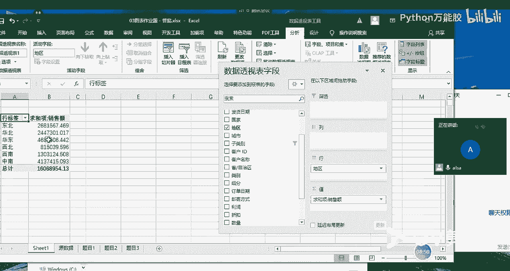

华东地区类别销售数量的占比。那就是我们先把地区筛选出来，然后再把类别啊类别。

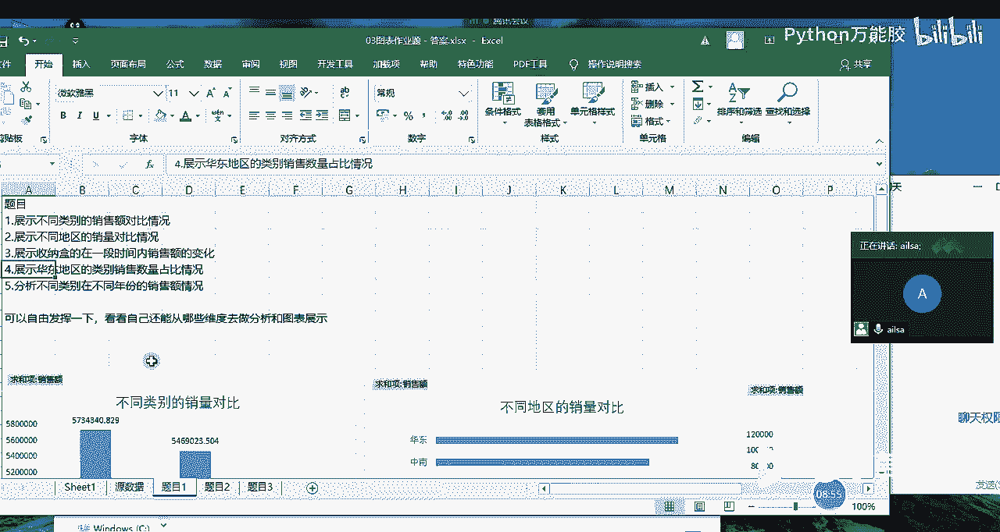

啊，类别放到这里哈啊，地区放到列方向啊，这个时候我们就可以给大进行一个筛选了，筛选为我们的华北地区啊，华北地区，然后点击确定，这就是华北地区，它不同类别的一个销量，我们把数量拖进来，就是一个销量情况。

然后我给大家建一个嗯我给大家建一个数据图。然后我们选择并图就可以了。那在这里的话，它就是每这三个类别的一个占比情况就出来了。这就是我们的第四题哈。啊，第四题，那第五题的话是分析不同类别。

在不同年份的啊销售额情况。我们看一下。

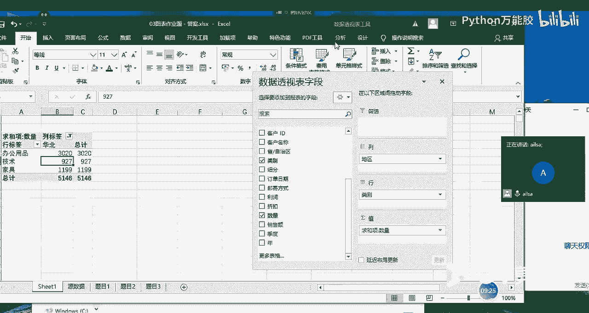

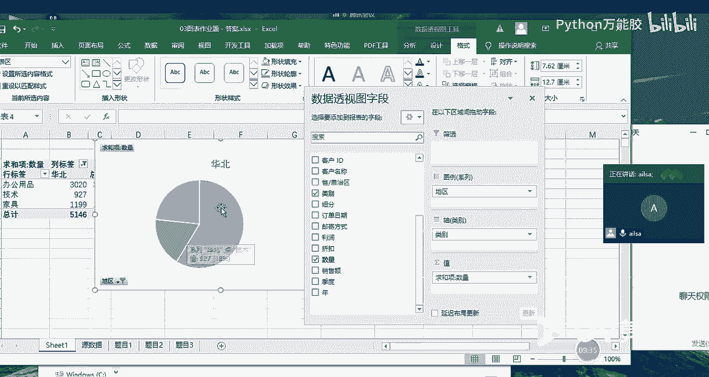

呃，不同类别在不同年份啊，那我们它的就是有一个呃呃维度是类别，一个维度是年份。那我们可以这么来操作哈。我们一般情况下是把年份放在我们的呃我们的行方向，这样的话它就可以在水平轴去显示了。

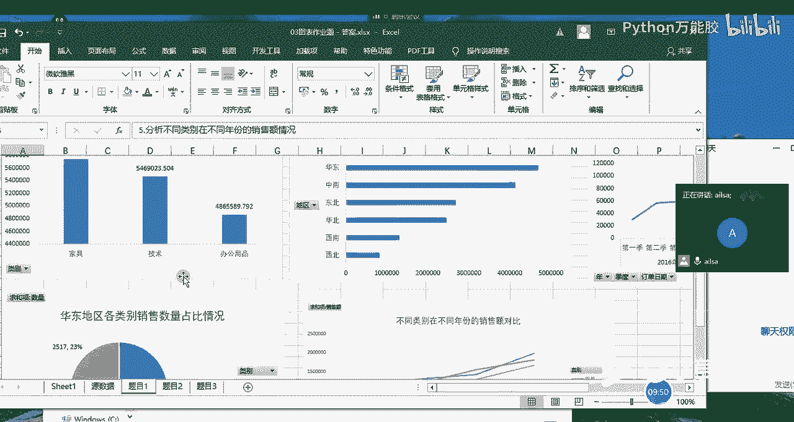

我们把我们把嗯。啊，订单日期哈订单日期放到我们的行方向，然后把我们的类别啊类别放到列方向。哎，然后我们可以显示到季度啊，我们可以点一下。想到季度，它这个只能一个个去点，我也没有想到快捷的方式。

然后这个时候我再创建我的数据透视图啊，然后创建我们的走势图哈，哎折线图哎这样。

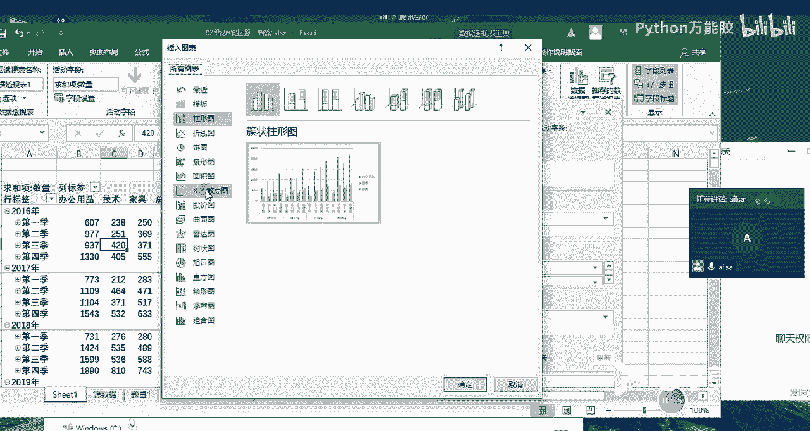

点击确定它就会出来啊，每啊每一种类别在这段时间内它的一个变化走势。我们也可以看到它虽然中间会有波动，但它整体是呈上涨趋势的啊，是这样的一个啊分析的结果啊。

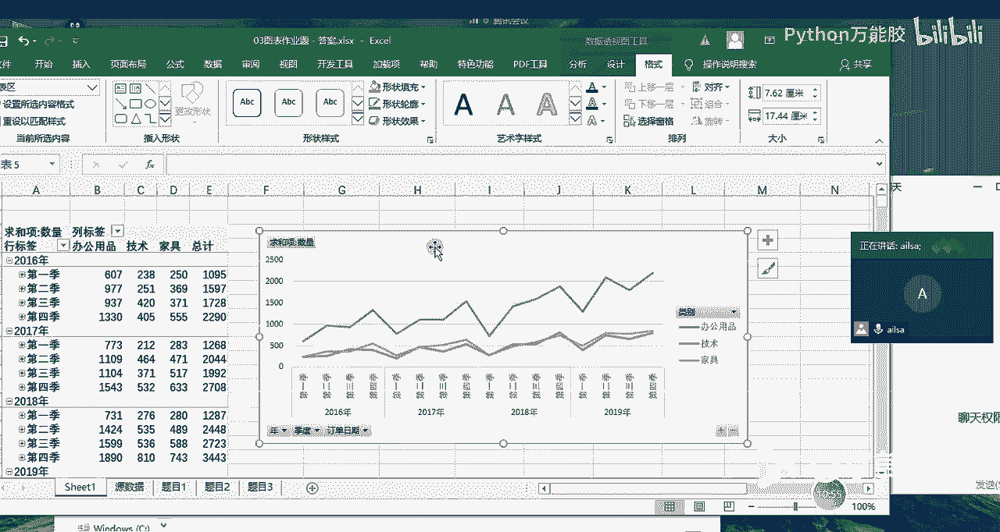

好，那大家对于题目一啊有什么问题没有？嗯，有什么问题没有？没有问题，给我扣个一，我们就接着讲题目二和题目3。好的好的。

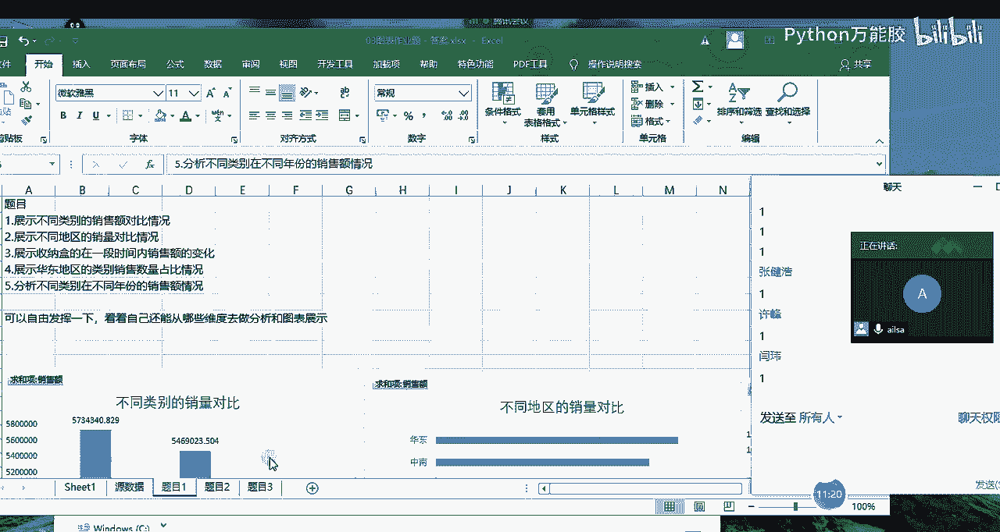

OK那呃题目二其实没必要讲了哈。题目二是我们的一个雷达图，他分析每一个用户他在不同的维度，他的一个整个的能力值啊，那离中心越远，代表他这个呃值越好，也就它能力越强啊，这样的一个效果，这个就特别简单啊。

我们就选推荐的图表，然后选择我们的雷达图啊，点击确定啊就可以了。就出现我们所想要的效果了。对以这个的话，我一般习惯性把我们的图例啊，图例放到右手边啊，会更好看一些。

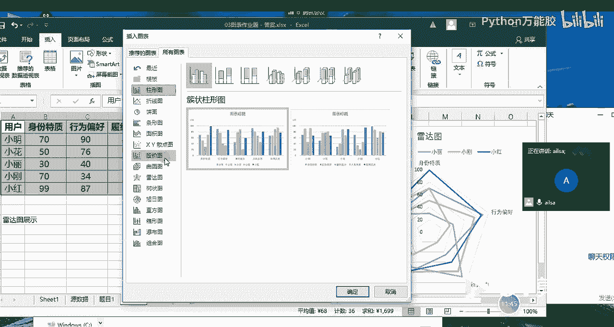

这个就啊简单哈啊，这个不用讲了。然后我们看题目3。

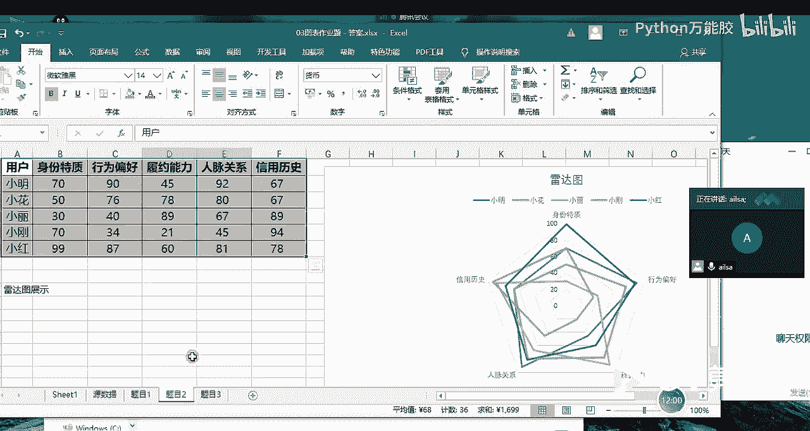

啊，题目三的话，他给了这样一组数据，然后第一道题问的是比较随意的哈。他说你针对这样的数据提炼能提炼出什么哈，没必要说大家一上来就很容易就发现问题啊。当然了，大家也不可能这样，我们就可以简单的去提炼啥呢？

它既然是费用的啊，每个月的一个费用的一个情况，那我们何不分析一下，嗯，它整个的一个费用的占比呢？你比如说这一年当中啊，我到年终的时候，我想统计一下我这一年当中花的钱，嗯，就是都花在哪了啊。

这有几种的分类，哎，我们可以通过这样的一个形式，然后去给他啊分析一下每个啊每个类型，它这一年当中花的总费用占总体的多少。那我们可以先把它的一个合计计算出来啊，some。啊，s函数啊，相信大家都会了哈。

s函数，然后选择我们的区域。然后。下拉下拉完了之后，我们就可以通过这个合计啊和这个类别哈费用啊，然后我们进行一个呃丙图也好，柱状图也好，我们就可以对他进行一个简单的分析。我们看一下，比如说拿柱状图而言。

我们点击确定啊，这个时候就是我们画出来张图了。那我们可以看出什么问题呢？我们的呃整个的费用的话，大部分还是给到了谁呀，给到了工资，对吧？工资占了很大很大一部分，其次是奖金，说明还是给员工发的。

再一次呢就是我们的租赁费，对吧？我们可以把这个值添加上数据标签，哎，那再者就是我们的租赁费，然后等等这些其他的一些费用。然后我们可以看到工资其实是啊占公司很大一个啊组成部分的。

那就要去啊对于这个情况的话，我们就要去细分。哎，这个工。资到底啊是呃哪些部门他花的比较多，他的成本。既然付出了这么多，他的收入或者他给公司带来的价值有没有达到相应的标准，这样去进行一个人效的分析啊。

我们啊就可以啊针对某一个问题啊深入下去进行一个呃专而精的啊这样的一个分析维度，这只是一个我简单提的一个想法哈。因为现在我们的数据数据只有这么多。如果你有公司的薪资数据的话。

你还可以针对这个问题对工资数据进行一个详细的分析。嗯，那这是第一个，那第二个的话就是要趋势分析，分析每个费用在12月12个月当中的一个变化，有无异常数据，那我们就其实我们如果把他们都放在一起的话。

是稍微啊有点难看哈。我们可以直接啊我们直接可以看总费用哈，总费用试一下啊，我们把这个月份选上，总计选上。然后我们看看总费用会出现什么样的问题。O。我们可以用折线图来代表在某段时间内数据的变化趋势。哎。

我们会发现一个很大的特点，就是在2月份的时候，它的整个的一个总费用是达到最高的，对不对？在11月份也有略微的呃幅度的大幅度的上升。那为什么在2月份的时候，它的整个的费用突然就高了这么多。

你看到4月份就整体就下降了，对吧？整个就下降了啊，这样子那我们就会在猜测会不会在2月份的时候，工资公司集中发年终奖啊，所以说它整个的一个呃工就是费用就高了很多。那年终奖其实属于工工资的一个组成部分。

我们带着这样的一个疑问，然后我们就可以对工资数据进行一个趋势的分析。那我们看一下工资数据在这一年当中。一个变化。这个时候我们点击插入啊，点击我们推荐的图表，还是我们的折线图，然后点击确定。哎。

我们会发现确实。啊。我们会发现，确实在2月份的时候，工资数据达到了最高哈，有史以来最高，对不对？那说明有可能啊你要去核对哈，你要再去调取啊更详细的信息。比如说到底是哪个事业部。

哪个部门或哪些人他的他的费用造成了整体的一个一个一个提高，还是说所有的费用都相比较之前都提高了。如果是所有的费用的话，有可能考虑到是年终奖的问题啊，那你就可以得出来啊，应该是年终奖的问题。

造成了成本的一个提高。那我们从公司的角度去考虑这个年终奖到底发的合不合理啊，就是公司能否承担这样的一个成本啊。

