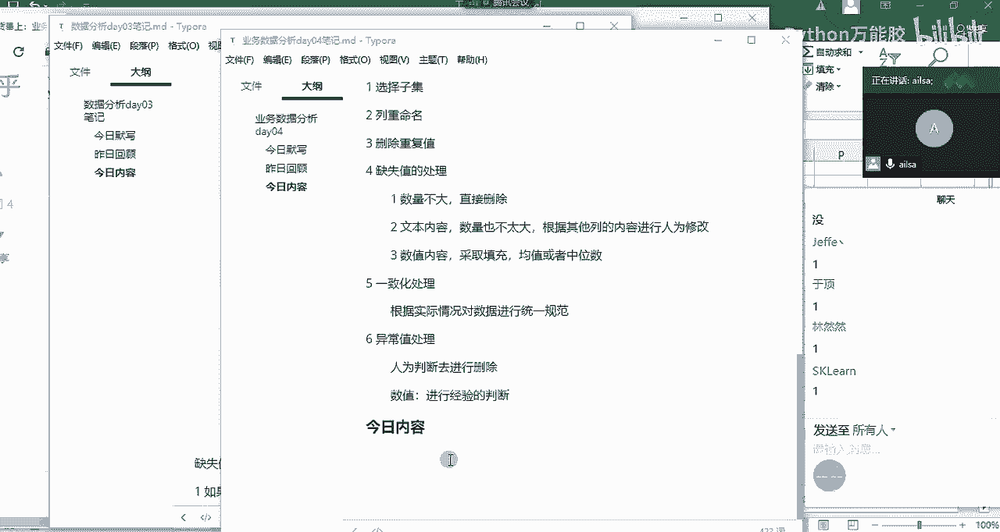
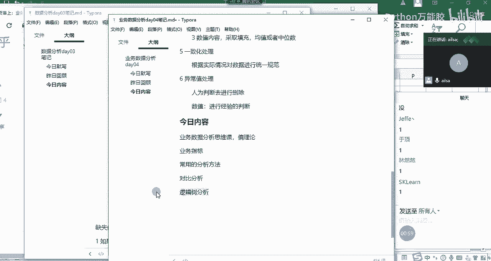
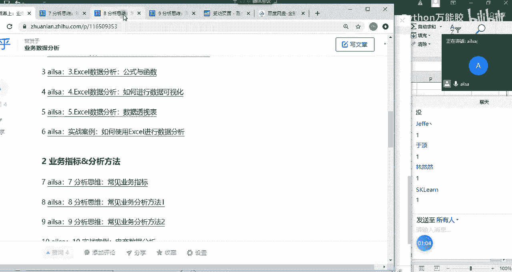
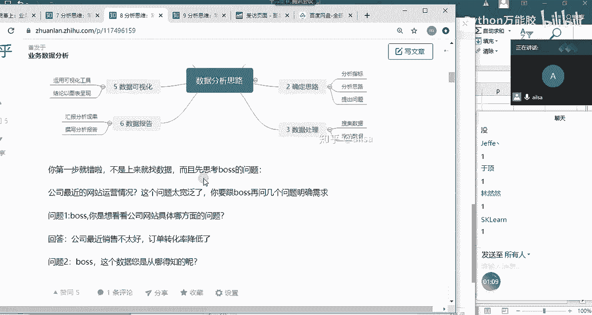
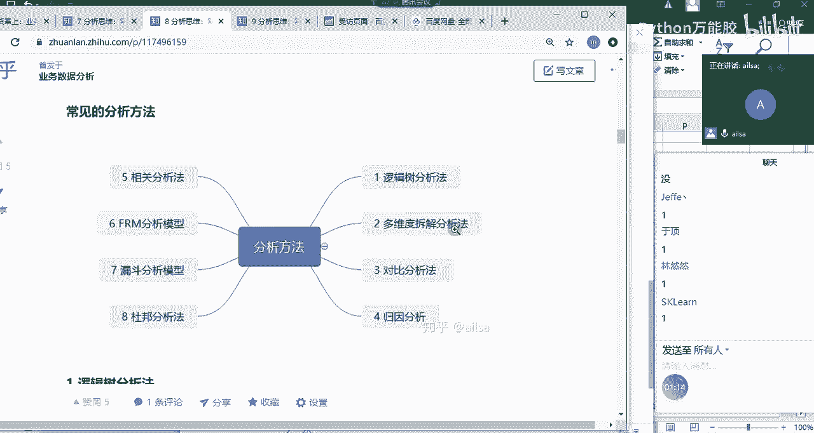
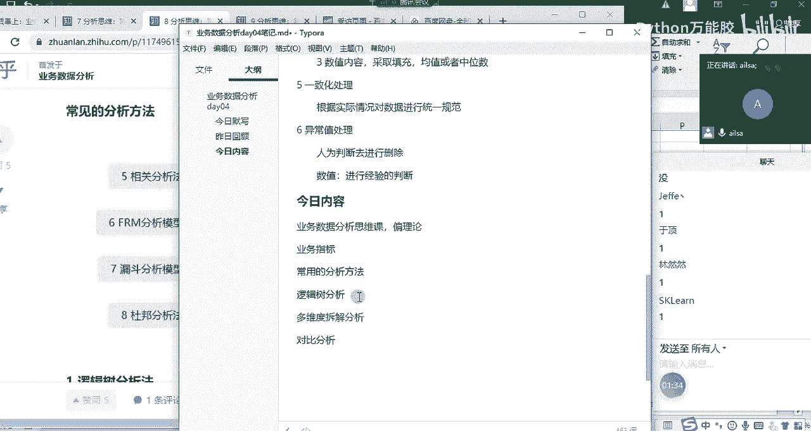
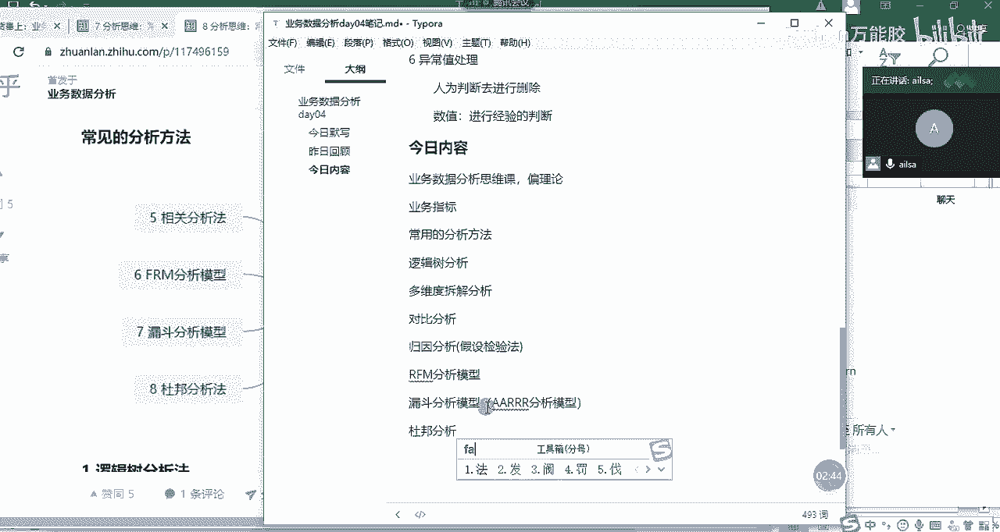
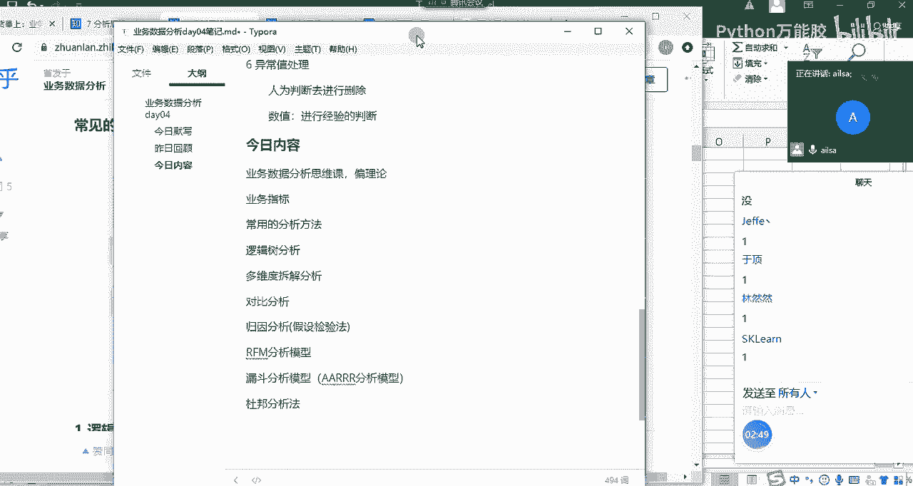
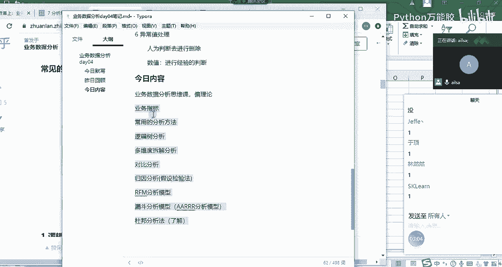
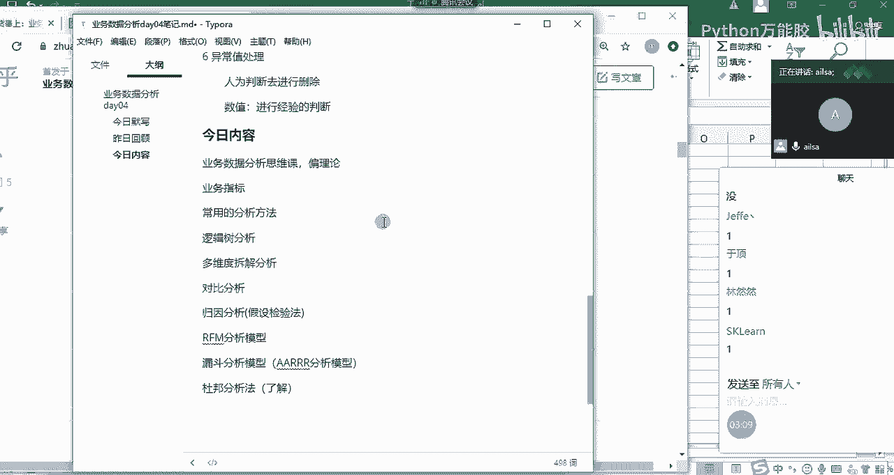

# 【python数据分析精华版来了（附文档代码）】10小时学会Python数据分析、挖掘、清洗、可视化从入门到项目实战（完整版）学会可做项目 - P29：02 今日内容 - Python万能胶 - BV1YAUuYkEAH

我们先看一下今天主要讲什么啊。

啊，今天主要是一个啊。业务和数据分析思维课。业务数据分析思维课，它就是偏理论哈。但是我不会把它讲的特别嗯特别空，特别虚啊，或者特别理论化啊，我会结合我们实际的生活过程当中，哎。

我们的能够接触到的一些东西进行一个综合的讲解。所以我们今天讲的第一个内容叫业务啊指标啊，就是业务指标。哎啊，第二个就是我们的常用的。啊，分析方法。那我们的分析方法大概有哪些？我先跟大家介绍一下。

我们的分析方法有对比分析，这个应该经常用哈。然后还有一个逻辑数啊分析。这个的话其实是锻炼个人的一个思维的哈。逻辑数数分析应该是放在它的前面。

然后我们再看一下啊。

看一下我嗯。这是我们的一个过程。

啊，逻辑数啊，还有一个多维度拆解分析法，多维度拆解。也就是说我们对于一个总体的数据啊给到了我们之后，我们要分析的时候，需要通过不同的维度去拆解去细化到某一个可以进行分析的点啊，多维度拆解分析。

啊，都有拆解分析。那下面就是对比分析，还有一个是归因分析哈。

嗯，归因分析就是我们如何针对某项业务问题去查找原因啊，归因分析我们也可以叫他什么呢？嗯假设检验法就是我们推测我们推测是因为这个呃情况造成的，然后去寻找证据，然后去证明它我们的假设是正确的。

所以叫假设检验。法啊假设检验法。然后后面我会介绍两个模型，一个叫啊RFM啊，我这边写错了哈，是RFM。RFM分析模型。还有一个就是我们的漏斗啊分析模型。

漏斗分析模型里面我们会介绍一下AARRR啊分析模型，这也是一个漏斗哈。但是它是针对整个客户生命周期而言的啊一个东西。然后最后一个会介绍一个财务的杜邦啊，杜邦分析法。但是对于财务这个杜邦分析法呢。

我这边啊几乎是没有接触过，所以说嗯呃需要大家自，我因为我写的已经。

已经足够详细了。所以说这个是了解的内容，大家自己啊看我的写的文章，然后自己去啊了解就可以了。啊，这就是我们今天要讲的内容啊，就是非常的一个学术哈。呃嗯呃可能我得多费一点口舌，然后才能够给大家讲明白哈。

OK那我们断一下啊。

