# 【python数据分析精华版来了（附文档代码）】10小时学会Python数据分析、挖掘、清洗、可视化从入门到项目实战（完整版）学会可做项目 - P39：01 mysql8.0安装 - Python万能胶 - BV1YAUuYkEAH

嗯，好嘞啊，我又忘录屏了。好嘞，同志们，我们接下来是呃演示一下如何安装mysql的8。0。然后我们我再说一下，我我为什么让大家去安装这个东西哈，我们之前学了mysql的呃5。7版本。

那为什么我还要给他给大家讲安装8。0呢？啊，其实是这样的，就是在目前的公司的嗯公司当中用5。7版本的相对还是比较多的。因为呃比较稳定啊，那呃讲8。0的原因。

是因为我们在学习我们的数据分析的过程当中有一个很重要的模块叫开窗函数啊，也叫窗口函数啊，我不知道大家听说过没有啊，有人听说过吗？

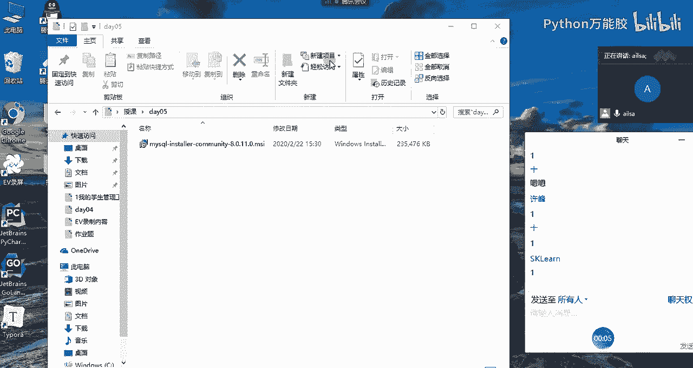

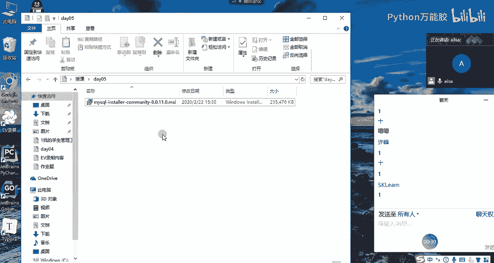

同志们啊，开窗函数或者窗口函数有听说过吗？啊，没有听说过是吧？啊，这个的话就是嗯在其他的比如说circle server啊，它们是有啊是开窗函数的。然后用起来也比较简单和方便。

就是在某些我们在进行联表查询的时候，它用起来是非常方便的那买circle当中呢，它在5。7版本的时候，它是没有的。它只有在8。0以后啊，8。0以后的版本当中才新开了这个功能模块。

那这个功能模块在我们后面就是我我在我的工作当中做数据的分析和调取的时候经常会用到开窗函数。所以说我这边就觉得说啊我应该把这一块的内容给大家新增进去给大家讲进去啊。

而且说嗯就是一方面它在工作当中是经常用的。另外一个方面就是我们在呃面试的过程当中，如果说你面试的是数据分析方向的一个。

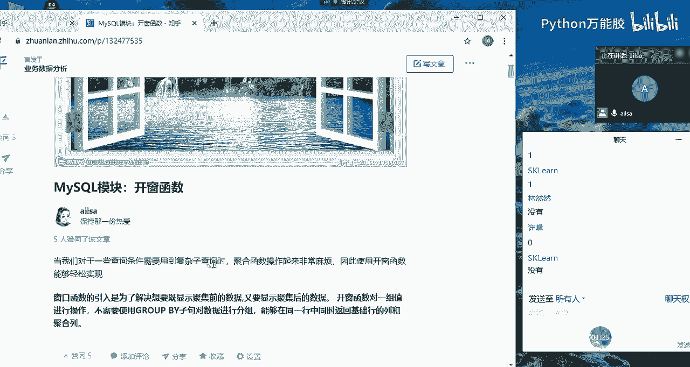

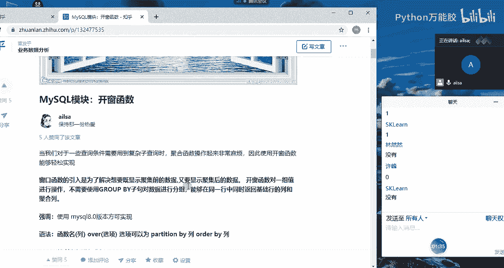

呃。啊呃，一个工作内容的话，他在很大可能上是会考你的开窗函数的啊，他就会问你，哎，你在工作当中有用过开窗函数吗？啊，就是如果用过的话，会考你几道题，而且都比较简单。但是如果你不知道的话。

就就比较不太好了啊，是这个原因哈。我们在明天的时候会讲这个开窗函数。那接下来我就带着大家去安装一下啊，我们首先就是直接双击啊，双击我们这个MSI这样的一个呃形式哈。

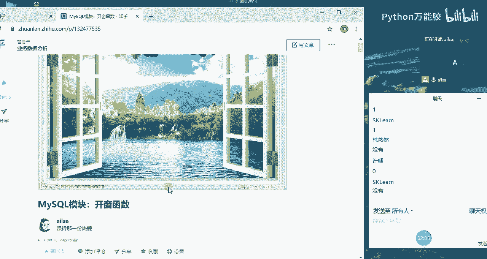

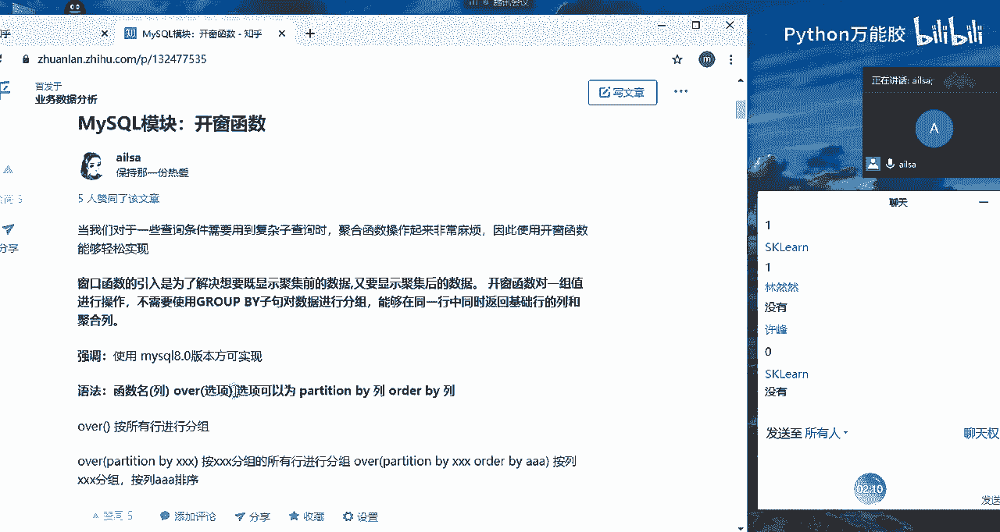

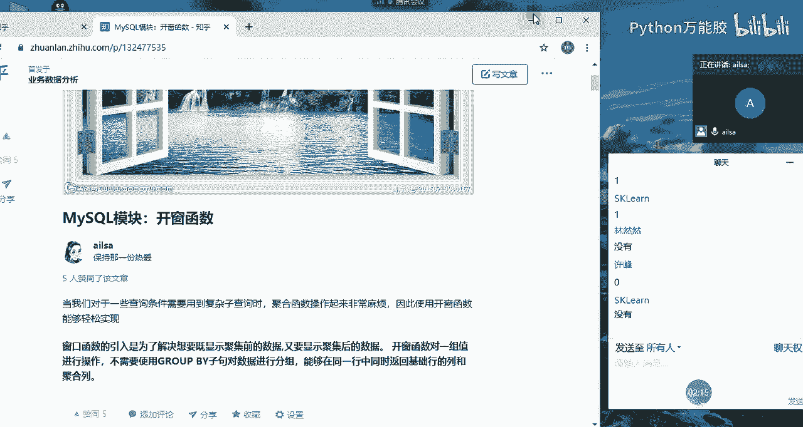

嗯，大家跟着我一起去双击哈，我的电脑的反应速度应该还好。好。我不知道我这边会不会出现什么问题哈，因为我是之前是已经安装好了啊，现在重新卸载的。

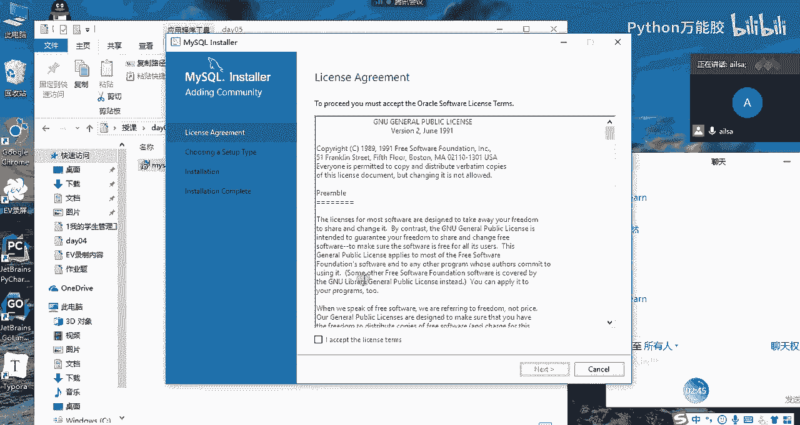

OK大家现在到这个界面了没有？如果到这个界面给我扣个一。嗯，到这个界面了，给我扣个一，我一步一步带着大家去安装。

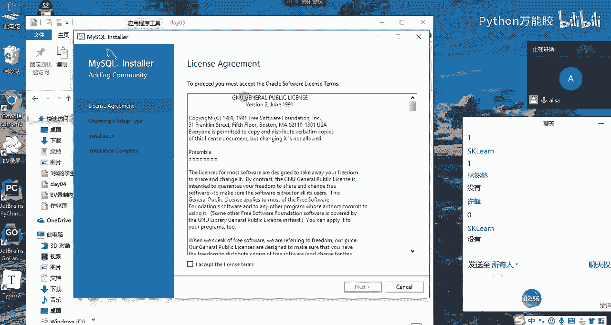

好的啊。嗯，就一个人好了嗯。好，我们稍等一下哈，因为我们今天也没有课哈，所以说我们就慢慢来嗯，好的。呃，思敏不在是吗？在应该在吧。好，石明长，好的。哦，这是64位的。你们那是32位的吗？

应该他只有64位的，现在电脑应该都是64位的吧，还有32的电脑吗？好的。建号你都OK了吗？嗯，ok那我们不等了哈，这个时候我们最开始等于步操作就是啊就是点age啊。

对I accept the alliance terms，也就是我同意啊I agreee，然后点击它next好的，你是不在电脑旁边是吗？啊，行，点击next这一点很重要哈，大家不要着急往下点哈。

这个这个它嗯它这个因为我们用的是MSI，所以它安装的打包的东西会很多啊，我们这边只点击servver only哈，我们只安装my circle啊这样的一个呃呃服务端。好，点只安装my circlel啊。

只安装mysl点击完了之后，我们点next。啊，这个时候我们出现了这个界面的话，呃，它就是告诉我们的我们的产品的话是mysq server8。0。1的版本，然后644位的。然后这是你默认的安装的。呃。

跟我的不一样，哪一点不一样？呃，上一步应该还是一样的吧。这一部还是一样的吧，servver only有吗？

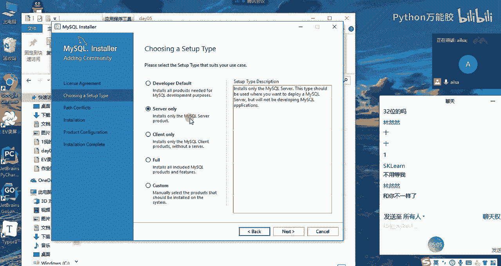

好的，稍等啊看。

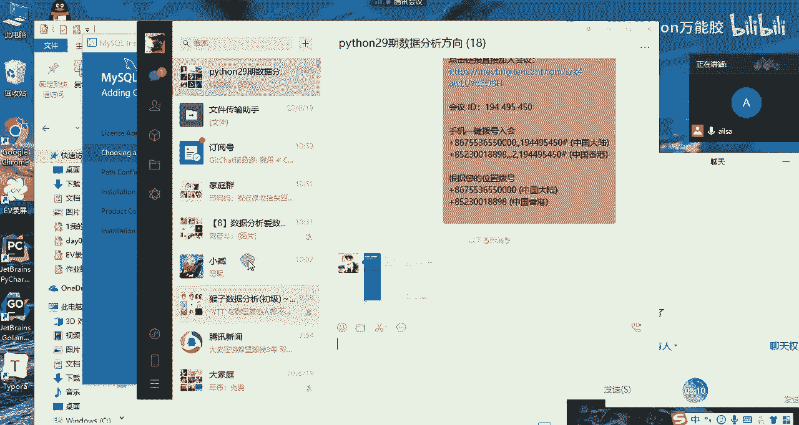

哦，没有关系没有关系。你这之前应该是安装过的感觉。你这跟我呃跟我的那个好像有点像。

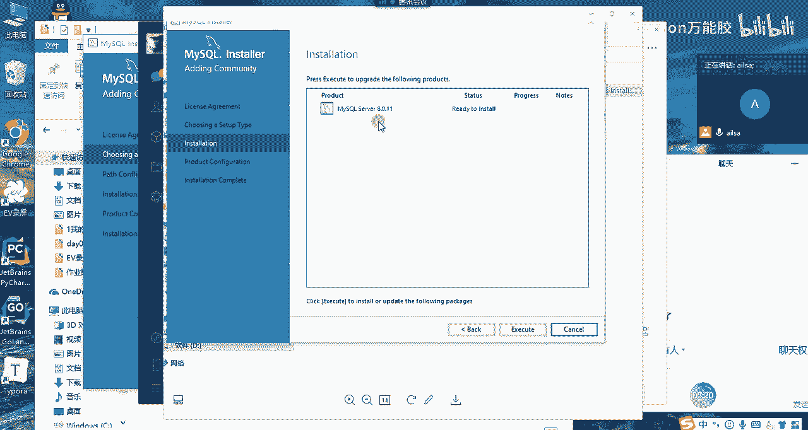

你之前安装过吗？

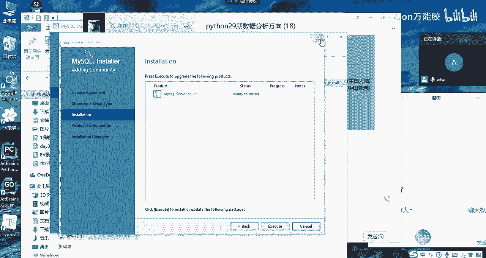

嗯。没有是吗？行，那你先跟着我去走，看它后面会不会出现什么问题。OK呃，没关系啊，然后这个是我们的产品，就mycicle myci server8。0。1，然后这是我们的安装的目录哈。

你们一般情况下默认的就可以哈，默认的就可以。因为它默认就安装在这个下面也可以啊。如果你想选择不同的文件的路径也可以哈。啊，OK那我们往下操作next。

优 should到们 are select past。嗯，应该是我原来的文件当中是有的，我先看一下哈。

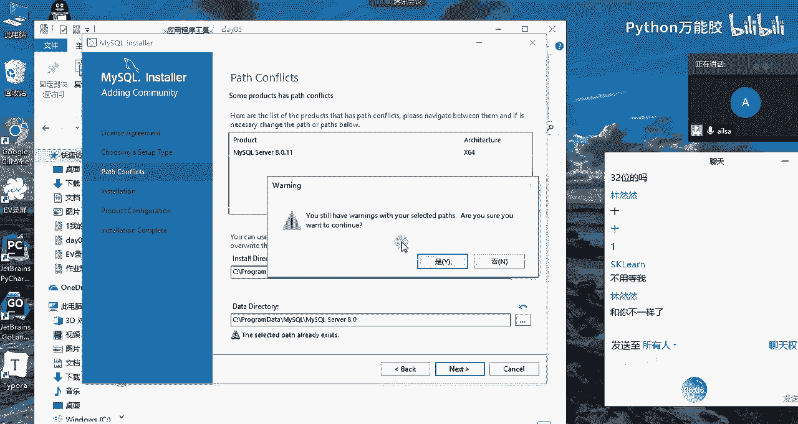

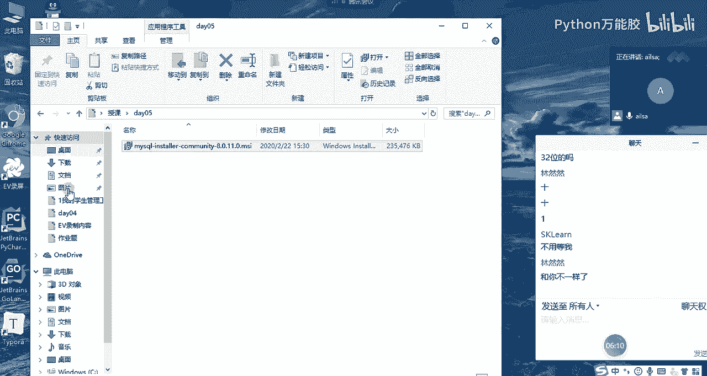

稍等。😔，OK我们直接点next啊，点是。然后大家看到出现这个界面的话，这个就是跟那个呃冉冉的是一样的哈。然后我们再直接点击这个运行就可以了啊，点这个运行。嗯，大家现在等一下哈。OK哦，完成了哈。

完成了，我们再点next。啊，这个时候就是我们的产品啊已经差不多了，我们再点nex。OK啊OK到这个界面了啊，大家看一下哈。😊，到这个界面的话很重要哈，我要等着大家一下。如果说大家到到到这个界面之后。

然后给我扣个一。安装路径。啊，没关系，应该是默认的。就是如果你没有看到，应该就是默认的啊，默认的那个profile，然后什么my circlecle什么的。因为我们有一部安装路径，你那边是跳过的。

不知道怎么回事。OK到这个界面没有？啊，到这个界面我默认选这个哈，默认选这个啊，我还以为这个是要有所更新的啊。OK我们再点击下一步啊，next这个时候到这个界面哈，到这个界面我们需要改点东西哈。😊，嗯。

我们需要啊哦看看啊。哦。而这个界面好像也不用动也不用动。我这边的端口啊，number3308，你们应该是3306。没关系哈，这个他可能会提示啊。端口可能会冲突。我看看啊。TCPOK晚上好。

你们这个port number是多少啊？嗯。

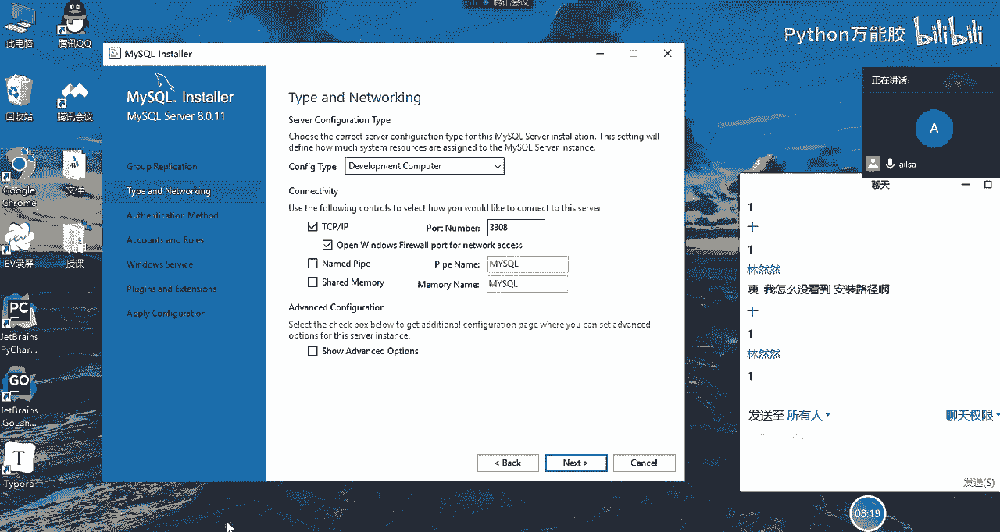

什么。呃，那改成33啊，你们要改一下，因为这个端口跟5。7的冲突了。

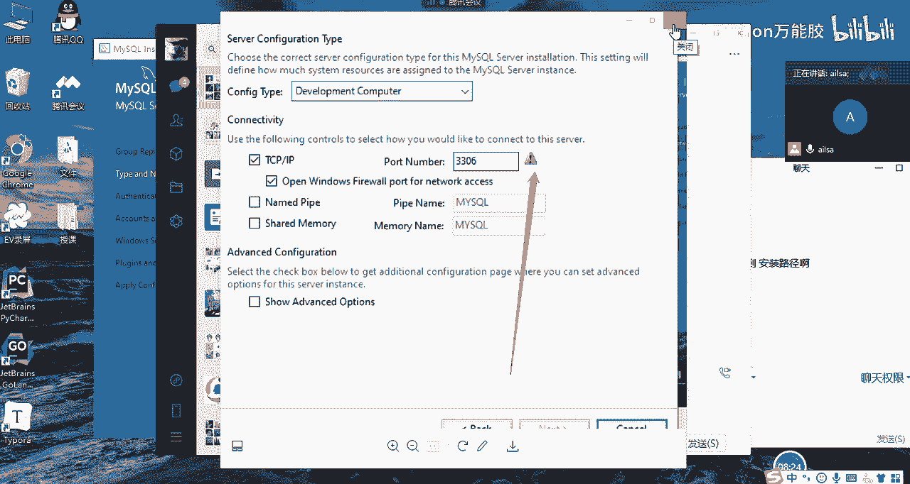

啊，要改我这边改的是3308啊，你们改一下吧，他可能会冲突。嗯。这个无所谓哈，这个只要说你不占用其他的其他的你的程序端口就可以了。我改到3308目前没有任何的问题。O那我们再点击下一步。点击下一步之后。

在这个界面哈，在这个界面我们不选择默认的了。我们要选择这个，这是我们的密码加密方式哈。加密方式我们不用它这个，因为它这个你看strong password怎么怎么着，就比较啊就是你选这个也可以。

但是我们在后面连的时候就比较费劲啊，就比较费劲。所以我们选择第二个啊，大家到这一步了，给我扣个一。嗯，大家到这一步了之后，给我扣个一。OK那我们接着往下走，点击next，在这里面大家一定要输入啊密码。

这个密码就是你的root的密码啊。my circle rootot password啊，等会我们登录的时候，这个密码一定要记得哈。所以说你这边设置一下啊啊如果说怕自己记不住，就设置123456啊。

repeat password123456O。啊，密码比较弱哈，没关系哈。好，这边是添加用户的，我们可以先不添加哈啊大家。录着呢录着呢啊。OK大家到这一步了没有，密码设置完了吗？同志们。

密码设置完给我扣个一。O。呵。哦，是谁？O next啊，到nex之后啊，然后我们的这个啊我们的这个mycyclcle，你们的看叫什么名字。如果跟原来的mycyclcle冲突了，你可以写上80或什么的啊。

O大家这个地方有冲突吗？my circlecle这这个地方。如果有的话，可以改成mycyclcle8或mycyclq80这样子。嗯。OK啊，这个改好了吗？对，没有感叹号就没有什么问题啊。

没有感叹号就没有什么问题。但是你尽量为了去识别。我们就知道呃，原来我们安装5。7的时候，应该默认是你应该默认名字是mycircle啊。然后如果它有冲冲突的话，它会有一个叹号啊，如果没有叹号的话。

就没有什么问题。因为我这之前安过一回啊，所以说嗯所以说它这个没有叹号。哎，我们再往下走哈。OK到最后一步嗯。最后一步啊这个地方我们看一下我们的端口。我们看一下哈。

我们的端口啊选择这个啊33060port number，我看一下啊。啊，其实也不用，因为我们之前已经改过了啊，我们之前已经改过了。嗯。

my circle as a document store partner我们之前改成了3308等等之类的，不用添加用户，我们用root就行哈，我们用root就行。嗯，我看看啊。

open windows fire防火墙port for access点一下吧，点一下这个吧。我也不知道会不会出什么问题。OK点一下这个吧。等一下这个啊，然后我们在next看一下哈。

然后啊到这个界面之后，直接点这个。啊，他就会下载相关的呃应用。啊，OK如果说完事了之后就finish了啊。然后我再教大家如何在na cut里面去启动它。嗯，如果说已经。如果说啊。

如果说已经呃已经OK了啊，然后就可以先把自己的na cat打开。我这电脑有点慢。

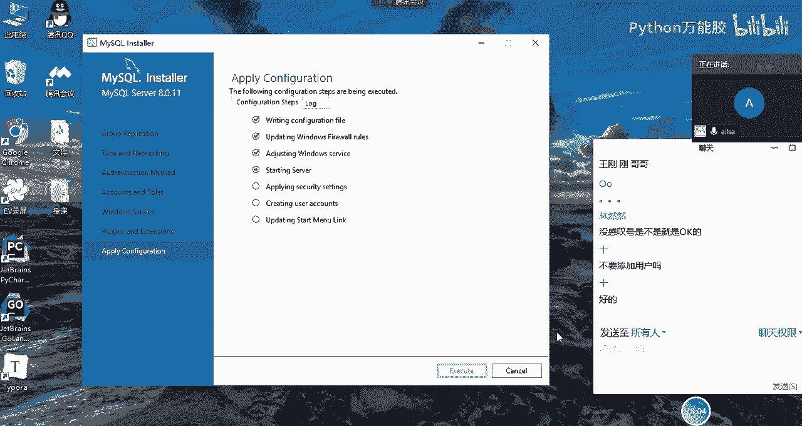

我说在这里面安装完了之后，然后点击finish，我们就完成了。完成了之后，我们就打开我们的na。然后在这里面连接啊，连接mysql输入啊，就是你自己命个名，比如说mysq8。0或者是什么什么都无所谓。

然后把我们刚才设置好的呃3308这样的端口，或者你自己设置的跟之前的5。7版本不冲突的那个端口输入进来。然后这个密码的话，是我们刚才在安装过程当中设置好的那个密码，然后输入进来测试连接。

如果成功代表你的myscle8。0已经安装好了嗯，好吧。

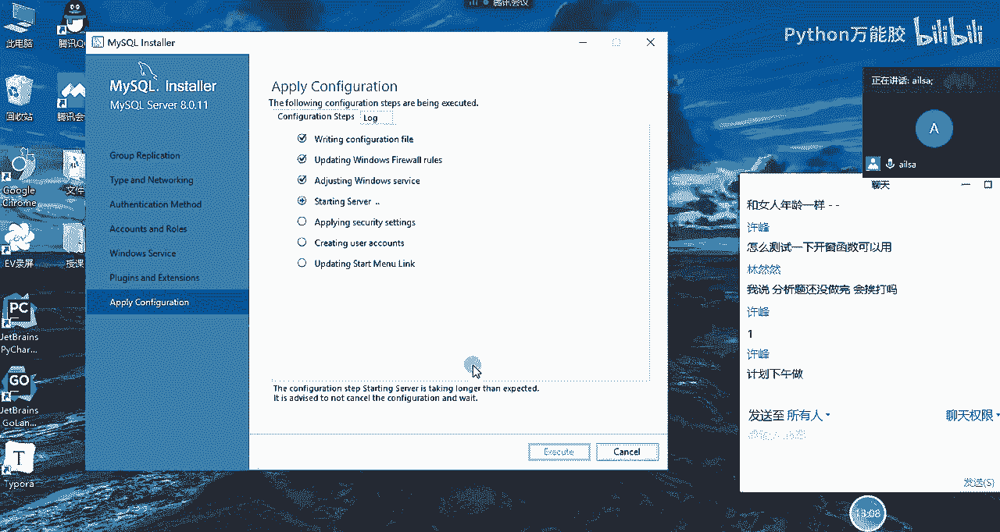

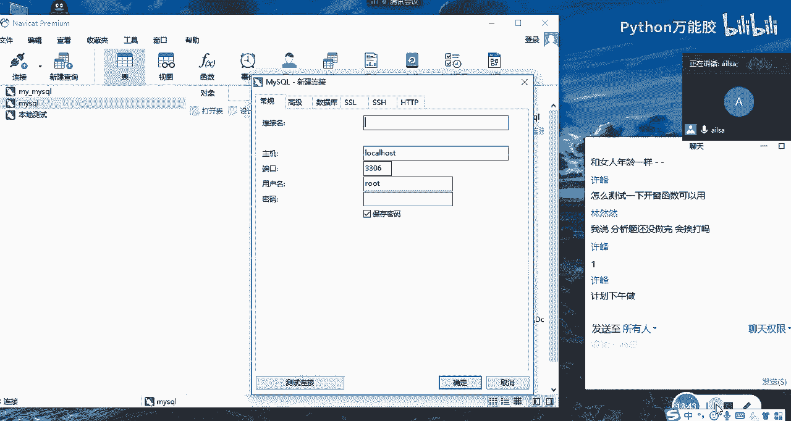