# 【python数据分析精华版来了（附文档代码）】10小时学会Python数据分析、挖掘、清洗、可视化从入门到项目实战（完整版）学会可做项目 - P4：03 快捷方式操作 - Python万能胶 - BV1YAUuYkEAH

，那我们讲解快捷方式。啊，快捷方式呢，这个是为了提高我们在工作当中的一个工作效率的。如果你不知道这些快捷方式，你也可以去操作，完全没有问题啊。但是呃你要是知道的话，你的工作效率会得到一个大大的提升。

这是一个好处。那第二个好处呢就是你这个快捷方式啊，你要是会用的话，嗯，然后你在某些会议上，特别是领导在的时候，哎，你给他夸夸夸一点，然后人也看不出来你键盘到底操作了什么的时候。

然后领导就会觉得过去这个员工牛啊，是不以后有好事就在想着他是不是就是有点炫技的这种感觉。但是但是低调而不奢华的感觉，你知道吗？因为别人确实不知道你该你是怎么去操作的。哎，所以就是就是很很神秘哈。

所以大家啊还是学点比较好的。就是对于我来说的话，因为我有一些操作操作习惯已经定型了，操作的次数太多了，所以在学一些快捷方式的时候就比较难学。但是你们不会，因为你们操作的呃次数比较少。

你们一上来就用快捷方式，用习惯了就比较厉害了，明白吧？我们先讲最常用的快捷方式哈，最常用的快捷方式是呃第一个全选conttrol加A啊，为什么是conttrol加A呢？啊，我跟大家说一下A是什么意思啊？

在英文当中A代表奥，所以说是conttrol加A，它这个全选啊，有一个啊，对对对啊，ctrol加O，它这个全选有一个条件啊，什么条件呢是。啊，必须是连续区域哈连续区域的啊。比如说你的数据去断层了。

那就不好意思。啊，连续区。你比如说我举一个最简单的例子，我在这个数据区域当中。在个数据区当中，我们看好像没有什么不连续的，我们controrl加AA好像都可以全选。那如果说我在这里面插入一个空行。

然后我再把鼠标定位到这里，再cttrol加A的时候，大家看一下下面的数据就呃获取不到了。也就是说它必须得是连续的那单行的空白跟单列的空白也是一样的。我在这插入空白的一列，再ctrol加A。

那这也是选取不到的啊，那如果说有的人说哎你这是一个区域。那如果说我对于某一列当那个空白的。比如说我在这里面删了一个那大家可能看不出来哈，它确实是删了哈。那它这个比较长。啊。啊，它这个比较长。

你看它是不是空的那这个时候我把鼠标定位到啊定位到这个地方，然后再cttrol加A的时候啊，sorry啊，因为我想选的是单列，所以我需要把两边的都给它空出来。这个会有点宽啊，两边的圈块空出来。

这个时候我在鼠标定位到这里ctrl加A。稍等。就是没啊。太狂了。这个。我在ctrol加AOK你看它这个地方的话，就会只选择啊只选择它所不在的一个呃区域里面的一个范围哈。因为给大家找到这个东西太多数据了。

所以说啊呃就是强调一点，ctrol加A，不是说啊就直接就是所有的数据都能全选，它是在有一定的条件下哈。OK那我们接着往下讲，这是controrl加A，必须是连续区域。

那第二个的话是conttrol加Z撤销，这个大家都知道吧。嗯，ctrol加Z撤销这个都知道哈，然后ctrol加X减切啊，这个也不用讲哈，这个经常会使用的ctrol加C复制cttrol加V粘贴啊。

ctrol加B加粗，这个也经常用吧。是不是啊，大家给我一个响应。对吧crl加S保存啊，查找你再说一下查找。还在听吗？啊，我看没有人响应。OK哈O在在OK那我们这几个比较常用的，我们就就一带而过哈。

我们说一下查找。查找的话是control加F。那control加F呢，我们调取的是查找的对话框，它为什么是啊呃ctrol加F为什么是查找，是因为fd对吧？fd查找的意思。

我们在这里面输入查找的内容就可以了。嗯，OK哈，那我们再接着往下讲是control加H替换。大家看到唉查找和替换不是在一个对话框下面吗？怎么还分两个快捷方式哈，其实啊一样的哈。你比如说ctl加H。

我点击一下，它出来的就是替换的啊，查找内容和替换内容。如果大家不想记就想记一个的话，就记查找完了之后，你如果想替换，直接点到替换这里就可以了啊，明白了吧？OK我们再讲一个单元格内强制换行啊。

这个有很多人好像不是特别明白哈啊，有很多人我在工作的时候，然后会有人力的人问来，他说哎，我想在单元格内强制换行怎么去操作。我跟大家说一下，什么叫单元格内强制换行。你比如说我想说入你好。

哎啊这个时候如果我输入事件啊，但是我想让他们啊分两啊分两行去操作，这时候我可以按住alt加enter，然后他又可以实现你好事件啊，这样的一个操作。你就是说强制给它换成两行。

有的人说哎你这里面不是有自动换行吗？你为什么还要呃进行这一步操作呢？大家看一下什么叫自动换行，你比如说呃认识你们分开心。然后我们看一下，这是它会超出这个单元格位置外的这个地方。那我点击自动换行呢。

它会根据它自定的一个宽度进行一个适当的调整，这是叫自动换行。那强制换行就是当你没有达到这个宽度的时候，你还想让它显示两行的时候，你需要进行的这一步的操作，叫强制换行，按alt加entt键来实现。

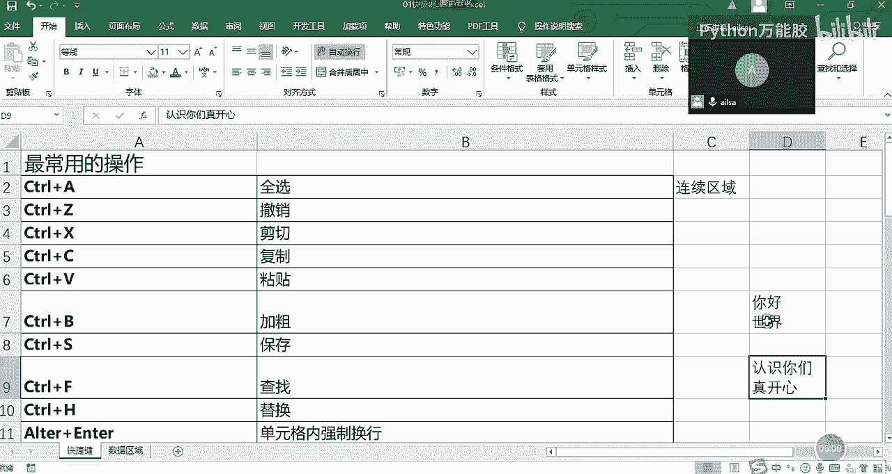

啊，大家对于这个常用的快捷方式听明白了没有？听明白过扣个一。O。45呃，我们现在讲多久了？我们把这个快捷方式讲完吧，讲完再休息，好吧。嗯，我的嗓子好像有点。哎呀。OK那我们接着往下讲呃。

我们的区域选择啊，区域选择这个的话。啊，如果说大家现在打开着excel的哈，打开着excel的跟着我来操作，好吧。啊，跟着我来操作，不要不要说哎，我我就听一下，我就知道了啊，要自己尝试一下哎。

行能不能实现啊。那我们看一下区域选择。第一个是home啊，什么叫home呢？就是加的意思呗啊，那我们看一下它是移动到工作表，某一行的开头，比如说还是我们的数据区域哈，数据区域，然后我把鼠标定位到这里。

这个时候我按一下home键，你看它是不是跑到这一行的开头了啊，如果说你整个很多很多个列，然后你想回到你的最左边的时候，你就可以按一下home键，哎，这样就可以实现了。这是第一个。

那第二个呢是conttrol加home，哎，我们看一下它怎么来实现的，这个用的是非常多的哈。啊，这个是用的非常多的。你比如说哎你看我这个数据量特别特别特别大，对不对？特别特别大。

其实也不大还也也就才嗯几千行而已。然后现在呢我鼠标定位到这里了，我对它进行了修改。现在我想回去，我是不是要这样去拉，这样是不是很难受？那如果说我用ctrorl加home键，大家看一下。

它自动回到了我的A一单元格，也就是我家的位置。对于整个工作表而言，AA一单元格相当于是你整个的一个工作表的出发点，所以说它称之为加称之为home啊。ctrol加home是经常用的，大家这个一定要记一下。

然后ctrol加shift加home哈。这个是怎么个意思呢？我们可以来试一下control加shift。比如说我鼠标现在在这里，然后cttrol加shift再加home，大家看一下。

它选中了这个位置到这个位置的所组合成的区域啊，这样区域啊快速定位到某些区域。比如说鼠标定位到这里，ctrol加shift加home啊，就实现了这这两个对角所形成的数据区域。好。

这是cttrol加shiftft加home啊，大家的操作能实现吗？自己可以试一下。啊，思敏自己能操作实现吗？没数呃，我给大家数据了。我们可以打开我们的快捷方式，可以是吧？好的啊。

这个我们的快捷方式一定要经常练习哈。如果但是不需要大家所有的都掌握哈，可能你养成一些习惯就可以了，好的习惯就可以。嗯，然后我们再看conttrol加shiftft加向下箭头，向下快速选择连续的区域。

什么意思呢？就是你看。我们可以看一下哈，我们这个表大概是3000多行，其实也不算太多。但是如果说我想选择这一列的时候，我这么去拖啊，费劲哈，我的手指头就按的疼，那我该怎么快速选择呢？

conttrol加shift加下键。大家看一下是不是快速选择了这一部分的数据区。那现在我想回到我的整个的工作表的开头，control加home就回到这里了，对吧？我不仅可以选择单列。

我还可以写选择多列进一个control加shift将下下箭头，哎，就可以实现我们所想要的一个数据区。现在是controrl加啊home啊，ctrol加home啊，是的是回到这里。

然后我们对于多行而言是实行的是controrl加shift加向向下箭头，什么是向下箭头，大家知道吧？点A也可以。什么意思？ctrol加A吗？嗯，向下箭头的话指的是我们小鼠标的四个键，哎。

向上向下向左向右啊，这样的一个四个键啊来实现的啊，大家都知道吧？知道给我扣个一。好。好的好的好的，可能是略有延迟。OK那我们再接着往下讲，既然我向下向下的箭头可以选择向下的区域。

那我们当然也可以选择向右的箭头。比如说我现在定不到这么几啊，这么几行，然后ctrol加shift术的加向右箭头啊，就快速选择了啊，这里是有。稍等，我看一下。OK这个是向下是没有问题的。啊。

我们也可以我们也可以直接这么去选，也是可以。如果说我只想要定位到数据区的话。我看啊。啊，这里面有个空啊空列哈，因为如果有个空列的话，我们也没办法去选择它。我们呃要选择的是连续的啊。

连续的数据区域也是一样的。conttrol加shift加向右的箭头，然后去选择我们连续的数据区域啊，这几个都要必须是连续的，如果有某列某行有空白的话，也是定位不到的。

你包括呃就是我们control加shift将向下箭头也是一样。比如说现在我把这个删掉，然后鼠标定位到这里，然后ctrol加shift将向下箭头，啊，它也只会定位到这里而已啊，所以说空格还是很讨厌的哈。

我们尽量不要有空格。嗯，OK呃，那我们呃选择数据区域啊，刚才已经说到了这些哈，我跟大家说啊，我们的conttrol加home啊，然后。ctrol加啊向下向右箭头向右箭头是经常用到的啊，是经常用到的。

向啊，不对，向下箭头经常用到啊向右的话倒不怎么经常用到哈，然后前后左右箭头也不怎么用到。我们看一下什么叫前后左右箭头呢，比如说鼠标定位到这里，ctrorl加向右箭头它就会定位到啊我们所在区域的最右边。

然后cttrol加向下箭头就是我们连续数据区域的最啊下的一个地方，也就是四个点吧，哎向下左右啊左。

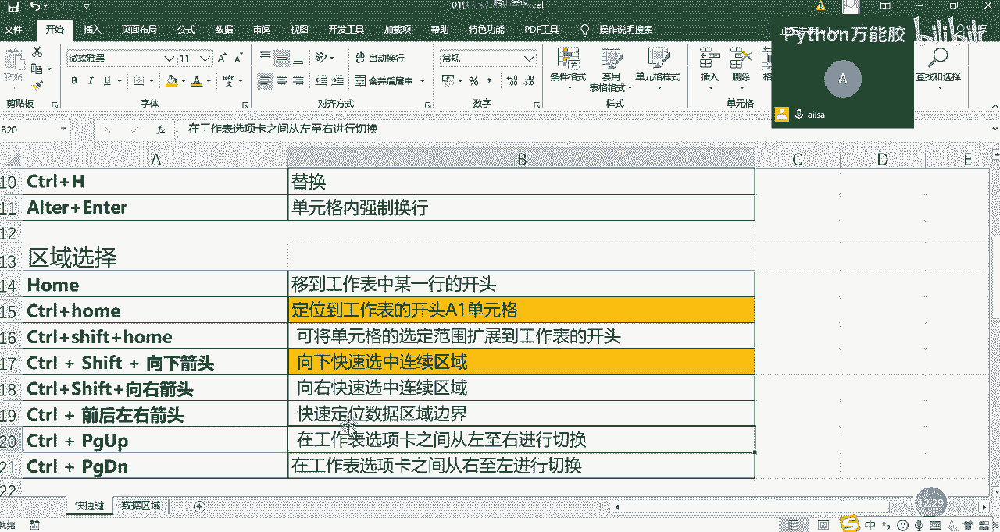

啊。左好到这里，然后上。啊，到这里啊，这一个一个角的一个位置的切换。好，哎，那我们再看后面的control加page up和control加page down。这个其实是工作表之间的一个切换了。

我再多建几个哈。

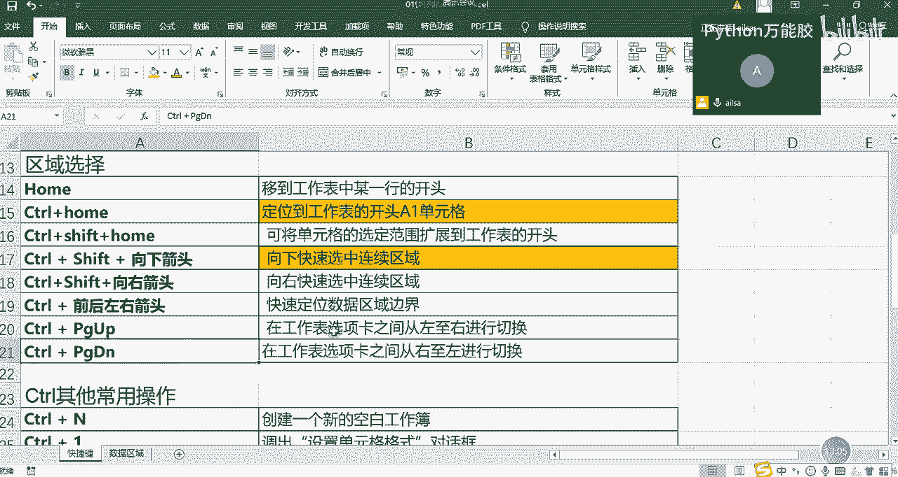

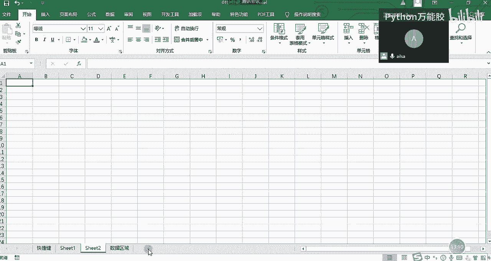

啊，工作表之间的一个st的切换。你比如说鼠标定位到这里，up是不是上啊，down是下，所以说controrl加down。哎，你看可以切看工作表，然后加up，哎，上一个上一个。如果你的工作表很多的话。

你就可以这么来切换。

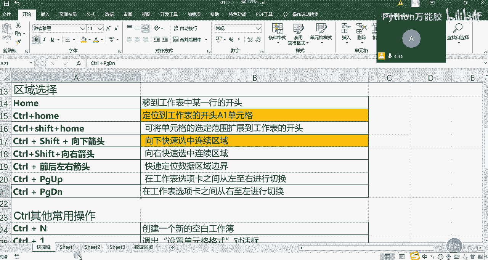

啊。OKO啊，我们这是我们常用的区域的选择哈。嗯，O我们再往下走哈，往下走就是其他操作了，其他操作的话也会经常用到。我们看一下第一个ctrol加N，我刚才有没有操作。

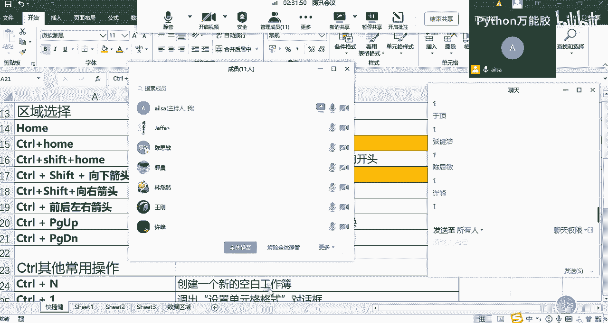

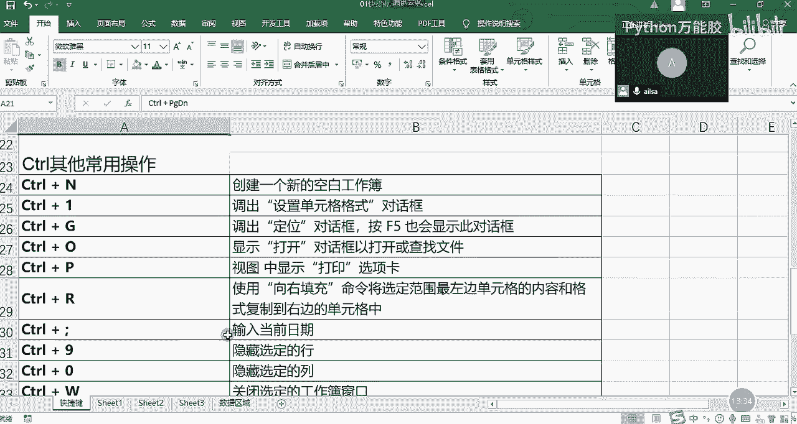

我们啊前提是哈这个前提，比如说你现在没有excel程序的一个启动，就是没有任何一个excel工作簿的一个打开的话，你是不能用control加N的哈。那我们ctrol加N是新建一个工作部。

在前提是有一个工作部在的一个情况下，我们可以直接新建一个工作部。它的命名的话是以工作部开头。后面的1234默认的一个顺序，然后去命名。

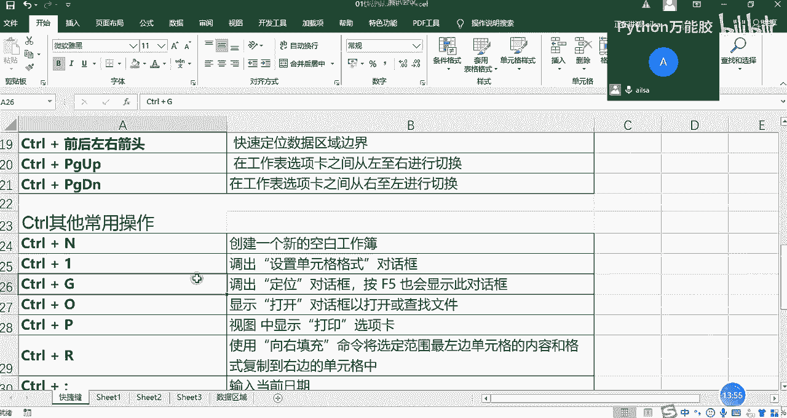

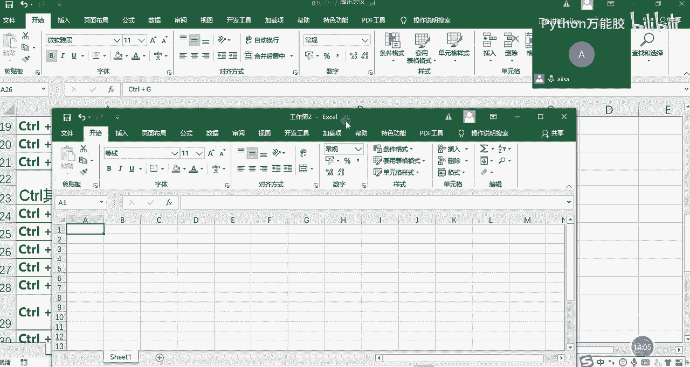

啊，这个就记一下，然后control加一啊，这个是我在工作当中经常用的control加N也是哈ctrol加N啊，这个东西不知道的人还真不知道哈啊，挺逗的啊，就是你给他给人家哎。

你鼠标ctrol加N出现一个新的之后，人不知道哎觉得唉怎么弄出来的哎好奇怪，是不是这个还是要学习它哈。ctrol加一的话就是设置单元格格式哈，那我们看一下ctrol加一。

哎调取的是设置单元格格式的一个对话框，我们经常会对单元格的一个格式啊，数字的格式，然后字体的格式还有填充的格式进行一个设置。如果你不知道cttrol加一，那你怎么去设置单元格格式呢？当然也可以啦。右击。

然后选择我们的设置单元格格式也是一样的啊，就是但是你用cttrol加一会更高呃会更高效，而且是更炫酷一些哈。

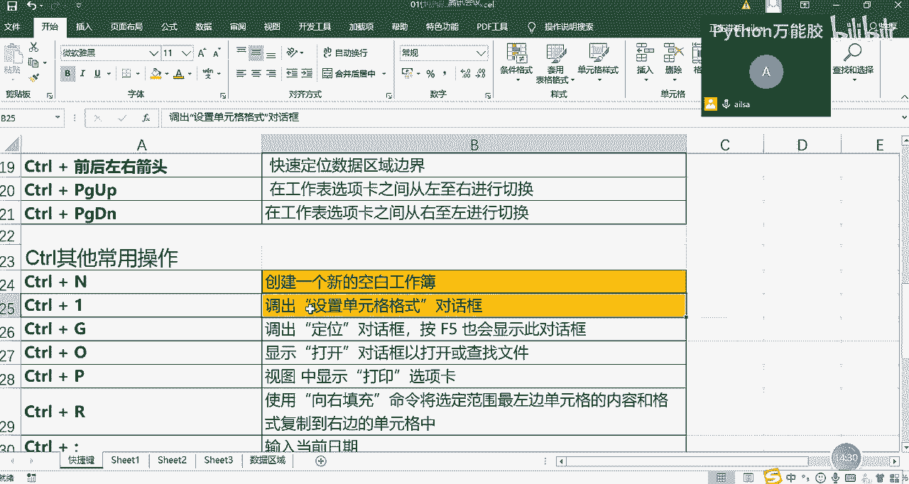

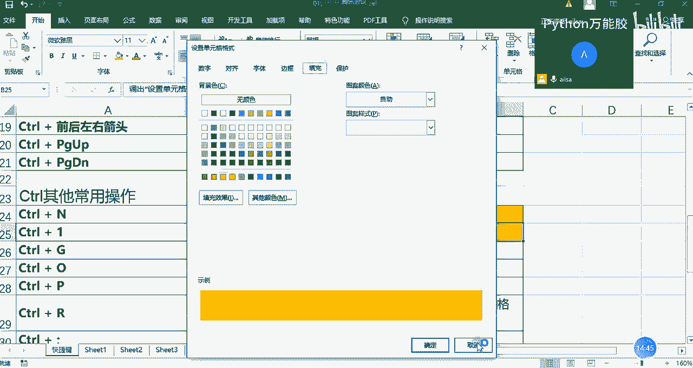

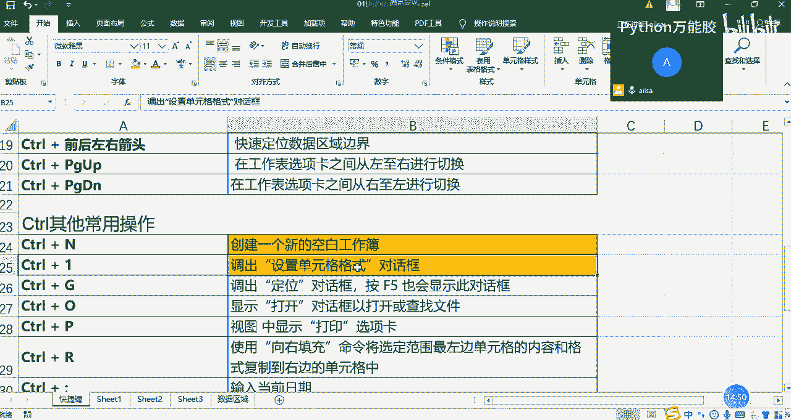

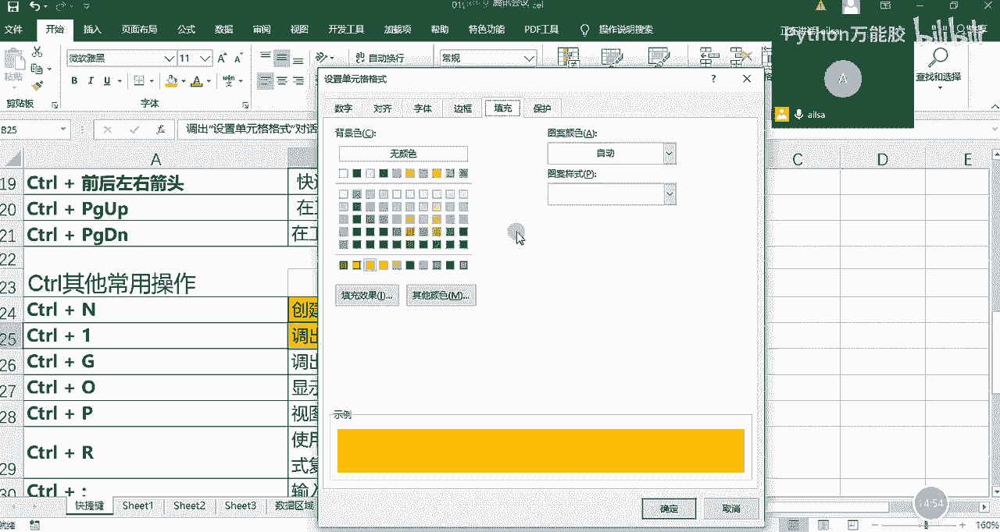

然后ctrol加G啊是定位哈，因为GPS啊代表是定位功能，定位功能也会经常用到啊，这个我们后面会讲大家记一下，先记一下啊，这里可以不用不用做了解ctrol加O。哎。

大家看一下ctrol加O openen的意思，所以是打开打开模。比如说现在我cttrol加O。

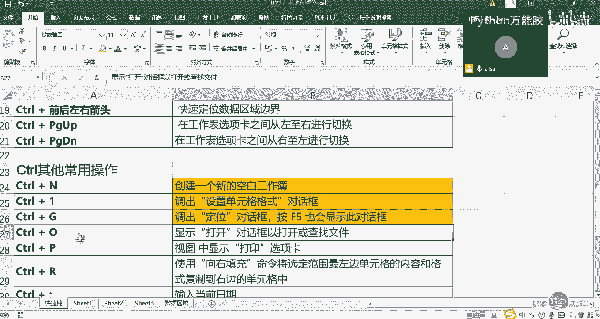

哎，他是不是要指定我到底打开哪个工作表啊，对不对？那也比较呃，你要是不会，那也你也只能是点文件，然后打开这样的一个操作啊啊，其实每一个快捷方式都是都是对应有操作的哈。只是说你用快捷方式的方式去打开而已。

ctrorl加P是打印，哎，对吧？打印，如果有打印机就直接ctrol加P就可以了。然后ctrol加2，哎，我说一下ctrorl加2向右填充的一个方式哈。你比如说现在。

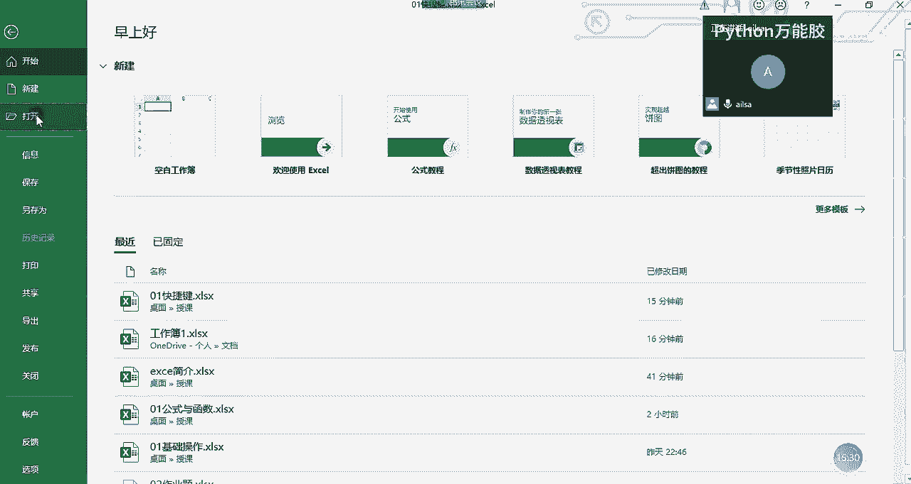

我想复制这里面的内容啊，到这里的时候，我要先选中它，然后再选择后面的空白单元格，然后选择control加R，它就会把我当前第一第一个的内容在后面啊。

是复制这样的一个control加R填充自动填充的一个效果。那还有一个叫什么呢？还有一个叫control加D。哎，大家想一下，我在鼠标选择这些东西之后，control加D啊。

就是向下填充D是down的意思。R是right的意思，我向右填充和向下填充。

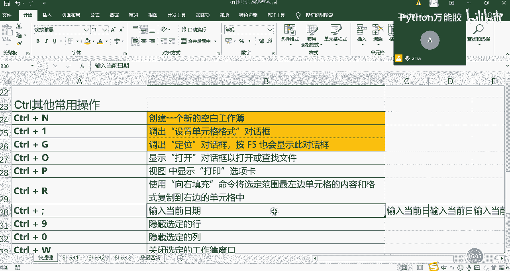

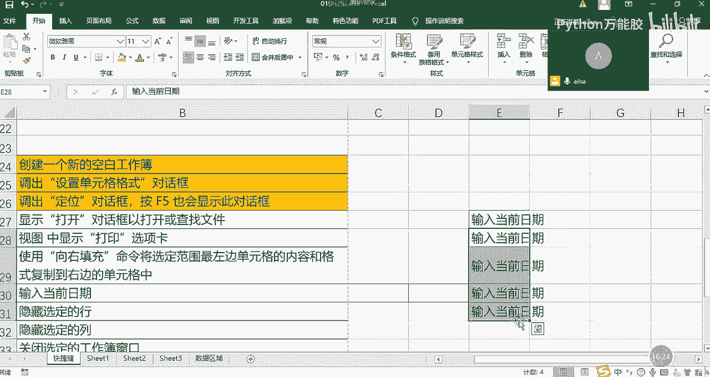

OK我们再往下走的话，就是呃cttrol加分号啊，ctrorl加分号其实啊这个好像很少有人知道哎啊，ctrol加分号就是直接就是把当前的日期啊给它显示出来了啊，很高效哈，很快啊。

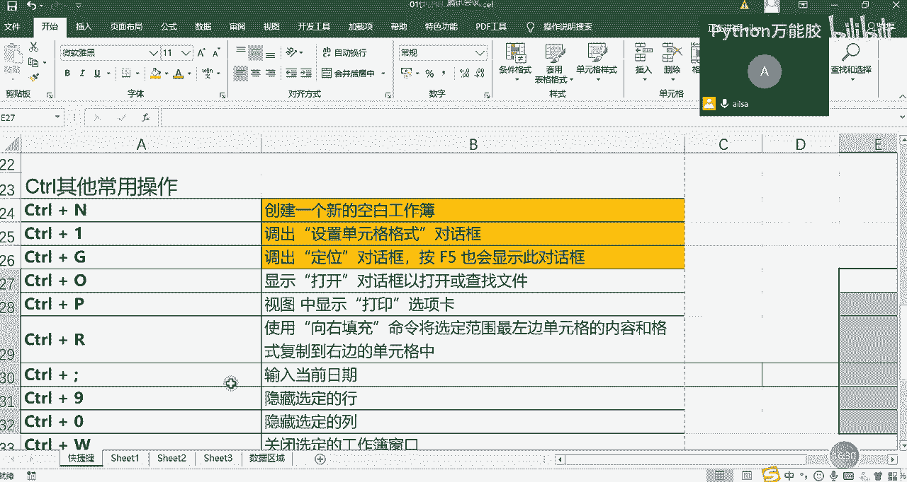

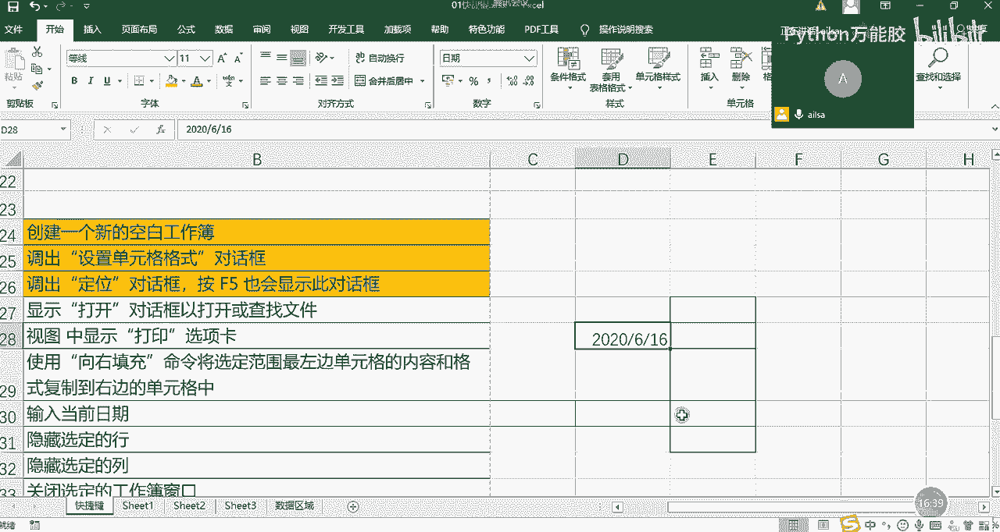

好，用的不多哈啊用的不多啊，然后ctrol加9隐藏当前行，cttrol加零隐藏选定列哈啊就是选定的行或列啊，整行或整列哈这个东西大家自己回去试哈。因为这个。

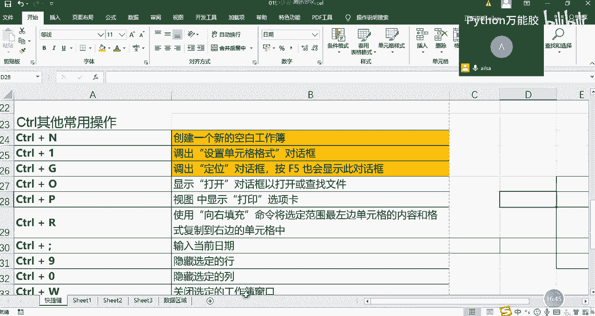

不常用啊真不常用哈啊，ctrol加W是关闭工作部。我们刚才是不是打开了一个工作部2啊，那这个时候我cttrol加W它要关闭了，而且不提示你保存哈。所以说这个还要慎用哈啊要慎用。

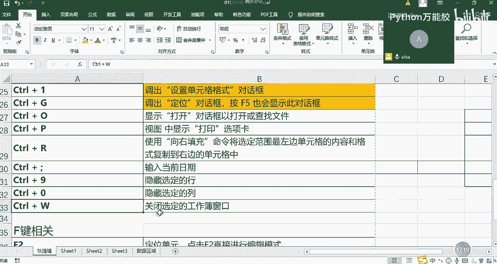

嗯，OK我们再看一下大家的一个效果哈。

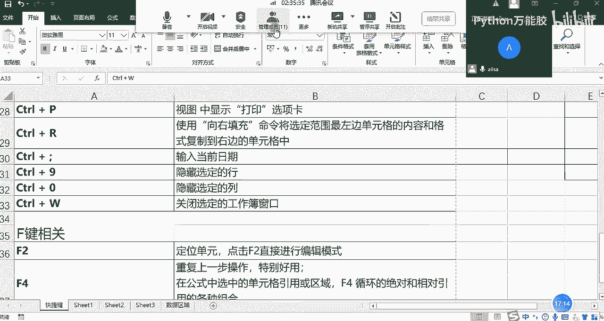

啊。大家对于刚才我讲的上面这几个快捷方式有什么问题没有？因为这个可能比较枯燥，我就带一下嗯。Hello。没有哈，因为比较简单哈啊。OK我们最后再说一下F键F键嗯，F键的话就是F2啊。

我们可以点选一下F2，可以看一下。看一下F2。啊，比如说我现在鼠标在这个单元格里面，我点一下F2，哎，大家可以看到有什么变化，没有？是不是我进入了编辑模式啊？我刚才是不是选中模式，看单元格哈。

单元格现在是选中模式，然后按F2就可以编辑模式了哈啊，其实还没有双击进来快的哈啊对，然后你看你看你自己呃喜欢那种方式吧。嗯，这是F2F2定位到单元格，然后进行编辑。那F4呢哎F4很好用哈。

和大家演示一下，比如说现在我插入了一行，然后我要插入很多行啊，然后我点了一次之后，这个时候往F4哈ctrol啊，ctrol加F4啊，不对呃，就直接F4哈。哎，大家看到没有？它会重复我上一步操作哈。哎。

我我没有点插入哈，它直接就重复了我上一步的操作，可以看出它是重复重复上一步操作哈。但是大家对于这个操作而言，不是说所有的操作，它都可以重复哈。它大概是我这边大概总结出来的话。

就是你对于单元格的一些呃鼠标类似于鼠标这种操作的话，它是完全可以识别，然后重复你上一步操作的。比如说你在这里面输了你好，它是不重复的哈。

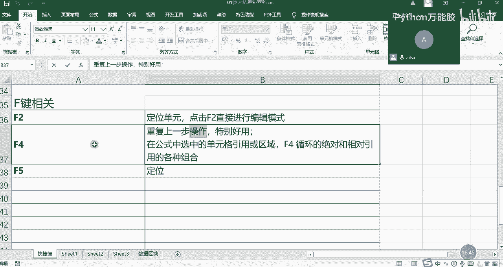

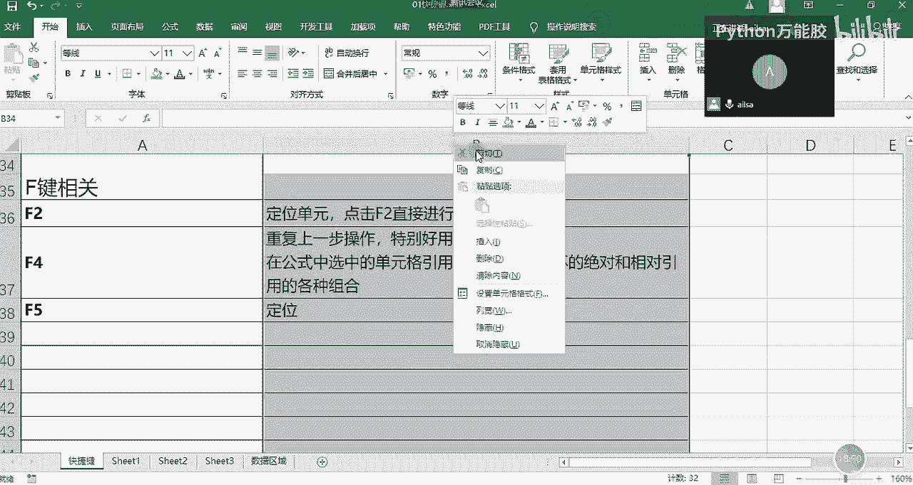

他是没办法重复的，他只会针对你鼠标键的一些操作，然后进行了一些重复。OK啊，F4我们在后面讲公式与函数的时候，还会讲到它的一个循环引用的一个组合啊，也是非常高效的。F4啊。

F5大家可以看一下F5也有定位的功能。我们刚才说啊，我再跟大家考一下哈啊，我看大家有没有听懂哈，我们刚才。讲了的定位功能是怎么是什么？除了F5之外。除了F同志们，刚才讲的定位功能，除了FF5之外。

还有什么？对，ctrol加G哈GPS大家一定要记住，我们记快捷方式的话，刚开始可能觉得有点懵哈，可以啊采用自己的方案去记哈GPS定位，然后也可以用F5来实现，都可以。

OK那我们快捷方式呢啊就讲这么多哈啊我们回去之后要自己去慢慢的练习，去适应。你可以选择记其中的10个左右。你比如说常用的，我们就不说了哈。

ctrol加Cctrol加Vctrol加Xctrol加Zcttrol加B这种比较常用的，我们就不说了啊，然后自己单独再记5到6个不常用的，然后基本上就能够解决工作当中的大部分问题了啊，没必要全部记哈。

没表全部进啊，我在这边只是给你们多介绍了几种啊，我把这个删掉哈。

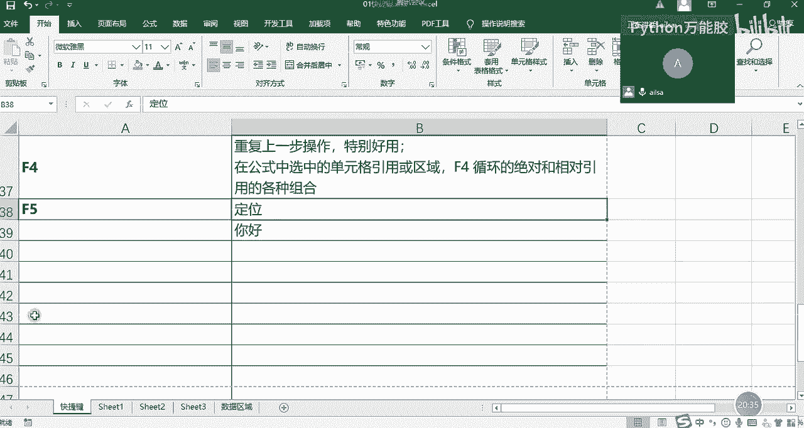

影响我的美观。还有个F12。

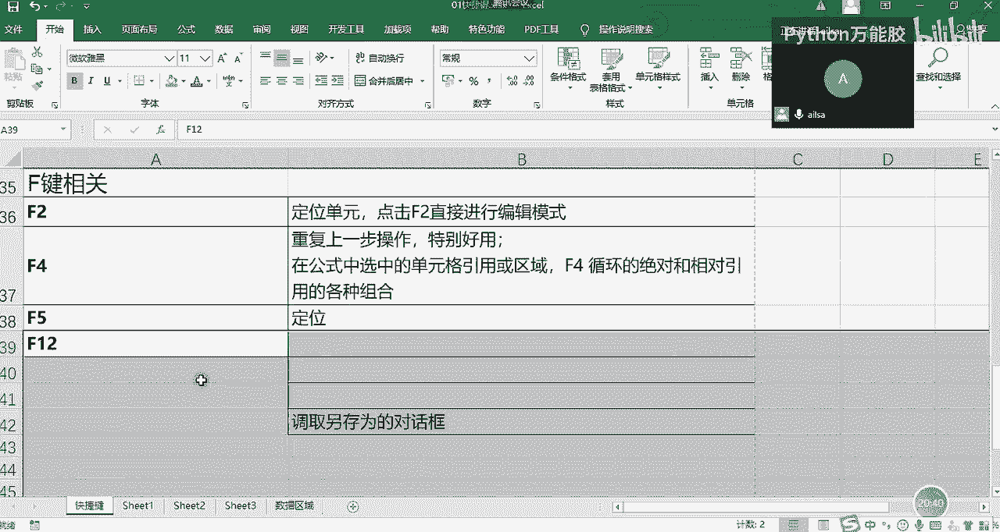

还不说不怎么常用哈啊。调取另存文的对话框也可以使用F12。啊。大家看啊，调取另存为的一个对话框，自己回去要一定要一个格式哈，一格式。那放到这里啊，OK那我们快捷方式就等完了哈，我这边。

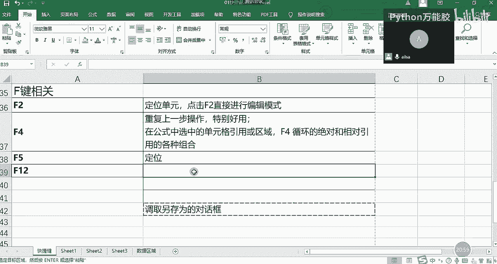