# 【python数据分析精华版来了（附文档代码）】10小时学会Python数据分析、挖掘、清洗、可视化从入门到项目实战（完整版）学会可做项目 - P7：02 公式与函数介绍&地址引用的三种方式 - Python万能胶 - BV1YAUuYkEAH

那我们讲公式与函数。

讲公式与函数哈啊那我们在啊啊我们先说公式哈，我们提到公式之后，哎，大家想哎这个公式是什么呢？啊，什么是公式呢？

啊，其实这个问题一点都不难，为啥呢？我们在小学一年级的时候就学了什么是公式啊，大家都学过一加一等于2吧啊，其实这就是公式。那在我们的excel当中啊，我的公式该怎么去定义呢？你比如说在excel当中啊。

我要新建一个哈在excel当中哎，我输入一加一，哎，它好像也没有啊也没有什么特别大的变化，对不对？这个时候如果说我在它前面输入一个等号，我们都知道一加一等于2，对不对？那我按ent解释一下，哎。

是不是它变成了2，那其实啊那我们就可以啊发现哈，在excel当中这个等号啊啊，其实我们的数学啊，符号等号是在后面的。那它呢是放在前面。

目的是为了告诉excel，哎，我想要计算一些东西，所以说它放到最前面。那我们的公式的定义就是以等号开头。然后啊就是说的比较高大上一点哈，就是建立数据之间的一个一种关联关系关系的一种实现的一个算法啊。

是不是很高大上。你看一加一等于2，就是建立了数据之间的一个联系，然后实现了某种加法加法也是一种算法哈啊，就是最简单的一种算法，这就是我们公式的一个定义啊，我们可以看一下公式啊，就是啊简单来说的话。

它就是以等号开头对地址进行引用的计算形式。哎，你这个说的不对哈，你这明明是对数进行一个引用嘛，对不对？那为什么说是对地址呢？

因为我们excel其实它就是有一个个的单元格地址组成的那我在这里面输入了一加一，其实没没有很好的利用excel的一个特点。因为我最好是在这里面单元格里面。

数入值，然后在这里面写等于一啊加一啊，这单元格地址进行一个引用，然后等于2这样的一个好处是什么呢？就是说我单元格地址里面的值发生了变化，它就发生了变化，对不对？非常的智能，你也不用一个个去修改了。

所以说公式的话，它就是以等号开头对地址进行一个引用的计算形式。那说的高大上一点，它就是确立数据之间的关联关系实现的一种算法。然后我们的结果啊就一加一啊等啊就是我们的一种算法，然后结果为二来描述这种关系。

一和一什么关系呢？就是它俩相加等于二这样的一个关系啊，是不是很高大上哈，这是我们的公式，其实哎这个概念没有什么好介绍的哈。因为大家都知道。

那我们再说到函数，大家大家对于函数其实是不陌生的。因为什么呢？我们在python当中哈，我们在python当中经常是不是要定义定义什么定义我们的呃定义我们的函数。那我们定义这个函数的目的是什么呢？

就是为了实现某一个功能的一个呃就什么呢？功能模块啊，就是把它封装在一起。然后下一次我如果再实现这个功能的时候，我就可以进行一一个调用就可以了。那函数也是在excel当中函数也是一样。

它也是为了实现某个功能而封装的封装起来的一种公式，所以说我们可以说啊函数是一个定义好了的公式啊，它可以啊呃输入一些参数来实现我们所想要的效果就可以了。因为我们自己定义函数不是也要输入参数嘛？啊，对吧？

是这样的一个定义。那公式啊，公数啊，什么玩意。

公式啊公式我们可以把它概念是是这个样子啊，就是确立数据之间的一个关联关系。我把它写到我们的笔记当中。

嗯。公式啊，它是。啊，它是确立数据之间的关联关系，实现了一种算法，通过其结果来描述这种关系。那函数呢它就是啊定义好了的啊。好了的公式啊，实现啊某种。啊，或者是某类啊功能的。啊，一1个集合吧。

或者是呃呃呃就是呃实现某类功能的啊一个啊函数啊啊一呃一个。封装好的。公式啊。嗯，那他可以通过输入。通过输入参数啊来。达到。想要的结果啊，就这样的一个呃定义和概念哈，就是公式这个函数。那我问大家一下啊。

公式与函数的一个呃概念，大家听明白了吗？听明白给我扣个一。多元一次方程啊，也可以哈，这种也是公式啊。OK这比较简单哈啊啊，那我们既然说啊公式它是确立数据之的一个关联关系，我们都知道那呃要计算公式的话。

它肯定要有一些运算符，对不对？那我们看一下它都有哪些运算符。运算符的话最简单的加减乘除乘方，对吧？这些都知道哈，然后啊百分号这里的话应该是嗯。

百分比啊就是一个展现的一个形式啊，这样的就是我们主要记加减乘除乘方啊，很简单。excel当中真的是啊比较简单一些哈啊，然后下面又是一个关系的运算符啊。

等号大于小于大于等于小于等于不等于啊这样的一个啊啊运算符啊，跟我们在日常工作当中和呃学习当中啊差不多啊，都差不多是一样的啊，这是我们的运算符，我就不在这里详细的去讲了啊，简单啊那个说一下就可以了。嗯。

那前面其实是比较啊呃简单的内容，我们接下来就要看单元格地址的一个引用了。

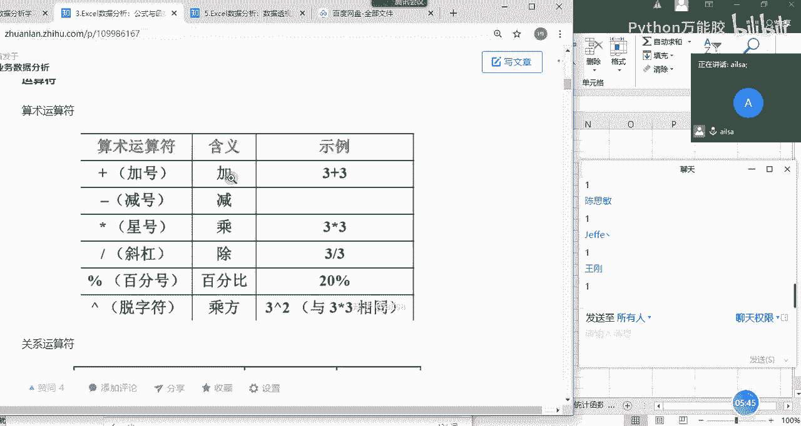

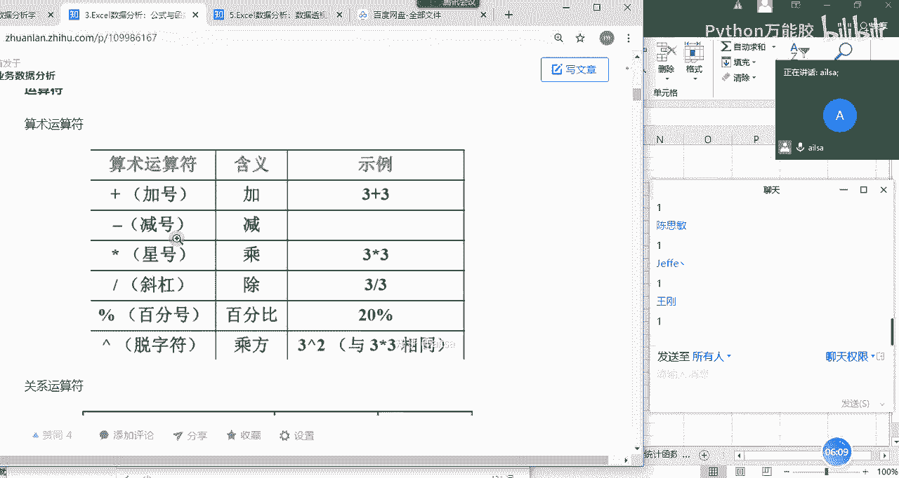

嗯，那我们都知道哈我们都知道我们在进行一个呃单元格的选用的时候，它的一个呃地址的话是由列和行组成，对不对？这是单元格，这里面的话就叫A一单元格，对不对？那我们在进行一个单元格引用的时候。

我们需要注意点什么呢？接下来我就跟大家跟大家讲一下，我们单元格地址引用的三种分类。

OK那我们还是结合实力去讲解哈，因为这样会更具有代入感。你比如说现在有三啊三道题，我们要一个个去啊解答。首先第一个啊，大家看这张表啊，这是每款车型它的一个销量的情况。现在我想计算一下啊。

这款车型在前半年的一个总和啊，这样的一个计算。我们之前也讲过哈，我们的求和计算是等于s，对吧？等于s。

来给它计算，然后选择我们的数据区域，也就是这些值进行一个加和就可以了。我们按ent键哎，实现了之后，我们在这里看哈，在这里看它的一个选择的区域呢是B时到计时，也就是从这里到这里对不对？

那呃很多时候我们都知道excel有自动填充的功能。那我的公式，它是不是也可以实现动动填充呢？这个时候我往下拉是试啊，往下拖动。哎会发现它的值确实发生了相应的变化。

是不是它就会根据我往下拖动的这样的一个形式来自动计算这一行的一个数据，这一行的一个数据。然后我们看一下它实际的公式内容是什么。

OK啊，大家看哈大家看我在第一行的时候，我就在第十行的时候，我输入的公式是B10到计时。那我再往下拖动的时候，这个地方可不是我输入的，我往下拖动了一行，我们会发现它的列其实并没有发生什么变化。

但是它的行却变成了11，再往下拖变成了12，它也太智能了吧，对不对？它竟然知道我想要什么，然后这变成131415，对吧？哎，这样的一个形式发生的变化，那呃我们就呃总结这样的一个规律，就是说行的话。

我往下拖动一行，它就会变一行。那这种形式的一个引用叫什么呢？

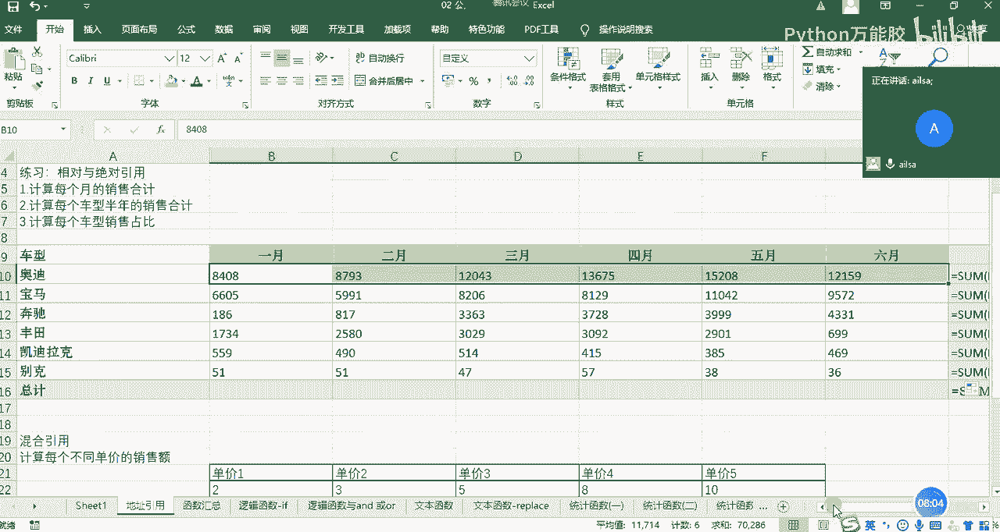

这种引形式的引用叫相对引用啊，也就是说它相对于这个往下走了一行，你走了一行，它也走了一行，这叫相对引用。然后我这边也就是给大家起了一个特别好的呃一个说法吧，容易让大家去记忆，就是说相对引用的话。

就是你变它就变，你往下走一行，它就往下走一行，它就像你的影子一样，如影随形跟着你走啊，明白了吗？就是A2到呃A5这样的一个形式。大家记住哈，列啊，就是列和行列和行。我们看到它真的是单纯的啊。

前面什么都没有哈，只有列和行这样的一个形式。

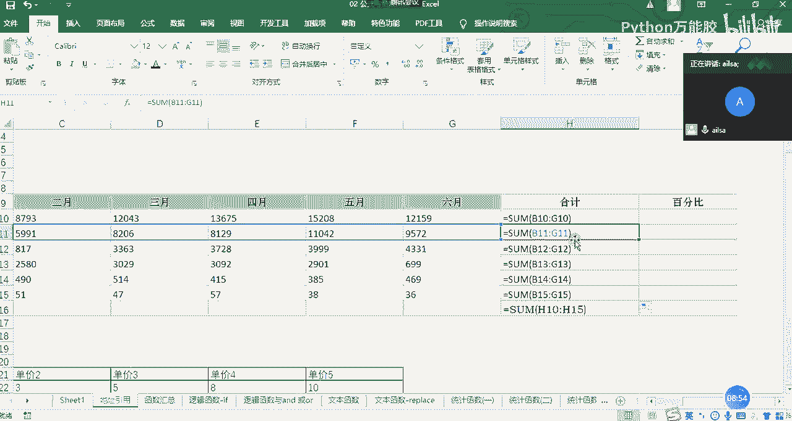

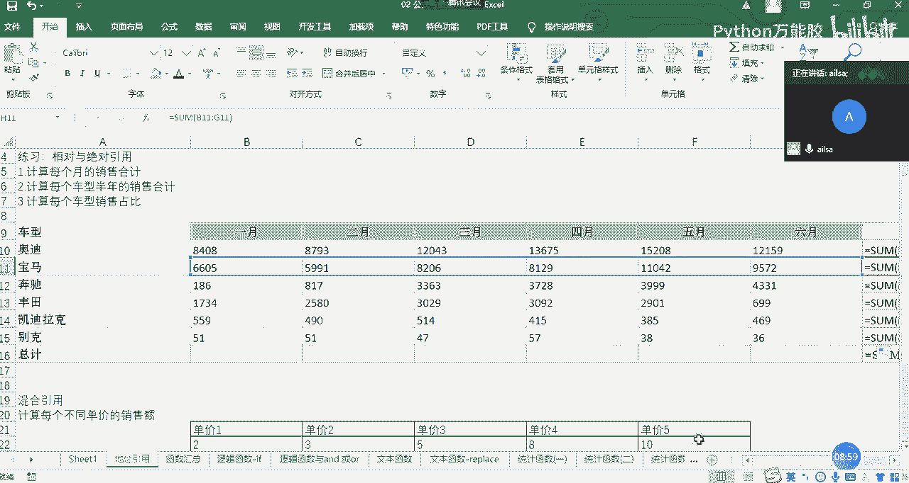

OK这就是我们的相对引用。那我们看了行这样去发生变化，我们再看一下列会发生什么样的变化。在这里面，比如说我输入的等于。啊，等于我直接输输入等于G2啊，点击entt键。比如说G2的值是4啊。

我现在不往下拖动了，我往啊我往右拖动哈。我往右头等，大家看一下，哎，好像都是4，哎，它怎么来实现的呢？我们看一下它具体的一个值哈。

我这里面是四，没有毛病。那在这里面它是等于G2，等于这个是不是我在往右拖动的过程当中，我们会发现它的列随之发生了变化，从G变成了HAG变成了H，然后从H变成了I，对吧？

那也就是说嗯呃我在列方向进行一个拖动的时候，它会随着列啊随之发生变化。行方向拖动的时候，它会随着行发生变化，这就是我们的相对引用。

O那我问一下大家。

啊，我们的相对引用这一块听明白了吗？听明白给我扣个一，不明不明白的话扣个2，然后有问题抛出来。嗯。对啊，是的，键号很聪明哈。control加波浪号是显示我们所有的一个原始的值啊，不仅仅是显示公式啊。

因为呃你我们从肉眼去看的话，我们只看到它的一个结果，但是它实际的内容是公式嗯。嗯，好，那相对引用大家明白了之后，我就讲第二个需求。第二个需求是什么呢？就是我要计算一下每一个月啊。

就是每一款车型它的一个半年的呃一个销量了之后呢，我想知道每一款车型它的一个占比情况，这是它的总和啊，知道它的总和。然后那我也就是说我把每款车型的一个销量除以它的总计就可以了，对不对？那就是百分比。

这个时候我还按照刚才那种经验啊，选择它，然后除以我的总数按entt键。

哎，这个时候啊我们看一下，因为我这边的一个格式啊，应该是整数，我们cttrol加一啊，选择什么呢？选择我们的百分比啊，我们的小数变成两位，点击确定就可以了。它就实现了我们整个的一个百分比的展示效果。

这个时候我还按刚才那种方式往下拖动。

往下拖动。哎，不对呀，他怎么报错了？我们看一下这个错误是什么意思哈，它有一个杠，有一个零代表什么意思呢？哎，好像是我的，因为我这是一个除法啊，对吧？那我的分母不应该为零，对不对？如果为零就没有意义了。

所以它报错了。那我们再看一下它整个的一个原理是什么样子的。

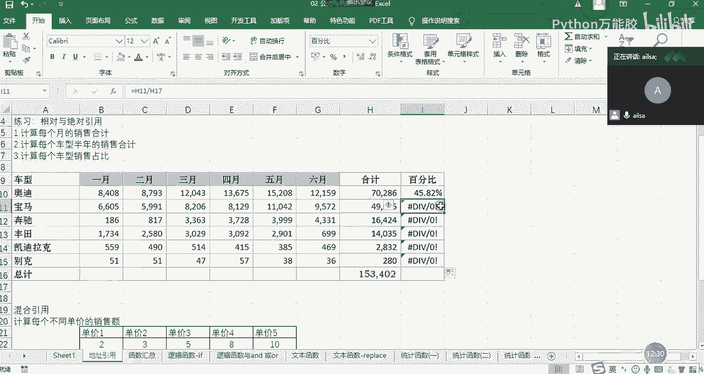

我这个百分比啊，我第一款车型除以我的总的销量啊，那是没有问题的。但是我在往下拖动的过程当中，我们会发现我的呃这款啊，就是我的宝马这款销量，然后除以它的总计的时候，它也往下走了一行，也就是说它走了一行。

那你这个随之它也走了一行，对不对？那它这往下走一行之后，我们会发现它没有值，那没有值肯定就会报错了啊，那这个时候其实我们想要达到一个什么样的效果呢？就是我这个分子啊，我往下拖一变。

但是你这个分母是不能变的。我们怎样才能保证这个分母不变呢？

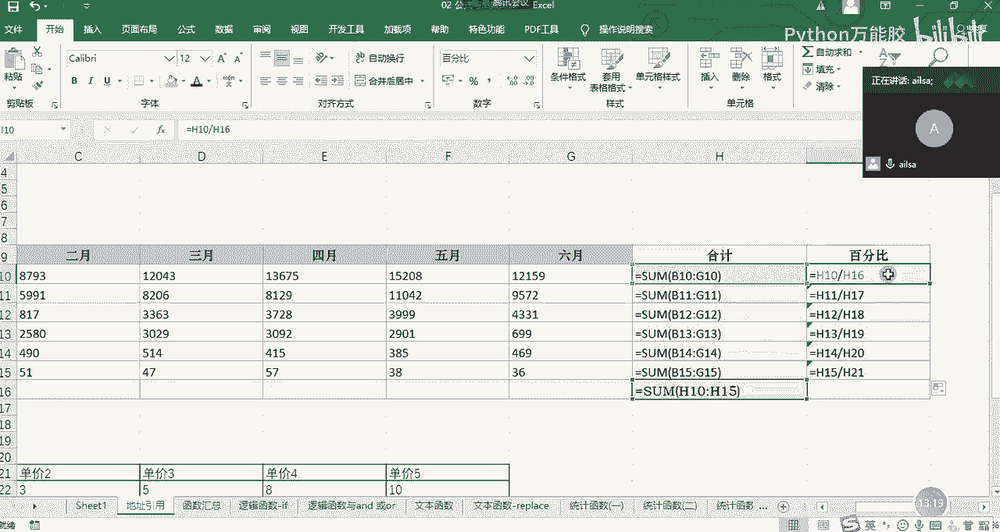

哎，这个时候我们也是有法保证的哈啊就是我们要讲到的绝对引用。那我们如果想保证它不变的话，我们需要在这个列方向和行，因为它整个单元格都不变，所以我们需要在列方向和行方向都加一个do勒符。

这个do勒符的添加是按住shiftft键加上。

哦，4啊来实现的shiftt键加上4，如果行和列都加上了doll符代表是绝对引用。也就是说你加上了doll符，就像小别针一样，你别住了它，它就再不管是往哪个方向去拖，它都不会再发生任何变化了。

这个时候我们按entt键，然后再进行一个往下的拖动。哎，是不是是像我们所想要的效果？那对于这个行和列都加刀乐福的这种情况，我们叫绝对引用。那绝对引用的话，它是应用于什么场景呢？就是你的某个单元格。

不希望它发生变化的时候，往下拖动或往右拖动的时候，不希望它发生变化，那你就需要给它进行一个啊道乐福的添加小别针的别住它，别到墙上不让它动啊，这样的一个意思哈。那我也给它起了一个外号叫什么呢？

叫以不变应万变。就是我不管你其他人怎么变，反正我就是不变。但是我这个不变呢，刚好满足你的需求。所以叫以不变应万变。

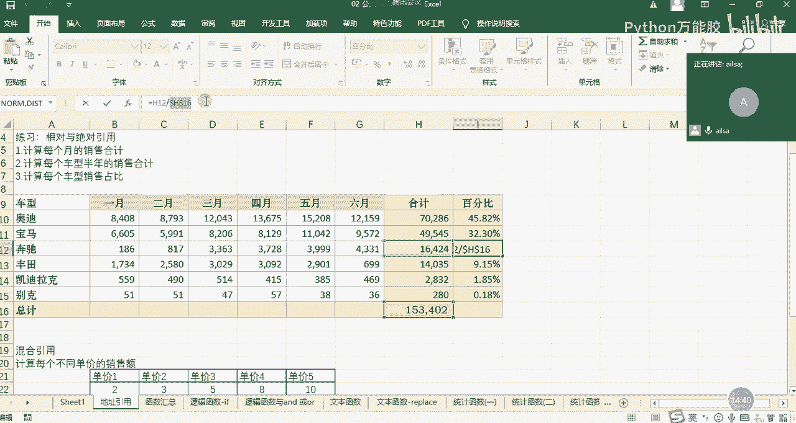

他的一个形式就是高乐福的啊行和列上都有添加嗯。

OK啊啊同志们啊，对于绝对引用，大家还有什么问题没有啊，如果没有问题给我扣个一啊。

好的，没有哈。好的。嗯，那我们讲完了相对引用，讲了绝对引用。接下来就讲一个最难的哈，什么呢？叫呃混合引用。嗯，O那我们还是结合一个业务场景去讲解。

我们看一下我们看一下这样的一个实例哈啊，这样的一个实例，就是说哎我们有时候对于产品定价的时候拿不准。所以说我们会有很多个产品的一个定价。然后呢，我们想看一下在不同销量的情况下，它对应的销售额是大概多少。

也就是说啊公司大概能赚多少钱，类似类似于这样的一个需求。那你想一下，我呃我首先要说明第一个点，就是说我们在对于嗯我们在对于一个公式的或者是函数的使用的时候，一般情况下，比如说这种连续性的区域哈。

我们只会在一个地方输入完公式之后往下拖动，往右拖动，然后就可以实现了，我们我们没必要一个一个去输入函数啊，这样的话太不智能了，也不利于我们整个的一个工作效率的提升。所以说我们在这里计算销售额啊。

在这里面输入一个公式之后，我们希望说它能适用于整个的一个连续区域嗯。

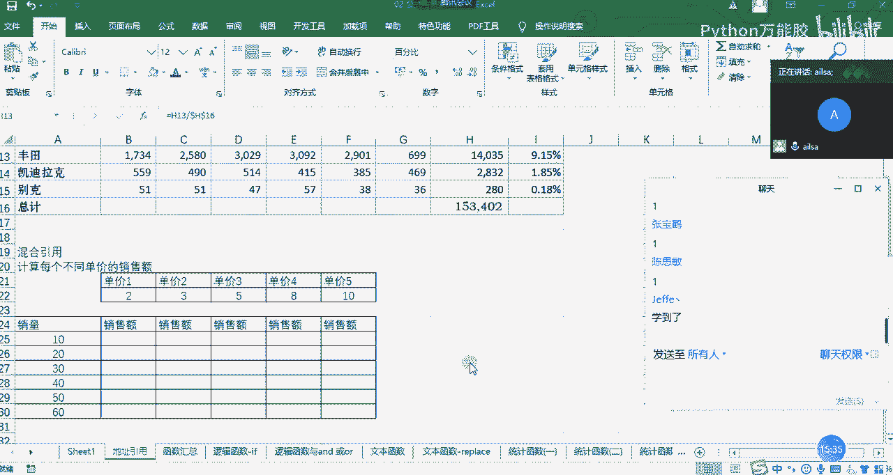

那我们看一下我们的销售额该怎么来计算。首先我们都知道销售额是单价乘以销量，对吧？那这里我直接用简单的公式就可以实现了，单价乘以啊我们的销量。输入完了之后，这个时候我们现在什么情况都不考虑。

我们直接往下拖动。啊，往下拖动。这个时候我们会发现有问题哈。没关系，有问题我们可以去分析到底是什么问题造成的啊。controrl加波浪号。我们看一下我们的销量啊，对应的是啊A25。我们的单价对应的是2。

那我在往下拖动的过程当中，我其实是希望我的销量随之发生变化。但是我的单价我不希望它变，对不对？但是其实我没有我们没有给它进行一个高乐夫的添加，所以说我们在往下拖动的过程当中，发现我这个单价也往下拖动了。

所以说我们需要给单价加上一个绝对引用的符号。

哎，那我们这里把单价是B22，所以说我们在B22这里加上道乐福。刚才有人啊刚才可能大家在操作的时候都是一个个添加道乐福的，比较麻烦。在这里给大家给大家介绍一个快捷的方式啊，按F4啊，按一次F4。

大家看一下就已经全部添加上了。那如果你再按一次F4，我们可以再看一下哈。哎啊数字前面加到道乐福，我再按一次F4啊，字母前面加到道乐福，我们再按一次F4哎，没有道乐福了。

所以它可以在呃整个的一个呃就是行和列方向的一个加道乐福的这样的一个切换啊，所以F4啊这样的一个快捷方式啊，大家可以去使用一下。那我们啊说回来我们把单价定到绝对引用了之后，我们再往下拖动。

我们再往下拖动OK2040啊，60没有问题。那我们这一列已经实现了我们想要的操作。接下来我们是不是想让它往右拖动啊，我们先不看我们这个公式到底对不对，我们直接拖动看一下它会达到什么样的一个效果，哎。

拖动了之后呃，2060唉，不对啊，对吧？应该是哎3030，这怎么变成40啊，这好像不太对哈。那我们看一下它的公式里面到底是什么内容。那我从这里啊，B22乘以我的销量是没有问题的那我再往右拖动的过程当中。

我是不是希望我的单价，哎，单价列发生变化，对不对？但是我们要同时满足向下拖动的时候，行不发生变化。那其实就是说啊对于单价而言。

我们只要对啊行加上绝对引用就可以了。列我是希望它发生变化的。所以我们这个时候需要在这里面进行一个更改。我们的单价把列上面的这个高乐福去掉。我在往右拖动的过程当中，希望它发生变化。OK我们改完了之后。

我们再往右拖动。

我们发现果哎好像不太对哈，这值没这么大，怎么还不对呢？我们再看一下啊，我们再看一下这个呃我们既然这个单价从B22到C22到D22okK没有问题，是我所想要的效果。接下来我们再看我们的销量，销量是A25。

我往右拖动了一列之后啊，它变成了B25。那B25其实不是销量，那就销售额了，所以会越乘越大。那这个时候我们就在想。

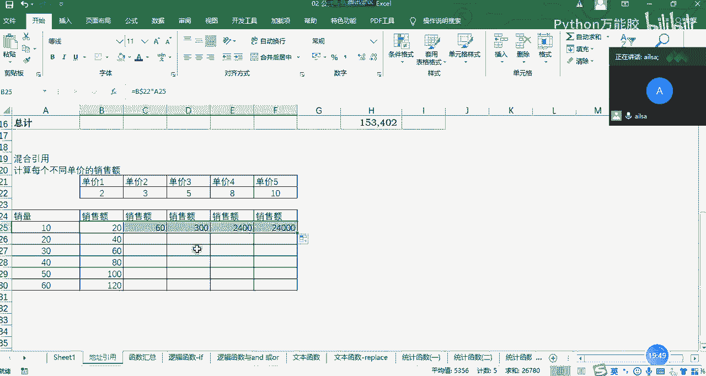

对于销量而言，我们想要实现什么效果呢？那就是销量，我们在往右拖动的过程当中，不希望它列发生变化。但是我们在往下拖动的过程当中，是希望它行发生变化的那也就是说哎我们在这里的时候。

需要对它的列进行一个道乐福的添加，那我们再回来，然后在呃我们的销量的列方向上加一个道乐福，然后再按entt键，然后再往右拖动。

哎，好像没有问题了，对不对？然后我们再往下拖动。OK这这60乘以10啊，60对吧？这已经是没有问题了。然后我们再回到我们的公式这里啊，我们可以看到对于我们的单价而言，我们希望它列方向方向发生变化。

但是行方向不变。所以说我们在列方向没有加道乐夫行方向加了道乐夫。那对于销量而言，我们希望它列呃行方向是变化的，所以说行方向没有道了夫。

但是列方向我们是不希望它发生变化的所以列方向是有道乐夫的那像这种根据实际情况的行或列啊，前面加道乐夫的情况，我们称之为混合引用。那混合引用在我们的实际当中啊，有什么特点呢？

其实就是说啊时时务者为俊杰哈啊顺应时代的变化啊，来满足各种需求啊，这样的一个啊非常灵活的一种操作方式哈。所以说这就是我们的混合引用OK。

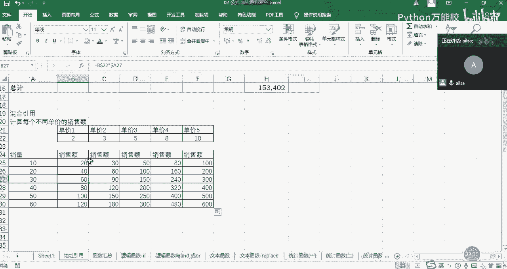

啊，同志们混合引用，有不不明白的地方，然后可以啊说。然后如果都没有问题扣1。好的，应该我这一块讲的算是很清楚了啊啊比较清楚了啊，所以说大家只要记住一点，你不想让谁不想让谁动。

你就给它加上小别针就可以了啊，基本上我们用的比较多的还是啊那个绝对引用和相对引用会用的多一些哈，混合会少一些，因为它比较难啊啊啊，所以这一块的话一定要掌握。因为我们在后面使用公式。

使用公式或者函数的时候，多多少少都会用到引用这三种方式。OK那我们再来总结一下哈啊总结一下我们的啊地址的引用。

地址的引用我们会分三种啊三种，一种是相对。引用。一种是绝对引用，还有就是混合啊引用。大家一定要听明白了哈，因为我们公式与函数这部分的作业是有点难的哈。它在我讲的基础之上还进行了一些灵活的调整。

那相对引用的话就是啊啊就是说你如影随形哈，如影随形啊，你变。他就变。啊，类似于什么呢？类似于A一啊冒号。B2类似于这样的啊。这样的一个形式就是行和列都没有暴勒符，那绝对引用的话就是以不变啊应。万变。啊。

他的就是他的特点就是。啊，行和列都有道了佛。类似于这样的啊，混合引用的话就是行货列。行货列会存在道勒佛行。啊，叫实时。实时物者啊为俊界，非常灵活啊，行扩列。啊。存在遭了佛啊。存在道勒夫，类似于这样的啊。

类似于A啊道勒夫一或者是。打乐福。A一啊这样的一个形式，含活列会存在一个道勒符。嗯，那就就是我们这三种引用的方式，大家一定要掌握。OK呃，我看一下哈啊，9点半我们要休息一下哈，我先把视频断。

