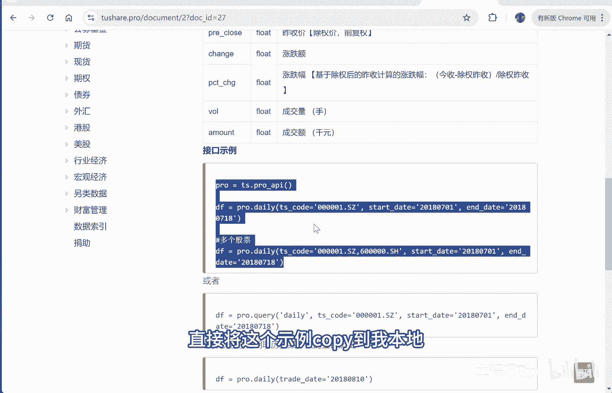
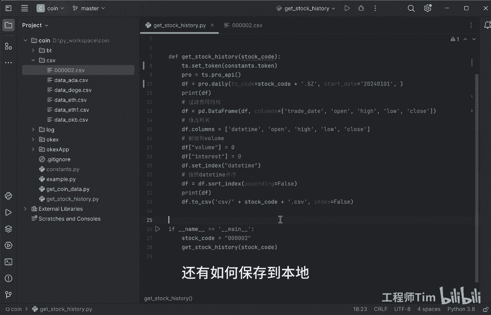

# 【python量化学习】如何获取股票行情数据并保存本地 - P1 - 工程师Tim - BV1Hbxke5EZY

获取股票行情数据的方式有很多种，我一般采用to share的方式来获取股票行情数据，这就是to share的官网，to share点bro，这里有一个数据接口，可以看到这里有各种行情数据的调用方式。

沪深股票行情数据日线，这就是获取顾A股股票行情数据的调用方式，采用的是to share，他这里有示例，直接将这个事例copy到我本地就能运行。

这里我已经copy好了嗯，先初始化to share，然后调用直接daily填入你的起始时间，2024年1月1日，然后把数据获取出来，然后打印之后呢，过滤我过滤出有用的列，对我来说有用的。

有交易时间开高低收，然后呢我改列名，把trade date改成date time，然后其他的这几个也改一下，我新增了两个我自己感兴趣的列，一个是volume，一个是interest。

后期我训练的时候能用到，然后设置index是date time，升序是date time升序，然后打印出，处理后的数据最后通过data frame，也就是pandas的data frame。

转化成CSV数据保存到我本地，我们来运行一下，好的运行成功，再就是打印的数据之后呢，会将数据保存到我本地CSV下面的00002，我们打开一下，这就是我们刚才获取到的数据，有date time，开高低收。

还有volume和interest，我自己的两个列，全部的数据已经保存到我本地，这样呢就避免了每次都从网上获取数据，我如果我后期训练的话，可以直接采用这个0002点CSV里面的数据，来进行学习和训练。

这就是获取股票行情数据的方式，还有如何保存到本地。

