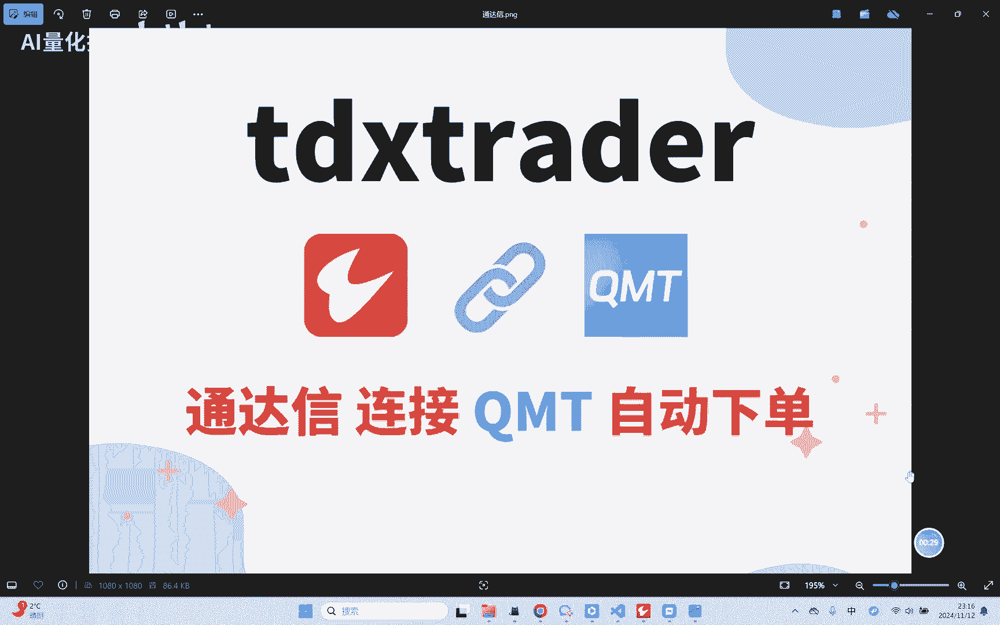
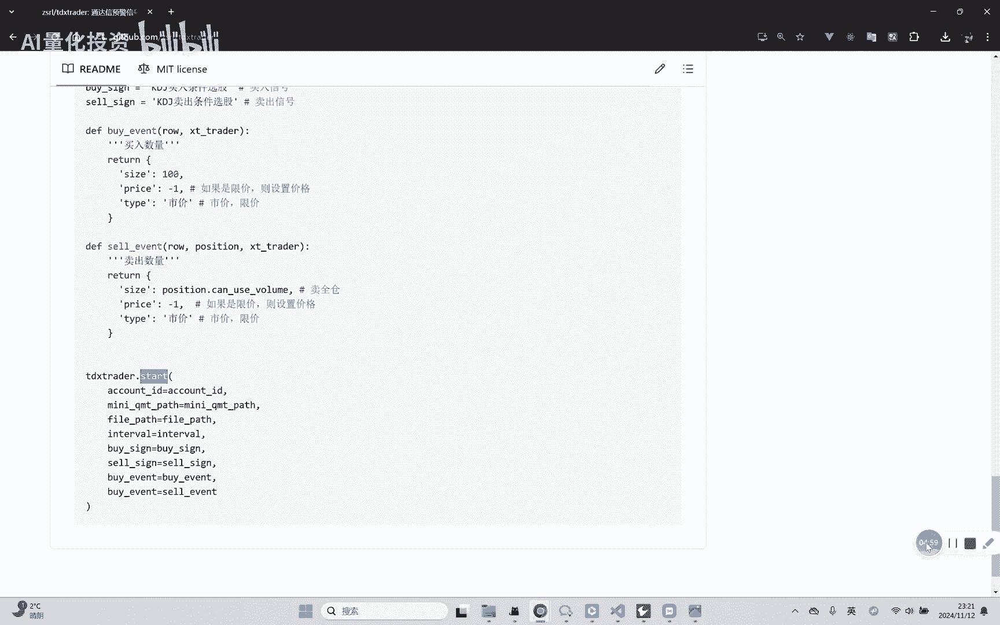
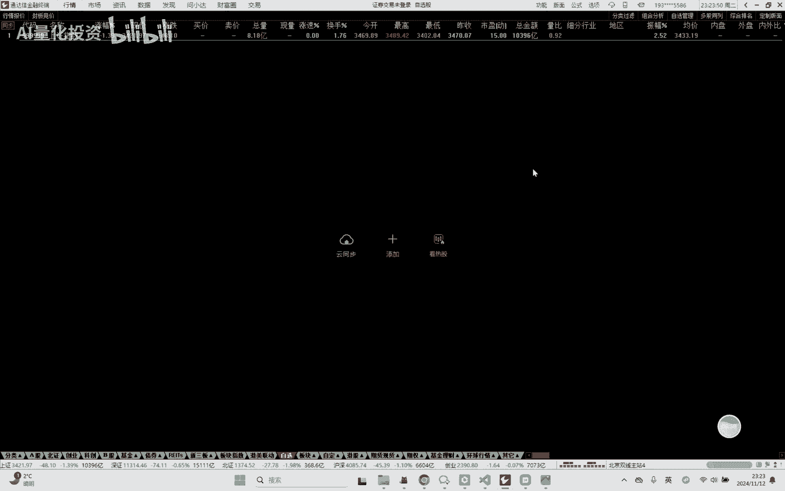
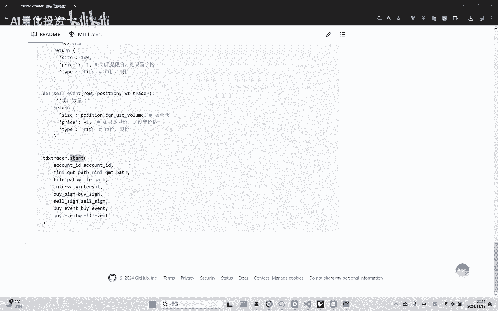
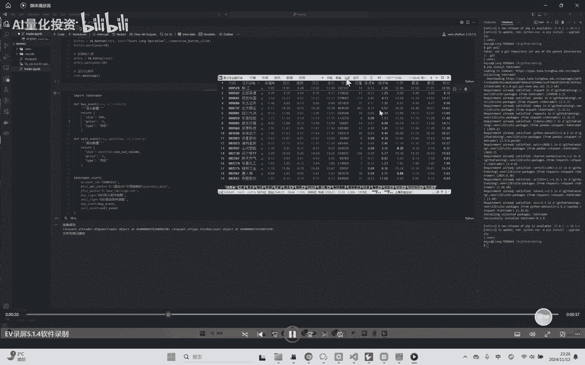
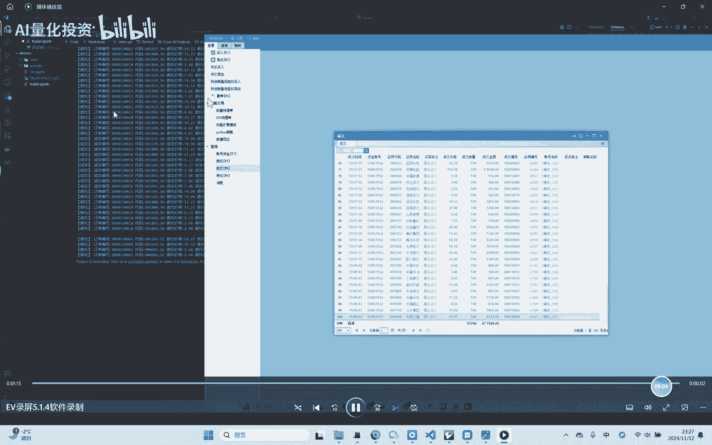
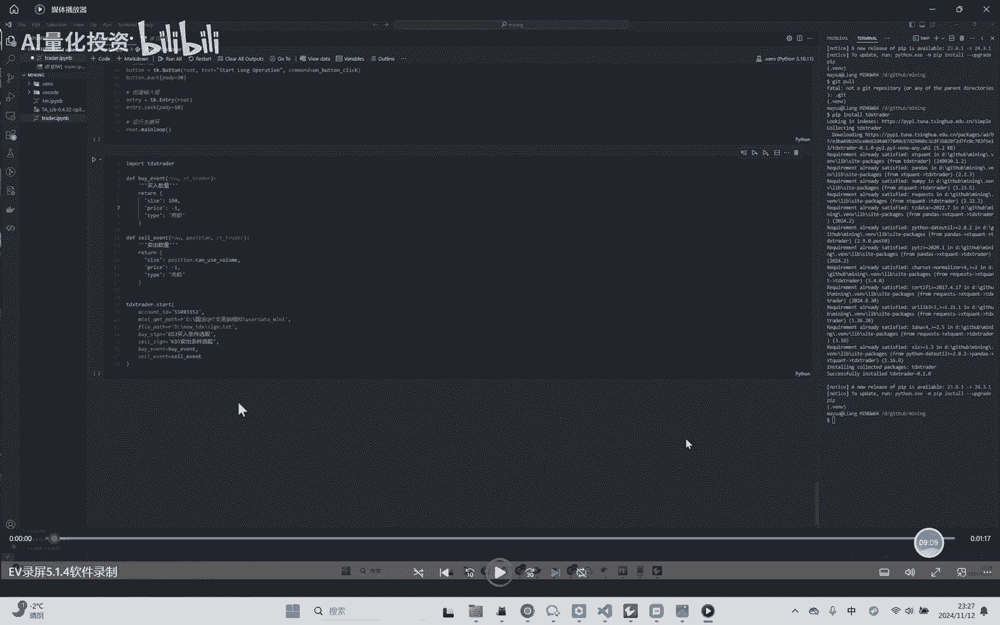
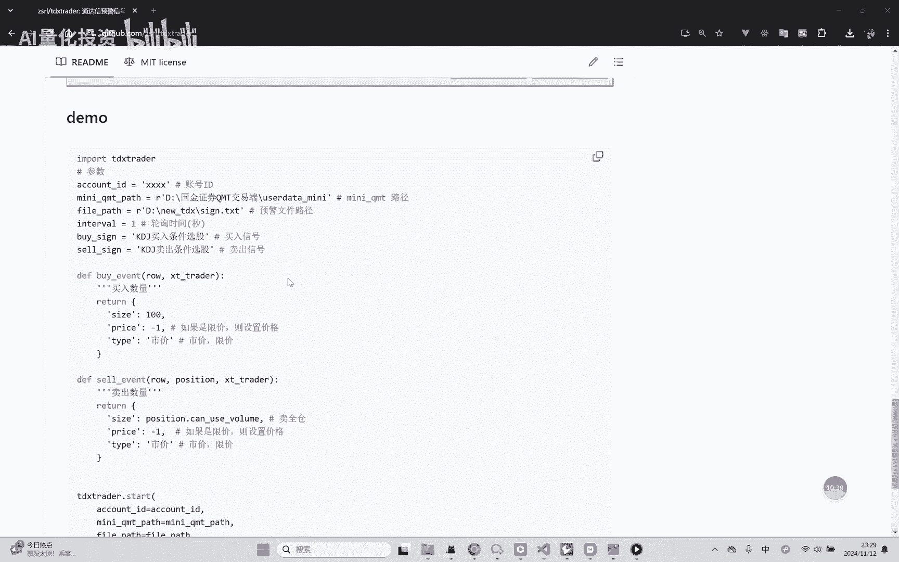

# 【tdxtrader】通达信连接QMT自动化下单（开源免费） - P1：20241112_231624 - 量化投资技术 - BV1JnmhY2E9d

大家好啊，这个视频呢介绍一下如何用通达信连接QUMT，进行自动化下单啊，这个问题呢也是一些粉丝朋友，经常与我讨论的啊，嗯然后我索性就做了这么一个TDXTRINDER，的这么一个库来解决这个问题啊。

然后这个库呢现在也是开源到这个GITHUB上啊，大家都可以免费的下载使用啊，嗯然后我这个视频呢就讲解一下这个库怎么用，以及通达信连接k mt的一些原理啊。

嗯首先呢还是看一下这个那个GITHUB啊，GITHUB上面这个库我已经开源到这了啊，然后其实通达信连接PMP的这个实验，原理也不复杂啊，就是我们用通达信里面的一个功能，叫条件预警啊。

一会我们可以来去实操一下，然后这个条件预警呢会嗯，根据你设置的这个条件预警的公式呢，产生这个相关的预警信号啊，然后我们可以把这个预警信号呢，就作为我们的一个买入和卖出的信号啊，啊让QMT监听啊。

那这里呢啊其实可以因为通话信，它可以把这个预警信号的结果，写在一个文本里啊，然后我们只要嗯那个及时的去读，这个文本里面的数据啊，就可以让QMP这边监听到，大概就这么一个原理嗯。

这个实现过程也不是很复杂啊，感兴趣的话可以看我这里源码的实现啊，然后我这里呢就主要讲一下怎么使用啊，首先还是通过PIEB去安装啊，这个包我已经发到了那个PYPI上，大家就通过pig本就可以安装了。

然后这里呢在使用之前呢，还是要在通达信那边先设置一下啊，一会我们去实操一下这个步骤啊，首先是预警指标的设置，我们这里呃设置两个，就是一个一个那个木模拟我们买入的信号，一个模拟我们卖出的信号啊。

嗯然后这里的是我只是例子啊，实际上的话呢应该是你自己的买入条件，买入条件形成的这么一个选股啊，咳条件的公式，然后进行一个买卖啊，如果是呃用通达信的老手呢，应该知道这个东西怎么做啊。

然后嗯条件设置完之后呢，就是预警文件的，这里面其他设置里面有一个选项要勾一下，就是这里面的将预警结果输出到文件，然后这个文件呢要自己创建一下啊，然后这个路径啊就是在我们下面的程序会用到。

那然后我这个库用起来也很简单，然后这里呢还是把这个东西呃，把这个库引引进来啊，然后哎我把字放大一点，稍微放大一点这个字啊，然后这里呢就是呃，首先呢还是需要你的这个q mt的账号和路径啊。

嗯这个之前我们在那个讲QMP的视频里，讲过了啊，嗯然后这个feel pass呢就是你刚才我说的这个嗯，嗯这个预警文件的路径啊，然后轮询时间呢这个写不写都行啊，默认就是一。

如果如果你想啊更快或者更慢的话呢，你可以调整这个东西，然后这里的买入信号，卖出信号，这两个这两个变量呢，就是我刚才在诶，在这里设置的这两个公式的名称啊，再往下设置呢，就是要设置一个额。

买入事件和卖出事件的这么一个方法啊，这个方法呢我们要返回三个值啊，一个是size，代表你要嗯嗯买入或者卖出的份数啊，他这个是100的整数整数倍嘛对吧，然后这里呢type呢就是有两个值，一个是市价。

一个是现价啊，这个是k mt里我们规定的嗯两种报价方式啊，我这里都封装了一下，我们这里传汉字就可以了啊，这样比较好记啊，然后如果你传市价的话，那就是呃随市价成交嘛，你这个那个那个价格可以设置成一啊。

如果你要是设置的话是现价的话，那你要是传价格的啊，大概就是这么一个过程，然后卖出也是一样的啊，卖出这里你可以拿到你持仓的这个嗯，额智商对象，然后如果你想卖权商的话。

就用这个你可以卖的这么这么一看UZONE了，这么一个变量就可以了啊，这大概就是这么这个一个API，然后下面我们这里封装一个star方法，把我们刚才设置的各种变量和方法传进去，那这个就可以呃。

可以使用了啊，嗯一会我们会给大家看一下，这个实际演示的一个效果啊。

嗯然后我们来看一下这个通达信啊，通达信里面我们刚才说的这个条件预警在哪呢，在这个功能里面，功能里面这个呃预警与复盘，这里面有这个条件预警设置啊这么一个东西啊，这里就是如果呃首先你得添加品种。

比如说我们这里嗯添加嗯，嗯按指数吧，比如说我看一下，那就创业板吧，假如说把创业板的全加进来嗯，这好像能那个全选啊，这有全选嗯，加进来，这是我们要预警的品种，然后预警公式设置，这里要添加各种各样的公式啊。

你可以比如说刚才这种啊，你就可以自己添加两个，一个代表一个选股的买入公司，一个代表卖出的，对吧啊，我这里随便选，这里的公式有可能嗯在大家实际用的时候，是肯定是你们自己嗯设定的。

肯定不是它自带的这种公式对吧，肯定是应该你自己设定的，你的买入额，你的信号条件咳，然后在提杀设置里呢，这里就要勾选这个勾选，勾选这个嗯，输出到文件之后呢，这里会这里会弹出这个文件夹，这个文件夹那里面呢。

其实嗯应该创建一个啊啊，比如说我们这里就叫嗯，信号那TXT他TXT格式的啊，然后啊就这样就行了啊，嗯然后他就会问你启没启动，你启动，嗯嗯嗯然后这里的话也是在提醒你要补全公式，补全那个数据啊。

因为有些公式他要立要使用这个通通达信的，盘后的历史数据的，所以这块儿呃用用通达信的，你可以先下载一下数据啊，嗯要不他每次都会有这个提醒啊，那这里我就不下了。

因为我只是演示一下这个过程啊，嗯然后我们在使，在运行和使用这个程序的时候呢，还是要先打开QMT啊，因为他这个交易是基于q mt去嗯做的，嗯我们最好是先打开QMT，然后运行这个程序。

然后再嗯嗯打开我们的通通达信的预警信号啊，因为这个程序star这个程序一旦跑起来呢，它是它是一个是嗯一直在执行的啊，会啊只要你不断开呢。

它会一直监听啊，嗯然后我给大家看一下，我这嗯因为现在是非交易时间嘛，我在交易时间呢用那个QUMT的模拟盘呢，对这个程序做了一个测试，嗯然后呢我给大家演示一下啊，嗯因为我当时录了个屏给大家看一下啊。

嗯首先呢就是呃跟我们的例子很像啊，然后运行起来把这个程序运行起来啊，首先我这个现在QMT是正常运行的啊，那嗯然后这里打开这个通达信，打开通达信之后呢，我们嗯这里可以看到。

因为我这个通达信启动了那个预警信号，就默认启动啊，然后他这个啊，因为我这里就是一些嗯它默认公式嘛，所以他这里信号会比较多啊，这个信号出现之后呢，这边就会进行一个委托下单啊。

这个委托下单其实已经打到这个PMP里了，嗯然后你可以看到这有成交啊，因为是那个嗯模拟盘嘛，所以模拟盘基本上委托他都能成交啊，可以看到我们下单的这个记录呢，都会在这个嗯k mt里出现啊。

然后啊成交记录里也有啊，那说明我们从嗯通达信的预警信号呢，到PMT的这么一个嗯程序化下单的过程呢，就完成了啊，嗯这就是嗯这个工具的一个演示的效果啊。

嗯所以。

嗯所以这样就比较简单了，就是大家不用关心这里面的一些呃细节了啊，然后把这个封装好了，嗯只是传这些相应的指标啊啊参数啊，去调用一下就行了，然后再就是呢就是这个东西，大家如果用的时候呢。

最好还是那个拿QMT模拟盘啊，啊就是嗯好好测一下啊，因为呃我这个东西也是自己写的，也不保证有什么问题啊，所以还是用呃QMT这个嗯模拟盘多去呃，在实盘中啊模拟测试一下啊，然后再去呃谨慎的上实盘啊。

这么一个嗯小的建议吧，啊然后如果这个使用过程中用到什么，遇到什么问题，可以在嗯视频啊，或者是嗯嗯知星宿啊，来联系我啊，跟我说反馈一下这个包括GITHUB上啊，反馈一下有什么问题，然后因为是开源的嘛。

有什么问题我也可以及时解决和更新啊，嗯最后呢就是提示大家这个嗯投资有风险，然后嗯做程序化交易呢还是要慎重再慎重啊，然后嗯我的这个库呢也不造成额，任何的投资建议啊，请大家谨慎使用啊。

好那这个视频呢就到这里啊。

