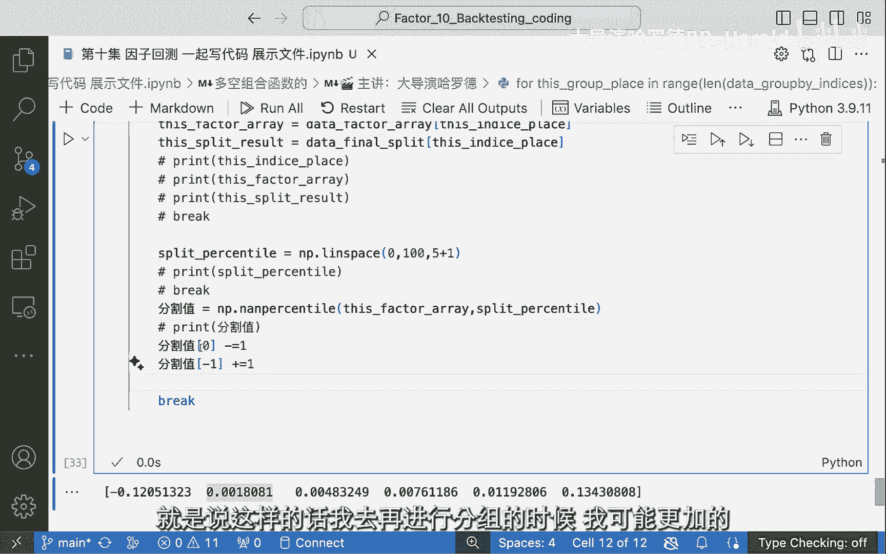
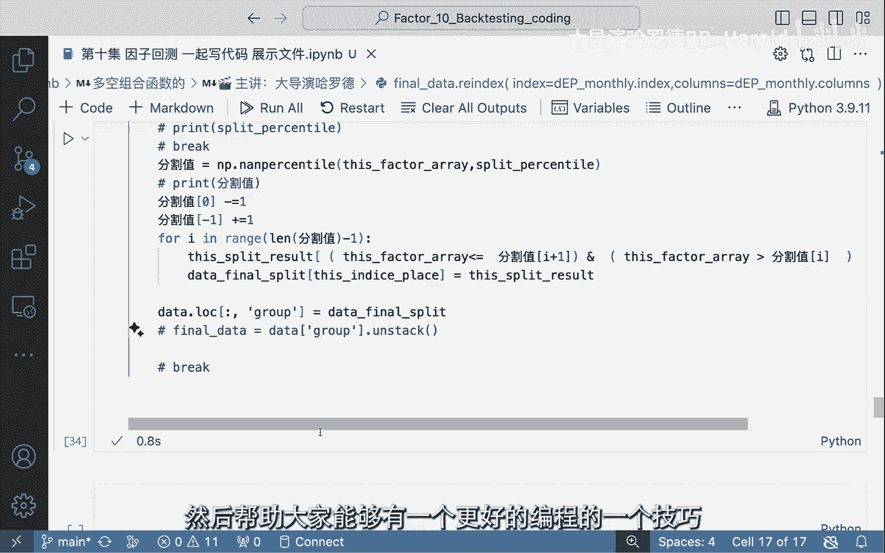

# 【因子实战10】Python代码实现因子分组（40分钟完整版） - P1 - 大导演哈罗德 - BV14q421w7Wq

好我是大导演哈罗德，欢迎回到我的量化频道，然后这一期呢我们先来看一个函数，首先同样的方法，我们这一期来把我们的这个呃，就是因子回测包的这个代码的一个非常重要的。

也就是这个group return它是怎么来的，但是在此之前呢，有一个factor group这个数据集是怎么样啊，从最开始的这样的，我们这个第一拼因子的一个monthly的一个值。

到我的一个monthly的一个分组，所以说大家看我们这期输入的一个数据集，是这个数据集，也就是每一个因子，每个月堆每个股票的一个值，我现在要做的不是对每个月的这些值，进行一个分组。

我要把它每个月分成五组，然后我要返回的呢就是这个值不再是值了，而是大家想想返回什么比较合适，而是12345，因为我要把它分成五组，所以如果你分成12345之后，我去对应它的收益率的时候。

我就更好去对应了，现在的话呢就不太好去做，那其实如果做这件事情，大家会觉得好像听起来很简单，因为你其实如果有一个函数，它可以直接的把它自动的呃就弄好不就好了吗，但是如果的确我觉得肯定可以有这个函数。

Python一个非常好的方式，方面呢就是它可以封装，大家就可以把这个函数封装起来，但是也是我为什么上节课就是把这个过程啊，直接呢就给大家呃，没有给大家展示，但是后台呢就有人私信给hello，就说啊。

那你其实呃没有把你的听众定位清晰，你的听众呢更多的呢就是一些对量化感兴趣，但是呢嗯可能有些编程经验，或者是可能有一些金融经验，半懂不懂量化的，那如果是对于这些同学来讲，那他没有看到中间那个代码写的过程。

我认为还是呃比较不能够理解这个整个代码，它是怎么样从这样的一个数据集，变成一个我们最后想要的数据集，首先呢我这节课，所以说我这节课想要做的事情，就是一步一步带着大家去把这个呃代码写完。

那可能呢因为时间会比较长，我会去把它分成三四节课的样子，然后一点一点的大家走起来，然后大家也可以在看我的视频的同时，去做一下自己因子的这样的一个呃实现，跟着一个空的这个notebook。

然后我觉得在这个过程中，大家还是会很有收获的，我首先呢先把我的这个COPALETTE给他disable掉，为什么，因为我想一点一点的给大家啊，这个展现出这个代码是怎么写的，而不是要去用它来啊，告诉我。

首先我想给大家看一个函数叫stack，首先大家看一下，我这个还呃这个数据极限长什么样，他现在是这样的，但是呢我觉得在写函数的时候，这是我的一个习惯，也是我会推荐大家去掌握的一个习惯。

就是我们要一个月一个月的去做一个事情，我们想想我们的结果，我们从结果出发，我们结果呢是想把每个月的这样的一个因子值，转化成01234或者就是12345，我们把它打一个标签，它到底是属于第一组呢。

还是属于第五组，如果是这样的一个情况，大家想对于这个数据集这个data frame，它是一个这样的一个143×5000，543的这样一个，我们说它是一个matrix，但是我现在呢是想要把它进行。

每个月进行一个因子值的处理，首先我们来看一下这个stack函数，哎呀这个stack函数做的是什么，大家会发现它能去把这个一张饼相当于摊开了，也就是如果我们先来看看，它能不能进行一个数据的索引哦。

它能它的第一个值呢就是这个，也就是说我的日期是第一个日期，也就是我第一个月月底的第一股票的第一个值，然后呢他呢就相当于把这个成绩给摊开，所以我呢就可以把这个数据一个一个啊去进行，我想要的一个处理。

首先这里面呢我先去定义一个值，也就是我最后想去获得的一个data是什么，大家如果用这个pd data frame来把它先做一个，从头到尾的一个命名，那首先index应该是什么index呢。

我觉得呢他就可能要有不同，不不止一个index，像这个呃stack它本身的index，如果大家把它打印下，大家会发现哦，它是一个MOTINDEX，为什么有moti index。

因为它每个INDE第一个index是时间，第二个index呢就是这个股票的代码，所以如果我们把这个multi index给它提取过来，我们学着他这个moti index来呃，做一个处理的话。

我们呢就是把这个from product去，把他之前的两个index给它做一个呃整合，那是哪两个index进行一个整合呢，那也就是d e p monthly，它的一个index和大家想想是什么。

它的一个音带，它的INTEX这个数列的，那这个我们叫做什么，在data firmly叫做它的columns，所以说这样的话，我们就把这个第一批的columns，作为他的第二个啊index。

那这样的话呢我们就有了我的这个哦，我忘记用这个pandas的这个包，所以说这个函数是调不出来的，必须前面有个包才能把这个函数调出来，然后他也给了我一个提示，然后OK这样我们已经有了啊。

这个这个这个这个两个index，那两个index我们总要有给他们有一个名字吧，所以我们用这个names，来把我这个index来做一个命名，那很明显第一个呢就是时间，第二个呢我把它定义为asset。

为什么叫asset，asset呢，就是它的一个呃相当于股票嘛，股票就是一种asset，然后这也就是一个命名，不是重点，OK大家会发现我这样的话呢，就相当于我我怎么说呢，我重启。

我把这个我最后想得到的一个值和这个的stack，大家会发现这个是我现在有的这个值，我把它stack一下，它是一个什么样子，如果我去把它用data frame来给装一下，它也会是一个类似的这样一个结构。

那我现在想要的是什么，我现在把想把这个因子值拼接上去，这样的话大家会发现它是一一对应的对吧，这是我最后想得到的一个data，然后下一步我要做的是什么，也就是我刚刚做的这个第一P点stack。

大家想想这样的话它会得到一个什么样的结果，他们就会把这个因子值对应着它的这个index，给它拼接上去，这也就是其实我觉得是pandas的一个好处，也是一个坏处，它的好处呢就是在于它非常的智能。

它有很多奇啊奇奇怪怪的函数，可以让你去做很多的啊有趣的设计，但它的坏处呢就是在于它可以，它就会让你去啊，这个这个很混乱，因为你不知道这个函数万一可以这么用，万一可以这么那么用。

但我发现其实我这样做做错了，为什么呢，因为我直接把它复制出来了，所以说他现在不是一个data frame的形式了，所以其实这里面呢我应该要有一个命名，那这个值应该命名成什么呢。

如果大家跟得上我的思路的话，大家可以随时暂停，然后自己想想，这里面就应该是个factor啊，就是我刚刚的那个factor职位，应该把factor这一列定义为他的这个stack。

所以而不是把整个数据集用完它，OK那根据这样的话，你看大家看这两个呢是我们的index，然后呢这个呢就是我的一个factor，然后大家也会发现哦，也是跟我们想的一样，也像这每个股票我想要包含。

可是他不可能每天都有这个因子值，那如果没有这些因子值的这个股票，我应该怎么办呢，那也就是一个很简单的一个，如果听到这里，大家应该对这些函数都应该是比较熟悉了，就是drop now对吧。

然后所用的一个subset是等于什么呢，因为如果你光照p none的话，他应该会把整行全是NT才会把它照P掉，也有可能不是这个的话啊，这这个翻译其实我我我也不可能，所有的函数应该怎么做都能记住。

但是我知道每次我该用什么函数的时候，我我我我知道要去哪里找，我觉得这个呢也是我们整个想要写代码，能写出的一种感觉吧，OK那data等于data的job，nn subset等于factors。

这样之后我们能得到的就是一个，我们现在想想一想哈，我们跟着我的思路，我现在有了这个factor，我现在想得到什么，我现在想得到一个12345对吧，大家还记得我们当时的目标吗，我们想把它分成五组。

那分成五组的话，我要怎么做呢，也就是我要再加一个，比如说group一个column，那这个group column它能做到的一个结果呢，就是可以把这个事，比如说他们就在第一组，他们就在第二组。

我如果能得到这个让大家想，我既然能用stack，那肯定能on stack对吧，那on stack我就直接把它变回了一个嗯，我想要的一样这样的一个数据集，这也就是我想达到的这样一个目的好，那在这样之后呢。

大家会发现我想要去呃做的事情是什么呢，也就是我要写一个函数，我要define一个函数，这个函数的目的是什么，它可以input这个data，它的output应该是什么呢。

它的output呢就相当于是有一个group column，可是要完成这个事情是要用一个for loop的，要用一个group bi，为什么要group by，大家想想我肯定要group by这个I啊。

这个date对吗，我每一个date我进行同样的操作，来进行一个group，还有一个什么呃需要做的，我需要一个PRESENTAL，大家想是不是这个道理，因为我需要有一个百分比嘛，就是大家想这种分组。

一般我觉得学过统计的，大家都知道，他的逻辑就是我找那个twenty percent啊，twenty percent personnel和forty percent。

personnel和sixty percent personnel，然后把它每一个personnel找到之后，属于每个这个比例中间的，它就属于第几组，我其实第一个想要的是什么，我不想。

首先我一定要把这个factor这个值拿到对吧，那我怎么把这个factor值拿到呢，那我就把这个data的factor dray把它先给定义出来，它是一个什么值呢，它就等于data factor。

然后点什么呢，大家想想点value什么对吧，这样的话呢我就会把他所有的value给它拿了出来，那我个人习惯就是每一行每一个函数，我们先把它看一下，大家看这个的展示有点迷惑性。

它让你感觉他这里面只有一个啊，就是一个AA，但如果大家用这个line函数来把它打印出来的话，大家会发现哦，他有四这个这个这么多万，那这么多万个是什么意思呢，哦也就是说它有这个所有的这个factor的值。

从上到下好，大家发现如果我这么做，我丧失了什么，我得到了所有的factor的值，但我丧失了它属于哪个组，我得要我不能弄乱了，弄乱了对吧，我要弄乱了就就就就不好了，因为我要弄乱了的话。

那那那那可能后面就会出问题，所以我下面一个想去做的事情，除了这个data factor aa，我现在想说的呢是呃，我想有一个这个group group呢，是为什么。

大家如果对这个goodbye这个函数不了解的话，大家可以去这个呃pandas document，去找一下他的这个goodbye函数，因为我觉得goodbye函数还是很重要的。

所以大家能知道它应该是什么吗，the index大家也知道它是个MOTINDEX吧，我刚刚说了，就是它是一个MOTINDEX，Motindex，我有两个index，也就是说一个index股票。

一个index日期，那我们是想用日期来分组，还是用股票来分组，还是说股票和日期来分组，大家思考一下，而如果对于一个MOTI，首先这里有个函数叫get a get in a level，In deuuh。

Get level values，那get level values吗，就是因为它有两个value，就像我说的有两个name，这里我已经起好name，一个by name是date。

一个name是ESIM，那如果他有两个names的话，我get a nuo的话，第一个get的就是他的date的这个啊value，那get这个date value之后呢，我就能够得到我想要去啊。

我可以打印下来这个group大家就可以看到，哎呀这group长什么样呢，它呢就是一个OK它是一个多长的，它是一个O这么这么长的，它是一个呃，我即将去进行了一个分组，但是它里面当然有重复的。

但这个呢并不影响我去做下面的分组，那下面大家知道我最后想去做什么吗，我想去做的事情就是我的最后的结果，比如说final result，这个呢我想前面也先把它定义出来，我的final result。

或者说我的final split，为什么叫split，因为我想把它split，我想要现在大家看这个data factor array，我再把它打印出来，大家看一眼，它是一个4万多，就是它每一个有这个。

我想把这每一个值取代成什么，我不知道大家如果能回答出来这个问题，证明大家是跟上我的思路了，我想把这个每个值取代，为什么，取代为我们如果分成五组的话，那就是取代为啊，0~4或者说1~5都是一样的。

意思就是说我们要打印出它的组别，那这个data final split，我想要先用这个空值先填补一下，用一个同样的长度，那这时候呢我们就用这个NPI的这个，full的这个函数。

那它要填补的一个长度是什么呢，他要填补就是这个data factara的一个长度，但是我要做一个一维的，因为呃为此的话，我才可以去做一定的这个呃空间，可以去填补这样的一个数据，那在这样的话哦。

我好像应该少加了个冒号，还是我在错误的地方加了一个冒号嗯，还说这里有这里没有没没没有错吧，还说，哦我在这里少加了一个逗号，所以我也想把这个整个过程给大家展现出来，就是说你在写代码的时候。

你其实整个呃这个过程也是非常非常，1。1滴的去做的吗，不是说你能啊直接就把它全部都写好啊之类的，什么什么什么，你也会出现很多的bug，然后你也会一点一点的去找，到底是哪里出了问题，那接下来我们要做的呢。

就是我们要去做这个data final split，我们把它打印出来一下，我们看一下它是什么，OK那当然了，他是跟他一样的一个长度的一个呃data frame啊，对一个ERICERIC的这样的一个序列。

OK有了这个final bleed之后呢，我现在想要的东西呢，就是呃我想去把它这整个呃，我最开始有的这个data我需要做什么呢，也就是我们啊大家都很喜欢的一个函数，我真的觉得这个函数真的是。

当时我第一次知道有这个函数的时候，我是非常非常感激的感，感激涕零，无以复加，就是这个歌啊，group对吧，用我用这个group来给他一个group by，一般这个goodbye这个函数。

它有一个我觉得不叫问题吧，就是它有一个他自己的一个很有意思的事情，就是它是一个object吗，它是一个对象，所以说它是打印不出来的，那你其实这样goodbye之后，你有没有轱辘不对。

就是你当然你知道你现在是用这个index，是用这个dindex date time index来进行一个goodbye，那你用这个goodbye之后呢，你有没有把它啊，所谓的这个好好的把它打印出来。

那一般来讲我觉得这也是我的一个技巧，就是我喜我非常喜欢这个方式，也就是date goodbye，大家知道这个用这个goodbye函数，我如果把它遍历出来的话，它是有一个AI会是什么呢。

I是一个一这个每一个这个GROUBYE的，这个按照GROUDBYE的一个点，所以说其实这个group里面会有重复的点，也不会影响到它的这个group by函数的应用，它只会应用这个group里面呃。

所谓的这个啊这个in啊，就是独特的叫做呃unique的一个标签，来去把它进行一个goodbye，那根据这样的一个结果的话，大家会发现OK我for i in data啊，Goodbye。

我去把他i print出来，我print i有意义吗，当然我当然不会去，每一次都把它那么长print出来，我也不是啊，有这样的想法，那其实这个函数如果不知道的，我给介绍给大家。

也是我认为非常非常呃好的一个函数，就是goodbye之后的复数的一个函数，就是get group，所以你可以理解为他这个函数所做的，当然你要是这样点两下，它应该会的跳出来这个这个函数的用法。

那这个goodbye的一个函数，它就是去字面意思嘛，就是去group你这个data frame，那就像是我说这里面是有一个multi index的概念，但如果是有一个index的话，那就更加清晰。

它就是根据这个date，因为我们要做的就是用这个date来啊，来来来来来给他进行一个啊分组，那我们下面想做的就是get group，get group什么IO我这里出了一个问题，为什么有这个问题。

因为我如果for i in data group，我打印出来呢，就是呃不太一样的一个点，那如果我现在打印的是否点，这样的话打印出来的又是另一个内容，大家看他打印出来呢就会说哦，他这样的。

如果点点group的话，他这个I呢就是这个group index，它会把这个分开来，而不是说如果你没有这个点group，它打印出来的呢，就会把它呃两个连在一起。

这样的话你这样的话你就不能就get group i了，这样的话就不行了，所以说这个时候在后面呢最好呃不是最好，就是必须要加一个点groups，但如果你是啊for i in a的话，你如果把挨打出来的话。

你就可以直接从A的第一个来把它诶，为什么绿了，为什么绿了和print诶，怎么会绿了，好神奇，和他的哎呀，这么会绿了，和他的第零个也就是所谓的这个index，然后呢它的他的第一个诶，但我们把它一个去掉。

然后分啊，你看它的这个第一个值，所以说它应该是一个tuple，或者是一个应该就是个top吧，所以说tube你也是可以去index的，就是他的第一个值就是它的这个呃时间。

也就是我group by的一个time step，然后它的第二个值，然后这个标签是一嘛，那就是这样的一个因子，但是我们如果加上了这个their groups，那就是另外一种方法了。

我的I呢就会直接变成它的，他的这个group的这个index，然后呢它的这个get group点I呢就会变成它的呃，这个因子所对应的值，那接下来我还可以去做一些别的打印，但是这个呢并不是我们想做的事情。

我们有了这个group by函数之后，我们后面呢可以做很多很多事情了，那我们就接着往下来，我们有了它之后，大家想想，还是那句话，我们最后想得到的就是一个final sway，我希望把它每一个值都填满。

但是大家我我我跟大家有没有说过一个问题，就是我刚刚把他所有的这个factor的值，取出来之后，我丧失了什么东西，丧失了它的顺序，那他的这个顺序是很重要的，我还是想把他的这个顺序给他啊，保存起来的。

我可以这么说，可以想把它保存起来的，那保存起来这个顺序我要用什么方法呢，我就用它的index，也就是他的这个这个这个12345的，这个这个列列的这个值，那如果是这个列的这个值的话。

大家看这个index它会是一个什么东西，我们先把它给打印出来，大家一步一步，这样跟着的话就能看出来我到底是什么，OK它的这个index呢，大家看哦，它是一个一一对应的关系。

就是每一个啊step对应了一个AI，那AI的这个值呢01234到2075，然后下面一个呢，就会接着从2076开始哦，那这时候你就明白了，这个呢就是它这个列的一个序号，在MOTINDEX的这个。

不知道是JUNOTEBOOK的问题还是什么，他不会把这个01234给打印出来，可能是为了防止冲突，因为你有两个index，我应该从这打零，然后这是一，还有就是012345。

然后这里接着往下就比较的confused，所以说他就把这个省略了，你如果去做一个一维的一个呃，呃这个这个索引的一个data frame的话，它是大家应该知道它这个左边是会有0123，45678的。

OK那在这样的一个前提条件下，我们有了这个index之后，我下一步想去干的事情是什么呢，我下一步想去干的事情就是把他的啊这个value，因为大家看这个应该是个字典，那字典的话我不想要前面的这个这个指引。

这个指引的信息我在group里面是已经所有呃，已经有了，那我想要得到的一个储存的信息，或者说就是我想储存一个list，我这个list是要什么呢，我要我这个groubye index的。

大家跟着我的思路走，the values嘛，因为所有的字典value也就是我想要的一个呃，最后的一个值，但是大家知道a value这个是一个函数，所以你必须要把它呃调用一下这个函数，它才会打印出来。

OK那大家会发现这样的话我有一个list，这个list每个list呢它就是我储存好了的，每一个啊季度每个月份，对不起，每个月份所对应的这个列数，也就是每个月份所对应的这么多个这么多。

它每一个列数应该是一样，都是2076个，因为什么呢，因为他有2076个股票，让每个股票在每个月都会逐渐O不对，我又说错了，大家想想为什么说错了，为什么不是每个都是一样多的。

是因为啊看看大家能不能跟上我的思路，能不能跟上我的思路，是因为我之前drop down了呀对吧，我在这里我去把那些没有值得来把它照P掉了，所以说它不可不应该是每一列啊，每一每一个group都是一样多的。

但不管怎么样，它还是一个啊我们最后想得到的一个结果，OK那得到这样的一个结果之后，我已经可以万事俱备了，为什么我说万事俱备了，大家还记得我要干什么吗，哼我要干的呢，就是在这每一个group bye。

我group bye好了，按照每个时间GROUBYE，我需要给他做一个排序吗，也就是说我要把它排除一个这个factor这一列，我想让它右边多出来一个group j列。

这个group j1列的值分别是012345，OK那在这样的一个前提条件下呢，我们就开始写一下我的啊，最后的这个也就是我，我最后想得到这个结果所需要去写的一个函数，其实这个函数本身在前面的这些铺垫之后。

养成一个很好的一个函数习惯，也就是说在处理所有这个因子值，不管你以后是想得到它的排序，还是说之后再加一些，比如说neutralization，一些中性策略来把它分组进行排序，我们都可以用这样的一个思路。

如果你跟着这个思路往下走，到这一点来说，已经是所谓的，我觉得是啊最简单的一个部分，那我们来看一看，我们这个最简单的一个呃部分的，这个函数应该怎么写，大家想到了好，那我应该用什么。

我应该去把那个group的啊值给它遍历一下，那我的这个便利的一个区间是谁呢，是这个DX，下面这个有奖竞猜看看日子是应该是啊，把哪个的长度给它打印进去，其实应该很多都是可以的。

但我们这里呢就用这个index的长度，为什么用它呢，因为它大家知道它每一个它是一个list吗，list是有这个长度的，它每一个长度也就代表了一个月的所有信息，那下面呢我就想把我的通过这个索引值。

就像我说的，我上面的这个把所有的值储存成了array，但是我就丧失了它的一个区分的呃一个界限，每个月的到底哪些值，可是呢我又储存了这个index index，所以我这个index能索引出我的这个值的。

所在的一个位置，那呃综上所述，这两者的一个联联联合起来呢，就是说我可以去把它的啊，这个goodbye index来把它进行一个索引，那我索引的东西当然也大家可以肯定知道。

就是我要把这个index来给他啊，塞进去，然后把它索引出来，然后下面这个呢就是这个index的group，如果我们想把它打印出来，大家也可以嗯，很清晰的看到它是一个什么样子，那我们先把它写完。

那下面呢就是什么呢，就是数据吗，数据的得到的一个我我现在要用的一个数据，那我现在用的一个数据是在哪里呢，在是在这里面吗，写在这里面吗，写在这里面吗，在这里面是不是是在这里面对吧。

是在这个factor array，就是我的所有的因子数值，储存在这个factor array里面，然后同样的我要加进去这个this group the place，然后我就把这个来给他索取出来。

然后下一个呢就是，This blee results，This splay result，什么东西呢，对，Final pk，这也没有什么好竞猜的了，因为他们是弹出来一个那同样的方式。

我还是要把它的this group place来给它塞进去，那这样的之后呢，我们如果想去啊，来看一下我们所取到的这三个东西，它是什么东西的话，大家就可以呃跟着我这样来看，我去把它这样粘一下。

就懒得去写这三个print了，那来看一下的话，我再加一个break，第一个呢就是这个index，也就是我说的这个index play，哎呀我搞错了，这个不应该去把它打进去对吧，这是个什么东西。

我应该把这个in de's place给它加剧，不是这个group group place，哎呀这什么玩意，OK我应该把这个index place再加进去，OK那index play加进去。

大家会发现这个factor array呢，就是我们这一七这个月的每个因子的因子值，每个股票的因子值，然后这个的SPA result呢，就是现在我们是用NN值来填补的，也是我们接下来要把它想办法来填满的。

一个地方，好啊，接下来我们要得到一个什么值呢，我们现在要得到一个personnel，Split，Persontile，这个speed persontile是怎么做呢，大家如果不知道这个函数呢。

我给大家介绍一下，就是叫lspace lin space呢，要做的事情呢就是呃看大家想要去分多少组，我呢就能从0~100给大家分出几组呢，如果我想把这个数字分成五组。

我现在需要从0~100把它切分成几个值，大家想一想是五个吗，不是应该是5+1个，为什么5+1个呢，因为大家知道这个六个起始点，才是我们的这个最后想要去得到的一个界限，才能去把它给分开来。

因为如果这时候我们再来试一下，大家会发现OK，那他的呢就是哦我们如果分成五份，那我们就从零到20%到40%，到60%，到80%到100%，这个呢是我们最后去啊想去得到的一个呃点。

那下面的我想要得到的一个值呢，就是哦我是20%，但是我现在呢想要一个分割的数值，为什么我要用分割值来代表，我现在要去得到的东西呢，因为我现在想要去呃，得到一个所谓的这个在在这个数据数据里面。

在这些因子值里面，我要把它分成啊五份嘛，所以这里面又有一个什么样一个比较好的函数，可以去这么做的呢，大家想想是什么，就是nine percent tell嘛，这个这个函数它能做的事情。

它为什么现在不提示给我了，是不是因为nine percent til，为什么他不提示给我，不管他，那他能做的事情呢，就是我去把我的这个factor array，和我的split personnel。

如果我把它塞进去的话，大家会觉得这个，它会是一个什么样的一个结果哦，它就是一个OK，这个呢是它这个因子里面最小的一个值，这个呢是20%的那个，这个是40%，60%，80%，100%。

那这里面我害怕他出一定的问题，因为你小于等于它大于等于它，万一这里面啊有一些所谓的这个不严谨的地方，会怎么办呢，我呢现在想到的办法呢，就是我想把它粘贴，我不想打这个字了，分割值的第零第一个值哎呀。

我去把它减一嘛，然后分割值的最后一个值，我去把它给，加一那在这样的情况下，我们能得到的一个事情，就是说这样的话。

我去在进行分组的时候，我可能更加的呃知道我要怎么分好。

那下面的事情就很简单了，我想要做的呢，就是去把这个每一个分组的一个数据给它剪，拿出来，但是大家想试试它的长度吗，其实不是因为我把它分成五组，但是它有六个值，所以说应该是它减一对吗。

这些也都是比较基本的一些Python的一些啊，所谓是常犯的错误，那我现在想要做的事情是什么呢，我现在想要去把我的这个split result，这个值里面来做一个update，它的update是什么。

怎么去做呢，我要用这个所谓的这个中间的这个呃判断条件，判断条件是什么，this factor是用哪个数据集，This factor array，我用这个数据集去干嘛呢，我如果它小于等于分割值，哎呀错了。

分割值的DA加一个，并且，它要，大于，分割值的第二个，那如果他满足这样的一个条件，大家会发现这里面有哪个语法不对对，这个and的这个语法是要两边加两个括号的，OK那如果按照这样的一个函数。

我我会发现OK这个result它所取的这个值就跟它，因为它们俩是对应的，一一对应的，所以我只要让他小于等于I加一，For i in range，如果它小于这个，并且它大于它，我就让他。

等于I那按照这样的一个判断条件之后，我去把我这个，Data final split，也就是我最后的这个值要把它用这个this split，this in that group place对吧。

然后去把它更新成什么，This split result，那这样的话呢，我们就完成了我们所谓的一个呃更新的过程，那这样结束了吗，没有，因为我最后想要去真正更新的一个数据集。

是在这个data里面的data，我需要去把他的这个呃，首先他的呃，他的这个每一每每一个列有有关系吗，就是它先是行，再是列对吗，那每一行都是要同时更新的，但是它的哪一行呢，就是我要再加一个这个group。

这一行就等于我想做的这个data final split，然后final data，是等于什么呢，因为我最后想去return，就是去把这个data给，就像我最开始说的一样，因为最开始我们stack了。

那我们现在去把它on stack好，我们先不做这个，然后我们把这个break先取消了，大家会发现，其实整个这个函数它跑起来是非常非常快的，然后我们如果再把这个data给它拿出来的话，大家会发现哦。

其实他已经有了我最后想要的这个值，它到底应该在第一组还是在第二组，还是在第三组，还是在第四组，这个呢就已经完成了，我们啊这个这期视频想要做的事情，因为我们这些事情就是要想去得到这个group。

那下一期视频我们可以去讲，他是怎么从这个group得到我们这个五组的一个，Monthly return，这个呢就是我们下期节目的内容，然后呃我们得到这个之后，我们其实还需要去做一个事情。

就像是我把这个data我还可以去干嘛呢，我要去把它，一个final data，就像我最开始跟大家说的，我可以去把这个group这一列给哎呀，我错了，应该是他的group这一列，给。

哦他没有去说一个什么什么，那我们来看看它长什么样，那这样的话大家会发现哦，他就是我想要的一个结果，那可能我唯一要做的呢，就是我想要去做一个啊RAINDEX，就是啊，Raindex，可能就会让它成为一个。

跟完全一模一样的一个啊，结果，那这里面的话，同样的方式，就是我们刚刚去做这个新建一个data frame，一样的做法，就是我去把它呃要有一个index啊，和有一个column，那分别是什么。

我这里呢就不去去做过多的赘述了，因为大家应该也是呃看到这里应该都是了解，那他就应该是用这个最开始因子值的index，因子值的column来进行一个处理，那如果做到这里之后，大家会看到。

如果我们把它打印出来，Ok，那这个呢也就完成了，我们整个这一系列的视频的一个做法，也就是我们从头到尾来剖析了，我是怎么样一个比较，就是一个已经我们得到的一个所谓的原始数据。

虽然这个原始数据也是我们加工出来，就是一个每个因子的月度的一个数值，它每个股票都有，然后从这个步骤伴随到我们最后一个这个final data，也就是我们的一个分组。

那希望这期视频不只是一个因子时代的视频，我希望这个视频对于所有观众来讲，大家看完这个视频之后，可以能够学到很多Python有关的东西，我觉得Python本身的学习，尤其在量化内容中。

其实如果有一个人可以带着你，去看一看这个代码，然后一点一点的去剖析出来，我觉得对大家的这个学习，是有一个非常非常呃好的一个促进作用，我也希望如果大家喜欢这样的内容的话，也多给我点赞呃，关注并且转发呀。

然后能最好能帮我充个电也更好了，我可以去啊，更多的有动力去做这样的一个内容，然后呃不管怎么样，也希望大家去喜欢呃这样的内容，然后我希望呢更多的同学，不管你的专业是什么什么什么，你都可以去啊去尝试的。

因为他的这个入门门槛真的比较低，因为我真的已经是一行一行的代码，给大家去做了，甚至你没有任何Python的背景，我觉得呃看完我的视频，你可能其实对Python的掌握也不比很多人要低。

所以希望大家能喜欢这期视频，然后也希望这期视频真正能帮助到大家，然后帮助大家能够有一个更好的呃，编程的一个技巧好。

我是大导演哈罗德，我们下期再见。