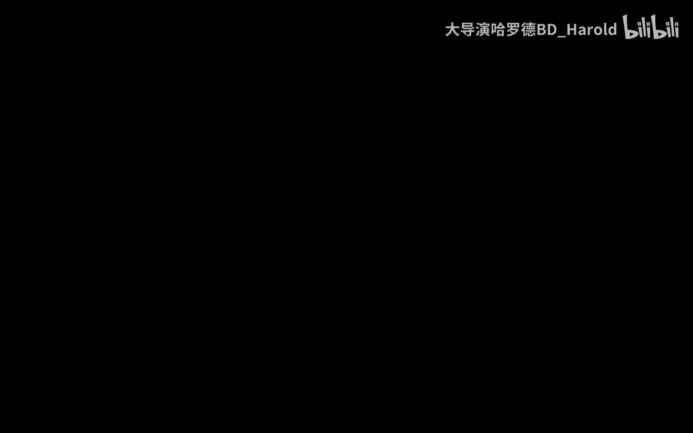
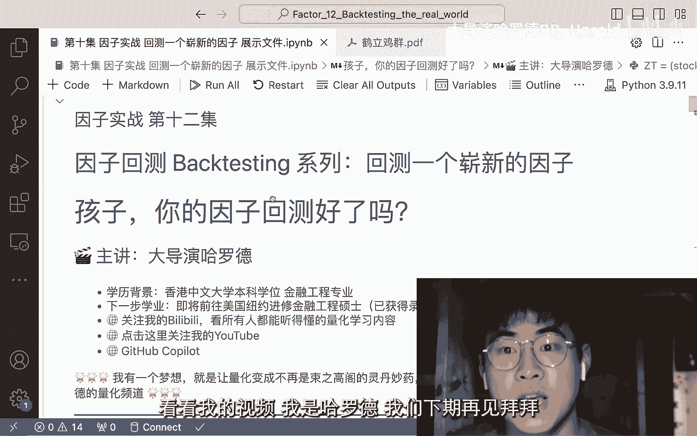

# 【因子实战11】一个新的因子的诞生（Python因子回测）#开源免费量化教学 - P1 - 大导演哈罗德 - BV1ii421f7xy

大家好，我是大导演哈罗德，欢迎回到我的量化频道，然后我这样好好的出镜，拍视频应该已经是很久之前了，因为我也不知道为什么，因为其实我觉得我做了一个非常不好的决定，就是我把那个第十期。

其实那一期是一个比较重要的一期，那一期是讲我们如何把我们因子时呃，因子回测里面的这个呃也就是五组，这个如何应根据因子值，然后把所有的股票分为五组，这损还起了个泡，那但是我感觉我当时做了一个决定。

我不知道我就学苹果嘛，我挤牙膏，所以我把那一集相当于分了六级，那一方面我也有别的考量，我是说我觉得啊，如果一下上传个40分钟的视频，会不会怎么怎么样，但其实在那之后，我整个的这个视频的更新进度。

因为要跟着那个呃一周差不多周更，或者甚至我半周更，那也很少，很少才能够呃，去真正的去把那个我我接下来后面的这些因子，实战系列推进进去，然后呃也是就是因为最近我新找了一个实习，这个实习做的内容呢。

还是我我个人非常非常我觉得还是蛮感兴趣的，就是做这个高频交易的数据，然后从中获取一些呃，相当于做一些量化研究，然后得到一些对吧，像我一直跟观众讲的就是赚钱的方法。

那高频数据跟我们现在做的这种呃daily的数据，就是日评的一个数据的话，我觉得还是差别其实并不是很大吧，因为呃做到最后，其实你还是呃还是我说的那个核心观点，每个股票有一个因子值。

然后根据因子值我们来做一个所谓的打分，嗯可以这么说吧，或者说这个因子值可能就是一或者是零，如果说我们做的是这个事件型的，那我们先不这么说，我们来看一下我们这集想要说什么。

我们这一集想要回测一个崭新的因子哇，这又是一个非常非常有趣的一个事情，因为大家想想，我们在这之前我们已经set up准备好了，我们所有需要的一个工具，也就是说只要你给我一个excel文件。

这个excel文件里面，它有每一个股票所对应的因子的值，我就可以把它塞进，这个我刚刚说的这个因子回测包，也就是我们得到这个因子回测的函数，然后我要做的事情呢。

我就只是simple factor test，然后我把我想做的那个所谓的，就是一个factor塞进去，我们就是k factor塞进去之后，他立马就可以给我们这个因子的值的c rank。

IC和group turn以及factor group，那这里面呢也就是说啊，我我的很多粉丝朋友说哦，其实很重要的一点在量化里面，就是你要构建出自己的一个回测的框架。

那你如果用比如说像世坤一些网上的回测平台，然后你去学他的正则表达式，你的坏处是什么，你的坏处就是你不能在本地搭建好，自己的回测框架，那这样的问题是什么呢，问题就是当你真正去以后。

想做大做强所做这个交易系统，那其实你并没有一个自己的本地的东西对吗，你去看的是别人的研报，别人的数据，那这些数据，他最后能不能在这个时效性的基础上，他能不能在当下的市场能使用，你是不知道的。

所以我可以这么说，在这之前我们做到的所有事情，就是我们已经有了一个本地的因子回测框架，而我们要塞进去的数据也是非常简单，命运我好，希望我现在可以打开一下，我之前的那些演讲的文件。

大家但是其实大家也可以往之前去看看，或者是大家应该也能够记得我们的那个excel表，那么每一个股票，每一个呃月末如果是月饼的话，那就每个月末有一个因子值的这样的一个数据。

然后我们就可以根据这样的一个数据，去把所有的股票进行一个分组，然后分组，然后就形成了我们的一个所谓的策略嘛，那当我们真正持仓持仓去实现这些策略的时候，我们可以去啊再去加一个，比如说一个仓位。

他们是不是要等权，还是说根据他们的市值大小来做一个区分，那这样的话，我们其实并不需要买整个仓位的所有股票，也可以大概的实现自己的这样的一个，量化的一个策略，那这节课我们想做的是什么呢。

大家看我们这节课在上节课的基础上有了一个，除了有这个stock data之外，我还读取了这个index data，index data是什么，Index，现在就是指数的一个数据。

那我要这个指数的数据要干嘛呢，我想要去测试一下，在这个指数上做一个所谓的啊，我们还是说嘛我们有一个打分，然后看一看这个呃收益，我们这个即将要实现的这个，量化策略的收益怎么样，大家如果还记得。

我们之前做的一个量化策略的话，我们一直做的呢都是一个P，为什么我之前做的是PE呢，因为我觉得我本来的重点呢，P比较简单的一个值嘛，啊，其实是那个一除以P，一在什么DPEDEP还是DPE，但是重点是什么。

重点是这个东西它是一个很简单的，并且它是一个呃，因为是farm french3因子，它是一个非常非常呃怎么说呢，他是一个非常非常经典的一个例子，所以我们在用这个例子，那我们这节课这一个系列课吧。

因为我觉得我很难去用啊，一级就把这个东西完全都讲完了，其实如果说讲也可以讲讲，我可以直接告诉大家哦，这篇论文你跟去读，然后你读了这篇论文，你得到了一个点子，然后你把这个点子实现出来，其实就是这样。

那其实你实现的所有工具，主要还是看你这个Python的熟练程度，你只是把你现在有的这些数据，然后做一些数据处理，然后呃你得到那个因子值之后就好了，但我存在的意义嘛，就是想把这个过程简化掉。

因为其实读论文，其实这个点就是读论文对于量化研究的重要性，谁不知道呢，对吧，大家都知道啊，论文啊，研报啊，那研报里面有很多点子，论文里有什么很多点子，然后我们把这些点子全部都复现出来。

可是大家有没有发现一个很重要的一个问题，就是你在复现这些点子的时候，你怎么样去能够，真正找到一个这样的一个方法论，有没有一个人能够就是把你领进门，然后让你之后去看很多很多论文的时候。

可以更加的就是开心的去看，因为我觉得论文现在谁都能找到，然后研报大家也越来越简单，能找到有研报，从之前的一个付费产品，越来越变成了一个所谓的就是呃引流产品了吧，就是从对于券商的角度来讲，所以这种的变化。

也就是研报的获取变得非常非常简单，那好我们接下来看一下，我们今天想要看的这个论文是讲什么的，我们今天肯定测试的就不是第一批因子了对吧，我们来看一下这个，它叫crowns among chickens。

The general attention grabbing effect of daily price，Limits in chinese stock market，OK出现英文了。

这里也就是比较复杂了，因为我的观众肯定有些英文很好，有些英文就是稍微没有那么的好，那我把这个cross among chickens翻译出来的是什么呢，它的意思呢就是鹤立鸡群。

那后面这个东西的意思其实啊没有那么复杂，它就是说uh the general attention grabbing effect of，Daily price。

Limit in chinese stock market，我如果翻译出来呢，他其实想研究的是涨跌停，股票在中国市场中对于这个市场的一个影响，OK首先啊我们先跳过它的introduction。

它这里面有没有一个abstract，我们先看一下他下面画的这张图，这张图，其实当时我们在上那个我们学校的一个，投资组合的课的时候，我我我因为我是在做USTF，然后其实也画过类似的一个图。

如果甚至上过那门课的人在看我这个视频，甚至有点ring a bell的感觉，什么意思呢，就是说股票我们在很多的分析啊，去把它建模，用这个this score。

来看一下它这个abnormal incident呃，看一下他是不是就是说是这个abnormal incident，我们会用这个this score，可是我们用这个this score。

就是简便除以这个standard deviation，我们就假设了这个股票的一个收益，是符合normal distribution的，而这个假设往往是不成立的，为什么呢。

因为很多时候这个股票的收益都是一个，Heavy tale distribution，也就是说它的极端情况出现的频率更多，那也就导致了，其实很多时候这是一个理论的框架哈，也就是说你在做很多的啊。

trading strategy交易策略的时候，你无法你你你的很多的这个甚至不是直觉了，直觉就更不用说了，但即使是你用数据分析出来的结论，也是在一个normal distribution的假设框架下。

可是如果市场也就是说我们这个fundamental model，它就不符合normal distribution，也就是我们就会我们的trading strategy，就忽视了很多的风险。

也就会导致出现很多问题，那这几个论文不是想要跟我们讨论，就说OK这个什么有很多normal distribution，这个论文想讨论的是什么呢，大家来看一下，OK我们来读一下论文。

我因为照顾到很多大家就是英语的能力不一样，然后我就不去把他所有的就是把它就是读起来，然后也会取消大家的积极性，但其实这篇呢也有一个中文的研报，所对应的这篇论文，我第一没有把这篇研报展示出来的原因呢。

有两个，一呢是我不知道这是不是呃，就是尊重知识产权的，因为我不知道我能不能去展示这个研报，但是我认为这个论文呢，它是一个应该是属于一个公开的，而且我没有去做商业，更多是做一个教育的用途啊。

就去看一下这个论文，我认为是没有问题，但研报呢就涉及到证券公司了，就我我不是很高啊，我不是很就是呃觉得这是非常非常能做的事情，但是如果大家想要那篇研报的话，也可以就是说私信我呀。

然后并且啊我再去怎么怎么确认一下，然后把这篇研报发给你啊，如果大家对这个英文非常非常抵触，其实也很正常，然后还有一个，但是就是我可以很保证的告诉大家，这篇论文写的非常非常清楚，尤其是对于我的观众里面。

就是英文比较好的，我还是建议你如果跟着我这次就是说实战训练，大家还想一想我们这节课到底想干什么，我们想去实回测一个真实的因子，大家还记得吗，我之前唯一的一个闭环就是本地量化这个因子，回测系统的。

这个也不知道系统吧，就是这整个的这个函数代码，也就是很多人问的，就说哎呀你这个做的太浅了，但其实我认为就是这个才是最棒的，mental的，你的一个回测的框架，你的框架如果搭好了，其实你后面的所有的衍生。

是可以在这个框架的基础上去做的，我认为这个才是啊最重要，而且你自己写出来的框架你肯定是最熟悉的，你去回测任何的因子，你去甚至找实习，你你去跟呃你的leader，你去跟他们说说，我有一个因子回去的框架。

就是根据那个大导演哈罗泽，那个B站账号写出来，就算后面这话你不要说，那我的重点是你有这样的一个因子回复的框架，其实是在你的实习和你的简历或者任何地方下，都很加分的。

这尤其是呃你的编程技术已经非常非常好了，然后再加上你有一定这样的量化的经验，那简直就是非常非常棒，那我们来说就是我是最后一个闭环，就是我想实战回测一下这个因子，但在实战回测这个因子的时候。

我就需要去看论文，为什么呢，其实我还是最开始，其实大家也可以去看一下，我讲那个关于我认为什么是因子的那期视频，就是我认为因子，那总结来讲就是其实因子可以是任何值，我可以我是上帝，就是我告诉你。

我可以预知未来，所以我就根据我的预知未来，这个能力给英子打这个分可以，那问题是什么，我就像是一个非常非常重要的一个概念吧，在这个量化里。

你永远不能根据你的future price来去train你的model，这是不可以的，就是一定要one hundred percent forbidden禁止的，为什么，因为你不可以预知未来。

所以我们在做这些量化的idea的时候，我们更多的就是用这个当前的数据来training啊，这这来来来得到一些结论，那根据这个有效市场假说，即使是最wk版的historical data。

也就是历史的数据是不能获得超额收益的，如果你相信这个市场是有效的啊，若有效的这样一个说法的话，其实那是最wk了，这还不是中级，也不是最高级，这就是最wk的，都说historical data是不可以的。

OK那如果是historical是不可以的，那第一第一这一点本身就是存疑的，因为呃，我觉得这篇论文其实也是一个非常非常好的一，个切入点吧，就是其实我理论和实践两边我可能都会涉及呢，其实有些在理论方面呃。

不是非常非常有背景的话，就是学习这方面的知识储备的话，可能就会觉得我讲的有点乱，那有些在这方面有知识储备背景的话，就会觉得我讲的有点简单，所以我如有任何问题，各位观众朋友们都可以在我的后台给我提问。

然后这个时候我还是要插一句，就是呃这个系列做起来真的是非常非常难，因为大家要看我就会写这么多这么多的代码，然后还需要把这些东西整理成课件，然后呃发到这个网上，然后还需要剪视频。

但是就是我为什么还是就很想抽出时间，因为现在其实已经是1。45了，就凌晨01：45，但我为什么还需要去做这个视频，就是因为我真的见到了很多很多的啊，这个小伙伴不管是私信我也好。

还是就是说来主动来过来跟我沟通，线下的甚至线上的，甚至线下的就是过来相当于跑过来呃，那种非常的害羞，或者跟我说哎我看你的视频，然后你的视频就是做的做的很好，然后然后很多很多因为更多的可能还是线上的。

就是给我发私信呃，我甚至认为这些东西可能是我瞎编的，就是因为我想营造一个我非常有名的一个形象，毕竟我也只有3000多粉丝，然后我就觉得很多时候这个一些有3000多粉丝，他们这个粉丝的这个年度也好啊。

还说这个互动率也好，都非常非常低的，但在这一点我就非常非常感谢我的粉丝，我也觉得大家都非常的支持我，然后有这么多这么多的这种内容，而且我还不是一个就是所谓的这个呃颜值主播，虽然说呃呃不说这个了。

但重点是什么，我也不是那种就是啊跳舞啊，然后就是长得好看，然后就是怎么说呃，营造这种粉丝圈的，这个呃我也不知道他们长得好看，然后他们想要干嘛就怎么变现，这个就很非常的搞笑，因为你仔细想一下他们变现嗯。

是OF，但这个不是重点，重点是啊我觉得就是因为这些的鼓励吧，然后我就非常非常的呃，就是即便是在晚上，我也想抽一个时间，因为最近真的是工作也很忙，然后学习也很忙，然后生活也很忙，什么都呃也不叫忙吧。

但的确就是比较的疲惫，所以说啊更新的速度稍微有点慢了，但是我还是会尽量的去用一个最快的速度，然后而且每期视频就是既能满足，去跟大家聊聊天，然后跟我的粉丝朋友互动一下，又能满足理论上的一些。

我认为就是我从专业的角度，虽然我不叫从专业的，但至少是我从一个就是我专业训练，受过这种训练啊，训练的好不好，我不评价我自己，但是我经过这种专业训练，让我从专业的训练的一些角度给一些啊。

没有专业训练的朋友，一些至少是ideas，或者说我说了一个词，我说了一个有效市场，然后你从来没有听说过你是一个cs学生，那你听到这个你就可以顺着这个顺藤摸瓜，然后从这里去往里底下去看看，去学习。

或者呢就是你是没有编程技巧，那我接下来也会给大家展示一下我这个编程，所以我认为就是我的视频，还是更主要的是大家能够去啊，各取所需，就你也不要说，OK你讲的太简单，你讲的太难了，就是你更多。

你就是各取所需，你想要什么内容，就从得到什么内容，你也可以加速，你可以快进，你不想听我讲话，你就把我所讲话的地方快进掉啊，如果你不想看我写代码，你觉得我写代码的呃太慢了，然后你写代码写的特别快。

那你可以把写代码的地方快快进掉，然后你就只听我讲这种理论的，就是这个整个就是从量化的经验之谈，那还有一种情况，就是你认为你的能力就是比我远远要超过了我，那我觉得就是说那这样的话。

就是可能就是你可以去看一些别的up主啊，或者是你可以就是怎么说呢，就是啊也可以支持一下我，然后就是可以给我一些呃，比如说灵感也好啊，或者什么我觉得都是非常好的，那我觉得就是说啊对，然后说了其实还蛮多的。

然后就嗯接着来讲一下这个，今天我们就是说这一期只是想把呃，一个这个这个因子值，就是其实这篇论文我觉得也很有意思，它是因子值里面套一个因子值，说到这，其实很多人可能听着有点懵了，就是每当你听懵。

甚至我其实说的时候我也有点懵，为什么呢，因为你其实一定要记得，就是自己想要什么，你想要一个再再再说一遍，我已经前面已经说过两遍了，但我还是要再说一遍，你想要的是一个月评的话。

那就是每个月末每个股票一个数值，这个数值是根据一些东西，一些ideas，一些逻辑，但是我是需要那个的，OK那我们现在就来得到它，我们得到它，然后我们看一下这篇论文，然后我直接用语言解释一下。

因为我又想让大家就是有这个机会去呃，自己去读，其实他写的非常非常清楚，但我就说其实我会觉得我说的有点太概括了，那你就失去了这个品读，这个美好论文的这个体验，但是如果你就是想去品读美好论文。

你可以暂停一下，自己去读一下，先abstract introduction，你稍微读一下，你就知道它的idea了，那如果你不想去读，那我就直接告诉你，他的意思呢，就是很简单的一个概念啊，也比较简单吧。

就是从行为金融学上来讲还是比较好去理解的，怎么说呢，A股有一个非常强的特质，它是美股没有的，它叫涨停，也就是说股票一天涨或者跌最多10%，超过10%不行的，就是你今天就不能涨了，然后你今天也不能跌了。

而美股呢我们是知道它是有熔断政策的，这个主要就是当时在疫情的时候，经常有人啊提到，所以那我就发现其实这种熔断的时候，当时如果买那个美股，现在就赚翻了，就我当时真的是在英语课上提到的，我觉得很有意思。

你说你当时买，因为你仔细想，你如果have confidence in american stock，那他当时如果在熔断的话，其实如果你买入的话，其实还是蛮好的，机会的话，如果你当时没有仓位的。

如果有仓位，你可能就比较难受了，anyway呃呃对，但是这个这个就不提这个了，但你肯定知道那是super super undervalue了嘛，因为大家的恐慌情绪有点太啊啊，这个跟世界要毁灭了一样。

但是我刚刚说的这些，其实跟我们今天讲的有关系，为什么呢，就是说大家人作为一个交易者，其实是非常非常呃主观的，那在中国市场，这个price limit也就是涨跌停的这个设置，我们他就从这个论文上来讲吧。

因为我觉得我他是怎么想到，你想想他就有可能某天下午喝咖啡，喝他的卡布奇诺，然后他就突然想到呃，这个A股才有涨跌停，那涨跌停的话对这个投资者是有什么影响，你想一想呃，比如说他就在跟你。

你可以想象你就不只是你，你就是一个你是个什么东西，你是一个资深的量化研究员，呃中呃哈罗德证券，然后你是资深量化研究员，然后我也是资深量化研，我们俩就聊天嘛，然后我就跟你说，诶就是我喝着我的咖啡。

我喝着我的卡布奇诺，我就跟你说，哎我想想你想我，我想到了一个因子啊，我想到了一个因子，就可以让我用来选股用的一个因子，这个因子是怎么去处理的呢，这个因子是这样的诶，你你知道就是中国股票有涨跌停对吧。

我感觉就像这个古代，中国古代说这个鹤立鸡群一样，鹤立鸡群给了我们什么启示，就是一个鹤，他站在鸡里面，我的整个的注意力全部都在这个鹤身上，很多鸡我就没有去关注，人的支柱力是有限的，你知道吗。

因为我们很多论文都都在这个框架，这是一个行为金融学一个非常重要的一个，包括one的一个相当于是一个点，就是人的注意力有限的，人，不可能每天把所有的市场上，所有股票都研究透了再去做决定。

不可能的人就会就比如说这个谷歌金融，或者是什么万德，他突然给我爆出来一个信息，这个信息他是映入我眼帘的，然后也是我会去关注的信息，对吗好，那在这样的情况下，我的点子是什么，其实从一个金融学的角度来讲。

如果一个股票被过多的注意力关注了，你觉得他是会被undervalue的，还是会被over over value的，这一点其实就是一个关键了，undervalue是什么意思，就被低估还是会被高估。

如果一个股票被太多的注意力所吸引了，就这个股票它太火了，也就是它它它满屏幕都是，就是你在百度上能看到你在你在哪，就这样是对当时的，比如特斯拉现在的那个英伟达，然后这个这个这个当年的。

比如说阿里巴巴之类的，呃我我我可能就主要是比如说像现在英伟达，他你觉得是会被高估还是会被低估，即使就是其实像英伟达这个就是所谓的个例，你可能很难说，因为你可能还是会辩解，就是说有没有可能你虽然觉得OK。

我可以理解他啊，有太多的注意力，大家快快关注这个英伟达这个股票，它会有很有可能会被高估对吧，虽然他是一个很棒的公司，他是一个很有未来的公司，但他可能值不了现在这么多钱，那你会去辩解。

就是说有没有可能这个公司是个个例，就是英伟达，他有可能还被低估了呢，因为大家其实还是有点不敢呃，去释放对他的想象力，他在一个AI时代有这么这么重要的一个作用，OK如果我把你的思路在这里打住，那我问你。

如果这个市场上有1万个股票，他们都被相对过分的关注了，那你能不能很就是自信地说，如果这1万个股票都被过分的关注了，我认为我就有一个策略了，我有一个strategy了，我有一个点子了。

也就是说我要shot这些被过度关注的股票，然后我去买那些被没有关注的股票，就是不怎么被关注的股票，那如果用这样的一个策略，那我的核心的点就是过度的注意力，会给这个股票一个overvalue的一个结果。

然后呃过少的注意力会给这个股票一个undervalue，一个是低估的一个结果，那我不依赖于我的判断，对于单个股票的判断，就是我说哦这个股票怎么样，而是我对这个整个的这个PFOLIO，对这个组合。

对这个几百只几千只股票做一个整体的判断，它是被the value还是overvalue，那这里我认为人的，人的缺陷和人的这个嗯愚蠢，人的冲动往往会被这个过分的注意力所牵引，所以我认为这个策略是有效的。

我说到这里，其实懂的同学大家应该会听懂，不懂的同学，其实大家可能说啊，你在说什么，那不管怎么样，我认为就是啊你可以再听一遍，或者你自己去看看论文，那其实这里面我不知道大家有没有get到。

那我直接就给大家看这个原始的公式，这是个什么意思，an upper和n low，这个是什么意思呢，也就是number of涨停的股票和number of跌停的股票，那这个因子我们要怎么去计算出来呢。

我们把这个因子啊，它叫LH，那我来用中文嘛，我就叫它涨停，涨跌停的股票占比，大家看我上面是有这些数据的对吧，OK那我们来看一下这个涨跌停占比，要该怎么去计算，涨跌停占比的话。

我可以用一个stock close减掉一个stock open，要除以一个除以一个什么，这很简单对吧，这个stock of stock open啊，这肯定是OK那涨跌停是这个的话。

下面这个是涨跌停的一个所谓的就是一个啊，matrix不是它是一个vector吗，大家可以看它不是它是个matrix，为什么它是个matrix呢，因为它就是相当于这个减掉，它是一个每个点。

每个点它是一个matrix，每个点减掉一个每个点，然后变成一个matrix，再除以一个同样大小的matrix，也就是每一个enter来做一个相应的一个计算，你这里面对大家的数学有一定的要求。

如果大家数学没有一个非常非常好的基础的话，这里可能就有点听不懂了，但不管怎么样，你可以跟着我的思路，我们这里得到的是一个matrix对吗，OK那得到这个之后，我现在还需要什么。

我需要知道我的number of stock，我number of stock是什么呢，很简单，我把它transpose一下，然后我再把它count一下，这就得到我number of stock。

那我ZT应该是什么呢，我来看看它涨跌停，我都把它算在一起的话，那我就要让它涨跌停大于等于0。1，中国的股市的涨跌停限制是10%对吗，可是0。1的话有一个问题，就是说有些时候它涨不到10%。

这也是在那个论文里呃，在某一些细节的地方讲过的，为什么涨不到10%，因为可能涨到9。8%，它再涨那个最小的0。01块钱，他已经变成涨10。5%了，那我的限制就是你必须小于10%，这是证监会的限制。

所以我们在这个处理的时候，我们就把它设置成0。09%，那下面的话呢我就说OK，我就要得到一个就是number of stock too much。

我为什么要叫他a number of stock too much，大家想想为什么，因为他就说涨的太多了，那这个涨得太多了的这个股票是等于什么呢，大家想它呢等于它大于等于0。9。

其实这个我就把它变成了一个什么呢，大家想想我就会把它变成一个我来，我来保证一下，我是可以啊，可以看到这个ZT的，它就变成了一个一个true false的，一个这样的一个matrix对吗。

那false的话，那就是相当于没有涨跌停，而这里面有没有true呢，我们看不到，因为true肯定哎呦，哎这还有个处，那意思就是这一天他有一个涨跌停，就是它涨跌停了，它不管是呃大于0。09还是小于负的。

0。009，我们都把它计算到这个涨跌停的里面，那我们这个number of too much the z t，然后我们要把它干嘛，我们把它transpose，然后做一个some。

然后这个transpose这个操作，如果大家不太懂的话，大家可以去看一下，如果我把z t transpose了，我会得到一个什么，我就会把它得到了一个从这个行是股票数，然后列呢是这个日期数。

然后那这个呢就是我们这样的一个所谓的做法，那我们把它sum之后呢，大家看一下这个number of stock too much，会是一个什么样的东西呢，它会是一个vector。

也就是我就得到了这个每天涨跌停股票的个数，那接下来也就是我所谓的，我想要构建的一个factor了，我这个factor是怎么构建的。

number of stock too much除以number of stock，当然这里面肯定会有一些奇怪的一些数据嘛，因为你想一想就知道他肯定会有什么。

肯定会有name或者甚至是infinite infinity对吧，然后in place我们去把它in place，In place，还是in place in place，为什么它不能没有提示呢。

等于true，那如果是这样的话呢，然后我们来看一下这个factor长什么样呀，那这样的话那我们就得到了我们这个factor，这个factor它是一个所谓的，就是如果我们把它百分之百分之1。35，1。

06%，也就是涨停和跌停的股票，占当日股票的一个百分比，那好了，那我今天其实啊你看我们写代码的部分就这些，其实你看我觉得今天这个视频，我不知道大家会不会喜欢这种形式。

或者是觉得这种形式还不如以前那种光讲股票，或者是光讲代码啊，来的更直接一点，那我觉得就是the haters gonna hate太多说的，所以说我的重点就是在于我这节课既富含了，就是代码的部分。

如果大家认为这个代码，其实这个代码我认为区确实还是蛮简单的，我觉得它的难点是在于，就是关于这个matrix这种数据结构吧，呃你也可以叫它数据结构，也可以叫它数据形式。

大家要get comfortable with it，要用起来很舒服，所以你才会觉得OK，这个其实这里面有很多，其实都是线性代数的一些很基础的一些呃结论，但其实你真正运用到实践，你会发现还是蛮有趣的。

就是它其实点对点的一个matrix matrix，然后你去做一个transpose，然后做抗的话，大家知道它是每一每一列会有一个count，那其实他每一列的这个count，就是他每天股票的个数。

因为大家想想这个我我如果再给大家写一下，我虽然说已经很晚了，但是我还是想给大家去好好的看一下，这个这个点transpose长什么样子，那大家看他transform之后，它是每天的这样的一个值都会有。

那如果去做一个count，大家会发现是个什么东西，它会是以一个列名啊，对以列名做一个com，这就是Python函数自己的事情嘛，如果他可以做一个行名，做一个抗日，那那我就可以直接不这么做。

但是如果是这样的一个情况下，他就没有什么意义了，是我count到的是他呃有多少多少天啊之类的，我觉得这个就不是我想要的东西，所以这个也是我说我最偏编程的角度，想来跟编程的，那我其实也编了一点程。

然后呢如果对于就是对量化了解的不多的，那我还是啊讲了一些就是金融相关的，包括有效市场啊，包括就是呃因子是怎么样做的，包括本地的量化回测光下，然后对于就是喜欢听我胡诌八扯的，然后我也讲一讲。

就是我个人的一些最近的一些心得，和个人的生活经历，然后我希望这样的一个形式，可以比之前的嗯那种光讲或者是干说，然后或者呢就是整个把一堆东西，就是塞到一集里面体验会好一点，然后也更多的去啊。

希望看看就是在不同的这种视频中和城市中，看看大家到底喜欢哪种形式，然后也继续欢迎各位的粉丝，然后跟我沟通也是更多更多的看看我的视频啊。

我是大佬哈罗德啊，我们下期再见。