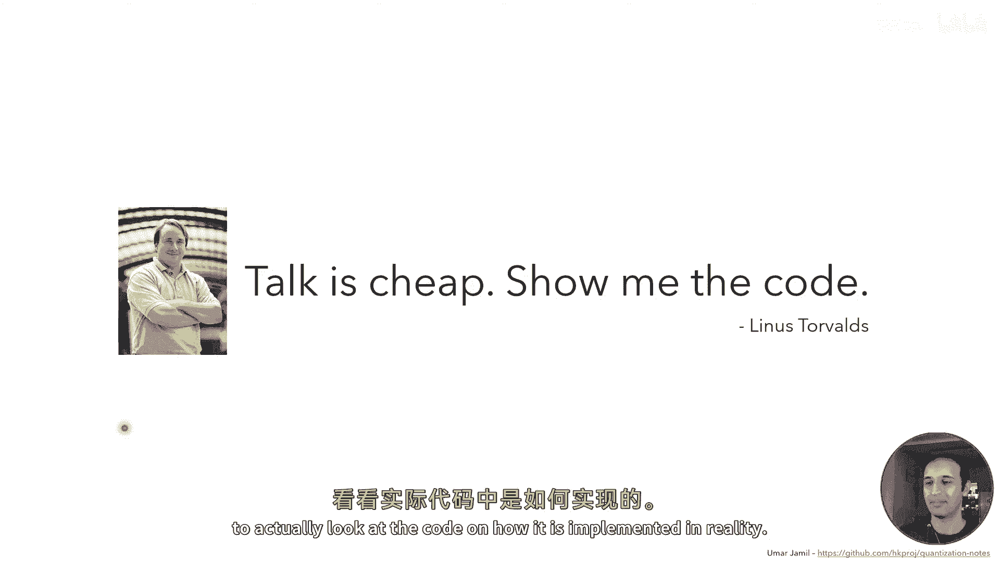
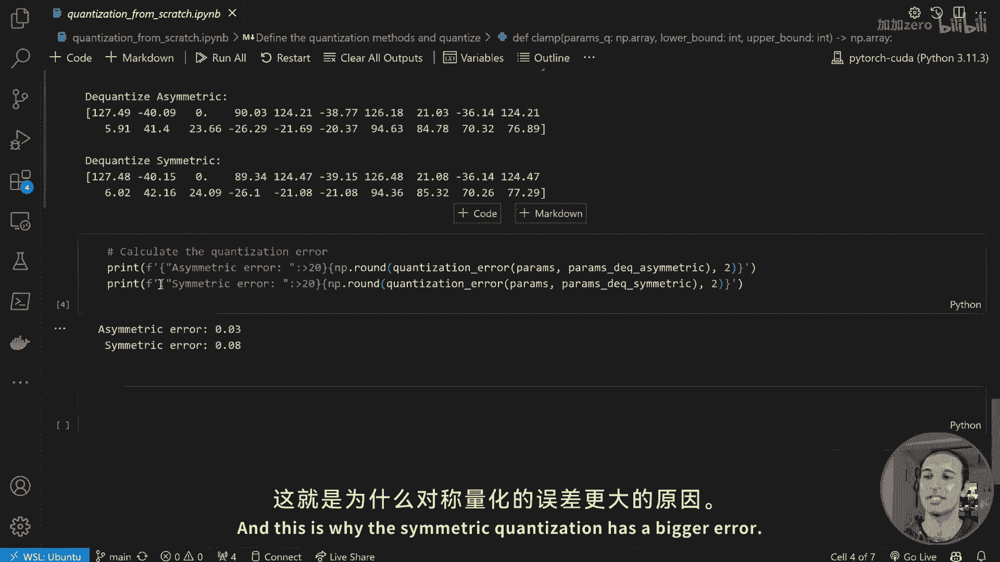
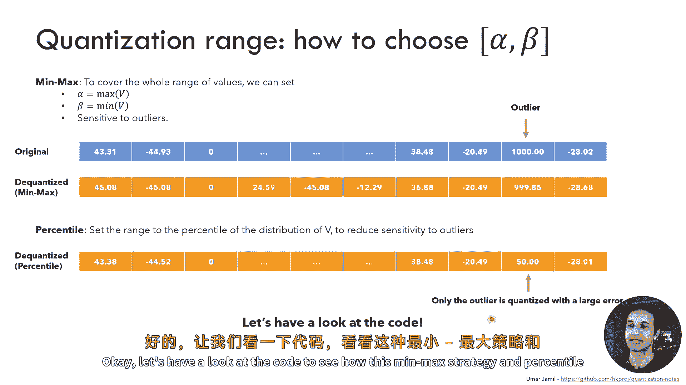
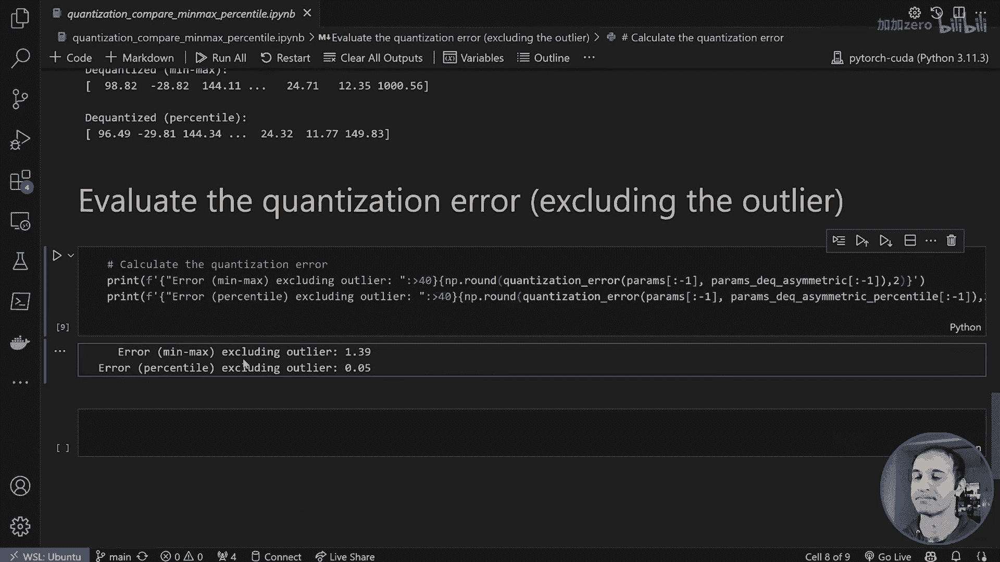
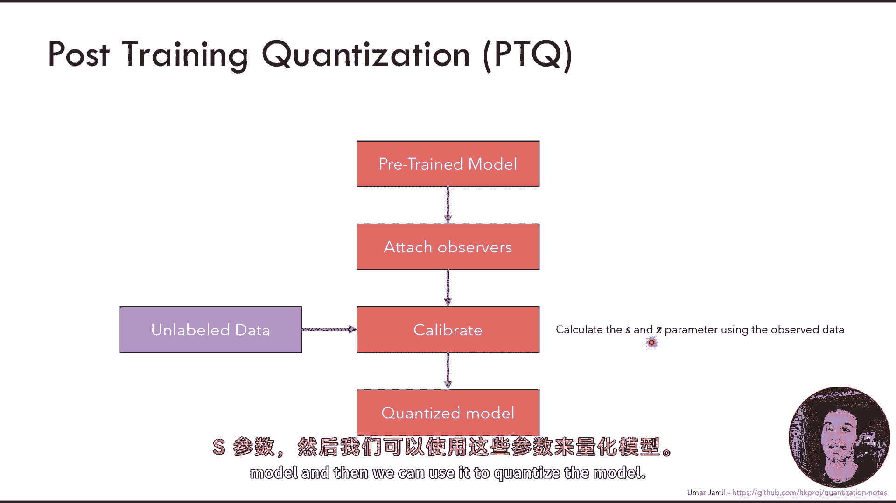
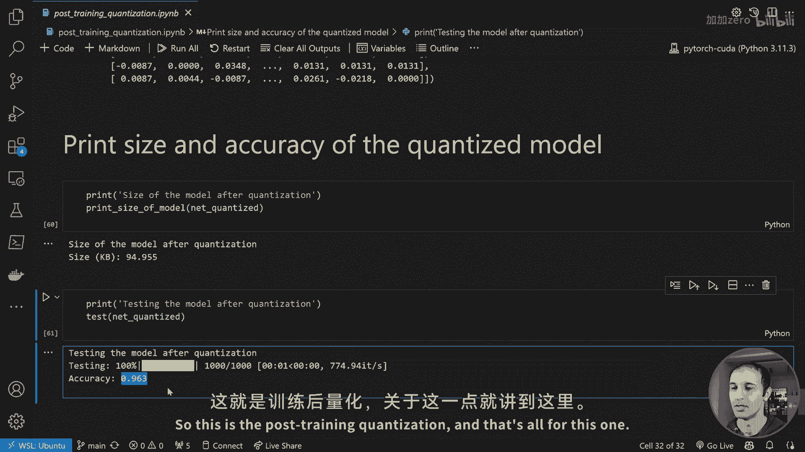
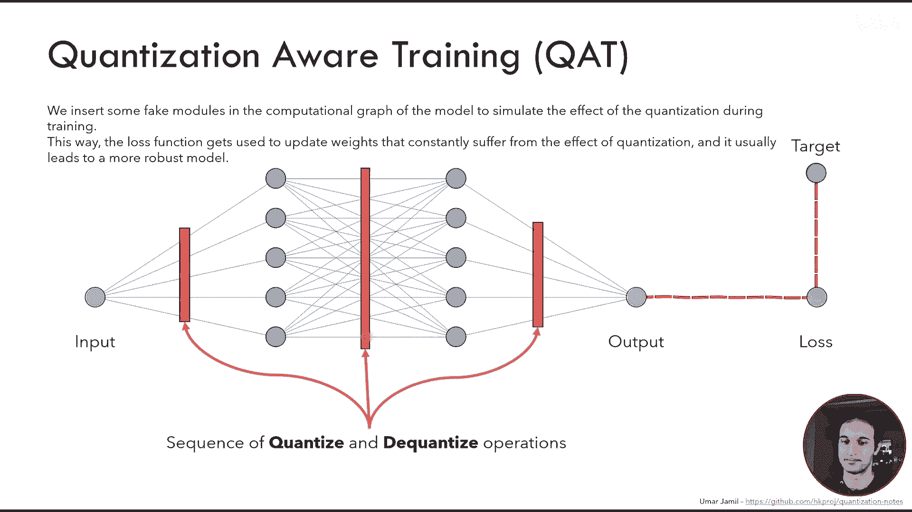
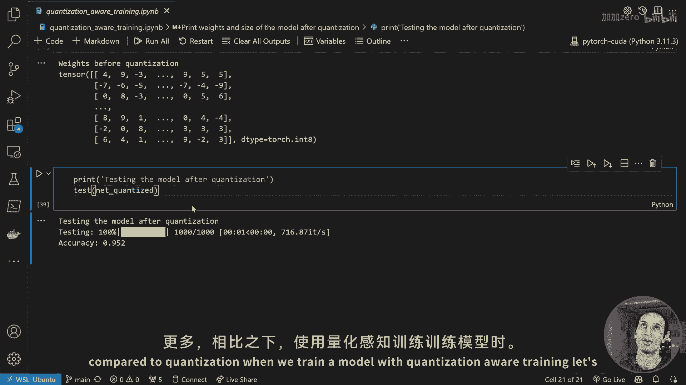
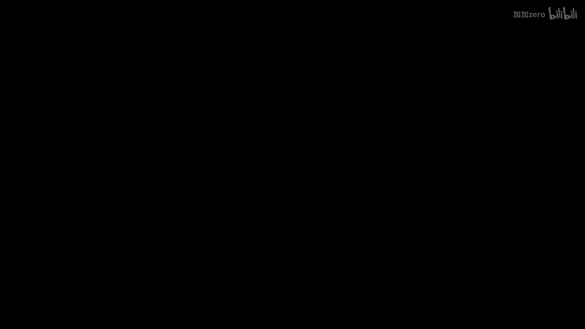

# 【基于PyTorch的量化技术详解 by Umar Jamil】 - P1 - 加加zero - BV1884seCETX

Hello guys welcome back to my channel Today we are going to talk about quantization。

 Let's review the topics of today I will start by showing what is quantization and why we need quantization and later we will briefly introduce what are the numerical representation for integers and floating point numbers in our hardware so in CPUs and GPs。

😊，I will show you later what is quantization at the neural network level by giving you some examples and later we will go into the detail of the types of quantization so the asymmetric and asymmetric quantization what we mean by the range and the granularity and later we will see also posttrain quantization and quantization aware training So all of these topics I will also show you theyon the Pythtorch and the python code on how to do it from scratch so actually we will build the asymmetric and the quantization the symmetric quantization from scratch using Pythtorch and then later we will also apply it to as sample neural networker using a post training quantization and quantization aware training。

😊，What do I expect you guys to already know before watching the V video is basically you have some basic understanding of neural networks and then you have some background in mathematics just high school mathematics is enough。

😊，So let's start our journey let's see what is quantization first of all so quantization aims to solve a problem The problem is that most modern deep neural networks are made up of millions。

 if not billions of parameters for example this small tma2 has 7 billion parameters Now if every parameters is a 32 bit then we need 28 gigabyte just to store the parameters on the disk Also when we inference the model。

 we need to load all the parameters of the model in the memory if we are using the CPU for example for inference then we need to load it in the Ram but if we are using the GP we need to load it in the memory of the GP。

😊，Of course， big models cannot easily be loaded inside the CPU or the Ram or the GPU in case we are using a standard PC or small device like a smartphone。

And also， just like humans， computers are slow at computing floating point operations compared to integer operations。

 For example， if you try to do mentally three multiplied by 6 and also mentally 1。21 multiplied by 2。

897。 Of course you are able to do much faster the3 by 6 multiplication and the same goes on with computers。

 So the solution is quantization quantization basically aims to reduce the number of the amount of bits required to represent each parameters using by usually by converting the floating point numbers into integers。

 this way， for example， a model that normally oupies many gigabyte can be compressed to much less smaller smaller size。

 Also， please note that quantization doesn't mean that we just round up or round down all the floating point numbers to the nearest integer。

 this is not what quantization does we will see later how it works。 So please don't be confused。😊。

And the quantization can also speed up computation because as working with smaller data types is faster。

 for example， the computer is much faster as multiplying mattressrices made up of integers than two mattresses made up of floating point numbers。

😊，And later， we will see actually how this matrix multiplication works at the GPU level also。😊。

So what is the advantage of fertization first of all we have less memory consumption when loading models so the model can be compressed into a much smaller size and we have less inference time because of using simpler data types so for example integers instead of floating point numbers and these two combinations lead to less energy consumption which is very important for like for example smartphones。

😊，Okay， now let's go review how numbers are represented in the hardware or in the CPU level or in the GPU level。

So。Computers use a fixed number of bits to represent any piece of data， for example。

 to represent a number or a character， a pixel color。

 we always use the fixed number of bit a bit string that is made up of n bits can represent up to 2 to the power of n distinct numbers for example。

 with three bit we can represent eight possible numbers from0 to7 and for each number you can see its binary representation we can always convert the binary representation in theim representation by multiplying each digit with the power of two to the power of its position to the position of the digit inside the bit string。

And。In most CPUus， actually the numbers， the integer numbers are represented using the tools complement。

 which means that the first bit of the number indicates the sign。

 So0 means positive and one means negative while the rest of the bits indicate the absolute value of the number in case it's positive or it's complement in case it's negative the reason we use the two complement is because we want one unique representation for the0 so the plus 0 and the minus0 have the same binary representation。

 but of course you may argue okay computers use a fixed number of bits to represent numbers but how can Python handle such big numbers without any problems like when you run2 to the power of 9999 on Python you will get a result which is much bigger than any 64 bit number and how can Python handle this huge numbers without any problem Well Python uses the so-called the big nu arithmetic so as we saw before in this。

able。The number six， when it's represented in base 10 only needs one digit。

 but when it's represented in a base 2 it reads three digits。

 so this is actually a rule so the smaller the base the bigger the number of digits we need to represent the number and Python does the inverse so it saves all these numbers as an array of digits in which each digit is the digit of the number in base2 to the power of 30 so overall we need less digits to store by the big numbers for example。

 if this number which is the result of2 to the power of 9999 is represented as a decimal number we would need an array of 3000 digits to store it in memory while Python stores this number as an array of digits in base2 to the power of 30 so it only needs 334 elements in which all the elements are0 except the most significant one which is equal to 512 and as a matter of fact you can check by。

😊，selfThat by doing 5 to2 multiplied by the base， so to the power of 30 then to the power of the position of this digit。

In the array， we will obtain the number two to the power of 9999。

I also want you to notice that this is something that is implemented by C Python。

 which is the Python interpreter， not by the CPU。 so it's not the CPU that is doing this big arithmetic for us。

 it's the Python interpreter。 For example， when you compile C plus plus code。

 the code will run directly on the hardware on the CPU which means also that the C+ plus code is compiled for the specific hardware it will run on while Python code we never compile it because the C Python will take care of translating our Python instructions into machine code and in a process called adjusting time compilation。

Okay， let's review how floating point numbers are represented。

Now decimal numbers are just numbers that also include the negative powers of the base， for example。

 the number 85。612mb can be written as each number multi so each digit multiplied by a power of the base which is 10 but the decimal part have negative powers of 10 as you can see 10 to the power of minus-1 minus-2 and minus-3 and this same reasoning is used to in the standard I3E 754 which defines the representation of floating point numbers in 32 bit。

basicallyically we divided the 32 bit string into three parts。 the first bit indicates the sign。

 so0 means a positive。 the next 8 bit indicates the exponent。

 which also indicates the magnitude of the number， so how big is the number。😊。

And the last 23 bits indicate the fractional part of the number。

 So all the digits corresponding to the negative powers of2 to convert this bit string into a value。

 theim value。 we just need to do this。 So the s multiply by2 to the power of the exponent -127 multiplied by the fraction 1 plus all the negative powers of2。

😊，And should correspond to the number 0。15625。Most modern GPUs also support a 16 bit floating point number。

 but of course this results in less precision because we have less bits dedicated to the fractional part。

 less bit dedicated to the exponent and of course they are smaller so they have less it means that they can represent the floating point numbers with less precision so we we cannot have too many digits after the comma for example。

Okay let's go inside the details of quantization now first of all we review how neural networks work so we start with an input which could be a tenor and we give it to a layer which could be a linear layer for example which then map to another linear layer and finally we have an output we have usually a target we compare the output and the target through a loss function and we calculate the gradient of the loss function with respect to each parameter and we run back propagation to update this parameters。

The neural network can be made up of many different layers。 for example。

 a linear layer is made up of two mattressrices， one is called the weight and one is called the biasm。

 which are commonly represented using floating point numbers quantization aims to use integer numbers to represent these two mattressrices while maintaining the accuracy of the model。

 let's see how So this linear layer， for example， the first linear layer of this neural network represents an operation which is the input。

Multiplied by a weight metrics which are the parameters of this linear layer plus a bias。

 which are also the parameters of this linear layer。

And the goal of quantization is to quantize the input the weight metrics and the bias metrics into integers such that we perform all these operations here as integer operations because they are much faster compared to floating point operations we take then the output we de quantize it and we feed it to the next layer。

 and we de quantize in such a way that the next layer should not even realize that there have been a quantization in the previous layer。

 so we want to do quantization in such a way that the models's output should not change because of quantization so we want to keep the models perform the accuracy of the model。

 but we want to perform all these operations using integers so we need to find the mapping between floating point numbers and integers and ir revversible mapping of course so we can go from floating point to integers and from integers to floating point but in such a way that we don't lose the precision of。

😊，The model。But at the same time， we want to optimize the space occupation of the model inside the Ram and on the disk and we want to make it faster to compute these operations because as we saw before。

 computing integer operations is much faster than computing floating point operations。😊。

The main benefit is that the integer operations is much faster in most hardware than floating point operations plus in most embedding hardware。

 especially very， very small embedded device， we don't even have a floating point in numbers。😊。

So we are forced to use integer operations in those devices。Okay， let's see how it works。

 This hiddenian layer here， for example， may have a weight matrix which could be a 5 by5 metrics that we can see here。

 The goal of quantization is to reduce the precision of each number that we see in this matrix by mapping it into a range that occupies less bits so this is a floating by number and occupies four bytes。

 so  3 through2 bits。😊，We want to quantize using only 8 bit so each number should be represented only using 8 bit now with 8 bit we can represent the range from minus 128 to plus 127。

 but usually we sacrifice the minus 128 to obtain a symmetric range。😊。

So we map each number into its8 bit representation in such a way that we can then map back to the original array in an operation that is first called quantization and the second is called deco quantization。

😊，Now， during the quant， we should obtain the original array， the original tensor or matrix。

But we usually lose some precision。 So， for example， if you look at the first value。

 it's exactly the same as the original matrix， but the second value here is similar but not exactly the same。

 And this is to say that with quantization we introduce some error。

 so the model will not be as accurate as the not quantized model。

 but we want to make it the quantization process in such a way that we lose the least accuracy possible。

 So we don't want to lose precision。 so we want to minimize this error that we introduce。😊，Okay。

 let's go into the details of quantization now so by reviewing the types of quantization we have available。

First of all I will show you the difference between asymmetric andsymmetric quantization so imagine we have a tensor which is made up of 10 values that you can see here。

 the goal of asymmetric quantization is to map the original tensor which is distributed between this range so minus44。

93 which is the smallest number in this tensor and 43。

31 which is the biggest number in this tensor we want to map it into another range that is made up of integers that are between 0 and 255 which are the integers that we can represent using 8 bit for example。

😊，And if we do this operation， we will obtain a new tensor that will map， for example。

 this first number into 255， this number here into0， this number here into 130， etc。

The other type of quantization is the symmetric quantization。😊。

Wwhichch aims to map a symmetric range， so we take this sensorsor and we treat it as a symmetric range。

 even if it's not symmetric， because as you can see the biggest value here is 43。

31 and the smallest value is minus-44。93 so they are not symmetric with respect to the0。

 but if they are， then we can use the symmetric range。

 which aims to basically map the original symmetric range into another symmetric range also using8 to bit in our case。

Such that， however， this gives you the advantage that the0 is always mapped into the0 in the quantized numbers。

😊，I will show you later how actually we do this computation。 So how do we compute the。

Quantized version using the original tensor and also how to dig quantize back， So let's go。

In the case of asymmetric quant quantization， imagine we have an original tensor that is like this。

 so these 1 items we can see here。We quantize using the following formula。

 so the quantized version of each of these numbers is equal to the floating point number。

 so the original floating point number divided by a parameter called S， which stands for scale。

We rounded down or round up to the nearest integer。Plus， a number Z。

And if the result of this operation is smaller than 0。

 then we clamp it to0 and if it's bigger than 2 to the power of n minus-1。

 then we clamp it2 to2 to the power of n minus1 What is n n is the number of bits that we want to use for quantization。

 so we want to quantize， for example， all these floating point numbers into8 bits so we will choose n equal to8。

😊，How to calculate this S parameter， the S parameter is given by alpha minus beta divided by the range of the output range basically so how many numbers the output range can represent。

What is beta and alpha they are the biggest number in the original tensor and the smallest number in the original tensor so we take basically the range of the original tensor and we squeeze it into the output range by means of this scale parameter。

😊，And then we center it using the Z parameter， this Z parameter is computed as minus1 multiplied by beta divide by S and then rounded to the nearest integer so the Z parameter is an integer while the scale parameter is not an integer it is a floating point number。

If we do this operation， so we take each flow point and we run it through this formula。

 we will obtain this quantized vector。What we can see， first of all。

 the biggest number using asymmetric quantization is always mapped to the biggest number in the output range and the smallest number is always mapped to the0 in the output range。

 the zero number in the original pe is mapped into the Z parameter。

 so this 130 is actually the Z parameter if you compute it。

And all the other numbers are mapped into something that is in between 0 and 255 we can then de quantize using the following formula so to de quantize to obtain the floating point number back we just need to take multiply the scale multiplied by the quantize the number minus z。

And we should obtain the original tensor， but you should see that the numbers are similar。

 but not exactly the same because the quantization introduces some error because we are trying to squeeze a range that could be very big because with 32 bit。

 we can represent a very big range into a range that is much smaller with 8 bit。

 so of course we will introduce some error。That's see the symmetric quantization symmetric quantization as we saw before we aim to transform a symmetric input range into a symmetric output range。

 so imagine we still have this tensor， what we do we compute the quantized values as follows so each number the floating point number divided by a parameter S so the scale and clamped between these two limits this one and this one where n is the number of bits that we want to use for quantizing。

And the S parameter is calculated as the absolute value of alphabet alpha is the biggest number here in absolute terms。

 so in this case it's the number minus 44。93 because in absolute terms is the biggest value。😊，And。

We can then quantize this tensor， and we should obtain something like this。

 We should notice that the， the0 in this case is mapped into the0， which is very useful。

We can then de quantize using the formula we can see here so to obtain the floating point number we take the quantize number multiplied by the scale parameter。

 so the S parameter and we should obtain the original vector。But of course。

 we will lose some precision。 So we lose some， as you can see， the original number was443。31。

 the di oneized number is 43。16。 So we lost some precision。 but our goal， of course。

 is to have have it as similar as possible to the original array。

And there are of course the best ways to just increase the number of bits of the quantization。

 but of course we cannot just choose any number of bits because as we saw before。

 we want to run the matrix multiplication in the linear layer to be accelerated by the CPU and the CPU always works with the fixed number of bits and the operations in the side of the CPU are optimized for a fixed number of bits。

 So for example， we have optimize for 8 bits，16 bit 32 bit and 64 bit。 but of course。

 if we choose 11 bits as quantization。😊，The CPU may not support the acceleration of operations using 11 bits。

 so we have to be careful to choose a good compromise between the number of bits and also the availability of the hardware。

Later we will also see how the GPU computes the matrix multiplication in the accelerated form。Okay。

 I have shown you the symmetric and the asymmetric quant quantization。

 now it's time to actually look at the code on how it is implemented in reality。

 Let's have a look okay。😊。

I created a very simple notebook in which basically I generated 20 random numbers between minus 50 and 150。

I modify these numbers in such a way that the first number is the biggest one and the second number is the smallest one and then the third is the0 so we can check the effect of the quantization on the biggest number on the smallest number and on the0。

Suppose this is the original numbers， so this array of 20 numbers。

We define the functions that will quant quantize this vector。

 so asymmetric quantization basically it will compute the alpha as the maximum value。

 the beta as the minimum value it will calculate the scale and the0 using the formula that we saw on the slide before and then it will quantize using the same formula that we saw before and the same goes for thesymmetric quantization we calculate the alpha the scale parameter。

 the upper bound and the lower bound for clamping。And we can also deize using the same formula that we saw on this slide。

 so in the case of asymmetric is this one with the zero and in the case of symmetric we don't have the zero because the zero is always mapped into the zero。

😊，We can also calculate the quantization error by comparing the original values and the de quantized the values by using the mean squared error so let's try to see what is the effect on quantization so this is about original array of floatinging point numbers if we quantize it using asymmetric quantization we will obtain this array here。

In which we can see that the biggest value is mapped into 255 which is the biggest value of the output range。

 the smallest value is mapped into the0 and the0 is mapped into the z parameter which is the 61 and as you can see the0 is mapped into the 61。

😊，While with the symmetric quantization。We have that the0 is mapped into the 0。

 so the third element of the original vector is mapped into the third element of the symmetric range and it's the zero。

If we de quantize back the quantize parameters， we will see that they are similar to the original vector but not exactly the same as you can see we lose a little bit of the precision and we can measure this precision using the mis squaredero。

 for example。And we can see that the error is much bigger for the symmetric quantization y because the original vector is not symmetric。

 the original vector is between minus 50 and 150 so what we are doing with symmetric quantization is that we are calculating let's see here with symmetric quantization basically we are。

😊，Checking the biggest value in absolute terms。 So the biggest value in absolute terms is 127。

 which will means that the symmetric quantization will map a range that is between -127 and plus 127。

 but all the numbers between-127 and-40 dont do not appear in this array。

 So we are sacrificing a lot of their range will be unused。

 and that's why all the other numbers will suffer from this bad distribution， let's say。

And this is why the symmetric quantization has a bigger error。

 Okay let's review again how the quantization will work in our case of the linear layer。

 So if we never quantize this network， we will have a weight matrix。 a bias matrix。

 The output of this layer will be a weight multiply by the input of this layer plus the bias and the output will be another floating point numbers。

 So all of these metrics are floating point numbers。

 but when we quantize we quantize the weight matrix。

 which is a fixed matrix because we pretend the network has already been trained。

 So the weight metrics is fixed and we can quantize it by calculating the alpha and the beta that we saw before using the symmetric quantization or the asymmetric quantization。

 the beta parameters can also be quantize because it's a fixed vector and we can calculate the alpha and the beta of this vector and we can quantize using8 bits。

😊。

We want our goal is to perform all these operations using integers。 How can we quantize the x matrix。

 because this is the x matrix is an input which depends on the input the networker receives one way is called the dynamic quantization dynamicy quantization means that for every input we receive on the fly。

 we calculate the alpha and the beta because we have a vector so we can calculate the alpha and the beta and then we can quantize it on the fly Okay。

 now we have quantized also the input matrix by using， for example。

 dynamic quantization we can perform this matrix multiplication will be which will become a integer matrix multiplication the output will be y which is an integer matrix。

😊，But this matrix here is not the original floating point number of the not quantized network。

 It's a quantized value。 How can we map it back to the original floating point number well we need to do a process called the calibration calibration means that we take the network we run some input to the network and we check what are the typical values of y by using these typical values of y we can check what could be a reasonable alpha and the reasonable beta for this values that we observe of y and then we can use the output of this integer metrics multiplication and use the scale and the zero parameter that we have computed by by。

😊，Collecting statistics about this y to de quantize this output metrics here。

 such that it's mapped back into a floating point number。

 such that the network output doesn't differ too much from what is the not quantize network。

 So the goal of quantization is to reduce the number of bits required to represent each parameter。

 and also to speed up the computation， but our goal is to obtain the same output for the same input or at least to obtain a very similar output for the same input。

 So we don't want to lose the precision。 so we need to find a way to， of course。

 map back into the floating point numbers。 each output of each linear layer and this is how we do it。

 So the input metrics， we can observe it every time by using dynamic quantization。

 So on the fly we can quantize it。 The output we can observe it for a few samples。

 So we know what are the typical maximum and the minimum values such that we can then use。😊。

Use them as alpha and the beta。 and then we can dig one ties。

The output y using these values that we have observed。

 we will see later this practically with the post training quant。

 we will actually watch the code of how it works。😊。

I also want to give you a glimpse into how GPU perform metrics multiplication so when we calculated the product x multiplied by w plus B。

 which is a matrix multiplication followed by a matrix addition the result is a list of dot products between each row of the x matrix and each column of the y matrix summing the corresponding element of the bias vector B this operation so the matrix multiplication plus bias as can be accelerated by the GPU using a block called the multiply accumulate in which for example imagine each matrix is made up of a vectors of four elements so we load the vector of the the first row of the V matrix and then the first column of the W matrix。

And we compute the corresponding product。 So x 1，1 with W1，1， then x 1，2 with the W1，2， x 1。

3 with W 3，1， etctera， et cetera。 And then we sum all this value into a register called the accumulator now。

Here， this is a 8 bit integer。 This is an 88 B integer because we quantize them。

So the result of a multiplication of 2，8 B integers may not be an 8 B integer is， of course。

 can be 16 B or more。And for this reason we use the accumulator here is used as is usually 32 bit and this is also the reason we quantize this vector here as a 32 bit because the accumulator here is in itized already with the bias element。

 So this the GPU will perform this operation in parallel for every row and column of the initial initial metrics using many blocks like this。

 and this is how the GPU acceleration works for matrix multiplication If you are interested in how this happens or low level on algorithmic level。

 I recommend watching this article from Google in the general matrix multiplication library which is a low precision matrix multiplication library。

😊，Okay。Now that we have seen what is the difference between symmetric and asymmetric quantization。

 we may also want to understand how do we choose the beta and the alpha parameter we saw before One way of course。

 is to choose for in the case of asymmetric quantization to choose beta and alpha to be the smallest and the biggest value and for the symmetric。

 for example， quantization to choose alpha as the biggest value in absolute terms but this is not the only strategy and they have pros and cons。

 so let's review all the strategies we have。😊，The strategies that we use before is called the Min max strategy which means that we choose alpha is the biggest value in the original tensor and the beta as the minimum value in the original tensor This however is a sensitive to outliers because imagine we have a vector that is more or less distributed around the minus- 50 and plus 50 but then we have an outlier that is a very big number here the problem with this strategy is that the outlier will make the deco quantization so the quantization error of all the numbers very big so all the numbers as you can see when we quantize and then de quantize using asymmetric quantization with min max strategy。

😊，We see that all the numbers are not very similar to the original。

 They are actually quite a different， so this is 43。31。 this is 45。

0 so actually it's quite a big error for the quantization。

 a better strategy to avoid the outliers ruining the input range is to use the percentil strategy so we set the range I find beta basically to be a percent of the original distribution。

 so not the maximum or the minimum but using the percent， for example the 99% percentile。

And if we use the presentation， we will see that the quantization error is reduced for all the terms and the only term that will suffer a lot from the quantization error is the outlier itself。

😊，Okay， let's have a look at the code to see how this min Max strategy and personnel strategy differ。

So， we open。This one。In which we again have a lot of numbers。

 so 10000 numbers distributed between-50 and 150 and then we introduce an outlier。

 let's say the last number is an outlier so it's equal to 1000 all the other numbers are distributed between-50 and 150。

We compare the two strategies so the asymmetric quantization using the mini max strategy and the asymmetric quantization using the percent strategy as you can see the only modification between these two methods is how we compute Al beta here Al is computed as the max value here Al is computed as a percentile percentil of 99。

99。😊，And we can compare what are the quantized value we can see here。

And then we can deco quantize and when we digize we will see that all the values using the Minm strategy suffer from a big quantization error while when we use the percentele we will see that the only value that suffers from a big quantization error is the outlier itself and as we can see if we exclude the outlier and we compute the quantization error on the other terms we will see that with the percentele we have a much smaller error while with the mini max strategy we have a very big error for all the numbers except the outlier。

😊。

Other two strategies that are commonly used for choosing alphaine beta are the mean squared error and the cross entropy mean squared error means that we choose alpha and beta such that the mean squared error between the original values and the quantized values is minimized so we usually use the grid search for this and the cross entropy is used as strategy whenever we are dealing for example with the language model as you know in the language model we have the last layer which is the linear layer plus softmax which allow us to choose a token from the vocabulary the goal of this softax layer is to create a distribution probability distribution in which usually we use the grid strategy or the top of P strategy So what we are concerned about are not the values inside this distribution but actually the distribution itself So the biggest number should remain the biggest number also in the quantized values and the intermediate numbers should not change the relative distribution and for this case we use the cross entropy strategy which means。

that we choose alpha and beta such that the cross entropy between the quantized value and the de quantized the not quantized value。

 so the original values and the de quantized value is minimized。

And another topic when we are doing quantization which comes to play every time we have a convolutional layer is the granularity as you know convolutional layers are made up of many filters or carnels and each kernel is run through the for example the image to calculate specific features。

😊，Now， for example， these kernels are made of parametersmeterters which may be distributed differently。

 for example we may have a kernel that is distributed。

 for example between minus5 and plus 5 another one that is distributed between minus10 and plus 10 and another one that is distributed for example between minus6 and plus 6。

If we use the same alpha and beta for all of them， we will have that some kernels are wasting their quantization range here and here for example。

 so in this case it's better to perform a channelwise quantization which means that for each kernel we will calculate an alpha and beta and they will be different for each basically kernelel which results in a higher quality quantization。

😊，So we lose less precision this way。And now let's look at what is post training quantization。

 so post training quantization means that we have a pretrain model that we want to quantize。

How do we do that Well we need the pretrain model and we need some data which is unlabeled data so we dont we do not need the original training data。

 we just need some data that we can run inference on for example imagine that the pretrain model is a model that can classify dogs and cats。

😊，What we need is data， we just need some pictures of dogs and cats。

 which may also not come from the training set。And what we do is basically we take this pretrain model and we attach some observers that will collect some statistics while we are running inference on the model and this statistics will be used to calculate the Z and the S parameter for each layer of the model and then we can use it to quantize the model。

 let's see how this works in code。😊。

In this case I will be creating a very simple model so first we import some libraries but basically just a torch and then we import the data set we will be using MNist in our case。

 I define a very simple model for classifying MNT digits which is made up of three linear layers with the little activations。

I created this network， I run a training on this network。

 so this is just a basic training training loop you can see here。

And we save this network as in this file， so we train it for。

 I don't remember how many epos for five epos， and then we save it in a file。

We define the testing loop which is just for validationating what is the accuracy of this model so first let's look at the model。

 the not quantized model so the pretrained model for example in this case let's look at the weights of the first linear layer in this case we can see that the linear layer is made up of a weight matrix which is made up of many numbers which are floating point of 32 bits floating point numbers of 32 bits the size of the model before quantization is 360 kilobyte。

If we run the testing loop on this model， we will see that the accuracy is 96%， which is not bad。😊。

Of course， our goal is to quantize， which means that we want to speed up the computation。

 we want to reduce the size of the model， but while maintaining the accuracy， let's see how it works。

😊，The first thing we do is we create a copy of the model by introducing some observers。

 so as you can see this is a quantization tab and this is a deco quantization tab that is used by Pytorch to do quantization on the fly。

😊，And then we introduce also some observers in all the intermediate layers so we take this new model that is with observers。

 we basically take the weights from the pretrained model and copy it into this new model that we have created。

 so we are not training a new model， we are just copying the weights of the pretrain model into this new model that we have defined which is exactly the same as the original one just with some observers。

😊，And we also insert some observers in all the intermediate layers let's see these observers basically they are the some special clause objects made available by pi torture that for each linear layer they will observe some statistics when we run some inference on this model and as you can see what the staistic they collect is just the minimum value they see and the maximum value they see。

😊，For each layer， also for the input， and this is why we have this quant tab as input。

And we calibrate the model using the test。 So if we run inference on the model using the test set。

 for example， which is we just need some data to run inference on the model so that these observers will collect statistics。

 we do it。 So this will calculate this will run inference of all the test set on the model。

 So we are not training anything。 We are just running inference。😊。

The observers after running inference will have collected some statistics so for example the input observer here has collected some statistics。

 the observer for the first linear layer also have collected some statistics。

 the second and the third， etc cetera， etc cetera。😊。

We can use the statistics that we have collected to create the quantized model。

 so the actual quantization happens after we have collected this statistics and then we run this method which is quantization do convert which will create the quantized model。

😊，And。We can now see that after we quantize it the each layer will become a quantize layer。

 so before quantization is just a linear layer， but after they become equi quantize the linear layer。

😊，Each of them has some special parameter that is the S and the Z parameter that we saw in this slide。

 so the scale and the zero point。😊，And we can also print the weight matrix after quantization and we can see that the weight matrix has become an integer of8 bits so as you can see here。

😊，We can compare the deco quantized weights and the original weights。

 So the original weights were floating point numbers of 32 bits while the deco quantized weights。

So after we de quantize， of course， we obtain back the floating point numbers。

 So these are the how they are stored on the disk。 But of course， when we want to de quantize。

 we obtain something that is very similar to the original weight metrics。

 but not exactly the same because we introduce some error because of the quantization。

So the deco quantized weights are very similar to the original number but not exactly the same for example the first number is quite different。

 the second one is quite similar， the third one is quite similar， etctera， etctera。😊。

We can check the size of the model after it's been quantized and we can see that the new size of the model is 94 kiloby Or it was 360 if I remember correctly。

 so it has been reduced by four times y because each number instead of being a floating point number of 32 bits is now an integer plus some overhead because we need to save some other data。

😊，Because for example， we need to save all this scale， the scale value， the zero point value。

 and also Pythgen saves some other values。We can also check the accuracy of the quantized model and we see that the model didn't suffer much from actually didn't suffer at all from from the quantization。

 so the accuracy remained practically the same in reality this is a very simple example and the model is quite big so I think the model has plenty of parameters to to predict well but in reality usually when we quantize the model we will lose some accuracy and we will see later a training training approach that makes the model more robust to quantization。

 which is called the quantization aware training。😊。

So this is the post training quantization and that's all for this one let's look at the next quantization strategy。

 which is the quantization of we training。

What we do basically is that we insert some fake models in the computational graph of the model to simulate the effect of quantization during training。

 So before we were talking about how to quantize the model after we have already trained it。😊。

In this case， we want to train a model such that the model is more robust to the quantization effect。

 So this is done using do during training， not after the training。😊。

And then basically what we do is we have our model， which it has input。

 then we have some linear layers， we have output， we have a target， we compute the loss。😊。

What we do basically， is we insert。Between each layer。

 some special operations of quantize and de quantize operations， some fake operations。

 so actually we are not quantizing the model or the weights because the model is getting trained but we every time we do some quantization on the fly So every time we see an input here we quantize it and the de quantize it immediately run it to the next layer then this will produce some output。

 we quantize it and de quantize it immediately and we give it to the next because this will introduce some quantization error and we hope that the loss function will be will learn to be more robust to handle this quantization error that is introduced by this fake quantization that we are introducing So the goal of introducing this operations is just to introduce some quantization error so that the loss function can get ready to counter effect the effects of quantization。

😊。

Let's look at the code of how it is done。So we go to quantization aware training okay we import the necessary libraries just like we before。

 we import the data set in our case it's MN， we define a model which is exactly the same as before。

 but we notice that here we already start with a quant model that is ready for quantization because here we want to train the model。

In a way that it's already aware of the quantization。

 that's why it's called quantization Aware training。

And the rest of the structure of the model is the same as before we insert the mini Max observers in the model for every layer so as you can see this model is not trained and we are insert already some observers。

 these observers are not calibrated because we never run any inference or we never run any training on this model。

All these values are plus and minus infinity。😊，Then we train the model using the emminist and we train it for one epoch and we check the statistics collected by these observers during training and we can see that during training they have collected some statistics so the minimum and the maximum value and you can see that when we do quantization of word training we have this weight fake quant so this is actually all the fake quantization observers that we have introduced during the training。

😊，And they have collected some values or some statistics。

We can then quantize the model by using the statistics that have been collected during training and we can print the values scale and the zero point of the quantize the model and we can see them here。

😊，We can also print the weight of the quantized model and you can see that the weight matrix of the first linear layer is actually an integer matrix。

 and we can also run the accuracy and we can see that the accuracy of this model is 0。952。Okay。

 in this case is a little worse than the other case。

 but this is not the rule usually quantization of where training makes the model more robust to the effects of quantization。

 so usually when we do post training quantization the model loses more accuracy compared to quantization when we train a model with quantization aware training。

Let's go back to the slides。😊，Now， there is one thing that we should notice that with the quantization of our training。

 we are introducing some observers between each layer。

 some special quant and the quantized operation between each layer and then we do it while training this means that the back propagation algorithm should also be able to calculate the gradient of the loss function with respect to this operation that we are doing。

 but we the operation of quantization is not differentiable。

 So how can the back propagation algorithm algorithm calculate the gradient of the quantization operation that we are doing during the forward loop well we usually approximate the gradient using the straight through estimator which means that for all the values。

😊，That fall in between the beta and the alpha parameter。

 we give a gradient of1 and fold all the other values that are outside of this range。

 we approximate the gradient with 0。And this is because the quantticization operation is not differentiable。

 this is why we need to approximate the gradient using this approximate total。

The next thing that we should notice is why does quantization aware training works。

 I mean what is the effect of quantization aware training on the loss function because as I told you before our goal is to introduce the quantization error during training such that the loss function can react to it but how now imagine we do post training quantization when we train a model that has no notion of quantization。

Imagine we only have a one weight and the loss function is computed for this particular weight。

The goal of the back propagation algorithm or the gradient descent is actually of the gradient set algorithm is to calculate the weight of the model such that we minimize the loss and usually suppose we end this is the loss function and we end up in this local minima here。

The goal of quantation award training。😊，Is to make the model reach a local minima that is more wide y。

 because the weight mat， the weight value here after we quantize it will change and for example if we do it without quantization of training。

 if the loss was here and the weight value was here after quantization this weight value will be changed of course。

 so it may go here but the loss will increase a lot， for example。

 but with quantization of where training， we choose a local minima or a minima that is more wide so that if the weight after the quantization moves a little bit。

 the loss will not increase by much and this is why quantization of where training works。😊。

Thank you guys for watching my video I hope you enjoyed learning about quantization I didn't talk about an advanced topic like a GTQ or AWQ which I hope to do in my next videos if you like the video please subscribe and like the video and share it with your friends or colleagues and the students I have other videos about deep learning and machine learning so please let me know if there is something you don't understand and be free to connect with me on Linkedin or on social media。

😊。

