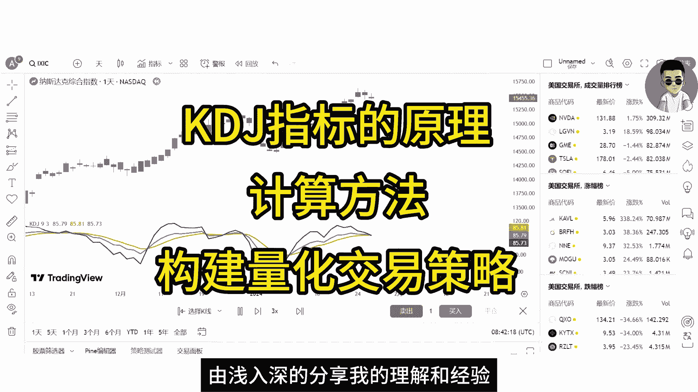
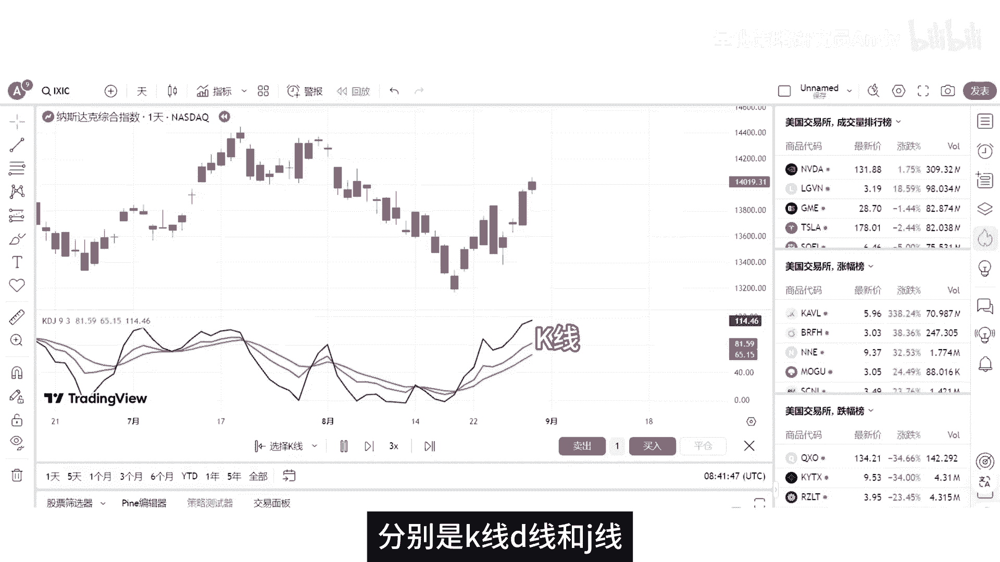
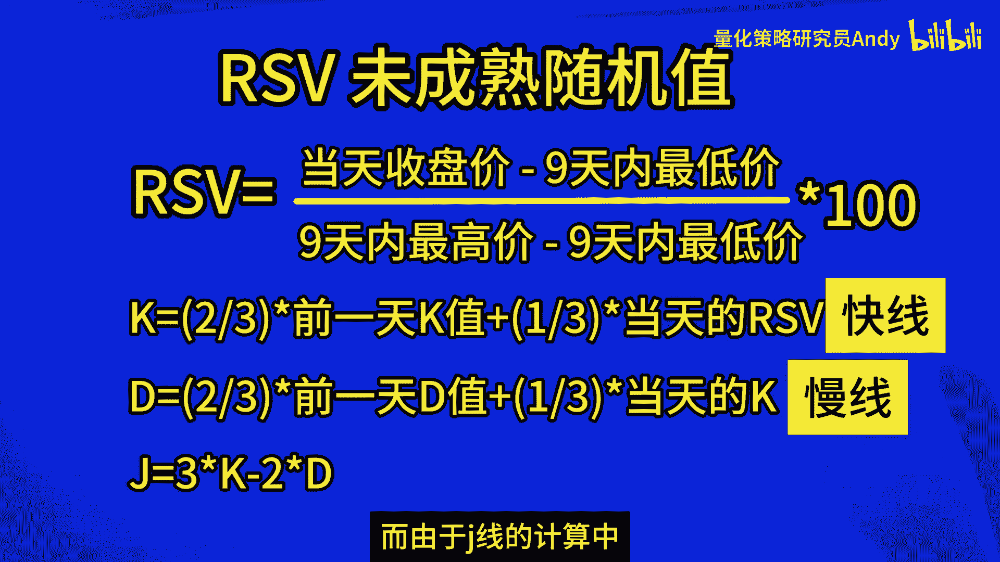
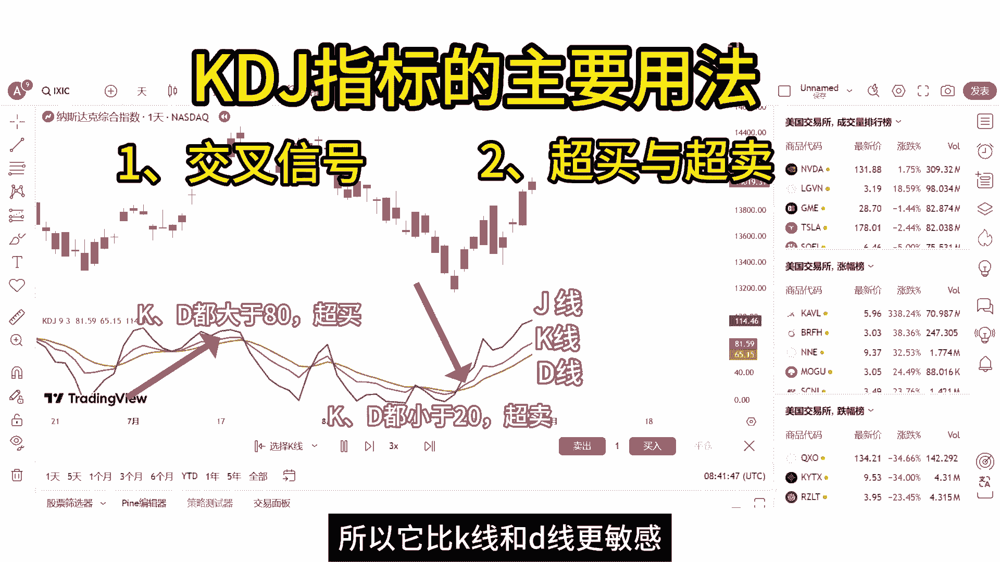
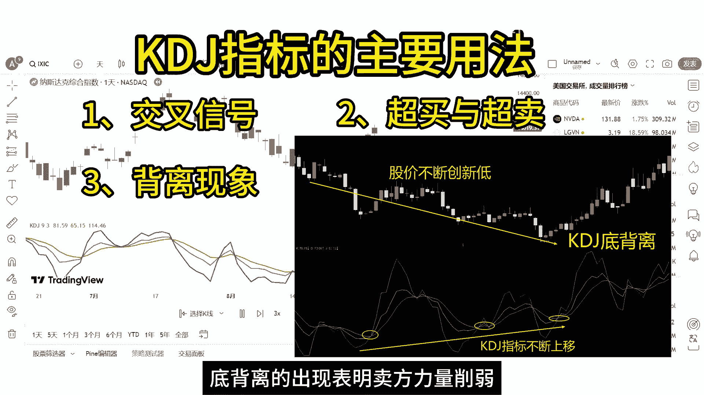
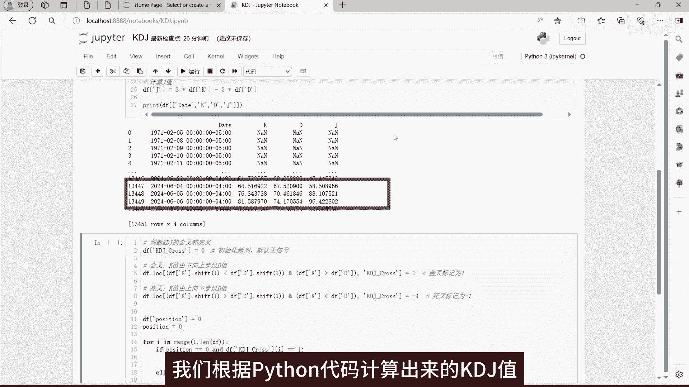
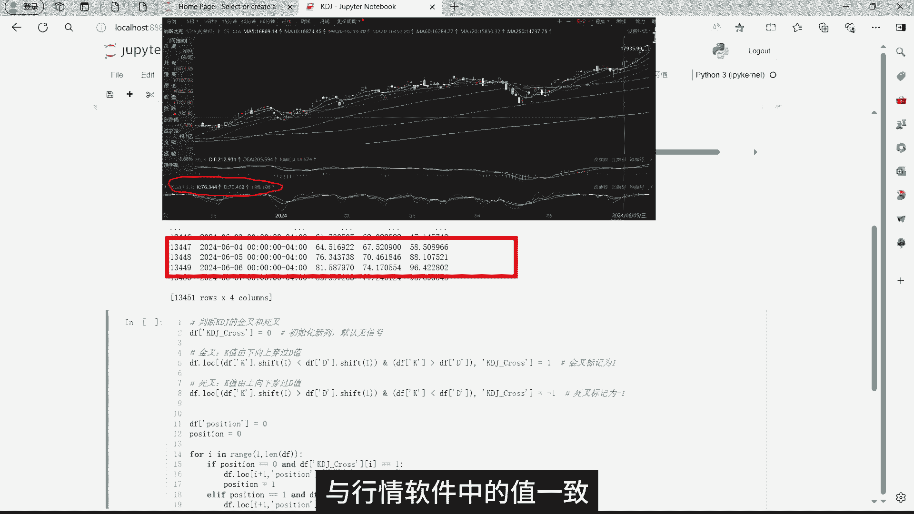
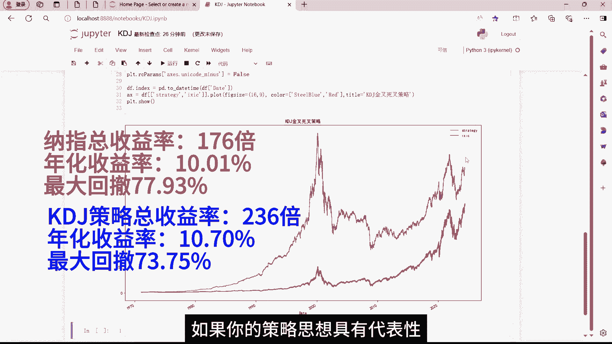

# 【技术分析入门】8分钟学会KDJ指标 ｜ Python量化策略验证KDJ指标的有效性。 - P1 - 量化策略研究员Andy - BV1Ps421M71F

我们在市场中经常听到这样一种说法，当KDJ指标金叉时买入股票未来大概率会上涨，当KDJ指标死叉时卖出股票，未来大概率会下跌，那这种说法是否靠谱，可信度有多高呢，在金融投资领域。

任何一种分析方法都不是绝对的，当然KDJ指标也不例外，本期视频我们将用量化数据来验证一下，这种主观的分析结论是否可靠，大家好，我是量化策略研究员ANDY，相信对于有一定交易经验的伙伴来说。

KDJ指标并不陌生，它是技术分析当中最常用到的指标，尤其在短线交易中备受青睐，在接下来的视频中，我将带领大家从KDJ指标的基本原理出发，逐步深入到他的计算方法，以及如何运用KDJ指标来构建量化交易策略。

并进行历史回测，我会从基础到高级，由浅入深的分享我的理解和经验。

KDJ指标又叫随机指标，最早起源于期货市场，由乔治莱恩博士在1950年代首创，后被广泛用于股市的中短期趋势分析，是期货和股票市场上最常用的技术分析工具。

KDJ是由三条线组成，分别是K线，D线和J线。

这三条线的计算方法如下，首先就是要先计算出RSV，中文称之为未成熟随机值，RSV等于当天的收盘价，减去最近九天的最低价，除以九天内的最高价，减去九天的最低价，再乘以100，RSV的取值范围是0~100。

它反映了价格在特定时间周期内的相对位置，是KDJ指标计算的基础，当RSV的值接近100时，表示当前收盘价接近周期内的最高价，市场可能处于超买状态，当RSV的值接近零时，表示当前收盘价接近周期内的最低价。

市场可能处于超卖状态，这里的超买超卖，通俗一点来说，超买就是指短期内大量买家涌入市场，推高了价格，市场参与者普遍乐观，而超卖指的是大量卖家抛售股票，价格在短期内下跌过快，市场参与者普遍悲观。

当有了RSV就能计算出K值，K值是等于前一天的K值乘以23，加上今天的RSV乘以13，D值是等于前一天的D值乘以23，加上今天的K值乘以13，以此类推，最后的J1值就是等于当天的K值乘以三。

减去当天的D值乘以二，K值的作用是对rs v做平滑处理，而D值是通过进一步平滑K值来得到的，K线通常被称为快线，D线是慢线，而由于G线的计算中。

K值被加全了三倍，而D值被减去了两倍，这使得G线对市场变化的反应速度，比K线和D线都要快，我们可以称之为超快线，总的来说，随机指标KDJ是以最高价，最低价及收盘价为基本数据进行计算得出的，K值。

D值和G值分别在指标的坐标上形成的一个点，连接无数个这样的点位，就形成一个完整的，能反映价格波动趋势的KDJ指标，它在设计过程中也融合了动量观念，强弱指标和移动平均线的一些优点。

因此能够比较迅速快捷直观地研判行情，在技术分析中，KDJ指标主要有以下几种用法，第一种是交叉信号，当K线从下方上穿地线时，称为黄金交叉，简称金叉，通常被视为买入信号，当K线从上方下穿D线时。

称为死亡交叉，简称死叉，通常被视为卖出信号，第二种是超买与超卖，当K值和D值都大于80时，市场处于超买状态，意味着价格可能过高，存在回调的风险，当K值和D值都小于20时，市场可能处于超卖状态。

意味着价格过低，存在反弹的机会，同时J线快速上升超过100或下降低于零时，也可以视为超买或者超卖，因为这线是超快线，所以它比K线和D线更敏感。

第三种是背离现象，当价格创新高，KDJ指标未能创新高，这被称为顶背离现象，通常预示着行情即将出现的趋势反转，当价格创新低，KDJ指标未能创新低时，这被称为底背离现象，底背离的出现表明卖方力量削弱。

离反弹行情不远了，接下来我们就用KDJ指标中最简单的金叉买入，死叉卖出策略对纳斯达克指数进行历史回测，下面我们来看一下Python代码，第一部分是获取那值每天的价格数据，然后计算KDJ的值。

这里的三个参数我们采用默认的参数933，接下来就是计算K值，我们使用EMA函数里面的参数，用M12减去一，这里的M1等于三，也就是5日的指数移动平均，刚才不是说K值是等于前一天的K值，乘以2/3。

加上今天的rs v乘以13吗，怎么这里又用5日的指数移动平均呢，我们来看下这个EMA的计算公式，当N等于50，我们把它展开，Y就等于23乘以Y撇，加上13乘以X，这里的Y撇就是前一天的K值。

X就是今天的RSV，关于EMA更详细的讲解，可以观看我主页的另一个视频，双均线策略深度解析，下面这里就是计算D值，算法跟计算K值是一样的，最后再计算G值，我们把计算好的KDJ值打印出来。

跟行情软件中的KDJ对比一下，看看我们计算的是否正确，因为KDJ的计算公式表面上看上去很简单，但是我们在编程计算的时候，还是比较容易出错的，尤其是对于一些刚入门的小伙伴，所以我们算好之后需要检查一遍。

我们筛选一天，比如说2024年6月5号，我们根据Python代码计算出来的KDJ值。

分别为76。34，70。4，六，88。10，与行情软件中的值一致。

接下来我们定义一列KDJ下划线，cross用来判断金叉和死叉，下面就是根据金叉死叉来构建交易信号，并计算策略的收益率，我们运行一下完整的代码，可以看到图中这条红色的曲线，是那只有史以来的走势。

图53年的时间，整体的收益率是176倍，年化收益率10。01%，最大回撤77。93%，图中这条蓝色的曲线就是KDJ策略的收益率，总收益率达到了236倍，年化收益率是10。07%。

但是这个策略在2000年的互联网泡沫，以及2008年的金融危机，最大回撤累计达到了73。75%，从以上数据可以看出，KDJ指标简单的金叉，死叉策略并没有获得显著的超额收益，反而还出现了巨大的回撤。

当然同期纳指的回撤更大，但是总体来看，这个策略只比那只稍微好一点点，仅仅只是一点点而已，对于其他指数的回测结果也是大同小异，我这里就不一一展示了，本期视频只是初步的研究。

主要是向大家介绍KDJ指标的概念和基本用法，以及如何通过Python编程实现简单的金叉死叉策略，如果大家有兴趣的话，可以尝试优化一下这个策略，比如把默认参数进行修改。

或者根据顶底背离以及低位钝化和高位钝化，又或者结合其他技术指标一起来构建策略，欢迎在评论区说出你的想法，如果你的策略思想具有代表性。

我将专门再做一期视频来帮你实现这个策略，好了，本期视频到此结束，我们下期再见。