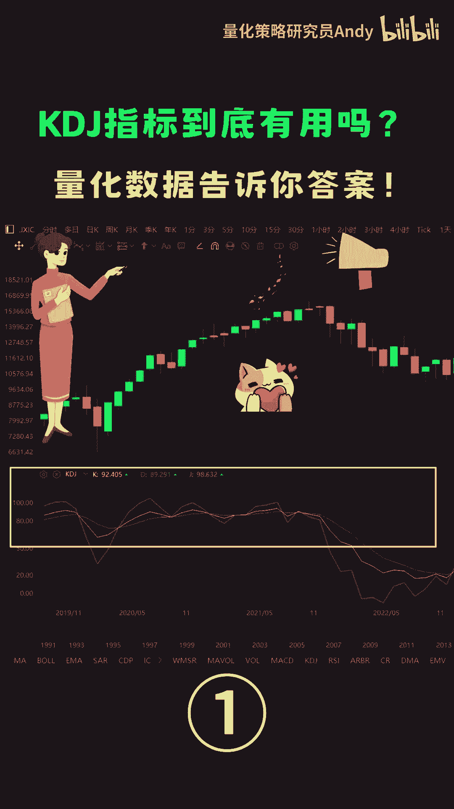
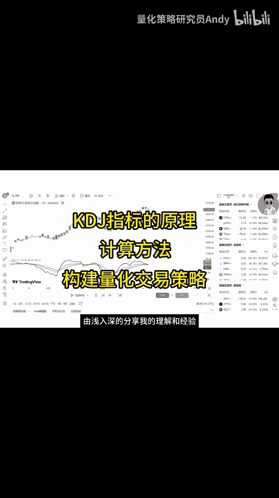

# 【技术分析入门】KDJ指标有用吗？量化数据告诉你答案！ - P1 - 量化策略研究员Andy - BV1gw4m1e78W

我们在市场中经常听到这样一种说法，当KDJ指标金叉时买入股票未来大概率会上涨，当KDJ指标死叉时卖出股票，未来大概率会下跌，那这种说法是否靠谱，可信度有多高呢，在金融投资领域。

任何一种分析方法都不是绝对的，当然KDJ指标也不例外，本期视频我们将用量化数据来验证一下，这种主观的分析结论是否可靠，大家好，我是量化策略研究员ANDY，相信对于有一定交易经验的伙伴来说。

KDJ指标并不陌生，它是技术分析当中最常用到的指标，尤其在短线交易中备受青睐，在接下来的视频中，我将带领大家从KDJ指标的基本原理出发，逐步深入到它的计算方法，以及如何运用KDJ指标来构建量化交易策略。

并进行历史回测，我会从基础到高级。

